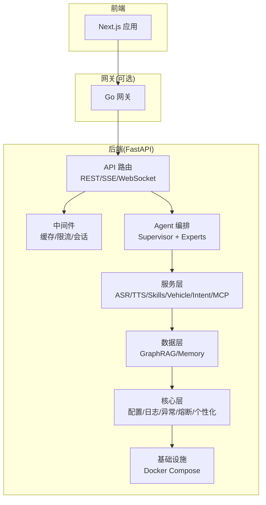
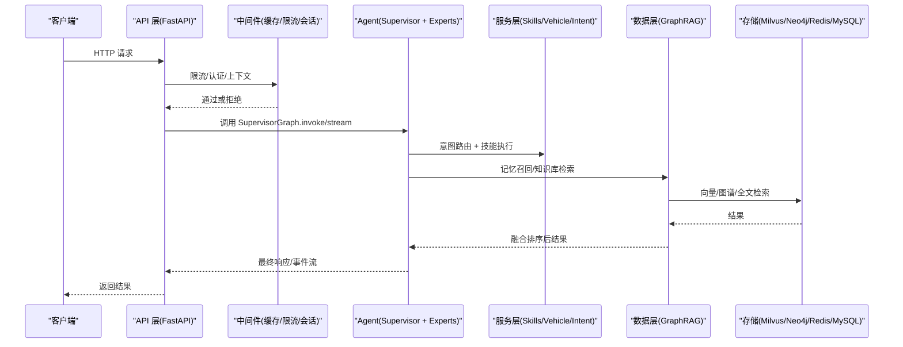
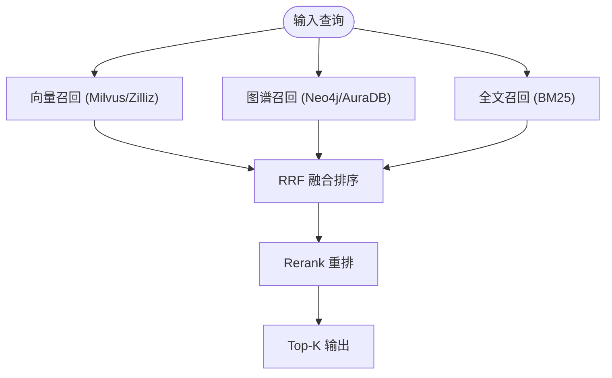
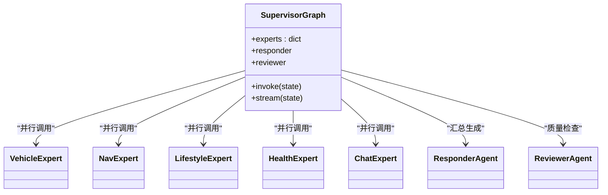
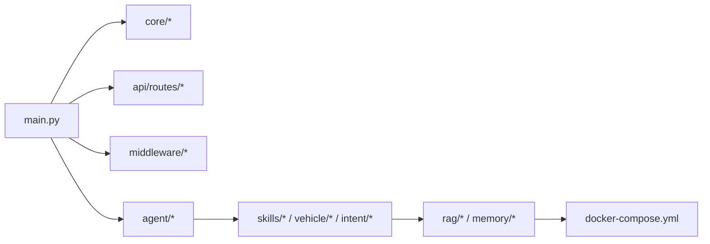

# 架构设计

<cite>
**本文引用的文件**   
- [backend_design/nexus/main.py](file://backend_design/nexus/main.py)
- [docs/内部开发存档文档/架构详细设计/README.md](file://docs/内部开发存档文档/架构详细设计/README.md)
- [Agent.md](file://Agent.md)
- [docs/内部开发存档文档/架构详细设计/L0-infrastructure.md](file://docs/内部开发存档文档/架构详细设计/L0-infrastructure.md)
- [docs/内部开发存档文档/架构详细设计/L1-core.md](file://docs/内部开发存档文档/架构详细设计/L1-core.md)
- [docs/内部开发存档文档/架构详细设计/L2-data.md](file://docs/内部开发存档文档/架构详细设计/L2-data.md)
- [docs/内部开发存档文档/架构详细设计/L3-service.md](file://docs/内部开发存档文档/架构详细设计/L3-service.md)
- [docs/内部开发存档文档/架构详细设计/L4-agent.md](file://docs/内部开发存档文档/架构详细设计/L4-agent.md)
- [docs/内部开发存档文档/架构详细设计/L5-middleware.md](file://docs/内部开发存档文档/架构详细设计/L5-middleware.md)
- [docs/内部开发存档文档/架构详细设计/L6-api.md](file://docs/内部开发存档文档/架构详细设计/L6-api.md)
- [docs/内部开发存档文档/架构详细设计/L7-observability.md](file://docs/内部开发存档文档/架构详细设计/L7-observability.md)
- [backend_design/nexus/agent/supervisor_graph.py](file://backend_design/nexus/agent/supervisor_graph.py)
- [backend_design/nexus/rag/retriever.py](file://backend_design/nexus/rag/retriever.py)
- [backend_design/nexus/vehicle/factory.py](file://backend_design/nexus/vehicle/factory.py)
</cite>

## 目录
1. [引言](#引言)
2. [项目结构](#项目结构)
3. [核心组件](#核心组件)
4. [架构总览](#架构总览)
5. [详细组件分析](#详细组件分析)
6. [依赖关系分析](#依赖关系分析)
7. [性能考量](#性能考量)
8. [故障排查指南](#故障排查指南)
9. [结论](#结论)
10. [附录](#附录)

## 引言
本文件面向架构师与高级开发者，系统化阐述 NexusCockpit 的 7 层分层架构（L0-L7），深入解释各层职责、组件交互与数据流向；重点剖析 Multi-Agent 工作流（Supervisor + 5 专家 Agent）、GraphRAG 三路融合检索（向量+图谱+全文）以及车控系统三模式适配（Mock/HTTP/MCP）。文档包含架构图、组件关系图与关键数据流图，并总结技术决策、权衡与约束。

## 项目结构
NexusCockpit 采用前后端分离与多模块组织：后端以 Python FastAPI 为主，Go 网关提供前置转发与鉴权；前端基于 Next.js 构建座舱控制台与运营看板。后端按 L0-L7 分层组织，Agent、RAG、Skills、Vehicle、Intent、Middleware、API、Observability 等子系统清晰解耦。

```mermaid
graph TB
subgraph "前端"
FE["Next.js 应用"]
end
subgraph "网关(可选)"
GW["Go 网关"]
end
subgraph "后端(FastAPI)"
API["API 路由<br/>REST/SSE/WebSocket"]
MW["中间件<br/>缓存/限流/会话"]
AG["Agent 编排<br/>Supervisor + Experts"]
SVC["服务层<br/>ASR/TTS/Skills/Vehicle/Intent/MCP"]
DATA["数据层<br/>GraphRAG/Memory"]
CORE["核心层<br/>配置/日志/异常/熔断/个性化"]
INF["基础设施<br/>Docker Compose"]
end
FE --> GW
GW --> API
API --> MW
API --> AG
AG --> SVC
SVC --> DATA
DATA --> CORE
CORE --> INF
```

**图表来源** 
- [backend_design/nexus/main.py:436-654](file://backend_design/nexus/main.py#L436-L654)
- [docs/内部开发存档文档/架构详细设计/README.md:23-36](file://docs/内部开发存档文档/架构详细设计/README.md#L23-L36)

**章节来源**
- [Agent.md:36-64](file://Agent.md#L36-L64)
- [docs/内部开发存档文档/架构详细设计/README.md:23-36](file://docs/内部开发存档文档/架构详细设计/README.md#L23-L36)

## 核心组件
- 应用入口与生命周期管理：FastAPI 应用创建、全局中间件、异常处理、资源初始化与清理。
- Multi-Agent 编排：Supervisor 调度器 + 5 个专家（车辆、导航、生活、健康、聊天）+ Responder + Reflection + Reviewer。
- GraphRAG 检索：向量（Milvus/Zilliz）、图谱（Neo4j/AuraDB）、BM25 全文检索三路召回，RRF 融合与 Rerank 重排。
- 车控适配器：Mock/HTTP/MCP 三模式统一抽象，支持多座舱隔离与参数安全校验。
- 中间件能力：Redis 语义缓存（KNN）、滑动窗口限流、会话持久化、异步任务。
- 可观测性：Langfuse 追踪、Prometheus 指标、Grafana 面板、结构化日志。

**章节来源**
- [backend_design/nexus/main.py:75-359](file://backend_design/nexus/main.py#L75-L359)
- [docs/内部开发存档文档/架构详细设计/L4-agent.md:27-86](file://docs/内部开发存档文档/架构详细设计/L4-agent.md#L27-L86)
- [docs/内部开发存档文档/架构详细设计/L2-data.md:90-134](file://docs/内部开发存档文档/架构详细设计/L2-data.md#L90-L134)
- [backend_design/nexus/vehicle/factory.py:38-122](file://backend_design/nexus/vehicle/factory.py#L38-L122)
- [docs/内部开发存档文档/架构详细设计/L5-middleware.md:13-58](file://docs/内部开发存档文档/架构详细设计/L5-middleware.md#L13-L58)
- [docs/内部开发存档文档/架构详细设计/L7-observability.md:13-54](file://docs/内部开发存档文档/架构详细设计/L7-observability.md#L13-L54)

## 架构总览
下图展示从请求进入 API 层到 Agent 编排、服务调用、数据检索与存储的全链路流程，体现 7 层协作关系。

```mermaid
sequenceDiagram
participant Client as "客户端"
participant API as "API 层(FastAPI)"
participant MW as "中间件(缓存/限流/会话)"
participant AG as "Agent(Supervisor + Experts)"
participant SVC as "服务层(Skills/Vehicle/Intent)"
participant RAG as "数据层(GraphRAG)"
participant DB as "存储(Milvus/Neo4j/Redis/MySQL)"
Client->>API : HTTP 请求
API->>MW : 限流/认证/上下文
MW-->>API : 通过或拒绝
API->>AG : 调用 SupervisorGraph.invoke/stream
AG->>SVC : 意图路由 + 技能执行
AG->>RAG : 记忆召回/知识库检索
RAG->>DB : 向量/图谱/全文检索
DB-->>RAG : 结果
RAG-->>AG : 融合排序后结果
AG-->>API : 最终响应/事件流
API-->>Client : 返回结果
```

**图表来源** 
- [backend_design/nexus/main.py:436-654](file://backend_design/nexus/main.py#L436-L654)
- [backend_design/nexus/agent/supervisor_graph.py:93-179](file://backend_design/nexus/agent/supervisor_graph.py#L93-L179)
- [backend_design/nexus/rag/retriever.py:48-140](file://backend_design/nexus/rag/retriever.py#L48-L140)

## 详细组件分析

### L0 基础设施层（Infrastructure）
- 职责：容器化编排 Milvus、Neo4j、Redis、MySQL、Prometheus、Grafana 等中间件，支持本地与云端双模式切换。
- 关键点：Volume 持久化、健康检查、一键启动/停止。

**章节来源**
- [docs/内部开发存档文档/架构详细设计/L0-infrastructure.md:1-75](file://docs/内部开发存档文档/架构详细设计/L0-infrastructure.md#L1-L75)

### L1 核心层（Core）
- 职责：配置中心（Pydantic Settings）、结构化日志、异常体系、熔断器、JWT 认证、个性化服务。
- 关键点：零业务逻辑、全局单例、路径解析、双模式部署开关。

**章节来源**
- [docs/内部开发存档文档/架构详细设计/L1-core.md:1-131](file://docs/内部开发存档文档/架构详细设计/L1-core.md#L1-L131)

### L2 数据层（Data）— GraphRAG 三路融合
- 职责：Embedding、向量库、知识图谱、BM25 全文检索、Rerank、Cherry 知识库、统一检索路由。
- 关键点：
  - 三路召回：向量（Milvus/Zilliz）、图谱（Neo4j/AuraDB）、BM25（langchain-community.BM25Retriever）。
  - 融合策略：RRF（Reciprocal Rank Fusion）排序。
  - 重排：bge-reranker-v2-m3 或硅基流动 API。
  - 渐进式披露与用户习惯注入。

```mermaid
flowchart TD
Start(["输入查询"]) --> Vec["向量召回 (Milvus/Zilliz)"]
Start --> Graph["图谱召回 (Neo4j/AuraDB)"]
Start --> BM25["全文召回 (BM25)"]
Vec --> Fuse["RRF 融合排序"]
Graph --> Fuse
BM25 --> Fuse
Fuse --> Rerank["Rerank 重排"]
Rerank --> TopK["Top-K 输出"]
```

**图表来源** 
- [backend_design/nexus/rag/retriever.py:48-140](file://backend_design/nexus/rag/retriever.py#L48-L140)
- [docs/内部开发存档文档/架构详细设计/L2-data.md:90-134](file://docs/内部开发存档文档/架构详细设计/L2-data.md#L90-L134)

**章节来源**
- [docs/内部开发存档文档/架构详细设计/L2-data.md:1-241](file://docs/内部开发存档文档/架构详细设计/L2-data.md#L1-L241)

### L3 服务层（Services）
- 职责：ASR/TTS、技能系统（19 个）、车控总线、意图路由、MCP 网关。
- 关键点：
  - 技能注册：装饰器自动发现 + 分组（VEHICLE/NAVIGATION/LIFESTYLE/HEALTH/CHAT）。
  - 车控适配器：Mock/HTTP/MCP 三模式统一抽象，工厂按需选择。
  - 意图路由：LLM→启发式→默认兜底三级降级。

**章节来源**
- [docs/内部开发存档文档/架构详细设计/L3-service.md:1-198](file://docs/内部开发存档文档/架构详细设计/L3-service.md#L1-L198)

### L4 Agent 层（Multi-Agent）
- 职责：Supervisor 调度 + 5 专家并行 + Responder 汇总 + Reflection 反思 + Reviewer 审查。
- 关键点：
  - 状态管理：TypedDict + Annotated reducer（列表拼接/字典合并）。
  - 并行执行：asyncio.gather 同时调用活跃专家。
  - 防漂移与安全：车控指令强制路由 vehicle 专家，沙箱枚举校验，副作用标记禁止缓存。
  - 流式优化：先生成完整回复 → 校验 → 再发送，防止未校验内容呈现。

```mermaid
classDiagram
class SupervisorGraph {
+invoke(state)
+stream(state)
+experts : dict
+responder
+reviewer
}
class VehicleExpert
class NavExpert
class LifestyleExpert
class HealthExpert
class ChatExpert
class ResponderAgent
class ReviewerAgent
SupervisorGraph --> VehicleExpert : "并行调用"
SupervisorGraph --> NavExpert : "并行调用"
SupervisorGraph --> LifestyleExpert : "并行调用"
SupervisorGraph --> HealthExpert : "并行调用"
SupervisorGraph --> ChatExpert : "并行调用"
SupervisorGraph --> ResponderAgent : "汇总生成"
SupervisorGraph --> ReviewerAgent : "质量检查"
```

**图表来源** 
- [backend_design/nexus/agent/supervisor_graph.py:93-179](file://backend_design/nexus/agent/supervisor_graph.py#L93-L179)
- [docs/内部开发存档文档/架构详细设计/L4-agent.md:128-175](file://docs/内部开发存档文档/架构详细设计/L4-agent.md#L128-L175)

**章节来源**
- [docs/内部开发存档文档/架构详细设计/L4-agent.md:1-295](file://docs/内部开发存档文档/架构详细设计/L4-agent.md#L1-L295)

### L5 中间件层（Middleware）
- 职责：Redis 语义缓存（KNN）、滑动窗口限流、会话存储、异步任务。
- 关键点：
  - 语义缓存：RediSearch KNN 向量检索 O(log n)，TTL 分级，副作用隔离（车控不缓存）。
  - 限流：Lua 脚本原子化滑动窗口。
  - 会话：Redis 持久化，不可用时降级内存。

**章节来源**
- [docs/内部开发存档文档/架构详细设计/L5-middleware.md:1-154](file://docs/内部开发存档文档/架构详细设计/L5-middleware.md#L1-L154)

### L6 API 层（API Gateway）
- 职责：REST/SSE/WebSocket、JWT 认证、全局异常处理、静态资源挂载。
- 关键点：
  - 路由分组：chat/vehicle/auth/admin/cockpit/dataplatform/middleware/settings/asr/ws。
  - 统一响应格式：成功/错误结构一致。
  - 中间件：CORS、Timing、Exception、Metrics。

**章节来源**
- [docs/内部开发存档文档/架构详细设计/L6-api.md:1-253](file://docs/内部开发存档文档/架构详细设计/L6-api.md#L1-L253)

### L7 可观测层（Observability）
- 职责：Langfuse 追踪、Prometheus 指标、Grafana 面板、结构化日志。
- 关键点：
  - 追踪点覆盖：API 入口、Agent 节点、LLM 调用、RAG 检索、技能执行、缓存命中。
  - 指标自解释：名称清晰便于查询。
  - 非侵入：装饰器实现，不可用时自动降级。

**章节来源**
- [docs/内部开发存档文档/架构详细设计/L7-observability.md:1-134](file://docs/内部开发存档文档/架构详细设计/L7-observability.md#L1-L134)

## 依赖关系分析
- 应用入口 main.py 负责全量组件初始化与路由注册，贯穿 L1-L7。
- Agent 层依赖 IntentRouter、MemoryManager、SkillRegistry，并通过 NodeContext 共享依赖。
- Data 层通过工厂模式选择具体实现（Milvus/Zilliz、Neo4j/AuraDB、Reranker 本地/云端）。
- Vehicle 适配器根据环境变量动态选择 Mock/HTTP/MCP，支持多座舱隔离。

```mermaid
graph LR
Main["main.py"] --> Core["core/*"]
Main --> API["api/routes/*"]
Main --> MW["middleware/*"]
Main --> AG["agent/*"]
AG --> SVC["skills/* / vehicle/* / intent/*"]
SVC --> DATA["rag/* / memory/*"]
DATA --> INF["docker-compose.yml"]
```

**图表来源** 
- [backend_design/nexus/main.py:436-654](file://backend_design/nexus/main.py#L436-L654)
- [backend_design/nexus/agent/supervisor_graph.py:93-179](file://backend_design/nexus/agent/supervisor_graph.py#L93-L179)
- [backend_design/nexus/rag/retriever.py:48-140](file://backend_design/nexus/rag/retriever.py#L48-L140)
- [backend_design/nexus/vehicle/factory.py:38-122](file://backend_design/nexus/vehicle/factory.py#L38-L122)

**章节来源**
- [backend_design/nexus/main.py:436-654](file://backend_design/nexus/main.py#L436-L654)

## 性能考量
- GraphRAG 三路召回 + RRF 融合 + Rerank 提升召回精度与相关性，但增加延迟；可通过关闭 BM25/Rerank 降级。
- Redis 语义缓存使用 KNN 向量检索 O(log n)，显著降低重复查询延迟；副作用隔离避免车控指令误命中。
- Agent 并行执行减少端到端时延；流式“先完整生成后校验”保障用户体验与安全性。
- 中间件限流保护后端；熔断器保护外部 LLM/云服务。

[本节为通用指导，无需特定文件引用]

## 故障排查指南
- 启动阶段：检查 LLM API Key、Milvus/Neo4j/Redis 连接；若失败记录警告但不阻塞启动。
- 缓存问题：确认 RediSearch 可用性与相似度阈值；车控指令 has_side_effect=True 不应命中缓存。
- Agent 路由：核查意图路由优先级与防漂移机制；检查 SkillGroup 分组与工具名匹配。
- 车控适配：验证 VEHICLE_ADAPTER 配置与 MCP 命令解析；Mock 模式下多座舱状态隔离。
- 可观测性：查看 Langfuse 追踪链路与 Prometheus 指标定位瓶颈。

**章节来源**
- [backend_design/nexus/main.py:75-359](file://backend_design/nexus/main.py#L75-L359)
- [docs/内部开发存档文档/架构详细设计/L5-middleware.md:13-58](file://docs/内部开发存档文档/架构详细设计/L5-middleware.md#L13-L58)
- [docs/内部开发存档文档/架构详细设计/L4-agent.md:176-295](file://docs/内部开发存档文档/架构详细设计/L4-agent.md#L176-L295)
- [backend_design/nexus/vehicle/factory.py:86-122](file://backend_design/nexus/vehicle/factory.py#L86-L122)
- [docs/内部开发存档文档/架构详细设计/L7-observability.md:35-54](file://docs/内部开发存档文档/架构详细设计/L7-observability.md#L35-L54)

## 结论
NexusCockpit 通过清晰的 7 层分层架构实现了高内聚、低耦合的系统设计。Multi-Agent 工作流提升了复杂任务的协同处理能力；GraphRAG 三路融合检索兼顾语义理解与精确匹配；车控三模式适配满足开发与生产环境的灵活切换。结合中间件与可观测性能力，系统在稳定性、性能与可维护性方面具备工程级水准。

[本节为总结性内容，无需特定文件引用]

## 附录
- 快速启动命令与端口说明见 L0 基础设施文档。
- 前后端联调与验证步骤见 L6 API 文档。
- 监控面板访问与指标含义见 L7 可观测文档。

[本节为补充信息，无需特定文件引用]