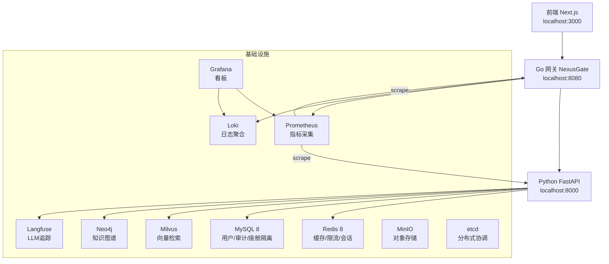
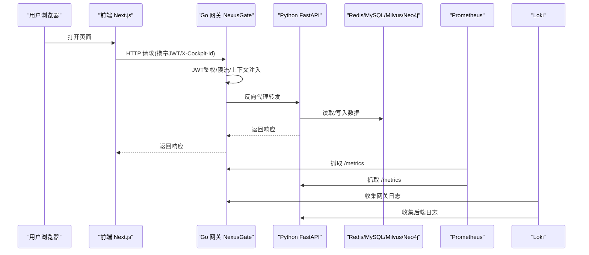
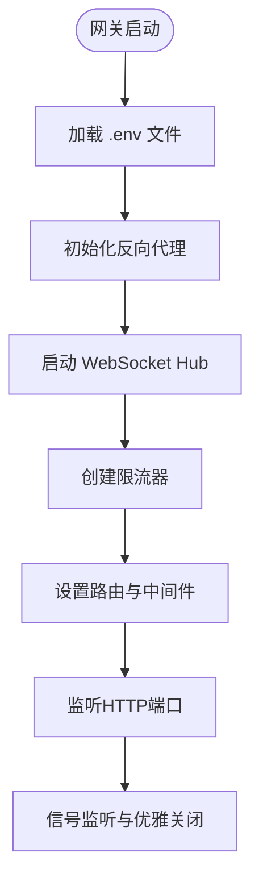
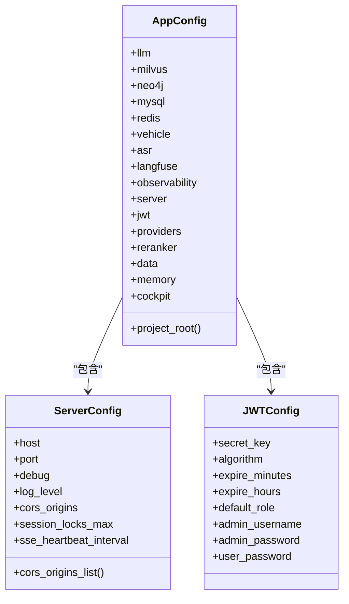
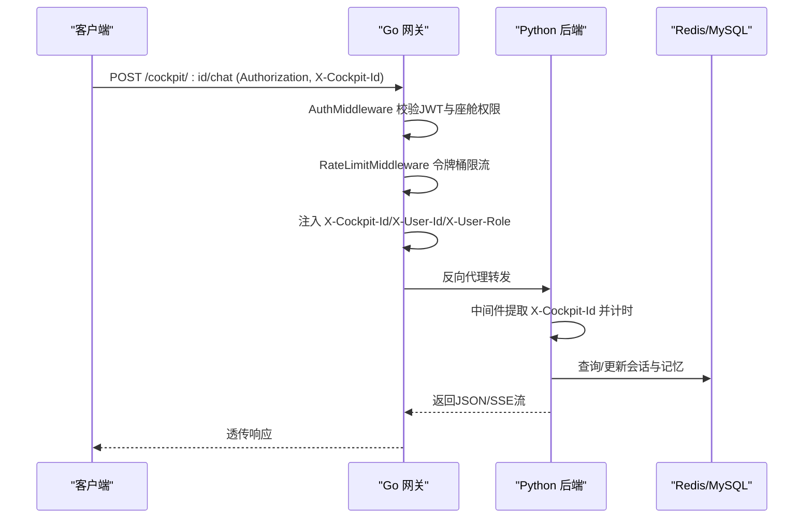
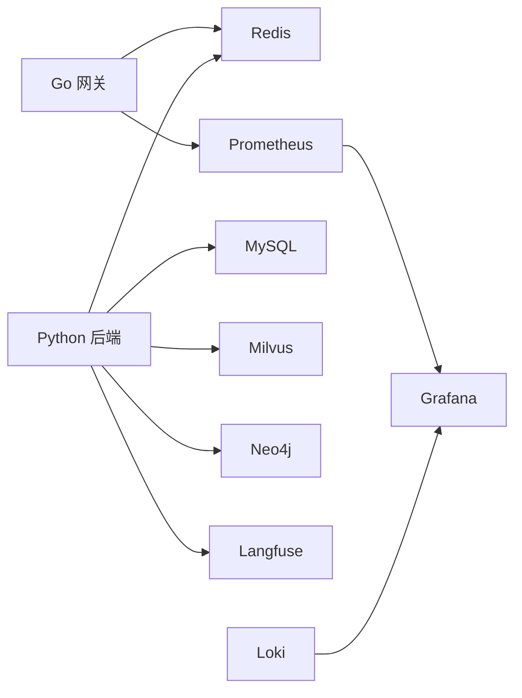
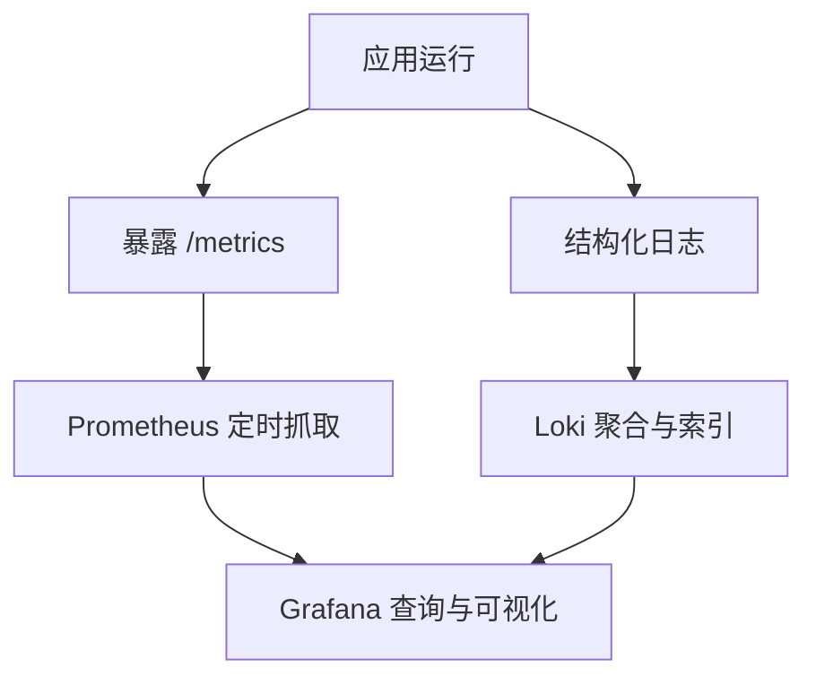
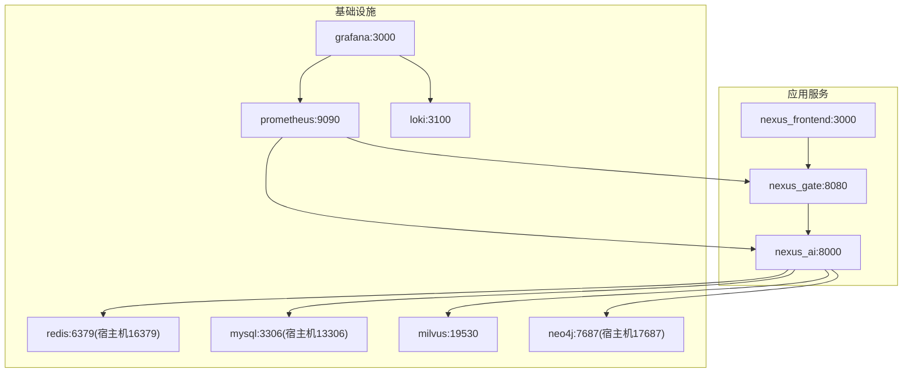

# 系统集成架构

<cite>
**本文引用的文件**   
- [docker-compose.yml](file://docker-compose.yml)
- [main.go](file://backend_design/nexus_gate/cmd/main.go)
- [config.go](file://backend_design/nexus_gate/internal/config/config.go)
- [proxy.go](file://backend_design/nexus_gate/internal/proxy/proxy.go)
- [router.go](file://backend_design/nexus_gate/internal/router/router.go)
- [main.py](file://backend_design/nexus/main.py)
- [__init__.py](file://backend_design/nexus/config/__init__.py)
- [server.py](file://backend_design/nexus/config/server.py)
- [prometheus.yml](file://config/prometheus/prometheus.yml)
- [prometheus.yml（Grafana数据源）](file://config/grafana/provisioning/datasources/prometheus.yml)
- [loki-config.yml](file://config/loki/loki-config.yml)
- [nexuscockpit-overview.json](file://config/grafana/provisioning/dashboards/nexuscockpit-overview.json)
</cite>

## 目录
1. [简介](#简介)
2. [项目结构](#项目结构)
3. [核心组件](#核心组件)
4. [架构总览](#架构总览)
5. [详细组件分析](#详细组件分析)
6. [依赖关系分析](#依赖关系分析)
7. [性能与可观测性](#性能与可观测性)
8. [部署与配置管理](#部署与配置管理)
9. [故障排查指南](#故障排查指南)
10. [结论](#结论)

## 简介
本文件为 NexusCockpit 的系统集成架构文档，聚焦前后端分离、Go 并发网关与 Python 后端服务的协作机制、Docker Compose 编排拓扑、监控体系（Prometheus/Grafana/Loki）以及配置与环境变量策略。文档面向不同技术背景的读者，提供从高层概览到代码级细节的渐进式说明，并附带架构图、时序图与流程图，帮助快速理解与排障。

## 项目结构
NexusCockpit 采用“前端 Next.js + Go 网关 + Python FastAPI”的分层架构：
- 前端（Next.js）通过浏览器访问网关端口，统一走网关鉴权、限流与反向代理。
- Go 网关（NexusGate）负责 JWT 鉴权、座舱级限流、WebSocket Hub、指标采集与请求转发。
- Python 后端（FastAPI）承载 AI Agent、车控、ASR/TTS、会话与中间件状态等能力，暴露 /metrics 供 Prometheus 抓取。
- 基础设施：Redis、MySQL、Milvus、Neo4j、MinIO、etcd、Langfuse、Loki、Prometheus、Grafana。

**图表来源** 
- [docker-compose.yml:1-292](file://docker-compose.yml#L1-L292)
- [prometheus.yml:1-35](file://config/prometheus/prometheus.yml#L1-L35)
- [prometheus.yml（Grafana数据源）:1-14](file://config/grafana/provisioning/datasources/prometheus.yml#L1-L14)
- [loki-config.yml:1-56](file://config/loki/loki-config.yml#L1-L56)

**章节来源**
- [docker-compose.yml:1-292](file://docker-compose.yml#L1-L292)

## 核心组件
- Go 网关（NexusGate）
  - 入口与启动流程：加载 .env → 初始化反向代理 → 启动 WebSocket Hub → 创建限流器 → 设置路由 → 启动 HTTP 服务 → 优雅关闭。
  - 路由分发：区分 Go 原生处理（健康检查、鉴权、数据中台部分接口、设置中心列表）与 AI 请求转发（对话、车控、ASR/TTS、WebSocket）。
  - 鉴权与限流：JWT 校验、座舱级令牌桶限流、可选鉴权中间件。
  - 反向代理：注入租户上下文头、清理上游 CORS 头、错误处理（502 友好响应）。
- Python 后端（FastAPI）
  - 应用生命周期：初始化日志、指标、Embedding/向量库/图谱/车控适配器、语义缓存、限流器、会话存储、Agent 工作流、数据库连接、Langfuse、数据保留策略、MCP Server、提醒扫描、ASR/TTS 模型后台预加载。
  - 异常与指标：统一异常格式、Prometheus 指标挂载、CORS、中间件注入 X-Cockpit-Id 与计时。
- 监控与日志
  - Prometheus 抓取 Go 网关与 Python 后端 /metrics；Grafana 自动注册数据源与仪表盘；Loki 集中收集日志。

**章节来源**
- [main.go:1-202](file://backend_design/nexus_gate/cmd/main.go#L1-L202)
- [router.go:1-508](file://backend_design/nexus_gate/internal/router/router.go#L1-L508)
- [proxy.go:1-90](file://backend_design/nexus_gate/internal/proxy/proxy.go#L1-L90)
- [main.py:1-673](file://backend_design/nexus/main.py#L1-L673)

## 架构总览
系统采用“前端→网关→后端”的前后端分离模式，网关承担安全与流量治理，后端专注业务与 AI 能力。所有外部请求统一进入网关，由网关完成鉴权、限流、上下文注入后转发至后端。监控与日志通过独立组件采集与展示。

**图表来源** 
- [router.go:1-508](file://backend_design/nexus_gate/internal/router/router.go#L1-L508)
- [proxy.go:1-90](file://backend_design/nexus_gate/internal/proxy/proxy.go#L1-L90)
- [main.py:1-673](file://backend_design/nexus/main.py#L1-L673)
- [prometheus.yml:1-35](file://config/prometheus/prometheus.yml#L1-L35)

## 详细组件分析

### Go 网关（NexusGate）
- 启动与配置
  - 支持命令行参数 --env 指定 .env 路径，自动回退查找 .env.local/.env。
  - 日志输出到 logs/go_logs/gateway_*.log，支持环境变量 LOG_DIR 覆盖。
  - 配置项包括网关地址、AI 后端地址、JWT、Redis、RBAC、CORS、限流 QPS、座舱数量、中间件健康检查、语音阈值、Prometheus URL、主题与名称等。
- 路由与中间件
  - 自定义 Recovery 中间件避免误捕获 http.ErrAbortHandler。
  - CORS 白名单按 Origin 精确回显，支持多域名逗号分隔。
  - Prometheus 指标中间件记录请求数与耗时，标签包含 method/path/status/cockpit_id。
  - 鉴权中间件：强制或可选 JWT 校验，解析 claims 并注入上下文。
  - 限流中间件：基于座舱 ID 与优先级（高/普通/低）进行令牌桶限流。
- 反向代理
  - 注入 X-Forwarded-By、X-Forwarded-Host、X-Forwarded-For。
  - 剥离上游 CORS 头，避免重复导致浏览器拒绝。
  - 错误处理：客户端断开静默处理，AI 不可用返回 502 JSON。
- WebSocket Hub
  - 管理千级连接，统计活跃连接数指标。

**图表来源** 
- [main.go:1-202](file://backend_design/nexus_gate/cmd/main.go#L1-L202)
- [config.go:1-218](file://backend_design/nexus_gate/internal/config/config.go#L1-L218)
- [router.go:1-508](file://backend_design/nexus_gate/internal/router/router.go#L1-L508)
- [proxy.go:1-90](file://backend_design/nexus_gate/internal/proxy/proxy.go#L1-L90)

**章节来源**
- [main.go:1-202](file://backend_design/nexus_gate/cmd/main.go#L1-L202)
- [config.go:1-218](file://backend_design/nexus_gate/internal/config/config.go#L1-L218)
- [router.go:1-508](file://backend_design/nexus_gate/internal/router/router.go#L1-L508)
- [proxy.go:1-90](file://backend_design/nexus_gate/internal/proxy/proxy.go#L1-L90)

### Python 后端（FastAPI）
- 应用生命周期
  - 启动时初始化日志、指标、Embedding、向量库、图谱、车控适配器、语义缓存、限流器、会话存储、Agent 工作流、数据库连接、Langfuse、数据保留策略、MCP Server、提醒扫描、ASR/TTS 模型后台预加载。
  - 关闭时有序释放资源（子进程、任务池、连接等）。
- 路由与中间件
  - 挂载多个路由组：health/auth/chat/vehicle/admin/cockpit/dataplatform/middleware/settings/asr/ws。
  - 挂载 /metrics 供 Prometheus 抓取。
  - 静态文件挂载 /audio/music。
  - 全局异常处理器统一错误格式，含限流、认证、校验失败与兜底异常。
  - ASGI 中间件提取 X-Cockpit-Id、计时并记录 Prometheus 指标。
- 配置管理
  - 使用 Pydantic Settings 聚合各子系统配置，支持 .env 文件与环境变量覆盖。
  - 服务器配置包含监听地址/端口、调试模式、日志级别、CORS 来源、会话锁上限、SSE 心跳间隔等。
  - JWT 配置包含密钥、算法、过期时间、默认角色与管理员/用户口令。

**图表来源** 
- [__init__.py:1-167](file://backend_design/nexus/config/__init__.py#L1-L167)
- [server.py:1-61](file://backend_design/nexus/config/server.py#L1-L61)

**章节来源**
- [main.py:1-673](file://backend_design/nexus/main.py#L1-L673)
- [__init__.py:1-167](file://backend_design/nexus/config/__init__.py#L1-L167)
- [server.py:1-61](file://backend_design/nexus/config/server.py#L1-L61)

### 请求转发与鉴权流程（网关→后端）

**图表来源** 
- [router.go:1-508](file://backend_design/nexus_gate/internal/router/router.go#L1-L508)
- [proxy.go:1-90](file://backend_design/nexus_gate/internal/proxy/proxy.go#L1-L90)
- [main.py:1-673](file://backend_design/nexus/main.py#L1-L673)

## 依赖关系分析
- 服务依赖
  - Go 网关依赖 Redis（限流/会话）、Prometheus（指标查询）。
  - Python 后端依赖 Redis（缓存/限流/会话）、MySQL（用户/审计/座舱）、Milvus（向量检索）、Neo4j（知识图谱）、Langfuse（LLM追踪）。
  - 基础设施：etcd（Milvus 元数据）、MinIO（对象存储）、Postgres（Langfuse DB）。
- 监控依赖
  - Prometheus 抓取 Go 网关与 Python 后端 /metrics。
  - Grafana 自动注册 Prometheus 数据源与仪表盘。
  - Loki 集中收集日志，Grafana 可联动查询。

**图表来源** 
- [docker-compose.yml:1-292](file://docker-compose.yml#L1-L292)
- [prometheus.yml:1-35](file://config/prometheus/prometheus.yml#L1-L35)
- [prometheus.yml（Grafana数据源）:1-14](file://config/grafana/provisioning/datasources/prometheus.yml#L1-L14)
- [loki-config.yml:1-56](file://config/loki/loki-config.yml#L1-L56)

**章节来源**
- [docker-compose.yml:1-292](file://docker-compose.yml#L1-L292)

## 性能与可观测性
- 指标采集
  - Go 网关：HTTP 请求总数、耗时直方图、WebSocket 活跃连接数。
  - Python 后端：请求计数与延迟直方图、语义缓存命中率、P95 延迟等。
  - Prometheus 抓取间隔 15s，目标包括网关、后端、Milvus 与自身。
- 日志聚合
  - Loki 单机模式，文件系统存储，保留 168h，启用结果缓存与压缩。
- 看板与告警
  - Grafana 自动注册 Prometheus 数据源，内置“NexusCockpit Overview”仪表盘，展示 API 请求总数、P95 延迟、缓存命中率等关键指标。

**图表来源** 
- [prometheus.yml:1-35](file://config/prometheus/prometheus.yml#L1-L35)
- [loki-config.yml:1-56](file://config/loki/loki-config.yml#L1-L56)
- [nexuscockpit-overview.json:1-200](file://config/grafana/provisioning/dashboards/nexuscockpit-overview.json#L1-L200)

**章节来源**
- [prometheus.yml:1-35](file://config/prometheus/prometheus.yml#L1-L35)
- [loki-config.yml:1-56](file://config/loki/loki-config.yml#L1-L56)
- [nexuscockpit-overview.json:1-200](file://config/grafana/provisioning/dashboards/nexuscockpit-overview.json#L1-L200)

## 部署与配置管理
- Docker Compose 编排
  - 应用服务：nexus_gate（Go 网关）、nexus_ai（Python 后端）、nexus_frontend（Next.js）。
  - 基础设施：etcd、minio、milvus、neo4j、redis、mysql、langfuse-db/langfuse、loki、prometheus、grafana。
  - 健康检查：网关与健康检查、后端健康检查、各中间件健康检查。
  - 端口映射：网关 8080、后端 8000、前端 3000、Redis 16379、MySQL 13306、Neo4j 17687、Milvus 19530、Loki 3100、Prometheus 9090、Grafana 3000。
- 环境变量与 .env
  - 网关：NEXUS_GATE_HOST/NEXUS_GATE_PORT、NEXUS_AI_HOST/NEXUS_AI_PORT、REDIS_*、JWT_SECRET/JWT_EXPIRE_HOURS、RATE_LIMIT_QPS、COCKPIT_COUNT、CORS_ORIGINS、PROMETHEUS_URL 等。
  - 后端：MILVUS_*、NEO4J_URI、REDIS_*、HOST/PORT/DEBUG/LOG_LEVEL/CORS_ORIGINS、JWT_SECRET_KEY/RBAC_* 等。
  - 前端：NEXT_PUBLIC_API_URL=http://localhost:8080。
- 监控与日志配置
  - Prometheus：抓取网关与后端 /metrics，Milvus 与自身指标。
  - Grafana：自动注册 Prometheus 数据源与仪表盘。
  - Loki：本地配置文件挂载，保留 168h，启用压缩与缓存。

**图表来源** 
- [docker-compose.yml:1-292](file://docker-compose.yml#L1-L292)
- [prometheus.yml:1-35](file://config/prometheus/prometheus.yml#L1-L35)
- [prometheus.yml（Grafana数据源）:1-14](file://config/grafana/provisioning/datasources/prometheus.yml#L1-L14)
- [loki-config.yml:1-56](file://config/loki/loki-config.yml#L1-L56)

**章节来源**
- [docker-compose.yml:1-292](file://docker-compose.yml#L1-L292)

## 故障排查指南
- 网关侧
  - 健康检查失败：确认 /health 可达，检查 Redis 连通性与限流器初始化。
  - 鉴权失败：核对 JWT_SECRET 与 JWT_EXPIRE_HOURS，确保前端 Authorization 头正确。
  - 反向代理错误：查看 ErrorHandler 是否返回 502，检查 Python 后端健康与网络连通。
  - 指标缺失：确认 /metrics 可被 Prometheus 抓取，检查端口与防火墙。
- 后端侧
  - 启动缓慢：ASR/TTS 模型后台预加载，首次请求可能较慢属正常。
  - 中间件不可用：检查 Redis/MySQL/Milvus/Neo4j 健康检查与端口映射。
  - 指标不更新：确认 /metrics 挂载与 Prometheus scrape 配置。
  - 日志缺失：检查日志文件路径与 Loki 配置，确认容器卷挂载。
- 监控与日志
  - Prometheus 无数据：检查 targets 与 metrics_path，确认 host.docker.internal 可达。
  - Grafana 看板空白：确认数据源已注册且可连接，检查仪表盘 JSON 是否正确挂载。
  - Loki 日志过多：调整 retention_period 与 compactor 配置，避免磁盘增长。

**章节来源**
- [router.go:1-508](file://backend_design/nexus_gate/internal/router/router.go#L1-L508)
- [proxy.go:1-90](file://backend_design/nexus_gate/internal/proxy/proxy.go#L1-L90)
- [main.py:1-673](file://backend_design/nexus/main.py#L1-L673)
- [prometheus.yml:1-35](file://config/prometheus/prometheus.yml#L1-L35)
- [loki-config.yml:1-56](file://config/loki/loki-config.yml#L1-L56)

## 结论
NexusCockpit 通过 Go 网关与 Python 后端的清晰分层，实现了高内聚、低耦合的系统集成。网关承担安全与流量治理，后端专注 AI 与业务逻辑，配合完善的监控与日志体系，形成可观测、可扩展、易运维的整体方案。借助 Docker Compose 一键编排与统一配置管理，可在开发、测试与生产环境快速落地与迭代。