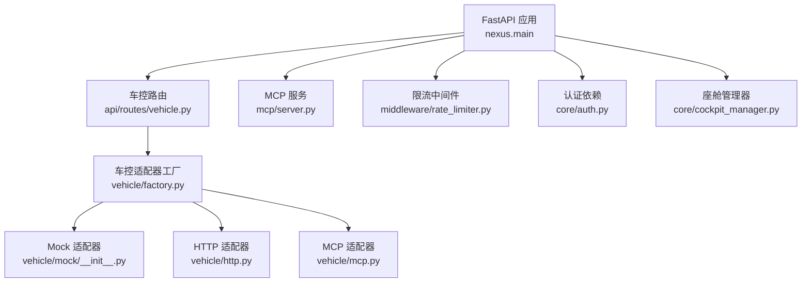
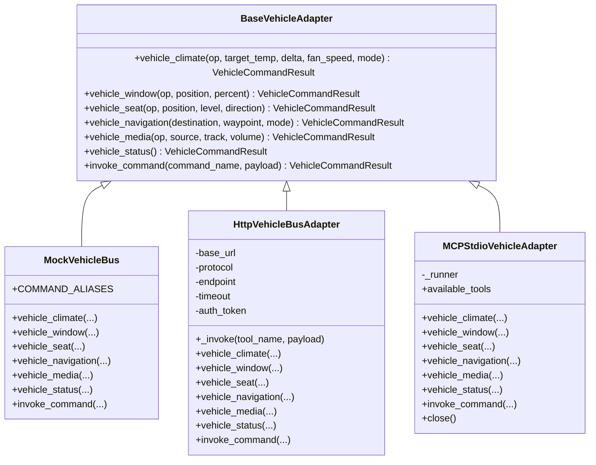
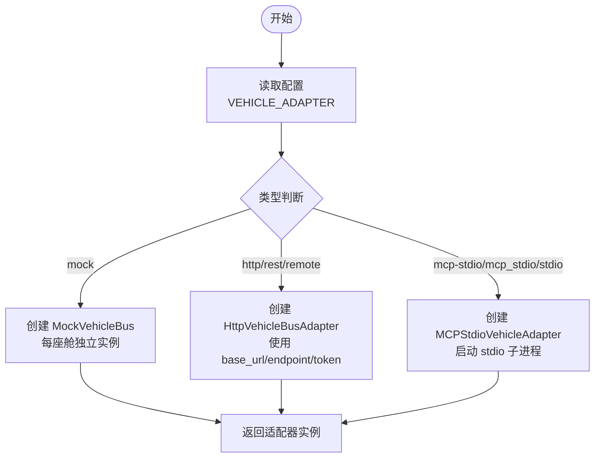
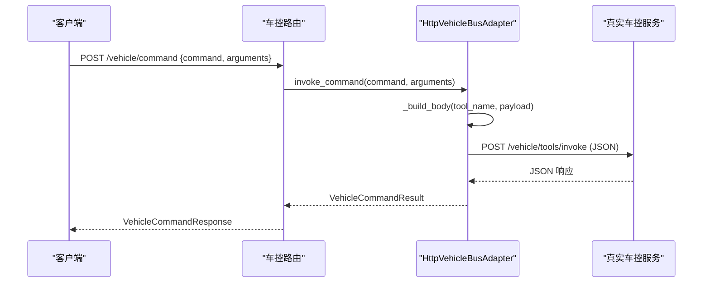
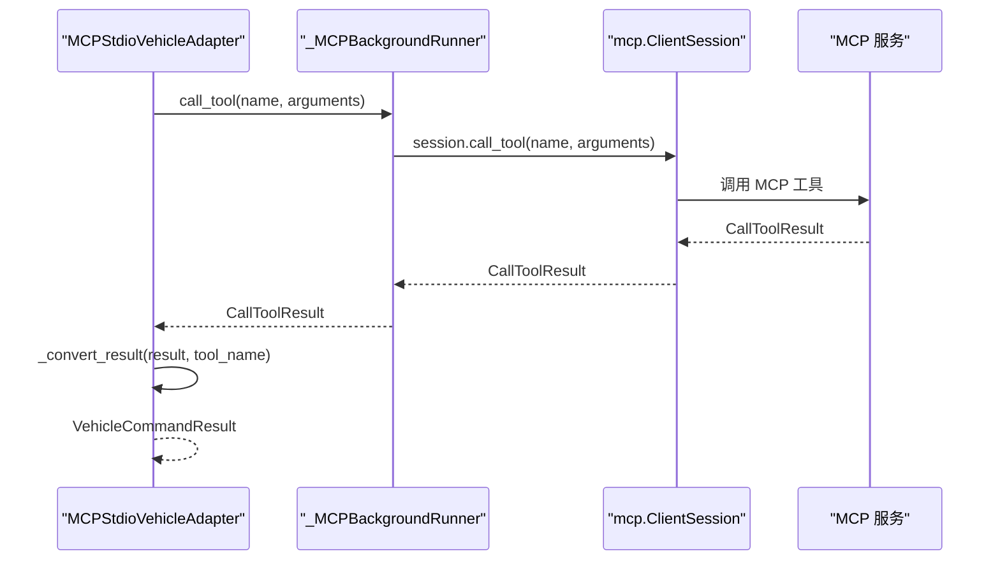
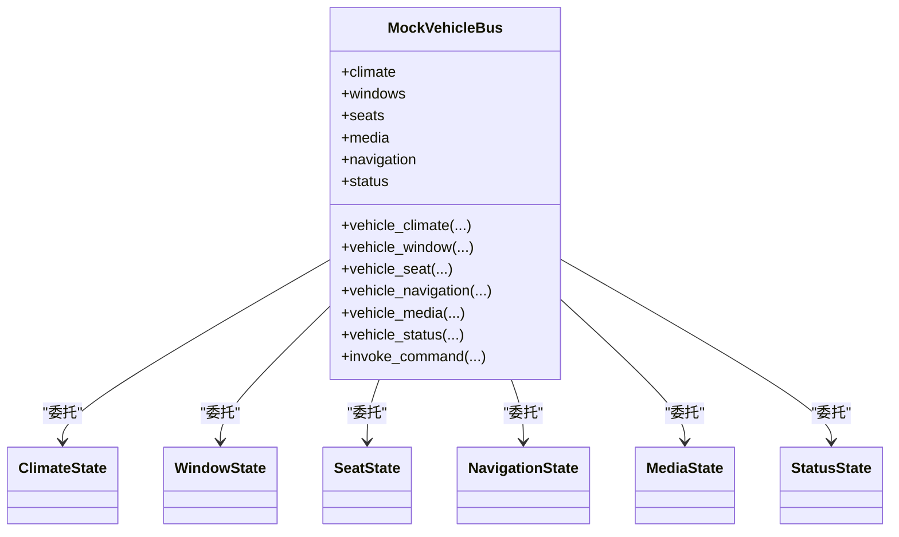
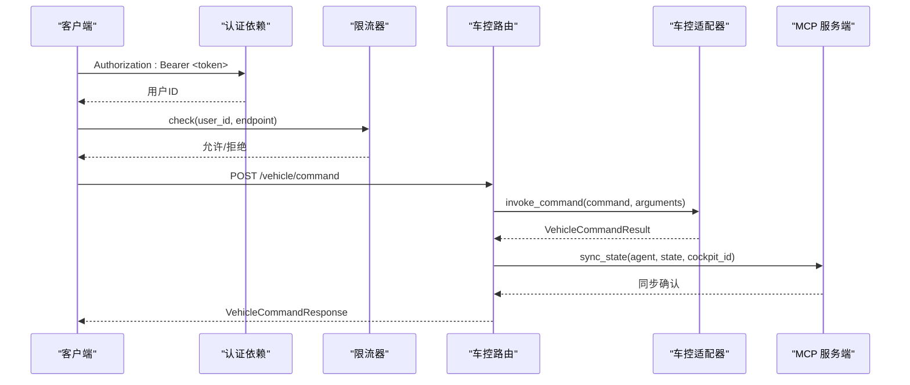
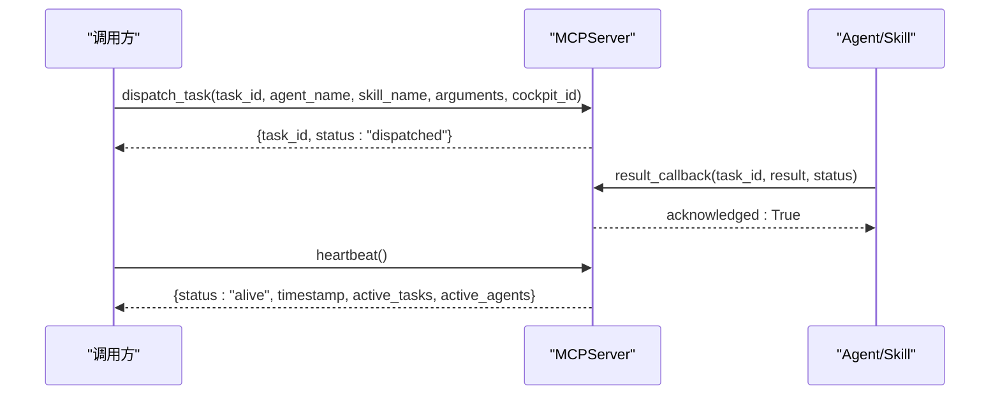
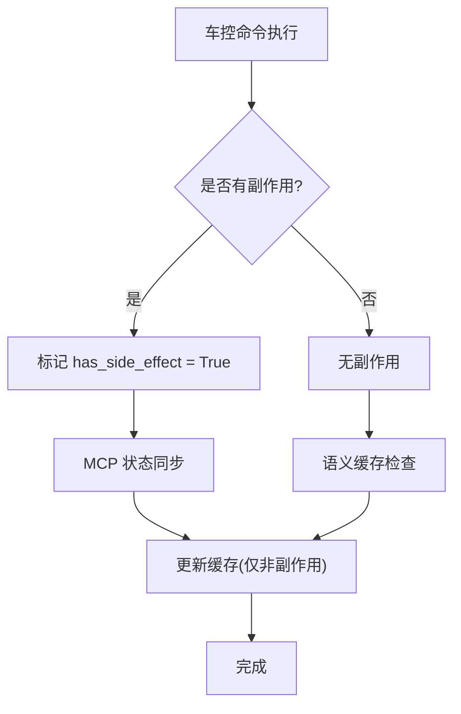
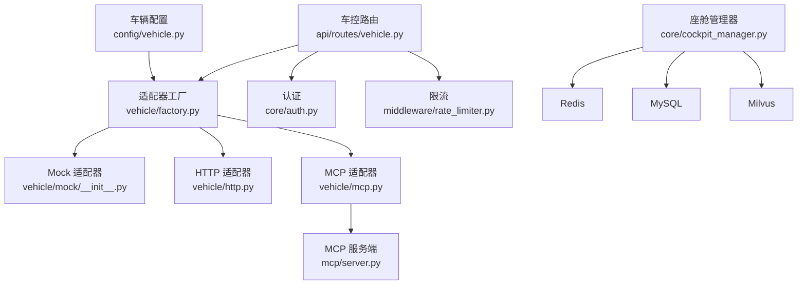

# 车控系统架构

<cite>
**本文引用的文件**   
- [main.py](file://backend_design/nexus/main.py)
- [vehicle/base.py](file://backend_design/nexus/vehicle/base.py)
- [vehicle/factory.py](file://backend_design/nexus/vehicle/factory.py)
- [vehicle/http.py](file://backend_design/nexus/vehicle/http.py)
- [vehicle/mcp.py](file://backend_design/nexus/vehicle/mcp.py)
- [vehicle/mock/__init__.py](file://backend_design/nexus/vehicle/mock/__init__.py)
- [api/routes/vehicle.py](file://backend_design/nexus/api/routes/vehicle.py)
- [mcp/server.py](file://backend_design/nexus/mcp/server.py)
- [config/vehicle.py](file://backend_design/nexus/config/vehicle.py)
- [middleware/rate_limiter.py](file://backend_design/nexus/middleware/rate_limiter.py)
- [core/auth.py](file://backend_design/nexus/core/auth.py)
- [models/schemas.py](file://backend_design/nexus/models/schemas.py)
- [models/state.py](file://backend_design/nexus/models/state.py)
- [core/cockpit_manager.py](file://backend_design/nexus/core/cockpit_manager.py)
</cite>

## 目录
1. [简介](#简介)
2. [项目结构](#项目结构)
3. [核心组件](#核心组件)
4. [架构总览](#架构总览)
5. [详细组件分析](#详细组件分析)
6. [依赖关系分析](#依赖关系分析)
7. [性能考量](#性能考量)
8. [故障排查指南](#故障排查指南)
9. [结论](#结论)
10. [附录：API 调用示例与最佳实践](#附录api-调用示例与最佳实践)

## 简介
本文件为 NexusCockpit 车控系统的架构文档，聚焦以下目标：
- 深入解释 Mock/HTTP/MCP 三模式适配器的设计模式与实现原理
- 详细说明车控命令的生命周期管理（解析、验证、执行、状态同步）
- 解释 MCP（Model Context Protocol）协议的标准化接口设计与消息格式
- 描述车控状态的实时同步机制与事件驱动架构
- 提供适配器模式架构图、命令处理流程图和状态同步时序图
- 说明安全机制（白名单控制、限流策略、审计日志）
- 给出具体车控 API 调用示例与故障排查指南

## 项目结构
NexusCockpit 后端采用 FastAPI 应用入口统一装配，通过工厂模式构建车控适配器，结合中间件完成认证、限流、上下文隔离等横切关注点。关键目录与职责：
- backend_design/nexus/main.py：应用生命周期、路由注册、全局异常处理、组件初始化
- backend_design/nexus/vehicle/*：车控适配器抽象与三种实现（Mock/HTTP/MCP），以及工厂选择器
- backend_design/nexus/api/routes/vehicle.py：车控 REST 接口（直接命令执行与状态查询）
- backend_design/nexus/mcp/server.py：MCP 服务端，提供任务分发、状态同步、结果回调、异常上报、心跳保活
- backend_design/nexus/config/vehicle.py：车控总线配置（adapter、HTTP/MCP 参数）
- backend_design/nexus/middleware/rate_limiter.py：基于 Redis 的分布式限流（滑动窗口 + 令牌桶）
- backend_design/nexus/core/auth.py：JWT 认证与用户提取
- backend_design/nexus/models/schemas.py：Pydantic 请求/响应模型
- backend_design/nexus/models/state.py：多智能体共享状态定义（含副作用标记 has_side_effect）
- backend_design/nexus/core/cockpit_manager.py：座舱管理器（多座舱隔离、资源初始化）

**图表来源** 
- [main.py:436-658](file://backend_design/nexus/main.py#L436-L658)
- [api/routes/vehicle.py:32-108](file://backend_design/nexus/api/routes/vehicle.py#L32-L108)
- [vehicle/factory.py:38-122](file://backend_design/nexus/vehicle/factory.py#L38-L122)
- [vehicle/mock/__init__.py:39-220](file://backend_design/nexus/vehicle/mock/__init__.py#L39-L220)
- [vehicle/http.py:23-127](file://backend_design/nexus/vehicle/http.py#L23-L127)
- [vehicle/mcp.py:167-285](file://backend_design/nexus/vehicle/mcp.py#L167-L285)
- [mcp/server.py:36-255](file://backend_design/nexus/mcp/server.py#L36-L255)
- [middleware/rate_limiter.py:117-297](file://backend_design/nexus/middleware/rate_limiter.py#L117-L297)
- [core/auth.py:85-140](file://backend_design/nexus/core/auth.py#L85-L140)
- [core/cockpit_manager.py:75-397](file://backend_design/nexus/core/cockpit_manager.py#L75-L397)

**章节来源**
- [main.py:436-658](file://backend_design/nexus/main.py#L436-L658)
- [vehicle/factory.py:38-122](file://backend_design/nexus/vehicle/factory.py#L38-L122)

## 核心组件
- 车控适配器抽象层：BaseVehicleAdapter 定义统一接口，所有实现必须提供空调、车窗、座椅、导航、媒体、状态查询与通用命令调用方法
- 适配器工厂：根据配置选择 Mock/HTTP/MCP 适配器；Mock 模式下按座舱隔离实例，HTTP/MCP 复用单例
- 车控路由：POST /vehicle/command 直接执行命令，GET /vehicle/status 获取状态；支持座舱隔离（X-Cockpit-Id）
- MCP 服务端：提供任务分发、状态同步、结果回调、异常上报、心跳保活等标准化接口
- 限流器：Redis Lua 脚本实现原子性滑动窗口与令牌桶，保证分布式安全
- 认证模块：JWT Token 签发与校验，保护敏感接口
- 座舱管理器：多座舱注册、查询、状态与资源隔离（Redis DB、Milvus collection 前缀等）

**章节来源**
- [vehicle/base.py:35-92](file://backend_design/nexus/vehicle/base.py#L35-L92)
- [vehicle/factory.py:38-122](file://backend_design/nexus/vehicle/factory.py#L38-L122)
- [api/routes/vehicle.py:48-108](file://backend_design/nexus/api/routes/vehicle.py#L48-L108)
- [mcp/server.py:36-255](file://backend_design/nexus/mcp/server.py#L36-L255)
- [middleware/rate_limiter.py:117-297](file://backend_design/nexus/middleware/rate_limiter.py#L117-L297)
- [core/auth.py:85-140](file://backend_design/nexus/core/auth.py#L85-L140)
- [core/cockpit_manager.py:75-397](file://backend_design/nexus/core/cockpit_manager.py#L75-L397)

## 架构总览
NexusCockpit 的车控系统以“适配器模式”为核心，将上层技能与下游车控通信解耦。通过工厂选择不同适配器，屏蔽底层差异；同时借助 MCP 协议实现跨进程/服务的标准化协同。

**图表来源** 
- [vehicle/base.py:35-92](file://backend_design/nexus/vehicle/base.py#L35-L92)
- [vehicle/mock/__init__.py:39-220](file://backend_design/nexus/vehicle/mock/__init__.py#L39-L220)
- [vehicle/http.py:23-127](file://backend_design/nexus/vehicle/http.py#L23-L127)
- [vehicle/mcp.py:167-285](file://backend_design/nexus/vehicle/mcp.py#L167-L285)

## 详细组件分析

### 适配器模式与工厂选择
- 抽象接口：BaseVehicleAdapter 定义统一方法签名，确保上层无需关心具体实现
- 工厂逻辑：根据 VEHICLE_ADAPTER 配置选择实现；Mock 模式按座舱隔离实例，HTTP/MCP 复用单例
- 配置项：adapter、api_base_url、api_protocol、api_endpoint、api_timeout、api_token、mcp_command、mcp_args、mcp_workdir、mcp_validate_tools

**图表来源** 
- [vehicle/factory.py:86-122](file://backend_design/nexus/vehicle/factory.py#L86-L122)
- [config/vehicle.py:15-50](file://backend_design/nexus/config/vehicle.py#L15-L50)

**章节来源**
- [vehicle/factory.py:38-122](file://backend_design/nexus/vehicle/factory.py#L38-L122)
- [config/vehicle.py:15-50](file://backend_design/nexus/config/vehicle.py#L15-L50)

### HTTP 适配器实现
- 通过 urllib.request 发送 POST 请求到远端车控服务
- 支持两种协议：REST（默认）与 JSON-RPC 2.0
- 错误处理：HTTPError、URLError、通用异常均转换为 VehicleCommandResult

**图表来源** 
- [api/routes/vehicle.py:48-85](file://backend_design/nexus/api/routes/vehicle.py#L48-L85)
- [vehicle/http.py:69-127](file://backend_design/nexus/vehicle/http.py#L69-L127)

**章节来源**
- [vehicle/http.py:23-127](file://backend_design/nexus/vehicle/http.py#L23-L127)

### MCP 适配器实现
- 使用 mcp.ClientSession 与 MCP 服务通过标准输入输出通信
- 后台线程运行异步事件循环，桥接同步接口到异步 SDK
- 工具列表校验：可启用 validate_tools 检查可用工具集合

**图表来源** 
- [vehicle/mcp.py:137-165](file://backend_design/nexus/vehicle/mcp.py#L137-L165)
- [vehicle/mcp.py:225-285](file://backend_design/nexus/vehicle/mcp.py#L225-L285)

**章节来源**
- [vehicle/mcp.py:167-285](file://backend_design/nexus/vehicle/mcp.py#L167-L285)

### Mock 适配器实现
- Facade 门面模式：MockVehicleBus 对外暴露统一接口，内部委托给各状态子模块（空调、车窗、座椅、导航、媒体、车况）
- COMMAND_ALIASES：支持命令别名映射，便于兼容历史调用
- 座舱隔离：每个座舱拥有独立实例，状态互不影响

**图表来源** 
- [vehicle/mock/__init__.py:39-220](file://backend_design/nexus/vehicle/mock/__init__.py#L39-L220)

**章节来源**
- [vehicle/mock/__init__.py:39-220](file://backend_design/nexus/vehicle/mock/__init__.py#L39-L220)

### 车控命令生命周期管理
- 解析：FastAPI 自动解析 Pydantic 模型（VehicleCommandRequest）
- 验证：依赖 get_current_user 进行 JWT 校验；可选限流检查
- 执行：通过适配器 invoke_command 或专用方法执行
- 状态同步：通过 MCP 状态同步接口或多 Agent 共享状态（has_side_effect 标记避免副作用写入缓存）

**图表来源** 
- [api/routes/vehicle.py:48-108](file://backend_design/nexus/api/routes/vehicle.py#L48-L108)
- [core/auth.py:85-140](file://backend_design/nexus/core/auth.py#L85-L140)
- [middleware/rate_limiter.py:156-211](file://backend_design/nexus/middleware/rate_limiter.py#L156-L211)
- [mcp/server.py:115-139](file://backend_design/nexus/mcp/server.py#L115-L139)
- [models/state.py:88-91](file://backend_design/nexus/models/state.py#L88-L91)

**章节来源**
- [api/routes/vehicle.py:48-108](file://backend_design/nexus/api/routes/vehicle.py#L48-L108)
- [models/state.py:88-91](file://backend_design/nexus/models/state.py#L88-L91)

### MCP 协议标准化接口与消息格式
- 任务分发：POST /mcp/task/dispatch，包含 task_id、agent_name、skill_name、arguments、cockpit_id
- 状态同步：POST /mcp/state/sync，包含 agent_name、state、cockpit_id
- 结果回调：POST /mcp/result/callback，包含 task_id、result、status
- 异常上报：POST /mcp/exception/report，包含 agent_name、exception、context、cockpit_id
- 心跳保活：GET /mcp/health/heartbeat，返回 alive 状态与统计信息

**图表来源** 
- [mcp/server.py:76-222](file://backend_design/nexus/mcp/server.py#L76-L222)

**章节来源**
- [mcp/server.py:36-255](file://backend_design/nexus/mcp/server.py#L36-L255)

### 车控状态实时同步与事件驱动
- 状态同步：通过 MCP 的 sync_state 接口在多 Agent 间共享状态，支持座舱隔离
- 事件驱动：SupervisorState 中的 has_side_effect 标记用于区分副作用操作，避免语义缓存误命中
- 座舱隔离：CockpitManager 为每个座舱分配独立 Redis DB 与 Milvus collection 前缀

**图表来源** 
- [models/state.py:88-91](file://backend_design/nexus/models/state.py#L88-L91)
- [mcp/server.py:115-139](file://backend_design/nexus/mcp/server.py#L115-L139)
- [core/cockpit_manager.py:193-297](file://backend_design/nexus/core/cockpit_manager.py#L193-L297)

**章节来源**
- [models/state.py:88-91](file://backend_design/nexus/models/state.py#L88-L91)
- [core/cockpit_manager.py:193-297](file://backend_design/nexus/core/cockpit_manager.py#L193-L297)

## 依赖关系分析
- 车控适配器依赖配置（VEHICLE_ADAPTER、HTTP/MCP 参数）
- 车控路由依赖认证与限流中间件
- MCP 适配器依赖 mcp SDK 与后台事件循环
- 限流器依赖 Redis 与 Lua 脚本
- 座舱管理器依赖 Redis、MySQL、Milvus（可选）

**图表来源** 
- [config/vehicle.py:15-50](file://backend_design/nexus/config/vehicle.py#L15-L50)
- [vehicle/factory.py:38-122](file://backend_design/nexus/vehicle/factory.py#L38-L122)
- [api/routes/vehicle.py:48-108](file://backend_design/nexus/api/routes/vehicle.py#L48-L108)
- [core/auth.py:85-140](file://backend_design/nexus/core/auth.py#L85-L140)
- [middleware/rate_limiter.py:117-297](file://backend_design/nexus/middleware/rate_limiter.py#L117-L297)
- [mcp/server.py:36-255](file://backend_design/nexus/mcp/server.py#L36-L255)
- [core/cockpit_manager.py:193-297](file://backend_design/nexus/core/cockpit_manager.py#L193-L297)

**章节来源**
- [vehicle/factory.py:38-122](file://backend_design/nexus/vehicle/factory.py#L38-L122)
- [api/routes/vehicle.py:48-108](file://backend_design/nexus/api/routes/vehicle.py#L48-L108)

## 性能考量
- 适配器选择：Mock 适合开发测试，HTTP/MCP 适合生产环境
- 连接池与超时：HTTP 适配器设置超时时间，避免阻塞；MCP 适配器使用后台线程与事件循环，避免主线程阻塞
- 限流策略：滑动窗口与令牌桶组合，支持突发流量与长期速率控制
- 缓存优化：语义缓存需避开副作用操作（has_side_effect），防止指令不执行
- 资源隔离：座舱级 Redis DB 与 Milvus collection 前缀，减少竞争与冲突

[本节为通用指导，不涉及具体文件分析]

## 故障排查指南
- 认证失败：检查 Authorization 头是否携带有效 Bearer Token；确认 JWT 密钥与算法配置
- 限流触发：查看 Redis 限流 key 与 Lua 脚本执行情况；调整 max_requests 与 window_seconds
- HTTP 调用失败：检查 base_url、endpoint、auth_token；查看网络连通性与超时设置
- MCP 初始化超时：确认 mcp_command 与 mcp_args 正确；检查子进程启动与工作目录
- 状态不同步：检查 MCP sync_state 调用与状态数据结构；确认座舱 ID 一致
- 座舱隔离问题：确认 X-Cockpit-Id 头传递；检查 CockpitManager 中座舱配置

**章节来源**
- [core/auth.py:85-140](file://backend_design/nexus/core/auth.py#L85-L140)
- [middleware/rate_limiter.py:156-211](file://backend_design/nexus/middleware/rate_limiter.py#L156-L211)
- [vehicle/http.py:69-127](file://backend_design/nexus/vehicle/http.py#L69-L127)
- [vehicle/mcp.py:137-165](file://backend_design/nexus/vehicle/mcp.py#L137-L165)
- [mcp/server.py:115-139](file://backend_design/nexus/mcp/server.py#L115-L139)
- [core/cockpit_manager.py:193-297](file://backend_design/nexus/core/cockpit_manager.py#L193-L297)

## 结论
NexusCockpit 车控系统通过适配器模式与工厂选择机制，实现了 Mock/HTTP/MCP 三模式的灵活切换；结合 MCP 协议与多 Agent 状态同步，提供了标准化的跨进程协同能力。系统内置认证、限流、座舱隔离等安全与稳定性保障，适用于开发与生产环境。建议在生产环境中优先使用 HTTP/MCP 适配器，并合理配置限流与超时参数，确保系统稳定高效运行。

[本节为总结性内容，不涉及具体文件分析]

## 附录：API 调用示例与最佳实践
- 车控命令执行：POST /vehicle/command，请求体包含 command 与 arguments；需携带 Authorization: Bearer <token>
- 车控状态查询：GET /vehicle/status；支持座舱隔离（X-Cockpit-Id）
- MCP 任务分发：POST /mcp/task/dispatch；指定 agent_name、skill_name、arguments
- MCP 状态同步：POST /mcp/state/sync；同步 agent 状态与座舱 ID
- MCP 心跳保活：GET /mcp/health/heartbeat；监控服务健康状态

最佳实践：
- 使用座舱隔离：始终传递 X-Cockpit-Id 头，确保多座舱状态独立
- 合理配置限流：根据业务需求调整滑动窗口与令牌桶参数
- 避免副作用缓存：对修改车辆状态的命令，确保 has_side_effect 标记正确
- 监控与日志：启用 Prometheus 指标与结构化日志，便于问题定位

[本节为通用指导，不涉及具体文件分析]