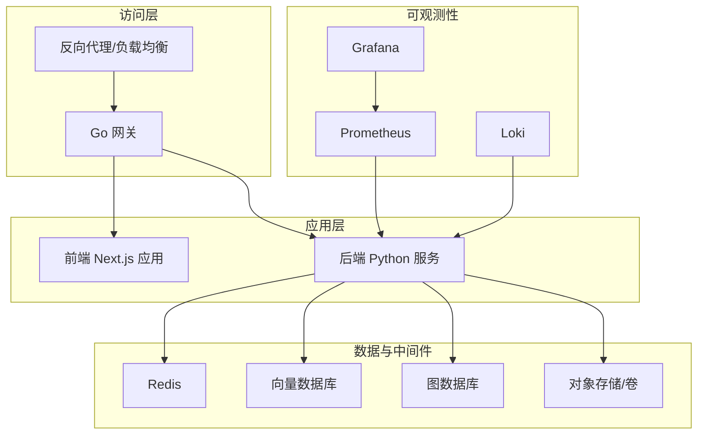
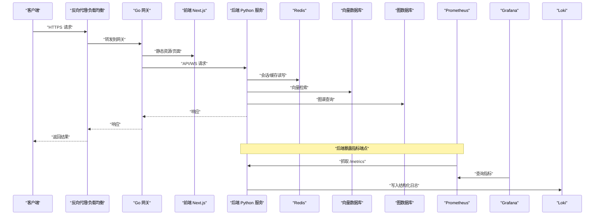
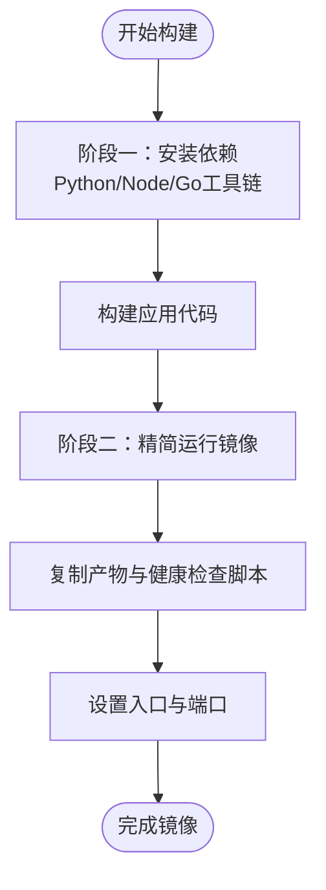
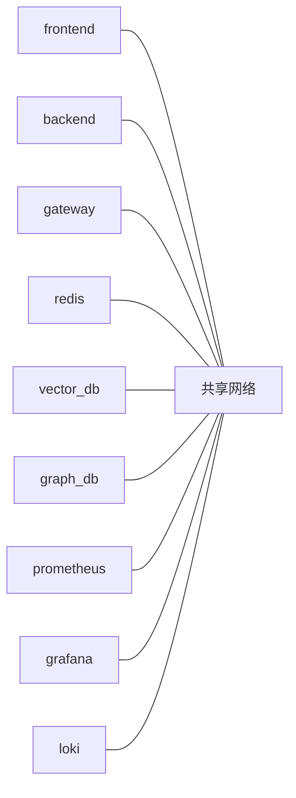
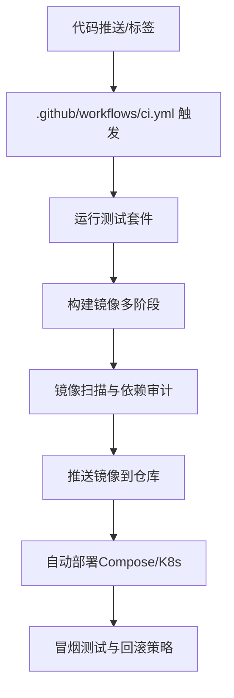
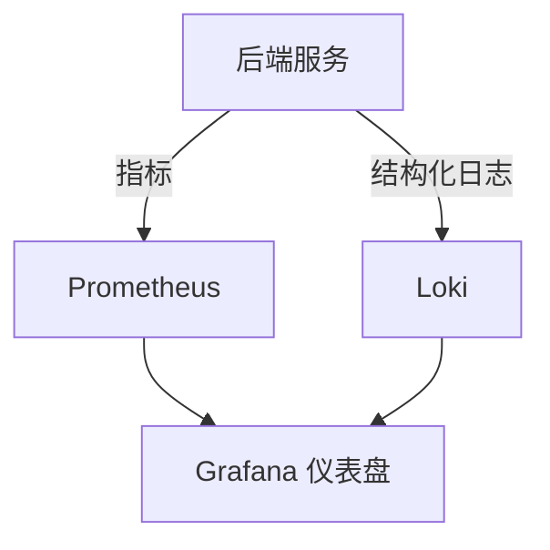
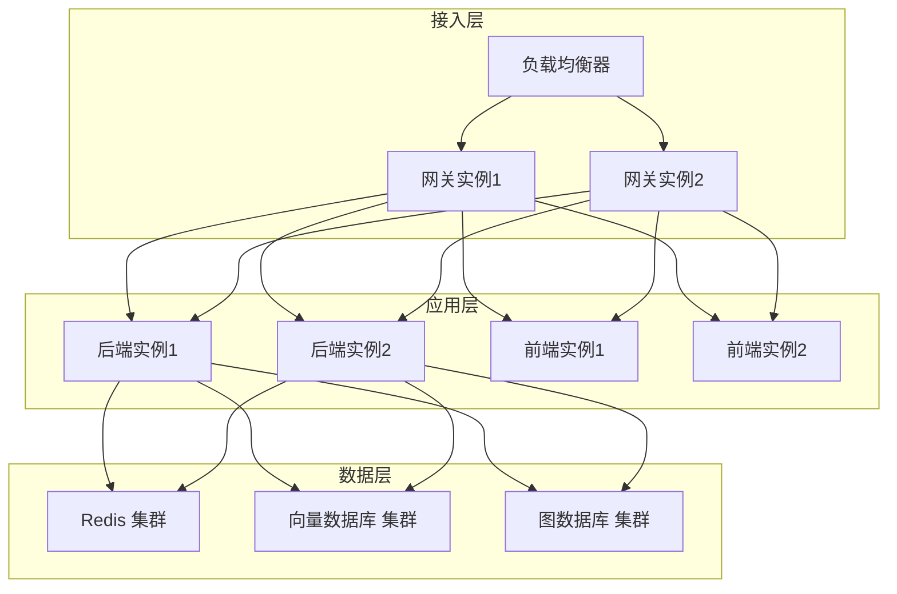
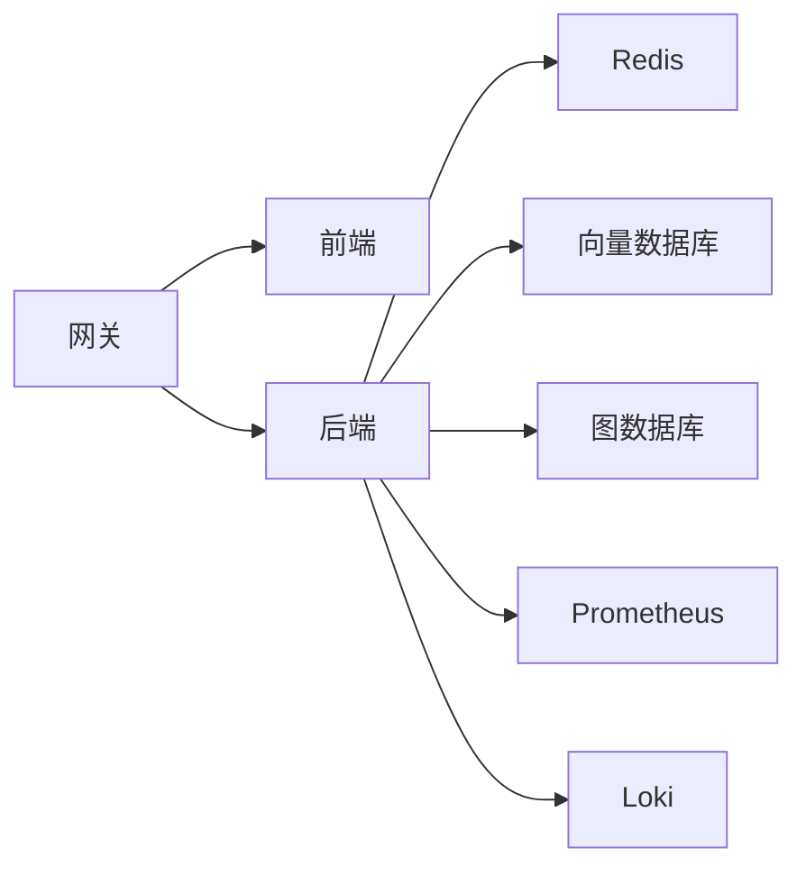

# 部署架构设计

<cite>
**本文引用的文件**   
- [docker-compose.yml](file://docker-compose.yml)
- [backend/Dockerfile](file://backend/Dockerfile)
- [frontend/Dockerfile](file://frontend/Dockerfile)
- [backend_design/nexus_gate/Dockerfile](file://backend_design/nexus_gate/Dockerfile)
- [backend_design/pyproject.toml](file://backend_design/pyproject.toml)
- [backend_design/requirements.txt](file://backend_design/requirements.txt)
- [backend_design/requirements_no_torch.txt](file://backend_design/requirements_no_torch.txt)
- [config/prometheus/prometheus.yml](file://config/prometheus/prometheus.yml)
- [config/grafana/provisioning/datasources/prometheus.yml](file://config/grafana/provisioning/datasources/prometheus.yml)
- [config/grafana/provisioning/dashboards/dashboards.yml](file://config/grafana/provisioning/dashboards/dashboards.yml)
- [config/grafana/provisioning/dashboards/nexuscockpit-overview.json](file://config/grafana/provisioning/dashboards/nexuscockpit-overview.json)
- [config/loki/loki-config.yml](file://config/loki/loki-config.yml)
- [.github/workflows/ci.yml](file://.github/workflows/ci.yml)
- [Makefile](file://Makefile)
- [scripts/start-backend.ps1](file://scripts/start-backend.ps1)
- [scripts/start-frontend.ps1](file://scripts/start-frontend.ps1)
- [scripts/start-gateway.ps1](file://scripts/start-gateway.ps1)
- [backend_design/nexus/main.py](file://backend_design/nexus/main.py)
- [backend_design/nexus/config.py](file://backend_design/nexus/config.py)
- [backend_design/nexus/core/logger.py](file://backend_design/nexus/core/logger.py)
- [backend_design/nexus/observability/metrics.py](file://backend_design/nexus/observability/metrics.py)
- [backend_design/nexus/api/websocket.py](file://backend_design/nexus/api/websocket.py)
- [backend_design/nexus/middleware/session_store.py](file://backend_design/nexus/middleware/session_store.py)
- [backend_design/nexus/middleware/redis_cache.py](file://backend_design/nexus/middleware/redis_cache.py)
- [backend_design/nexus/intent/llm_router.py](file://backend_design/nexus/intent/llm_router.py)
- [backend_design/nexus/rag/vector_store.py](file://backend_design/nexus/rag/vector_store.py)
- [backend_design/nexus/rag/graph_store.py](file://backend_design/nexus/rag/graph_store.py)
- [backend_design/nexus/models/state.py](file://backend_design/nexus/models/state.py)
</cite>

## 目录
1. [简介](#简介)
2. [项目结构](#项目结构)
3. [核心组件](#核心组件)
4. [架构总览](#架构总览)
5. [详细组件分析](#详细组件分析)
6. [依赖分析](#依赖分析)
7. [性能考虑](#性能考虑)
8. [故障排查指南](#故障排查指南)
9. [结论](#结论)
10. [附录](#附录)

## 简介
本文件面向NexusCockpit系统的容器化与编排部署，覆盖镜像构建策略、Docker Compose编排、多环境差异化配置、CI/CD流水线、监控日志告警、高可用与水平扩展、网络安全等主题。文档以仓库现有可执行工件为依据，结合后端Python服务、前端Next.js应用与Go语言网关的Dockerfile与配置文件进行说明，并提供拓扑图与流程图帮助读者快速理解整体部署方案。

## 项目结构
从部署视角看，系统包含以下关键构件：
- 后端服务（Python）：提供API、WebSocket、意图路由、RAG检索、会话与缓存中间件、指标采集等能力。
- 前端应用（Next.js）：静态资源与SSG/SSR产物由独立镜像构建并对外提供服务。
- API网关（Go）：统一入口，负责鉴权、限流、反向代理与WebSocket转发。
- 可观测性栈：Prometheus抓取指标，Grafana展示仪表盘，Loki收集日志。
- 外部依赖：Redis（会话/缓存）、向量数据库与图数据库（RAG相关）、对象存储或本地卷（模型与数据）。

图表来源
- [docker-compose.yml](file://docker-compose.yml)
- [backend_design/nexus/main.py](file://backend_design/nexus/main.py)
- [backend_design/nexus/api/websocket.py](file://backend_design/nexus/api/websocket.py)
- [backend_design/nexus/middleware/redis_cache.py](file://backend_design/nexus/middleware/redis_cache.py)
- [backend_design/nexus/rag/vector_store.py](file://backend_design/nexus/rag/vector_store.py)
- [backend_design/nexus/rag/graph_store.py](file://backend_design/nexus/rag/graph_store.py)
- [config/prometheus/prometheus.yml](file://config/prometheus/prometheus.yml)
- [config/grafana/provisioning/datasources/prometheus.yml](file://config/grafana/provisioning/datasources/prometheus.yml)
- [config/grafana/provisioning/dashboards/dashboards.yml](file://config/grafana/provisioning/dashboards/dashboards.yml)
- [config/grafana/provisioning/dashboards/nexuscockpit-overview.json](file://config/grafana/provisioning/dashboards/nexuscockpit-overview.json)
- [config/loki/loki-config.yml](file://config/loki/loki-config.yml)

章节来源
- [docker-compose.yml](file://docker-compose.yml)
- [backend/Dockerfile](file://backend/Dockerfile)
- [frontend/Dockerfile](file://frontend/Dockerfile)
- [backend_design/nexus_gate/Dockerfile](file://backend_design/nexus_gate/Dockerfile)

## 核心组件
- 后端服务（Python）
  - 入口与生命周期管理：通过主程序初始化应用、注册路由、启动HTTP/WS服务器。
  - 配置加载：集中式配置模块读取环境变量与配置文件，驱动各子系统行为。
  - 中间件：会话存储、Redis缓存、速率限制、任务队列等。
  - 可观测性：暴露Prometheus指标端点，结构化日志输出。
  - RAG与意图路由：连接向量库与图数据库，按意图选择LLM或规则路径。
- 前端应用（Next.js）
  - 构建产物为静态资源，由独立镜像提供HTTP服务；支持SSR/SSG时由运行时渲染。
- API网关（Go）
  - 统一入口，承载鉴权、限流、协议转换、WebSocket代理与上游服务发现。
- 可观测性
  - Prometheus拉取后端指标；Grafana通过数据源与仪表盘定义进行可视化；Loki聚合日志。

章节来源
- [backend_design/nexus/main.py](file://backend_design/nexus/main.py)
- [backend_design/nexus/config.py](file://backend_design/nexus/config.py)
- [backend_design/nexus/core/logger.py](file://backend_design/nexus/core/logger.py)
- [backend_design/nexus/observability/metrics.py](file://backend_design/nexus/observability/metrics.py)
- [backend_design/nexus/api/websocket.py](file://backend_design/nexus/api/websocket.py)
- [backend_design/nexus/middleware/session_store.py](file://backend_design/nexus/middleware/session_store.py)
- [backend_design/nexus/middleware/redis_cache.py](file://backend_design/nexus/middleware/redis_cache.py)
- [backend_design/nexus/intent/llm_router.py](file://backend_design/nexus/intent/llm_router.py)
- [backend_design/nexus/rag/vector_store.py](file://backend_design/nexus/rag/vector_store.py)
- [backend_design/nexus/rag/graph_store.py](file://backend_design/nexus/rag/graph_store.py)

## 架构总览
下图展示了端到端请求链路：客户端经反向代理进入网关，网关将REST与WebSocket流量分发至前后端；后端在需要时访问Redis、向量库、图数据库与对象存储；Prometheus定期抓取后端指标，Grafana展示面板，Loki汇聚日志。

图表来源
- [docker-compose.yml](file://docker-compose.yml)
- [backend_design/nexus/main.py](file://backend_design/nexus/main.py)
- [backend_design/nexus/api/websocket.py](file://backend_design/nexus/api/websocket.py)
- [backend_design/nexus/middleware/redis_cache.py](file://backend_design/nexus/middleware/redis_cache.py)
- [backend_design/nexus/rag/vector_store.py](file://backend_design/nexus/rag/vector_store.py)
- [backend_design/nexus/rag/graph_store.py](file://backend_design/nexus/rag/graph_store.py)
- [config/prometheus/prometheus.yml](file://config/prometheus/prometheus.yml)
- [config/grafana/provisioning/datasources/prometheus.yml](file://config/grafana/provisioning/datasources/prometheus.yml)
- [config/grafana/provisioning/dashboards/dashboards.yml](file://config/grafana/provisioning/dashboards/dashboards.yml)
- [config/grafana/provisioning/dashboards/nexuscockpit-overview.json](file://config/grafana/provisioning/dashboards/nexuscockpit-overview.json)
- [config/loki/loki-config.yml](file://config/loki/loki-config.yml)

## 详细组件分析

### 容器镜像构建策略
- 后端服务（Python）
  - 使用多阶段构建：第一阶段安装依赖（基于requirements），第二阶段仅拷贝运行所需文件，减小镜像体积。
  - 依赖管理：pyproject.toml声明包元数据与可选依赖；requirements.txt用于生产约束；requirements_no_torch.txt用于无GPU环境。
  - 健康检查与端口：镜像暴露标准HTTP端口，并在启动脚本中注入健康探针。
- 前端应用（Next.js）
  - 构建阶段安装Node依赖并生成静态资源；运行阶段采用轻量HTTP服务器提供静态内容。
- API网关（Go）
  - 编译静态二进制，最小基础镜像运行，提升安全性与启动速度。

图表来源
- [backend/Dockerfile](file://backend/Dockerfile)
- [frontend/Dockerfile](file://frontend/Dockerfile)
- [backend_design/nexus_gate/Dockerfile](file://backend_design/nexus_gate/Dockerfile)
- [backend_design/pyproject.toml](file://backend_design/pyproject.toml)
- [backend_design/requirements.txt](file://backend_design/requirements.txt)
- [backend_design/requirements_no_torch.txt](file://backend_design/requirements_no_torch.txt)

章节来源
- [backend/Dockerfile](file://backend/Dockerfile)
- [frontend/Dockerfile](file://frontend/Dockerfile)
- [backend_design/nexus_gate/Dockerfile](file://backend_design/nexus_gate/Dockerfile)
- [backend_design/pyproject.toml](file://backend_design/pyproject.toml)
- [backend_design/requirements.txt](file://backend_design/requirements.txt)
- [backend_design/requirements_no_torch.txt](file://backend_design/requirements_no_torch.txt)

### Docker Compose编排与服务关系
- 服务清单
  - backend：Python后端服务，挂载模型与数据卷，暴露HTTP/WS端口。
  - frontend：Next.js前端应用，提供静态资源。
  - gateway：Go网关，作为统一入口。
  - redis：会话与缓存。
  - vector_db、graph_db：RAG所需的向量与图数据库。
  - prometheus、grafana、loki：可观测性组件。
- 网络与卷
  - 自定义桥接网络隔离服务间通信。
  - 持久化卷用于模型、索引、日志与仪表板配置。
- 环境变量与配置注入
  - 通过.env或Compose变量注入数据库连接、密钥、开关等。

图表来源
- [docker-compose.yml](file://docker-compose.yml)

章节来源
- [docker-compose.yml](file://docker-compose.yml)

### 多环境差异化配置
- 开发环境
  - 启用调试日志、宽松限流、本地模型与内存型中间件。
  - 使用本地卷挂载源码以便热重载。
- 测试环境
  - 固定依赖版本，开启全量指标与结构化日志，准备测试数据集。
- 生产环境
  - 关闭调试，严格限流与鉴权，启用SSL终止与只读卷，外部化敏感配置。
- 配置来源
  - 环境变量优先，配置文件次之；不同环境通过Compose profiles或外部Secrets管理。

章节来源
- [backend_design/nexus/config.py](file://backend_design/nexus/config.py)
- [docker-compose.yml](file://docker-compose.yml)

### CI/CD流水线设计与自动化部署
- 触发条件
  - 推送分支或创建标签时触发构建与测试。
- 步骤
  - 安装依赖、单元测试、集成测试、构建镜像、推送镜像仓库。
  - 生成部署清单并更新Kubernetes/Compose配置（可选）。
  - 发布制品与变更日志。
- 安全与合规
  - 镜像签名、漏洞扫描、依赖审计。

图表来源
- [.github/workflows/ci.yml](file://.github/workflows/ci.yml)

章节来源
- [.github/workflows/ci.yml](file://.github/workflows/ci.yml)

### 服务监控、日志收集与告警机制
- 指标采集
  - 后端暴露指标端点，Prometheus按目标抓取。
  - Grafana通过数据源与仪表盘定义展示系统概览与业务指标。
- 日志收集
  - 后端输出结构化日志，Loki按标签聚合，便于检索与分析。
- 告警
  - 基于PromQL与Grafana Alertmanager实现阈值与异常检测告警。

图表来源
- [config/prometheus/prometheus.yml](file://config/prometheus/prometheus.yml)
- [config/grafana/provisioning/datasources/prometheus.yml](file://config/grafana/provisioning/datasources/prometheus.yml)
- [config/grafana/provisioning/dashboards/dashboards.yml](file://config/grafana/provisioning/dashboards/dashboards.yml)
- [config/grafana/provisioning/dashboards/nexuscockpit-overview.json](file://config/grafana/provisioning/dashboards/nexuscockpit-overview.json)
- [config/loki/loki-config.yml](file://config/loki/loki-config.yml)
- [backend_design/nexus/observability/metrics.py](file://backend_design/nexus/observability/metrics.py)
- [backend_design/nexus/core/logger.py](file://backend_design/nexus/core/logger.py)

章节来源
- [config/prometheus/prometheus.yml](file://config/prometheus/prometheus.yml)
- [config/grafana/provisioning/datasources/prometheus.yml](file://config/grafana/provisioning/datasources/prometheus.yml)
- [config/grafana/provisioning/dashboards/dashboards.yml](file://config/grafana/provisioning/dashboards/dashboards.yml)
- [config/grafana/provisioning/dashboards/nexuscockpit-overview.json](file://config/grafana/provisioning/dashboards/nexuscockpit-overview.json)
- [config/loki/loki-config.yml](file://config/loki/loki-config.yml)
- [backend_design/nexus/observability/metrics.py](file://backend_design/nexus/observability/metrics.py)
- [backend_design/nexus/core/logger.py](file://backend_design/nexus/core/logger.py)

### 高可用部署架构
- 负载均衡
  - 网关前放置反向代理/负载均衡器，对多个网关实例做轮询或加权分配。
- 故障转移
  - 网关与后端均部署多副本；健康检查失败自动剔除；会话与状态外置至Redis与数据库。
- 水平扩展
  - 无状态服务（网关、后端、前端）可按QPS与CPU/内存阈值扩容；有状态服务（Redis、向量/图数据库）采用集群模式。
- 弹性与降级
  - 针对LLM调用与外部依赖增加熔断与重试策略，保障核心链路可用性。

[此图为概念性拓扑，不直接映射具体源码文件]

### 网络安全配置
- 防火墙与访问控制
  - 仅开放必要端口（如443/80），内部服务间走私有网络。
  - 网关层实施鉴权、IP白名单与速率限制。
- SSL证书管理
  - 在反向代理或网关处终止TLS，证书由外部密钥管理系统注入。
- 数据安全
  - 传输加密（TLS）、敏感配置外置（Secrets）、最小权限原则。

章节来源
- [docker-compose.yml](file://docker-compose.yml)
- [backend_design/nexus_gate/Dockerfile](file://backend_design/nexus_gate/Dockerfile)

## 依赖分析
- 组件耦合
  - 网关与前后端松耦合，通过HTTP/WS交互。
  - 后端依赖Redis、向量库、图数据库与对象存储。
  - 可观测性组件与后端弱耦合，仅通过指标与日志接口交互。
- 外部依赖
  - Redis：会话与缓存。
  - 向量/图数据库：RAG检索与知识图谱。
  - 对象存储/卷：模型与数据持久化。
- 潜在循环依赖
  - 当前分层清晰，未见循环导入；建议保持接口稳定与最小依赖面。

图表来源
- [docker-compose.yml](file://docker-compose.yml)
- [backend_design/nexus/middleware/redis_cache.py](file://backend_design/nexus/middleware/redis_cache.py)
- [backend_design/nexus/rag/vector_store.py](file://backend_design/nexus/rag/vector_store.py)
- [backend_design/nexus/rag/graph_store.py](file://backend_design/nexus/rag/graph_store.py)
- [config/prometheus/prometheus.yml](file://config/prometheus/prometheus.yml)
- [config/loki/loki-config.yml](file://config/loki/loki-config.yml)

章节来源
- [docker-compose.yml](file://docker-compose.yml)
- [backend_design/nexus/middleware/redis_cache.py](file://backend_design/nexus/middleware/redis_cache.py)
- [backend_design/nexus/rag/vector_store.py](file://backend_design/nexus/rag/vector_store.py)
- [backend_design/nexus/rag/graph_store.py](file://backend_design/nexus/rag/graph_store.py)
- [config/prometheus/prometheus.yml](file://config/prometheus/prometheus.yml)
- [config/loki/loki-config.yml](file://config/loki/loki-config.yml)

## 性能考虑
- 镜像优化
  - 多阶段构建、裁剪依赖、使用更小的基础镜像。
- 资源配额
  - 为各服务设置CPU/内存限制与请求上限，避免争抢。
- 缓存与会话
  - 合理命中Redis缓存，减少下游压力；会话外置确保横向扩展。
- 连接池与超时
  - 数据库与外部服务连接池调优，设置合理的超时与重试策略。
- 可观测性开销
  - 采样率与保留周期按需调整，避免影响主链路性能。

[本节为通用指导，无需特定文件引用]

## 故障排查指南
- 常见问题定位
  - 启动失败：检查环境变量、端口占用、镜像健康检查。
  - 连接异常：确认Redis/向量/图数据库连通性与认证信息。
  - 指标缺失：验证Prometheus抓取目标与后端指标端点可达。
  - 日志缺失：检查Loki配置与后端日志输出格式。
- 诊断工具
  - 使用Compose logs查看服务日志；通过Grafana与Loki交叉分析。
  - 使用本地脚本快速拉起单服务进行复现。

章节来源
- [Makefile](file://Makefile)
- [scripts/start-backend.ps1](file://scripts/start-backend.ps1)
- [scripts/start-frontend.ps1](file://scripts/start-frontend.ps1)
- [scripts/start-gateway.ps1](file://scripts/start-gateway.ps1)
- [config/prometheus/prometheus.yml](file://config/prometheus/prometheus.yml)
- [config/grafana/provisioning/datasources/prometheus.yml](file://config/grafana/provisioning/datasources/prometheus.yml)
- [config/grafana/provisioning/dashboards/dashboards.yml](file://config/grafana/provisioning/dashboards/dashboards.yml)
- [config/grafana/provisioning/dashboards/nexuscockpit-overview.json](file://config/grafana/provisioning/dashboards/nexuscockpit-overview.json)
- [config/loki/loki-config.yml](file://config/loki/loki-config.yml)

## 结论
NexusCockpit采用清晰的微服务分层与容器化编排，具备完善的可观测性与可扩展性。通过多阶段镜像构建、标准化环境变量与外部化配置，可在开发、测试与生产环境中保持一致的部署体验。配合CI/CD流水线与高可用策略，系统可实现稳定交付与弹性伸缩。建议在后续迭代中持续完善安全加固、容量规划与混沌工程实践。

## 附录
- 常用命令
  - 构建与启动：参考Makefile与本地脚本。
  - 查看日志与指标：使用Compose与Grafana/Loki。
- 配置清单
  - 数据库连接、密钥、限流阈值、模型路径等通过环境变量或外部Secrets管理。

章节来源
- [Makefile](file://Makefile)
- [scripts/start-backend.ps1](file://scripts/start-backend.ps1)
- [scripts/start-frontend.ps1](file://scripts/start-frontend.ps1)
- [scripts/start-gateway.ps1](file://scripts/start-gateway.ps1)
- [docker-compose.yml](file://docker-compose.yml)