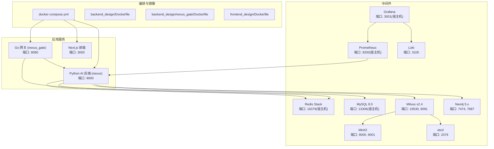
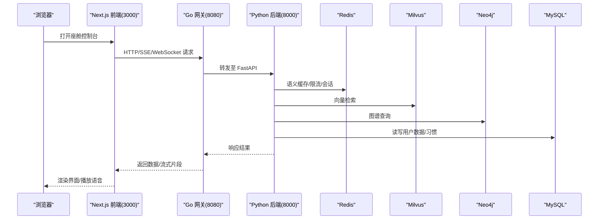
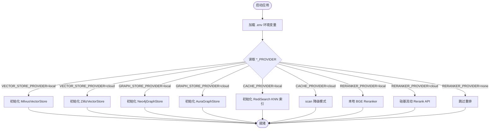
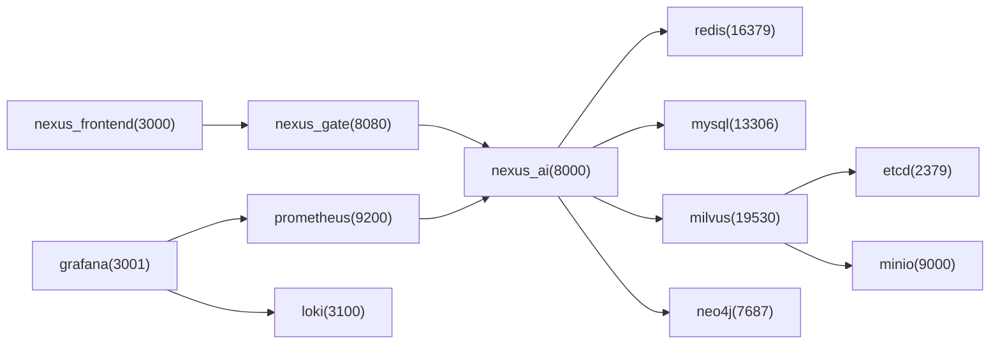
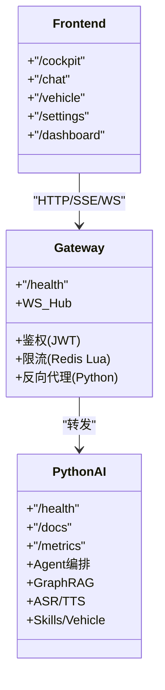
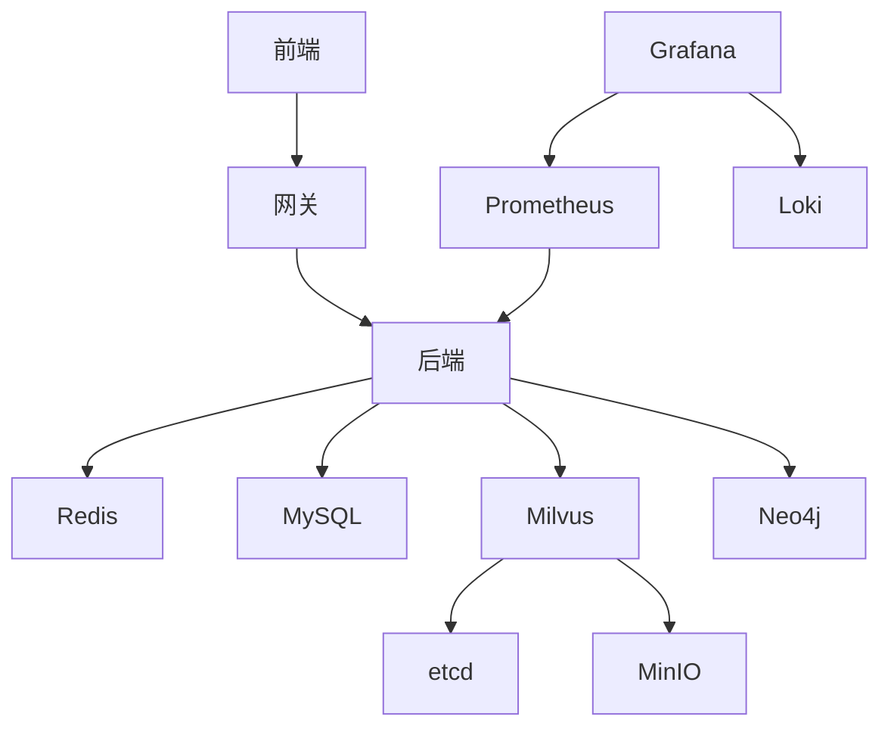

# 部署架构设计

<cite>
**本文引用的文件**   
- [README.md](file://README.md)
- [docker-compose.yml](file://docker-compose.yml)
- [backend_design/Dockerfile](file://backend_design/Dockerfile)
- [backend_design/nexus_gate/Dockerfile](file://backend_design/nexus_gate/Dockerfile)
- [frontend_design/Dockerfile](file://frontend_design/Dockerfile)
- [.github/workflows/ci.yml](file://.github/workflows/ci.yml)
- [docs/deployment/SETUP.md](file://docs/deployment/SETUP.md)
- [docs/deployment/VERIFICATION.md](file://docs/deployment/VERIFICATION.md)
- [docs/architecture/L0-infrastructure.md](file://docs/architecture/L0-infrastructure.md)
- [docs/architecture/L1-core.md](file://docs/architecture/L1-core.md)
- [docs/architecture/L2-data.md](file://docs/architecture/L2-data.md)
- [docs/architecture/L3-service.md](file://docs/architecture/L3-service.md)
- [docs/architecture/L5-middleware.md](file://docs/architecture/L5-middleware.md)
</cite>

## 目录
1. [引言](#引言)
2. [项目结构](#项目结构)
3. [核心组件](#核心组件)
4. [架构总览](#架构总览)
5. [详细组件分析](#详细组件分析)
6. [依赖关系分析](#依赖关系分析)
7. [性能与容量规划](#性能与容量规划)
8. [CI/CD 流水线](#cicd-流水线)
9. [监控与可观测性](#监控与可观测性)
10. [日志聚合方案](#日志聚合方案)
11. [故障恢复与高可用](#故障恢复与高可用)
12. [生产环境最佳实践](#生产环境最佳实践)
13. [结论](#结论)

## 引言
本文件面向 NexusCockpit 的部署与运维，系统性阐述双模式部署（本地 Docker ⇄ 云端 API）的架构设计与切换机制，容器化编排策略（Docker Compose 服务定义、网络拓扑、数据持久化、资源限制），Go 网关与 Python 服务的微服务架构，以及前端构建与运行。文档同时覆盖 CI/CD、监控告警、日志聚合与故障恢复策略，并提供生产环境部署与性能调优建议。

## 项目结构
NexusCockpit 采用分层架构与多语言微服务组合：
- 基础设施层：Milvus、Neo4j、Redis、MySQL、MinIO、etcd、Prometheus、Grafana、Loki
- 应用层：Go 并发网关（nexus_gate）、Python AI 后端（nexus）、Next.js 前端
- 配置与编排：docker-compose.yml、各服务 Dockerfile、环境变量 .env
- 可观测性：Prometheus + Grafana + Loki
- 文档与验证：部署指南、架构分层文档、端到端验证流程

图表来源
- [docker-compose.yml:1-246](file://docker-compose.yml#L1-L246)
- [backend_design/Dockerfile:1-41](file://backend_design/Dockerfile#L1-L41)
- [backend_design/nexus_gate/Dockerfile:1-22](file://backend_design/nexus_gate/Dockerfile#L1-L22)
- [frontend_design/Dockerfile:1-32](file://frontend_design/Dockerfile#L1-L32)

章节来源
- [README.md:95-140](file://README.md#L95-L140)
- [docker-compose.yml:1-246](file://docker-compose.yml#L1-L246)

## 核心组件
- Go 网关（nexus_gate）
  - 职责：统一入口、鉴权、限流、WebSocket Hub、反向代理到 Python 后端
  - 暴露端口：8080；健康检查 /health
- Python AI 后端（nexus）
  - 职责：FastAPI 服务、Agent 编排、GraphRAG、ASR/TTS、技能系统、车控总线
  - 暴露端口：8000；健康检查 /health；指标 /metrics；文档 /docs
- Next.js 前端
  - 职责：座舱控制台、聊天、车控面板、设置、仪表盘等页面
  - 暴露端口：3000；通过 NEXT_PUBLIC_API_URL 指向网关或直连后端
- 中间件
  - Redis Stack：语义缓存、限流、会话存储、PubSub
  - Milvus：向量检索（HNSW/IP）
  - Neo4j：知识图谱（用户画像、偏好关系）
  - MySQL：用户数据、审计日志、习惯表
  - MinIO + etcd：Milvus 对象存储与元数据
  - Prometheus/Grafana/Loki：指标采集、可视化、日志聚合

章节来源
- [README.md:416-468](file://README.md#L416-L468)
- [docs/architecture/L0-infrastructure.md:1-75](file://docs/architecture/L0-infrastructure.md#L1-L75)
- [docs/architecture/L1-core.md:1-131](file://docs/architecture/L1-core.md#L1-L131)
- [docs/architecture/L2-data.md:1-241](file://docs/architecture/L2-data.md#L1-L241)
- [docs/architecture/L3-service.md:1-196](file://docs/architecture/L3-service.md#L1-L196)
- [docs/architecture/L5-middleware.md:1-172](file://docs/architecture/L5-middleware.md#L1-L172)

## 架构总览
整体访问路径：浏览器 → 前端（3000）→ Go 网关（8080）→ Python 后端（8000）→ 中间件（Redis/Milvus/Neo4j/MySQL）。前端在开发模式下可直接调用后端，生产推荐经网关统一鉴权与限流。

图表来源
- [docker-compose.yml:1-246](file://docker-compose.yml#L1-L246)
- [README.md:416-468](file://README.md#L416-L468)

## 详细组件分析

### 双模式部署（本地 Docker ⇄ 云端 API）
- 目标：在不修改业务代码的前提下，通过环境变量一键切换底层中间件与外部 API 提供商
- 关键开关（示例）：
  - VECTOR_STORE_PROVIDER=local|cloud
  - GRAPH_STORE_PROVIDER=local|cloud
  - CACHE_PROVIDER=local|cloud
  - RERANKER_PROVIDER=local|cloud|none
- 实现要点：
  - 抽象工厂：向量存储、图谱存储、重排器均提供 Base + Local + Cloud 实现，并通过 build_* 函数按 Provider 分发
  - 连接差异：Cloud 实现仅覆写 connect() 使用云端 URI/Token/加密协议
  - 降级兼容：云 Redis 无 RediSearch 时自动回退为 scan 模式；Reranker 支持 none 跳过
- 参考路径
  - 向量存储工厂与实现：[docs/architecture/L2-data.md:42-56](file://docs/architecture/L2-data.md#L42-L56)
  - 图谱存储工厂与实现：[docs/architecture/L2-data.md:75-89](file://docs/architecture/L2-data.md#L75-L89)
  - Rerank 工厂与实现：[docs/architecture/L2-data.md:114-134](file://docs/architecture/L2-data.md#L114-L134)
  - 语义缓存双模式：[docs/architecture/L5-middleware.md:50-58](file://docs/architecture/L5-middleware.md#L50-L58)
  - 配置中心 ProvidersConfig：[docs/architecture/L1-core.md:34-54](file://docs/architecture/L1-core.md#L34-L54)

图表来源
- [docs/architecture/L2-data.md:42-56](file://docs/architecture/L2-data.md#L42-L56)
- [docs/architecture/L2-data.md:75-89](file://docs/architecture/L2-data.md#L75-L89)
- [docs/architecture/L2-data.md:114-134](file://docs/architecture/L2-data.md#L114-L134)
- [docs/architecture/L5-middleware.md:50-58](file://docs/architecture/L5-middleware.md#L50-L58)
- [docs/architecture/L1-core.md:34-54](file://docs/architecture/L1-core.md#L34-L54)

章节来源
- [docs/architecture/L2-data.md:1-241](file://docs/architecture/L2-data.md#L1-L241)
- [docs/architecture/L5-middleware.md:1-172](file://docs/architecture/L5-middleware.md#L1-L172)
- [docs/architecture/L1-core.md:1-131](file://docs/architecture/L1-core.md#L1-L131)

### 容器化编排与网络拓扑
- 服务分组
  - 应用服务（profile app）：nexus_gate、nexus_ai、nexus_frontend
  - 基础设施服务：etcd、minio、milvus、neo4j、redis、mysql、loki、prometheus、grafana
- 端口映射（宿主→容器）
  - 8080→网关、8000→后端、3000→前端、16379→Redis、13306→MySQL、9200→Prometheus、3001→Grafana、3100→Loki、19530/9091→Milvus、7474/7687→Neo4j、9000/9001→MinIO、2379→etcd
- 数据持久化
  - 使用 Docker Volume：milvus_data、neo4j_data、redis_data、mysql_data、prometheus_data、grafana_data、loki_data、etcd_data、minio_data
- 健康检查
  - 网关：wget http://localhost:8080/health
  - 后端：curl http://localhost:8000/health
  - Milvus：http://localhost:9091/healthz
  - Redis：redis-cli ping
  - MySQL：mysqladmin ping
- 依赖顺序
  - nexus_gate 依赖 redis 健康
  - nexus_ai 依赖 redis/milvus/mysql 健康
  - milvus 依赖 etcd/minio 健康
  - grafana 依赖 prometheus/loki

图表来源
- [docker-compose.yml:1-246](file://docker-compose.yml#L1-L246)

章节来源
- [docker-compose.yml:1-246](file://docker-compose.yml#L1-L246)
- [docs/architecture/L0-infrastructure.md:1-75](file://docs/architecture/L0-infrastructure.md#L1-L75)

### Go 网关与 Python 服务微服务架构
- Go 网关
  - 功能：JWT 鉴权、优先级限流、WebSocket Hub、反向代理
  - 镜像构建：多阶段构建，Alpine 最小运行时
- Python 后端
  - 功能：FastAPI REST/SSE/WebSocket、Agent 编排、GraphRAG、ASR/TTS、Skills、Vehicle
  - 镜像构建：多阶段构建，slim 基础镜像，uvicorn 启动
- 前端
  - 功能：Next.js App Router，静态构建产物 + standalone 运行
  - 镜像构建：builder 安装依赖并构建，runner 仅运行产物

图表来源
- [backend_design/nexus_gate/Dockerfile:1-22](file://backend_design/nexus_gate/Dockerfile#L1-L22)
- [backend_design/Dockerfile:1-41](file://backend_design/Dockerfile#L1-L41)
- [frontend_design/Dockerfile:1-32](file://frontend_design/Dockerfile#L1-L32)
- [README.md:416-468](file://README.md#L416-L468)

章节来源
- [backend_design/nexus_gate/Dockerfile:1-22](file://backend_design/nexus_gate/Dockerfile#L1-L22)
- [backend_design/Dockerfile:1-41](file://backend_design/Dockerfile#L1-L41)
- [frontend_design/Dockerfile:1-32](file://frontend_design/Dockerfile#L1-L32)
- [README.md:416-468](file://README.md#L416-L468)

### Nginx 反向代理与负载均衡（生产建议）
- 当前仓库未包含 Nginx 配置文件，生产环境建议在网关前增加 Nginx 作为统一入口：
  - 终止 TLS、静态资源缓存、跨域与安全头
  - 基于 upstream 对多个网关实例做轮询/加权
  - 基于 location 将 /ws/* 透传 WebSocket
  - 基于 health_check 或主动探测剔除不健康节点
- 若需接入，可在 docker-compose 中新增 nginx 服务并挂载自定义配置，将 80/443 映射至宿主机。

[本节为通用建议，不涉及具体源码文件]

### 负载均衡与高可用设计
- 水平扩展
  - 网关与后端均可多副本部署，前置 Nginx 做负载均衡
  - 共享状态：Redis（限流/缓存/会话）、Milvus/Neo4j/MySQL（持久化）
- 健康检查与自愈
  - Compose 内置 healthcheck，结合 restart: unless-stopped 提升可用性
  - 生产建议使用 Kubernetes 探针与滚动更新
- 熔断与降级
  - 熔断器保护云端 API 调用
  - 语义缓存/限流在 Redis 不可用时自动降级
  - GraphRAG 三路融合与 Rerank 可按 Provider 降级

章节来源
- [docker-compose.yml:1-246](file://docker-compose.yml#L1-L246)
- [docs/architecture/L5-middleware.md:138-172](file://docs/architecture/L5-middleware.md#L138-L172)
- [docs/architecture/L2-data.md:114-134](file://docs/architecture/L2-data.md#L114-L134)

## 依赖关系分析
- 直接依赖
  - 前端 → 网关/后端
  - 网关 → Redis、后端
  - 后端 → Redis、MySQL、Milvus、Neo4j
  - Milvus → etcd、MinIO
  - Grafana → Prometheus、Loki
- 间接依赖
  - 可观测性链路：后端指标 → Prometheus → Grafana
  - 日志链路：后端结构化日志 → Loki（可通过 sidecar 或 Filebeat 采集）

图表来源
- [docker-compose.yml:1-246](file://docker-compose.yml#L1-L246)

章节来源
- [docker-compose.yml:1-246](file://docker-compose.yml#L1-L246)

## 性能与容量规划
- 资源限制建议
  - Redis：maxmemory 512MB（已配置），allkeys-lru 淘汰策略
  - Milvus：根据向量规模调整 etcd 配额与磁盘空间
  - MySQL：utf8mb4_unicode_ci 字符集，预留审计日志空间
  - 模型文件：ASR/TTS/LLM 较大，建议独立卷挂载与快照备份
- 并发与吞吐
  - 网关：Go 原生高并发，适合承载大量 WS 与短连接
  - 后端：异步 I/O，合理设置 uvicorn workers（生产模式）
  - 缓存命中率：语义缓存阈值 0.92，TTL 分级（闲聊 1h、知识库 24h）
- 指标与基准
  - 健康检查 < 50ms、车控命令 < 100ms、缓存命中 < 200ms、LLM 首字延迟 < 2s、完整响应 < 10s（参考验证文档）

章节来源
- [docker-compose.yml:160-175](file://docker-compose.yml#L160-L175)
- [docs/deployment/VERIFICATION.md:582-626](file://docs/deployment/VERIFICATION.md#L582-L626)
- [docs/architecture/L5-middleware.md:50-66](file://docs/architecture/L5-middleware.md#L50-L66)

## CI/CD 流水线
- GitHub Actions
  - 触发：push/PR 到 main/develop
  - 后端任务：Python 3.10、安装依赖、ruff 检查、mypy 类型检查、pytest 测试
  - 前端任务：Node 20、npm install、tsc 类型检查、构建
- 建议扩展
  - 构建镜像并推送到私有镜像仓库
  - 集成安全扫描（Trivy）与依赖漏洞检测
  - 部署到预发/生产环境（Kubernetes/Helm）

章节来源
- [.github/workflows/ci.yml:1-50](file://.github/workflows/ci.yml#L1-L50)

## 监控与可观测性
- 指标
  - 后端暴露 /metrics，Prometheus 抓取，Grafana 展示
  - 关键指标：API 延迟、Agent 执行耗时、缓存命中率、限流次数
- 追踪
  - Langfuse（可选）：LLM 调用链追踪
- 健康检查
  - 网关/后端 /health，Milvus /healthz，Redis ping，MySQL mysqladmin ping

章节来源
- [README.md:416-468](file://README.md#L416-L468)
- [docs/deployment/VERIFICATION.md:543-579](file://docs/deployment/VERIFICATION.md#L543-L579)
- [docs/architecture/L0-infrastructure.md:67-75](file://docs/architecture/L0-infrastructure.md#L67-L75)

## 日志聚合方案
- Loki 作为日志聚合器，Grafana 统一查询
- 后端输出结构化 JSON 日志（trace_id、user_id 等字段）
- 建议采集方式：
  - 容器 stdout/stderr 由 Docker 驱动收集
  - 或使用 Filebeat/Fluent Bit 侧车采集容器日志文件

章节来源
- [docker-compose.yml:198-207](file://docker-compose.yml#L198-L207)
- [docs/deployment/VERIFICATION.md:556-559](file://docs/deployment/VERIFICATION.md#L556-L559)

## 故障恢复与高可用
- 熔断器
  - 保护云端 API，失败阈值与超时时间可配，半开探测恢复
- 降级策略
  - 语义缓存：Redis Stack 不可用回退 O(n) 遍历；云 Redis 无 RediSearch 使用 scan 降级
  - GraphRAG：向量/图谱/全文三路融合，任一不可用仍可部分工作
  - 会话存储：Redis 不可用回退内存 dict
- 重启与自愈
  - Compose restart: unless-stopped
  - 健康检查失败自动重试

章节来源
- [docs/architecture/L5-middleware.md:138-172](file://docs/architecture/L5-middleware.md#L138-L172)
- [docker-compose.yml:1-246](file://docker-compose.yml#L1-L246)

## 生产环境最佳实践
- 环境与配置
  - 使用 .env 管理密钥与 Provider 开关，避免硬编码
  - 开启 HTTPS（Nginx 终止 TLS），启用安全头与 CORS 白名单
- 容器与编排
  - 使用多阶段镜像，最小化运行时
  - 明确资源限制（CPU/内存），合理设置健康检查间隔与重试
  - 数据卷持久化与定期快照备份
- 网关与后端
  - 网关多副本 + Nginx 负载均衡
  - 后端 uvicorn workers 数按 CPU 核数调整
- 可观测性与告警
  - Prometheus 规则告警：错误率、延迟 P95/P99、缓存命中率、限流触发
  - Grafana 看板：服务健康、中间件状态、业务指标
- 日志与审计
  - 结构化日志 + Loki 聚合，保留策略与索引优化
  - 审计日志落库（MySQL），敏感信息脱敏
- 安全
  - JWT_SECRET 强随机，Token 过期策略
  - 最小权限原则，数据库账号隔离
  - 依赖漏洞扫描与镜像签名

[本节为通用建议，不涉及具体源码文件]

## 结论
NexusCockpit 以“双模式部署”为核心，通过 Provider 开关与抽象工厂实现本地与云端的无缝切换；以 Go 网关与 Python 后端解耦，配合 Redis/Milvus/Neo4j/MySQL 等中间件形成稳定可靠的微服务架构。借助 Compose 编排与健康检查、Prometheus/Grafana/Loki 的可观测体系，以及 CI/CD 自动化，系统具备良好可扩展性与可维护性。生产环境建议引入 Nginx 负载均衡、完善告警与日志策略，并结合熔断与降级保障高可用。