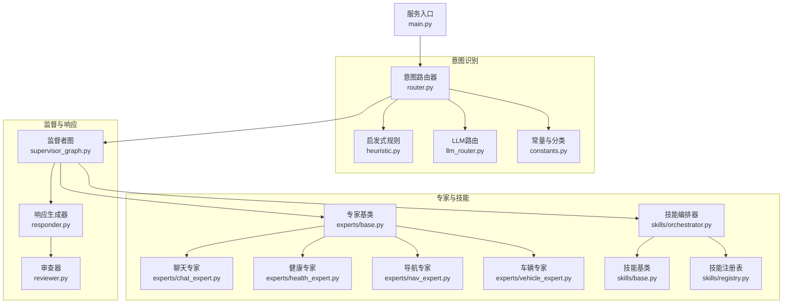
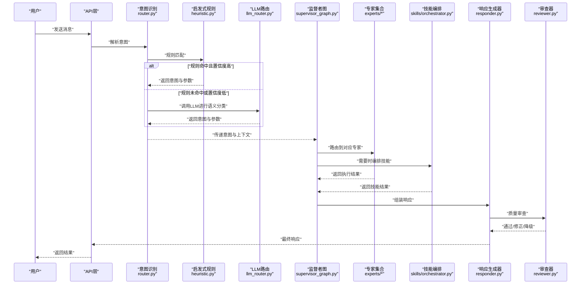
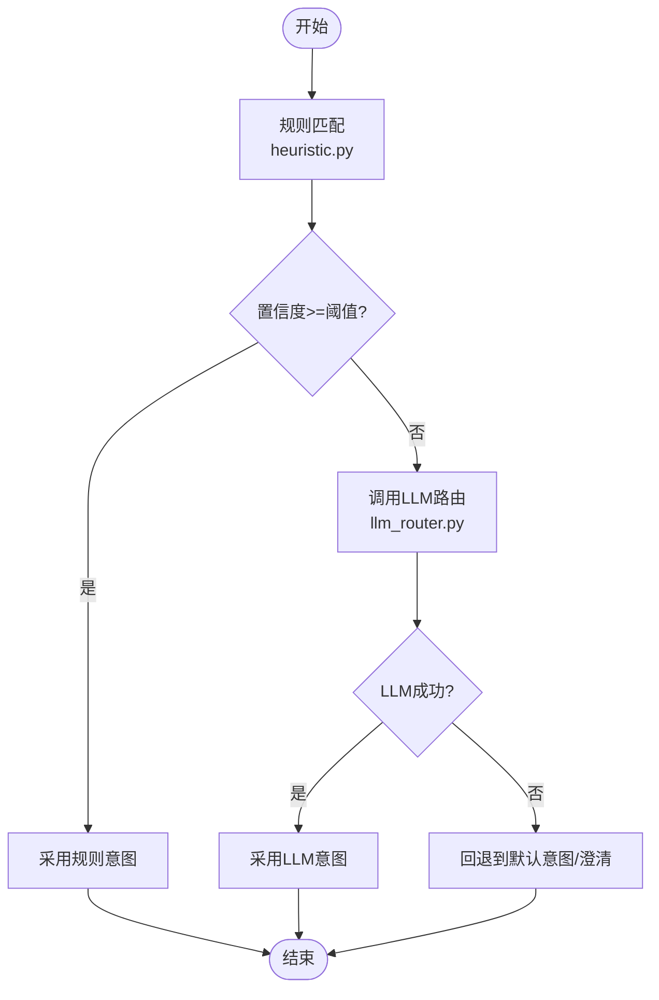
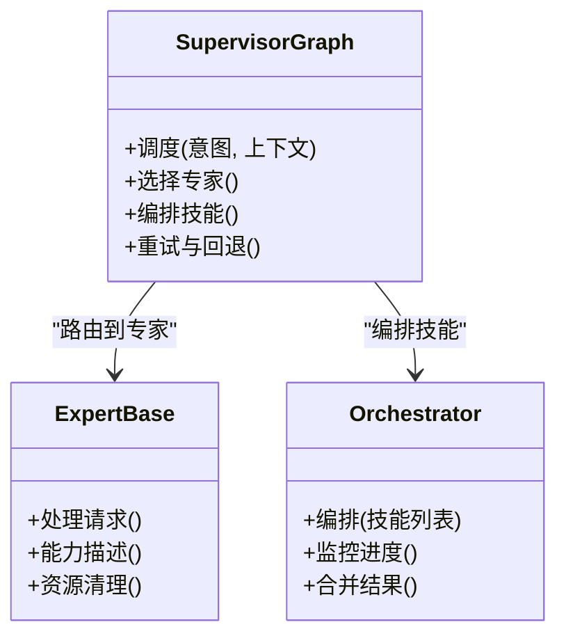
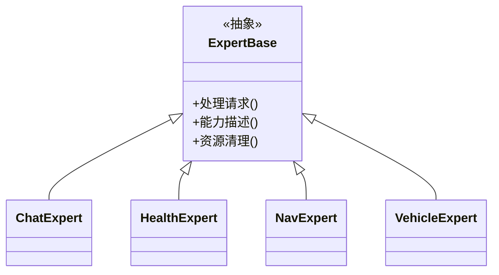
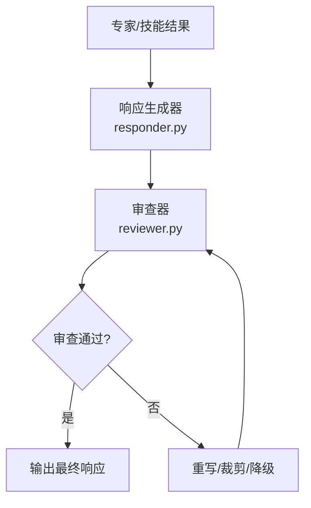
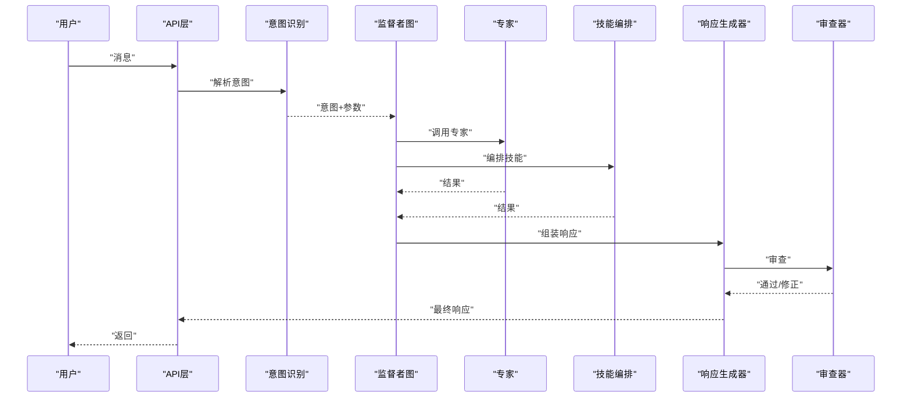
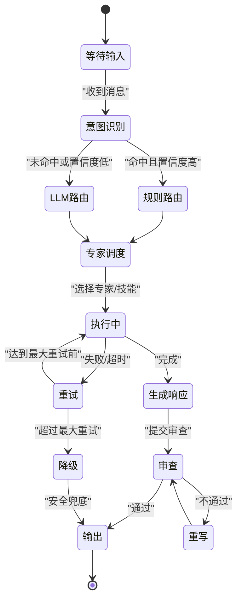
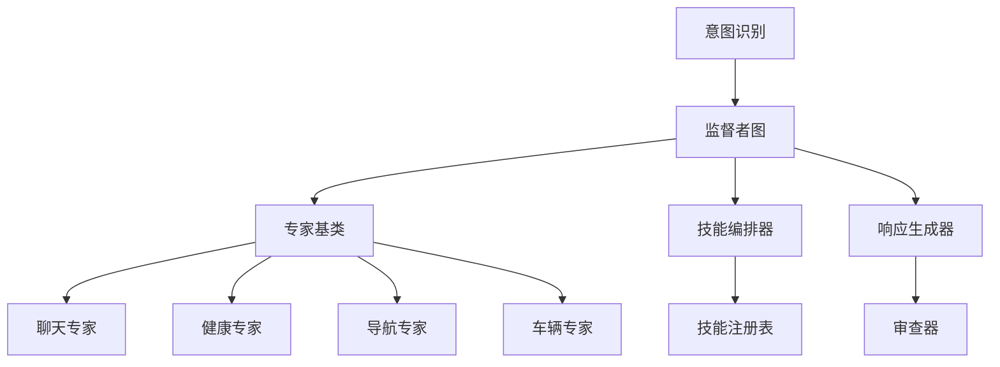

# AI Agent系统

<cite>
**本文引用的文件**   
- [supervisor_graph.py](file://backend_design/nexus/agent/supervisor_graph.py)
- [responder.py](file://backend_design/nexus/agent/responder.py)
- [reviewer.py](file://backend_design/nexus/agent/reviewer.py)
- [base.py](file://backend_design/nexus/agent/experts/base.py)
- [chat_expert.py](file://backend_design/nexus/agent/experts/chat_expert.py)
- [health_expert.py](file://backend_design/nexus/agent/experts/health_expert.py)
- [nav_expert.py](file://backend_design/nexus/agent/experts/nav_expert.py)
- [vehicle_expert.py](file://backend_design/nexus/agent/experts/vehicle_expert.py)
- [llm_router.py](file://backend_design/nexus/intent/llm_router.py)
- [heuristic.py](file://backend_design/nexus/intent/heuristic.py)
- [router.py](file://backend_design/nexus/intent/router.py)
- [constants.py](file://backend_design/nexus/intent/constants.py)
- [orchestrator.py](file://backend_design/nexus/skills/orchestrator.py)
- [registry.py](file://backend_design/nexus/skills/registry.py)
- [base.py](file://backend_design/nexus/skills/base.py)
- [main.py](file://backend_design/nexus/main.py)
</cite>

## 目录
1. [简介](#简介)
2. [项目结构](#项目结构)
3. [核心组件](#核心组件)
4. [架构总览](#架构总览)
5. [详细组件分析](#详细组件分析)
6. [依赖关系分析](#依赖关系分析)
7. [性能考量](#性能考量)
8. [故障排查指南](#故障排查指南)
9. [结论](#结论)
10. [附录](#附录)

## 简介
本设计文档面向NexusCockpit的AI Agent系统，聚焦多专家协作架构与意图识别、路由策略、响应生成与审查质量保障等关键环节。文档将解释监督者图（Supervisor Graph）的调度机制、专家路由器决策逻辑、响应生成器与审查器的质量保证流程；阐述意图识别模块如何实现语义理解以及LLM路由与传统规则路由的选择策略；并详细说明聊天、健康、导航、车辆四大专家的职责分工与协作模式。最后提供专家插件开发指南（接口定义、注册机制、生命周期管理），并给出交互时序图与状态转换图，帮助开发者快速理解Agent系统的整体运作流程。

## 项目结构
Agent相关代码主要位于后端设计的nexus子系统中，围绕“意图识别—专家路由—执行—响应生成—审查”的主链路组织：
- 意图识别：intent包负责用户输入的语义理解与路由选择（规则或LLM）。
- 专家体系：agent/experts下定义专家基类与各领域专家实现；skills为技能编排与注册中心。
- 监督者与编排：agent/supervisor_graph.py作为监督者图，协调专家调用与流程控制；skills/orchestrator.py进行更高层的技能编排。
- 响应与审查：agent/responder.py负责组装最终回复；agent/reviewer.py负责质量审查与回退策略。
- 入口与配置：nexus/main.py作为服务入口，加载配置并启动各子系统。

图表来源
- [router.py](file://backend_design/nexus/intent/router.py)
- [heuristic.py](file://backend_design/nexus/intent/heuristic.py)
- [llm_router.py](file://backend_design/nexus/intent/llm_router.py)
- [constants.py](file://backend_design/nexus/intent/constants.py)
- [supervisor_graph.py](file://backend_design/nexus/agent/supervisor_graph.py)
- [base.py](file://backend_design/nexus/agent/experts/base.py)
- [chat_expert.py](file://backend_design/nexus/agent/experts/chat_expert.py)
- [health_expert.py](file://backend_design/nexus/agent/experts/health_expert.py)
- [nav_expert.py](file://backend_design/nexus/agent/experts/nav_expert.py)
- [vehicle_expert.py](file://backend_design/nexus/agent/experts/vehicle_expert.py)
- [base.py](file://backend_design/nexus/skills/base.py)
- [registry.py](file://backend_design/nexus/skills/registry.py)
- [orchestrator.py](file://backend_design/nexus/skills/orchestrator.py)
- [responder.py](file://backend_design/nexus/agent/responder.py)
- [reviewer.py](file://backend_design/nexus/agent/reviewer.py)
- [main.py](file://backend_design/nexus/main.py)

章节来源
- [main.py](file://backend_design/nexus/main.py)

## 核心组件
- 意图识别与路由
  - 传统规则路由：基于关键词、正则、上下文窗口与阈值判定的启发式匹配，适合低延迟与高确定性场景。
  - LLM路由：通过轻量提示与结构化输出，对复杂、模糊或多意图输入进行语义理解与分类，适合长尾与开放域场景。
  - 选择策略：默认优先规则路由，当置信度低于阈值或命中“需语义判断”类别时降级至LLM路由，兼顾性能与准确率。
- 监督者图（Supervisor Graph）
  - 作为流程编排节点，接收意图分类结果，动态选择专家或技能组合，维护会话上下文与重试/回退策略。
- 专家体系
  - 统一专家接口：所有专家继承自专家基类，暴露标准化方法（如处理请求、获取能力描述、资源清理等）。
  - 领域专家：聊天、健康、导航、车辆分别覆盖对话、健康数据与建议、路径规划与POI、车辆控制与状态查询。
- 响应生成器与审查器
  - 响应生成器：聚合专家输出，结合模板与个性化信息生成最终文本/结构化响应。
  - 审查器：对响应进行合规性、安全性、完整性检查，必要时触发重写或降级到安全兜底内容。

章节来源
- [router.py](file://backend_design/nexus/intent/router.py)
- [heuristic.py](file://backend_design/nexus/intent/heuristic.py)
- [llm_router.py](file://backend_design/nexus/intent/llm_router.py)
- [supervisor_graph.py](file://backend_design/nexus/agent/supervisor_graph.py)
- [base.py](file://backend_design/nexus/agent/experts/base.py)
- [chat_expert.py](file://backend_design/nexus/agent/experts/chat_expert.py)
- [health_expert.py](file://backend_design/nexus/agent/experts/health_expert.py)
- [nav_expert.py](file://backend_design/nexus/agent/experts/nav_expert.py)
- [vehicle_expert.py](file://backend_design/nexus/agent/experts/vehicle_expert.py)
- [responder.py](file://backend_design/nexus/agent/responder.py)
- [reviewer.py](file://backend_design/nexus/agent/reviewer.py)

## 架构总览
下图展示了从用户输入到最终响应的端到端流程，包括意图识别、专家路由、执行、响应生成与审查的关键环节。

图表来源
- [router.py](file://backend_design/nexus/intent/router.py)
- [heuristic.py](file://backend_design/nexus/intent/heuristic.py)
- [llm_router.py](file://backend_design/nexus/intent/llm_router.py)
- [supervisor_graph.py](file://backend_design/nexus/agent/supervisor_graph.py)
- [base.py](file://backend_design/nexus/agent/experts/base.py)
- [chat_expert.py](file://backend_design/nexus/agent/experts/chat_expert.py)
- [health_expert.py](file://backend_design/nexus/agent/experts/health_expert.py)
- [nav_expert.py](file://backend_design/nexus/agent/experts/nav_expert.py)
- [vehicle_expert.py](file://backend_design/nexus/agent/experts/vehicle_expert.py)
- [orchestrator.py](file://backend_design/nexus/skills/orchestrator.py)
- [responder.py](file://backend_design/nexus/agent/responder.py)
- [reviewer.py](file://backend_design/nexus/agent/reviewer.py)

## 详细组件分析

### 意图识别与路由策略
- 传统规则路由（启发式）
  - 基于关键词、正则表达式、上下文窗口统计与阈值判定，快速返回意图与参数。
  - 适用于高频、明确、短文本场景，具备极低延迟与高稳定性。
- LLM路由
  - 使用轻量提示与结构化输出约束，对复杂、模糊、多意图输入进行语义理解与分类。
  - 在规则置信度不足或遇到开放域问题时启用，提升准确率与泛化能力。
- 选择策略
  - 默认先走规则路由；若命中且置信度高于阈值则直接采用；否则切换至LLM路由。
  - 可配置降级开关与超时保护，避免LLM异常影响整体可用性。

图表来源
- [heuristic.py](file://backend_design/nexus/intent/heuristic.py)
- [llm_router.py](file://backend_design/nexus/intent/llm_router.py)
- [router.py](file://backend_design/nexus/intent/router.py)
- [constants.py](file://backend_design/nexus/intent/constants.py)

章节来源
- [router.py](file://backend_design/nexus/intent/router.py)
- [heuristic.py](file://backend_design/nexus/intent/heuristic.py)
- [llm_router.py](file://backend_design/nexus/intent/llm_router.py)
- [constants.py](file://backend_design/nexus/intent/constants.py)

### 监督者图（Supervisor Graph）调度机制
- 职责
  - 接收意图识别结果，维护会话上下文，决定调用哪个专家或编排哪些技能。
  - 管理重试、超时、熔断与回退策略，确保鲁棒性。
- 调度流程
  - 根据意图类型与参数，选择单一专家或专家+技能的组合。
  - 对关键操作设置最大重试次数与超时时间；失败时触发降级或澄清。
- 与专家/技能的协作
  - 专家负责领域内具体任务；技能编排器负责跨领域任务的组合与顺序控制。

图表来源
- [supervisor_graph.py](file://backend_design/nexus/agent/supervisor_graph.py)
- [base.py](file://backend_design/nexus/agent/experts/base.py)
- [orchestrator.py](file://backend_design/nexus/skills/orchestrator.py)

章节来源
- [supervisor_graph.py](file://backend_design/nexus/agent/supervisor_graph.py)
- [base.py](file://backend_design/nexus/agent/experts/base.py)
- [orchestrator.py](file://backend_design/nexus/skills/orchestrator.py)

### 专家体系与职责分工
- 专家基类
  - 定义统一的接口契约：处理请求、能力描述、资源清理等，便于扩展与替换。
- 聊天专家
  - 负责通用对话、闲聊、澄清与引导，结合记忆与偏好生成自然回复。
- 健康专家
  - 对接健康数据源，提供指标解读、建议与提醒，遵循医疗免责声明与安全边界。
- 导航专家
  - 处理路径规划、POI搜索、路线优化与实时路况，返回结构化导航指令。
- 车辆专家
  - 负责车辆状态查询与控制（空调、座椅、车窗、媒体等），严格权限校验与操作确认。

图表来源
- [base.py](file://backend_design/nexus/agent/experts/base.py)
- [chat_expert.py](file://backend_design/nexus/agent/experts/chat_expert.py)
- [health_expert.py](file://backend_design/nexus/agent/experts/health_expert.py)
- [nav_expert.py](file://backend_design/nexus/agent/experts/nav_expert.py)
- [vehicle_expert.py](file://backend_design/nexus/agent/experts/vehicle_expert.py)

章节来源
- [base.py](file://backend_design/nexus/agent/experts/base.py)
- [chat_expert.py](file://backend_design/nexus/agent/experts/chat_expert.py)
- [health_expert.py](file://backend_design/nexus/agent/experts/health_expert.py)
- [nav_expert.py](file://backend_design/nexus/agent/experts/nav_expert.py)
- [vehicle_expert.py](file://backend_design/nexus/agent/experts/vehicle_expert.py)

### 响应生成器与审查器（质量保证）
- 响应生成器
  - 聚合专家与技能结果，结合模板、个性化信息与上下文，生成最终文本或结构化响应。
- 审查器
  - 对响应进行合规性、安全性、完整性检查；必要时触发重写、裁剪或降级到安全兜底内容。
  - 支持可插拔策略（如敏感词过滤、格式校验、长度限制、隐私脱敏）。

图表来源
- [responder.py](file://backend_design/nexus/agent/responder.py)
- [reviewer.py](file://backend_design/nexus/agent/reviewer.py)

章节来源
- [responder.py](file://backend_design/nexus/agent/responder.py)
- [reviewer.py](file://backend_design/nexus/agent/reviewer.py)

### 交互时序图（端到端）

图表来源
- [router.py](file://backend_design/nexus/intent/router.py)
- [supervisor_graph.py](file://backend_design/nexus/agent/supervisor_graph.py)
- [base.py](file://backend_design/nexus/agent/experts/base.py)
- [orchestrator.py](file://backend_design/nexus/skills/orchestrator.py)
- [responder.py](file://backend_design/nexus/agent/responder.py)
- [reviewer.py](file://backend_design/nexus/agent/reviewer.py)

### 状态转换图（监督者图）

图表来源
- [supervisor_graph.py](file://backend_design/nexus/agent/supervisor_graph.py)
- [responder.py](file://backend_design/nexus/agent/responder.py)
- [reviewer.py](file://backend_design/nexus/agent/reviewer.py)

## 依赖关系分析
- 组件耦合
  - 意图识别与监督者图松耦合：通过标准意图对象传递，便于替换路由实现。
  - 监督者图与专家/技能解耦：通过统一接口与注册表，支持热插拔与A/B测试。
- 外部依赖
  - LLM路由依赖大模型服务；规则路由依赖本地配置与词典；技能编排可能依赖车辆总线、地图服务与健康数据源。
- 潜在循环依赖
  - 通过分层与接口隔离避免循环；监督者图仅依赖抽象接口，不直接依赖具体专家实现。

图表来源
- [router.py](file://backend_design/nexus/intent/router.py)
- [supervisor_graph.py](file://backend_design/nexus/agent/supervisor_graph.py)
- [base.py](file://backend_design/nexus/agent/experts/base.py)
- [chat_expert.py](file://backend_design/nexus/agent/experts/chat_expert.py)
- [health_expert.py](file://backend_design/nexus/agent/experts/health_expert.py)
- [nav_expert.py](file://backend_design/nexus/agent/experts/nav_expert.py)
- [vehicle_expert.py](file://backend_design/nexus/agent/experts/vehicle_expert.py)
- [orchestrator.py](file://backend_design/nexus/skills/orchestrator.py)
- [registry.py](file://backend_design/nexus/skills/registry.py)
- [responder.py](file://backend_design/nexus/agent/responder.py)
- [reviewer.py](file://backend_design/nexus/agent/reviewer.py)

章节来源
- [router.py](file://backend_design/nexus/intent/router.py)
- [supervisor_graph.py](file://backend_design/nexus/agent/supervisor_graph.py)
- [base.py](file://backend_design/nexus/agent/experts/base.py)
- [orchestrator.py](file://backend_design/nexus/skills/orchestrator.py)
- [registry.py](file://backend_design/nexus/skills/registry.py)
- [responder.py](file://backend_design/nexus/agent/responder.py)
- [reviewer.py](file://backend_design/nexus/agent/reviewer.py)

## 性能考量
- 路由策略
  - 规则路由优先，减少LLM调用开销；仅在必要时启用LLM路由，降低延迟与成本。
- 并发与缓存
  - 对热点意图与静态知识进行缓存；专家与技能调用可并行编排以提升吞吐。
- 超时与熔断
  - 为外部依赖（LLM、地图、车辆总线）设置超时与熔断，避免雪崩效应。
- 审查批量化
  - 审查器支持批量处理与流水线化，减少重复计算与IO开销。

[本节为通用指导，无需特定文件引用]

## 故障排查指南
- 常见问题定位
  - 意图识别失败：检查规则词典是否更新、LLM路由是否超时或返回非结构化结果。
  - 专家执行异常：查看专家日志与错误码，确认权限与参数合法性。
  - 响应审查失败：审查策略过于严格导致误杀，调整阈值或白名单。
- 调试建议
  - 开启详细日志与追踪ID，串联API—意图—监督者—专家—响应—审查全链路。
  - 使用最小复现用例与固定上下文，逐步缩小问题范围。

章节来源
- [supervisor_graph.py](file://backend_design/nexus/agent/supervisor_graph.py)
- [responder.py](file://backend_design/nexus/agent/responder.py)
- [reviewer.py](file://backend_design/nexus/agent/reviewer.py)

## 结论
NexusCockpit的AI Agent系统以“意图识别—专家路由—执行—响应生成—审查”为主线，通过监督者图实现灵活编排与稳健控制。规则与LLM双轨路由兼顾性能与准确性；专家与技能解耦设计便于扩展与维护；响应生成与审查形成闭环质量保证。该架构既满足车载场景的高可靠需求，也为后续功能演进提供了良好基础。

[本节为总结性内容，无需特定文件引用]

## 附录

### 专家插件开发指南
- 专家接口定义
  - 继承专家基类，实现处理请求、能力描述、资源清理等标准方法，确保与其他组件的兼容。
- 注册机制
  - 通过技能注册表登记专家元信息（名称、版本、能力标签、依赖），供监督者图发现与选择。
- 生命周期管理
  - 初始化阶段加载配置与资源；运行期处理请求并返回结构化结果；销毁阶段释放外部连接与缓存。
- 最佳实践
  - 保持幂等与容错；对外部依赖设置超时与重试；对敏感操作增加二次确认与审计日志。

章节来源
- [base.py](file://backend_design/nexus/agent/experts/base.py)
- [registry.py](file://backend_design/nexus/skills/registry.py)
- [base.py](file://backend_design/nexus/skills/base.py)