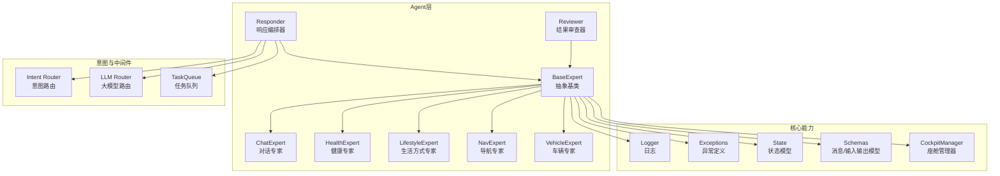
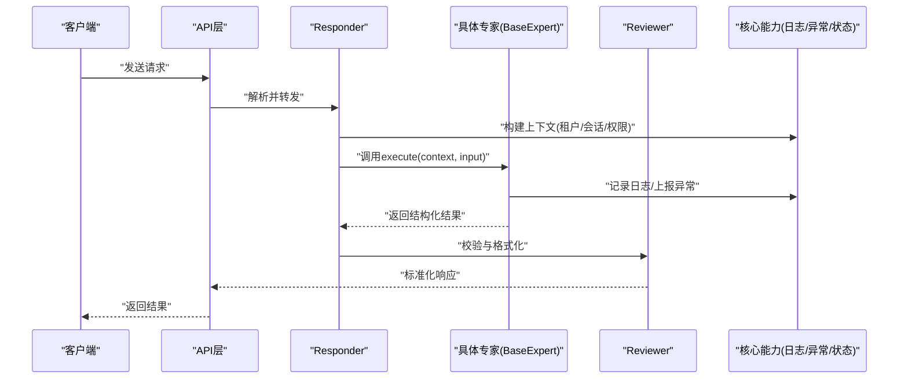
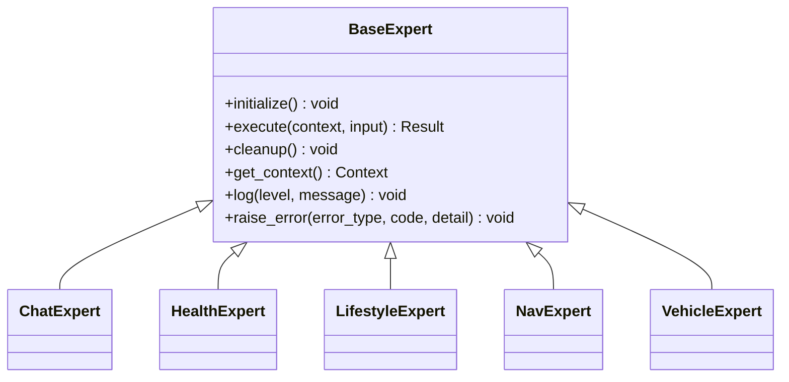
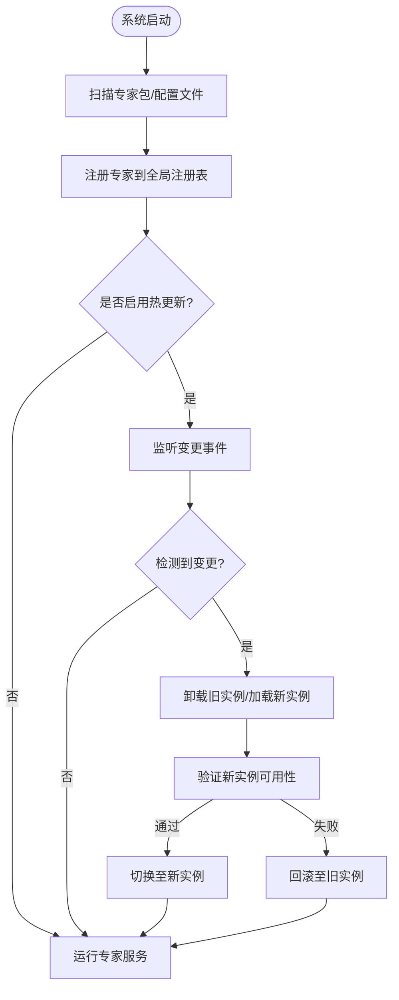
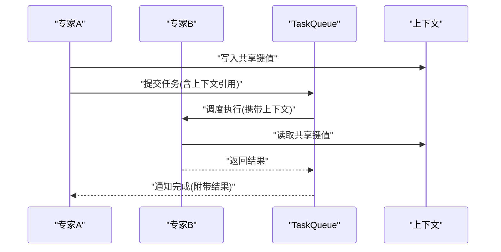
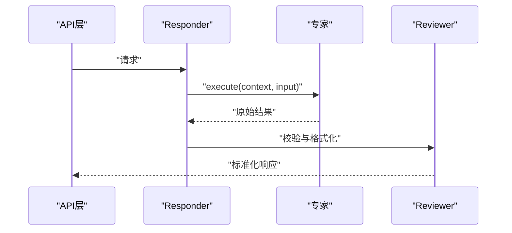
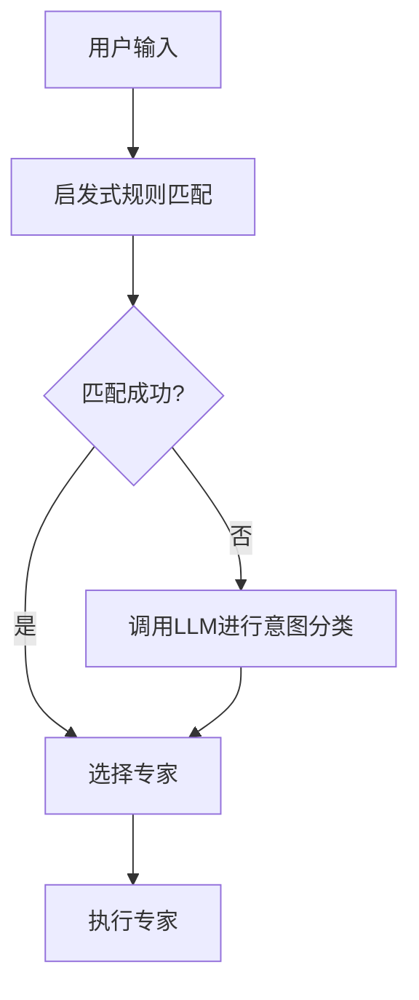
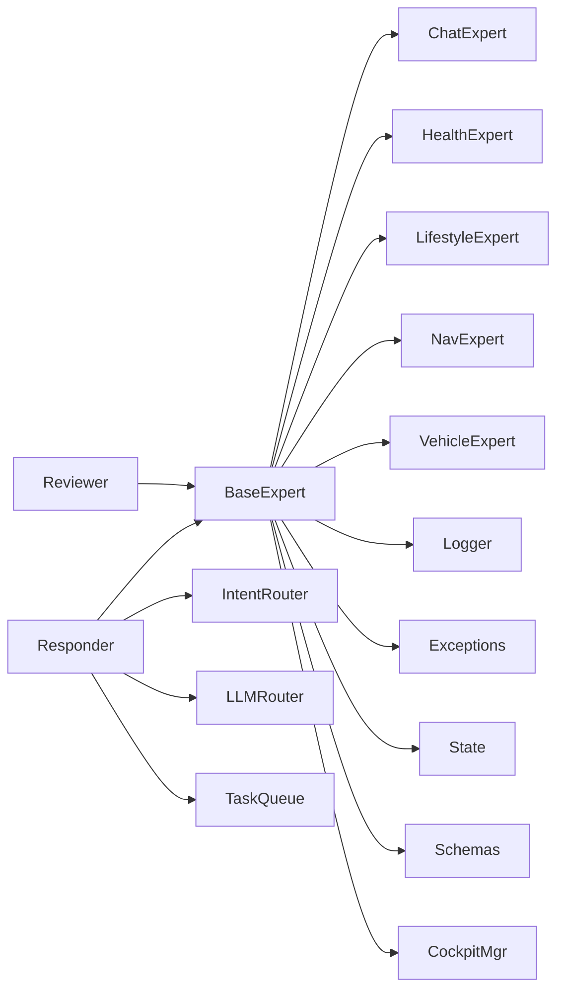

# 专家基类框架

<cite>
**本文引用的文件**   
- [backend_design/nexus/agent/experts/base.py](file://backend_design/nexus/agent/experts/base.py)
- [backend_design/nexus/agent/experts/chat_expert.py](file://backend_design/nexus/agent/experts/chat_expert.py)
- [backend_design/nexus/agent/experts/health_expert.py](file://backend_design/nexus/agent/experts/health_expert.py)
- [backend_design/nexus/agent/experts/lifestyle_expert.py](file://backend_design/nexus/agent/experts/lifestyle_expert.py)
- [backend_design/nexus/agent/experts/nav_expert.py](file://backend_design/nexus/agent/experts/nav_expert.py)
- [backend_design/nexus/agent/experts/vehicle_expert.py](file://backend_design/nexus/agent/experts/vehicle_expert.py)
- [backend_design/nexus/agent/responder.py](file://backend_design/nexus/agent/responder.py)
- [backend_design/nexus/agent/reviewer.py](file://backend_design/nexus/agent/reviewer.py)
- [backend_design/nexus/core/logger.py](file://backend_design/nexus/core/logger.py)
- [backend_design/nexus/core/exceptions.py](file://backend_design/nexus/core/exceptions.py)
- [backend_design/nexus/core/cockpit_manager.py](file://backend_design/nexus/core/cockpit_manager.py)
- [backend_design/nexus/models/schemas.py](file://backend_design/nexus/models/schemas.py)
- [backend_design/nexus/models/state.py](file://backend_design/nexus/models/state.py)
- [backend_design/nexus/intent/router.py](file://backend_design/nexus/intent/router.py)
- [backend_design/nexus/intent/llm_router.py](file://backend_design/nexus/intent/llm_router.py)
- [backend_design/nexus/middleware/task_queue.py](file://backend_design/nexus/middleware/task_queue.py)
</cite>

## 目录
1. [简介](#简介)
2. [项目结构](#项目结构)
3. [核心组件](#核心组件)
4. [架构总览](#架构总览)
5. [详细组件分析](#详细组件分析)
6. [依赖关系分析](#依赖关系分析)
7. [性能考量](#性能考量)
8. [故障排查指南](#故障排查指南)
9. [结论](#结论)
10. [附录](#附录)

## 简介
本文件面向NexusCockpit的“专家”体系，聚焦于专家基类框架的设计与实现。文档围绕以下目标展开：
- 深入解释BaseExpert抽象类的设计模式、核心接口与生命周期管理（初始化、执行、清理）
- 说明上下文传递机制、错误处理与日志记录策略
- 阐述专家注册机制、动态加载与热更新支持
- 介绍专家间通信协议、消息格式与数据交换标准
- 提供专家开发最佳实践（性能优化、资源管理、异常处理）
- 给出集成指南与示例路径，帮助快速上手

## 项目结构
专家相关代码位于后端设计目录下的agent模块中，包含抽象基类、具体专家实现、编排与路由组件以及支撑的核心能力（日志、异常、状态等）。

图表来源
- [backend_design/nexus/agent/experts/base.py](file://backend_design/nexus/agent/experts/base.py)
- [backend_design/nexus/agent/experts/chat_expert.py](file://backend_design/nexus/agent/experts/chat_expert.py)
- [backend_design/nexus/agent/experts/health_expert.py](file://backend_design/nexus/agent/experts/health_expert.py)
- [backend_design/nexus/agent/experts/lifestyle_expert.py](file://backend_design/nexus/agent/experts/lifestyle_expert.py)
- [backend_design/nexus/agent/experts/nav_expert.py](file://backend_design/nexus/agent/experts/nav_expert.py)
- [backend_design/nexus/agent/experts/vehicle_expert.py](file://backend_design/nexus/agent/experts/vehicle_expert.py)
- [backend_design/nexus/agent/responder.py](file://backend_design/nexus/agent/responder.py)
- [backend_design/nexus/agent/reviewer.py](file://backend_design/nexus/agent/reviewer.py)
- [backend_design/nexus/core/logger.py](file://backend_design/nexus/core/logger.py)
- [backend_design/nexus/core/exceptions.py](file://backend_design/nexus/core/exceptions.py)
- [backend_design/nexus/models/state.py](file://backend_design/nexus/models/state.py)
- [backend_design/nexus/models/schemas.py](file://backend_design/nexus/models/schemas.py)
- [backend_design/nexus/core/cockpit_manager.py](file://backend_design/nexus/core/cockpit_manager.py)
- [backend_design/nexus/intent/router.py](file://backend_design/nexus/intent/router.py)
- [backend_design/nexus/intent/llm_router.py](file://backend_design/nexus/intent/llm_router.py)
- [backend_design/nexus/middleware/task_queue.py](file://backend_design/nexus/middleware/task_queue.py)

章节来源
- [backend_design/nexus/agent/experts/base.py](file://backend_design/nexus/agent/experts/base.py)
- [backend_design/nexus/agent/responder.py](file://backend_design/nexus/agent/responder.py)
- [backend_design/nexus/agent/reviewer.py](file://backend_design/nexus/agent/reviewer.py)
- [backend_design/nexus/core/logger.py](file://backend_design/nexus/core/logger.py)
- [backend_design/nexus/core/exceptions.py](file://backend_design/nexus/core/exceptions.py)
- [backend_design/nexus/models/state.py](file://backend_design/nexus/models/state.py)
- [backend_design/nexus/models/schemas.py](file://backend_design/nexus/models/schemas.py)
- [backend_design/nexus/core/cockpit_manager.py](file://backend_design/nexus/core/cockpit_manager.py)
- [backend_design/nexus/intent/router.py](file://backend_design/nexus/intent/router.py)
- [backend_design/nexus/intent/llm_router.py](file://backend_design/nexus/intent/llm_router.py)
- [backend_design/nexus/middleware/task_queue.py](file://backend_design/nexus/middleware/task_queue.py)

## 核心组件
- BaseExpert抽象类
  - 职责：定义专家的统一接口与生命周期钩子，封装上下文、日志、异常与资源管理模板方法
  - 关键接口：初始化、执行、清理；上下文访问；错误上报；可观测性埋点
- 具体专家实现
  - ChatExpert：对话领域专家
  - HealthExpert：健康领域专家
  - LifestyleExpert：生活方式专家
  - NavExpert：导航专家
  - VehicleExpert：车辆控制专家
- 编排与审查
  - Responder：负责将用户请求路由到合适的专家，并协调多专家协作
  - Reviewer：对专家输出进行校验、格式化与合规检查
- 核心支撑
  - Logger：统一日志接入
  - Exceptions：统一异常类型与错误码
  - State/Schemas：专家输入输出与状态模型
  - CockpitManager：座舱级能力（如设备、会话、权限）访问
  - Intent Router/LLM Router：意图识别与大模型路由
  - TaskQueue：异步任务与削峰填谷

章节来源
- [backend_design/nexus/agent/experts/base.py](file://backend_design/nexus/agent/experts/base.py)
- [backend_design/nexus/agent/experts/chat_expert.py](file://backend_design/nexus/agent/experts/chat_expert.py)
- [backend_design/nexus/agent/experts/health_expert.py](file://backend_design/nexus/agent/experts/health_expert.py)
- [backend_design/nexus/agent/experts/lifestyle_expert.py](file://backend_design/nexus/agent/experts/lifestyle_expert.py)
- [backend_design/nexus/agent/experts/nav_expert.py](file://backend_design/nexus/agent/experts/nav_expert.py)
- [backend_design/nexus/agent/experts/vehicle_expert.py](file://backend_design/nexus/agent/experts/vehicle_expert.py)
- [backend_design/nexus/agent/responder.py](file://backend_design/nexus/agent/responder.py)
- [backend_design/nexus/agent/reviewer.py](file://backend_design/nexus/agent/reviewer.py)
- [backend_design/nexus/core/logger.py](file://backend_design/nexus/core/logger.py)
- [backend_design/nexus/core/exceptions.py](file://backend_design/nexus/core/exceptions.py)
- [backend_design/nexus/models/state.py](file://backend_design/nexus/models/state.py)
- [backend_design/nexus/models/schemas.py](file://backend_design/nexus/models/schemas.py)
- [backend_design/nexus/core/cockpit_manager.py](file://backend_design/nexus/core/cockpit_manager.py)
- [backend_design/nexus/intent/router.py](file://backend_design/nexus/intent/router.py)
- [backend_design/nexus/intent/llm_router.py](file://backend_design/nexus/intent/llm_router.py)
- [backend_design/nexus/middleware/task_queue.py](file://backend_design/nexus/middleware/task_queue.py)

## 架构总览
专家体系采用“抽象基类 + 具体实现 + 编排器 + 审查器”的分层架构。请求进入后由Responser根据意图选择专家，专家在统一的上下文中执行，并通过Review标准化输出。

图表来源
- [backend_design/nexus/agent/responder.py](file://backend_design/nexus/agent/responder.py)
- [backend_design/nexus/agent/experts/base.py](file://backend_design/nexus/agent/experts/base.py)
- [backend_design/nexus/agent/reviewer.py](file://backend_design/nexus/agent/reviewer.py)
- [backend_design/nexus/core/logger.py](file://backend_design/nexus/core/logger.py)
- [backend_design/nexus/core/exceptions.py](file://backend_design/nexus/core/exceptions.py)
- [backend_design/nexus/models/state.py](file://backend_design/nexus/models/state.py)

## 详细组件分析

### BaseExpert抽象类
- 设计模式
  - 模板方法：定义init/execute/cleanup生命周期，子类仅实现业务逻辑
  - 上下文注入：通过上下文对象提供会话、租户、配置、外部服务访问
  - 异常与日志：统一捕获与上报，保证可观测性与一致性
- 核心接口
  - 初始化：准备资源、加载配置、建立连接
  - 执行：接收输入与上下文，返回结构化结果
  - 清理：释放资源、关闭连接、清理临时状态
- 上下文传递
  - 包含用户标识、会话ID、租户信息、权限范围、追踪ID等
  - 支持跨专家共享上下文，便于协作与审计
- 错误处理
  - 定义领域异常类型，区分可恢复与不可恢复错误
  - 提供降级策略与默认返回值
- 日志记录
  - 结构化日志，包含trace_id、expert_name、input/output摘要
  - 支持分级日志与采样策略

图表来源
- [backend_design/nexus/agent/experts/base.py](file://backend_design/nexus/agent/experts/base.py)
- [backend_design/nexus/agent/experts/chat_expert.py](file://backend_design/nexus/agent/experts/chat_expert.py)
- [backend_design/nexus/agent/experts/health_expert.py](file://backend_design/nexus/agent/experts/health_expert.py)
- [backend_design/nexus/agent/experts/lifestyle_expert.py](file://backend_design/nexus/agent/experts/lifestyle_expert.py)
- [backend_design/nexus/agent/experts/nav_expert.py](file://backend_design/nexus/agent/experts/nav_expert.py)
- [backend_design/nexus/agent/experts/vehicle_expert.py](file://backend_design/nexus/agent/experts/vehicle_expert.py)

章节来源
- [backend_design/nexus/agent/experts/base.py](file://backend_design/nexus/agent/experts/base.py)

### 专家注册机制、动态加载与热更新
- 注册机制
  - 通过装饰器或显式注册表将专家实例加入全局注册表
  - 支持按领域标签、版本、优先级进行元数据标注
- 动态加载
  - 基于包扫描或配置文件发现新专家
  - 支持按需导入，避免启动时全量加载
- 热更新
  - 监听文件系统或配置中心变更，触发重新加载
  - 保持旧实例运行直至新实例就绪，确保零停机切换

图表来源
- [backend_design/nexus/agent/experts/base.py](file://backend_design/nexus/agent/experts/base.py)
- [backend_design/nexus/core/cockpit_manager.py](file://backend_design/nexus/core/cockpit_manager.py)

章节来源
- [backend_design/nexus/agent/experts/base.py](file://backend_design/nexus/agent/experts/base.py)
- [backend_design/nexus/core/cockpit_manager.py](file://backend_design/nexus/core/cockpit_manager.py)

### 专家间通信协议、消息格式与数据交换标准
- 通信协议
  - 同步调用：通过Responser直接调用专家接口
  - 异步协作：通过TaskQueue派发长耗时任务
- 消息格式
  - 输入：标准化Schema，包含意图、参数、上下文引用
  - 输出：结构化Result，包含数据、元数据、状态码
- 数据交换标准
  - 使用统一State模型表示会话状态
  - 使用Schemas定义字段约束与枚举值
  - 跨专家共享上下文键约定，避免命名冲突

图表来源
- [backend_design/nexus/middleware/task_queue.py](file://backend_design/nexus/middleware/task_queue.py)
- [backend_design/nexus/models/state.py](file://backend_design/nexus/models/state.py)
- [backend_design/nexus/models/schemas.py](file://backend_design/nexus/models/schemas.py)

章节来源
- [backend_design/nexus/middleware/task_queue.py](file://backend_design/nexus/middleware/task_queue.py)
- [backend_design/nexus/models/state.py](file://backend_design/nexus/models/state.py)
- [backend_design/nexus/models/schemas.py](file://backend_design/nexus/models/schemas.py)

### 编排与审查流程
- Responser
  - 解析请求，构建上下文
  - 根据意图路由选择专家
  - 协调多专家协作与超时控制
- Reviewer
  - 校验输出结构与字段完整性
  - 格式化敏感信息与脱敏
  - 附加可观测性指标与审计信息

图表来源
- [backend_design/nexus/agent/responder.py](file://backend_design/nexus/agent/responder.py)
- [backend_design/nexus/agent/reviewer.py](file://backend_design/nexus/agent/reviewer.py)

章节来源
- [backend_design/nexus/agent/responder.py](file://backend_design/nexus/agent/responder.py)
- [backend_design/nexus/agent/reviewer.py](file://backend_design/nexus/agent/reviewer.py)

### 意图识别与路由
- Intent Router
  - 基于规则或启发式匹配确定领域
  - 支持权重与优先级
- LLM Router
  - 当规则无法明确时，借助大模型进行意图分类
  - 缓存常见意图以提升性能

图表来源
- [backend_design/nexus/intent/router.py](file://backend_design/nexus/intent/router.py)
- [backend_design/nexus/intent/llm_router.py](file://backend_design/nexus/intent/llm_router.py)

章节来源
- [backend_design/nexus/intent/router.py](file://backend_design/nexus/intent/router.py)
- [backend_design/nexus/intent/llm_router.py](file://backend_design/nexus/intent/llm_router.py)

## 依赖关系分析
- 耦合度
  - BaseExpert与具体专家为松耦合继承关系
  - Responser与专家通过统一接口交互，降低硬编码依赖
- 外部依赖
  - 日志、异常、状态、Schema等核心能力被广泛复用
  - 中间件TaskQueue用于异步扩展
- 潜在循环依赖
  - 建议通过接口隔离与依赖注入避免循环

图表来源
- [backend_design/nexus/agent/experts/base.py](file://backend_design/nexus/agent/experts/base.py)
- [backend_design/nexus/agent/responder.py](file://backend_design/nexus/agent/responder.py)
- [backend_design/nexus/agent/reviewer.py](file://backend_design/nexus/agent/reviewer.py)
- [backend_design/nexus/core/logger.py](file://backend_design/nexus/core/logger.py)
- [backend_design/nexus/core/exceptions.py](file://backend_design/nexus/core/exceptions.py)
- [backend_design/nexus/models/state.py](file://backend_design/nexus/models/state.py)
- [backend_design/nexus/models/schemas.py](file://backend_design/nexus/models/schemas.py)
- [backend_design/nexus/core/cockpit_manager.py](file://backend_design/nexus/core/cockpit_manager.py)
- [backend_design/nexus/intent/router.py](file://backend_design/nexus/intent/router.py)
- [backend_design/nexus/intent/llm_router.py](file://backend_design/nexus/intent/llm_router.py)
- [backend_design/nexus/middleware/task_queue.py](file://backend_design/nexus/middleware/task_queue.py)

章节来源
- [backend_design/nexus/agent/experts/base.py](file://backend_design/nexus/agent/experts/base.py)
- [backend_design/nexus/agent/responder.py](file://backend_design/nexus/agent/responder.py)
- [backend_design/nexus/agent/reviewer.py](file://backend_design/nexus/agent/reviewer.py)
- [backend_design/nexus/core/logger.py](file://backend_design/nexus/core/logger.py)
- [backend_design/nexus/core/exceptions.py](file://backend_design/nexus/core/exceptions.py)
- [backend_design/nexus/models/state.py](file://backend_design/nexus/models/state.py)
- [backend_design/nexus/models/schemas.py](file://backend_design/nexus/models/schemas.py)
- [backend_design/nexus/core/cockpit_manager.py](file://backend_design/nexus/core/cockpit_manager.py)
- [backend_design/nexus/intent/router.py](file://backend_design/nexus/intent/router.py)
- [backend_design/nexus/intent/llm_router.py](file://backend_design/nexus/intent/llm_router.py)
- [backend_design/nexus/middleware/task_queue.py](file://backend_design/nexus/middleware/task_queue.py)

## 性能考量
- 专家执行
  - 避免阻塞操作，优先使用异步与并发
  - 对I/O密集任务使用TaskQueue削峰
- 上下文与序列化
  - 减少上下文体积，仅传递必要字段
  - 使用高效序列化格式（如Protobuf/MessagePack）
- 缓存与降级
  - 对热点数据进行本地或分布式缓存
  - 设置超时与熔断，防止雪崩
- 日志与可观测性
  - 结构化日志，避免过度打印
  - 采样与聚合，降低开销

[本节为通用指导，不直接分析具体文件]

## 故障排查指南
- 常见问题
  - 专家未注册：检查注册表与动态加载配置
  - 上下文缺失：确认Responser是否正确构建上下文
  - 输出校验失败：查看Reviewer的校验规则与Schema定义
- 定位步骤
  - 通过日志trace_id关联请求链路
  - 检查异常类型与错误码，定位具体环节
  - 使用状态模型核对会话状态流转
- 恢复策略
  - 自动重试与退避
  - 降级到默认专家或返回友好提示
  - 热更新失败时回滚至上一版本

章节来源
- [backend_design/nexus/core/logger.py](file://backend_design/nexus/core/logger.py)
- [backend_design/nexus/core/exceptions.py](file://backend_design/nexus/core/exceptions.py)
- [backend_design/nexus/models/state.py](file://backend_design/nexus/models/state.py)
- [backend_design/nexus/models/schemas.py](file://backend_design/nexus/models/schemas.py)
- [backend_design/nexus/agent/reviewer.py](file://backend_design/nexus/agent/reviewer.py)

## 结论
专家基类框架通过统一的抽象与生命周期管理，实现了高内聚、低耦合的专家生态。配合注册机制、动态加载与热更新，系统具备良好的可扩展性与稳定性。遵循本文的最佳实践与集成指南，可快速开发高质量专家并融入整体编排流程。

[本节为总结性内容，不直接分析具体文件]

## 附录
- 集成指南
  - 新建专家：继承BaseExpert，实现execute逻辑，注册到全局注册表
  - 配置上下文：在Responser中注入必要的会话与租户信息
  - 测试与验证：使用Reviewer的校验规则进行端到端验证
- 示例路径
  - 参考现有专家实现以了解最佳实践
    - [chat_expert.py](file://backend_design/nexus/agent/experts/chat_expert.py)
    - [health_expert.py](file://backend_design/nexus/agent/experts/health_expert.py)
    - [lifestyle_expert.py](file://backend_design/nexus/agent/experts/lifestyle_expert.py)
    - [nav_expert.py](file://backend_design/nexus/agent/experts/nav_expert.py)
    - [vehicle_expert.py](file://backend_design/nexus/agent/experts/vehicle_expert.py)

章节来源
- [backend_design/nexus/agent/experts/chat_expert.py](file://backend_design/nexus/agent/experts/chat_expert.py)
- [backend_design/nexus/agent/experts/health_expert.py](file://backend_design/nexus/agent/experts/health_expert.py)
- [backend_design/nexus/agent/experts/lifestyle_expert.py](file://backend_design/nexus/agent/experts/lifestyle_expert.py)
- [backend_design/nexus/agent/experts/nav_expert.py](file://backend_design/nexus/agent/experts/nav_expert.py)
- [backend_design/nexus/agent/experts/vehicle_expert.py](file://backend_design/nexus/agent/experts/vehicle_expert.py)