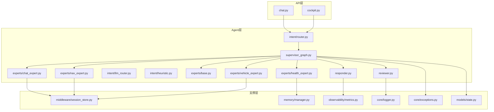
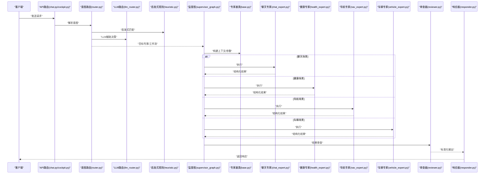
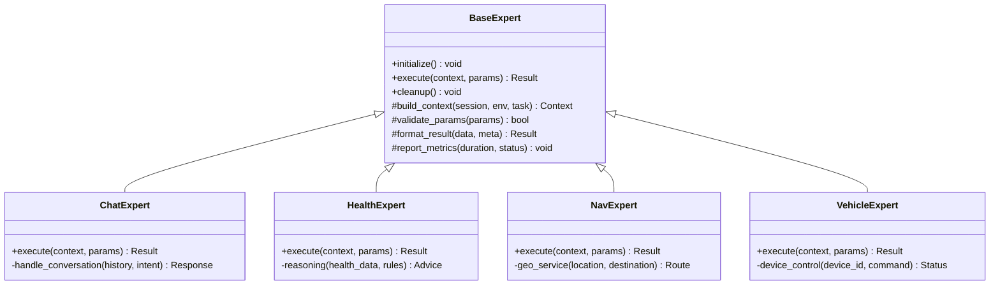
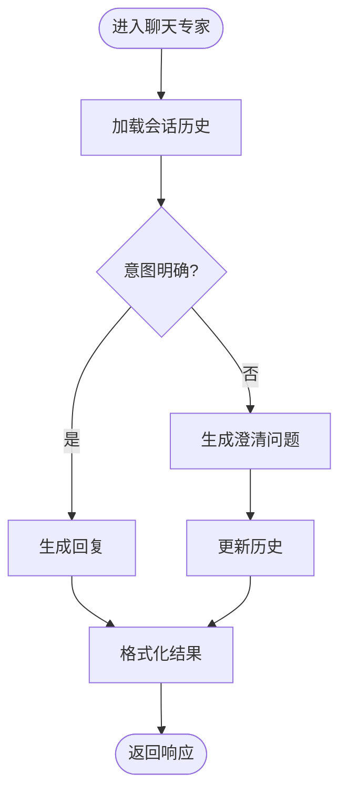
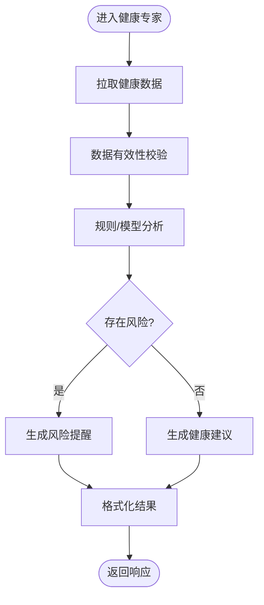
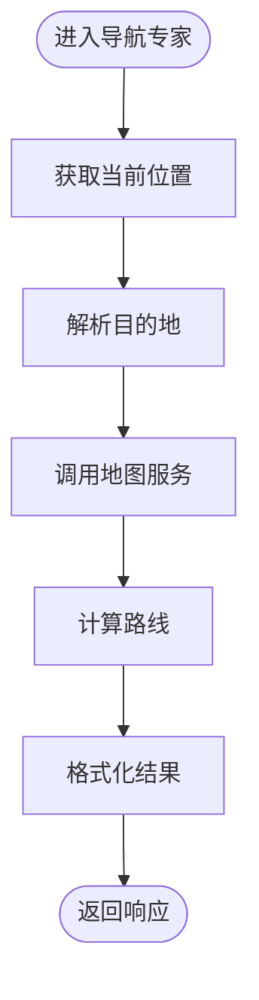
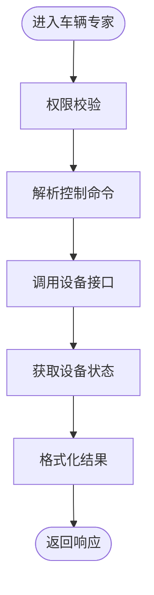
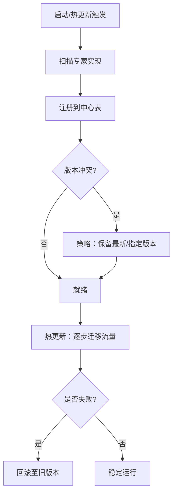
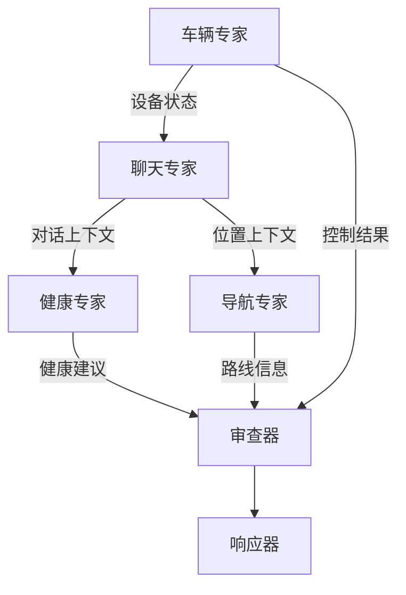
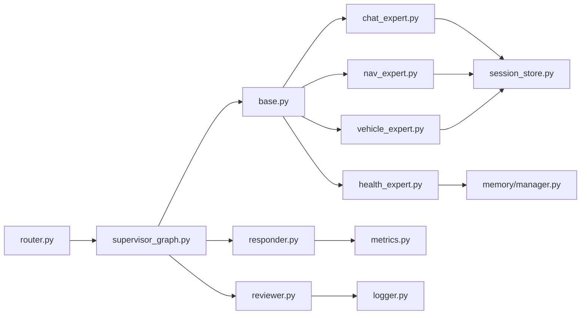

# 专家管理系统

<cite>
**本文引用的文件**   
- [backend_design/nexus/agent/experts/base.py](file://backend_design/nexus/agent/experts/base.py)
- [backend_design/nexus/agent/experts/chat_expert.py](file://backend_design/nexus/agent/experts/chat_expert.py)
- [backend_design/nexus/agent/experts/health_expert.py](file://backend_design/nexus/agent/experts/health_expert.py)
- [backend_design/nexus/agent/experts/nav_expert.py](file://backend_design/nexus/agent/experts/nav_expert.py)
- [backend_design/nexus/agent/experts/vehicle_expert.py](file://backend_design/nexus/agent/experts/vehicle_expert.py)
- [backend_design/nexus/agent/responder.py](file://backend_design/nexus/agent/responder.py)
- [backend_design/nexus/agent/reviewer.py](file://backend_design/nexus/agent/reviewer.py)
- [backend_design/nexus/agent/supervisor_graph.py](file://backend_design/nexus/agent/supervisor_graph.py)
- [backend_design/nexus/intent/router.py](file://backend_design/nexus/intent/router.py)
- [backend_design/nexus/intent/llm_router.py](file://backend_design/nexus/intent/llm_router.py)
- [backend_design/nexus/intent/heuristic.py](file://backend_design/nexus/intent/heuristic.py)
- [backend_design/nexus/api/routes/chat.py](file://backend_design/nexus/api/routes/chat.py)
- [backend_design/nexus/api/routes/cockpit.py](file://backend_design/nexus/api/routes/cockpit.py)
- [backend_design/nexus/core/exceptions.py](file://backend_design/nexus/core/exceptions.py)
- [backend_design/nexus/core/logger.py](file://backend_design/nexus/core/logger.py)
- [backend_design/nexus/models/state.py](file://backend_design/nexus/models/state.py)
- [backend_design/nexus/middleware/session_store.py](file://backend_design/nexus/middleware/session_store.py)
- [backend_design/nexus/memory/manager.py](file://backend_design/nexus/memory/manager.py)
- [backend_design/nexus/observability/metrics.py](file://backend_design/nexus/observability/metrics.py)
</cite>

## 目录
1. [简介](#简介)
2. [项目结构](#项目结构)
3. [核心组件](#核心组件)
4. [架构总览](#架构总览)
5. [详细组件分析](#详细组件分析)
6. [依赖关系分析](#依赖关系分析)
7. [性能考量](#性能考量)
8. [故障排查指南](#故障排查指南)
9. [结论](#结论)
10. [附录](#附录)

## 简介
本技术文档聚焦于NexusCockpit AI Agent系统中的“专家管理系统”。系统采用“专家”作为可插拔的能力单元，通过统一的基类与注册机制实现动态加载、热更新与协作编排。文档将深入解析专家基类的设计模式与接口规范（生命周期管理、上下文传递、结果格式化），并逐一说明聊天专家、健康专家、导航专家、车辆专家的实现要点。同时提供专家注册机制、动态加载与热更新的总体方案，给出新专家的开发指南（实现步骤、测试方法、部署流程），以及专家协作图与通信协议说明。

## 项目结构
专家管理系统位于后端Agent层，围绕“意图路由—专家执行—审查与响应”的流水线组织：
- 专家定义与实现：在 agent/experts 下，包含基类与各专业专家
- 编排与调度：supervisor_graph 负责多专家协作与流程控制
- 意图识别：intent 模块负责将用户输入路由到合适的专家或工作流
- API接入：api/routes 暴露HTTP/WebSocket接口，驱动Agent执行
- 支撑能力：会话存储、记忆、日志、指标等

图表来源
- [backend_design/nexus/api/routes/chat.py](file://backend_design/nexus/api/routes/chat.py)
- [backend_design/nexus/api/routes/cockpit.py](file://backend_design/nexus/api/routes/cockpit.py)
- [backend_design/nexus/intent/router.py](file://backend_design/nexus/intent/router.py)
- [backend_design/nexus/intent/llm_router.py](file://backend_design/nexus/intent/llm_router.py)
- [backend_design/nexus/intent/heuristic.py](file://backend_design/nexus/intent/heuristic.py)
- [backend_design/nexus/agent/supervisor_graph.py](file://backend_design/nexus/agent/supervisor_graph.py)
- [backend_design/nexus/agent/responder.py](file://backend_design/nexus/agent/responder.py)
- [backend_design/nexus/agent/reviewer.py](file://backend_design/nexus/agent/reviewer.py)
- [backend_design/nexus/agent/experts/base.py](file://backend_design/nexus/agent/experts/base.py)
- [backend_design/nexus/agent/experts/chat_expert.py](file://backend_design/nexus/agent/experts/chat_expert.py)
- [backend_design/nexus/agent/experts/health_expert.py](file://backend_design/nexus/agent/experts/health_expert.py)
- [backend_design/nexus/agent/experts/nav_expert.py](file://backend_design/nexus/agent/experts/nav_expert.py)
- [backend_design/nexus/agent/experts/vehicle_expert.py](file://backend_design/nexus/agent/experts/vehicle_expert.py)
- [backend_design/nexus/middleware/session_store.py](file://backend_design/nexus/middleware/session_store.py)
- [backend_design/nexus/memory/manager.py](file://backend_design/nexus/memory/manager.py)
- [backend_design/nexus/observability/metrics.py](file://backend_design/nexus/observability/metrics.py)
- [backend_design/nexus/core/logger.py](file://backend_design/nexus/core/logger.py)
- [backend_design/nexus/core/exceptions.py](file://backend_design/nexus/core/exceptions.py)
- [backend_design/nexus/models/state.py](file://backend_design/nexus/models/state.py)

章节来源
- [backend_design/nexus/agent/experts/base.py](file://backend_design/nexus/agent/experts/base.py)
- [backend_design/nexus/agent/experts/chat_expert.py](file://backend_design/nexus/agent/experts/chat_expert.py)
- [backend_design/nexus/agent/experts/health_expert.py](file://backend_design/nexus/agent/experts/health_expert.py)
- [backend_design/nexus/agent/experts/nav_expert.py](file://backend_design/nexus/agent/experts/nav_expert.py)
- [backend_design/nexus/agent/experts/vehicle_expert.py](file://backend_design/nexus/agent/experts/vehicle_expert.py)
- [backend_design/nexus/agent/supervisor_graph.py](file://backend_design/nexus/agent/supervisor_graph.py)
- [backend_design/nexus/intent/router.py](file://backend_design/nexus/intent/router.py)
- [backend_design/nexus/intent/llm_router.py](file://backend_design/nexus/intent/llm_router.py)
- [backend_design/nexus/intent/heuristic.py](file://backend_design/nexus/intent/heuristic.py)
- [backend_design/nexus/api/routes/chat.py](file://backend_design/nexus/api/routes/chat.py)
- [backend_design/nexus/api/routes/cockpit.py](file://backend_design/nexus/api/routes/cockpit.py)
- [backend_design/nexus/middleware/session_store.py](file://backend_design/nexus/middleware/session_store.py)
- [backend_design/nexus/memory/manager.py](file://backend_design/nexus/memory/manager.py)
- [backend_design/nexus/observability/metrics.py](file://backend_design/nexus/observability/metrics.py)
- [backend_design/nexus/core/logger.py](file://backend_design/nexus/core/logger.py)
- [backend_design/nexus/core/exceptions.py](file://backend_design/nexus/core/exceptions.py)
- [backend_design/nexus/models/state.py](file://backend_design/nexus/models/state.py)

## 核心组件
- 专家基类（Base Expert）
  - 职责：定义专家的统一接口、生命周期钩子、上下文注入与结果格式化契约
  - 关键能力：初始化/销毁、上下文获取与合并、参数校验、执行入口、错误处理、指标上报
- 专家实现
  - 聊天专家：自然语言对话、澄清与追问、多轮上下文维护
  - 健康专家：健康数据推理、建议生成、风险提醒
  - 导航专家：地理位置服务集成、路径规划、POI检索
  - 车辆专家：车载设备控制、状态查询、权限与安全校验
- 编排与路由
  - 意图路由器：基于启发式与LLM的路由策略
  - 监督图（Supervisor Graph）：多专家协作、并行/串行编排、失败回退
  - 审查与响应：结果审查、格式统一、指标与日志记录

章节来源
- [backend_design/nexus/agent/experts/base.py](file://backend_design/nexus/agent/experts/base.py)
- [backend_design/nexus/agent/experts/chat_expert.py](file://backend_design/nexus/agent/experts/chat_expert.py)
- [backend_design/nexus/agent/experts/health_expert.py](file://backend_design/nexus/agent/experts/health_expert.py)
- [backend_design/nexus/agent/experts/nav_expert.py](file://backend_design/nexus/agent/experts/nav_expert.py)
- [backend_design/nexus/agent/experts/vehicle_expert.py](file://backend_design/nexus/agent/experts/vehicle_expert.py)
- [backend_design/nexus/intent/router.py](file://backend_design/nexus/intent/router.py)
- [backend_design/nexus/intent/llm_router.py](file://backend_design/nexus/intent/llm_router.py)
- [backend_design/nexus/intent/heuristic.py](file://backend_design/nexus/intent/heuristic.py)
- [backend_design/nexus/agent/supervisor_graph.py](file://backend_design/nexus/agent/supervisor_graph.py)
- [backend_design/nexus/agent/responder.py](file://backend_design/nexus/agent/responder.py)
- [backend_design/nexus/agent/reviewer.py](file://backend_design/nexus/agent/reviewer.py)

## 架构总览
下图展示了从API到专家执行的端到端流程，包括意图识别、专家选择、执行与审查、结果返回。

图表来源
- [backend_design/nexus/api/routes/chat.py](file://backend_design/nexus/api/routes/chat.py)
- [backend_design/nexus/api/routes/cockpit.py](file://backend_design/nexus/api/routes/cockpit.py)
- [backend_design/nexus/intent/router.py](file://backend_design/nexus/intent/router.py)
- [backend_design/nexus/intent/llm_router.py](file://backend_design/nexus/intent/llm_router.py)
- [backend_design/nexus/intent/heuristic.py](file://backend_design/nexus/intent/heuristic.py)
- [backend_design/nexus/agent/supervisor_graph.py](file://backend_design/nexus/agent/supervisor_graph.py)
- [backend_design/nexus/agent/experts/base.py](file://backend_design/nexus/agent/experts/base.py)
- [backend_design/nexus/agent/experts/chat_expert.py](file://backend_design/nexus/agent/experts/chat_expert.py)
- [backend_design/nexus/agent/experts/health_expert.py](file://backend_design/nexus/agent/experts/health_expert.py)
- [backend_design/nexus/agent/experts/nav_expert.py](file://backend_design/nexus/agent/experts/nav_expert.py)
- [backend_design/nexus/agent/experts/vehicle_expert.py](file://backend_design/nexus/agent/experts/vehicle_expert.py)
- [backend_design/nexus/agent/reviewer.py](file://backend_design/nexus/agent/reviewer.py)
- [backend_design/nexus/agent/responder.py](file://backend_design/nexus/agent/responder.py)

## 详细组件分析

### 专家基类（Base Expert）设计模式与接口规范
- 设计模式
  - 模板方法：定义执行骨架（预处理→执行→后处理→格式化），子类仅实现核心逻辑
  - 策略模式：不同专家作为可替换的策略，由监督图根据上下文选择
  - 观察者/回调：生命周期钩子在关键阶段触发（如初始化、清理、错误）
- 接口规范
  - 生命周期
    - 初始化：加载配置、建立连接、预热资源
    - 运行期：接收上下文与参数，执行领域逻辑
    - 清理：释放资源、关闭连接、缓存刷新
  - 上下文传递
    - 会话上下文：用户ID、会话ID、历史消息、偏好设置
    - 环境上下文：设备信息、位置、时间、权限
    - 任务上下文：当前意图、参数、中间结果
  - 结果格式化
    - 统一输出结构：状态码、消息体、元数据、追踪ID
    - 类型安全：字段校验、默认值、缺失处理
- 错误处理与可观测性
  - 异常分类：参数错误、外部依赖错误、业务错误
  - 指标上报：耗时、成功率、错误率
  - 日志记录：结构化日志、敏感信息脱敏

图表来源
- [backend_design/nexus/agent/experts/base.py](file://backend_design/nexus/agent/experts/base.py)
- [backend_design/nexus/agent/experts/chat_expert.py](file://backend_design/nexus/agent/experts/chat_expert.py)
- [backend_design/nexus/agent/experts/health_expert.py](file://backend_design/nexus/agent/experts/health_expert.py)
- [backend_design/nexus/agent/experts/nav_expert.py](file://backend_design/nexus/agent/experts/nav_expert.py)
- [backend_design/nexus/agent/experts/vehicle_expert.py](file://backend_design/nexus/agent/experts/vehicle_expert.py)

章节来源
- [backend_design/nexus/agent/experts/base.py](file://backend_design/nexus/agent/experts/base.py)

### 聊天专家（Chat Expert）
- 自然语言处理能力
  - 多轮对话：维护会话历史、上下文摘要、澄清问题
  - 意图细化：对用户模糊意图进行追问与确认
  - 结果结构化：将对话内容转换为标准消息对象
- 上下文与记忆
  - 会话存储：持久化历史、快速检索最近N条
  - 个性化：结合用户偏好调整语气与风格
- 典型流程
  - 接收消息→检索历史→意图理解→生成回复→格式化输出

图表来源
- [backend_design/nexus/agent/experts/chat_expert.py](file://backend_design/nexus/agent/experts/chat_expert.py)
- [backend_design/nexus/middleware/session_store.py](file://backend_design/nexus/middleware/session_store.py)

章节来源
- [backend_design/nexus/agent/experts/chat_expert.py](file://backend_design/nexus/agent/experts/chat_expert.py)
- [backend_design/nexus/middleware/session_store.py](file://backend_design/nexus/middleware/session_store.py)

### 健康专家（Health Expert）
- 专业知识推理
  - 健康数据整合：体征指标、历史记录、体检报告
  - 规则与模型：阈值判断、趋势分析、风险提示
  - 建议生成：饮食、运动、就医建议
- 上下文与隐私
  - 敏感数据保护：最小化采集、脱敏传输
  - 权限控制：按用户授权范围访问健康数据
- 典型流程
  - 拉取健康数据→应用规则/模型→生成建议→格式化输出

图表来源
- [backend_design/nexus/agent/experts/health_expert.py](file://backend_design/nexus/agent/experts/health_expert.py)
- [backend_design/nexus/memory/manager.py](file://backend_design/nexus/memory/manager.py)

章节来源
- [backend_design/nexus/agent/experts/health_expert.py](file://backend_design/nexus/agent/experts/health_expert.py)
- [backend_design/nexus/memory/manager.py](file://backend_design/nexus/memory/manager.py)

### 导航专家（Nav Expert）
- 地理位置服务集成
  - 定位与地图：获取当前位置、目的地、路线规划
  - POI检索：兴趣点搜索、周边推荐
  - 实时路况：拥堵、事故、施工信息
- 上下文与环境
  - 设备位置：GPS精度、更新时间
  - 用户偏好：避开高速、最短时间等
- 典型流程
  - 解析位置→调用地图服务→计算路线→格式化输出

图表来源
- [backend_design/nexus/agent/experts/nav_expert.py](file://backend_design/nexus/agent/experts/nav_expert.py)
- [backend_design/nexus/middleware/session_store.py](file://backend_design/nexus/middleware/session_store.py)

章节来源
- [backend_design/nexus/agent/experts/nav_expert.py](file://backend_design/nexus/agent/experts/nav_expert.py)
- [backend_design/nexus/middleware/session_store.py](file://backend_design/nexus/middleware/session_store.py)

### 车辆专家（Vehicle Expert）
- 车载设备控制
  - 设备管理：空调、座椅、车窗、媒体等
  - 状态查询：电量、胎压、里程、故障码
  - 安全校验：权限验证、操作白名单、防抖与限流
- 上下文与权限
  - 车辆绑定：VIN、车型、固件版本
  - 用户角色：驾驶员/乘客/管理员
- 典型流程
  - 权限校验→命令解析→设备控制→状态反馈→格式化输出

图表来源
- [backend_design/nexus/agent/experts/vehicle_expert.py](file://backend_design/nexus/agent/experts/vehicle_expert.py)
- [backend_design/nexus/middleware/session_store.py](file://backend_design/nexus/middleware/session_store.py)

章节来源
- [backend_design/nexus/agent/experts/vehicle_expert.py](file://backend_design/nexus/agent/experts/vehicle_expert.py)
- [backend_design/nexus/middleware/session_store.py](file://backend_design/nexus/middleware/session_store.py)

### 专家注册机制、动态加载与热更新
- 注册机制
  - 集中注册表：维护专家名称到实现的映射
  - 自动发现：扫描包内实现并注册
  - 版本管理：支持同一专家的多版本并存
- 动态加载
  - 按需加载：首次调用时实例化，减少启动开销
  - 插件化：通过配置文件或远程仓库加载新专家
- 热更新
  - 无感切换：保持会话连续性，逐步迁移流量
  - 灰度发布：按用户/会话比例切流
  - 回滚策略：失败自动回滚至上一稳定版本

[此图为概念性流程图，不直接映射具体源码文件]

### 专家协作与通信协议
- 协作模式
  - 串行编排：前一个专家的输出作为下一个专家的输入
  - 并行编排：多个专家并行执行，聚合结果
  - 条件分支：根据上下文或中间结果选择不同路径
- 通信协议
  - 内部消息：统一的消息结构（类型、载荷、元数据）
  - 事件总线：专家间通过事件解耦通信
  - 超时与重试：可配置的超时、重试与熔断策略

图表来源
- [backend_design/nexus/agent/experts/chat_expert.py](file://backend_design/nexus/agent/experts/chat_expert.py)
- [backend_design/nexus/agent/experts/health_expert.py](file://backend_design/nexus/agent/experts/health_expert.py)
- [backend_design/nexus/agent/experts/nav_expert.py](file://backend_design/nexus/agent/experts/nav_expert.py)
- [backend_design/nexus/agent/experts/vehicle_expert.py](file://backend_design/nexus/agent/experts/vehicle_expert.py)
- [backend_design/nexus/agent/reviewer.py](file://backend_design/nexus/agent/reviewer.py)
- [backend_design/nexus/agent/responder.py](file://backend_design/nexus/agent/responder.py)

## 依赖关系分析
- 组件耦合
  - 专家对基类的强依赖，保证接口一致性
  - 监督图对意图路由的依赖，决定执行路径
  - 专家对外部服务的弱依赖（通过适配器/工厂）
- 外部依赖
  - 会话存储：用于多轮对话与上下文持久化
  - 记忆管理：健康数据的长期记忆与检索
  - 指标与日志：可观测性与排障
- 潜在循环依赖
  - 通过事件总线与消息结构解耦，避免直接相互引用

图表来源
- [backend_design/nexus/agent/experts/base.py](file://backend_design/nexus/agent/experts/base.py)
- [backend_design/nexus/agent/experts/chat_expert.py](file://backend_design/nexus/agent/experts/chat_expert.py)
- [backend_design/nexus/agent/experts/health_expert.py](file://backend_design/nexus/agent/experts/health_expert.py)
- [backend_design/nexus/agent/experts/nav_expert.py](file://backend_design/nexus/agent/experts/nav_expert.py)
- [backend_design/nexus/agent/experts/vehicle_expert.py](file://backend_design/nexus/agent/experts/vehicle_expert.py)
- [backend_design/nexus/intent/router.py](file://backend_design/nexus/intent/router.py)
- [backend_design/nexus/agent/supervisor_graph.py](file://backend_design/nexus/agent/supervisor_graph.py)
- [backend_design/nexus/agent/reviewer.py](file://backend_design/nexus/agent/reviewer.py)
- [backend_design/nexus/agent/responder.py](file://backend_design/nexus/agent/responder.py)
- [backend_design/nexus/middleware/session_store.py](file://backend_design/nexus/middleware/session_store.py)
- [backend_design/nexus/memory/manager.py](file://backend_design/nexus/memory/manager.py)
- [backend_design/nexus/observability/metrics.py](file://backend_design/nexus/observability/metrics.py)
- [backend_design/nexus/core/logger.py](file://backend_design/nexus/core/logger.py)

章节来源
- [backend_design/nexus/agent/experts/base.py](file://backend_design/nexus/agent/experts/base.py)
- [backend_design/nexus/agent/experts/chat_expert.py](file://backend_design/nexus/agent/experts/chat_expert.py)
- [backend_design/nexus/agent/experts/health_expert.py](file://backend_design/nexus/agent/experts/health_expert.py)
- [backend_design/nexus/agent/experts/nav_expert.py](file://backend_design/nexus/agent/experts/nav_expert.py)
- [backend_design/nexus/agent/experts/vehicle_expert.py](file://backend_design/nexus/agent/experts/vehicle_expert.py)
- [backend_design/nexus/intent/router.py](file://backend_design/nexus/intent/router.py)
- [backend_design/nexus/agent/supervisor_graph.py](file://backend_design/nexus/agent/supervisor_graph.py)
- [backend_design/nexus/agent/reviewer.py](file://backend_design/nexus/agent/reviewer.py)
- [backend_design/nexus/agent/responder.py](file://backend_design/nexus/agent/responder.py)
- [backend_design/nexus/middleware/session_store.py](file://backend_design/nexus/middleware/session_store.py)
- [backend_design/nexus/memory/manager.py](file://backend_design/nexus/memory/manager.py)
- [backend_design/nexus/observability/metrics.py](file://backend_design/nexus/observability/metrics.py)
- [backend_design/nexus/core/logger.py](file://backend_design/nexus/core/logger.py)

## 性能考量
- 专家执行优化
  - 懒加载与连接池：减少冷启动与重复创建开销
  - 批量处理：合并多次小请求为批处理
  - 缓存策略：热点数据本地缓存+失效策略
- 并发与限流
  - 异步执行：非阻塞IO提升吞吐
  - 令牌桶/漏桶：防止雪崩
- 可观测性
  - 指标：QPS、延迟分位、错误率
  - 链路追踪：跨专家调用链可视化
  - 告警：阈值异常自动通知

[本节为通用指导，不直接分析具体文件]

## 故障排查指南
- 常见问题
  - 意图路由失败：检查启发式规则与LLM路由配置
  - 专家执行超时：查看外部服务健康与重试策略
  - 结果格式不一致：核对格式化契约与字段校验
- 诊断工具
  - 结构化日志：定位调用栈与上下文快照
  - 指标面板：观察延迟与错误分布
  - 异常分类：区分参数错误、依赖错误、业务错误
- 恢复策略
  - 降级：切换到备用专家或简化流程
  - 熔断：临时屏蔽不稳定依赖
  - 回滚：热更新失败自动回滚

章节来源
- [backend_design/nexus/core/exceptions.py](file://backend_design/nexus/core/exceptions.py)
- [backend_design/nexus/core/logger.py](file://backend_design/nexus/core/logger.py)
- [backend_design/nexus/observability/metrics.py](file://backend_design/nexus/observability/metrics.py)

## 结论
专家管理系统通过统一的基类与注册机制实现了高内聚、低耦合的可插拔架构。聊天、健康、导航、车辆四大专家覆盖核心场景，配合意图路由与监督图完成复杂协作。动态加载与热更新保障系统演进与稳定性。建议在后续迭代中完善指标体系、增强容错与可观测性，并持续扩展更多领域专家。

[本节为总结性内容，不直接分析具体文件]

## 附录

### 新专家开发指南
- 实现步骤
  - 继承专家基类，实现核心执行逻辑
  - 定义上下文与参数结构，确保类型安全
  - 实现结果格式化，遵循统一契约
  - 注册到专家表，支持动态加载
- 测试方法
  - 单元测试：覆盖边界条件与异常路径
  - 集成测试：模拟外部依赖与端到端流程
  - 回归测试：确保与其他专家协作正常
- 部署流程
  - 灰度发布：小流量验证
  - 监控与告警：上线后持续观察
  - 回滚预案：失败快速回滚

[本节为通用指导，不直接分析具体文件]