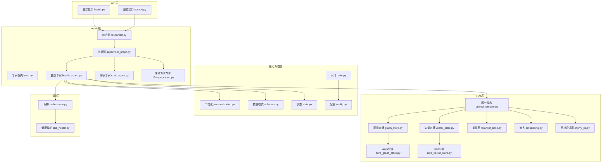
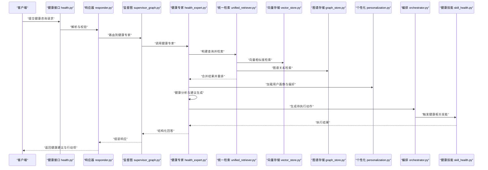
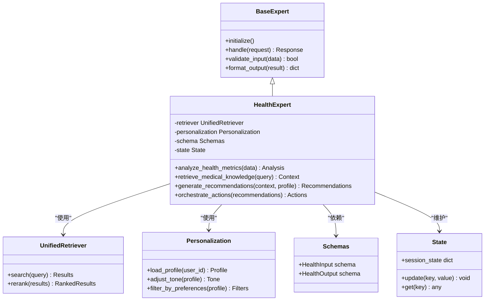
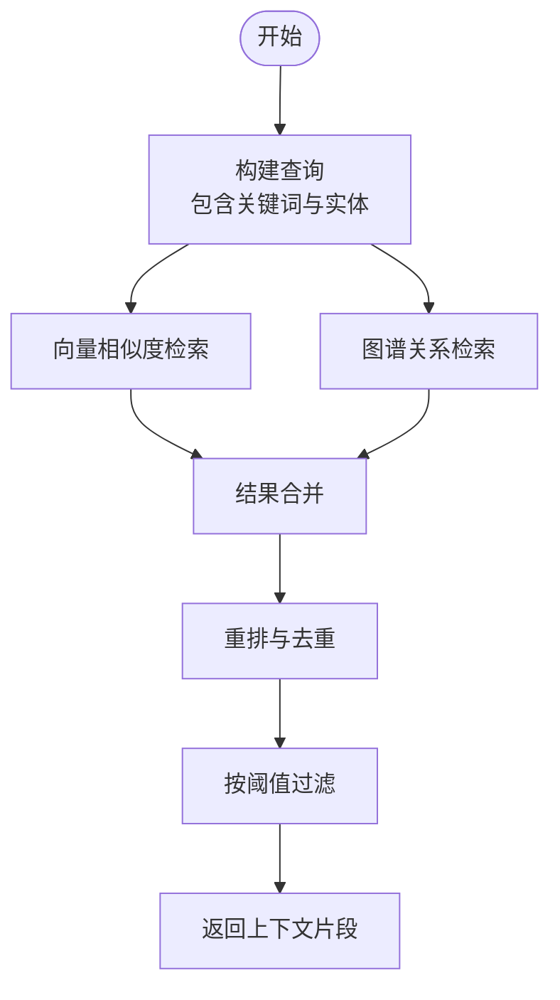
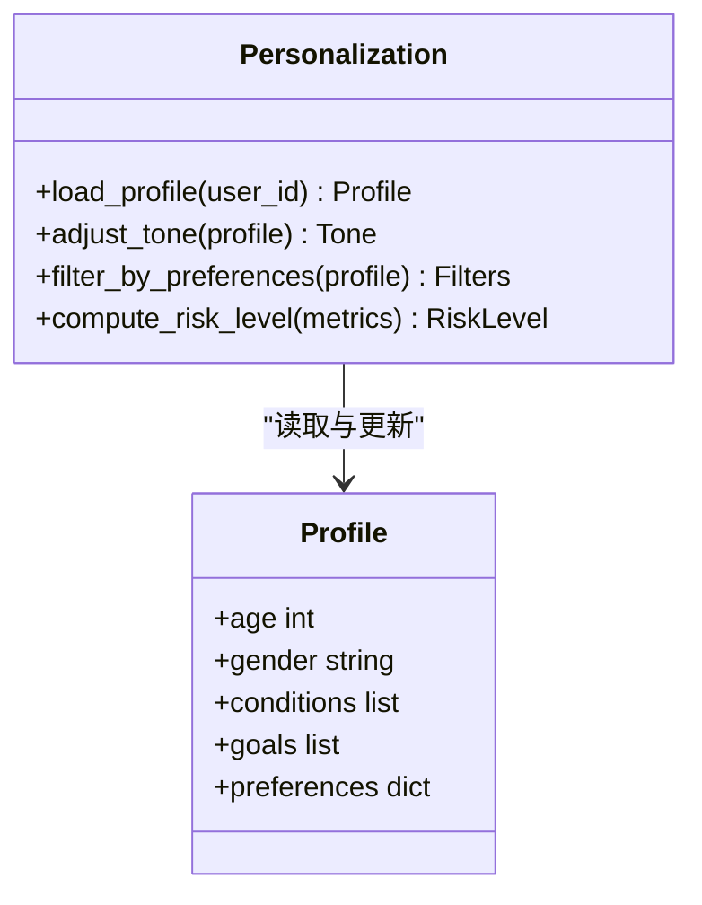
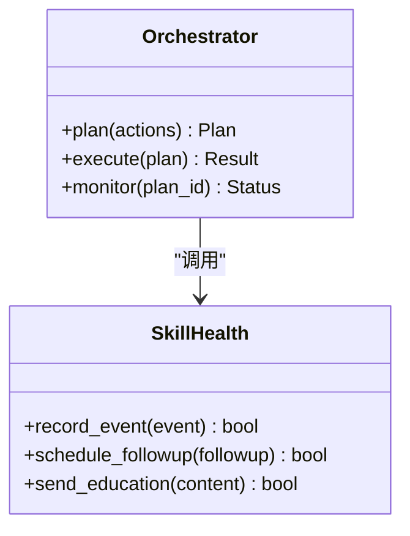
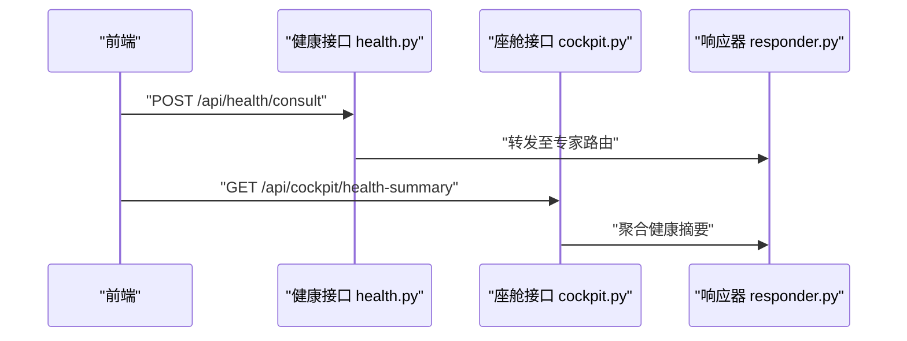
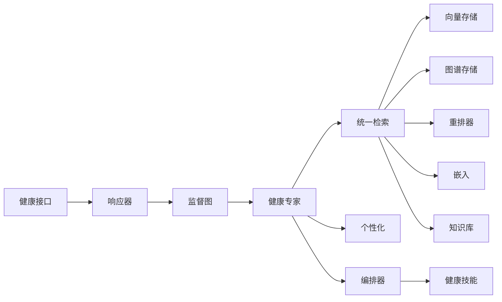

# 健康专家

<cite>
**本文引用的文件**   
- [health_expert.py](file://backend_design/nexus/agent/experts/health_expert.py)
- [base.py](file://backend_design/nexus/agent/experts/base.py)
- [chat_expert.py](file://backend_design/nexus/agent/experts/chat_expert.py)
- [lifestyle_expert.py](file://backend_design/nexus/agent/experts/lifestyle_expert.py)
- [responder.py](file://backend_design/nexus/agent/responder.py)
- [supervisor_graph.py](file://backend_design/nexus/agent/supervisor_graph.py)
- [health.py](file://backend_design/nexus/api/routes/health.py)
- [cockpit.py](file://backend_design/nexus/api/routes/cockpit.py)
- [unified_retriever.py](file://backend_design/nexus/rag/unified_retriever.py)
- [graph_store.py](file://backend_design/nexus/rag/graph_store.py)
- [vector_store.py](file://backend_design/nexus/rag/vector_store.py)
- [reranker_base.py](file://backend_design/nexus/rag/reranker_base.py)
- [embedding.py](file://backend_design/nexus/rag/embedding.py)
- [cherry_kb.py](file://backend_design/nexus/rag/cherry_kb.py)
- [aura_graph_store.py](file://backend_design/nexus/rag/aura_graph_store.py)
- [zilliz_vector_store.py](file://backend_design/nexus/rag/zilliz_vector_store.py)
- [personalization.py](file://backend_design/nexus/core/personalization.py)
- [schemas.py](file://backend_design/nexus/models/schemas.py)
- [state.py](file://backend_design/nexus/models/state.py)
- [orchestrator.py](file://backend_design/nexus/skills/orchestrator.py)
- [skill_health.py](file://backend_design/nexus/skills/health.py)
- [config.py](file://backend_design/nexus/config.py)
- [main.py](file://backend_design/nexus/main.py)
</cite>

## 目录
1. [简介](#简介)
2. [项目结构](#项目结构)
3. [核心组件](#核心组件)
4. [架构总览](#架构总览)
5. [详细组件分析](#详细组件分析)
6. [依赖关系分析](#依赖关系分析)
7. [性能考虑](#性能考虑)
8. [故障排查指南](#故障排查指南)
9. [结论](#结论)
10. [附录](#附录)

## 简介
本技术文档面向NexusCockpit的“健康专家”模块，系统性阐述其专业知识推理能力：健康数据分析、医学知识检索与个性化健康建议生成。文档覆盖健康数据模型、分析算法与建议生成逻辑，说明与健康管理系统的集成方式、数据同步机制与隐私保护措施，并提供配置选项、知识库更新方法与准确性验证流程，以及典型健康咨询场景的实现示例与最佳实践。

## 项目结构
健康专家位于Agent层，作为可插拔的专家之一，通过统一编排器与路由进行调度；其知识检索基于RAG（向量+图谱）体系，结合个人偏好与记忆系统实现个性化输出。

图表来源
- [health.py](file://backend_design/nexus/api/routes/health.py)
- [cockpit.py](file://backend_design/nexus/api/routes/cockpit.py)
- [responder.py](file://backend_design/nexus/agent/responder.py)
- [supervisor_graph.py](file://backend_design/nexus/agent/supervisor_graph.py)
- [health_expert.py](file://backend_design/nexus/agent/experts/health_expert.py)
- [chat_expert.py](file://backend_design/nexus/agent/experts/chat_expert.py)
- [lifestyle_expert.py](file://backend_design/nexus/agent/experts/lifestyle_expert.py)
- [unified_retriever.py](file://backend_design/nexus/rag/unified_retriever.py)
- [vector_store.py](file://backend_design/nexus/rag/vector_store.py)
- [graph_store.py](file://backend_design/nexus/rag/graph_store.py)
- [reranker_base.py](file://backend_design/nexus/rag/reranker_base.py)
- [embedding.py](file://backend_design/nexus/rag/embedding.py)
- [cherry_kb.py](file://backend_design/nexus/rag/cherry_kb.py)
- [aura_graph_store.py](file://backend_design/nexus/rag/aura_graph_store.py)
- [zilliz_vector_store.py](file://backend_design/nexus/rag/zilliz_vector_store.py)
- [personalization.py](file://backend_design/nexus/core/personalization.py)
- [schemas.py](file://backend_design/nexus/models/schemas.py)
- [state.py](file://backend_design/nexus/models/state.py)
- [orchestrator.py](file://backend_design/nexus/skills/orchestrator.py)
- [skill_health.py](file://backend_design/nexus/skills/health.py)
- [config.py](file://backend_design/nexus/config.py)
- [main.py](file://backend_design/nexus/main.py)

章节来源
- [health.py](file://backend_design/nexus/api/routes/health.py)
- [cockpit.py](file://backend_design/nexus/api/routes/cockpit.py)
- [responder.py](file://backend_design/nexus/agent/responder.py)
- [supervisor_graph.py](file://backend_design/nexus/agent/supervisor_graph.py)
- [health_expert.py](file://backend_design/nexus/agent/experts/health_expert.py)
- [unified_retriever.py](file://backend_design/nexus/rag/unified_retriever.py)
- [vector_store.py](file://backend_design/nexus/rag/vector_store.py)
- [graph_store.py](file://backend_design/nexus/rag/graph_store.py)
- [reranker_base.py](file://backend_design/nexus/rag/reranker_base.py)
- [embedding.py](file://backend_design/nexus/rag/embedding.py)
- [cherry_kb.py](file://backend_design/nexus/rag/cherry_kb.py)
- [aura_graph_store.py](file://backend_design/nexus/rag/aura_graph_store.py)
- [zilliz_vector_store.py](file://backend_design/nexus/rag/zilliz_vector_store.py)
- [personalization.py](file://backend_design/nexus/core/personalization.py)
- [schemas.py](file://backend_design/nexus/models/schemas.py)
- [state.py](file://backend_design/nexus/models/state.py)
- [orchestrator.py](file://backend_design/nexus/skills/orchestrator.py)
- [skill_health.py](file://backend_design/nexus/skills/health.py)
- [config.py](file://backend_design/nexus/config.py)
- [main.py](file://backend_design/nexus/main.py)

## 核心组件
- 健康专家（Health Expert）：负责健康领域意图识别后的专业推理，包括健康指标解读、风险预警、干预建议与随访计划等。
- 统一检索（Unified Retriever）：对向量库与知识图谱进行联合检索，并执行重排与融合，返回高质量上下文。
- 个性化（Personalization）：基于用户画像、偏好与健康目标，调整建议的强度、语气与侧重点。
- 编排器（Orchestrator）与技能（Skills）：将健康专家的输出转化为具体动作或提醒，如记录健康事件、触发复诊提醒等。
- 数据模式（Schemas）与状态（State）：定义健康数据输入输出结构与对话状态流转。

章节来源
- [health_expert.py](file://backend_design/nexus/agent/experts/health_expert.py)
- [unified_retriever.py](file://backend_design/nexus/rag/unified_retriever.py)
- [personalization.py](file://backend_design/nexus/core/personalization.py)
- [orchestrator.py](file://backend_design/nexus/skills/orchestrator.py)
- [skill_health.py](file://backend_design/nexus/skills/health.py)
- [schemas.py](file://backend_design/nexus/models/schemas.py)
- [state.py](file://backend_design/nexus/models/state.py)

## 架构总览
健康专家在请求进入后，经由API层路由到响应器，再由监督图选择健康专家进行处理。健康专家调用统一检索获取医学知识与患者上下文，结合个性化策略生成建议，并通过编排器落地为可执行技能。

图表来源
- [health.py](file://backend_design/nexus/api/routes/health.py)
- [responder.py](file://backend_design/nexus/agent/responder.py)
- [supervisor_graph.py](file://backend_design/nexus/agent/supervisor_graph.py)
- [health_expert.py](file://backend_design/nexus/agent/experts/health_expert.py)
- [unified_retriever.py](file://backend_design/nexus/rag/unified_retriever.py)
- [vector_store.py](file://backend_design/nexus/rag/vector_store.py)
- [graph_store.py](file://backend_design/nexus/rag/graph_store.py)
- [personalization.py](file://backend_design/nexus/core/personalization.py)
- [orchestrator.py](file://backend_design/nexus/skills/orchestrator.py)
- [skill_health.py](file://backend_design/nexus/skills/health.py)

## 详细组件分析

### 健康专家（Health Expert）
健康专家继承自专家基类，提供健康领域的推理方法：健康指标解读、风险评估、建议生成与行动项编排。其关键职责包括：
- 输入规范化：将用户自然语言与健康数据转换为内部结构。
- 知识检索：通过统一检索获取权威医学知识与个体化上下文。
- 个性化适配：依据用户画像调整建议强度与表达方式。
- 行动编排：将建议转化为可执行的提醒、记录或随访任务。

图表来源
- [base.py](file://backend_design/nexus/agent/experts/base.py)
- [health_expert.py](file://backend_design/nexus/agent/experts/health_expert.py)
- [unified_retriever.py](file://backend_design/nexus/rag/unified_retriever.py)
- [personalization.py](file://backend_design/nexus/core/personalization.py)
- [schemas.py](file://backend_design/nexus/models/schemas.py)
- [state.py](file://backend_design/nexus/models/state.py)

章节来源
- [base.py](file://backend_design/nexus/agent/experts/base.py)
- [health_expert.py](file://backend_design/nexus/agent/experts/health_expert.py)
- [unified_retriever.py](file://backend_design/nexus/rag/unified_retriever.py)
- [personalization.py](file://backend_design/nexus/core/personalization.py)
- [schemas.py](file://backend_design/nexus/models/schemas.py)
- [state.py](file://backend_design/nexus/models/state.py)

### 统一检索（Unified Retriever）
统一检索整合向量检索与图谱检索，并进行重排与融合，确保返回的上下文既具相关性又具备结构性。

图表来源
- [unified_retriever.py](file://backend_design/nexus/rag/unified_retriever.py)
- [vector_store.py](file://backend_design/nexus/rag/vector_store.py)
- [graph_store.py](file://backend_design/nexus/rag/graph_store.py)
- [reranker_base.py](file://backend_design/nexus/rag/reranker_base.py)
- [embedding.py](file://backend_design/nexus/rag/embedding.py)
- [cherry_kb.py](file://backend_design/nexus/rag/cherry_kb.py)
- [aura_graph_store.py](file://backend_design/nexus/rag/aura_graph_store.py)
- [zilliz_vector_store.py](file://backend_design/nexus/rag/zilliz_vector_store.py)

章节来源
- [unified_retriever.py](file://backend_design/nexus/rag/unified_retriever.py)
- [vector_store.py](file://backend_design/nexus/rag/vector_store.py)
- [graph_store.py](file://backend_design/nexus/rag/graph_store.py)
- [reranker_base.py](file://backend_design/nexus/rag/reranker_base.py)
- [embedding.py](file://backend_design/nexus/rag/embedding.py)
- [cherry_kb.py](file://backend_design/nexus/rag/cherry_kb.py)
- [aura_graph_store.py](file://backend_design/nexus/rag/aura_graph_store.py)
- [zilliz_vector_store.py](file://backend_design/nexus/rag/zilliz_vector_store.py)

### 个性化（Personalization）
个性化模块根据用户画像、偏好与健康目标，动态调整建议的语气、强度与关注点，确保输出贴合用户实际状况。

图表来源
- [personalization.py](file://backend_design/nexus/core/personalization.py)

章节来源
- [personalization.py](file://backend_design/nexus/core/personalization.py)

### 编排器与健康技能（Orchestrator & Skill Health）
编排器将健康建议转化为具体动作，例如记录健康事件、设置复诊提醒、推送健康教育内容等。健康技能封装了与健康管理系统对接的具体操作。

图表来源
- [orchestrator.py](file://backend_design/nexus/skills/orchestrator.py)
- [skill_health.py](file://backend_design/nexus/skills/health.py)

章节来源
- [orchestrator.py](file://backend_design/nexus/skills/orchestrator.py)
- [skill_health.py](file://backend_design/nexus/skills/health.py)

### API与路由（Health & Cockpit）
健康接口暴露健康咨询与数据同步能力；座舱接口可能承载健康数据的展示与交互入口。

图表来源
- [health.py](file://backend_design/nexus/api/routes/health.py)
- [cockpit.py](file://backend_design/nexus/api/routes/cockpit.py)
- [responder.py](file://backend_design/nexus/agent/responder.py)

章节来源
- [health.py](file://backend_design/nexus/api/routes/health.py)
- [cockpit.py](file://backend_design/nexus/api/routes/cockpit.py)
- [responder.py](file://backend_design/nexus/agent/responder.py)

## 依赖关系分析
健康专家与其上下游组件的耦合关系如下：
- 上游：API层（健康接口、座舱接口）、响应器、监督图。
- 下游：统一检索（向量存储、图谱存储、重排器、嵌入）、个性化、编排器与健康技能。
- 外部依赖：向量数据库（如Zilliz）、图谱数据库（如Aura/Neo4j）、知识库（Cherry KB）。

图表来源
- [health.py](file://backend_design/nexus/api/routes/health.py)
- [responder.py](file://backend_design/nexus/agent/responder.py)
- [supervisor_graph.py](file://backend_design/nexus/agent/supervisor_graph.py)
- [health_expert.py](file://backend_design/nexus/agent/experts/health_expert.py)
- [unified_retriever.py](file://backend_design/nexus/rag/unified_retriever.py)
- [vector_store.py](file://backend_design/nexus/rag/vector_store.py)
- [graph_store.py](file://backend_design/nexus/rag/graph_store.py)
- [reranker_base.py](file://backend_design/nexus/rag/reranker_base.py)
- [embedding.py](file://backend_design/nexus/rag/embedding.py)
- [cherry_kb.py](file://backend_design/nexus/rag/cherry_kb.py)
- [orchestrator.py](file://backend_design/nexus/skills/orchestrator.py)
- [skill_health.py](file://backend_design/nexus/skills/health.py)

章节来源
- [health.py](file://backend_design/nexus/api/routes/health.py)
- [responder.py](file://backend_design/nexus/agent/responder.py)
- [supervisor_graph.py](file://backend_design/nexus/agent/supervisor_graph.py)
- [health_expert.py](file://backend_design/nexus/agent/experts/health_expert.py)
- [unified_retriever.py](file://backend_design/nexus/rag/unified_retriever.py)
- [vector_store.py](file://backend_design/nexus/rag/vector_store.py)
- [graph_store.py](file://backend_design/nexus/rag/graph_store.py)
- [reranker_base.py](file://backend_design/nexus/rag/reranker_base.py)
- [embedding.py](file://backend_design/nexus/rag/embedding.py)
- [cherry_kb.py](file://backend_design/nexus/rag/cherry_kb.py)
- [orchestrator.py](file://backend_design/nexus/skills/orchestrator.py)
- [skill_health.py](file://backend_design/nexus/skills/health.py)

## 性能考虑
- 检索优化：采用混合检索（向量+图谱）与重排，减少无关上下文，提升准确率与响应速度。
- 缓存策略：对高频健康问答与通用医学知识进行缓存，降低重复计算开销。
- 异步编排：健康技能的执行（如发送提醒、记录事件）采用异步队列，避免阻塞主流程。
- 资源隔离：不同租户或用户的健康数据检索与个性化计算应做资源隔离，防止热点用户影响整体性能。

[本节为通用性能指导，不直接分析具体文件]

## 故障排查指南
- 检索失败：检查向量与图谱存储的连接与索引状态，确认嵌入模型可用性与阈值配置。
- 个性化异常：核对用户画像完整性与偏好字段，确保加载与过滤逻辑正确。
- 编排错误：查看健康技能执行日志，确认外部系统（如提醒服务、记录服务）可用性。
- 数据不一致：对比健康输入模式与输出模式，确保序列化与反序列化一致。

章节来源
- [unified_retriever.py](file://backend_design/nexus/rag/unified_retriever.py)
- [vector_store.py](file://backend_design/nexus/rag/vector_store.py)
- [graph_store.py](file://backend_design/nexus/rag/graph_store.py)
- [personalization.py](file://backend_design/nexus/core/personalization.py)
- [orchestrator.py](file://backend_design/nexus/skills/orchestrator.py)
- [skill_health.py](file://backend_design/nexus/skills/health.py)
- [schemas.py](file://backend_design/nexus/models/schemas.py)

## 结论
健康专家以统一检索为核心，结合个性化与编排能力，形成从健康数据分析到建议落地的完整闭环。通过合理的配置、知识库更新与准确性验证流程，可在保障隐私与安全的前提下，为用户提供高质量的健康咨询服务。

[本节为总结性内容，不直接分析具体文件]

## 附录

### 配置选项
- 检索参数：相似度阈值、重排权重、最大返回片段数。
- 个性化开关：是否启用偏好过滤、语气调整、风险等级阈值。
- 编排策略：并发度、重试次数、超时时间。
- 存储连接：向量库与图谱库的连接串、认证信息。

章节来源
- [config.py](file://backend_design/nexus/config.py)
- [unified_retriever.py](file://backend_design/nexus/rag/unified_retriever.py)
- [personalization.py](file://backend_design/nexus/core/personalization.py)
- [orchestrator.py](file://backend_design/nexus/skills/orchestrator.py)

### 知识库更新方法
- 增量入库：新增医学条目时，向量化并写入向量库，同时构建图谱节点与关系。
- 版本管理：为知识条目添加版本号与生效时间，支持回滚与灰度发布。
- 质量校验：入库前进行格式校验与去重，入库后进行抽样检索评估。

章节来源
- [cherry_kb.py](file://backend_design/nexus/rag/cherry_kb.py)
- [aura_graph_store.py](file://backend_design/nexus/rag/aura_graph_store.py)
- [zilliz_vector_store.py](file://backend_design/nexus/rag/zilliz_vector_store.py)
- [embedding.py](file://backend_design/nexus/rag/embedding.py)

### 准确性验证流程
- 离线评测：构建健康问答基准集，评估检索命中率、重排质量与建议相关性。
- 在线监控：跟踪健康建议采纳率、用户反馈与不良事件上报率。
- A/B测试：对比不同个性化策略与检索参数的效果差异。

章节来源
- [unified_retriever.py](file://backend_design/nexus/rag/unified_retriever.py)
- [reranker_base.py](file://backend_design/nexus/rag/reranker_base.py)
- [personalization.py](file://backend_design/nexus/core/personalization.py)

### 健康咨询场景示例与最佳实践
- 场景一：血压异常咨询
  - 输入：近期血压读数与症状描述。
  - 处理：统一检索高血压指南与个体风险因素；个性化调整建议强度。
  - 输出：就医建议、生活方式调整与复诊提醒。
- 场景二：运动与饮食建议
  - 输入：用户运动量、体重变化与饮食偏好。
  - 处理：检索营养学与运动科学证据；结合偏好生成可行计划。
  - 输出：周计划与进度追踪提醒。
- 最佳实践：
  - 明确边界：健康建议需标注非医疗诊断性质，必要时引导就医。
  - 隐私保护：最小化采集原则，敏感数据加密存储与传输。
  - 可解释性：输出附带参考来源与置信度，便于用户理解与信任。

章节来源
- [health_expert.py](file://backend_design/nexus/agent/experts/health_expert.py)
- [unified_retriever.py](file://backend_design/nexus/rag/unified_retriever.py)
- [personalization.py](file://backend_design/nexus/core/personalization.py)
- [orchestrator.py](file://backend_design/nexus/skills/orchestrator.py)
- [skill_health.py](file://backend_design/nexus/skills/health.py)