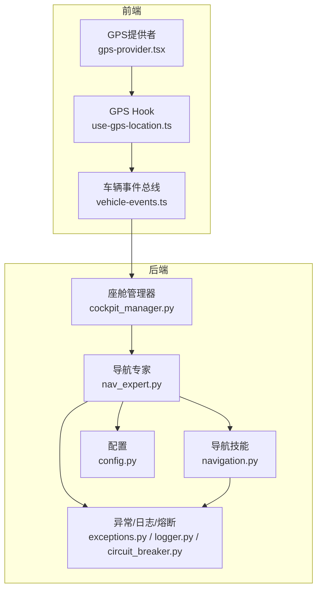
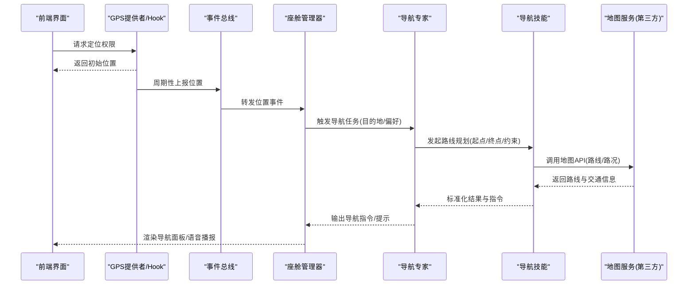
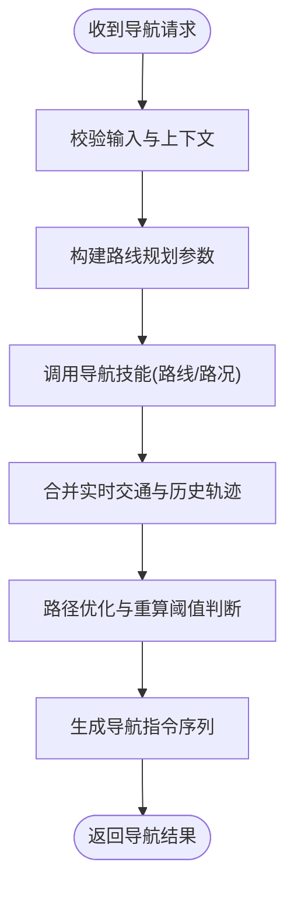
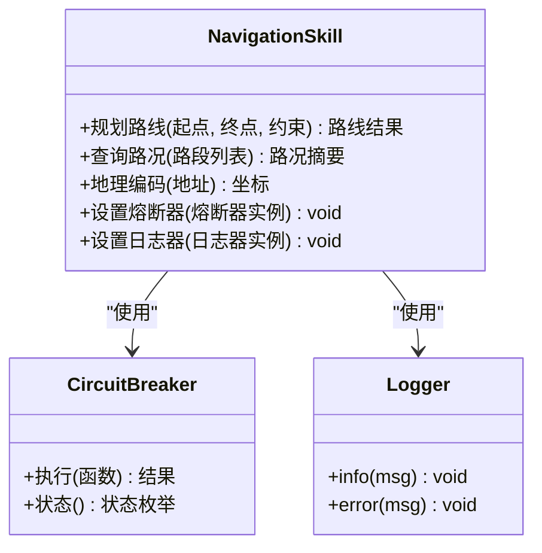
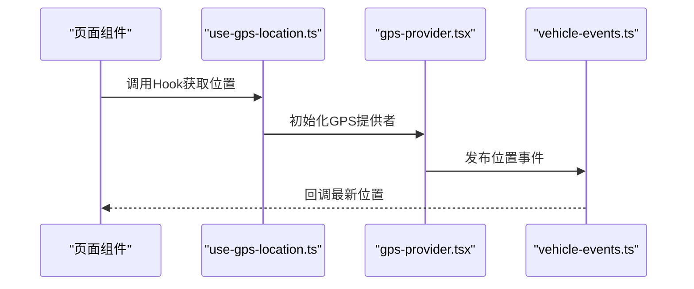
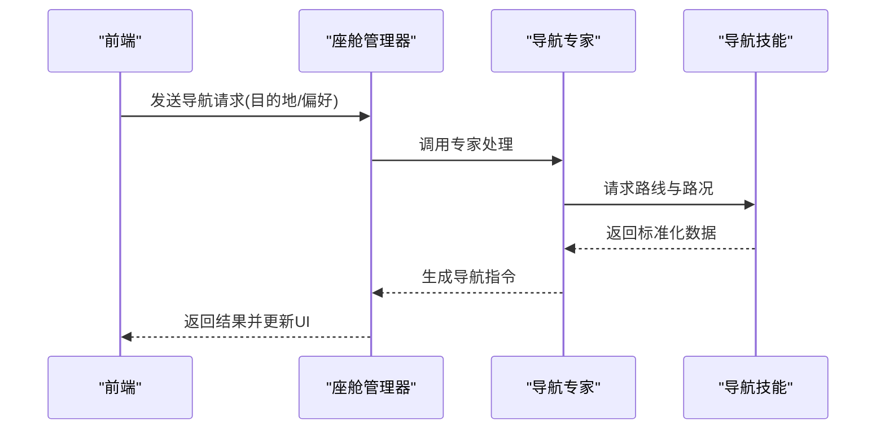
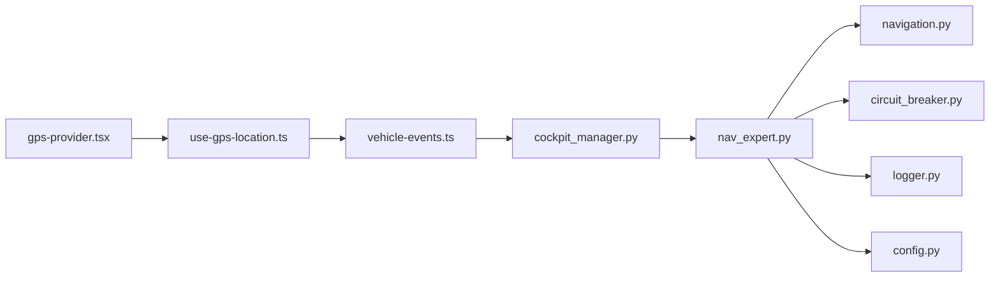

# 导航专家

<cite>
**本文引用的文件**   
- [nav_expert.py](file://backend_design/nexus/agent/experts/nav_expert.py)
- [navigation.py](file://backend_design/nexus/skills/vehicle/navigation.py)
- [base.py](file://backend_design/nexus/agent/experts/base.py)
- [responder.py](file://backend_design/nexus/agent/responder.py)
- [supervisor_graph.py](file://backend_design/nexus/agent/supervisor_graph.py)
- [cockpit_manager.py](file://backend_design/nexus/core/cockpit_manager.py)
- [config.py](file://backend_design/nexus/config.py)
- [exceptions.py](file://backend_design/nexus/core/exceptions.py)
- [logger.py](file://backend_design/nexus/core/logger.py)
- [circuit_breaker.py](file://backend_design/nexus/core/circuit_breaker.py)
- [gps-provider.tsx](file://frontend_design/src/components/layout/gps-provider.tsx)
- [use-gps-location.ts](file://frontend_design/src/hooks/use-gps-location.ts)
- [vehicle-events.ts](file://frontend_design/src/lib/vehicle-events.ts)
</cite>

## 目录
1. [简介](#简介)
2. [项目结构](#项目结构)
3. [核心组件](#核心组件)
4. [架构总览](#架构总览)
5. [详细组件分析](#详细组件分析)
6. [依赖关系分析](#依赖关系分析)
7. [性能考虑](#性能考虑)
8. [故障排查指南](#故障排查指南)
9. [结论](#结论)
10. [附录](#附录)

## 简介
本技术文档聚焦于NexusCockpit中的“导航专家”，系统性阐述其地理位置服务集成、地图API调用、路线规划与实时交通信息处理、位置数据处理、路径优化算法、导航指令生成，以及与车载导航系统的对接方式、数据格式转换和错误处理机制。同时提供配置选项、第三方服务集成与性能优化策略，并给出完整的实现示例与集成指南，帮助开发者快速落地导航能力。

## 项目结构
导航专家位于后端Agent专家体系与车辆技能层之间，前端通过GPS提供者与事件总线进行位置上报与交互。关键文件分布如下：
- 专家层：导航专家定义与调度入口
- 技能层：导航技能封装（地图/路线/交通）
- 核心层：异常、日志、熔断器、上下文管理
- 前端层：GPS定位提供者、Hook、事件总线

图表来源
- [nav_expert.py](file://backend_design/nexus/agent/experts/nav_expert.py)
- [navigation.py](file://backend_design/nexus/skills/vehicle/navigation.py)
- [gps-provider.tsx](file://frontend_design/src/components/layout/gps-provider.tsx)
- [use-gps-location.ts](file://frontend_design/src/hooks/use-gps-location.ts)
- [vehicle-events.ts](file://frontend_design/src/lib/vehicle-events.ts)
- [cockpit_manager.py](file://backend_design/nexus/core/cockpit_manager.py)
- [config.py](file://backend_design/nexus/config.py)
- [exceptions.py](file://backend_design/nexus/core/exceptions.py)
- [logger.py](file://backend_design/nexus/core/logger.py)
- [circuit_breaker.py](file://backend_design/nexus/core/circuit_breaker.py)

章节来源
- [nav_expert.py](file://backend_design/nexus/agent/experts/nav_expert.py)
- [navigation.py](file://backend_design/nexus/skills/vehicle/navigation.py)
- [gps-provider.tsx](file://frontend_design/src/components/layout/gps-provider.tsx)
- [use-gps-location.ts](file://frontend_design/src/hooks/use-gps-location.ts)
- [vehicle-events.ts](file://frontend_design/src/lib/vehicle-events.ts)
- [cockpit_manager.py](file://backend_design/nexus/core/cockpit_manager.py)
- [config.py](file://backend_design/nexus/config.py)
- [exceptions.py](file://backend_design/nexus/core/exceptions.py)
- [logger.py](file://backend_design/nexus/core/logger.py)
- [circuit_breaker.py](file://backend_design/nexus/core/circuit_breaker.py)

## 核心组件
- 导航专家：负责意图识别后的导航任务编排，协调地图API、路线规划、实时交通与指令生成。
- 导航技能：封装对第三方地图服务的调用（如地理编码、路线计算、路况查询），并提供统一的数据模型与错误语义。
- GPS提供者与Hook：在前端采集设备位置，经事件总线推送至后端；后端通过座舱管理器接入专家系统。
- 核心支撑：异常类型、结构化日志、熔断器与配置项，保障稳定性与可观测性。

章节来源
- [nav_expert.py](file://backend_design/nexus/agent/experts/nav_expert.py)
- [navigation.py](file://backend_design/nexus/skills/vehicle/navigation.py)
- [gps-provider.tsx](file://frontend_design/src/components/layout/gps-provider.tsx)
- [use-gps-location.ts](file://frontend_design/src/hooks/use-gps-location.ts)
- [vehicle-events.ts](file://frontend_design/src/lib/vehicle-events.ts)
- [cockpit_manager.py](file://backend_design/nexus/core/cockpit_manager.py)
- [config.py](file://backend_design/nexus/config.py)
- [exceptions.py](file://backend_design/nexus/core/exceptions.py)
- [logger.py](file://backend_design/nexus/core/logger.py)
- [circuit_breaker.py](file://backend_design/nexus/core/circuit_breaker.py)

## 架构总览
导航专家采用“专家-技能”分层架构：专家负责流程编排与决策，技能负责具体外部服务调用与数据转换。前端通过GPS提供者持续上报位置，后端在需要时触发路线重算与交通更新。

图表来源
- [nav_expert.py](file://backend_design/nexus/agent/experts/nav_expert.py)
- [navigation.py](file://backend_design/nexus/skills/vehicle/navigation.py)
- [gps-provider.tsx](file://frontend_design/src/components/layout/gps-provider.tsx)
- [use-gps-location.ts](file://frontend_design/src/hooks/use-gps-location.ts)
- [vehicle-events.ts](file://frontend_design/src/lib/vehicle-events.ts)
- [cockpit_manager.py](file://backend_design/nexus/core/cockpit_manager.py)

## 详细组件分析

### 导航专家（Agent Expert）
职责
- 接收来自座舱管理器的导航请求（含用户意图、上下文、历史轨迹）。
- 解析目的地、偏好（最短时间/最少拥堵/避开高速等）、时间窗口。
- 编排导航技能调用，合并实时交通信息，生成导航指令序列。
- 处理异常与降级，记录日志与指标。

关键流程
- 输入校验与上下文构建
- 调用导航技能获取路线与路况
- 路径优化与指令生成
- 返回结构化导航结果

图表来源
- [nav_expert.py](file://backend_design/nexus/agent/experts/nav_expert.py)
- [navigation.py](file://backend_design/nexus/skills/vehicle/navigation.py)
- [exceptions.py](file://backend_design/nexus/core/exceptions.py)
- [logger.py](file://backend_design/nexus/core/logger.py)
- [circuit_breaker.py](file://backend_design/nexus/core/circuit_breaker.py)

章节来源
- [nav_expert.py](file://backend_design/nexus/agent/experts/nav_expert.py)
- [navigation.py](file://backend_design/nexus/skills/vehicle/navigation.py)
- [exceptions.py](file://backend_design/nexus/core/exceptions.py)
- [logger.py](file://backend_design/nexus/core/logger.py)
- [circuit_breaker.py](file://backend_design/nexus/core/circuit_breaker.py)

### 导航技能（Vehicle Skill）
职责
- 封装第三方地图服务接口：地理编码、路线计算、实时路况、ETA估算。
- 将外部响应转换为内部标准数据结构。
- 实现重试、超时与熔断保护。

对外接口要点
- 路线规划：支持多约束（时间/距离/费用/偏好）
- 实时交通：路段拥堵等级、事故/施工事件
- 数据标准化：坐标、航点、转向指令、预计到达时间

图表来源
- [navigation.py](file://backend_design/nexus/skills/vehicle/navigation.py)
- [circuit_breaker.py](file://backend_design/nexus/core/circuit_breaker.py)
- [logger.py](file://backend_design/nexus/core/logger.py)

章节来源
- [navigation.py](file://backend_design/nexus/skills/vehicle/navigation.py)
- [circuit_breaker.py](file://backend_design/nexus/core/circuit_breaker.py)
- [logger.py](file://backend_design/nexus/core/logger.py)

### 前端GPS提供者与Hook
职责
- 获取设备定位权限并订阅位置变化。
- 将位置数据以统一格式发布到事件总线。
- 暴露React Hook供页面消费最新位置。

交互流程
- 初始化时请求权限
- 成功则开始监听位置更新
- 失败或无权限时回退为模拟位置或提示用户

图表来源
- [gps-provider.tsx](file://frontend_design/src/components/layout/gps-provider.tsx)
- [use-gps-location.ts](file://frontend_design/src/hooks/use-gps-location.ts)
- [vehicle-events.ts](file://frontend_design/src/lib/vehicle-events.ts)

章节来源
- [gps-provider.tsx](file://frontend_design/src/components/layout/gps-provider.tsx)
- [use-gps-location.ts](file://frontend_design/src/hooks/use-gps-location.ts)
- [vehicle-events.ts](file://frontend_design/src/lib/vehicle-events.ts)

### 座舱管理器与专家编排
职责
- 作为前端事件与后端专家的桥梁。
- 维护会话上下文、用户偏好与历史轨迹。
- 路由导航请求至导航专家，并聚合结果返回前端。

图表来源
- [cockpit_manager.py](file://backend_design/nexus/core/cockpit_manager.py)
- [nav_expert.py](file://backend_design/nexus/agent/experts/nav_expert.py)
- [navigation.py](file://backend_design/nexus/skills/vehicle/navigation.py)

章节来源
- [cockpit_manager.py](file://backend_design/nexus/core/cockpit_manager.py)
- [nav_expert.py](file://backend_design/nexus/agent/experts/nav_expert.py)
- [navigation.py](file://backend_design/nexus/skills/vehicle/navigation.py)

## 依赖关系分析
导航专家依赖导航技能与核心支撑模块；前端依赖GPS提供者与事件总线；座舱管理器串联前后端。

图表来源
- [gps-provider.tsx](file://frontend_design/src/components/layout/gps-provider.tsx)
- [use-gps-location.ts](file://frontend_design/src/hooks/use-gps-location.ts)
- [vehicle-events.ts](file://frontend_design/src/lib/vehicle-events.ts)
- [cockpit_manager.py](file://backend_design/nexus/core/cockpit_manager.py)
- [nav_expert.py](file://backend_design/nexus/agent/experts/nav_expert.py)
- [navigation.py](file://backend_design/nexus/skills/vehicle/navigation.py)
- [circuit_breaker.py](file://backend_design/nexus/core/circuit_breaker.py)
- [logger.py](file://backend_design/nexus/core/logger.py)
- [config.py](file://backend_design/nexus/config.py)

章节来源
- [gps-provider.tsx](file://frontend_design/src/components/layout/gps-provider.tsx)
- [use-gps-location.ts](file://frontend_design/src/hooks/use-gps-location.ts)
- [vehicle-events.ts](file://frontend_design/src/lib/vehicle-events.ts)
- [cockpit_manager.py](file://backend_design/nexus/core/cockpit_manager.py)
- [nav_expert.py](file://backend_design/nexus/agent/experts/nav_expert.py)
- [navigation.py](file://backend_design/nexus/skills/vehicle/navigation.py)
- [circuit_breaker.py](file://backend_design/nexus/core/circuit_breaker.py)
- [logger.py](file://backend_design/nexus/core/logger.py)
- [config.py](file://backend_design/nexus/config.py)

## 性能考虑
- 位置上报节流：前端按固定间隔或距离阈值上报，避免频繁网络请求。
- 路线重算阈值：基于ETA变化、拥堵指数或偏离度触发重算，减少不必要的API调用。
- 缓存与去抖：对热点区域与常用路线进行短期缓存；合并相近的导航请求。
- 熔断与限流：对第三方地图服务启用熔断器与速率限制，防止雪崩。
- 异步与批处理：批量请求路况与路线片段，降低往返次数。
- 资源回收：及时释放GPS监听与WebSocket连接，避免内存泄漏。

[本节为通用指导，不直接分析具体文件]

## 故障排查指南
常见问题与定位步骤
- 无法获取位置
  - 检查前端是否已授予定位权限，查看GPS提供者初始化日志。
  - 确认事件总线是否正常发布位置事件。
- 路线规划失败
  - 检查导航技能调用是否被熔断器拦截，查看熔断状态与错误码。
  - 核对第三方地图服务返回的错误信息，确认坐标格式与边界范围。
- 实时交通不更新
  - 检查路况查询频率与限流策略，确认服务端未触发降級。
- 导航指令缺失或顺序异常
  - 验证路径优化逻辑与指令生成规则，检查输入约束是否正确传递。

建议的日志与监控
- 在导航专家与技能层增加关键节点日志（输入、输出、耗时、错误码）。
- 暴露基础指标（请求量、成功率、P95延迟、熔断触发次数）。
- 对异常进行分类统计，便于快速定位根因。

章节来源
- [exceptions.py](file://backend_design/nexus/core/exceptions.py)
- [logger.py](file://backend_design/nexus/core/logger.py)
- [circuit_breaker.py](file://backend_design/nexus/core/circuit_breaker.py)
- [nav_expert.py](file://backend_design/nexus/agent/experts/nav_expert.py)
- [navigation.py](file://backend_design/nexus/skills/vehicle/navigation.py)

## 结论
导航专家通过清晰的“专家-技能”分层，结合前端的GPS提供者与事件总线，实现了从位置采集、路线规划、实时交通到导航指令生成的完整闭环。借助熔断器、日志与配置化策略，系统在稳定性与可观测性方面具备良好基础。后续可在路径优化算法、缓存策略与多源地图融合方面进一步演进，以提升导航体验与鲁棒性。

[本节为总结性内容，不直接分析具体文件]

## 附录

### 配置选项（建议）
- 地图服务密钥与端点：用于第三方地图API鉴权与访问。
- 位置上报间隔与最小移动距离：控制前端上报频率。
- 路线重算阈值：基于ETA变化、拥堵指数或偏离度的阈值。
- 熔断器参数：失败阈值、恢复时间、半开探测次数。
- 日志级别与采样率：平衡可观测性与性能开销。
- 缓存策略：热点路线与路况的TTL与最大条目数。

章节来源
- [config.py](file://backend_design/nexus/config.py)
- [circuit_breaker.py](file://backend_design/nexus/core/circuit_breaker.py)
- [logger.py](file://backend_design/nexus/core/logger.py)

### 第三方服务集成要点
- 地理编码：地址转坐标，需处理模糊匹配与多候选排序。
- 路线计算：支持多目标优化（时间/距离/费用/偏好）。
- 实时路况：路段级拥堵等级与事件标注，用于动态重算。
- 错误映射：将第三方错误码映射为内部异常类型，便于统一处理。

章节来源
- [navigation.py](file://backend_design/nexus/skills/vehicle/navigation.py)
- [exceptions.py](file://backend_design/nexus/core/exceptions.py)

### 与车载导航系统对接
- 数据格式：统一坐标体系（如WGS84）、标准化航点与转向指令。
- 通信协议：通过事件总线或HTTP/WebSocket推送导航结果。
- 安全与鉴权：令牌轮换与签名校验，确保数据传输安全。
- 降级策略：当第三方服务不可用时，回退到离线地图或简化导航。

章节来源
- [vehicle-events.ts](file://frontend_design/src/lib/vehicle-events.ts)
- [cockpit_manager.py](file://backend_design/nexus/core/cockpit_manager.py)
- [navigation.py](file://backend_design/nexus/skills/vehicle/navigation.py)

### 实现示例与集成指南（步骤式）
- 前端集成
  - 引入GPS提供者并在应用启动时初始化。
  - 使用GPS Hook在页面中订阅位置变化。
  - 将位置事件发送至事件总线，供其他模块消费。
- 后端集成
  - 在座舱管理器中注册导航专家与导航技能。
  - 配置地图服务密钥、熔断器与日志级别。
  - 实现导航请求路由与结果返回。
- 测试与验证
  - 使用模拟位置与离线数据进行端到端测试。
  - 验证熔断器与降级策略的有效性。
  - 收集性能指标并进行压测。

章节来源
- [gps-provider.tsx](file://frontend_design/src/components/layout/gps-provider.tsx)
- [use-gps-location.ts](file://frontend_design/src/hooks/use-gps-location.ts)
- [vehicle-events.ts](file://frontend_design/src/lib/vehicle-events.ts)
- [cockpit_manager.py](file://backend_design/nexus/core/cockpit_manager.py)
- [nav_expert.py](file://backend_design/nexus/agent/experts/nav_expert.py)
- [navigation.py](file://backend_design/nexus/skills/vehicle/navigation.py)
- [config.py](file://backend_design/nexus/config.py)
- [circuit_breaker.py](file://backend_design/nexus/core/circuit_breaker.py)
- [logger.py](file://backend_design/nexus/core/logger.py)