# 聊天专家

<cite>
**本文引用的文件**   
- [chat_expert.py](file://backend_design/nexus/agent/experts/chat_expert.py)
- [base.py](file://backend_design/nexus/agent/experts/base.py)
- [responder.py](file://backend_design/nexus/agent/responder.py)
- [supervisor_graph.py](file://backend_design/nexus/agent/supervisor_graph.py)
- [llm_router.py](file://backend_design/nexus/intent/llm_router.py)
- [router.py](file://backend_design/nexus/intent/router.py)
- [constants.py](file://backend_design/nexus/intent/constants.py)
- [heuristic.py](file://backend_design/nexus/intent/heuristic.py)
- [config.py](file://backend_design/nexus/config.py)
- [personalization.py](file://backend_design/nexus/core/personalization.py)
- [manager.py](file://backend_design/nexus/memory/manager.py)
- [conflict.py](file://backend_design/nexus/memory/conflict.py)
- [session_store.py](file://backend_design/nexus/middleware/session_store.py)
- [redis_cache.py](file://backend_design/nexus/middleware/redis_cache.py)
- [rate_limiter.py](file://backend_design/nexus/middleware/rate_limiter.py)
- [circuit_breaker.py](file://backend_design/nexus/core/circuit_breaker.py)
- [exceptions.py](file://backend_design/nexus/core/exceptions.py)
- [logger.py](file://backend_design/nexus/core/logger.py)
- [cockpit_metrics.py](file://backend_design/nexus/observability/cockpit_metrics.py)
- [metrics.py](file://backend_design/nexus/observability/metrics.py)
- [langfuse.py](file://backend_design/nexus/observability/langfuse.py)
- [unified_retriever.py](file://backend_design/nexus/rag/unified_retriever.py)
- [vector_factory.py](file://backend_design/nexus/rag/vector_factory.py)
- [graph_factory.py](file://backend_design/nexus/rag/graph_factory.py)
- [reranker_factory.py](file://backend_design/nexus/rag/reranker_factory.py)
- [embedding.py](file://backend_design/nexus/rag/embedding.py)
- [cherry_kb.py](file://backend_design/nexus/rag/cherry_kb.py)
- [aura_graph_store.py](file://backend_design/nexus/rag/aura_graph_store.py)
- [zilliz_vector_store.py](file://backend_design/nexus/rag/zilliz_vector_store.py)
- [siliconflow_reranker.py](file://backend_design/nexus/rag/siliconflow_reranker.py)
- [chat.md](file://backend_design/nexus/prompts/chat.md)
- [clarification.md](file://backend_design/nexus/prompts/clarification.md)
- [memory_extract.md](file://backend_design/nexus/prompts/memory_extract.md)
- [vehicle.md](file://backend_design/nexus/prompts/vehicle.md)
- [orchestrator.py](file://backend_design/nexus/skills/orchestrator.py)
- [registry.py](file://backend_design/nexus/skills/registry.py)
- [base.py](file://backend_design/nexus/skills/base.py)
- [health.py](file://backend_design/nexus/skills/health.py)
- [habit.py](file://backend_design/nexus/skills/habit.py)
- [reminder.py](file://backend_design/nexus/skills/reminder.py)
- [special.py](file://backend_design/nexus/skills/special.py)
- [climate.py](file://backend_design/nexus/skills/vehicle/climate.py)
- [media.py](file://backend_design/nexus/skills/vehicle/media.py)
- [navigation.py](file://backend_design/nexus/skills/vehicle/navigation.py)
- [seat.py](file://backend_design/nexus/skills/vehicle/seat.py)
- [status.py](file://backend_design/nexus/skills/vehicle/status.py)
- [window.py](file://backend_design/nexus/skills/vehicle/window.py)
- [http.py](file://backend_design/nexus/vehicle/http.py)
- [mcp.py](file://backend_design/nexus/vehicle/mcp.py)
- [mock.py](file://backend_design/nexus/vehicle/mock.py)
- [gateway.py](file://backend_design/nexus/mcp/gateway.py)
- [auth.py](file://backend_design/nexus/api/auth.py)
- [chat.py](file://backend_design/nexus/api/chat.py)
- [chat_sessions.py](file://backend_design/nexus/api/chat_sessions.py)
- [websocket.py](file://backend_design/nexus/api/websocket.py)
- [schemas.py](file://backend_design/nexus/models/schemas.py)
- [state.py](file://backend_design/nexus/models/state.py)
- [main.py](file://backend_design/nexus/main.py)
</cite>

## 目录
1. [简介](#简介)
2. [项目结构](#项目结构)
3. [核心组件](#核心组件)
4. [架构总览](#架构总览)
5. [详细组件分析](#详细组件分析)
6. [依赖关系分析](#依赖关系分析)
7. [性能考虑](#性能考虑)
8. [故障排查指南](#故障排查指南)
9. [结论](#结论)
10. [附录](#附录)

## 简介
本技术文档聚焦于 NexusCockpit 的“聊天专家”模块，系统阐述其对话理解、上下文保持与多轮对话管理能力；深入解析大语言模型（LLM）集成配置、提示词工程与响应生成策略；介绍对话状态管理、记忆机制与个性化回复生成；并提供自定义配置选项、性能调优参数与故障恢复机制。同时给出实际使用场景的代码示例路径与集成方法，帮助开发者快速落地与扩展。

## 项目结构
聊天专家位于后端智能体（Agent）层，围绕“专家路由—意图识别—检索增强—提示词组装—LLM调用—技能执行—记忆更新—可观测性”的全链路实现。关键目录与职责：
- agent/experts: 专家定义与基类，聊天专家为核心
- intent: 意图路由与启发式规则
- rag: 统一检索器与向量/图存储、重排器、嵌入模型工厂
- memory: 对话记忆管理与冲突消解
- middleware: 会话存储、缓存、限流等横切能力
- core: 个性化、熔断、异常、日志等基础能力
- observability: 指标、追踪与数据保留
- prompts: 提示词模板
- skills: 领域技能编排与注册
- api: HTTP/WebSocket 接口与鉴权
- models: 数据模型与状态定义
- config: 全局配置入口

```mermaid
graph TB
subgraph "API 层"
API_CHAT["聊天接口<br/>api/chat.py"]
API_WS["WebSocket 接口<br/>api/websocket.py"]
AUTH["鉴权中间件<br/>api/auth.py"]
end
subgraph "智能体层"
SUPER["监督图/编排<br/>agent/supervisor_graph.py"]
RESP["响应构建器<br/>agent/responder.py"]
EXP_CHAT["聊天专家<br/>agent/experts/chat_expert.py"]
EXP_BASE["专家基类<br/>agent/experts/base.py"]
end
subgraph "意图与检索"
ROUTER["意图路由<br/>intent/llm_router.py / intent/router.py"]
HEU["启发式规则<br/>intent/heuristic.py"]
RETRIEVER["统一检索器<br/>rag/unified_retriever.py"]
VFACT["向量工厂<br/>rag/vector_factory.py"]
GFACT["图工厂<br/>rag/graph_factory.py"]
RFACT["重排工厂<br/>rag/reranker_factory.py"]
EMB["嵌入模型<br/>rag/embedding.py"]
CHERRY["樱桃知识库<br/>rag/cherry_kb.py"]
AURA["Aura 图存储<br/>rag/aura_graph_store.py"]
ZILLIZ["Zilliz 向量存储<br/>rag/zilliz_vector_store.py"]
SILI["SiliconFlow 重排器<br/>rag/siliconflow_reranker.py"]
end
subgraph "记忆与个性化"
MEM_MGR["记忆管理器<br/>memory/manager.py"]
MEM_CONFLICT["冲突消解<br/>memory/conflict.py"]
PERSO["个性化<br/>core/personalization.py"]
end
subgraph "中间件与基础设施"
SESS["会话存储<br/>middleware/session_store.py"]
REDIS["Redis 缓存<br/>middleware/redis_cache.py"]
RATE["限流<br/>middleware/rate_limiter.py"]
CB["熔断器<br/>core/circuit_breaker.py"]
LOG["日志<br/>core/logger.py"]
EXC["异常定义<br/>core/exceptions.py"]
end
subgraph "可观测性"
METRICS["指标<br/>observability/metrics.py"]
COCKPIT_METRICS["仪表盘指标<br/>observability/cockpit_metrics.py"]
LANGFUSE["Langfuse 追踪<br/>observability/langfuse.py"]
end
subgraph "技能与车辆"
ORCH["技能编排<br/>skills/orchestrator.py"]
REG["技能注册表<br/>skills/registry.py"]
SK_HEALTH["健康技能<br/>skills/health.py"]
SK_HABIT["习惯技能<br/>skills/habit.py"]
SK_REMINDER["提醒技能<br/>skills/reminder.py"]
SK_SPECIAL["特殊技能<br/>skills/special.py"]
V_CLIMATE["空调控制<br/>skills/vehicle/climate.py"]
V_MEDIA["媒体控制<br/>skills/vehicle/media.py"]
V_NAV["导航控制<br/>skills/vehicle/navigation.py"]
V_SEAT["座椅控制<br/>skills/vehicle/seat.py"]
V_STATUS["车辆状态<br/>skills/vehicle/status.py"]
V_WINDOW["车窗控制<br/>skills/vehicle/window.py"]
V_HTTP["HTTP 车辆接口<br/>vehicle/http.py"]
V_MCP["MCP 车辆接口<br/>vehicle/mcp.py"]
V_MOCK["Mock 车辆接口<br/>vehicle/mock.py"]
MCP_GW["MCP 网关<br/>mcp/gateway.py"]
end
subgraph "提示词与配置"
PROMPT_CHAT["聊天提示词<br/>prompts/chat.md"]
PROMPT_CLAR["澄清提示词<br/>prompts/clarification.md"]
PROMPT_MEM["记忆提取提示词<br/>prompts/memory_extract.md"]
PROMPT_VEH["车辆提示词<br/>prompts/vehicle.md"]
CFG["全局配置<br/>config.py"]
end
API_CHAT --> AUTH
API_CHAT --> SUPER
API_WS --> SUPER
SUPER --> EXP_CHAT
EXP_CHAT --> EXP_BASE
EXP_CHAT --> ROUTER
ROUTER --> HEU
EXP_CHAT --> RETRIEVER
RETRIEVER --> VFACT
RETRIEVER --> GFACT
RETRIEVER --> RFACT
RETRIEVER --> EMB
RETRIEVER --> CHERRY
RETRIEVER --> AURA
RETRIEVER --> ZILLIZ
RETRIEVER --> SILI
EXP_CHAT --> MEM_MGR
MEM_MGR --> MEM_CONFLICT
EXP_CHAT --> PERSO
EXP_CHAT --> ORCH
ORCH --> REG
ORCH --> SK_HEALTH
ORCH --> SK_HABIT
ORCH --> SK_REMINDER
ORCH --> SK_SPECIAL
ORCH --> V_CLIMATE
ORCH --> V_MEDIA
ORCH --> V_NAV
ORCH --> V_SEAT
ORCH --> V_STATUS
ORCH --> V_WINDOW
V_CLIMATE --> V_HTTP
V_NAV --> V_HTTP
V_SEAT --> V_HTTP
V_STATUS --> V_HTTP
V_WINDOW --> V_HTTP
V_HTTP --> MCP_GW
V_MCP --> MCP_GW
V_MOCK --> MCP_GW
EXP_CHAT --> RESP
EXP_CHAT --> CB
EXP_CHAT --> LOG
EXP_CHAT --> METRICS
EXP_CHAT --> COCKPIT_METRICS
EXP_CHAT --> LANGFUSE
EXP_CHAT --> SESS
EXP_CHAT --> REDIS
EXP_CHAT --> RATE
EXP_CHAT --> CFG
EXP_CHAT --> PROMPT_CHAT
EXP_CHAT --> PROMPT_CLAR
EXP_CHAT --> PROMPT_MEM
EXP_CHAT --> PROMPT_VEH
```

图表来源
- [chat_expert.py:1-200](file://backend_design/nexus/agent/experts/chat_expert.py#L1-L200)
- [responder.py:1-200](file://backend_design/nexus/agent/responder.py#L1-L200)
- [supervisor_graph.py:1-200](file://backend_design/nexus/agent/supervisor_graph.py#L1-L200)
- [llm_router.py:1-200](file://backend_design/nexus/intent/llm_router.py#L1-L200)
- [router.py:1-200](file://backend_design/nexus/intent/router.py#L1-L200)
- [unified_retriever.py:1-200](file://backend_design/nexus/rag/unified_retriever.py#L1-L200)
- [vector_factory.py:1-200](file://backend_design/nexus/rag/vector_factory.py#L1-L200)
- [graph_factory.py:1-200](file://backend_design/nexus/rag/graph_factory.py#L1-L200)
- [reranker_factory.py:1-200](file://backend_design/nexus/rag/reranker_factory.py#L1-L200)
- [embedding.py:1-200](file://backend_design/nexus/rag/embedding.py#L1-L200)
- [cherry_kb.py:1-200](file://backend_design/nexus/rag/cherry_kb.py#L1-L200)
- [aura_graph_store.py:1-200](file://backend_design/nexus/rag/aura_graph_store.py#L1-L200)
- [zilliz_vector_store.py:1-200](file://backend_design/nexus/rag/zilliz_vector_store.py#L1-L200)
- [siliconflow_reranker.py:1-200](file://backend_design/nexus/rag/siliconflow_reranker.py#L1-L200)
- [manager.py:1-200](file://backend_design/nexus/memory/manager.py#L1-L200)
- [conflict.py:1-200](file://backend_design/nexus/memory/conflict.py#L1-L200)
- [personalization.py:1-200](file://backend_design/nexus/core/personalization.py#L1-L200)
- [session_store.py:1-200](file://backend_design/nexus/middleware/session_store.py#L1-L200)
- [redis_cache.py:1-200](file://backend_design/nexus/middleware/redis_cache.py#L1-L200)
- [rate_limiter.py:1-200](file://backend_design/nexus/middleware/rate_limiter.py#L1-L200)
- [circuit_breaker.py:1-200](file://backend_design/nexus/core/circuit_breaker.py#L1-L200)
- [exceptions.py:1-200](file://backend_design/nexus/core/exceptions.py#L1-L200)
- [logger.py:1-200](file://backend_design/nexus/core/logger.py#L1-L200)
- [metrics.py:1-200](file://backend_design/nexus/observability/metrics.py#L1-L200)
- [cockpit_metrics.py:1-200](file://backend_design/nexus/observability/cockpit_metrics.py#L1-L200)
- [langfuse.py:1-200](file://backend_design/nexus/observability/langfuse.py#L1-L200)
- [orchestrator.py:1-200](file://backend_design/nexus/skills/orchestrator.py#L1-L200)
- [registry.py:1-200](file://backend_design/nexus/skills/registry.py#L1-L200)
- [health.py:1-200](file://backend_design/nexus/skills/health.py#L1-L200)
- [habit.py:1-200](file://backend_design/nexus/skills/habit.py#L1-L200)
- [reminder.py:1-200](file://backend_design/nexus/skills/reminder.py#L1-L200)
- [special.py:1-200](file://backend_design/nexus/skills/special.py#L1-L200)
- [climate.py:1-200](file://backend_design/nexus/skills/vehicle/climate.py#L1-L200)
- [media.py:1-200](file://backend_design/nexus/skills/vehicle/media.py#L1-L200)
- [navigation.py:1-200](file://backend_design/nexus/skills/vehicle/navigation.py#L1-L200)
- [seat.py:1-200](file://backend_design/nexus/skills/vehicle/seat.py#L1-L200)
- [status.py:1-200](file://backend_design/nexus/skills/vehicle/status.py#L1-L200)
- [window.py:1-200](file://backend_design/nexus/skills/vehicle/window.py#L1-L200)
- [http.py:1-200](file://backend_design/nexus/vehicle/http.py#L1-L200)
- [mcp.py:1-200](file://backend_design/nexus/vehicle/mcp.py#L1-L200)
- [mock.py:1-200](file://backend_design/nexus/vehicle/mock.py#L1-L200)
- [gateway.py:1-200](file://backend_design/nexus/mcp/gateway.py#L1-L200)
- [chat.md:1-200](file://backend_design/nexus/prompts/chat.md#L1-L200)
- [clarification.md:1-200](file://backend_design/nexus/prompts/clarification.md#L1-L200)
- [memory_extract.md:1-200](file://backend_design/nexus/prompts/memory_extract.md#L1-L200)
- [vehicle.md:1-200](file://backend_design/nexus/prompts/vehicle.md#L1-L200)
- [config.py:1-200](file://backend_design/nexus/config.py#L1-L200)

章节来源
- [chat_expert.py:1-200](file://backend_design/nexus/agent/experts/chat_expert.py#L1-L200)
- [supervisor_graph.py:1-200](file://backend_design/nexus/agent/supervisor_graph.py#L1-L200)
- [llm_router.py:1-200](file://backend_design/nexus/intent/llm_router.py#L1-L200)
- [unified_retriever.py:1-200](file://backend_design/nexus/rag/unified_retriever.py#L1-L200)
- [manager.py:1-200](file://backend_design/nexus/memory/manager.py#L1-L200)
- [personalization.py:1-200](file://backend_design/nexus/core/personalization.py#L1-L200)
- [config.py:1-200](file://backend_design/nexus/config.py#L1-L200)

## 核心组件
- 聊天专家（Chat Expert）
  - 负责将用户输入进行意图识别、上下文装配、检索增强、提示词组装、LLM 调用与响应生成，并驱动技能执行与记忆更新。
  - 通过专家基类提供统一的对话生命周期钩子与错误处理。
- 意图路由
  - LLM 路由与启发式规则结合，优先基于规则快速分流，复杂或模糊意图交由 LLM 判定。
- 统一检索器
  - 聚合向量库、知识图谱与外部知识库，支持多路召回与重排，提升回答准确性与时效性。
- 记忆管理器
  - 维护短期会话记忆与长期个人偏好，提供冲突检测与合并策略。
- 个性化引擎
  - 基于用户画像与历史交互，动态调整语气、风格与推荐策略。
- 技能编排与注册
  - 将车控、健康、习惯、提醒等能力以技能形式暴露，由编排器按需调度。
- 可观测性与稳定性
  - 指标采集、分布式追踪、熔断降级、限流与缓存，保障高可用与可观测。

章节来源
- [chat_expert.py:1-200](file://backend_design/nexus/agent/experts/chat_expert.py#L1-L200)
- [base.py:1-200](file://backend_design/nexus/agent/experts/base.py#L1-L200)
- [llm_router.py:1-200](file://backend_design/nexus/intent/llm_router.py#L1-L200)
- [router.py:1-200](file://backend_design/nexus/intent/router.py#L1-L200)
- [heuristic.py:1-200](file://backend_design/nexus/intent/heuristic.py#L1-L200)
- [unified_retriever.py:1-200](file://backend_design/nexus/rag/unified_retriever.py#L1-L200)
- [manager.py:1-200](file://backend_design/nexus/memory/manager.py#L1-L200)
- [personalization.py:1-200](file://backend_design/nexus/core/personalization.py#L1-L200)
- [orchestrator.py:1-200](file://backend_design/nexus/skills/orchestrator.py#L1-L200)
- [registry.py:1-200](file://backend_design/nexus/skills/registry.py#L1-L200)
- [metrics.py:1-200](file://backend_design/nexus/observability/metrics.py#L1-L200)
- [langfuse.py:1-200](file://backend_design/nexus/observability/langfuse.py#L1-L200)
- [circuit_breaker.py:1-200](file://backend_design/nexus/core/circuit_breaker.py#L1-L200)
- [rate_limiter.py:1-200](file://backend_design/nexus/middleware/rate_limiter.py#L1-L200)
- [redis_cache.py:1-200](file://backend_design/nexus/middleware/redis_cache.py#L1-L200)

## 架构总览
聊天专家的端到端流程如下：
- 请求接入：HTTP/WebSocket 接口接收消息，鉴权后进入智能体编排。
- 意图识别：先走启发式规则，再走 LLM 路由，确定意图类别与所需工具。
- 上下文装配：加载会话记忆、用户画像与系统提示词。
- 检索增强：根据意图选择向量/图/知识库检索，并进行重排。
- 提示词组装：融合用户输入、上下文、检索结果与个性化信息，生成最终提示词。
- LLM 调用：带熔断与重试策略调用 LLM，获取结构化输出。
- 技能执行：若涉及车控或业务操作，由编排器调度相应技能。
- 记忆更新：抽取事实与偏好写入长期记忆，更新短期会话记忆。
- 响应构建：格式化文本/结构化数据，返回前端；同时记录指标与追踪。

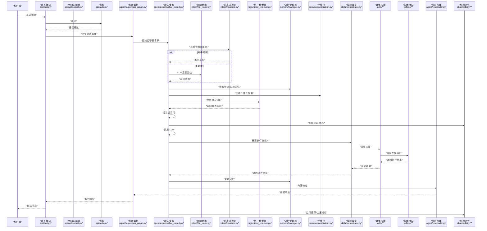

图表来源
- [chat.py:1-200](file://backend_design/nexus/api/chat.py#L1-L200)
- [websocket.py:1-200](file://backend_design/nexus/api/websocket.py#L1-L200)
- [auth.py:1-200](file://backend_design/nexus/api/auth.py#L1-L200)
- [supervisor_graph.py:1-200](file://backend_design/nexus/agent/supervisor_graph.py#L1-L200)
- [chat_expert.py:1-200](file://backend_design/nexus/agent/experts/chat_expert.py#L1-L200)
- [llm_router.py:1-200](file://backend_design/nexus/intent/llm_router.py#L1-L200)
- [heuristic.py:1-200](file://backend_design/nexus/intent/heuristic.py#L1-L200)
- [unified_retriever.py:1-200](file://backend_design/nexus/rag/unified_retriever.py#L1-L200)
- [manager.py:1-200](file://backend_design/nexus/memory/manager.py#L1-L200)
- [personalization.py:1-200](file://backend_design/nexus/core/personalization.py#L1-L200)
- [orchestrator.py:1-200](file://backend_design/nexus/skills/orchestrator.py#L1-L200)
- [http.py:1-200](file://backend_design/nexus/vehicle/http.py#L1-L200)
- [mcp.py:1-200](file://backend_design/nexus/vehicle/mcp.py#L1-L200)
- [mock.py:1-200](file://backend_design/nexus/vehicle/mock.py#L1-L200)
- [responder.py:1-200](file://backend_design/nexus/agent/responder.py#L1-L200)
- [metrics.py:1-200](file://backend_design/nexus/observability/metrics.py#L1-L200)
- [langfuse.py:1-200](file://backend_design/nexus/observability/langfuse.py#L1-L200)

## 详细组件分析

### 聊天专家（Chat Expert）
- 职责
  - 对话生命周期管理：预处理、意图识别、检索增强、提示词组装、LLM 调用、技能执行、记忆更新、响应构建。
  - 错误与降级：在 LLM 不可用时回退到规则或缓存答案，保证可用性。
  - 可观测性：埋点指标与追踪，便于问题定位与性能优化。
- 关键流程
  - 输入校验与会话加载
  - 意图识别（启发式 + LLM）
  - 检索增强（向量/图/知识库）
  - 提示词工程（融合系统提示、用户画像、检索结果）
  - LLM 调用（带熔断、超时、重试）
  - 技能编排（车控、健康、习惯、提醒等）
  - 记忆更新（短期会话与长期偏好）
  - 响应构建与返回
- 设计要点
  - 模块化：通过专家基类抽象通用逻辑，聊天专家专注自然语言处理与业务编排。
  - 可扩展：新增意图、检索源、技能均通过注册机制接入。
  - 可观测：全链路指标与追踪，覆盖耗时、成功率、错误码分布。

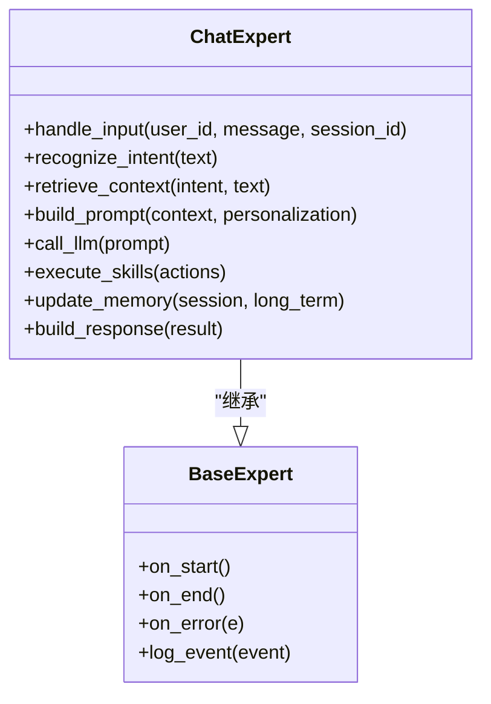

图表来源
- [chat_expert.py:1-200](file://backend_design/nexus/agent/experts/chat_expert.py#L1-L200)
- [base.py:1-200](file://backend_design/nexus/agent/experts/base.py#L1-L200)

章节来源
- [chat_expert.py:1-200](file://backend_design/nexus/agent/experts/chat_expert.py#L1-L200)
- [base.py:1-200](file://backend_design/nexus/agent/experts/base.py#L1-L200)

### 意图识别与路由
- 启发式规则
  - 关键词匹配、正则表达式、白名单/黑名单策略，用于高频、确定性意图的快速分流。
- LLM 路由
  - 当规则无法明确时，构造轻量提示词交由 LLM 分类，提高泛化能力。
- 决策流程
  - 先规则后 LLM，兼顾速度与准确率；对边界案例进行二次确认或澄清。

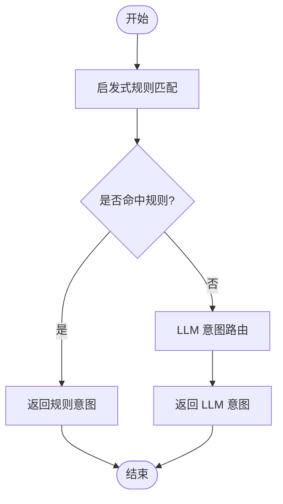

图表来源
- [heuristic.py:1-200](file://backend_design/nexus/intent/heuristic.py#L1-L200)
- [llm_router.py:1-200](file://backend_design/nexus/intent/llm_router.py#L1-L200)
- [router.py:1-200](file://backend_design/nexus/intent/router.py#L1-L200)

章节来源
- [heuristic.py:1-200](file://backend_design/nexus/intent/heuristic.py#L1-L200)
- [llm_router.py:1-200](file://backend_design/nexus/intent/llm_router.py#L1-L200)
- [router.py:1-200](file://backend_design/nexus/intent/router.py#L1-L200)
- [constants.py:1-200](file://backend_design/nexus/intent/constants.py#L1-200)

### 检索增强（RAG）
- 统一检索器
  - 聚合多种数据源：向量库、图数据库、外部知识库；支持并行召回与结果融合。
- 存储与工厂
  - 向量存储（如 Zilliz）、图存储（如 Aura）、重排器（如 SiliconFlow），通过工厂模式灵活切换。
- 嵌入模型
  - 提供嵌入模型工厂，适配不同场景的语义表示需求。
- 知识库
  - 支持樱桃知识库等外部知识源，增强专业领域回答质量。

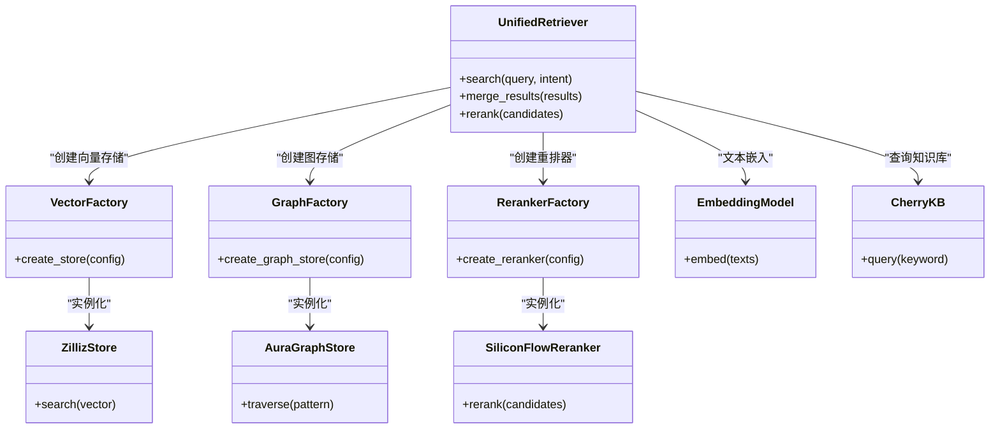

图表来源
- [unified_retriever.py:1-200](file://backend_design/nexus/rag/unified_retriever.py#L1-L200)
- [vector_factory.py:1-200](file://backend_design/nexus/rag/vector_factory.py#L1-L200)
- [graph_factory.py:1-200](file://backend_design/nexus/rag/graph_factory.py#L1-L200)
- [reranker_factory.py:1-200](file://backend_design/nexus/rag/reranker_factory.py#L1-L200)
- [embedding.py:1-200](file://backend_design/nexus/rag/embedding.py#L1-L200)
- [cherry_kb.py:1-200](file://backend_design/nexus/rag/cherry_kb.py#L1-L200)
- [zilliz_vector_store.py:1-200](file://backend_design/nexus/rag/zilliz_vector_store.py#L1-L200)
- [aura_graph_store.py:1-200](file://backend_design/nexus/rag/aura_graph_store.py#L1-L200)
- [siliconflow_reranker.py:1-200](file://backend_design/nexus/rag/siliconflow_reranker.py#L1-L200)

章节来源
- [unified_retriever.py:1-200](file://backend_design/nexus/rag/unified_retriever.py#L1-L200)
- [vector_factory.py:1-200](file://backend_design/nexus/rag/vector_factory.py#L1-L200)
- [graph_factory.py:1-200](file://backend_design/nexus/rag/graph_factory.py#L1-L200)
- [reranker_factory.py:1-200](file://backend_design/nexus/rag/reranker_factory.py#L1-L200)
- [embedding.py:1-200](file://backend_design/nexus/rag/embedding.py#L1-L200)
- [cherry_kb.py:1-200](file://backend_design/nexus/rag/cherry_kb.py#L1-L200)
- [zilliz_vector_store.py:1-200](file://backend_design/nexus/rag/zilliz_vector_store.py#L1-L200)
- [aura_graph_store.py:1-200](file://backend_design/nexus/rag/aura_graph_store.py#L1-L200)
- [siliconflow_reranker.py:1-200](file://backend_design/nexus/rag/siliconflow_reranker.py#L1-L200)

### 记忆机制与冲突消解
- 短期会话记忆
  - 保存最近若干轮对话摘要与关键实体，用于上下文连贯。
- 长期个人记忆
  - 持久化用户偏好、习惯与健康数据，支持跨会话一致性。
- 冲突检测与合并
  - 当新信息与旧记忆不一致时，采用时间衰减、置信度与来源可信度进行合并。

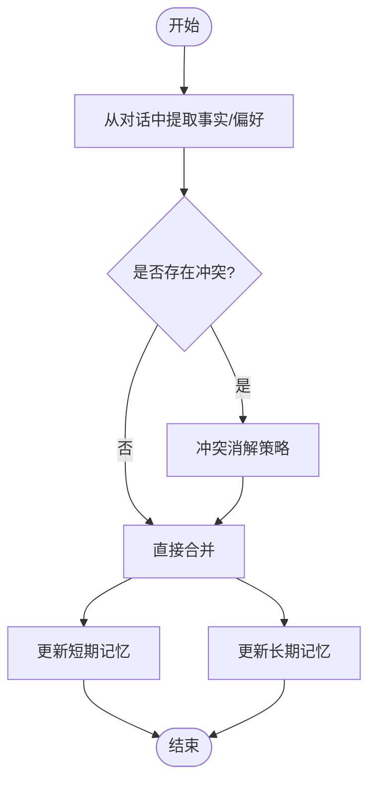

图表来源
- [manager.py:1-200](file://backend_design/nexus/memory/manager.py#L1-L200)
- [conflict.py:1-200](file://backend_design/nexus/memory/conflict.py#L1-L200)

章节来源
- [manager.py:1-200](file://backend_design/nexus/memory/manager.py#L1-L200)
- [conflict.py:1-200](file://backend_design/nexus/memory/conflict.py#L1-L200)

### 个性化回复生成
- 用户画像
  - 包含偏好、习惯、健康指标、车辆设置等维度。
- 动态调整
  - 根据当前情境（时间、位置、情绪）与用户画像，调整语气、风格与内容推荐。
- 提示词注入
  - 将个性化信息注入提示词，使 LLM 输出更贴合用户期望。

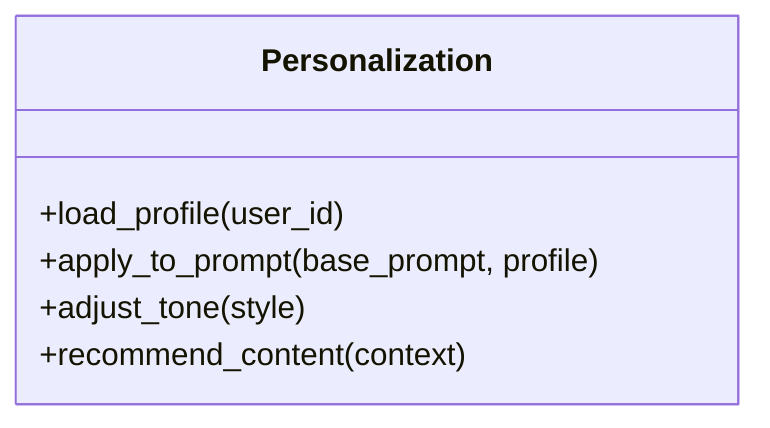

图表来源
- [personalization.py:1-200](file://backend_design/nexus/core/personalization.py#L1-L200)

章节来源
- [personalization.py:1-200](file://backend_design/nexus/core/personalization.py#L1-L200)

### 提示词工程与响应生成
- 提示词模板
  - 聊天主提示词、澄清提示词、记忆提取提示词、车辆相关提示词等。
- 组装策略
  - 按角色分层（系统、助手、用户），注入上下文、检索结果与个性化信息。
- 响应构建
  - 支持纯文本、结构化数据与动作指令，便于前端渲染与后续执行。

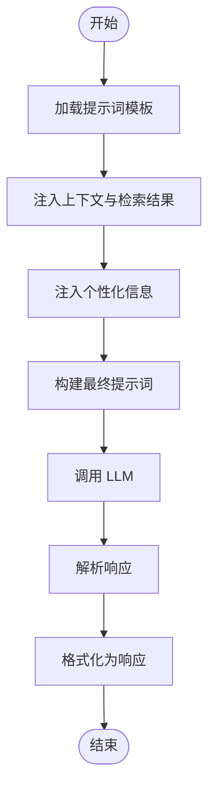

图表来源
- [chat.md:1-200](file://backend_design/nexus/prompts/chat.md#L1-L200)
- [clarification.md:1-200](file://backend_design/nexus/prompts/clarification.md#L1-L200)
- [memory_extract.md:1-200](file://backend_design/nexus/prompts/memory_extract.md#L1-L200)
- [vehicle.md:1-200](file://backend_design/nexus/prompts/vehicle.md#L1-L200)
- [responder.py:1-200](file://backend_design/nexus/agent/responder.py#L1-L200)

章节来源
- [chat.md:1-200](file://backend_design/nexus/prompts/chat.md#L1-L200)
- [clarification.md:1-200](file://backend_design/nexus/prompts/clarification.md#L1-L200)
- [memory_extract.md:1-200](file://backend_design/nexus/prompts/memory_extract.md#L1-L200)
- [vehicle.md:1-200](file://backend_design/nexus/prompts/vehicle.md#L1-L200)
- [responder.py:1-200](file://backend_design/nexus/agent/responder.py#L1-L200)

### 技能编排与车辆控制
- 技能注册与编排
  - 通过注册表集中管理技能，编排器根据意图与上下文选择合适技能执行。
- 车辆控制
  - 支持空调、媒体、导航、座椅、状态、车窗等能力，底层通过 HTTP/MCP/Mock 接口访问。
- 安全与幂等
  - 对敏感操作进行权限校验与幂等设计，避免重复执行。

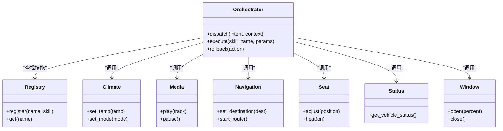

图表来源
- [orchestrator.py:1-200](file://backend_design/nexus/skills/orchestrator.py#L1-L200)
- [registry.py:1-200](file://backend_design/nexus/skills/registry.py#L1-L200)
- [climate.py:1-200](file://backend_design/nexus/skills/vehicle/climate.py#L1-L200)
- [media.py:1-200](file://backend_design/nexus/skills/vehicle/media.py#L1-L200)
- [navigation.py:1-200](file://backend_design/nexus/skills/vehicle/navigation.py#L1-L200)
- [seat.py:1-200](file://backend_design/nexus/skills/vehicle/seat.py#L1-L200)
- [status.py:1-200](file://backend_design/nexus/skills/vehicle/status.py#L1-L200)
- [window.py:1-200](file://backend_design/nexus/skills/vehicle/window.py#L1-L200)

章节来源
- [orchestrator.py:1-200](file://backend_design/nexus/skills/orchestrator.py#L1-L200)
- [registry.py:1-200](file://backend_design/nexus/skills/registry.py#L1-L200)
- [health.py:1-200](file://backend_design/nexus/skills/health.py#L1-L200)
- [habit.py:1-200](file://backend_design/nexus/skills/habit.py#L1-L200)
- [reminder.py:1-200](file://backend_design/nexus/skills/reminder.py#L1-L200)
- [special.py:1-200](file://backend_design/nexus/skills/special.py#L1-L200)
- [http.py:1-200](file://backend_design/nexus/vehicle/http.py#L1-L200)
- [mcp.py:1-200](file://backend_design/nexus/vehicle/mcp.py#L1-L200)
- [mock.py:1-200](file://backend_design/nexus/vehicle/mock.py#L1-L200)
- [gateway.py:1-200](file://backend_design/nexus/mcp/gateway.py#L1-L200)

### API 与 WebSocket 集成
- HTTP 聊天接口
  - 提供 RESTful 接口，支持文本消息、会话 ID、用户 ID 等参数。
- WebSocket 实时通信
  - 支持流式响应与双向通信，适合语音助手与即时反馈场景。
- 鉴权与安全
  - 基于 JWT 的鉴权中间件，确保接口访问安全。

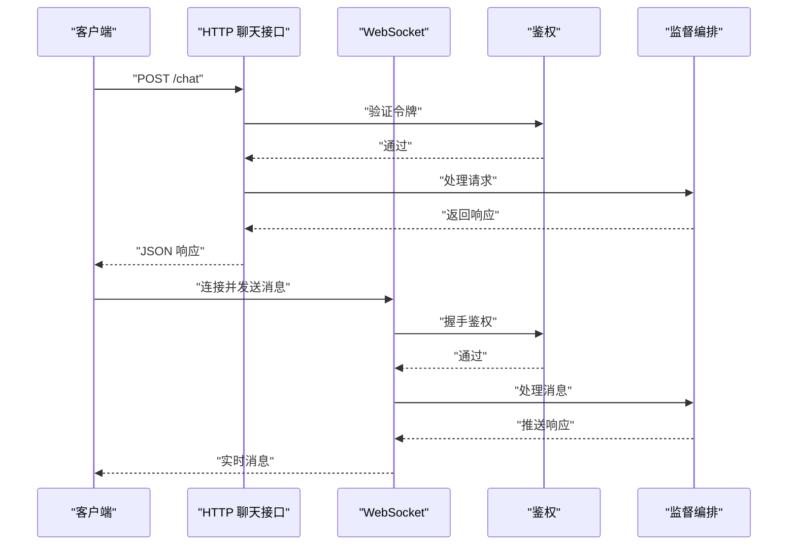

图表来源
- [chat.py:1-200](file://backend_design/nexus/api/chat.py#L1-L200)
- [websocket.py:1-200](file://backend_design/nexus/api/websocket.py#L1-L200)
- [auth.py:1-200](file://backend_design/nexus/api/auth.py#L1-L200)
- [supervisor_graph.py:1-200](file://backend_design/nexus/agent/supervisor_graph.py#L1-L200)

章节来源
- [chat.py:1-200](file://backend_design/nexus/api/chat.py#L1-L200)
- [chat_sessions.py:1-200](file://backend_design/nexus/api/chat_sessions.py#L1-L200)
- [websocket.py:1-200](file://backend_design/nexus/api/websocket.py#L1-L200)
- [auth.py:1-200](file://backend_design/nexus/api/auth.py#L1-L200)
- [schemas.py:1-200](file://backend_design/nexus/models/schemas.py#L1-L200)
- [state.py:1-200](file://backend_design/nexus/models/state.py#L1-L200)

## 依赖关系分析
- 组件耦合
  - 聊天专家强依赖意图路由、检索器、记忆管理器与个性化引擎；弱依赖技能编排与车辆接口。
- 外部依赖
  - 向量/图存储、重排器、嵌入模型、MCP 网关、Redis 缓存、JWT 鉴权等。
- 潜在循环依赖
  - 通过工厂与注册表解耦，降低循环依赖风险。
- 接口契约
  - 统一检索器与技能接口定义清晰，便于替换实现与单元测试。

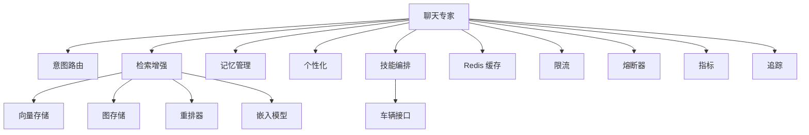

图表来源
- [chat_expert.py:1-200](file://backend_design/nexus/agent/experts/chat_expert.py#L1-L200)
- [llm_router.py:1-200](file://backend_design/nexus/intent/llm_router.py#L1-L200)
- [unified_retriever.py:1-200](file://backend_design/nexus/rag/unified_retriever.py#L1-L200)
- [manager.py:1-200](file://backend_design/nexus/memory/manager.py#L1-L200)
- [personalization.py:1-200](file://backend_design/nexus/core/personalization.py#L1-L200)
- [orchestrator.py:1-200](file://backend_design/nexus/skills/orchestrator.py#L1-L200)
- [http.py:1-200](file://backend_design/nexus/vehicle/http.py#L1-L200)
- [redis_cache.py:1-200](file://backend_design/nexus/middleware/redis_cache.py#L1-L200)
- [rate_limiter.py:1-200](file://backend_design/nexus/middleware/rate_limiter.py#L1-L200)
- [circuit_breaker.py:1-200](file://backend_design/nexus/core/circuit_breaker.py#L1-L200)
- [metrics.py:1-200](file://backend_design/nexus/observability/metrics.py#L1-L200)
- [langfuse.py:1-200](file://backend_design/nexus/observability/langfuse.py#L1-L200)

章节来源
- [chat_expert.py:1-200](file://backend_design/nexus/agent/experts/chat_expert.py#L1-L200)
- [llm_router.py:1-200](file://backend_design/nexus/intent/llm_router.py#L1-L200)
- [unified_retriever.py:1-200](file://backend_design/nexus/rag/unified_retriever.py#L1-L200)
- [manager.py:1-200](file://backend_design/nexus/memory/manager.py#L1-L200)
- [personalization.py:1-200](file://backend_design/nexus/core/personalization.py#L1-L200)
- [orchestrator.py:1-200](file://backend_design/nexus/skills/orchestrator.py#L1-L200)
- [http.py:1-200](file://backend_design/nexus/vehicle/http.py#L1-L200)
- [redis_cache.py:1-200](file://backend_design/nexus/middleware/redis_cache.py#L1-L200)
- [rate_limiter.py:1-200](file://backend_design/nexus/middleware/rate_limiter.py#L1-L200)
- [circuit_breaker.py:1-200](file://backend_design/nexus/core/circuit_breaker.py#L1-L200)
- [metrics.py:1-200](file://backend_design/nexus/observability/metrics.py#L1-L200)
- [langfuse.py:1-200](file://backend_design/nexus/observability/langfuse.py#L1-L200)

## 性能考虑
- 并发与吞吐
  - 使用异步 I/O 与连接池，合理设置线程/进程数，避免阻塞。
- 缓存策略
  - 热点问答与检索结果缓存至 Redis，减少重复计算与外部调用。
- 检索优化
  - 向量索引优化、分片与预取；重排器批量处理，降低延迟。
- LLM 调用优化
  - 超时与重试策略、熔断与降级、流式输出与增量渲染。
- 监控与告警
  - 指标采集（QPS、延迟、错误率）、分布式追踪与日志聚合，及时发现问题。

[本节为通用性能建议，不直接分析具体文件]

## 故障排查指南
- 常见问题
  - LLM 不可用：检查熔断器状态与降级策略，查看重试与超时配置。
  - 检索失败：确认向量/图存储连通性与索引状态，检查重排器配置。
  - 记忆冲突：查看冲突消解日志，评估合并策略是否合理。
  - 技能执行失败：核对权限与幂等设计，检查车辆接口可达性。
- 诊断工具
  - 指标面板与 Langfuse 追踪，定位慢调用与错误分支。
  - 日志级别与采样策略，平衡性能与可观测性。
- 恢复机制
  - 熔断自动恢复、缓存失效重建、任务队列重试与死信处理。

章节来源
- [circuit_breaker.py:1-200](file://backend_design/nexus/core/circuit_breaker.py#L1-L200)
- [exceptions.py:1-200](file://backend_design/nexus/core/exceptions.py#L1-L200)
- [logger.py:1-200](file://backend_design/nexus/core/logger.py#L1-L200)
- [metrics.py:1-200](file://backend_design/nexus/observability/metrics.py#L1-L200)
- [cockpit_metrics.py:1-200](file://backend_design/nexus/observability/cockpit_metrics.py#L1-L200)
- [langfuse.py:1-200](file://backend_design/nexus/observability/langfuse.py#L1-L200)

## 结论
聊天专家通过意图识别、检索增强、提示词工程、技能编排与记忆管理的协同，实现了高质量的自然语言对话体验。借助工厂与注册表的可扩展设计，以及完善的可观测性与稳定性保障，系统具备良好的性能与可维护性。建议在生产环境持续优化检索与 LLM 调用策略，完善个性化与记忆合并算法，以提升用户体验与系统可靠性。

[本节为总结性内容，不直接分析具体文件]

## 附录
- 配置项参考
  - LLM 集成：模型名称、密钥、超时、重试次数、温度与最大生成长度等。
  - 检索增强：向量/图存储连接、重排器开关与阈值、嵌入模型选择。
  - 记忆管理：短期记忆窗口、长期记忆容量、冲突消解策略。
  - 个性化：风格与语气参数、推荐权重。
  - 中间件：缓存 TTL、限流阈值、熔断阈值。
- 代码示例路径
  - 聊天接口调用示例：[chat.py](file://backend_design/nexus/api/chat.py)
  - WebSocket 实时对话示例：[websocket.py](file://backend_design/nexus/api/websocket.py)
  - 意图路由与启发式规则示例：[llm_router.py](file://backend_design/nexus/intent/llm_router.py)、[heuristic.py](file://backend_design/nexus/intent/heuristic.py)
  - 检索增强示例：[unified_retriever.py](file://backend_design/nexus/rag/unified_retriever.py)
  - 记忆管理示例：[manager.py](file://backend_design/nexus/memory/manager.py)
  - 个性化示例：[personalization.py](file://backend_design/nexus/core/personalization.py)
  - 技能编排示例：[orchestrator.py](file://backend_design/nexus/skills/orchestrator.py)
  - 车辆控制示例：[http.py](file://backend_design/nexus/vehicle/http.py)、[mcp.py](file://backend_design/nexus/vehicle/mcp.py)
  - 提示词模板：[chat.md](file://backend_design/nexus/prompts/chat.md)、[clarification.md](file://backend_design/nexus/prompts/clarification.md)、[memory_extract.md](file://backend_design/nexus/prompts/memory_extract.md)、[vehicle.md](file://backend_design/nexus/prompts/vehicle.md)
  - 全局配置入口：[config.py](file://backend_design/nexus/config.py)

章节来源
- [chat.py:1-200](file://backend_design/nexus/api/chat.py#L1-L200)
- [websocket.py:1-200](file://backend_design/nexus/api/websocket.py#L1-L200)
- [llm_router.py:1-200](file://backend_design/nexus/intent/llm_router.py#L1-L200)
- [heuristic.py:1-200](file://backend_design/nexus/intent/heuristic.py#L1-L200)
- [unified_retriever.py:1-200](file://backend_design/nexus/rag/unified_retriever.py#L1-L200)
- [manager.py:1-200](file://backend_design/nexus/memory/manager.py#L1-L200)
- [personalization.py:1-200](file://backend_design/nexus/core/personalization.py#L1-L200)
- [orchestrator.py:1-200](file://backend_design/nexus/skills/orchestrator.py#L1-L200)
- [http.py:1-200](file://backend_design/nexus/vehicle/http.py#L1-L200)
- [mcp.py:1-200](file://backend_design/nexus/vehicle/mcp.py#L1-L200)
- [chat.md:1-200](file://backend_design/nexus/prompts/chat.md#L1-L200)
- [clarification.md:1-200](file://backend_design/nexus/prompts/clarification.md#L1-L200)
- [memory_extract.md:1-200](file://backend_design/nexus/prompts/memory_extract.md#L1-L200)
- [vehicle.md:1-200](file://backend_design/nexus/prompts/vehicle.md#L1-L200)
- [config.py:1-200](file://backend_design/nexus/config.py#L1-L200)