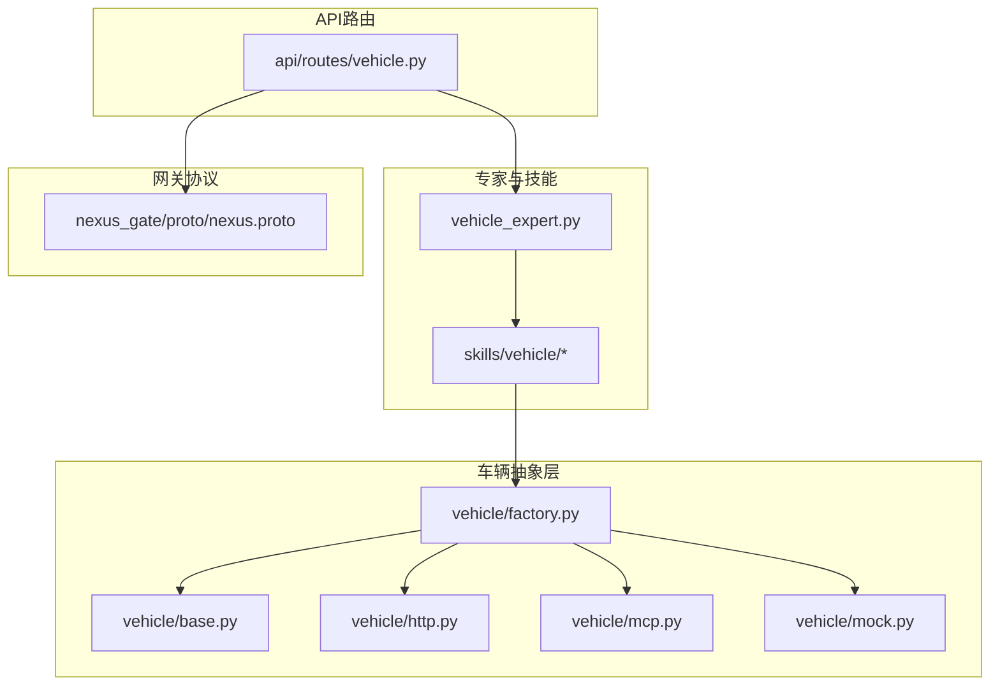
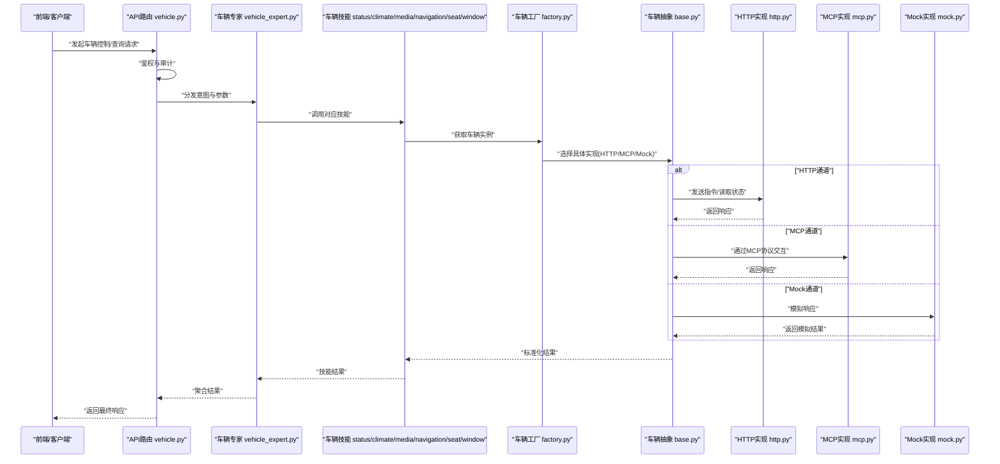
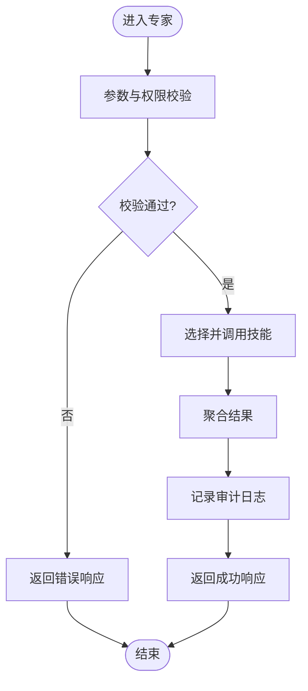
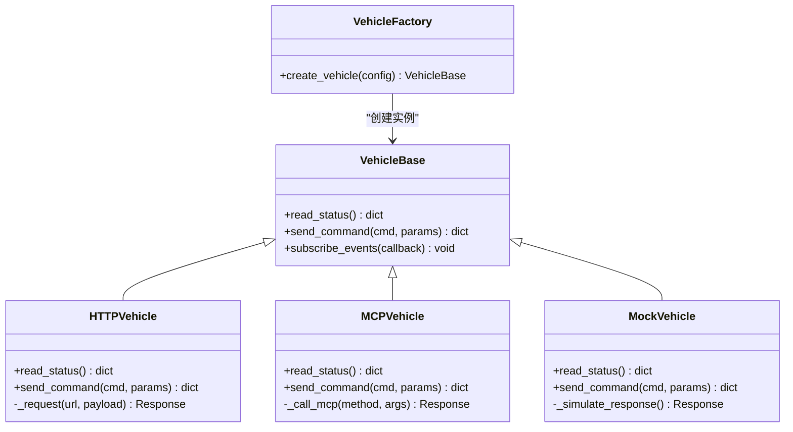
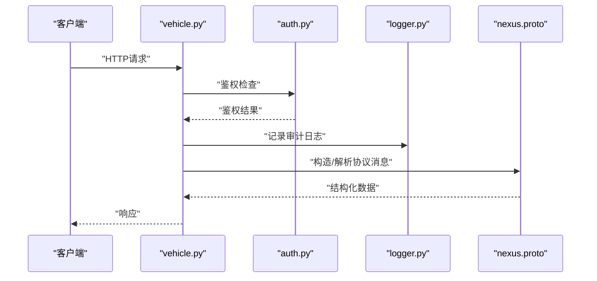
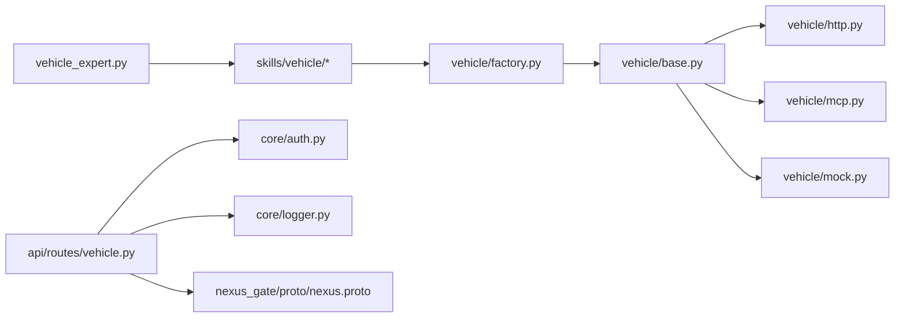

# 车辆专家

<cite>
**本文引用的文件**   
- [vehicle_expert.py](file://backend_design/nexus/agent/experts/vehicle_expert.py)
- [base.py](file://backend_design/nexus/agent/experts/base.py)
- [vehicle.py](file://backend_design/nexus/api/routes/vehicle.py)
- [http.py](file://backend_design/nexus/vehicle/http.py)
- [mcp.py](file://backend_design/nexus/vehicle/mcp.py)
- [mock.py](file://backend_design/nexus/vehicle/mock.py)
- [factory.py](file://backend_design/nexus/vehicle/factory.py)
- [base.py](file://backend_design/nexus/vehicle/base.py)
- [status.py](file://backend_design/nexus/skills/vehicle/status.py)
- [climate.py](file://backend_design/nexus/skills/vehicle/climate.py)
- [media.py](file://backend_design/nexus/skills/vehicle/media.py)
- [navigation.py](file://backend_design/nexus/skills/vehicle/navigation.py)
- [seat.py](file://backend_design/nexus/skills/vehicle/seat.py)
- [window.py](file://backend_design/nexus/skills/vehicle/window.py)
- [auth.py](file://backend_design/nexus/core/auth.py)
- [exceptions.py](file://backend_design/nexus/core/exceptions.py)
- [logger.py](file://backend_design/nexus/core/logger.py)
- [cockpit_manager.py](file://backend_design/nexus/core/cockpit_manager.py)
- [nexus.proto](file://backend_design/nexus_gate/proto/nexus.proto)
</cite>

## 目录
1. [简介](#简介)
2. [项目结构](#项目结构)
3. [核心组件](#核心组件)
4. [架构总览](#架构总览)
5. [详细组件分析](#详细组件分析)
6. [依赖关系分析](#依赖关系分析)
7. [性能考量](#性能考量)
8. [故障排查指南](#故障排查指南)
9. [结论](#结论)
10. [附录](#附录)

## 简介
本技术文档面向NexusCockpit的“车辆专家”能力，聚焦于车载设备控制、状态监控、远程控制指令与安全验证机制。文档从系统架构、数据流与处理逻辑出发，深入解析车辆协议解析、指令序列化与状态同步策略；同时覆盖与车辆CAN总线或网络接口的通信方式、数据格式定义以及错误恢复策略。此外，提供安全配置、权限控制与操作审计的最佳实践，并给出端到端的实现示例路径，帮助开发者快速集成与扩展。

## 项目结构
围绕“车辆专家”的核心代码主要分布在以下模块：
- 专家层：负责意图识别后的任务编排与技能调用
- 技能层：封装具体车辆功能（状态、空调、媒体、导航、座椅、车窗等）
- 车辆抽象层：统一对外暴露车辆接口，屏蔽底层通信差异（HTTP/MCP/Mock）
- API路由层：将外部请求映射到专家与技能执行流程
- 网关协议：定义前后端与服务间通信的协议结构

图表来源
- [vehicle_expert.py:1-200](file://backend_design/nexus/agent/experts/vehicle_expert.py#L1-L200)
- [status.py:1-200](file://backend_design/nexus/skills/vehicle/status.py#L1-L200)
- [factory.py:1-200](file://backend_design/nexus/vehicle/factory.py#L1-L200)
- [http.py:1-200](file://backend_design/nexus/vehicle/http.py#L1-L200)
- [mcp.py:1-200](file://backend_design/nexus/vehicle/mcp.py#L1-L200)
- [mock.py:1-200](file://backend_design/nexus/vehicle/mock.py#L1-L200)
- [vehicle.py:1-200](file://backend_design/nexus/api/routes/vehicle.py#L1-L200)
- [nexus.proto:1-200](file://backend_design/nexus_gate/proto/nexus.proto#L1-L200)

章节来源
- [vehicle_expert.py:1-200](file://backend_design/nexus/agent/experts/vehicle_expert.py#L1-L200)
- [vehicle.py:1-200](file://backend_design/nexus/api/routes/vehicle.py#L1-L200)
- [factory.py:1-200](file://backend_design/nexus/vehicle/factory.py#L1-L200)
- [http.py:1-200](file://backend_design/nexus/vehicle/http.py#L1-L200)
- [mcp.py:1-200](file://backend_design/nexus/vehicle/mcp.py#L1-L200)
- [mock.py:1-200](file://backend_design/nexus/vehicle/mock.py#L1-L200)
- [nexus.proto:1-200](file://backend_design/nexus_gate/proto/nexus.proto#L1-L200)

## 核心组件
- 车辆专家（Vehicle Expert）：承接上层意图，协调多技能完成车辆控制任务，负责参数校验、结果聚合与异常处理。
- 车辆技能集（Skills）：按领域划分的具体能力，如状态查询、空调控制、媒体播放、导航设置、座椅调节、车窗控制等。
- 车辆抽象层（Vehicle Abstraction）：通过工厂模式选择具体实现（HTTP/MCP/Mock），统一接口，屏蔽底层差异。
- API路由（Vehicle Routes）：暴露REST/WebSocket接口，承载鉴权、限流、日志与审计。
- 网关协议（Gateway Protocol）：定义跨服务消息结构，用于前后端与后端服务之间的稳定通信。

章节来源
- [vehicle_expert.py:1-200](file://backend_design/nexus/agent/experts/vehicle_expert.py#L1-L200)
- [status.py:1-200](file://backend_design/nexus/skills/vehicle/status.py#L1-L200)
- [climate.py:1-200](file://backend_design/nexus/skills/vehicle/climate.py#L1-L200)
- [media.py:1-200](file://backend_design/nexus/skills/vehicle/media.py#L1-L200)
- [navigation.py:1-200](file://backend_design/nexus/skills/vehicle/navigation.py#L1-L200)
- [seat.py:1-200](file://backend_design/nexus/skills/vehicle/seat.py#L1-L200)
- [window.py:1-200](file://backend_design/nexus/skills/vehicle/window.py#L1-L200)
- [factory.py:1-200](file://backend_design/nexus/vehicle/factory.py#L1-L200)
- [http.py:1-200](file://backend_design/nexus/vehicle/http.py#L1-L200)
- [mcp.py:1-200](file://backend_design/nexus/vehicle/mcp.py#L1-L200)
- [mock.py:1-200](file://backend_design/nexus/vehicle/mock.py#L1-L200)
- [vehicle.py:1-200](file://backend_design/nexus/api/routes/vehicle.py#L1-L200)

## 架构总览
下图展示了从前端请求到车辆控制的完整链路，包括鉴权、专家调度、技能执行、车辆抽象层选择与底层通信。

图表来源
- [vehicle.py:1-200](file://backend_design/nexus/api/routes/vehicle.py#L1-L200)
- [vehicle_expert.py:1-200](file://backend_design/nexus/agent/experts/vehicle_expert.py#L1-L200)
- [factory.py:1-200](file://backend_design/nexus/vehicle/factory.py#L1-L200)
- [base.py:1-200](file://backend_design/nexus/vehicle/base.py#L1-L200)
- [http.py:1-200](file://backend_design/nexus/vehicle/http.py#L1-L200)
- [mcp.py:1-200](file://backend_design/nexus/vehicle/mcp.py#L1-L200)
- [mock.py:1-200](file://backend_design/nexus/vehicle/mock.py#L1-L200)

## 详细组件分析

### 车辆专家（Vehicle Expert）
职责与行为
- 接收来自API的请求，进行参数校验与上下文构建
- 根据意图选择并编排相应技能（状态、空调、媒体、导航、座椅、车窗）
- 对多技能结果进行聚合、格式化与异常处理
- 记录关键操作日志，便于审计与排障

典型流程
- 输入校验：检查用户身份、权限、参数范围
- 技能调度：按领域分派到对应技能
- 结果聚合：合并各技能输出，形成统一响应
- 异常处理：捕获并转换异常为可解释的错误码与消息

图表来源
- [vehicle_expert.py:1-200](file://backend_design/nexus/agent/experts/vehicle_expert.py#L1-L200)

章节来源
- [vehicle_expert.py:1-200](file://backend_design/nexus/agent/experts/vehicle_expert.py#L1-L200)

### 车辆技能集（Skills）
- 状态技能（status.py）：负责读取车辆基础状态（电量、里程、车门锁、车窗状态等）
- 空调技能（climate.py）：温度设定、风量、风向、自动模式等
- 媒体技能（media.py）：播放控制、音量、切歌、列表管理
- 导航技能（navigation.py）：目的地设置、路线偏好、实时路况
- 座椅技能（seat.py）：位置、加热、通风、记忆位
- 车窗技能（window.py）：开合控制、防夹保护、联动逻辑

设计要点
- 每个技能独立封装业务逻辑，保持高内聚低耦合
- 通过统一的车辆抽象层访问底层能力，避免直接依赖具体通信实现
- 支持幂等性设计与重试策略，提升稳定性

章节来源
- [status.py:1-200](file://backend_design/nexus/skills/vehicle/status.py#L1-L200)
- [climate.py:1-200](file://backend_design/nexus/skills/vehicle/climate.py#L1-L200)
- [media.py:1-200](file://backend_design/nexus/skills/vehicle/media.py#L1-L200)
- [navigation.py:1-200](file://backend_design/nexus/skills/vehicle/navigation.py#L1-L200)
- [seat.py:1-200](file://backend_design/nexus/skills/vehicle/seat.py#L1-L200)
- [window.py:1-200](file://backend_design/nexus/skills/vehicle/window.py#L1-L200)

### 车辆抽象层与工厂（Vehicle Abstraction & Factory）
- 抽象基类（base.py）：定义统一接口（状态读取、指令下发、事件订阅等）
- 工厂（factory.py）：根据配置选择具体实现（HTTP/MCP/Mock）
- HTTP实现（http.py）：基于HTTP协议与车机或云端服务交互
- MCP实现（mcp.py）：基于MCP协议进行服务间通信
- Mock实现（mock.py）：开发测试阶段的模拟实现

图表来源
- [base.py:1-200](file://backend_design/nexus/vehicle/base.py#L1-L200)
- [factory.py:1-200](file://backend_design/nexus/vehicle/factory.py#L1-L200)
- [http.py:1-200](file://backend_design/nexus/vehicle/http.py#L1-L200)
- [mcp.py:1-200](file://backend_design/nexus/vehicle/mcp.py#L1-L200)
- [mock.py:1-200](file://backend_design/nexus/vehicle/mock.py#L1-L200)

章节来源
- [base.py:1-200](file://backend_design/nexus/vehicle/base.py#L1-L200)
- [factory.py:1-200](file://backend_design/nexus/vehicle/factory.py#L1-L200)
- [http.py:1-200](file://backend_design/nexus/vehicle/http.py#L1-L200)
- [mcp.py:1-200](file://backend_design/nexus/vehicle/mcp.py#L1-L200)
- [mock.py:1-200](file://backend_design/nexus/vehicle/mock.py#L1-L200)

### API路由与网关协议（Routes & Gateway Protocol）
- API路由（vehicle.py）：提供REST接口，承载鉴权、限流、日志与审计
- 网关协议（nexus.proto）：定义跨服务消息结构，确保前后端与后端服务的稳定通信

图表来源
- [vehicle.py:1-200](file://backend_design/nexus/api/routes/vehicle.py#L1-L200)
- [auth.py:1-200](file://backend_design/nexus/core/auth.py#L1-L200)
- [logger.py:1-200](file://backend_design/nexus/core/logger.py#L1-L200)
- [nexus.proto:1-200](file://backend_design/nexus_gate/proto/nexus.proto#L1-L200)

章节来源
- [vehicle.py:1-200](file://backend_design/nexus/api/routes/vehicle.py#L1-L200)
- [auth.py:1-200](file://backend_design/nexus/core/auth.py#L1-L200)
- [logger.py:1-200](file://backend_design/nexus/core/logger.py#L1-L200)
- [nexus.proto:1-200](file://backend_design/nexus_gate/proto/nexus.proto#L1-L200)

## 依赖关系分析
- 专家层依赖技能层，技能层依赖车辆抽象层
- 车辆抽象层通过工厂模式动态选择具体实现
- API路由层依赖鉴权、日志与网关协议
- 整体呈现分层清晰、松耦合的结构，便于扩展与维护

图表来源
- [vehicle_expert.py:1-200](file://backend_design/nexus/agent/experts/vehicle_expert.py#L1-L200)
- [factory.py:1-200](file://backend_design/nexus/vehicle/factory.py#L1-L200)
- [base.py:1-200](file://backend_design/nexus/vehicle/base.py#L1-L200)
- [http.py:1-200](file://backend_design/nexus/vehicle/http.py#L1-L200)
- [mcp.py:1-200](file://backend_design/nexus/vehicle/mcp.py#L1-L200)
- [mock.py:1-200](file://backend_design/nexus/vehicle/mock.py#L1-L200)
- [vehicle.py:1-200](file://backend_design/nexus/api/routes/vehicle.py#L1-L200)
- [auth.py:1-200](file://backend_design/nexus/core/auth.py#L1-L200)
- [logger.py:1-200](file://backend_design/nexus/core/logger.py#L1-L200)
- [nexus.proto:1-200](file://backend_design/nexus_gate/proto/nexus.proto#L1-L200)

章节来源
- [vehicle_expert.py:1-200](file://backend_design/nexus/agent/experts/vehicle_expert.py#L1-L200)
- [factory.py:1-200](file://backend_design/nexus/vehicle/factory.py#L1-L200)
- [vehicle.py:1-200](file://backend_design/nexus/api/routes/vehicle.py#L1-L200)

## 性能考量
- 连接复用：HTTP实现应启用连接池与超时控制，减少握手开销
- 异步处理：对于耗时操作（如导航计算、媒体加载）采用异步或队列化
- 缓存策略：对低频变化的状态（如车辆基本信息）进行短期缓存
- 降级与熔断：在底层服务不可用时，回退到Mock或只读模式
- 批量操作：合并多个小指令为一次批量请求，降低网络往返

[本节为通用指导，不直接分析具体文件]

## 故障排查指南
常见问题与定位方法
- 鉴权失败：检查token有效性、权限范围与租户上下文
- 通信异常：查看HTTP/MCP调用的错误码与重试次数
- 指令未生效：核对参数合法性、车辆状态约束与幂等性
- 日志缺失：确认审计日志是否写入，检查日志级别与输出目标

建议步骤
- 使用统一异常类型与错误码，便于前端展示与自动化处理
- 在关键路径增加埋点与指标上报，结合Grafana/Prometheus观察
- 利用Mock实现进行回归测试与混沌工程演练

章节来源
- [auth.py:1-200](file://backend_design/nexus/core/auth.py#L1-L200)
- [exceptions.py:1-200](file://backend_design/nexus/core/exceptions.py#L1-L200)
- [logger.py:1-200](file://backend_design/nexus/core/logger.py#L1-L200)
- [cockpit_manager.py:1-200](file://backend_design/nexus/core/cockpit_manager.py#L1-L200)

## 结论
车辆专家通过清晰的层次化设计与模块化拆分，实现了可扩展、可维护的车载设备控制能力。借助工厂模式与统一抽象，系统能够灵活适配多种通信协议与实现；配合完善的鉴权、日志与异常处理机制，保障了安全性与稳定性。建议在后续迭代中持续完善指标观测、自动化测试与灰度发布策略，进一步提升系统的可靠性与用户体验。

[本节为总结性内容，不直接分析具体文件]

## 附录
- 实现示例路径参考
  - 专家调度与技能编排：[vehicle_expert.py](file://backend_design/nexus/agent/experts/vehicle_expert.py)
  - 状态读取与指令下发：[status.py](file://backend_design/nexus/skills/vehicle/status.py)、[climate.py](file://backend_design/nexus/skills/vehicle/climate.py)
  - 车辆抽象与工厂：[base.py](file://backend_design/nexus/vehicle/base.py)、[factory.py](file://backend_design/nexus/vehicle/factory.py)
  - HTTP/MCP/Mock实现：[http.py](file://backend_design/nexus/vehicle/http.py)、[mcp.py](file://backend_design/nexus/vehicle/mcp.py)、[mock.py](file://backend_design/nexus/vehicle/mock.py)
  - API路由与鉴权：[vehicle.py](file://backend_design/nexus/api/routes/vehicle.py)、[auth.py](file://backend_design/nexus/core/auth.py)
  - 网关协议定义：[nexus.proto](file://backend_design/nexus_gate/proto/nexus.proto)

[本节为索引信息，不直接分析具体文件]