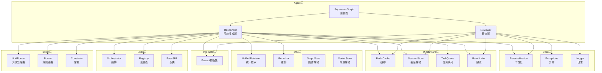
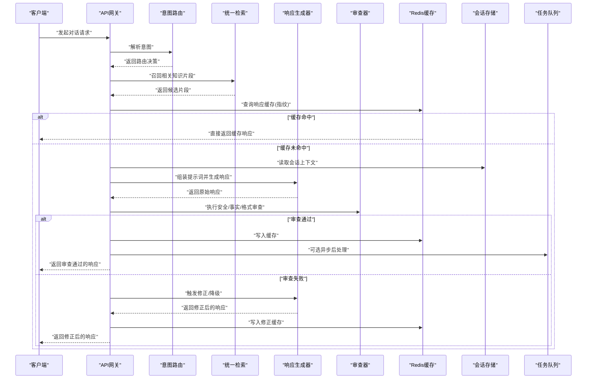
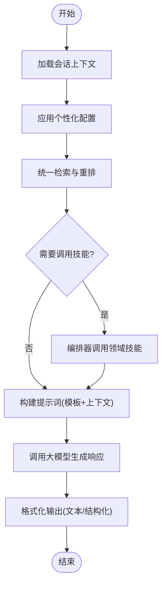
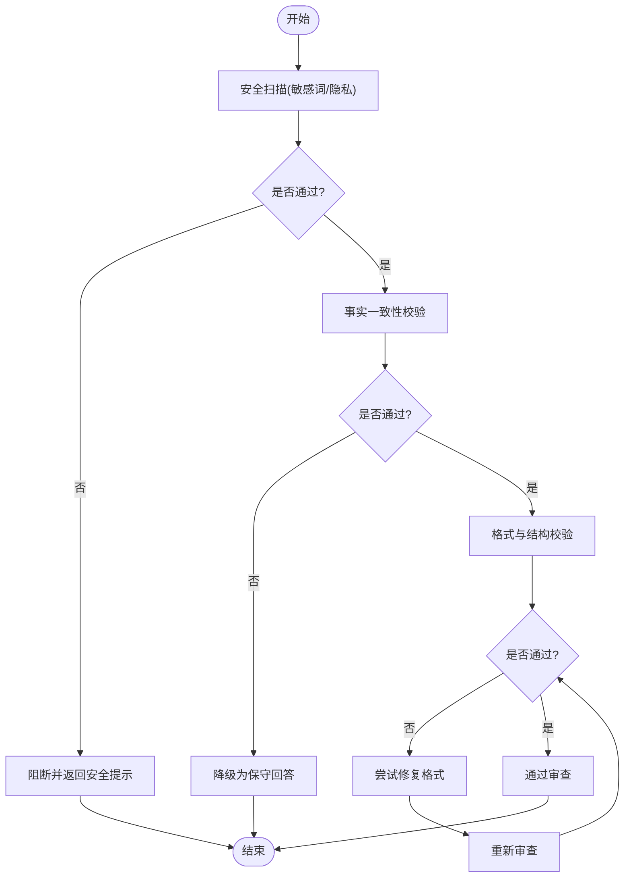
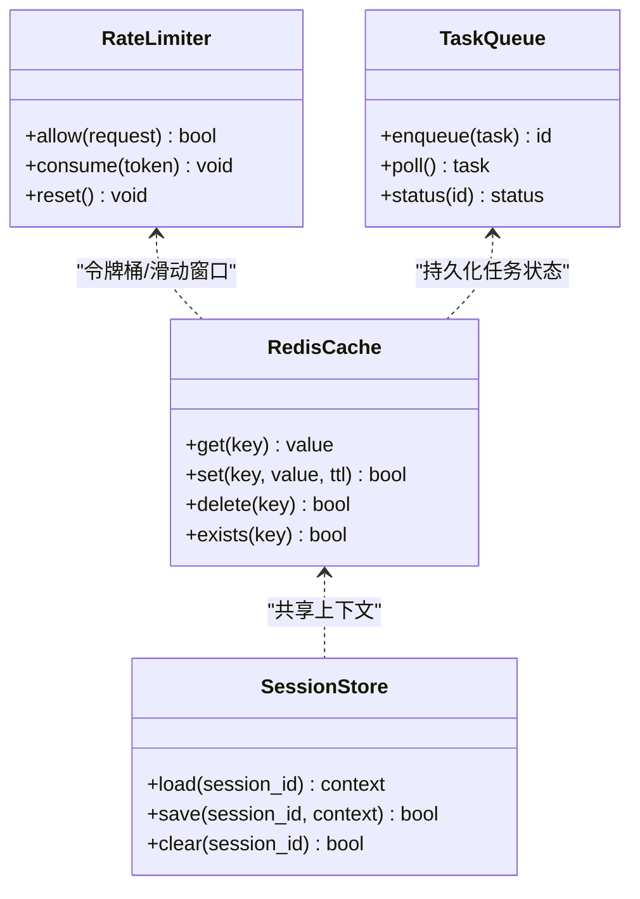
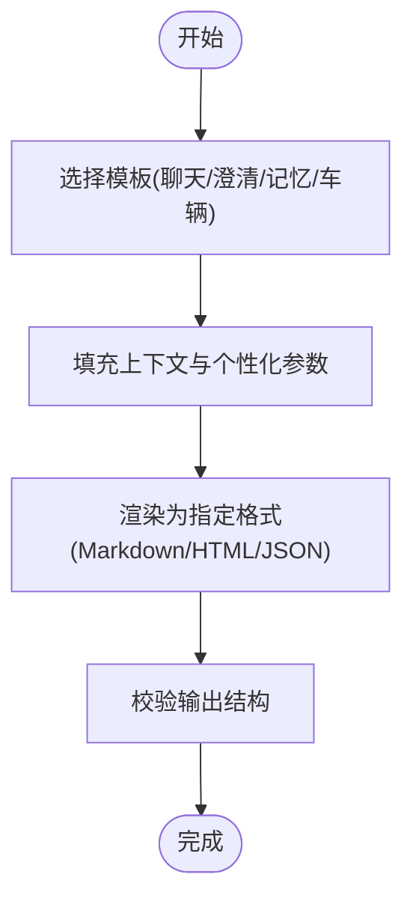
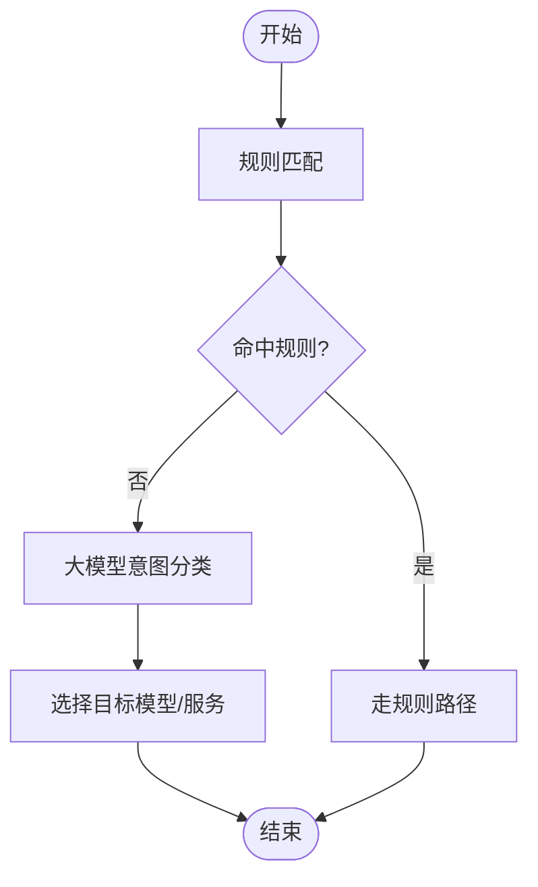
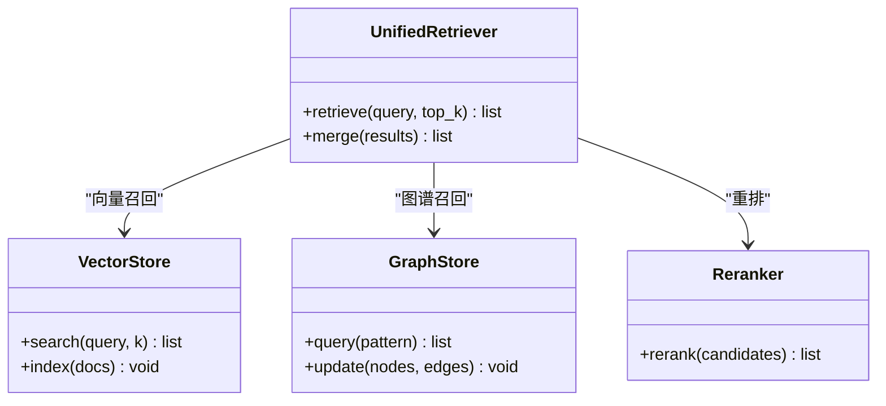
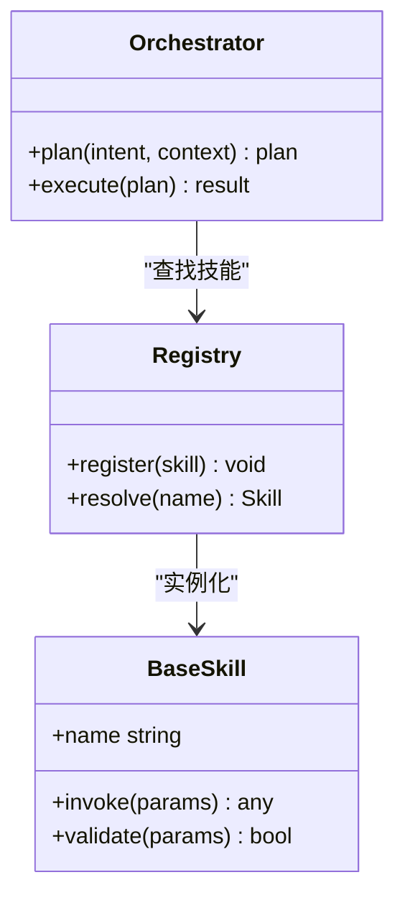
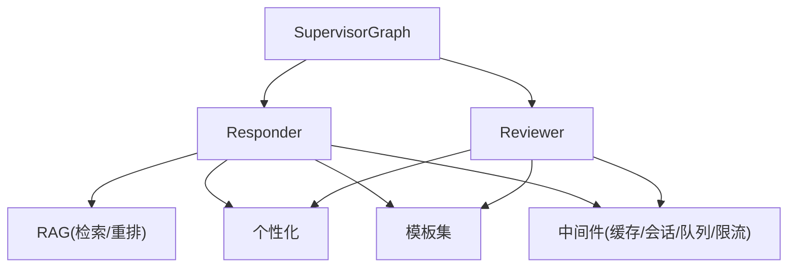

# 响应生成与审查

<cite>
**本文引用的文件**   
- [responder.py](file://backend_design/nexus/agent/responder.py)
- [reviewer.py](file://backend_design/nexus/agent/reviewer.py)
- [supervisor_graph.py](file://backend_design/nexus/agent/supervisor_graph.py)
- [personalization.py](file://backend_design/nexus/core/personalization.py)
- [redis_cache.py](file://backend_design/nexus/middleware/redis_cache.py)
- [cockpit_manager.py](file://backend_design/nexus/core/cockpit_manager.py)
- [chat.md](file://backend_design/nexus/prompts/chat.md)
- [clarification.md](file://backend_design/nexus/prompts/clarification.md)
- [memory_extract.md](file://backend_design/nexus/prompts/memory_extract.md)
- [vehicle.md](file://backend_design/nexus/prompts/vehicle.md)
- [unified_retriever.py](file://backend_design/nexus/rag/unified_retriever.py)
- [reranker.py](file://backend_design/nexus/rag/reranker.py)
- [graph_store.py](file://backend_design/nexus/rag/graph_store.py)
- [vector_store.py](file://backend_design/nexus/rag/vector_store.py)
- [orchestrator.py](file://backend_design/nexus/skills/orchestrator.py)
- [registry.py](file://backend_design/nexus/skills/registry.py)
- [base.py](file://backend_design/nexus/skills/base.py)
- [llm_router.py](file://backend_design/nexus/intent/llm_router.py)
- [router.py](file://backend_design/nexus/intent/router.py)
- [constants.py](file://backend_design/nexus/intent/constants.py)
- [session_store.py](file://backend_design/nexus/middleware/session_store.py)
- [task_queue.py](file://backend_design/nexus/middleware/task_queue.py)
- [rate_limiter.py](file://backend_design/nexus/middleware/rate_limiter.py)
- [exceptions.py](file://backend_design/nexus/core/exceptions.py)
- [logger.py](file://backend_design/nexus/core/logger.py)
</cite>

## 目录
1. [简介](#简介)
2. [项目结构](#项目结构)
3. [核心组件](#核心组件)
4. [架构总览](#架构总览)
5. [详细组件分析](#详细组件分析)
6. [依赖关系分析](#依赖关系分析)
7. [性能考虑](#性能考虑)
8. [故障排查指南](#故障排查指南)
9. [结论](#结论)
10. [附录](#附录)

## 简介
本技术文档聚焦于NexusCockpit AI Agent系统中的“响应生成与审查”模块，围绕以下目标展开：
- 深入解释响应生成器（Responder）的工作原理，包括多源信息整合、格式化与个性化定制。
- 详细说明审查器（Reviewer）的质量保证机制，涵盖内容安全检查、事实验证与格式校验。
- 介绍响应缓存策略与性能优化技术。
- 提供响应模板系统与自定义渲染器的使用方法。
- 给出响应生成流程图与质量检查清单，确保输出内容的准确性与安全性。

## 项目结构
与响应生成与审查相关的代码主要分布在以下目录与文件中：
- agent层：负责编排与执行响应生成与审查流程
- core层：提供个性化、异常与日志等基础能力
- middleware层：提供会话、任务队列、限流与缓存等通用中间件
- rag层：统一检索与重排，支撑事实性增强
- prompts层：管理提示词模板
- skills层：技能编排与注册，扩展领域能力
- intent层：意图识别与路由，决定调用路径

图表来源
- [responder.py:1-200](file://backend_design/nexus/agent/responder.py#L1-L200)
- [reviewer.py:1-200](file://backend_design/nexus/agent/reviewer.py#L1-L200)
- [supervisor_graph.py:1-200](file://backend_design/nexus/agent/supervisor_graph.py#L1-L200)
- [personalization.py:1-200](file://backend_design/nexus/core/personalization.py#L1-L200)
- [redis_cache.py:1-200](file://backend_design/nexus/middleware/redis_cache.py#L1-L200)
- [session_store.py:1-200](file://backend_design/nexus/middleware/session_store.py#L1-L200)
- [task_queue.py:1-200](file://backend_design/nexus/middleware/task_queue.py#L1-L200)
- [rate_limiter.py:1-200](file://backend_design/nexus/middleware/rate_limiter.py#L1-L200)
- [unified_retriever.py:1-200](file://backend_design/nexus/rag/unified_retriever.py#L1-L200)
- [reranker.py:1-200](file://backend_design/nexus/rag/reranker.py#L1-L200)
- [graph_store.py:1-200](file://backend_design/nexus/rag/graph_store.py#L1-L200)
- [vector_store.py:1-200](file://backend_design/nexus/rag/vector_store.py#L1-L200)
- [orchestrator.py:1-200](file://backend_design/nexus/skills/orchestrator.py#L1-L200)
- [registry.py:1-200](file://backend_design/nexus/skills/registry.py#L1-L200)
- [base.py:1-200](file://backend_design/nexus/skills/base.py#L1-L200)
- [llm_router.py:1-200](file://backend_design/nexus/intent/llm_router.py#L1-L200)
- [router.py:1-200](file://backend_design/nexus/intent/router.py#L1-L200)
- [constants.py:1-200](file://backend_design/nexus/intent/constants.py#L1-L200)

章节来源
- [responder.py:1-200](file://backend_design/nexus/agent/responder.py#L1-L200)
- [reviewer.py:1-200](file://backend_design/nexus/agent/reviewer.py#L1-L200)
- [supervisor_graph.py:1-200](file://backend_design/nexus/agent/supervisor_graph.py#L1-L200)

## 核心组件
- 响应生成器（Responder）
  - 职责：聚合用户上下文、会话状态、个性化偏好、检索结果与技能工具，组装提示词并调用大模型，最终生成结构化响应。
  - 关键能力：多源信息整合、模板填充、个性化定制、缓存命中、异步任务编排、限流保护。
- 审查器（Reviewer）
  - 职责：对生成内容进行安全合规检查、事实一致性验证、格式规范校验，必要时触发修正或降级策略。
  - 关键能力：敏感词过滤、事实引用校验、JSON/Markdown结构校验、可观测性记录。
- 监督图（SupervisorGraph）
  - 职责：编排Responder与Reviewer的协作流程，支持重试、回退与熔断。
- 个性化（Personalization）
  - 职责：加载用户画像、历史偏好、语言风格与交互习惯，注入到提示词与输出中。
- 缓存（RedisCache）
  - 职责：基于请求指纹与上下文哈希进行响应缓存，减少重复计算。
- 会话与任务（SessionStore、TaskQueue）
  - 职责：维护对话上下文、长任务排队与进度上报。
- 限流（RateLimiter）
  - 职责：按租户/用户维度限制并发与速率，保障系统稳定性。
- RAG（统一检索与重排）
  - 职责：从向量库与知识图谱中召回相关片段，并进行相关性重排，提升事实性与时效性。
- 技能编排与注册（Orchestrator、Registry、BaseSkill）
  - 职责：定义与注册领域技能，由编排器动态组合调用。
- 意图路由（LLMRouter、Router、Constants）
  - 职责：根据意图选择合适的大模型或规则路径，提高准确率与成本效率。

章节来源
- [responder.py:1-200](file://backend_design/nexus/agent/responder.py#L1-L200)
- [reviewer.py:1-200](file://backend_design/nexus/agent/reviewer.py#L1-L200)
- [supervisor_graph.py:1-200](file://backend_design/nexus/agent/supervisor_graph.py#L1-L200)
- [personalization.py:1-200](file://backend_design/nexus/core/personalization.py#L1-L200)
- [redis_cache.py:1-200](file://backend_design/nexus/middleware/redis_cache.py#L1-L200)
- [session_store.py:1-200](file://backend_design/nexus/middleware/session_store.py#L1-L200)
- [task_queue.py:1-200](file://backend_design/nexus/middleware/task_queue.py#L1-L200)
- [rate_limiter.py:1-200](file://backend_design/nexus/middleware/rate_limiter.py#L1-L200)
- [unified_retriever.py:1-200](file://backend_design/nexus/rag/unified_retriever.py#L1-L200)
- [reranker.py:1-200](file://backend_design/nexus/rag/reranker.py#L1-L200)
- [orchestrator.py:1-200](file://backend_design/nexus/skills/orchestrator.py#L1-L200)
- [registry.py:1-200](file://backend_design/nexus/skills/registry.py#L1-L200)
- [base.py:1-200](file://backend_design/nexus/skills/base.py#L1-L200)
- [llm_router.py:1-200](file://backend_design/nexus/intent/llm_router.py#L1-L200)
- [router.py:1-200](file://backend_design/nexus/intent/router.py#L1-L200)
- [constants.py:1-200](file://backend_design/nexus/intent/constants.py#L1-L200)

## 架构总览
下图展示了从请求进入、意图路由、检索增强、响应生成到审查落盘的端到端流程。

图表来源
- [supervisor_graph.py:1-200](file://backend_design/nexus/agent/supervisor_graph.py#L1-L200)
- [responder.py:1-200](file://backend_design/nexus/agent/responder.py#L1-L200)
- [reviewer.py:1-200](file://backend_design/nexus/agent/reviewer.py#L1-L200)
- [unified_retriever.py:1-200](file://backend_design/nexus/rag/unified_retriever.py#L1-L200)
- [redis_cache.py:1-200](file://backend_design/nexus/middleware/redis_cache.py#L1-L200)
- [session_store.py:1-200](file://backend_design/nexus/middleware/session_store.py#L1-L200)
- [task_queue.py:1-200](file://backend_design/nexus/middleware/task_queue.py#L1-L200)

## 详细组件分析

### 响应生成器（Responder）工作原理
- 多源信息整合
  - 会话上下文：从会话存储读取历史消息、用户画像与当前状态。
  - 个性化偏好：加载用户语言风格、主题偏好与交互习惯。
  - 检索增强：通过统一检索器召回向量与图谱片段，经重排器排序。
  - 技能工具：由编排器按需调用领域技能，获取实时数据或执行操作。
  - 意图路由：依据意图选择合适的大模型或规则路径。
- 格式化与模板
  - 使用提示词模板集（聊天、澄清、记忆抽取、车辆等）进行上下文拼接与指令注入。
  - 将结构化数据（如车辆状态、健康指标）转换为可读文本或标记格式。
- 个性化定制
  - 在提示词中注入用户偏好、称呼、语气与专业度等级。
  - 根据场景调整输出长度、术语密度与示例数量。
- 缓存与异步
  - 基于请求指纹与上下文哈希进行缓存命中判断。
  - 对耗时任务采用任务队列异步处理，前端轮询或WebSocket推送进度。

图表来源
- [responder.py:1-200](file://backend_design/nexus/agent/responder.py#L1-L200)
- [personalization.py:1-200](file://backend_design/nexus/core/personalization.py#L1-L200)
- [unified_retriever.py:1-200](file://backend_design/nexus/rag/unified_retriever.py#L1-L200)
- [reranker.py:1-200](file://backend_design/nexus/rag/reranker.py#L1-L200)
- [orchestrator.py:1-200](file://backend_design/nexus/skills/orchestrator.py#L1-L200)
- [chat.md:1-200](file://backend_design/nexus/prompts/chat.md#L1-L200)
- [clarification.md:1-200](file://backend_design/nexus/prompts/clarification.md#L1-L200)
- [memory_extract.md:1-200](file://backend_design/nexus/prompts/memory_extract.md#L1-L200)
- [vehicle.md:1-200](file://backend_design/nexus/prompts/vehicle.md#L1-L200)

章节来源
- [responder.py:1-200](file://backend_design/nexus/agent/responder.py#L1-L200)
- [personalization.py:1-200](file://backend_design/nexus/core/personalization.py#L1-L200)
- [unified_retriever.py:1-200](file://backend_design/nexus/rag/unified_retriever.py#L1-L200)
- [reranker.py:1-200](file://backend_design/nexus/rag/reranker.py#L1-L200)
- [orchestrator.py:1-200](file://backend_design/nexus/skills/orchestrator.py#L1-L200)
- [chat.md:1-200](file://backend_design/nexus/prompts/chat.md#L1-L200)
- [clarification.md:1-200](file://backend_design/nexus/prompts/clarification.md#L1-L200)
- [memory_extract.md:1-200](file://backend_design/nexus/prompts/memory_extract.md#L1-L200)
- [vehicle.md:1-200](file://backend_design/nexus/prompts/vehicle.md#L1-L200)

### 审查器（Reviewer）质量保证机制
- 内容安全检查
  - 敏感词与违规内容检测，拦截不当表述。
  - 隐私信息脱敏，防止泄露个人身份信息。
- 事实验证
  - 对比检索片段与生成内容的一致性，要求关键断言具备引用来源。
  - 对时间敏感信息进行时效性校验，必要时触发更新或降级。
- 格式校验
  - 校验JSON/Markdown结构完整性，确保下游渲染正确。
  - 字段必填项与类型约束检查，避免空值或错误类型导致崩溃。
- 修正与降级
  - 若审查失败，自动触发修正流程或回退到更保守的模板化回答。
  - 记录审查结果与原因，便于审计与持续改进。

图表来源
- [reviewer.py:1-200](file://backend_design/nexus/agent/reviewer.py#L1-L200)
- [personalization.py:1-200](file://backend_design/nexus/core/personalization.py#L1-L200)
- [unified_retriever.py:1-200](file://backend_design/nexus/rag/unified_retriever.py#L1-L200)
- [reranker.py:1-200](file://backend_design/nexus/rag/reranker.py#L1-L200)

章节来源
- [reviewer.py:1-200](file://backend_design/nexus/agent/reviewer.py#L1-L200)
- [personalization.py:1-200](file://backend_design/nexus/core/personalization.py#L1-L200)
- [unified_retriever.py:1-200](file://backend_design/nexus/rag/unified_retriever.py#L1-L200)
- [reranker.py:1-200](file://backend_design/nexus/rag/reranker.py#L1-L200)

### 响应缓存策略与性能优化
- 缓存键设计
  - 基于请求指纹（用户ID、会话ID、意图、查询摘要）与上下文哈希生成唯一键。
  - 区分不同个性化配置与模板版本，避免跨用户污染。
- 缓存粒度与失效
  - 细粒度缓存单条响应，结合TTL与事件驱动失效（如车辆状态变更）。
  - 对热点问答设置较长TTL，对时效性强的内容缩短TTL。
- 并发与限流
  - 通过限流器控制单位时间内请求数，防止雪崩。
  - 任务队列承载耗时操作，前端轮询或推送进度。
- 监控与可观测性
  - 记录命中率、延迟分布与错误率，辅助容量规划与调优。

图表来源
- [redis_cache.py:1-200](file://backend_design/nexus/middleware/redis_cache.py#L1-L200)
- [rate_limiter.py:1-200](file://backend_design/nexus/middleware/rate_limiter.py#L1-L200)
- [task_queue.py:1-200](file://backend_design/nexus/middleware/task_queue.py#L1-L200)
- [session_store.py:1-200](file://backend_design/nexus/middleware/session_store.py#L1-L200)

章节来源
- [redis_cache.py:1-200](file://backend_design/nexus/middleware/redis_cache.py#L1-L200)
- [rate_limiter.py:1-200](file://backend_design/nexus/middleware/rate_limiter.py#L1-L200)
- [task_queue.py:1-200](file://backend_design/nexus/middleware/task_queue.py#L1-L200)
- [session_store.py:1-200](file://backend_design/nexus/middleware/session_store.py#L1-L200)

### 响应模板系统与自定义渲染器
- 模板系统
  - 聊天模板：用于一般对话与引导式提问。
  - 澄清模板：当意图不明确时，生成追问以缩小范围。
  - 记忆提取模板：从对话中提取长期偏好与事实，供后续个性化使用。
  - 车辆模板：针对车辆状态与控制指令的结构化输出。
- 自定义渲染器
  - 支持将结构化数据渲染为Markdown、HTML或JSON。
  - 可按用户偏好切换语言风格与术语密度。
  - 提供插件接口，允许扩展新的渲染后端。

图表来源
- [chat.md:1-200](file://backend_design/nexus/prompts/chat.md#L1-L200)
- [clarification.md:1-200](file://backend_design/nexus/prompts/clarification.md#L1-L200)
- [memory_extract.md:1-200](file://backend_design/nexus/prompts/memory_extract.md#L1-L200)
- [vehicle.md:1-200](file://backend_design/nexus/prompts/vehicle.md#L1-L200)
- [responder.py:1-200](file://backend_design/nexus/agent/responder.py#L1-L200)

章节来源
- [chat.md:1-200](file://backend_design/nexus/prompts/chat.md#L1-L200)
- [clarification.md:1-200](file://backend_design/nexus/prompts/clarification.md#L1-L200)
- [memory_extract.md:1-200](file://backend_design/nexus/prompts/memory_extract.md#L1-L200)
- [vehicle.md:1-200](file://backend_design/nexus/prompts/vehicle.md#L1-L200)
- [responder.py:1-200](file://backend_design/nexus/agent/responder.py#L1-L200)

### 意图路由与大模型选择
- 规则路由
  - 基于关键词与模式匹配快速决策，适用于高频简单场景。
- 大模型路由
  - 使用轻量模型进行意图分类，再选择合适的大模型或专用路径。
- 常量与策略
  - 集中管理模型列表、阈值与降级策略，便于统一治理。

图表来源
- [router.py:1-200](file://backend_design/nexus/intent/router.py#L1-L200)
- [llm_router.py:1-200](file://backend_design/nexus/intent/llm_router.py#L1-L200)
- [constants.py:1-200](file://backend_design/nexus/intent/constants.py#L1-L200)

章节来源
- [router.py:1-200](file://backend_design/nexus/intent/router.py#L1-L200)
- [llm_router.py:1-200](file://backend_design/nexus/intent/llm_router.py#L1-L200)
- [constants.py:1-200](file://backend_design/nexus/intent/constants.py#L1-L200)

### 检索增强与事实性保障
- 统一检索
  - 同时访问向量库与知识图谱，合并召回结果。
- 重排
  - 基于相关性、时效性与可信度进行二次排序。
- 存储抽象
  - 通过统一的向量与图谱存储接口屏蔽底层差异。

图表来源
- [unified_retriever.py:1-200](file://backend_design/nexus/rag/unified_retriever.py#L1-L200)
- [reranker.py:1-200](file://backend_design/nexus/rag/reranker.py#L1-L200)
- [vector_store.py:1-200](file://backend_design/nexus/rag/vector_store.py#L1-L200)
- [graph_store.py:1-200](file://backend_design/nexus/rag/graph_store.py#L1-L200)

章节来源
- [unified_retriever.py:1-200](file://backend_design/nexus/rag/unified_retriever.py#L1-L200)
- [reranker.py:1-200](file://backend_design/nexus/rag/reranker.py#L1-L200)
- [vector_store.py:1-200](file://backend_design/nexus/rag/vector_store.py#L1-L200)
- [graph_store.py:1-200](file://backend_design/nexus/rag/graph_store.py#L1-L200)

### 技能编排与扩展
- 编排器
  - 根据意图与上下文动态组合多个技能，形成工作流。
- 注册表
  - 集中注册技能元信息与依赖，支持热插拔。
- 基类
  - 定义技能通用接口与生命周期钩子，简化实现。

图表来源
- [orchestrator.py:1-200](file://backend_design/nexus/skills/orchestrator.py#L1-L200)
- [registry.py:1-200](file://backend_design/nexus/skills/registry.py#L1-L200)
- [base.py:1-200](file://backend_design/nexus/skills/base.py#L1-L200)

章节来源
- [orchestrator.py:1-200](file://backend_design/nexus/skills/orchestrator.py#L1-L200)
- [registry.py:1-200](file://backend_design/nexus/skills/registry.py#L1-L200)
- [base.py:1-200](file://backend_design/nexus/skills/base.py#L1-L200)

## 依赖关系分析
- 组件耦合
  - Responder强依赖RAG、个性化、模板与中间件；Reviewer弱依赖上述组件，主要用于校验与修正。
  - SupervisorGraph作为编排者，协调Responder与Reviewer，降低调用方复杂度。
- 外部依赖
  - 向量与图谱存储、Redis缓存、任务队列与限流器等基础设施。
- 潜在循环依赖
  - 通过接口抽象与分层设计避免循环，确保单一职责与高内聚低耦合。

图表来源
- [responder.py:1-200](file://backend_design/nexus/agent/responder.py#L1-L200)
- [reviewer.py:1-200](file://backend_design/nexus/agent/reviewer.py#L1-L200)
- [supervisor_graph.py:1-200](file://backend_design/nexus/agent/supervisor_graph.py#L1-L200)
- [personalization.py:1-200](file://backend_design/nexus/core/personalization.py#L1-L200)
- [redis_cache.py:1-200](file://backend_design/nexus/middleware/redis_cache.py#L1-L200)
- [session_store.py:1-200](file://backend_design/nexus/middleware/session_store.py#L1-L200)
- [task_queue.py:1-200](file://backend_design/nexus/middleware/task_queue.py#L1-L200)
- [rate_limiter.py:1-200](file://backend_design/nexus/middleware/rate_limiter.py#L1-L200)
- [unified_retriever.py:1-200](file://backend_design/nexus/rag/unified_retriever.py#L1-L200)
- [reranker.py:1-200](file://backend_design/nexus/rag/reranker.py#L1-L200)

章节来源
- [responder.py:1-200](file://backend_design/nexus/agent/responder.py#L1-L200)
- [reviewer.py:1-200](file://backend_design/nexus/agent/reviewer.py#L1-L200)
- [supervisor_graph.py:1-200](file://backend_design/nexus/agent/supervisor_graph.py#L1-L200)

## 性能考虑
- 缓存优先
  - 命中缓存直接返回，显著降低延迟与成本。
- 检索优化
  - 合理设置top_k与重排阈值，平衡召回质量与耗时。
- 异步与批处理
  - 非关键路径任务入队，批量写入缓存与日志。
- 限流与熔断
  - 保护上游服务，避免级联故障。
- 可观测性
  - 采集关键指标，定位瓶颈与异常。

[本节为通用指导，不直接分析具体文件]

## 故障排查指南
- 常见问题
  - 缓存未命中：检查键生成逻辑与TTL设置。
  - 检索为空：确认向量/图谱索引是否正常，查询语句是否正确。
  - 审查失败：查看安全与事实校验日志，定位违规或不一致内容。
  - 限流触发：评估配额与并发上限，调整限流策略。
- 诊断步骤
  - 启用详细日志，追踪请求链路。
  - 复现最小用例，隔离问题域。
  - 检查中间件状态（缓存、队列、限流）。
  - 核对模板与个性化配置是否冲突。

章节来源
- [exceptions.py:1-200](file://backend_design/nexus/core/exceptions.py#L1-L200)
- [logger.py:1-200](file://backend_design/nexus/core/logger.py#L1-L200)
- [redis_cache.py:1-200](file://backend_design/nexus/middleware/redis_cache.py#L1-L200)
- [task_queue.py:1-200](file://backend_design/nexus/middleware/task_queue.py#L1-L200)
- [rate_limiter.py:1-200](file://backend_design/nexus/middleware/rate_limiter.py#L1-L200)

## 结论
本模块通过Responder与Reviewer的协同工作，实现了高质量、可信赖的AI响应生成与审查。借助RAG增强、个性化定制、模板系统与中间件能力，系统在准确性、安全性与性能之间取得良好平衡。建议在生产环境中完善可观测性与灰度发布策略，持续优化检索与审查规则，提升用户体验与系统稳定性。

[本节为总结性内容，不直接分析具体文件]

## 附录
- 响应生成流程图
  - 见“架构总览”中的序列图与“响应生成器工作原理”中的流程图。
- 质量检查清单
  - 安全扫描：敏感词、隐私脱敏、合规性。
  - 事实校验：引用来源、时效性、一致性。
  - 格式校验：结构完整、字段约束、类型正确。
  - 性能检查：缓存命中率、延迟、错误率。
  - 可观测性：日志、指标、追踪ID。

[本节为概念性内容，不直接分析具体文件]