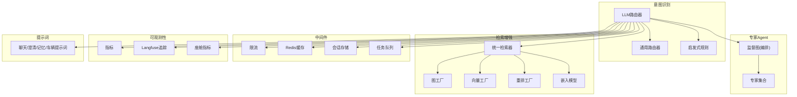
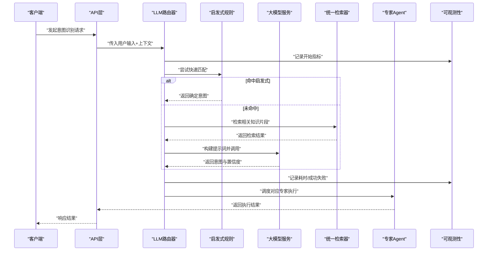
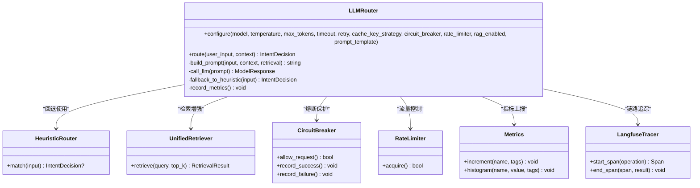
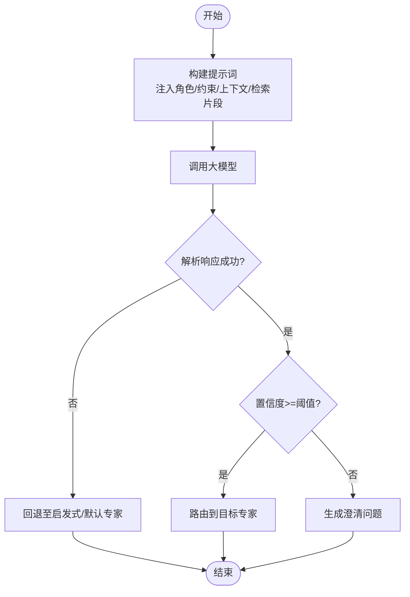
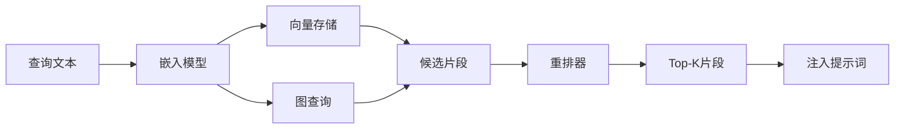
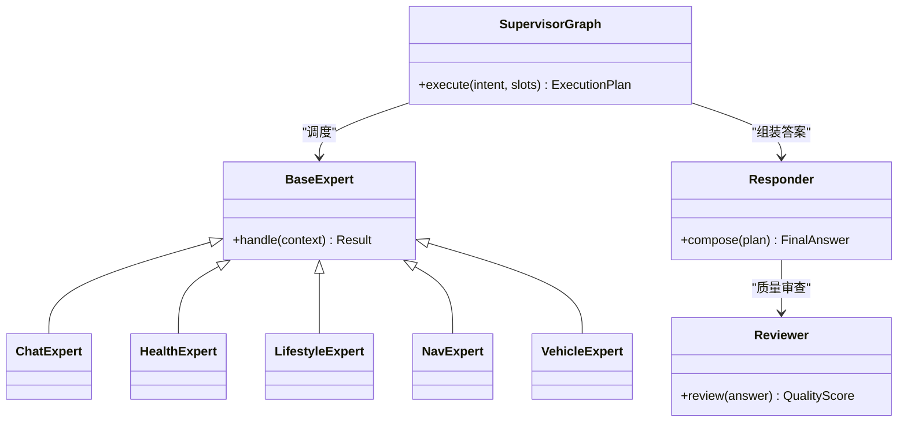
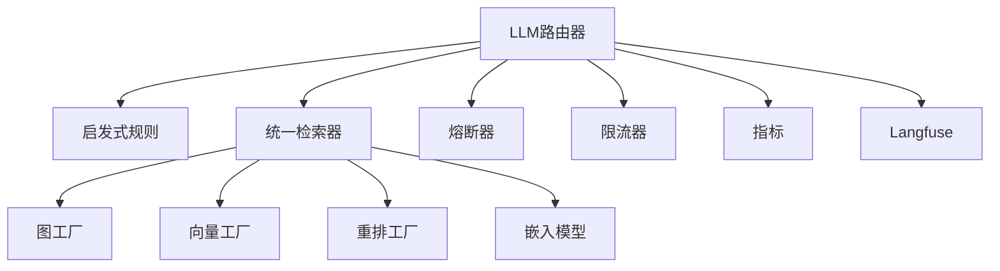

# LLM路由器

<cite>
**本文引用的文件**   
- [llm_router.py](file://backend_design/nexus/intent/llm_router.py)
- [router.py](file://backend_design/nexus/intent/router.py)
- [heuristic.py](file://backend_design/nexus/intent/heuristic.py)
- [constants.py](file://backend_design/nexus/intent/constants.py)
- [config.py](file://backend_design/nexus/config.py)
- [circuit_breaker.py](file://backend_design/nexus/core/circuit_breaker.py)
- [exceptions.py](file://backend_design/nexus/core/exceptions.py)
- [logger.py](file://backend_design/nexus/core/logger.py)
- [rate_limiter.py](file://backend_design/nexus/middleware/rate_limiter.py)
- [redis_cache.py](file://backend_design/nexus/middleware/redis_cache.py)
- [session_store.py](file://backend_design/nexus/middleware/session_store.py)
- [task_queue.py](file://backend_design/nexus/middleware/task_queue.py)
- [cockpit_metrics.py](file://backend_design/nexus/observability/cockpit_metrics.py)
- [metrics.py](file://backend_design/nexus/observability/metrics.py)
- [langfuse.py](file://backend_design/nexus/observability/langfuse.py)
- [chat.md](file://backend_design/nexus/prompts/chat.md)
- [clarification.md](file://backend_design/nexus/prompts/clarification.md)
- [memory_extract.md](file://backend_design/nexus/prompts/memory_extract.md)
- [vehicle.md](file://backend_design/nexus/prompts/vehicle.md)
- [unified_retriever.py](file://backend_design/nexus/rag/unified_retriever.py)
- [graph_factory.py](file://backend_design/nexus/rag/graph_factory.py)
- [vector_factory.py](file://backend_design/nexus/rag/vector_factory.py)
- [reranker_factory.py](file://backend_design/nexus/rag/reranker_factory.py)
- [embedding.py](file://backend_design/nexus/rag/embedding.py)
- [agent_graph.py](file://backend_design/nexus/agent/supervisor_graph.py)
- [responder.py](file://backend_design/nexus/agent/responder.py)
- [reviewer.py](file://backend_design/nexus/agent/reviewer.py)
- [base_expert.py](file://backend_design/nexus/agent/experts/base.py)
- [chat_expert.py](file://backend_design/nexus/agent/experts/chat_expert.py)
- [health_expert.py](file://backend_design/nexus/agent/experts/health_expert.py)
- [lifestyle_expert.py](file://backend_design/nexus/agent/experts/lifestyle_expert.py)
- [nav_expert.py](file://backend_design/nexus/agent/experts/nav_expert.py)
- [vehicle_expert.py](file://backend_design/nexus/agent/experts/vehicle_expert.py)
</cite>

## 目录
1. [简介](#简介)
2. [项目结构](#项目结构)
3. [核心组件](#核心组件)
4. [架构总览](#架构总览)
5. [详细组件分析](#详细组件分析)
6. [依赖关系分析](#依赖关系分析)
7. [性能考虑](#性能考虑)
8. [故障排查指南](#故障排查指南)
9. [结论](#结论)
10. [附录](#附录)

## 简介
本技术文档聚焦于NexusCockpit意图识别系统中的LLM路由器组件，系统性阐述其基于大语言模型的语义理解与路由机制。内容涵盖提示词工程、上下文理解、智能决策流程、配置与调优参数、复杂语义场景处理（多轮对话、模糊消歧、跨领域推理）、集成示例（API调用、错误处理、降级策略）以及性能优化建议（缓存、批量、异步）。

## 项目结构
LLM路由器位于意图识别子系统内，与启发式规则、专家Agent、RAG检索、可观测性与中间件协同工作。关键目录与职责：
- intent: 意图识别核心，包含LLM路由器、通用路由器与启发式规则
- agent: 专家Agent编排与执行
- rag: 统一检索与重排、图与向量存储工厂
- middleware: 限流、缓存、会话、任务队列等横切能力
- observability: 指标、追踪与Langfuse集成
- prompts: 提示词模板
- core: 熔断器、异常、日志等基础能力

图表来源
- [llm_router.py](file://backend_design/nexus/intent/llm_router.py)
- [router.py](file://backend_design/nexus/intent/router.py)
- [heuristic.py](file://backend_design/nexus/intent/heuristic.py)
- [supervisor_graph.py](file://backend_design/nexus/agent/supervisor_graph.py)
- [unified_retriever.py](file://backend_design/nexus/rag/unified_retriever.py)
- [graph_factory.py](file://backend_design/nexus/rag/graph_factory.py)
- [vector_factory.py](file://backend_design/nexus/rag/vector_factory.py)
- [reranker_factory.py](file://backend_design/nexus/rag/reranker_factory.py)
- [embedding.py](file://backend_design/nexus/rag/embedding.py)
- [rate_limiter.py](file://backend_design/nexus/middleware/rate_limiter.py)
- [redis_cache.py](file://backend_design/nexus/middleware/redis_cache.py)
- [session_store.py](file://backend_design/nexus/middleware/session_store.py)
- [task_queue.py](file://backend_design/nexus/middleware/task_queue.py)
- [metrics.py](file://backend_design/nexus/observability/metrics.py)
- [langfuse.py](file://backend_design/nexus/observability/langfuse.py)
- [cockpit_metrics.py](file://backend_design/nexus/observability/cockpit_metrics.py)
- [chat.md](file://backend_design/nexus/prompts/chat.md)
- [clarification.md](file://backend_design/nexus/prompts/clarification.md)
- [memory_extract.md](file://backend_design/nexus/prompts/memory_extract.md)
- [vehicle.md](file://backend_design/nexus/prompts/vehicle.md)

章节来源
- [llm_router.py](file://backend_design/nexus/intent/llm_router.py)
- [router.py](file://backend_design/nexus/intent/router.py)
- [heuristic.py](file://backend_design/nexus/intent/heuristic.py)
- [supervisor_graph.py](file://backend_design/nexus/agent/supervisor_graph.py)
- [unified_retriever.py](file://backend_design/nexus/rag/unified_retriever.py)
- [graph_factory.py](file://backend_design/nexus/rag/graph_factory.py)
- [vector_factory.py](file://backend_design/nexus/rag/vector_factory.py)
- [reranker_factory.py](file://backend_design/nexus/rag/reranker_factory.py)
- [embedding.py](file://backend_design/nexus/rag/embedding.py)
- [rate_limiter.py](file://backend_design/nexus/middleware/rate_limiter.py)
- [redis_cache.py](file://backend_design/nexus/middleware/redis_cache.py)
- [session_store.py](file://backend_design/nexus/middleware/session_store.py)
- [task_queue.py](file://backend_design/nexus/middleware/task_queue.py)
- [metrics.py](file://backend_design/nexus/observability/metrics.py)
- [langfuse.py](file://backend_design/nexus/observability/langfuse.py)
- [cockpit_metrics.py](file://backend_design/nexus/observability/cockpit_metrics.py)
- [chat.md](file://backend_design/nexus/prompts/chat.md)
- [clarification.md](file://backend_design/nexus/prompts/clarification.md)
- [memory_extract.md](file://backend_design/nexus/prompts/memory_extract.md)
- [vehicle.md](file://backend_design/nexus/prompts/vehicle.md)

## 核心组件
- LLM路由器：负责将用户输入结合上下文与检索结果，通过大模型进行意图分类与路由决策；支持温度、最大令牌数等生成参数控制；具备熔断、限流、缓存与会话感知能力。
- 通用路由器：在启发式规则与LLM之间做兜底与融合，保证稳定性。
- 启发式规则：基于关键词、正则或轻量规则的快速分支，用于低延迟场景与冷启动。
- 专家Agent与监督图：根据LLM路由结果调度具体专家完成业务执行。
- RAG统一检索：提供图与向量检索、重排与嵌入能力，为LLM提供外部知识支撑。
- 中间件：限流、缓存、会话、任务队列，提升吞吐与鲁棒性。
- 可观测性：指标采集、分布式追踪与Langfuse集成，便于定位问题与优化。
- 提示词工程：聊天、澄清、记忆抽取、车辆相关提示词模板，驱动高质量输出。

章节来源
- [llm_router.py](file://backend_design/nexus/intent/llm_router.py)
- [router.py](file://backend_design/nexus/intent/router.py)
- [heuristic.py](file://backend_design/nexus/intent/heuristic.py)
- [supervisor_graph.py](file://backend_design/nexus/agent/supervisor_graph.py)
- [unified_retriever.py](file://backend_design/nexus/rag/unified_retriever.py)
- [graph_factory.py](file://backend_design/nexus/rag/graph_factory.py)
- [vector_factory.py](file://backend_design/nexus/rag/vector_factory.py)
- [reranker_factory.py](file://backend_design/nexus/rag/reranker_factory.py)
- [embedding.py](file://backend_design/nexus/rag/embedding.py)
- [rate_limiter.py](file://backend_design/nexus/middleware/rate_limiter.py)
- [redis_cache.py](file://backend_design/nexus/middleware/redis_cache.py)
- [session_store.py](file://backend_design/nexus/middleware/session_store.py)
- [task_queue.py](file://backend_design/nexus/middleware/task_queue.py)
- [metrics.py](file://backend_design/nexus/observability/metrics.py)
- [langfuse.py](file://backend_design/nexus/observability/langfuse.py)
- [cockpit_metrics.py](file://backend_design/nexus/observability/cockpit_metrics.py)
- [chat.md](file://backend_design/nexus/prompts/chat.md)
- [clarification.md](file://backend_design/nexus/prompts/clarification.md)
- [memory_extract.md](file://backend_design/nexus/prompts/memory_extract.md)
- [vehicle.md](file://backend_design/nexus/prompts/vehicle.md)

## 架构总览
下图展示一次典型请求从入口到路由决策再到专家执行的端到端流程，体现LLM路由器在其中的枢纽作用。

图表来源
- [llm_router.py](file://backend_design/nexus/intent/llm_router.py)
- [heuristic.py](file://backend_design/nexus/intent/heuristic.py)
- [unified_retriever.py](file://backend_design/nexus/rag/unified_retriever.py)
- [supervisor_graph.py](file://backend_design/nexus/agent/supervisor_graph.py)
- [metrics.py](file://backend_design/nexus/observability/metrics.py)
- [langfuse.py](file://backend_design/nexus/observability/langfuse.py)

## 详细组件分析

### LLM路由器组件
- 功能要点
  - 接收用户输入与上下文，优先走启发式规则，未命中则进入LLM路径
  - 动态构建提示词，注入系统角色、历史摘要、检索增强片段与领域约束
  - 调用大模型获取意图类别、置信度及必要槽位信息
  - 结合熔断器与限流器保障可用性，必要时回退至启发式或默认专家
  - 记录指标与追踪，支持Langfuse链路追踪
- 关键数据流
  - 输入：用户消息、会话ID、可选的上一轮摘要、检索片段
  - 输出：目标专家/意图、置信度、槽位、澄清问题（如需）
- 配置项（示例说明）
  - 模型选择：指定后端模型名称或端点
  - 温度：控制创造性与确定性
  - 最大令牌数：限制输出长度
  - 超时与重试：网络与模型侧容错
  - 缓存键策略：是否对相似输入启用缓存
  - 熔断阈值：错误率/延迟触发熔断
  - 限流配额：QPS/并发上限
  - 检索开关：是否启用RAG增强
  - 提示词模板：选择不同场景模板
- 复杂语义场景处理
  - 多轮对话：维护会话摘要与最近N轮上下文，避免上下文过长
  - 模糊意图消歧：当置信度低于阈值时，返回澄清问题而非直接执行
  - 跨领域推理：借助RAG检索与图结构知识，补充领域边界外的常识
- 降级策略
  - 熔断开启时，自动切换至启发式或默认专家
  - 限流触发时，排队或拒绝并返回友好提示
  - 检索失败时，回退到无RAG模式继续路由
- 集成示例（概念流程）
  - API调用：REST/WebSocket接口传入用户输入与会话上下文
  - 错误处理：捕获网络/模型/解析异常，记录指标并降级
  - 降级策略：熔断→启发式→默认专家→返回澄清

图表来源
- [llm_router.py](file://backend_design/nexus/intent/llm_router.py)
- [heuristic.py](file://backend_design/nexus/intent/heuristic.py)
- [unified_retriever.py](file://backend_design/nexus/rag/unified_retriever.py)
- [circuit_breaker.py](file://backend_design/nexus/core/circuit_breaker.py)
- [rate_limiter.py](file://backend_design/nexus/middleware/rate_limiter.py)
- [metrics.py](file://backend_design/nexus/observability/metrics.py)
- [langfuse.py](file://backend_design/nexus/observability/langfuse.py)

章节来源
- [llm_router.py](file://backend_design/nexus/intent/llm_router.py)
- [heuristic.py](file://backend_design/nexus/intent/heuristic.py)
- [unified_retriever.py](file://backend_design/nexus/rag/unified_retriever.py)
- [circuit_breaker.py](file://backend_design/nexus/core/circuit_breaker.py)
- [rate_limiter.py](file://backend_design/nexus/middleware/rate_limiter.py)
- [metrics.py](file://backend_design/nexus/observability/metrics.py)
- [langfuse.py](file://backend_design/nexus/observability/langfuse.py)

### 提示词工程与上下文理解
- 提示词模板
  - 聊天模板：定义系统角色、输出格式、安全约束
  - 澄清模板：当置信度不足时，引导用户提供更多信息
  - 记忆抽取模板：从对话中抽取长期偏好与事实
  - 车辆模板：限定车辆控制与安全边界
- 上下文管理
  - 会话摘要：压缩历史对话，保留关键实体与意图
  - 检索片段：按相关性排序后拼接，控制长度与噪声
- 决策过程
  - 先启发式快速分支，再LLM精细判断
  - 置信度阈值驱动是否澄清或执行

图表来源
- [chat.md](file://backend_design/nexus/prompts/chat.md)
- [clarification.md](file://backend_design/nexus/prompts/clarification.md)
- [memory_extract.md](file://backend_design/nexus/prompts/memory_extract.md)
- [vehicle.md](file://backend_design/nexus/prompts/vehicle.md)
- [llm_router.py](file://backend_design/nexus/intent/llm_router.py)
- [heuristic.py](file://backend_design/nexus/intent/heuristic.py)

章节来源
- [chat.md](file://backend_design/nexus/prompts/chat.md)
- [clarification.md](file://backend_design/nexus/prompts/clarification.md)
- [memory_extract.md](file://backend_design/nexus/prompts/memory_extract.md)
- [vehicle.md](file://backend_design/nexus/prompts/vehicle.md)
- [llm_router.py](file://backend_design/nexus/intent/llm_router.py)
- [heuristic.py](file://backend_design/nexus/intent/heuristic.py)

### 检索增强与跨领域推理
- 统一检索器：封装图与向量检索，提供一致接口
- 图与向量工厂：按需创建Neo4j/Milvus等后端实例
- 重排器：对候选片段进行二次排序，提升相关性
- 嵌入模型：将查询与文档映射到同一空间
- 跨领域推理：通过图结构与外部知识库弥补领域空白

图表来源
- [unified_retriever.py](file://backend_design/nexus/rag/unified_retriever.py)
- [graph_factory.py](file://backend_design/nexus/rag/graph_factory.py)
- [vector_factory.py](file://backend_design/nexus/rag/vector_factory.py)
- [reranker_factory.py](file://backend_design/nexus/rag/reranker_factory.py)
- [embedding.py](file://backend_design/nexus/rag/embedding.py)

章节来源
- [unified_retriever.py](file://backend_design/nexus/rag/unified_retriever.py)
- [graph_factory.py](file://backend_design/nexus/rag/graph_factory.py)
- [vector_factory.py](file://backend_design/nexus/rag/vector_factory.py)
- [reranker_factory.py](file://backend_design/nexus/rag/reranker_factory.py)
- [embedding.py](file://backend_design/nexus/rag/embedding.py)

### 专家Agent与执行
- 监督图：根据路由结果编排专家执行顺序与条件分支
- 专家集合：聊天、健康、生活方式、导航、车辆等
- 响应器与评审器：负责最终回答组装与质量审查

图表来源
- [supervisor_graph.py](file://backend_design/nexus/agent/supervisor_graph.py)
- [base_expert.py](file://backend_design/nexus/agent/experts/base.py)
- [chat_expert.py](file://backend_design/nexus/agent/experts/chat_expert.py)
- [health_expert.py](file://backend_design/nexus/agent/experts/health_expert.py)
- [lifestyle_expert.py](file://backend_design/nexus/agent/experts/lifestyle_expert.py)
- [nav_expert.py](file://backend_design/nexus/agent/experts/nav_expert.py)
- [vehicle_expert.py](file://backend_design/nexus/agent/experts/vehicle_expert.py)
- [responder.py](file://backend_design/nexus/agent/responder.py)
- [reviewer.py](file://backend_design/nexus/agent/reviewer.py)

章节来源
- [supervisor_graph.py](file://backend_design/nexus/agent/supervisor_graph.py)
- [base_expert.py](file://backend_design/nexus/agent/experts/base.py)
- [chat_expert.py](file://backend_design/nexus/agent/experts/chat_expert.py)
- [health_expert.py](file://backend_design/nexus/agent/experts/health_expert.py)
- [lifestyle_expert.py](file://backend_design/nexus/agent/experts/lifestyle_expert.py)
- [nav_expert.py](file://backend_design/nexus/agent/experts/nav_expert.py)
- [vehicle_expert.py](file://backend_design/nexus/agent/experts/vehicle_expert.py)
- [responder.py](file://backend_design/nexus/agent/responder.py)
- [reviewer.py](file://backend_design/nexus/agent/reviewer.py)

## 依赖关系分析
- 内部依赖
  - LLM路由器依赖启发式规则、统一检索器、熔断器、限流器、指标与追踪
  - 统一检索器依赖图/向量/重排/嵌入工厂
  - 专家执行依赖监督图、响应器与评审器
- 外部依赖
  - 大模型服务（HTTP/gRPC）
  - 向量数据库（如Milvus）
  - 图数据库（如Neo4j）
  - Redis（缓存与会话）
  - Prometheus/Grafana（指标可视化）
  - Langfuse（LLM链路追踪）

图表来源
- [llm_router.py](file://backend_design/nexus/intent/llm_router.py)
- [heuristic.py](file://backend_design/nexus/intent/heuristic.py)
- [unified_retriever.py](file://backend_design/nexus/rag/unified_retriever.py)
- [graph_factory.py](file://backend_design/nexus/rag/graph_factory.py)
- [vector_factory.py](file://backend_design/nexus/rag/vector_factory.py)
- [reranker_factory.py](file://backend_design/nexus/rag/reranker_factory.py)
- [embedding.py](file://backend_design/nexus/rag/embedding.py)
- [circuit_breaker.py](file://backend_design/nexus/core/circuit_breaker.py)
- [rate_limiter.py](file://backend_design/nexus/middleware/rate_limiter.py)
- [metrics.py](file://backend_design/nexus/observability/metrics.py)
- [langfuse.py](file://backend_design/nexus/observability/langfuse.py)

章节来源
- [llm_router.py](file://backend_design/nexus/intent/llm_router.py)
- [heuristic.py](file://backend_design/nexus/intent/heuristic.py)
- [unified_retriever.py](file://backend_design/nexus/rag/unified_retriever.py)
- [graph_factory.py](file://backend_design/nexus/rag/graph_factory.py)
- [vector_factory.py](file://backend_design/nexus/rag/vector_factory.py)
- [reranker_factory.py](file://backend_design/nexus/rag/reranker_factory.py)
- [embedding.py](file://backend_design/nexus/rag/embedding.py)
- [circuit_breaker.py](file://backend_design/nexus/core/circuit_breaker.py)
- [rate_limiter.py](file://backend_design/nexus/middleware/rate_limiter.py)
- [metrics.py](file://backend_design/nexus/observability/metrics.py)
- [langfuse.py](file://backend_design/nexus/observability/langfuse.py)

## 性能考虑
- 缓存机制
  - 对高频相似输入进行缓存，减少重复LLM调用
  - 缓存键策略需考虑会话ID、上下文摘要与检索片段哈希
- 批量处理
  - 将多个短请求合并为批处理，降低模型调用开销
  - 注意批次大小与延迟权衡
- 异步处理
  - 使用任务队列异步执行耗时操作（如长对话摘要、复杂检索）
  - 前端采用WebSocket推送结果
- 检索优化
  - 合理设置Top-K与重排阈值，平衡召回与精度
  - 对热点知识建立本地缓存
- 资源隔离
  - 对不同专家或领域划分独立线程池/连接池
  - 限流与熔断配合，防止雪崩

[本节为通用指导，不直接分析具体文件]

## 故障排查指南
- 常见问题
  - 模型调用超时：检查网络连通、模型服务状态与超时配置
  - 解析失败：确认模型输出格式是否符合提示词约定
  - 熔断频繁触发：观察错误率与延迟，调整阈值
  - 限流导致拒绝：评估QPS峰值，扩容或优化缓存命中率
  - 检索为空：检查向量/图索引状态与查询语句
- 诊断工具
  - 指标面板：查看成功率、P95/P99延迟、熔断/限流计数
  - Langfuse追踪：定位慢节点与错误路径
  - 日志：关注异常堆栈与上下文快照

章节来源
- [circuit_breaker.py](file://backend_design/nexus/core/circuit_breaker.py)
- [exceptions.py](file://backend_design/nexus/core/exceptions.py)
- [logger.py](file://backend_design/nexus/core/logger.py)
- [rate_limiter.py](file://backend_design/nexus/middleware/rate_limiter.py)
- [redis_cache.py](file://backend_design/nexus/middleware/redis_cache.py)
- [session_store.py](file://backend_design/nexus/middleware/session_store.py)
- [task_queue.py](file://backend_design/nexus/middleware/task_queue.py)
- [cockpit_metrics.py](file://backend_design/nexus/observability/cockpit_metrics.py)
- [metrics.py](file://backend_design/nexus/observability/metrics.py)
- [langfuse.py](file://backend_design/nexus/observability/langfuse.py)

## 结论
LLM路由器作为意图识别的核心枢纽，结合启发式规则、RAG检索与专家Agent，实现了高可用、可扩展且可观测的智能路由体系。通过合理的提示词工程、上下文管理与降级策略，系统在复杂语义场景下仍能保持稳健表现。配合缓存、批量与异步优化，可在保证体验的同时提升吞吐与稳定性。

[本节为总结性内容，不直接分析具体文件]

## 附录
- 配置参考（字段说明）
  - model: 模型标识或端点
  - temperature: 生成随机性
  - max_tokens: 最大输出长度
  - timeout: 单次调用超时
  - retry: 重试次数
  - cache_key_strategy: 缓存键构造策略
  - circuit_breaker_threshold: 熔断阈值
  - rate_limit_qps: QPS上限
  - rag_enabled: 是否启用检索增强
  - prompt_template: 提示词模板名
- 集成步骤（概览）
  - 初始化路由器与中间件
  - 注册专家与提示词模板
  - 接入指标与追踪
  - 部署限流与熔断
  - 压测与调优

[本节为补充信息，不直接分析具体文件]