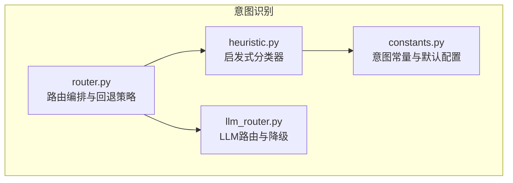
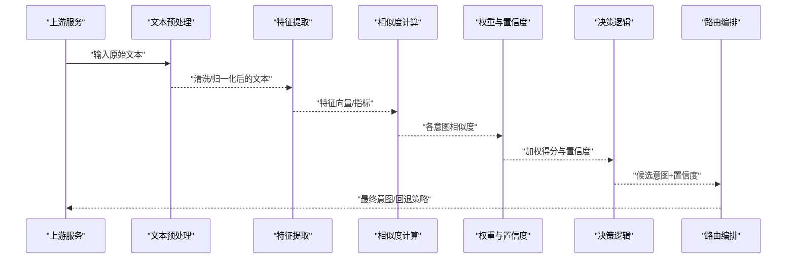
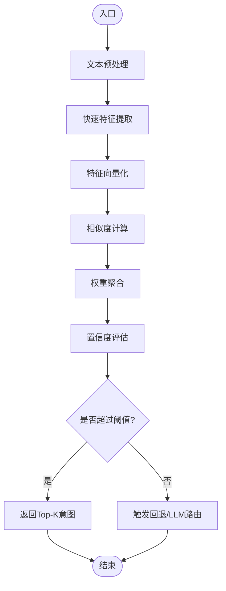
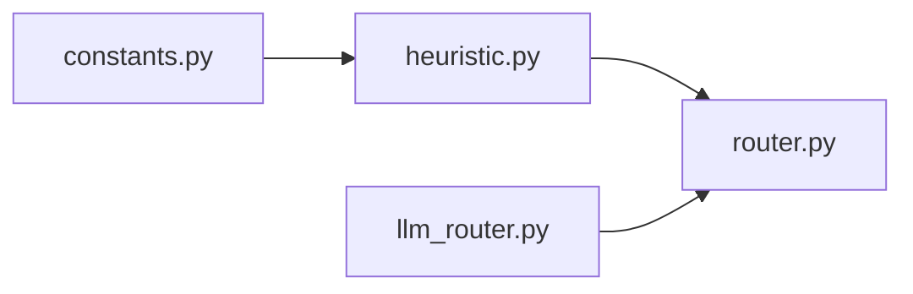

# 启发式算法

<cite>
**本文引用的文件**   
- [heuristic.py](file://backend_design/nexus/intent/heuristic.py)
- [constants.py](file://backend_design/nexus/intent/constants.py)
- [router.py](file://backend_design/nexus/intent/router.py)
- [llm_router.py](file://backend_design/nexus/intent/llm_router.py)
</cite>

## 目录
1. [简介](#简介)
2. [项目结构](#项目结构)
3. [核心组件](#核心组件)
4. [架构总览](#架构总览)
5. [详细组件分析](#详细组件分析)
6. [依赖关系分析](#依赖关系分析)
7. [性能考量](#性能考量)
8. [故障排查指南](#故障排查指南)
9. [结论](#结论)
10. [附录](#附录)

## 简介
本技术文档聚焦于NexusCockpit意图识别系统中的“启发式算法”组件，围绕其设计原理、关键函数与数据流进行系统化说明。内容涵盖：
- 快速特征提取、权重计算与置信度评估机制
- 文本预处理、特征向量化、相似度计算与最终决策逻辑
- 自定义启发式规则的方法（特征权重调整、阈值配置、规则扩展）
- 典型应用场景示例（紧急指令优先处理、上下文关联分析、用户习惯学习）
- 性能基准测试思路与优化建议

## 项目结构
启发式算法位于意图识别模块中，与常量定义、路由编排共同构成轻量级、可插拔的意图分流体系。下图展示该子系统的文件组织与职责边界。

图表来源
- [heuristic.py](file://backend_design/nexus/intent/heuristic.py)
- [constants.py](file://backend_design/nexus/intent/constants.py)
- [router.py](file://backend_design/nexus/intent/router.py)
- [llm_router.py](file://backend_design/nexus/intent/llm_router.py)

章节来源
- [heuristic.py](file://backend_design/nexus/intent/heuristic.py)
- [constants.py](file://backend_design/nexus/intent/constants.py)
- [router.py](file://backend_design/nexus/intent/router.py)
- [llm_router.py](file://backend_design/nexus/intent/llm_router.py)

## 核心组件
- 启发式分类器：负责基于规则与统计特征的快速意图判定，输出候选意图及置信度。
- 常量与配置：集中管理意图枚举、默认权重、阈值等可调参数。
- 路由编排：将启发式结果与LLM路由组合，提供兜底与降级路径。

章节来源
- [heuristic.py](file://backend_design/nexus/intent/heuristic.py)
- [constants.py](file://backend_design/nexus/intent/constants.py)
- [router.py](file://backend_design/nexus/intent/router.py)

## 架构总览
启发式算法在整体意图识别链路中的位置如下：上游接收原始文本或ASR转写结果，经预处理后进入启发式分类器；分类器输出带置信度的意图候选；路由层根据业务策略选择直接执行或交由LLM进一步判断。

图表来源
- [heuristic.py](file://backend_design/nexus/intent/heuristic.py)
- [router.py](file://backend_design/nexus/intent/router.py)

## 详细组件分析

### 启发式分类器（heuristic.py）
- 设计目标：以低延迟、高可解释性实现意图初筛，为后续LLM或技能执行提供强基线。
- 关键流程：
  - 文本预处理：去噪、标准化、分词/切块、停用词过滤、同义映射等。
  - 快速特征提取：关键词命中、正则匹配、长度/语气/标点特征、时间/地点实体占位符等。
  - 特征向量化：将离散特征映射为固定维度的稀疏/稠密表示，便于高效相似度计算。
  - 相似度计算：采用余弦相似度或加权点积，结合意图模板库进行匹配。
  - 权重与置信度：对各类特征赋予权重，按线性或非线性方式聚合为最终得分；通过归一化与校准得到置信度。
  - 决策逻辑：设定阈值与优先级（如紧急指令优先），输出Top-K候选意图。
- 可扩展点：
  - 新增意图类别与模板
  - 动态权重与阈值配置
  - 自定义特征抽取器与相似度度量

图表来源
- [heuristic.py](file://backend_design/nexus/intent/heuristic.py)

章节来源
- [heuristic.py](file://backend_design/nexus/intent/heuristic.py)

### 常量与配置（constants.py）
- 作用：集中定义意图枚举、默认权重、阈值、黑名单/白名单、紧急指令标识等。
- 使用方式：被启发式分类器与路由层读取，支持热更新或外部配置注入。
- 建议：
  - 将易变参数抽离至配置文件或环境变量
  - 为不同场景提供多套默认配置

章节来源
- [constants.py](file://backend_design/nexus/intent/constants.py)

### 路由编排（router.py）
- 职责：整合启发式结果与LLM路由，实现分级决策与降级策略。
- 典型策略：
  - 高置信度直达执行
  - 中等置信度进入LLM二次判别
  - 低置信度或异常走澄清/兜底流程

章节来源
- [router.py](file://backend_design/nexus/intent/router.py)

### LLM路由（llm_router.py）
- 职责：当启发式无法给出明确意图时，调用大模型进行语义理解与意图推断。
- 与启发式的协作：作为回退通道，提升长尾场景准确率。

章节来源
- [llm_router.py](file://backend_design/nexus/intent/llm_router.py)

## 依赖关系分析
启发式分类器依赖常量配置，路由层同时依赖启发式与LLM路由，形成“快路径+慢路径”的双轨架构。

图表来源
- [heuristic.py](file://backend_design/nexus/intent/heuristic.py)
- [constants.py](file://backend_design/nexus/intent/constants.py)
- [router.py](file://backend_design/nexus/intent/router.py)
- [llm_router.py](file://backend_design/nexus/intent/llm_router.py)

章节来源
- [heuristic.py](file://backend_design/nexus/intent/heuristic.py)
- [constants.py](file://backend_design/nexus/intent/constants.py)
- [router.py](file://backend_design/nexus/intent/router.py)
- [llm_router.py](file://backend_design/nexus/intent/llm_router.py)

## 性能考量
- 时间复杂度
  - 预处理与特征提取：近似O(n)，n为文本长度
  - 相似度计算：O(d·k)，d为特征维度，k为候选意图数
  - 权重聚合与排序：O(k log k)
- 空间复杂度
  - 特征向量与模板库占用O(d + m)，m为模板规模
- 优化建议
  - 缓存热点意图模板与常用特征映射
  - 对高频特征做倒排索引或布隆过滤器加速命中
  - 限制Top-K并提前剪枝低分分支
  - 批处理与并行化相似度计算
  - 将阈值与权重外置，支持在线调参与A/B实验

[本节为通用性能指导，不直接分析具体文件]

## 故障排查指南
- 症状：意图误判率高
  - 检查特征覆盖度与模板质量
  - 核对权重与阈值配置是否合理
- 症状：延迟过高
  - 定位预处理瓶颈，减少不必要的正则与分词
  - 启用缓存与预计算
- 症状：新意图不生效
  - 确认常量中已注册意图与模板
  - 验证路由层是否包含对应分支

章节来源
- [heuristic.py](file://backend_design/nexus/intent/heuristic.py)
- [constants.py](file://backend_design/nexus/intent/constants.py)
- [router.py](file://backend_design/nexus/intent/router.py)

## 结论
启发式算法为NexusCockpit意图识别提供了低延迟、高可解释性的基础能力。通过合理的特征工程、权重与阈值配置，以及清晰的路由策略，可在多数常见场景下取得稳定表现；对于复杂与长尾问题，借助LLM路由进行二次判别，形成稳健的混合方案。

[本节为总结性内容，不直接分析具体文件]

## 附录

### 自定义启发式规则指南
- 特征权重调整
  - 在常量中维护权重字典，按意图维度配置
  - 支持按会话上下文或用户画像动态缩放
- 阈值配置
  - 全局阈值与意图专属阈值并存
  - 提供置信度校准方法，避免分布漂移导致误判
- 规则扩展方法
  - 新增意图类别与模板
  - 插入新的特征抽取器，保持接口一致
  - 在路由层增加相应分支与回退策略

章节来源
- [constants.py](file://backend_design/nexus/intent/constants.py)
- [heuristic.py](file://backend_design/nexus/intent/heuristic.py)
- [router.py](file://backend_design/nexus/intent/router.py)

### 典型应用场景示例
- 紧急指令优先处理
  - 为紧急类意图设置更高权重与更低阈值，确保快速响应
- 上下文关联分析
  - 引入会话历史特征（如上一轮意图、最近操作）参与打分
- 用户习惯学习
  - 基于用户行为统计动态调整权重，体现个性化偏好

章节来源
- [heuristic.py](file://backend_design/nexus/intent/heuristic.py)
- [constants.py](file://backend_design/nexus/intent/constants.py)

### 性能基准测试思路
- 数据集构建
  - 覆盖短指令、口语化表达、含噪声与错别字样本
  - 标注真实意图与置信度参考
- 指标定义
  - Top-1/Top-3准确率、平均延迟、P95/P99延迟、吞吐
- 实验设计
  - 对比不同权重/阈值组合
  - 开启/关闭缓存与并行化
- 报告输出
  - 按意图类别拆分指标，定位薄弱环节

[本节为方法论指导，不直接分析具体文件]