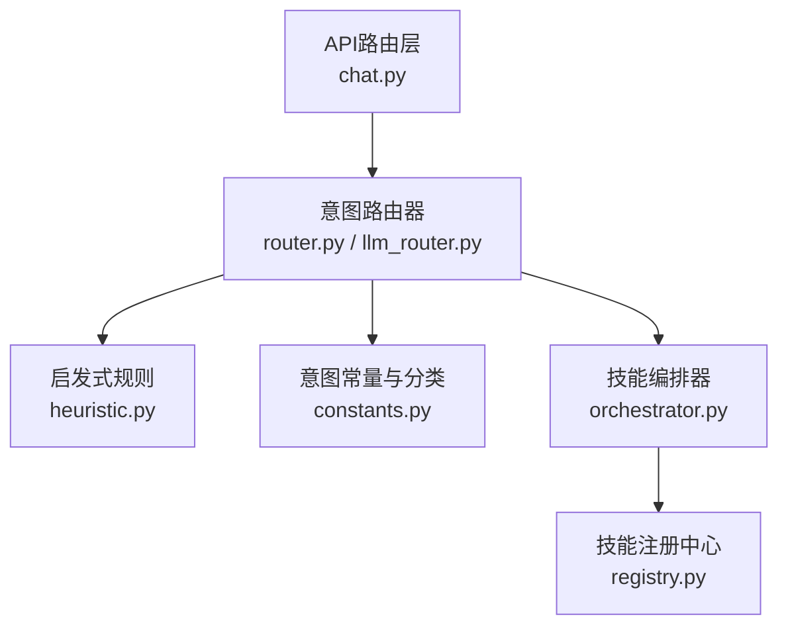
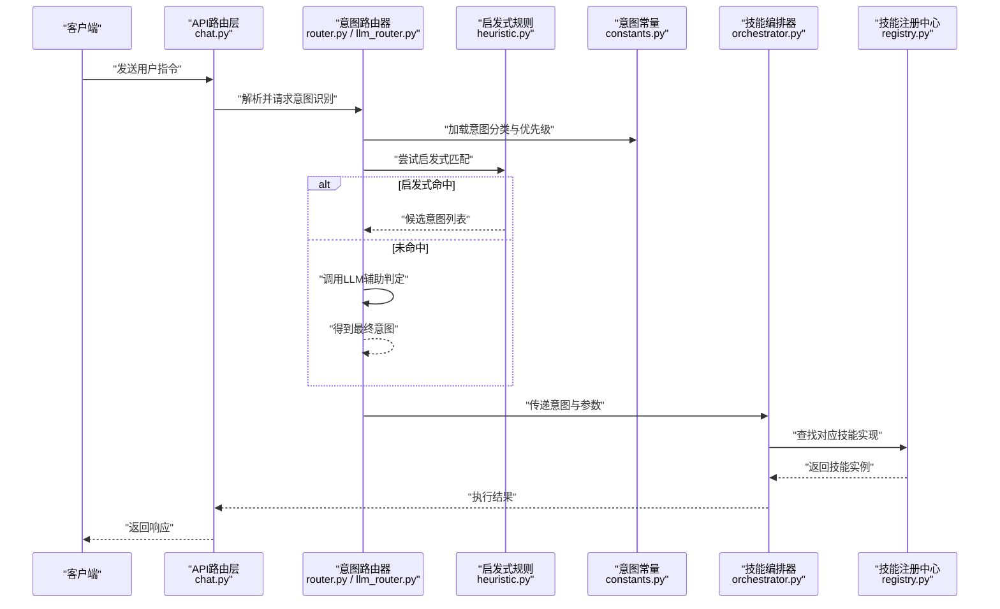
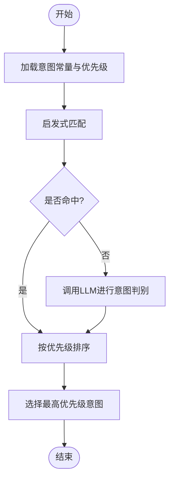
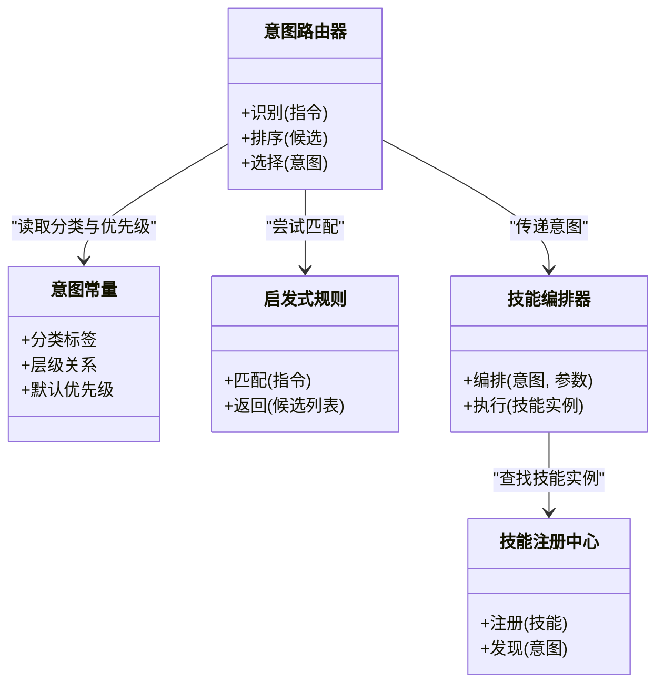
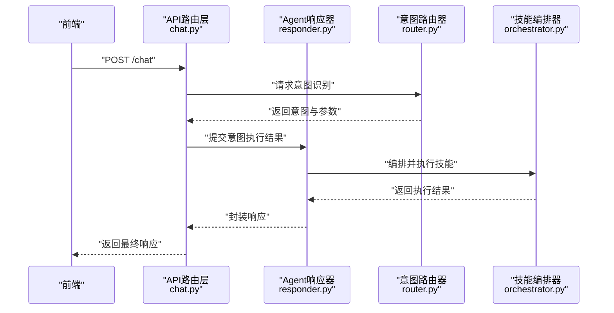
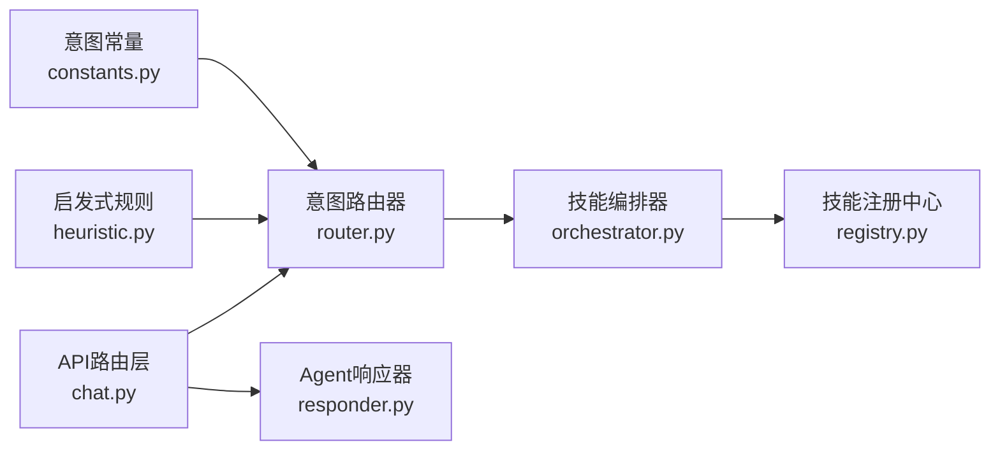

# 意图常量定义

<cite>
**本文引用的文件**   
- [intent/constants.py](file://backend_design/nexus/intent/constants.py)
- [intent/router.py](file://backend_design/nexus/intent/router.py)
- [intent/llm_router.py](file://backend_design/nexus/intent/llm_router.py)
- [intent/heuristic.py](file://backend_design/nexus/intent/heuristic.py)
- [skills/orchestrator.py](file://backend_design/nexus/skills/orchestrator.py)
- [skills/registry.py](file://backend_design/nexus/skills/registry.py)
- [agent/responder.py](file://backend_design/nexus/agent/responder.py)
- [api/routes/chat.py](file://backend_design/nexus/api/routes/chat.py)
</cite>

## 目录
1. [简介](#简介)
2. [项目结构](#项目结构)
3. [核心组件](#核心组件)
4. [架构总览](#架构总览)
5. [详细组件分析](#详细组件分析)
6. [依赖关系分析](#依赖关系分析)
7. [性能考虑](#性能考虑)
8. [故障排查指南](#故障排查指南)
9. [结论](#结论)
10. [附录](#附录)

## 简介
本文件面向NexusCockpit的意图识别系统，聚焦“意图常量定义”的技术文档。内容涵盖：
- 意图类型枚举与分类体系、命名规范
- 各业务域意图的定义与职责边界（车辆控制、导航出行、媒体娱乐、健康生活等）
- 意图层级结构与优先级排序机制
- 新增意图类型的标准流程（常量定义、路由配置、测试验证）
- 完整的意图分类参考表，便于开发者快速查阅与正确使用

## 项目结构
与意图常量及路由相关的关键位置如下：
- 意图常量与分类：位于后端意图模块的常量定义文件中
- 意图路由与分发：位于意图路由与LLM路由模块中
- 技能编排与注册：位于技能编排与注册中心，负责将意图映射到具体执行器
- 对话响应入口：位于Agent响应器与API路由层，作为意图落地的调用入口

图示来源
- [api/routes/chat.py](file://backend_design/nexus/api/routes/chat.py)
- [intent/router.py](file://backend_design/nexus/intent/router.py)
- [intent/llm_router.py](file://backend_design/nexus/intent/llm_router.py)
- [intent/heuristic.py](file://backend_design/nexus/intent/heuristic.py)
- [intent/constants.py](file://backend_design/nexus/intent/constants.py)
- [skills/orchestrator.py](file://backend_design/nexus/skills/orchestrator.py)
- [skills/registry.py](file://backend_design/nexus/skills/registry.py)

章节来源
- [intent/constants.py](file://backend_design/nexus/intent/constants.py)
- [intent/router.py](file://backend_design/nexus/intent/router.py)
- [intent/llm_router.py](file://backend_design/nexus/intent/llm_router.py)
- [intent/heuristic.py](file://backend_design/nexus/intent/heuristic.py)
- [skills/orchestrator.py](file://backend_design/nexus/skills/orchestrator.py)
- [skills/registry.py](file://backend_design/nexus/skills/registry.py)
- [api/routes/chat.py](file://backend_design/nexus/api/routes/chat.py)

## 核心组件
- 意图常量与分类：集中维护所有意图标识符、类别标签、层级关系与默认优先级，确保全链路一致使用
- 意图路由器：根据输入文本或结构化请求，结合启发式规则与LLM判断，选择目标意图并返回路由结果
- 启发式规则：提供基于关键词、正则、上下文等的快速匹配策略，用于兜底或加速决策
- 技能编排器：接收已确定的意图，按领域编排相应技能执行器，完成参数填充与动作执行
- 技能注册中心：统一管理技能能力清单，支持动态发现与版本管理
- 对话响应器：在Agent侧对意图执行结果进行统一封装与回复生成

章节来源
- [intent/constants.py](file://backend_design/nexus/intent/constants.py)
- [intent/router.py](file://backend_design/nexus/intent/router.py)
- [intent/llm_router.py](file://backend_design/nexus/intent/llm_router.py)
- [intent/heuristic.py](file://backend_design/nexus/intent/heuristic.py)
- [skills/orchestrator.py](file://backend_design/nexus/skills/orchestrator.py)
- [skills/registry.py](file://backend_design/nexus/skills/registry.py)
- [agent/responder.py](file://backend_design/nexus/agent/responder.py)

## 架构总览
意图识别与路由的整体流程如下：

图示来源
- [api/routes/chat.py](file://backend_design/nexus/api/routes/chat.py)
- [intent/router.py](file://backend_design/nexus/intent/router.py)
- [intent/llm_router.py](file://backend_design/nexus/intent/llm_router.py)
- [intent/heuristic.py](file://backend_design/nexus/intent/heuristic.py)
- [intent/constants.py](file://backend_design/nexus/intent/constants.py)
- [skills/orchestrator.py](file://backend_design/nexus/skills/orchestrator.py)
- [skills/registry.py](file://backend_design/nexus/skills/registry.py)

## 详细组件分析

### 意图常量与分类体系
- 分类维度
  - 一级分类：如车辆控制、导航出行、媒体娱乐、健康生活等
  - 二级分类：在一级下进一步细分，例如车辆控制下的空调、座椅、车窗；导航出行下的路线规划、目的地搜索；媒体娱乐下的音乐播放、电台切换；健康生活下的健康咨询、提醒服务
- 命名规范
  - 采用“领域_子域_动作”三段式命名，保证可读性与可扩展性
  - 全小写加下划线，避免歧义与大小写敏感问题
  - 动词表达明确动作语义，名词表达实体对象
- 层级结构
  - 通过常量中的层级字段表示父子关系，便于聚合统计与权限控制
- 优先级排序
  - 每个意图具备默认优先级，用于冲突消解与多候选排序
  - 优先级受上下文与场景影响，可在运行时调整

章节来源
- [intent/constants.py](file://backend_design/nexus/intent/constants.py)

#### 意图分类参考表（节选）
- 车辆控制类
  - 空调控制：调节温度、风量、模式等
  - 座椅控制：加热、通风、按摩、位置调节
  - 车窗控制：升降、除雾、遮阳
- 导航出行类
  - 路线规划：计算路径、偏好设置
  - 目的地搜索：POI检索、历史地点
- 媒体娱乐类
  - 音乐播放：播放、暂停、切歌、音量
  - 电台切换：频道选择、收藏电台
- 健康生活类
  - 健康咨询：症状问答、运动建议
  - 提醒服务：日程提醒、用药提醒

[本节为概念性说明，不直接分析具体代码文件]

### 意图路由器与LLM路由
- 功能职责
  - 接收用户指令，结合启发式规则与LLM输出，确定最终意图
  - 输出包含意图标识、置信度、关键参数等信息的结构化结果
- 决策流程
  - 先尝试启发式快速匹配，命中则直接返回
  - 未命中时调用LLM进行语义理解与意图判别
  - 依据常量中的优先级对候选意图排序，选择最优
- 错误处理
  - 当启发式与LLM均无法确定时，返回“需澄清”信号，交由上层进行追问

图示来源
- [intent/router.py](file://backend_design/nexus/intent/router.py)
- [intent/llm_router.py](file://backend_design/nexus/intent/llm_router.py)
- [intent/heuristic.py](file://backend_design/nexus/intent/heuristic.py)
- [intent/constants.py](file://backend_design/nexus/intent/constants.py)

章节来源
- [intent/router.py](file://backend_design/nexus/intent/router.py)
- [intent/llm_router.py](file://backend_design/nexus/intent/llm_router.py)
- [intent/heuristic.py](file://backend_design/nexus/intent/heuristic.py)
- [intent/constants.py](file://backend_design/nexus/intent/constants.py)

### 技能编排与注册
- 编排器职责
  - 根据意图标识，从注册中心获取对应技能实例
  - 组装参数、执行技能、收集结果并返回
- 注册中心职责
  - 维护技能清单与版本信息
  - 支持动态发现与热更新
- 扩展点
  - 新增技能需在注册中心登记，并在编排器中声明映射关系

图示来源
- [intent/constants.py](file://backend_design/nexus/intent/constants.py)
- [intent/router.py](file://backend_design/nexus/intent/router.py)
- [intent/heuristic.py](file://backend_design/nexus/intent/heuristic.py)
- [skills/orchestrator.py](file://backend_design/nexus/skills/orchestrator.py)
- [skills/registry.py](file://backend_design/nexus/skills/registry.py)

章节来源
- [skills/orchestrator.py](file://backend_design/nexus/skills/orchestrator.py)
- [skills/registry.py](file://backend_design/nexus/skills/registry.py)

### 对话响应器与API入口
- API路由层
  - 接收前端请求，调用意图路由器进行识别
  - 将识别结果转发至Agent响应器
- Agent响应器
  - 对意图执行结果进行统一封装
  - 生成自然语言回复或结构化数据

图示来源
- [api/routes/chat.py](file://backend_design/nexus/api/routes/chat.py)
- [agent/responder.py](file://backend_design/nexus/agent/responder.py)
- [intent/router.py](file://backend_design/nexus/intent/router.py)
- [skills/orchestrator.py](file://backend_design/nexus/skills/orchestrator.py)

章节来源
- [api/routes/chat.py](file://backend_design/nexus/api/routes/chat.py)
- [agent/responder.py](file://backend_design/nexus/agent/responder.py)

## 依赖关系分析
- 低耦合高内聚
  - 意图常量独立于路由逻辑，便于全局维护
  - 路由器仅依赖常量与启发式规则，保持轻量
- 外部依赖
  - LLM路由可能依赖外部模型服务，需做好降级与超时处理
  - 技能注册中心可对接配置中心或数据库，支持动态更新
- 潜在循环依赖
  - 应避免编排器反向依赖路由器，防止循环引用

图示来源
- [intent/constants.py](file://backend_design/nexus/intent/constants.py)
- [intent/router.py](file://backend_design/nexus/intent/router.py)
- [intent/heuristic.py](file://backend_design/nexus/intent/heuristic.py)
- [skills/orchestrator.py](file://backend_design/nexus/skills/orchestrator.py)
- [skills/registry.py](file://backend_design/nexus/skills/registry.py)
- [api/routes/chat.py](file://backend_design/nexus/api/routes/chat.py)
- [agent/responder.py](file://backend_design/nexus/agent/responder.py)

章节来源
- [intent/constants.py](file://backend_design/nexus/intent/constants.py)
- [intent/router.py](file://backend_design/nexus/intent/router.py)
- [intent/heuristic.py](file://backend_design/nexus/intent/heuristic.py)
- [skills/orchestrator.py](file://backend_design/nexus/skills/orchestrator.py)
- [skills/registry.py](file://backend_design/nexus/skills/registry.py)
- [api/routes/chat.py](file://backend_design/nexus/api/routes/chat.py)
- [agent/responder.py](file://backend_design/nexus/agent/responder.py)

## 性能考虑
- 启发式优先：尽可能通过启发式规则快速命中，减少LLM调用开销
- 缓存策略：对高频意图与常见参数组合进行缓存，降低重复计算
- 批量处理：在会话级合并相似意图，减少多次编排与网络往返
- 超时与降级：对LLM路由设置合理超时，失败时回退到启发式或默认意图

[本节为通用指导，不直接分析具体代码文件]

## 故障排查指南
- 常见问题
  - 意图未命中：检查启发式规则覆盖范围与关键词库
  - 优先级冲突：核对常量中的优先级配置与上下文权重
  - 技能缺失：确认注册中心是否登记新技能，编排器映射是否正确
- 定位步骤
  - 查看API日志，确认请求进入与意图识别阶段
  - 检查路由器输出，确认候选意图与置信度
  - 核查编排器执行日志，确认技能实例与参数装配
- 恢复措施
  - 补充启发式规则或优化LLM提示词
  - 修正常量优先级或增加上下文约束
  - 重新注册技能并重启编排器

章节来源
- [intent/heuristic.py](file://backend_design/nexus/intent/heuristic.py)
- [intent/router.py](file://backend_design/nexus/intent/router.py)
- [skills/orchestrator.py](file://backend_design/nexus/skills/orchestrator.py)
- [skills/registry.py](file://backend_design/nexus/skills/registry.py)

## 结论
通过统一的意图常量定义与清晰的路由机制，NexusCockpit实现了跨域意图的高可用识别与稳定执行。遵循命名规范与优先级策略，可有效降低歧义与冲突；借助启发式与LLM协同，兼顾速度与准确性。新增意图应严格遵循常量定义、路由配置与测试验证流程，确保系统扩展的可控与可观测。

[本节为总结性内容，不直接分析具体代码文件]

## 附录

### 新增意图类型标准流程
- 常量定义
  - 在意图常量文件中新增意图标识、分类标签、层级关系与默认优先级
  - 遵循“领域_子域_动作”命名规范，确保唯一性与可读性
- 路由配置
  - 若需要特定启发式规则，更新启发式匹配逻辑
  - 如需LLM辅助，完善提示词与示例，确保判别准确
- 技能实现与注册
  - 实现对应技能逻辑，并在注册中心登记
  - 在编排器中建立意图到技能的映射
- 测试验证
  - 编写单元测试与集成测试，覆盖正常与异常路径
  - 进行端到端验证，确保API与Agent响应正确
- 上线与监控
  - 灰度发布，观察命中率与延迟指标
  - 建立告警与回滚预案

章节来源
- [intent/constants.py](file://backend_design/nexus/intent/constants.py)
- [intent/heuristic.py](file://backend_design/nexus/intent/heuristic.py)
- [intent/router.py](file://backend_design/nexus/intent/router.py)
- [intent/llm_router.py](file://backend_design/nexus/intent/llm_router.py)
- [skills/registry.py](file://backend_design/nexus/skills/registry.py)
- [skills/orchestrator.py](file://backend_design/nexus/skills/orchestrator.py)
- [api/routes/chat.py](file://backend_design/nexus/api/routes/chat.py)