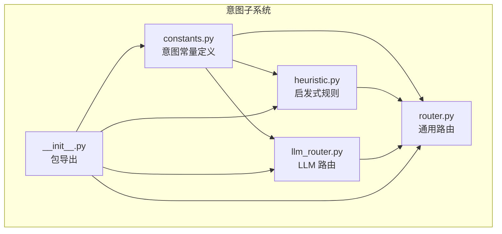
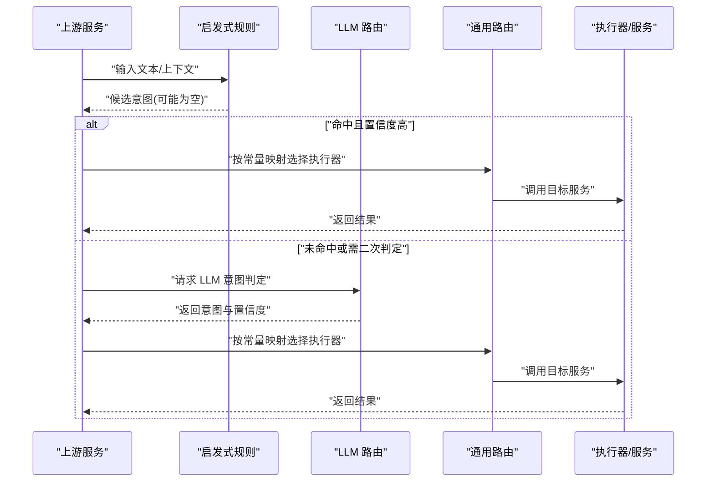
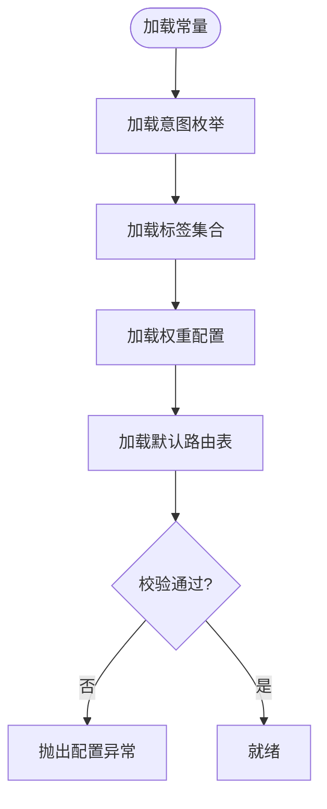
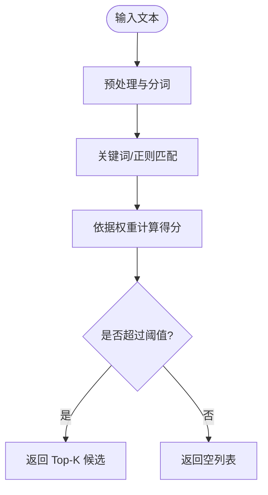
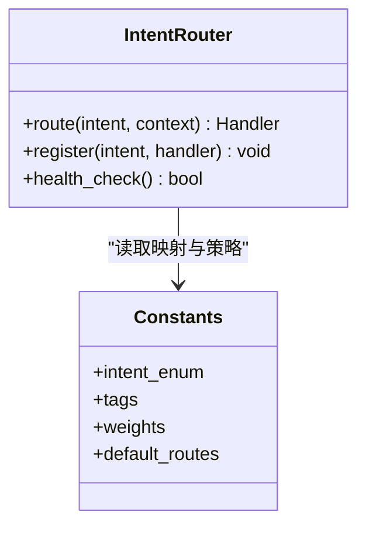
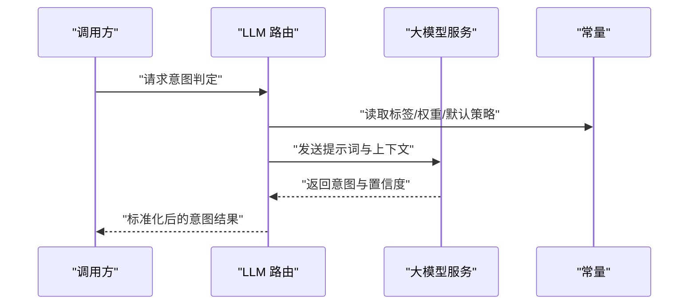
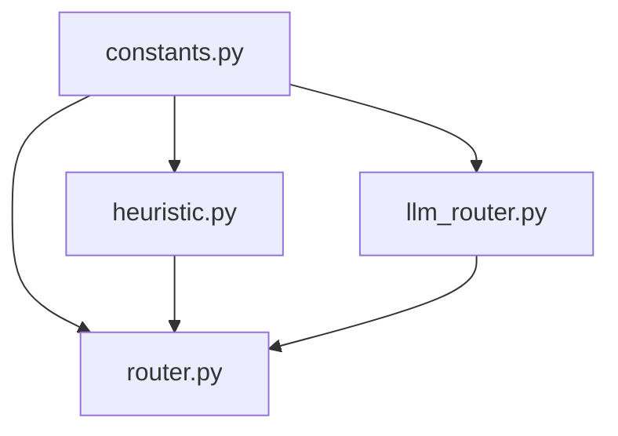

# 意图常量定义

<cite>
**本文引用的文件**   
- [backend_design/nexus/intent/constants.py](file://backend_design/nexus/intent/constants.py)
- [backend_design/nexus/intent/__init__.py](file://backend_design/nexus/intent/__init__.py)
- [backend_design/nexus/intent/router.py](file://backend_design/nexus/intent/router.py)
- [backend_design/nexus/intent/llm_router.py](file://backend_design/nexus/intent/llm_router.py)
- [backend_design/nexus/intent/heuristic.py](file://backend_design/nexus/intent/heuristic.py)
</cite>

## 目录
1. [简介](#简介)
2. [项目结构](#项目结构)
3. [核心组件](#核心组件)
4. [架构总览](#架构总览)
5. [详细组件分析](#详细组件分析)
6. [依赖关系分析](#依赖关系分析)
7. [性能考虑](#性能考虑)
8. [故障排查指南](#故障排查指南)
9. [结论](#结论)
10. [附录](#附录)

## 简介
本文件聚焦于“意图常量定义”的集中管理与使用规范，旨在为意图识别与路由子系统提供稳定、可维护的常量来源。通过统一的常量定义，确保意图分类、规则匹配与大模型路由等模块对意图标识保持一致性，降低耦合度并提升可测试性与可观测性。

## 项目结构
意图相关代码位于后端设计目录下的 intent 子包中，包含常量定义、启发式规则、LLM 路由以及通用路由器等模块。整体组织遵循“常量集中、逻辑分层”的原则：
- 常量层：集中定义所有意图枚举、标签、权重与默认策略
- 规则层：基于关键词、正则或业务规则的启发式匹配
- 路由层：将意图映射到具体执行器或服务
- LLM 路由：在复杂场景下借助大模型进行意图判定与分流

```mermaid
graph TB
subgraph "意图子系统"
C["constants.py<br/>意图常量定义"]
H["heuristic.py<br/>启发式规则"]
R["router.py<br/>通用路由"]
LR["llm_router.py<br/>LLM 路由"]
I["__init__.py<br/>包导出"]
end
C --> H
C --> R
C --> LR
H --> R
LR --> R
I --> C
I --> H
I --> R
I --> LR
```

图示来源
- [backend_design/nexus/intent/constants.py](file://backend_design/nexus/intent/constants.py)
- [backend_design/nexus/intent/heuristic.py](file://backend_design/nexus/intent/heuristic.py)
- [backend_design/nexus/intent/router.py](file://backend_design/nexus/intent/router.py)
- [backend_design/nexus/intent/llm_router.py](file://backend_design/nexus/intent/llm_router.py)
- [backend_design/nexus/intent/__init__.py](file://backend_design/nexus/intent/__init__.py)

章节来源
- [backend_design/nexus/intent/constants.py](file://backend_design/nexus/intent/constants.py)
- [backend_design/nexus/intent/__init__.py](file://backend_design/nexus/intent/__init__.py)
- [backend_design/nexus/intent/router.py](file://backend_design/nexus/intent/router.py)
- [backend_design/nexus/intent/llm_router.py](file://backend_design/nexus/intent/llm_router.py)
- [backend_design/nexus/intent/heuristic.py](file://backend_design/nexus/intent/heuristic.py)

## 核心组件
- 意图常量定义（constants）
  - 职责：集中管理意图枚举、标签集合、权重配置、默认路由策略与校验规则
  - 价值：避免硬编码字符串，统一命名空间，便于扩展与测试
- 启发式规则（heuristic）
  - 职责：基于关键词、正则或简单语义特征进行快速意图初筛
  - 价值：低延迟、高吞吐，适合热点意图的快速命中
- 通用路由（router）
  - 职责：根据常量定义的意图映射，选择对应处理器或服务
  - 价值：解耦意图与实现，支持多实现与动态注册
- LLM 路由（llm_router）
  - 职责：在复杂或模糊场景下调用大模型进行意图判断与分流
  - 价值：提高长尾意图识别准确率，兼顾降级策略

章节来源
- [backend_design/nexus/intent/constants.py](file://backend_design/nexus/intent/constants.py)
- [backend_design/nexus/intent/heuristic.py](file://backend_design/nexus/intent/heuristic.py)
- [backend_design/nexus/intent/router.py](file://backend_design/nexus/intent/router.py)
- [backend_design/nexus/intent/llm_router.py](file://backend_design/nexus/intent/llm_router.py)

## 架构总览
意图子系统采用“常量驱动 + 双路路由”的架构：常量作为单一事实源，启发式与 LLM 两条路径并行或串行协作，最终由通用路由分发至具体执行器。

```mermaid
sequenceDiagram
participant U as "上游服务"
participant H as "启发式规则"
participant L as "LLM 路由"
participant R as "通用路由"
participant S as "执行器/服务"
U->>H : "输入文本/上下文"
H-->>U : "候选意图(可能为空)"
alt "命中且置信度高"
U->>R : "按常量映射选择执行器"
R->>S : "调用目标服务"
S-->>U : "返回结果"
else "未命中或需二次判定"
U->>L : "请求 LLM 意图判定"
L-->>U : "返回意图与置信度"
U->>R : "按常量映射选择执行器"
R->>S : "调用目标服务"
S-->>U : "返回结果"
end
```

图示来源
- [backend_design/nexus/intent/heuristic.py](file://backend_design/nexus/intent/heuristic.py)
- [backend_design/nexus/intent/llm_router.py](file://backend_design/nexus/intent/llm_router.py)
- [backend_design/nexus/intent/router.py](file://backend_design/nexus/intent/router.py)
- [backend_design/nexus/intent/constants.py](file://backend_design/nexus/intent/constants.py)

## 详细组件分析

### 常量定义（constants）
- 设计要点
  - 使用强类型枚举表达意图类别，避免字符串散落在各处
  - 提供标签集合与权重字典，支撑启发式评分与排序
  - 定义默认路由表，将意图映射到处理器或服务名
  - 提供校验函数，确保新增意图时配置一致性
- 复杂度与可扩展性
  - 时间复杂度：O(1) 查找（哈希/枚举），O(n) 遍历（可选排序）
  - 空间复杂度：O(k)，k 为意图数量
  - 扩展方式：新增意图时同步更新枚举、标签、权重与路由表，并通过校验函数保证完整性
- 错误处理
  - 缺失键或非法值时抛出明确异常，便于定位配置问题
  - 提供回退策略（如默认意图或未知意图分支）

```mermaid
flowchart TD
Start(["加载常量"]) --> LoadEnum["加载意图枚举"]
LoadEnum --> LoadTags["加载标签集合"]
LoadTags --> LoadWeights["加载权重配置"]
LoadWeights --> LoadRouter["加载默认路由表"]
LoadRouter --> Validate{"校验通过?"}
Validate --> |否| RaiseErr["抛出配置异常"]
Validate --> |是| Ready["就绪"]
```

图示来源
- [backend_design/nexus/intent/constants.py](file://backend_design/nexus/intent/constants.py)

章节来源
- [backend_design/nexus/intent/constants.py](file://backend_design/nexus/intent/constants.py)

### 启发式规则（heuristic）
- 设计要点
  - 基于关键词与正则表达式进行快速匹配
  - 结合常量中的权重进行打分与排序
  - 支持阈值控制与多候选输出
- 复杂度与优化
  - 时间复杂度：O(m·n)，m 为规则数，n 为输入长度；可通过预编译正则与倒排索引优化
  - 空间复杂度：O(r)，r 为规则规模
- 错误处理
  - 规则解析失败时记录日志并跳过该规则
  - 无命中时返回空列表，交由上层决策

```mermaid
flowchart TD
In(["输入文本"]) --> Pre["预处理与分词"]
Pre --> Match["关键词/正则匹配"]
Match --> Score["依据权重计算得分"]
Score --> TopK{"是否超过阈值?"}
TopK --> |是| ReturnTop["返回 Top-K 候选"]
TopK --> |否| Empty["返回空列表"]
```

图示来源
- [backend_design/nexus/intent/heuristic.py](file://backend_design/nexus/intent/heuristic.py)
- [backend_design/nexus/intent/constants.py](file://backend_design/nexus/intent/constants.py)

章节来源
- [backend_design/nexus/intent/heuristic.py](file://backend_design/nexus/intent/heuristic.py)
- [backend_design/nexus/intent/constants.py](file://backend_design/nexus/intent/constants.py)

### 通用路由（router）
- 设计要点
  - 以常量中的路由表为依据，将意图映射到具体处理器或服务
  - 支持多实现注册与动态切换
  - 提供健康检查与降级策略
- 复杂度与可靠性
  - 时间复杂度：O(1) 路由查找
  - 可靠性：内置重试、熔断与超时控制（视集成情况）
- 错误处理
  - 未注册处理器时抛出明确异常
  - 服务不可用时触发降级或回退到默认意图

```mermaid
classDiagram
class IntentRouter {
+route(intent, context) Handler
+register(intent, handler) void
+health_check() bool
}
class Constants {
+intent_enum
+tags
+weights
+default_routes
}
IntentRouter --> Constants : "读取映射与策略"
```

图示来源
- [backend_design/nexus/intent/router.py](file://backend_design/nexus/intent/router.py)
- [backend_design/nexus/intent/constants.py](file://backend_design/nexus/intent/constants.py)

章节来源
- [backend_design/nexus/intent/router.py](file://backend_design/nexus/intent/router.py)
- [backend_design/nexus/intent/constants.py](file://backend_design/nexus/intent/constants.py)

### LLM 路由（llm_router）
- 设计要点
  - 在复杂或模糊场景下调用大模型进行意图判定
  - 结合常量中的标签与权重进行后处理与排序
  - 支持缓存与降级策略，保障稳定性
- 复杂度与成本
  - 时间复杂度：受 LLM 推理耗时影响，通常 O(t)，t 为推理时间
  - 成本控制：引入缓存、短路径优先与并发限制
- 错误处理
  - LLM 不可用或超时则回退到启发式或默认意图
  - 返回结构化结果，包含意图、置信度与解释字段

```mermaid
sequenceDiagram
participant C as "调用方"
participant LR as "LLM 路由"
participant LLM as "大模型服务"
participant CT as "常量"
C->>LR : "请求意图判定"
LR->>CT : "读取标签/权重/默认策略"
LR->>LLM : "发送提示词与上下文"
LLM-->>LR : "返回意图与置信度"
LR-->>C : "标准化后的意图结果"
```

图示来源
- [backend_design/nexus/intent/llm_router.py](file://backend_design/nexus/intent/llm_router.py)
- [backend_design/nexus/intent/constants.py](file://backend_design/nexus/intent/constants.py)

章节来源
- [backend_design/nexus/intent/llm_router.py](file://backend_design/nexus/intent/llm_router.py)
- [backend_design/nexus/intent/constants.py](file://backend_design/nexus/intent/constants.py)

### 包导出（__init__.py）
- 设计要点
  - 对外暴露常量、路由与工具函数，隐藏内部实现细节
  - 提供便捷导入入口，简化上层依赖
- 最佳实践
  - 仅导出必要接口，保持最小暴露面
  - 版本化变更时注意向后兼容

章节来源
- [backend_design/nexus/intent/__init__.py](file://backend_design/nexus/intent/__init__.py)

## 依赖关系分析
- 常量层被其他模块共同依赖，形成稳定的契约
- 启发式与 LLM 路由均依赖常量进行打分与映射
- 通用路由作为最终分发点，向上游屏蔽实现差异

```mermaid
graph TB
CT["constants.py"] --> HEU["heuristic.py"]
CT --> ROUTER["router.py"]
CT --> LLRR["llm_router.py"]
HEU --> ROUTER
LLRR --> ROUTER
```

图示来源
- [backend_design/nexus/intent/constants.py](file://backend_design/nexus/intent/constants.py)
- [backend_design/nexus/intent/heuristic.py](file://backend_design/nexus/intent/heuristic.py)
- [backend_design/nexus/intent/router.py](file://backend_design/nexus/intent/router.py)
- [backend_design/nexus/intent/llm_router.py](file://backend_design/nexus/intent/llm_router.py)

章节来源
- [backend_design/nexus/intent/constants.py](file://backend_design/nexus/intent/constants.py)
- [backend_design/nexus/intent/heuristic.py](file://backend_design/nexus/intent/heuristic.py)
- [backend_design/nexus/intent/router.py](file://backend_design/nexus/intent/router.py)
- [backend_design/nexus/intent/llm_router.py](file://backend_design/nexus/intent/llm_router.py)

## 性能考虑
- 常量查找应为 O(1)，避免在热路径中进行线性扫描
- 启发式规则建议预编译正则与构建倒排索引，降低匹配开销
- LLM 路由应启用缓存与并发控制，减少重复请求与资源争用
- 路由层应具备熔断与超时保护，防止级联故障

## 故障排查指南
- 常见问题
  - 新增意图未同步更新路由表或权重，导致路由失败或误判
  - 启发式规则冲突或优先级不当，造成候选排序异常
  - LLM 服务不可用或响应超时，未正确降级
- 排查步骤
  - 检查常量定义的一致性（枚举、标签、权重、路由表）
  - 验证启发式规则命中情况与得分分布
  - 查看 LLM 路由的缓存命中率与错误码
  - 确认路由器的健康检查与降级策略生效

章节来源
- [backend_design/nexus/intent/constants.py](file://backend_design/nexus/intent/constants.py)
- [backend_design/nexus/intent/heuristic.py](file://backend_design/nexus/intent/heuristic.py)
- [backend_design/nexus/intent/router.py](file://backend_design/nexus/intent/router.py)
- [backend_design/nexus/intent/llm_router.py](file://backend_design/nexus/intent/llm_router.py)

## 结论
通过将意图常量集中管理并与启发式、LLM 路由及通用路由紧密协作，系统实现了高内聚、低耦合的意图识别与分发机制。常量作为单一事实源，显著提升了可维护性与可测试性；双路路由在保证性能的同时提高了复杂场景的识别准确率。建议在持续演进中严格遵循常量驱动的约定，完善监控与告警，确保系统的稳定性与可扩展性。

## 附录
- 术语说明
  - 意图：用户输入所表达的业务目标或领域分类
  - 常量：集中管理的枚举、标签、权重与路由映射
  - 启发式：基于规则与统计的快速匹配方法
  - LLM 路由：利用大模型进行复杂意图判定的策略
- 参考路径
  - 常量定义：[backend_design/nexus/intent/constants.py](file://backend_design/nexus/intent/constants.py)
  - 启发式规则：[backend_design/nexus/intent/heuristic.py](file://backend_design/nexus/intent/heuristic.py)
  - 通用路由：[backend_design/nexus/intent/router.py](file://backend_design/nexus/intent/router.py)
  - LLM 路由：[backend_design/nexus/intent/llm_router.py](file://backend_design/nexus/intent/llm_router.py)
  - 包导出：[backend_design/nexus/intent/__init__.py](file://backend_design/nexus/intent/__init__.py)