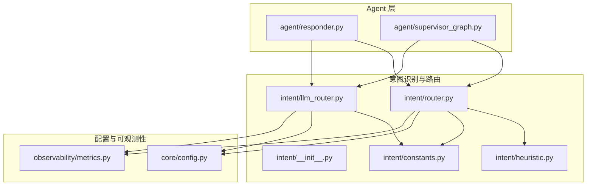
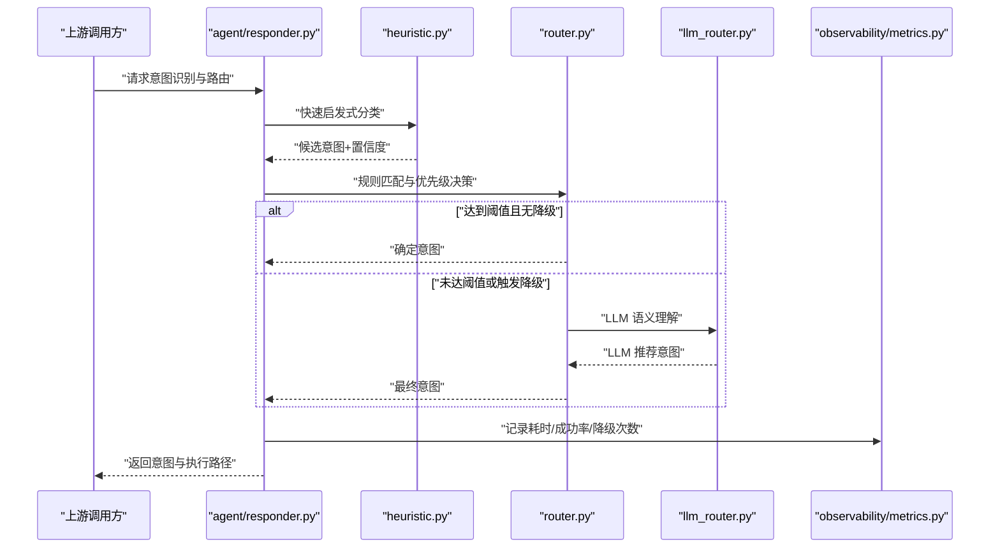
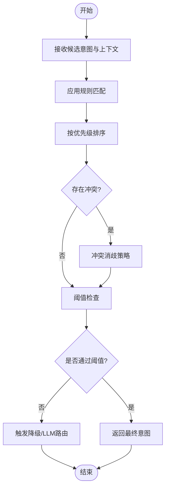
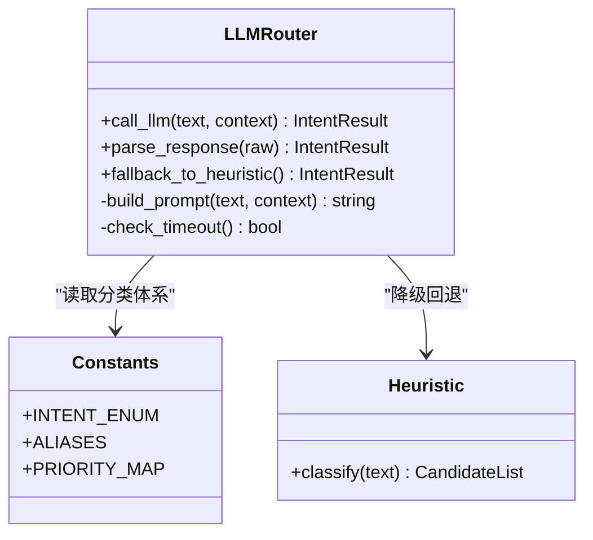
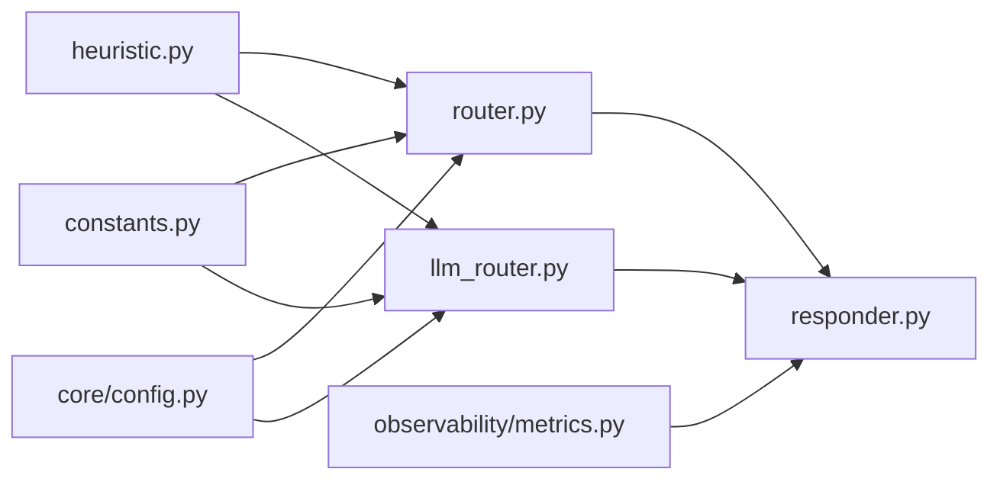

# 意图识别与路由

<cite>
**本文引用的文件**   
- [intent/__init__.py](file://backend_design/nexus/intent/__init__.py)
- [intent/constants.py](file://backend_design/nexus/intent/constants.py)
- [intent/heuristic.py](file://backend_design/nexus/intent/heuristic.py)
- [intent/router.py](file://backend_design/nexus/intent/router.py)
- [intent/llm_router.py](file://backend_design/nexus/intent/llm_router.py)
- [agent/responder.py](file://backend_design/nexus/agent/responder.py)
- [agent/supervisor_graph.py](file://backend_design/nexus/agent/supervisor_graph.py)
- [core/config.py](file://backend_design/nexus/core/config.py)
- [observability/metrics.py](file://backend_design/nexus/observability/metrics.py)
</cite>

## 目录
1. [简介](#简介)
2. [项目结构](#项目结构)
3. [核心组件](#核心组件)
4. [架构总览](#架构总览)
5. [详细组件分析](#详细组件分析)
6. [依赖关系分析](#依赖关系分析)
7. [性能考量](#性能考量)
8. [故障排查指南](#故障排查指南)
9. [结论](#结论)
10. [附录](#附录)

## 简介
本技术文档聚焦于 NexusCockpit AI Agent 系统中的“意图识别与路由”模块，系统性阐述其双重路由架构：传统规则路由器（Router）与大模型路由器（LLM Router）的协作机制。文档深入解释启发式算法（Heuristic）如何实现快速意图分类，以及 LLM 路由如何处理复杂语义理解；同时给出意图常量定义与分类体系、优先级策略、配置参数与性能优化建议，并配套提供路由流程图与决策树，帮助读者在不同场景下理解路由选择逻辑。

## 项目结构
意图识别与路由相关代码位于 backend_design/nexus/intent 目录下，包含以下关键文件：
- intent/__init__.py：模块入口与对外能力导出
- intent/constants.py：意图常量与分类体系
- intent/heuristic.py：基于关键词与规则的快速启发式分类器
- intent/router.py：传统规则路由器，负责确定性匹配与优先级调度
- intent/llm_router.py：大模型路由器，负责复杂语义理解与兜底分流

此外，Agent 层通过 responder.py 与 supervisor_graph.py 调用路由结果，配置项由 core/config.py 管理，可观测性指标由 observability/metrics.py 采集。

图表来源
- [intent/__init__.py](file://backend_design/nexus/intent/__init__.py)
- [intent/constants.py](file://backend_design/nexus/intent/constants.py)
- [intent/heuristic.py](file://backend_design/nexus/intent/heuristic.py)
- [intent/router.py](file://backend_design/nexus/intent/router.py)
- [intent/llm_router.py](file://backend_design/nexus/intent/llm_router.py)
- [agent/responder.py](file://backend_design/nexus/agent/responder.py)
- [agent/supervisor_graph.py](file://backend_design/nexus/agent/supervisor_graph.py)
- [core/config.py](file://backend_design/nexus/core/config.py)
- [observability/metrics.py](file://backend_design/nexus/observability/metrics.py)

章节来源
- [intent/__init__.py](file://backend_design/nexus/intent/__init__.py)
- [intent/constants.py](file://backend_design/nexus/intent/constants.py)
- [intent/heuristic.py](file://backend_design/nexus/intent/heuristic.py)
- [intent/router.py](file://backend_design/nexus/intent/router.py)
- [intent/llm_router.py](file://backend_design/nexus/intent/llm_router.py)
- [agent/responder.py](file://backend_design/nexus/agent/responder.py)
- [agent/supervisor_graph.py](file://backend_design/nexus/agent/supervisor_graph.py)
- [core/config.py](file://backend_design/nexus/core/config.py)
- [observability/metrics.py](file://backend_design/nexus/observability/metrics.py)

## 核心组件
- 意图常量与分类体系（constants.py）
  - 定义所有支持的意图类型、别名与层级关系，作为路由与后续处理的统一契约。
  - 提供优先级映射，用于在冲突时进行消歧与排序。
- 启发式分类器（heuristic.py）
  - 基于关键词、正则与简单规则实现快速分类，适合高频、明确意图的低延迟处理。
  - 输出候选意图及置信度评分，供上层做阈值判断或降级策略。
- 传统规则路由器（router.py）
  - 将启发式结果与规则库结合，按优先级与业务约束进行最终决策。
  - 支持多阶段匹配、条件分支与回退路径，保证确定性与可维护性。
- 大模型路由器（llm_router.py）
  - 针对模糊、复合或多轮上下文场景，调用 LLM 进行语义理解与意图推断。
  - 内置超时、熔断与降级策略，确保稳定性与可用性。
- 模块入口（__init__.py）
  - 暴露统一的意图识别与路由接口，屏蔽内部实现细节，便于上层集成。

章节来源
- [intent/constants.py](file://backend_design/nexus/intent/constants.py)
- [intent/heuristic.py](file://backend_design/nexus/intent/heuristic.py)
- [intent/router.py](file://backend_design/nexus/intent/router.py)
- [intent/llm_router.py](file://backend_design/nexus/intent/llm_router.py)
- [intent/__init__.py](file://backend_design/nexus/intent/__init__.py)

## 架构总览
双重路由架构的核心思想是“快慢结合、先快后慢、以快为主、以慢兜底”。整体流程如下：
- 输入文本进入路由管线
- 启发式分类器快速产出候选意图与置信度
- 规则路由器依据优先级与业务规则进行决策
- 若未达阈值或命中降级条件，则交由 LLM 路由器进行深度语义理解
- 最终输出目标意图与执行路径，并记录指标与日志

图表来源
- [agent/responder.py](file://backend_design/nexus/agent/responder.py)
- [intent/heuristic.py](file://backend_design/nexus/intent/heuristic.py)
- [intent/router.py](file://backend_design/nexus/intent/router.py)
- [intent/llm_router.py](file://backend_design/nexus/intent/llm_router.py)
- [observability/metrics.py](file://backend_design/nexus/observability/metrics.py)

## 详细组件分析

### 意图常量与分类体系（constants.py）
- 设计要点
  - 集中管理意图枚举、别名映射与层级关系，避免散落在各模块导致不一致。
  - 为每个意图定义优先级权重，用于冲突消歧与排序。
  - 提供扩展点，便于新增意图类型与领域知识。
- 使用方式
  - 启发式与规则路由器均读取该常量集进行匹配与校验。
  - LLM 路由器在提示词中引用该分类体系，以保证输出一致性。

章节来源
- [intent/constants.py](file://backend_design/nexus/intent/constants.py)

### 启发式分类器（heuristic.py）
- 设计要点
  - 基于关键词、正则表达式与简单规则进行快速匹配。
  - 输出候选意图列表及其置信度，支持阈值过滤与排序。
  - 对噪声与歧义具备一定鲁棒性，可通过规则调优提升准确率。
- 复杂度与性能
  - 时间复杂度近似 O(n·k)，n 为输入长度，k 为规则数量；空间复杂度较低。
  - 适合高并发与低延迟场景，常作为第一道筛选。
- 典型用法
  - 在 responder 中优先调用，若置信度高于阈值则直接返回。
  - 否则将候选结果传递给规则路由器进行二次确认。

章节来源
- [intent/heuristic.py](file://backend_design/nexus/intent/heuristic.py)

### 传统规则路由器（router.py）
- 设计要点
  - 整合启发式结果与业务规则，按优先级进行决策。
  - 支持多阶段匹配、条件分支与回退路径，保证确定性与可维护性。
  - 与配置中心联动，动态调整规则与阈值。
- 决策流程
  - 输入：候选意图、上下文信息、用户偏好等
  - 处理：规则匹配→优先级排序→冲突消歧→降级判断
  - 输出：最终意图与执行路径
- 错误处理
  - 对不满足条件的输入进行规范化与清洗。
  - 对异常规则或配置缺失进行告警与回退。

图表来源
- [intent/router.py](file://backend_design/nexus/intent/router.py)
- [intent/heuristic.py](file://backend_design/nexus/intent/heuristic.py)
- [intent/constants.py](file://backend_design/nexus/intent/constants.py)

章节来源
- [intent/router.py](file://backend_design/nexus/intent/router.py)
- [intent/constants.py](file://backend_design/nexus/intent/constants.py)

### 大模型路由器（llm_router.py）
- 设计要点
  - 针对模糊、复合或多轮上下文场景，调用 LLM 进行语义理解与意图推断。
  - 内置超时控制、熔断与降级策略，确保系统稳定性。
  - 与分类体系对齐，保证输出格式一致，便于下游消费。
- 调用流程
  - 输入：原始文本、上下文、启发式候选
  - 处理：构建提示词→调用 LLM→解析结果→置信度评估
  - 输出：推荐意图与置信度，供规则路由器合并决策
- 容错与降级
  - 超时或失败时回退到启发式最高置信度意图。
  - 记录失败原因与重试次数，便于监控与排障。

图表来源
- [intent/llm_router.py](file://backend_design/nexus/intent/llm_router.py)
- [intent/constants.py](file://backend_design/nexus/intent/constants.py)
- [intent/heuristic.py](file://backend_design/nexus/intent/heuristic.py)

章节来源
- [intent/llm_router.py](file://backend_design/nexus/intent/llm_router.py)
- [intent/constants.py](file://backend_design/nexus/intent/constants.py)
- [intent/heuristic.py](file://backend_design/nexus/intent/heuristic.py)

### 模块入口与上层集成（__init__.py、responder.py、supervisor_graph.py）
- __init__.py
  - 暴露统一的意图识别与路由接口，屏蔽内部实现细节。
- responder.py
  - 编排路由流程：先启发式，再规则，最后 LLM。
  - 收集指标与日志，上报至可观测性平台。
- supervisor_graph.py
  - 在更高层面协调多个专家节点与技能，根据路由结果选择执行路径。

章节来源
- [intent/__init__.py](file://backend_design/nexus/intent/__init__.py)
- [agent/responder.py](file://backend_design/nexus/agent/responder.py)
- [agent/supervisor_graph.py](file://backend_design/nexus/agent/supervisor_graph.py)

## 依赖关系分析
- 内部依赖
  - router.py 依赖 heuristic.py 与 constants.py
  - llm_router.py 依赖 constants.py，并在降级时依赖 heuristic.py
  - responder.py 与 supervisor_graph.py 依赖 router.py 与 llm_router.py
- 外部依赖
  - core/config.py：提供路由阈值、降级开关、超时等配置
  - observability/metrics.py：采集耗时、成功率、降级次数等指标

图表来源
- [intent/heuristic.py](file://backend_design/nexus/intent/heuristic.py)
- [intent/router.py](file://backend_design/nexus/intent/router.py)
- [intent/llm_router.py](file://backend_design/nexus/intent/llm_router.py)
- [intent/constants.py](file://backend_design/nexus/intent/constants.py)
- [agent/responder.py](file://backend_design/nexus/agent/responder.py)
- [core/config.py](file://backend_design/nexus/core/config.py)
- [observability/metrics.py](file://backend_design/nexus/observability/metrics.py)

章节来源
- [intent/heuristic.py](file://backend_design/nexus/intent/heuristic.py)
- [intent/router.py](file://backend_design/nexus/intent/router.py)
- [intent/llm_router.py](file://backend_design/nexus/intent/llm_router.py)
- [intent/constants.py](file://backend_design/nexus/intent/constants.py)
- [agent/responder.py](file://backend_design/nexus/agent/responder.py)
- [core/config.py](file://backend_design/nexus/core/config.py)
- [observability/metrics.py](file://backend_design/nexus/observability/metrics.py)

## 性能考量
- 启发式优先
  - 在高并发与低延迟场景下，尽量让启发式承担主要分流，减少 LLM 调用。
- 阈值与降级
  - 合理设置置信度阈值与降级开关，避免不必要的 LLM 调用。
- 超时与熔断
  - 为 LLM 调用设置超时与熔断，防止雪崩效应。
- 缓存与复用
  - 对常见意图与固定模式进行缓存，降低重复计算成本。
- 指标与监控
  - 采集关键指标（耗时、成功率、降级次数），持续优化阈值与规则。

[本节为通用指导，无需特定文件来源]

## 故障排查指南
- 常见问题
  - 启发式误判：检查关键词与正则规则，必要时引入上下文特征。
  - 规则冲突：审查优先级映射与消歧策略，确保唯一决策。
  - LLM 超时或失败：检查网络与配额，启用降级回退。
- 定位方法
  - 查看 metrics 中的耗时与失败率，定位瓶颈环节。
  - 核对 config 中的阈值与降级开关是否符合预期。
  - 对比 constants 中的分类体系是否与业务最新需求一致。

章节来源
- [observability/metrics.py](file://backend_design/nexus/observability/metrics.py)
- [core/config.py](file://backend_design/nexus/core/config.py)
- [intent/constants.py](file://backend_design/nexus/intent/constants.py)

## 结论
双重路由架构通过“启发式快速分类 + 规则精确决策 + LLM 语义兜底”的组合，兼顾了性能与准确性。合理的配置与监控能够进一步提升系统的稳定性与可维护性。建议在业务演进中持续完善分类体系与规则库，并结合指标反馈优化阈值与降级策略。

[本节为总结性内容，无需特定文件来源]

## 附录
- 术语说明
  - 意图：用户表达的目标或需求，如导航、车辆控制、健康咨询等。
  - 置信度：分类器对意图判断的可信程度，用于阈值判断与排序。
  - 降级：当主路径不可用时，自动切换到备用路径以保证可用性。
- 参考路径
  - 模块入口：[intent/__init__.py](file://backend_design/nexus/intent/__init__.py)
  - 常量定义：[intent/constants.py](file://backend_design/nexus/intent/constants.py)
  - 启发式分类：[intent/heuristic.py](file://backend_design/nexus/intent/heuristic.py)
  - 规则路由：[intent/router.py](file://backend_design/nexus/intent/router.py)
  - LLM 路由：[intent/llm_router.py](file://backend_design/nexus/intent/llm_router.py)
  - 上层集成：[agent/responder.py](file://backend_design/nexus/agent/responder.py)、[agent/supervisor_graph.py](file://backend_design/nexus/agent/supervisor_graph.py)
  - 配置与指标：[core/config.py](file://backend_design/nexus/core/config.py)、[observability/metrics.py](file://backend_design/nexus/observability/metrics.py)