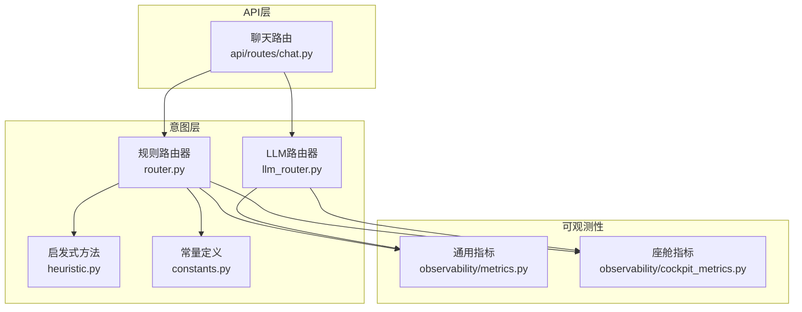
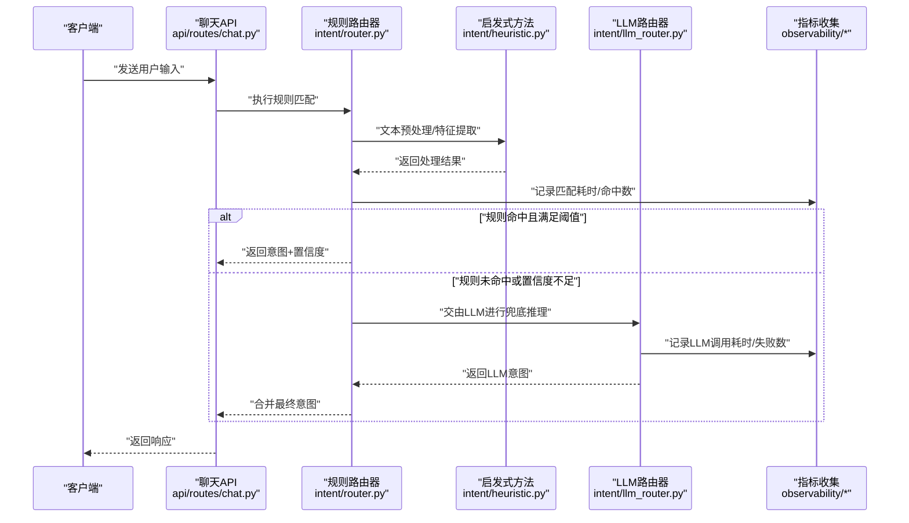
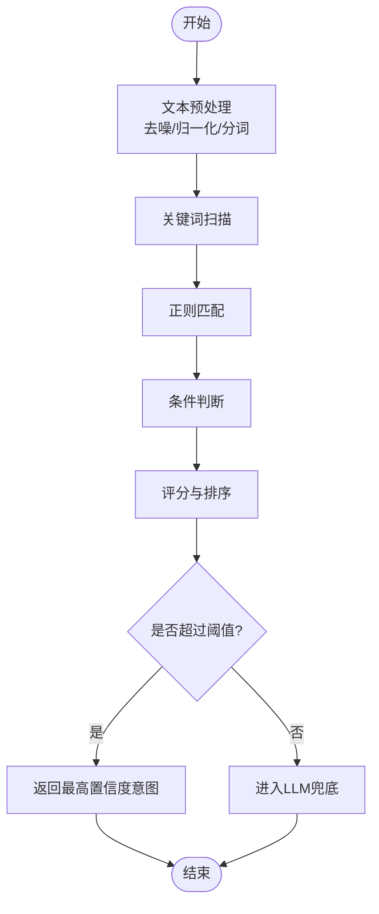
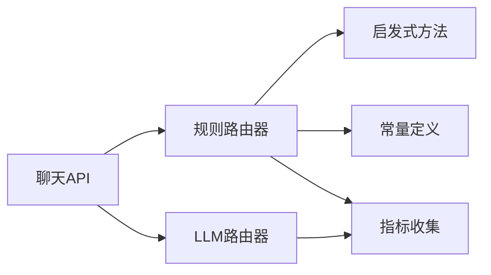

# 规则路由器

<cite>
**本文引用的文件**   
- [intent/router.py](file://backend_design/nexus/intent/router.py)
- [intent/llm_router.py](file://backend_design/nexus/intent/llm_router.py)
- [intent/heuristic.py](file://backend_design/nexus/intent/heuristic.py)
- [intent/constants.py](file://backend_design/nexus/intent/constants.py)
- [api/routes/chat.py](file://backend_design/nexus/api/routes/chat.py)
- [observability/metrics.py](file://backend_design/nexus/observability/metrics.py)
- [observability/cockpit_metrics.py](file://backend_design/nexus/observability/cockpit_metrics.py)
</cite>

## 目录
1. [简介](#简介)
2. [项目结构](#项目结构)
3. [核心组件](#核心组件)
4. [架构总览](#架构总览)
5. [详细组件分析](#详细组件分析)
6. [依赖分析](#依赖分析)
7. [性能考虑](#性能考虑)
8. [故障排查指南](#故障排查指南)
9. [结论](#结论)
10. [附录](#附录)

## 简介
本技术文档聚焦于NexusCockpit意图识别系统中的“传统规则路由器”（基于关键词、正则与条件判断的意图分类机制），围绕其实现原理、优先级配置、匹配算法、性能优化策略展开，并提供定义新规则的方法、测试手段以及常见场景的配置示例。同时给出调试工具与性能监控指标建议，帮助开发者高效优化路由效率。

## 项目结构
与规则路由器相关的代码主要位于后端Python模块中：
- 意图层：包含规则路由器、LLM路由器、启发式方法与常量定义
- API层：聊天接口调用意图路由
- 可观测性：通用指标与座舱相关指标

图表来源
- [intent/router.py](file://backend_design/nexus/intent/router.py)
- [intent/llm_router.py](file://backend_design/nexus/intent/llm_router.py)
- [intent/heuristic.py](file://backend_design/nexus/intent/heuristic.py)
- [intent/constants.py](file://backend_design/nexus/intent/constants.py)
- [api/routes/chat.py](file://backend_design/nexus/api/routes/chat.py)
- [observability/metrics.py](file://backend_design/nexus/observability/metrics.py)
- [observability/cockpit_metrics.py](file://backend_design/nexus/observability/cockpit_metrics.py)

章节来源
- [intent/router.py](file://backend_design/nexus/intent/router.py)
- [intent/llm_router.py](file://backend_design/nexus/intent/llm_router.py)
- [intent/heuristic.py](file://backend_design/nexus/intent/heuristic.py)
- [intent/constants.py](file://backend_design/nexus/intent/constants.py)
- [api/routes/chat.py](file://backend_design/nexus/api/routes/chat.py)
- [observability/metrics.py](file://backend_design/nexus/observability/metrics.py)
- [observability/cockpit_metrics.py](file://backend_design/nexus/observability/cockpit_metrics.py)

## 核心组件
- 规则路由器：负责基于关键词、正则表达式与条件判断进行意图分类，支持优先级排序与短路匹配，输出候选意图及置信度。
- LLM路由器：在规则无法明确决策时，作为兜底或增强路径，结合大模型进行意图推断。
- 启发式方法：提供文本预处理、特征提取、相似度计算等辅助能力，提升规则匹配稳定性。
- 常量定义：集中管理意图枚举、默认阈值、错误码等。
- API路由：将外部请求接入到意图路由流程，并记录指标。
- 可观测性：采集规则匹配耗时、命中率、降级次数等关键指标。

章节来源
- [intent/router.py](file://backend_design/nexus/intent/router.py)
- [intent/llm_router.py](file://backend_design/nexus/intent/llm_router.py)
- [intent/heuristic.py](file://backend_design/nexus/intent/heuristic.py)
- [intent/constants.py](file://backend_design/nexus/intent/constants.py)
- [api/routes/chat.py](file://backend_design/nexus/api/routes/chat.py)
- [observability/metrics.py](file://backend_design/nexus/observability/metrics.py)
- [observability/cockpit_metrics.py](file://backend_design/nexus/observability/cockpit_metrics.py)

## 架构总览
规则路由器在整体意图识别链路中的位置如下：

图表来源
- [api/routes/chat.py](file://backend_design/nexus/api/routes/chat.py)
- [intent/router.py](file://backend_design/nexus/intent/router.py)
- [intent/heuristic.py](file://backend_design/nexus/intent/heuristic.py)
- [intent/llm_router.py](file://backend_design/nexus/intent/llm_router.py)
- [observability/metrics.py](file://backend_design/nexus/observability/metrics.py)
- [observability/cockpit_metrics.py](file://backend_design/nexus/observability/cockpit_metrics.py)

## 详细组件分析

### 规则路由器（传统规则）
- 匹配机制
  - 关键词匹配：对输入文本进行分词或子串扫描，命中预设关键词集合即触发对应意图分支。
  - 正则表达式：使用预编译的正则模式进行复杂语义片段抽取，提高匹配精度。
  - 条件判断：结合上下文、用户偏好、设备状态等多维条件进行综合判定。
- 优先级配置
  - 规则按优先级排序，高优先级先匹配；支持短路逻辑，一旦命中达到阈值即可提前返回。
  - 同优先级内可按命中数量、置信度加权排序。
- 匹配算法
  - 多阶段流水线：预处理→关键词扫描→正则匹配→条件评估→排序与阈值过滤。
  - 启发式辅助：去噪、归一化、同义词扩展、停用词过滤等。
- 输出格式
  - 返回候选意图列表，每个候选包含意图标识、置信度、命中详情（用于调试）。
- 错误与边界
  - 空输入、超长输入、非法字符、正则异常等情况需有保护与降级策略。

图表来源
- [intent/router.py](file://backend_design/nexus/intent/router.py)
- [intent/heuristic.py](file://backend_design/nexus/intent/heuristic.py)

章节来源
- [intent/router.py](file://backend_design/nexus/intent/router.py)
- [intent/heuristic.py](file://backend_design/nexus/intent/heuristic.py)

### LLM路由器（兜底与增强）
- 作用
  - 当规则未命中或置信度不足时，调用大模型进行意图推断，提升长尾场景覆盖率。
- 集成点
  - 与规则路由器协作，形成“规则优先、LLM兜底”的双通道架构。
- 指标
  - 记录LLM调用成功率、延迟、超时重试等。

章节来源
- [intent/llm_router.py](file://backend_design/nexus/intent/llm_router.py)
- [observability/metrics.py](file://backend_design/nexus/observability/metrics.py)
- [observability/cockpit_metrics.py](file://backend_design/nexus/observability/cockpit_metrics.py)

### 常量与枚举
- 意图常量
  - 集中定义所有支持的意图标识、默认阈值、错误码等，便于统一管理与版本演进。
- 配置项
  - 包括规则开关、阈值参数、正则缓存大小等。

章节来源
- [intent/constants.py](file://backend_design/nexus/intent/constants.py)

### API接入与指标埋点
- 聊天API
  - 接收用户输入，调用意图路由，返回结构化响应。
- 指标埋点
  - 在路由入口与出口处记录耗时、命中/未命中计数、降级次数等。

章节来源
- [api/routes/chat.py](file://backend_design/nexus/api/routes/chat.py)
- [observability/metrics.py](file://backend_design/nexus/observability/metrics.py)
- [observability/cockpit_metrics.py](file://backend_design/nexus/observability/cockpit_metrics.py)

## 依赖分析
- 组件耦合
  - 规则路由器依赖启发式方法与常量；API路由依赖规则与LLM路由器；两者均依赖指标收集。
- 外部依赖
  - 正则库、文本处理库、大模型SDK（若启用）、指标上报系统。
- 潜在循环依赖
  - 通过分层设计避免直接循环；LLM路由器不反向依赖规则路由器。

图表来源
- [api/routes/chat.py](file://backend_design/nexus/api/routes/chat.py)
- [intent/router.py](file://backend_design/nexus/intent/router.py)
- [intent/llm_router.py](file://backend_design/nexus/intent/llm_router.py)
- [intent/heuristic.py](file://backend_design/nexus/intent/heuristic.py)
- [intent/constants.py](file://backend_design/nexus/intent/constants.py)
- [observability/metrics.py](file://backend_design/nexus/observability/metrics.py)

章节来源
- [api/routes/chat.py](file://backend_design/nexus/api/routes/chat.py)
- [intent/router.py](file://backend_design/nexus/intent/router.py)
- [intent/llm_router.py](file://backend_design/nexus/intent/llm_router.py)
- [intent/heuristic.py](file://backend_design/nexus/intent/heuristic.py)
- [intent/constants.py](file://backend_design/nexus/intent/constants.py)
- [observability/metrics.py](file://backend_design/nexus/observability/metrics.py)

## 性能考虑
- 正则预编译与缓存
  - 预编译常用正则，减少重复解析开销；为热点模式建立缓存表。
- 关键词索引
  - 使用倒排索引或Trie树加速关键词扫描，降低时间复杂度。
- 短路匹配
  - 高优先级规则命中后尽早返回，避免后续无谓计算。
- 批量与异步
  - 对非关键路径（如日志、指标上报）采用异步写入，避免阻塞主流程。
- 阈值调优
  - 根据业务场景动态调整置信度阈值，平衡准确率与召回率。
- 资源隔离
  - 规则引擎与LLM调用分离，防止大模型波动影响实时性。

[本节为通用性能指导，无需具体文件引用]

## 故障排查指南
- 常见问题定位
  - 规则未命中：检查关键词覆盖、正则模式、阈值设置。
  - 误判率高：审查条件判断逻辑与启发式预处理效果。
  - 性能退化：关注正则复杂度、关键词规模、缓存命中率。
- 调试工具建议
  - 单条输入回放：记录每条规则的命中详情与中间特征。
  - 规则变更对比：展示新旧规则集差异对命中分布的影响。
  - 可视化看板：展示各意图占比、平均耗时、失败率趋势。
- 指标与告警
  - 关键指标：规则匹配耗时P95/P99、命中率、降级比例、LLM调用失败率。
  - 告警阈值：当命中率骤降或耗时突增时触发告警。

章节来源
- [observability/metrics.py](file://backend_design/nexus/observability/metrics.py)
- [observability/cockpit_metrics.py](file://backend_design/nexus/observability/cockpit_metrics.py)

## 结论
规则路由器以“规则优先、LLM兜底”的策略，在保证低延迟与高稳定性的同时，兼顾了复杂场景的泛化能力。通过合理的优先级配置、高效的匹配算法与完善的指标体系，可实现意图识别的高可用与持续优化。

[本节为总结性内容，无需具体文件引用]

## 附录

### 如何定义新的路由规则
- 步骤概览
  - 新增意图常量：在常量文件中注册新意图标识与默认阈值。
  - 编写规则条目：定义关键词集合、正则表达式与条件判断逻辑。
  - 配置优先级：为新规则设置合适的优先级与权重。
  - 单元测试：构造典型用例，验证命中与未命中分支。
  - 灰度发布：在小流量环境观察指标，逐步放量。
- 规则语法要点
  - 关键词：支持精确词与同义词组。
  - 正则：建议使用命名捕获组，便于抽取槽位信息。
  - 条件：可结合上下文、用户画像、设备状态等。
- 测试方法
  - 回归测试：覆盖历史用例，确保规则变更不引入回退。
  - 压力测试：模拟高并发输入，评估吞吐与时延。
  - A/B实验：对比不同规则集的效果差异。

章节来源
- [intent/constants.py](file://backend_design/nexus/intent/constants.py)
- [intent/router.py](file://backend_design/nexus/intent/router.py)

### 常见意图场景的规则配置示例（说明性）
- 车辆控制
  - 关键词：空调、温度、风量、座椅加热、车窗
  - 正则：匹配数值范围与单位（如“调到22度”）
  - 条件：当前车辆状态、用户偏好、安全限制
- 导航查询
  - 关键词：导航、路线、目的地、附近
  - 正则：地址实体抽取、POI名称匹配
  - 条件：当前位置、交通状况、历史目的地
- 音乐播放
  - 关键词：播放、暂停、下一首、音量
  - 正则：歌曲名、歌手名、歌单名
  - 条件：当前播放状态、用户收藏、推荐策略

[本节为概念性示例，不直接分析具体文件]

### 规则调试与监控清单
- 调试清单
  - 输入文本标准化前后对比
  - 命中规则明细与置信度分布
  - 正则匹配耗时与失败原因
- 监控指标
  - 规则命中数/未命中数
  - 平均与分位数耗时
  - 降级至LLM的比例
  - 意图分布变化趋势

章节来源
- [observability/metrics.py](file://backend_design/nexus/observability/metrics.py)
- [observability/cockpit_metrics.py](file://backend_design/nexus/observability/cockpit_metrics.py)