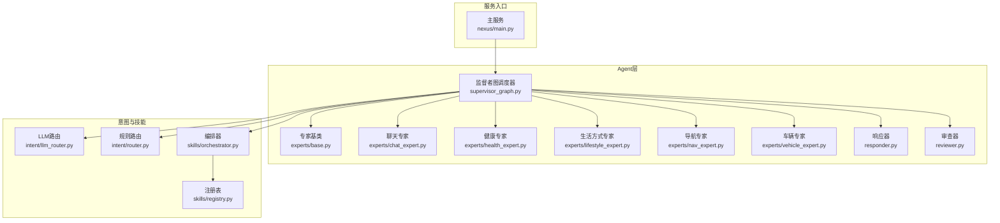
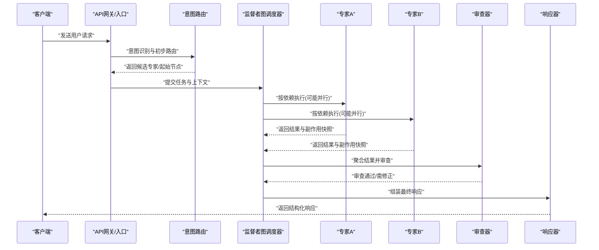
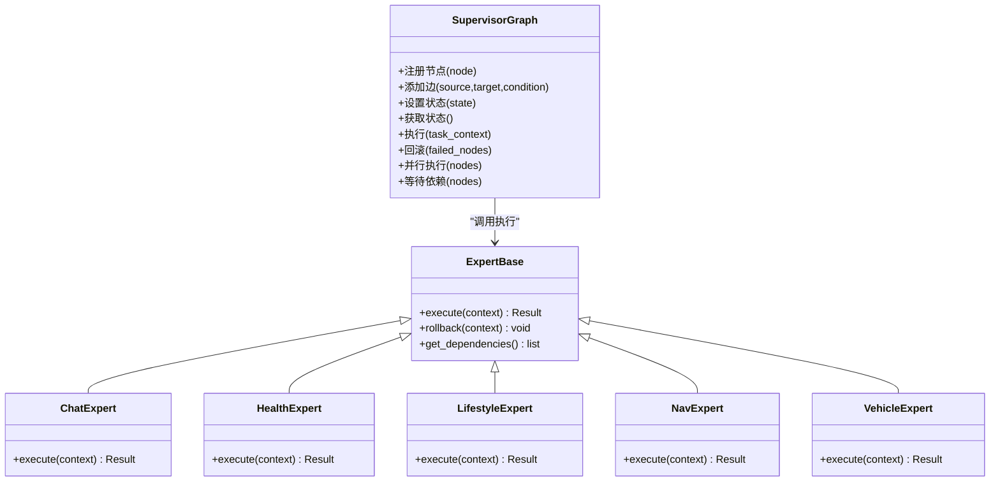
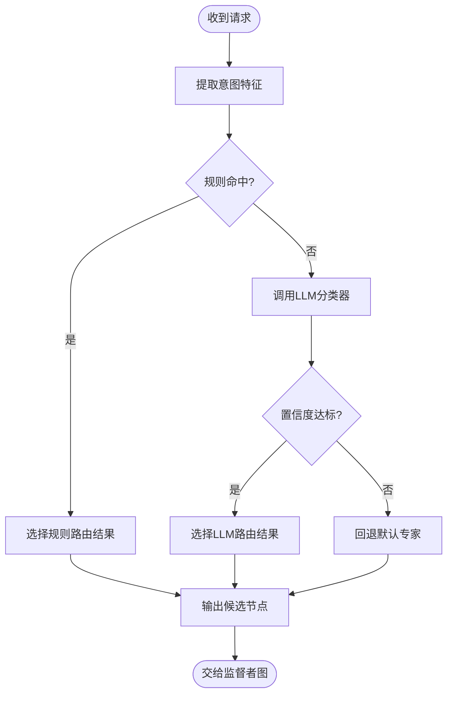
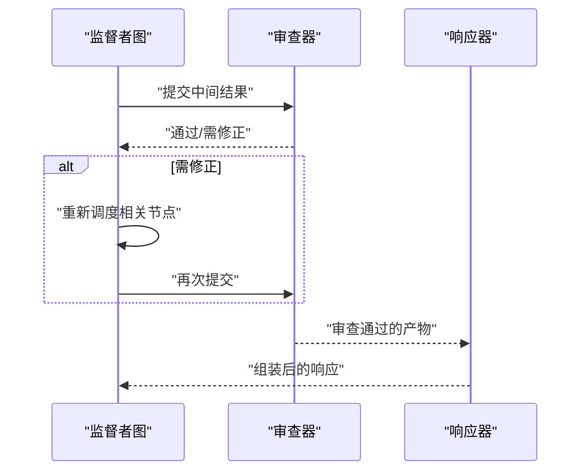
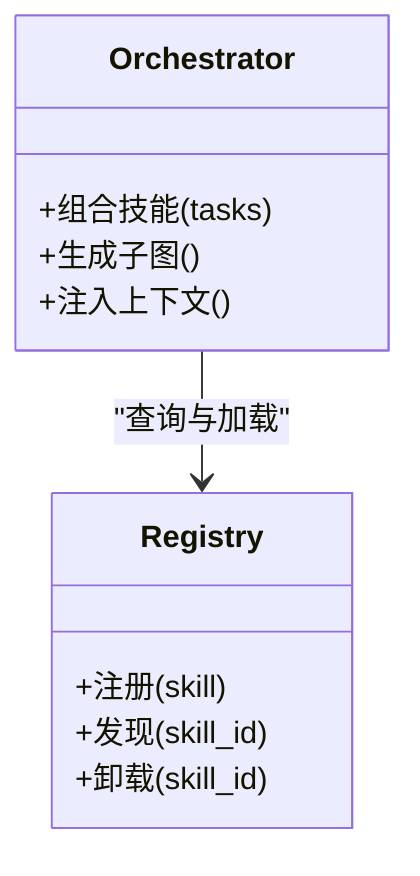
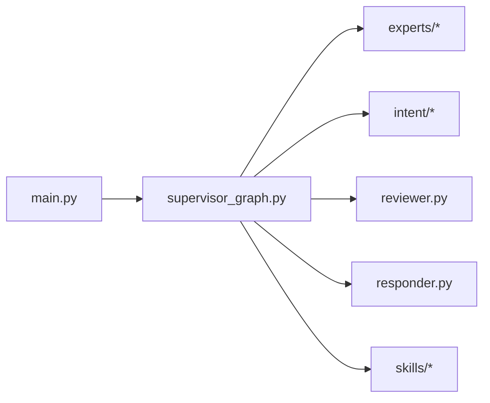
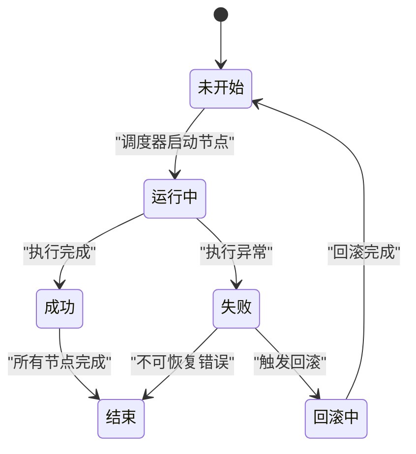

# 监督者图调度器

<cite>
**本文引用的文件**   
- [supervisor_graph.py](file://backend_design/nexus/agent/supervisor_graph.py)
- [base.py](file://backend_design/nexus/agent/experts/base.py)
- [chat_expert.py](file://backend_design/nexus/agent/experts/chat_expert.py)
- [health_expert.py](file://backend_design/nexus/agent/experts/health_expert.py)
- [lifestyle_expert.py](file://backend_design/nexus/agent/experts/lifestyle_expert.py)
- [nav_expert.py](file://backend_design/nexus/agent/experts/nav_expert.py)
- [vehicle_expert.py](file://backend_design/nexus/agent/experts/vehicle_expert.py)
- [responder.py](file://backend_design/nexus/agent/responder.py)
- [reviewer.py](file://backend_design/nexus/agent/reviewer.py)
- [llm_router.py](file://backend_design/nexus/intent/llm_router.py)
- [router.py](file://backend_design/nexus/intent/router.py)
- [constants.py](file://backend_design/nexus/intent/constants.py)
- [orchestrator.py](file://backend_design/nexus/skills/orchestrator.py)
- [registry.py](file://backend_design/nexus/skills/registry.py)
- [main.py](file://backend_design/nexus/main.py)
</cite>

## 目录
1. [简介](#简介)
2. [项目结构](#项目结构)
3. [核心组件](#核心组件)
4. [架构总览](#架构总览)
5. [详细组件分析](#详细组件分析)
6. [依赖关系分析](#依赖关系分析)
7. [性能考量](#性能考量)
8. [故障排查指南](#故障排查指南)
9. [结论](#结论)
10. [附录](#附录)

## 简介
本技术文档聚焦于NexusCockpit AI Agent系统中的“监督者图调度器”（Supervisor Graph Scheduler）。该调度器以有向图的形式编排多个专家模块（如聊天、健康、生活方式、导航、车辆等），通过状态机驱动节点执行，支持并行与依赖控制、错误处理与回滚、以及可扩展的边连接逻辑。文档将深入解析其核心架构设计、节点状态管理、边连接与流程控制机制，并给出完整的时序图与状态转换图，帮助读者从用户输入到最终响应的全链路理解调度过程。

## 项目结构
与监督者图调度器直接相关的代码主要位于后端Agent层与意图路由、技能编排等子系统中：
- 监督者图与调度核心：backend_design/nexus/agent/supervisor_graph.py
- 专家基类与各专家实现：backend_design/nexus/agent/experts/*.py
- 响应组装与审查：backend_design/nexus/agent/responder.py, reviewer.py
- 意图识别与路由：backend_design/nexus/intent/*.py
- 技能编排与注册：backend_design/nexus/skills/orchestrator.py, registry.py
- 服务入口与集成：backend_design/nexus/main.py

图表来源
- [supervisor_graph.py](file://backend_design/nexus/agent/supervisor_graph.py)
- [base.py](file://backend_design/nexus/agent/experts/base.py)
- [chat_expert.py](file://backend_design/nexus/agent/experts/chat_expert.py)
- [health_expert.py](file://backend_design/nexus/agent/experts/health_expert.py)
- [lifestyle_expert.py](file://backend_design/nexus/agent/experts/lifestyle_expert.py)
- [nav_expert.py](file://backend_design/nexus/agent/experts/nav_expert.py)
- [vehicle_expert.py](file://backend_design/nexus/agent/experts/vehicle_expert.py)
- [responder.py](file://backend_design/nexus/agent/responder.py)
- [reviewer.py](file://backend_design/nexus/agent/reviewer.py)
- [llm_router.py](file://backend_design/nexus/intent/llm_router.py)
- [router.py](file://backend_design/nexus/intent/router.py)
- [orchestrator.py](file://backend_design/nexus/skills/orchestrator.py)
- [registry.py](file://backend_design/nexus/skills/registry.py)
- [main.py](file://backend_design/nexus/main.py)

章节来源
- [supervisor_graph.py](file://backend_design/nexus/agent/supervisor_graph.py)
- [base.py](file://backend_design/nexus/agent/experts/base.py)
- [responder.py](file://backend_design/nexus/agent/responder.py)
- [reviewer.py](file://backend_design/nexus/agent/reviewer.py)
- [llm_router.py](file://backend_design/nexus/intent/llm_router.py)
- [router.py](file://backend_design/nexus/intent/router.py)
- [orchestrator.py](file://backend_design/nexus/skills/orchestrator.py)
- [registry.py](file://backend_design/nexus/skills/registry.py)
- [main.py](file://backend_design/nexus/main.py)

## 核心组件
- 监督者图调度器：负责构建节点集合、定义边与条件分支、维护全局状态、协调专家执行顺序、处理并发与依赖、触发审查与响应组装。
- 专家基类与各专家：提供统一的执行接口与上下文传递；各专家封装领域能力（聊天、健康、生活方式、导航、车辆）。
- 意图路由：在请求进入时进行意图识别与初步路由，辅助监督者图选择起始节点或关键路径。
- 响应器与审查器：对专家输出进行聚合、格式化与质量审查，确保最终响应的完整性与一致性。
- 技能编排与注册：为扩展新能力提供注册与编排机制，便于与监督者图协同工作。

章节来源
- [supervisor_graph.py](file://backend_design/nexus/agent/supervisor_graph.py)
- [base.py](file://backend_design/nexus/agent/experts/base.py)
- [chat_expert.py](file://backend_design/nexus/agent/experts/chat_expert.py)
- [health_expert.py](file://backend_design/nexus/agent/experts/health_expert.py)
- [lifestyle_expert.py](file://backend_design/nexus/agent/experts/lifestyle_expert.py)
- [nav_expert.py](file://backend_design/nexus/agent/experts/nav_expert.py)
- [vehicle_expert.py](file://backend_design/nexus/agent/experts/vehicle_expert.py)
- [responder.py](file://backend_design/nexus/agent/responder.py)
- [reviewer.py](file://backend_design/nexus/agent/reviewer.py)
- [llm_router.py](file://backend_design/nexus/intent/llm_router.py)
- [router.py](file://backend_design/nexus/intent/router.py)
- [orchestrator.py](file://backend_design/nexus/skills/orchestrator.py)
- [registry.py](file://backend_design/nexus/skills/registry.py)

## 架构总览
监督者图调度器采用“图+状态机”的架构模式：
- 节点：每个专家为一个节点，具备输入/输出契约与副作用清理能力。
- 边：表示节点间的依赖与流转条件，可基于上下文动态判定。
- 状态机：维护当前节点、已执行节点、待执行队列、错误与回滚标记。
- 并发控制：根据边依赖关系计算可并行执行的节点集合，避免资源竞争。
- 错误处理：捕获异常、记录日志、触发回滚、降级策略与重试。
- 扩展点：新增专家与边连接通过注册与配置完成，无需修改核心调度逻辑。

图表来源
- [supervisor_graph.py](file://backend_design/nexus/agent/supervisor_graph.py)
- [llm_router.py](file://backend_design/nexus/intent/llm_router.py)
- [router.py](file://backend_design/nexus/intent/router.py)
- [reviewer.py](file://backend_design/nexus/agent/reviewer.py)
- [responder.py](file://backend_design/nexus/agent/responder.py)

## 详细组件分析

### 监督者图调度器（Supervisor Graph）
- 职责
  - 构建图：注册节点（专家）、定义边（依赖与条件）、初始化状态机。
  - 调度执行：依据依赖拓扑与并发策略推进节点执行。
  - 状态管理：维护节点状态（未开始、运行中、成功、失败、跳过、回滚中）。
  - 错误与回滚：捕获异常、保存副作用快照、按反向拓扑执行回滚。
  - 扩展与配置：提供边条件函数、节点参数注入、超时与重试策略。
- 关键设计
  - 节点抽象：统一执行接口，支持异步执行与副作用清理。
  - 边条件：基于上下文动态决定跳转目标，支持短路、重试与降级。
  - 并发模型：根据DAG计算最大并行度，避免死锁与资源争用。
  - 可观测性：记录节点执行耗时、错误码、上下文快照，便于追踪与诊断。

图表来源
- [supervisor_graph.py](file://backend_design/nexus/agent/supervisor_graph.py)
- [base.py](file://backend_design/nexus/agent/experts/base.py)
- [chat_expert.py](file://backend_design/nexus/agent/experts/chat_expert.py)
- [health_expert.py](file://backend_design/nexus/agent/experts/health_expert.py)
- [lifestyle_expert.py](file://backend_design/nexus/agent/experts/lifestyle_expert.py)
- [nav_expert.py](file://backend_design/nexus/agent/experts/nav_expert.py)
- [vehicle_expert.py](file://backend_design/nexus/agent/experts/vehicle_expert.py)

章节来源
- [supervisor_graph.py](file://backend_design/nexus/agent/supervisor_graph.py)
- [base.py](file://backend_design/nexus/agent/experts/base.py)
- [chat_expert.py](file://backend_design/nexus/agent/experts/chat_expert.py)
- [health_expert.py](file://backend_design/nexus/agent/experts/health_expert.py)
- [lifestyle_expert.py](file://backend_design/nexus/agent/experts/lifestyle_expert.py)
- [nav_expert.py](file://backend_design/nexus/agent/experts/nav_expert.py)
- [vehicle_expert.py](file://backend_design/nexus/agent/experts/vehicle_expert.py)

### 意图路由与启动决策
- 作用
  - 在请求进入阶段快速识别意图，推荐起始专家或子图。
  - 结合规则与LLM判断，降低监督者图的初始搜索空间。
- 关键点
  - 规则路由：基于关键词、实体抽取与阈值匹配。
  - LLM路由：使用轻量提示词与分类模型进行意图判别。
  - 输出：返回候选节点列表与置信度，供监督者图选择最优起点。

图表来源
- [llm_router.py](file://backend_design/nexus/intent/llm_router.py)
- [router.py](file://backend_design/nexus/intent/router.py)
- [constants.py](file://backend_design/nexus/intent/constants.py)

章节来源
- [llm_router.py](file://backend_design/nexus/intent/llm_router.py)
- [router.py](file://backend_design/nexus/intent/router.py)
- [constants.py](file://backend_design/nexus/intent/constants.py)

### 响应器与审查器
- 响应器
  - 聚合多专家输出，按模板或策略合并信息。
  - 处理流式输出与增量更新，提升用户体验。
- 审查器
  - 校验输出完整性、敏感信息与合规性。
  - 触发修正流程或降级策略，保证最终质量。

图表来源
- [reviewer.py](file://backend_design/nexus/agent/reviewer.py)
- [responder.py](file://backend_design/nexus/agent/responder.py)

章节来源
- [reviewer.py](file://backend_design/nexus/agent/reviewer.py)
- [responder.py](file://backend_design/nexus/agent/responder.py)

### 技能编排与注册
- 编排器
  - 将多个技能组合成可复用的流程片段，供监督者图复用。
- 注册表
  - 集中管理技能元数据与版本，支持热插拔与灰度发布。

图表来源
- [orchestrator.py](file://backend_design/nexus/skills/orchestrator.py)
- [registry.py](file://backend_design/nexus/skills/registry.py)

章节来源
- [orchestrator.py](file://backend_design/nexus/skills/orchestrator.py)
- [registry.py](file://backend_design/nexus/skills/registry.py)

## 依赖关系分析
- 内部依赖
  - 监督者图依赖专家基类与各专家实现。
  - 意图路由为监督者图提供启动建议。
  - 响应器与审查器处于执行链末端，保障输出质量。
  - 技能编排与注册为扩展提供基础设施。
- 外部依赖
  - LLM服务用于意图分类与复杂推理。
  - 存储与缓存用于上下文持久化与加速。
  - 可观测性工具用于指标采集与日志追踪。

图表来源
- [main.py](file://backend_design/nexus/main.py)
- [supervisor_graph.py](file://backend_design/nexus/agent/supervisor_graph.py)
- [base.py](file://backend_design/nexus/agent/experts/base.py)
- [llm_router.py](file://backend_design/nexus/intent/llm_router.py)
- [reviewer.py](file://backend_design/nexus/agent/reviewer.py)
- [responder.py](file://backend_design/nexus/agent/responder.py)
- [orchestrator.py](file://backend_design/nexus/skills/orchestrator.py)

章节来源
- [main.py](file://backend_design/nexus/main.py)
- [supervisor_graph.py](file://backend_design/nexus/agent/supervisor_graph.py)
- [base.py](file://backend_design/nexus/agent/experts/base.py)
- [llm_router.py](file://backend_design/nexus/intent/llm_router.py)
- [reviewer.py](file://backend_design/nexus/agent/reviewer.py)
- [responder.py](file://backend_design/nexus/agent/responder.py)
- [orchestrator.py](file://backend_design/nexus/skills/orchestrator.py)

## 性能考量
- 并发与并行
  - 基于DAG的最大并行度计算，避免过度并发导致资源耗尽。
  - 对I/O密集型专家启用异步执行，减少阻塞。
- 缓存与去重
  - 对重复查询与相似请求进行缓存，降低LLM与外部服务压力。
- 超时与重试
  - 为长耗时节点设置超时与指数退避重试，提高鲁棒性。
- 资源隔离
  - 不同专家可绑定线程池或进程池，防止相互影响。
- 可观测性
  - 记录节点执行时间、错误率与吞吐，支撑容量规划与优化。

[本节为通用指导，不直接分析具体文件]

## 故障排查指南
- 常见问题
  - 节点执行超时：检查专家实现中的外部调用与并发限制。
  - 边条件不生效：确认上下文字段是否完整、条件函数是否正确。
  - 回滚失败：验证副作用快照是否保存、回滚顺序是否符合反向拓扑。
  - 审查失败：查看审查规则与降级策略，定位缺失字段或敏感内容。
- 诊断步骤
  - 启用详细日志与追踪ID，关联一次请求的全链路。
  - 检查意图路由的输出与置信度，必要时调整阈值或提示词。
  - 使用可观测性面板查看节点耗时分布与错误热点。
- 恢复策略
  - 自动重试与降级：对非关键路径采用降级策略，保证核心功能可用。
  - 人工介入：当多次重试失败时，转交人工审核或提示用户澄清。

章节来源
- [supervisor_graph.py](file://backend_design/nexus/agent/supervisor_graph.py)
- [reviewer.py](file://backend_design/nexus/agent/reviewer.py)
- [responder.py](file://backend_design/nexus/agent/responder.py)

## 结论
监督者图调度器通过“图+状态机”的方式，将复杂的AI Agent流程解耦为可组合、可观测、可回滚的节点与边。借助意图路由、响应器与审查器的协作，系统能够在保证质量的前提下高效执行多专家并行任务。通过注册与编排机制，新能力可以快速接入并保持与现有流程的无缝集成。

[本节为总结性内容，不直接分析具体文件]

## 附录

### 配置选项与自定义扩展
- 配置项
  - 节点超时与重试策略：为不同专家设置差异化超时与重试次数。
  - 并发上限：限制全局或分组的最大并行度。
  - 边条件函数：基于上下文动态决定跳转目标。
  - 审查规则：定义输出完整性、敏感信息与合规性检查。
- 扩展方法
  - 新增专家：继承专家基类，实现执行与回滚接口，并在图中注册。
  - 新增边：定义源节点、目标节点与条件函数，支持短路、重试与降级。
  - 编排子图：将常用流程封装为子图，供监督者图复用。
  - 注册技能：在注册表中登记技能元数据，支持热插拔与灰度发布。

章节来源
- [supervisor_graph.py](file://backend_design/nexus/agent/supervisor_graph.py)
- [base.py](file://backend_design/nexus/agent/experts/base.py)
- [orchestrator.py](file://backend_design/nexus/skills/orchestrator.py)
- [registry.py](file://backend_design/nexus/skills/registry.py)

### 状态转换图（概念示意）

[此图为概念示意，不直接映射具体源码文件]