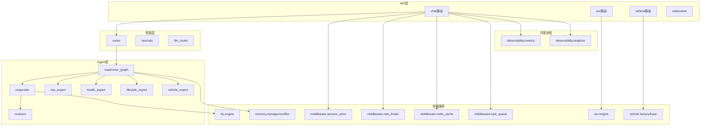
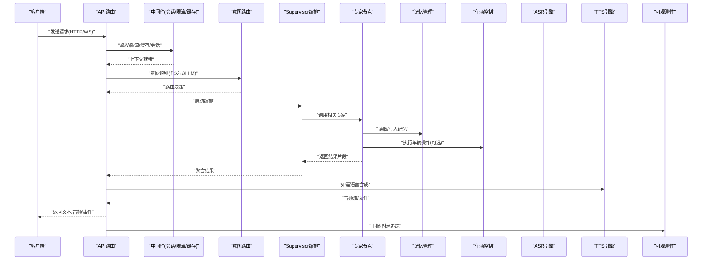
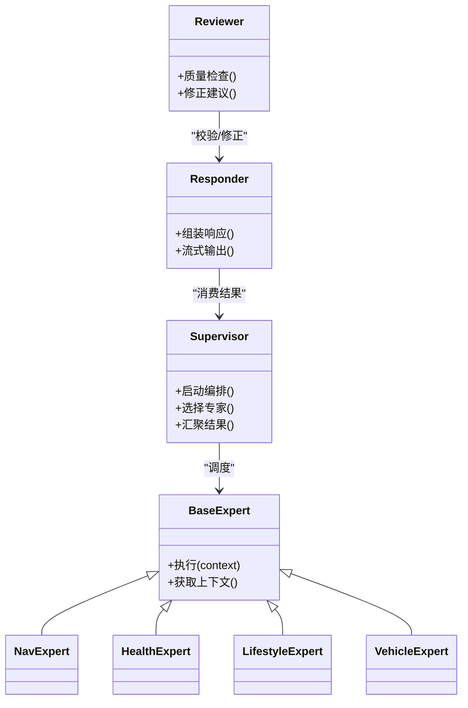
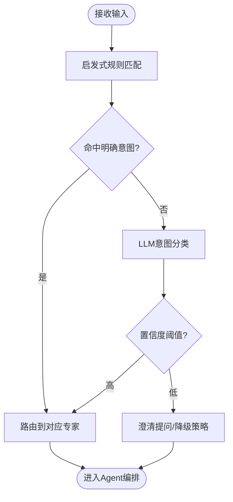
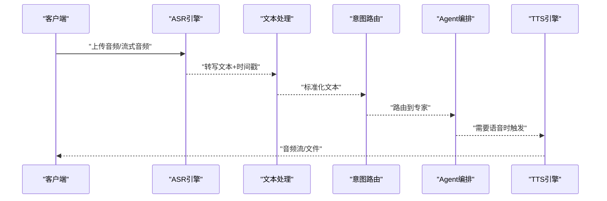
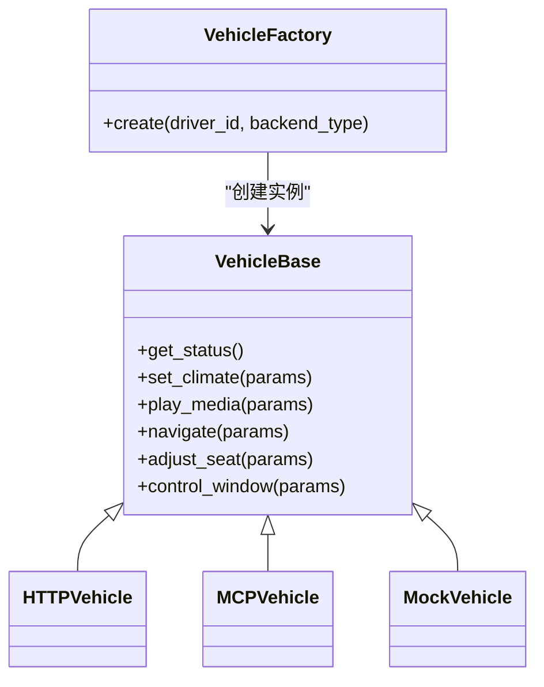
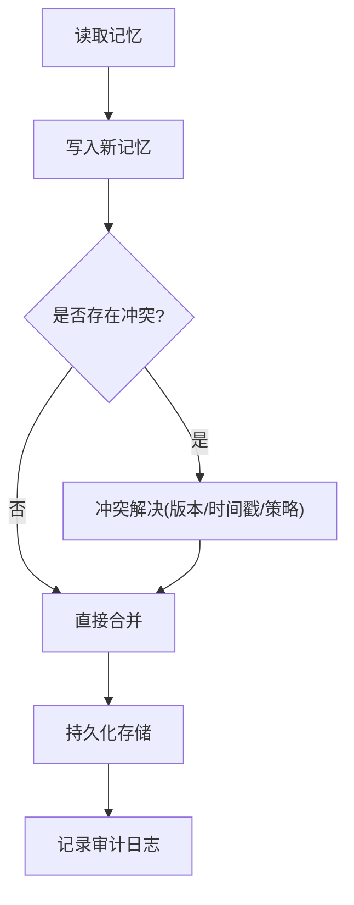
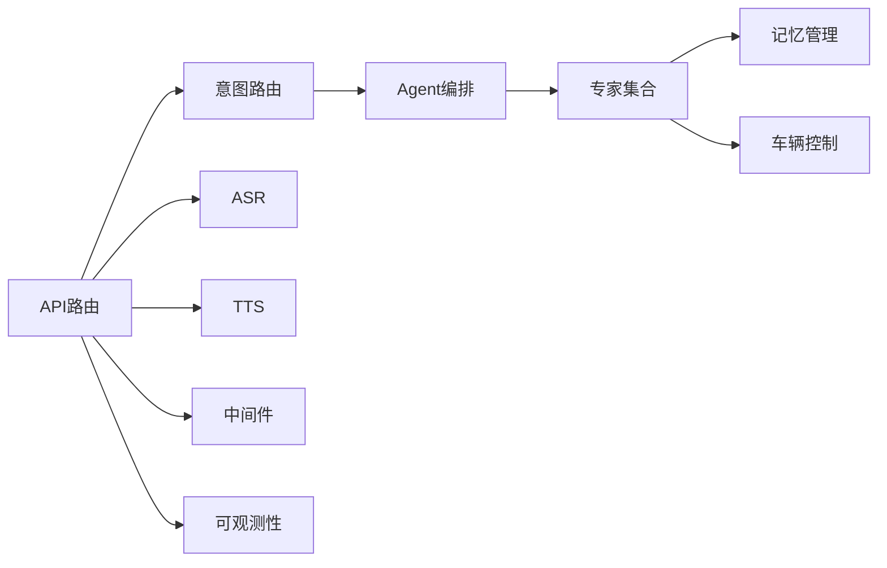

# 核心模块设计

<cite>
**本文引用的文件**   
- [backend_design/nexus/main.py](file://backend_design/nexus/main.py)
- [backend_design/nexus/config.py](file://backend_design/nexus/config.py)
- [backend_design/nexus/core/cockpit_manager.py](file://backend_design/nexus/core/cockpit_manager.py)
- [backend_design/nexus/api/routes/chat.py](file://backend_design/nexus/api/routes/chat.py)
- [backend_design/nexus/api/routes/asr.py](file://backend_design/nexus/api/routes/asr.py)
- [backend_design/nexus/api/routes/vehicle.py](file://backend_design/nexus/api/routes/vehicle.py)
- [backend_design/nexus/api/websocket.py](file://backend_design/nexus/api/websocket.py)
- [backend_design/nexus/intent/router.py](file://backend_design/nexus/intent/router.py)
- [backend_design/nexus/intent/heuristic.py](file://backend_design/nexus/intent/heuristic.py)
- [backend_design/nexus/intent/llm_router.py](file://backend_design/nexus/intent/llm_router.py)
- [backend_design/nexus/agent/responder.py](file://backend_design/nexus/agent/responder.py)
- [backend_design/nexus/agent/reviewer.py](file://backend_design/nexus/agent/reviewer.py)
- [backend_design/nexus/agent/supervisor_graph.py](file://backend_design/nexus/agent/supervisor_graph.py)
- [backend_design/nexus/agent/experts/base.py](file://backend_design/nexus/agent/experts/base.py)
- [backend_design/nexus/agent/experts/nav_expert.py](file://backend_design/nexus/agent/experts/nav_expert.py)
- [backend_design/nexus/agent/experts/health_expert.py](file://backend_design/nexus/agent/experts/health_expert.py)
- [backend_design/nexus/agent/experts/lifestyle_expert.py](file://backend_design/nexus/agent/experts/lifestyle_expert.py)
- [backend_design/nexus/agent/experts/vehicle_expert.py](file://backend_design/nexus/agent/experts/vehicle_expert.py)
- [backend_design/nexus/memory/manager.py](file://backend_design/nexus/memory/manager.py)
- [backend_design/nexus/memory/conflict.py](file://backend_design/nexus/memory/conflict.py)
- [backend_design/nexus/asr/engine.py](file://backend_design/nexus/asr/engine.py)
- [backend_design/nexus/tts/engine.py](file://backend_design/nexus/tts/engine.py)
- [backend_design/nexus/vehicle/base.py](file://backend_design/nexus/vehicle/base.py)
- [backend_design/nexus/vehicle/factory.py](file://backend_design/nexus/vehicle/factory.py)
- [backend_design/nexus/vehicle/http.py](file://backend_design/nexus/vehicle/http.py)
- [backend_design/nexus/vehicle/mcp.py](file://backend_design/nexus/vehicle/mcp.py)
- [backend_design/nexus/vehicle/mock.py](file://backend_design/nexus/vehicle/mock.py)
- [backend_design/nexus/models/state.py](file://backend_design/nexus/models/state.py)
- [backend_design/nexus/models/schemas.py](file://backend_design/nexus/models/schemas.py)
- [backend_design/nexus/middleware/session_store.py](file://backend_design/nexus/middleware/session_store.py)
- [backend_design/nexus/middleware/rate_limiter.py](file://backend_design/nexus/middleware/rate_limiter.py)
- [backend_design/nexus/middleware/redis_cache.py](file://backend_design/nexus/middleware/redis_cache.py)
- [backend_design/nexus/middleware/task_queue.py](file://backend_design/nexus/middleware/task_queue.py]
- [backend_design/nexus/observability/metrics.py](file://backend_design/nexus/observability/metrics.py)
- [backend_design/nexus/observability/langfuse.py](file://backend_design/nexus/observability/langfuse.py)
</cite>

## 目录
1. [引言](#引言)
2. [项目结构](#项目结构)
3. [核心组件](#核心组件)
4. [架构总览](#架构总览)
5. [详细组件分析](#详细组件分析)
6. [依赖关系分析](#依赖关系分析)
7. [性能考量](#性能考量)
8. [故障排查指南](#故障排查指南)
9. [结论](#结论)
10. [附录](#附录)

## 引言
本设计文档聚焦NexusCockpit后端核心模块，围绕AI Agent系统、语音处理系统、车辆控制系统与记忆管理系统展开，解释多专家协作机制（意图识别、路由策略、响应生成）、语音处理流水线（ASR到TTS）、车辆控制抽象层统一接口、用户记忆数据结构与冲突解决机制。同时提供模块间依赖关系图与交互时序图，帮助开发者快速理解整体运作方式。

## 项目结构
后端采用分层与领域划分相结合的组织方式：
- API层：HTTP/WebSocket路由与协议适配
- 意图层：启发式与LLM混合路由
- Agent层：多专家协作编排与审查
- 领域服务：ASR/TTS、车辆控制、记忆管理、会话与中间件
- 可观测性：指标、追踪与数据保留

图表来源
- [backend_design/nexus/api/routes/chat.py](file://backend_design/nexus/api/routes/chat.py)
- [backend_design/nexus/api/routes/asr.py](file://backend_design/nexus/api/routes/asr.py)
- [backend_design/nexus/api/routes/vehicle.py](file://backend_design/nexus/api/routes/vehicle.py)
- [backend_design/nexus/api/websocket.py](file://backend_design/nexus/api/websocket.py)
- [backend_design/nexus/intent/router.py](file://backend_design/nexus/intent/router.py)
- [backend_design/nexus/intent/heuristic.py](file://backend_design/nexus/intent/heuristic.py)
- [backend_design/nexus/intent/llm_router.py](file://backend_design/nexus/intent/llm_router.py)
- [backend_design/nexus/agent/supervisor_graph.py](file://backend_design/nexus/agent/supervisor_graph.py)
- [backend_design/nexus/agent/responder.py](file://backend_design/nexus/agent/responder.py)
- [backend_design/nexus/agent/reviewer.py](file://backend_design/nexus/agent/reviewer.py)
- [backend_design/nexus/agent/experts/nav_expert.py](file://backend_design/nexus/agent/experts/nav_expert.py)
- [backend_design/nexus/agent/experts/health_expert.py](file://backend_design/nexus/agent/experts/health_expert.py)
- [backend_design/nexus/agent/experts/lifestyle_expert.py](file://backend_design/nexus/agent/experts/lifestyle_expert.py)
- [backend_design/nexus/agent/experts/vehicle_expert.py](file://backend_design/nexus/agent/experts/vehicle_expert.py)
- [backend_design/nexus/asr/engine.py](file://backend_design/nexus/asr/engine.py)
- [backend_design/nexus/tts/engine.py](file://backend_design/nexus/tts/engine.py)
- [backend_design/nexus/vehicle/base.py](file://backend_design/nexus/vehicle/base.py)
- [backend_design/nexus/vehicle/factory.py](file://backend_design/nexus/vehicle/factory.py)
- [backend_design/nexus/memory/manager.py](file://backend_design/nexus/memory/manager.py)
- [backend_design/nexus/memory/conflict.py](file://backend_design/nexus/memory/conflict.py)
- [backend_design/nexus/middleware/session_store.py](file://backend_design/nexus/middleware/session_store.py)
- [backend_design/nexus/middleware/rate_limiter.py](file://backend_design/nexus/middleware/rate_limiter.py)
- [backend_design/nexus/middleware/redis_cache.py](file://backend_design/nexus/middleware/redis_cache.py)
- [backend_design/nexus/middleware/task_queue.py](file://backend_design/nexus/middleware/task_queue.py)
- [backend_design/nexus/observability/metrics.py](file://backend_design/nexus/observability/metrics.py)
- [backend_design/nexus/observability/langfuse.py](file://backend_design/nexus/observability/langfuse.py)

章节来源
- [backend_design/nexus/main.py](file://backend_design/nexus/main.py)
- [backend_design/nexus/config.py](file://backend_design/nexus/config.py)

## 核心组件
- AI Agent系统：基于Supervisor编排的多专家协作，负责意图解析、任务分解、专家调用、结果整合与审查。
- 语音处理系统：端到端语音链路，包含ASR转写、文本处理、TTS合成与流式输出。
- 车辆控制系统：通过抽象基类与工厂模式统一不同车辆后端（HTTP/MCP/Mock）的调用方式。
- 记忆管理系统：面向用户的长期/短期记忆存储、更新与冲突解决，保障一致性。

章节来源
- [backend_design/nexus/agent/supervisor_graph.py](file://backend_design/nexus/agent/supervisor_graph.py)
- [backend_design/nexus/agent/responder.py](file://backend_design/nexus/agent/responder.py)
- [backend_design/nexus/agent/reviewer.py](file://backend_design/nexus/agent/reviewer.py)
- [backend_design/nexus/asr/engine.py](file://backend_design/nexus/asr/engine.py)
- [backend_design/nexus/tts/engine.py](file://backend_design/nexus/tts/engine.py)
- [backend_design/nexus/vehicle/base.py](file://backend_design/nexus/vehicle/base.py)
- [backend_design/nexus/vehicle/factory.py](file://backend_design/nexus/vehicle/factory.py)
- [backend_design/nexus/memory/manager.py](file://backend_design/nexus/memory/manager.py)
- [backend_design/nexus/memory/conflict.py](file://backend_design/nexus/memory/conflict.py)

## 架构总览
从请求入口到最终响应的关键路径如下：
- HTTP/WebSocket进入API层后，经鉴权、限流、缓存与会话中间件处理
- 文本/语音输入进入意图路由（启发式+LLM），选择目标专家或流程
- Supervisor编排执行专家节点，必要时进行审查与修正
- 结果由响应器组装，并可选择TTS合成
- 可观测性埋点记录指标与追踪信息

图表来源
- [backend_design/nexus/api/routes/chat.py](file://backend_design/nexus/api/routes/chat.py)
- [backend_design/nexus/api/websocket.py](file://backend_design/nexus/api/websocket.py)
- [backend_design/nexus/intent/router.py](file://backend_design/nexus/intent/router.py)
- [backend_design/nexus/intent/heuristic.py](file://backend_design/nexus/intent/heuristic.py)
- [backend_design/nexus/intent/llm_router.py](file://backend_design/nexus/intent/llm_router.py)
- [backend_design/nexus/agent/supervisor_graph.py](file://backend_design/nexus/agent/supervisor_graph.py)
- [backend_design/nexus/agent/responder.py](file://backend_design/nexus/agent/responder.py)
- [backend_design/nexus/agent/reviewer.py](file://backend_design/nexus/agent/reviewer.py)
- [backend_design/nexus/asr/engine.py](file://backend_design/nexus/asr/engine.py)
- [backend_design/nexus/tts/engine.py](file://backend_design/nexus/tts/engine.py)
- [backend_design/nexus/vehicle/base.py](file://backend_design/nexus/vehicle/base.py)
- [backend_design/nexus/vehicle/factory.py](file://backend_design/nexus/vehicle/factory.py)
- [backend_design/nexus/memory/manager.py](file://backend_design/nexus/memory/manager.py)
- [backend_design/nexus/observability/metrics.py](file://backend_design/nexus/observability/metrics.py)
- [backend_design/nexus/observability/langfuse.py](file://backend_design/nexus/observability/langfuse.py)

## 详细组件分析

### AI Agent系统（多专家协作）
- 角色与职责
  - Supervisor：定义状态机/图结构，协调专家节点执行顺序与条件分支
  - Responder：将专家输出组装为最终响应，支持结构化与流式输出
  - Reviewer：对结果进行质量检查与修正，确保一致性与安全性
  - Experts：按领域划分的专家（导航、健康、生活方式、车辆等），实现具体业务逻辑
- 协作机制
  - 意图识别阶段：启发式规则优先，复杂场景回退至LLM路由
  - 路由策略：根据意图类别、上下文与约束选择专家或子流程
  - 响应生成：聚合各专家输出，Reviewer校验后交由Responder封装
- 扩展性
  - 新增专家需遵循基类契约，注册后可被Supervisor发现与调度

图表来源
- [backend_design/nexus/agent/supervisor_graph.py](file://backend_design/nexus/agent/supervisor_graph.py)
- [backend_design/nexus/agent/responder.py](file://backend_design/nexus/agent/responder.py)
- [backend_design/nexus/agent/reviewer.py](file://backend_design/nexus/agent/reviewer.py)
- [backend_design/nexus/agent/experts/base.py](file://backend_design/nexus/agent/experts/base.py)
- [backend_design/nexus/agent/experts/nav_expert.py](file://backend_design/nexus/agent/experts/nav_expert.py)
- [backend_design/nexus/agent/experts/health_expert.py](file://backend_design/nexus/agent/experts/health_expert.py)
- [backend_design/nexus/agent/experts/lifestyle_expert.py](file://backend_design/nexus/agent/experts/lifestyle_expert.py)
- [backend_design/nexus/agent/experts/vehicle_expert.py](file://backend_design/nexus/agent/experts/vehicle_expert.py)

章节来源
- [backend_design/nexus/agent/supervisor_graph.py](file://backend_design/nexus/agent/supervisor_graph.py)
- [backend_design/nexus/agent/responder.py](file://backend_design/nexus/agent/responder.py)
- [backend_design/nexus/agent/reviewer.py](file://backend_design/nexus/agent/reviewer.py)
- [backend_design/nexus/agent/experts/base.py](file://backend_design/nexus/agent/experts/base.py)

### 意图识别与路由策略
- 启发式路由：基于关键词、模板匹配与规则树快速判定常见意图
- LLM路由：在复杂语义或歧义场景下，调用大模型进行意图分类与参数抽取
- 路由决策：结合上下文（会话、用户画像、设备状态）选择最佳专家或流程

图表来源
- [backend_design/nexus/intent/heuristic.py](file://backend_design/nexus/intent/heuristic.py)
- [backend_design/nexus/intent/llm_router.py](file://backend_design/nexus/intent/llm_router.py)
- [backend_design/nexus/intent/router.py](file://backend_design/nexus/intent/router.py)

章节来源
- [backend_design/nexus/intent/router.py](file://backend_design/nexus/intent/router.py)
- [backend_design/nexus/intent/heuristic.py](file://backend_design/nexus/intent/heuristic.py)
- [backend_design/nexus/intent/llm_router.py](file://backend_design/nexus/intent/llm_router.py)

### 语音处理流水线（ASR→文本→TTS）
- ASR阶段：接收音频流/文件，进行降噪、分帧、特征提取与解码，输出文本与时间戳
- 文本处理：清洗、标准化、实体抽取，供意图识别与专家使用
- TTS阶段：文本转语音，支持音色、语速、情感等参数配置，输出音频流或文件
- 流式优化：前端边收边播，降低首包延迟

图表来源
- [backend_design/nexus/api/routes/asr.py](file://backend_design/nexus/api/routes/asr.py)
- [backend_design/nexus/asr/engine.py](file://backend_design/nexus/asr/engine.py)
- [backend_design/nexus/tts/engine.py](file://backend_design/nexus/tts/engine.py)
- [backend_design/nexus/intent/router.py](file://backend_design/nexus/intent/router.py)
- [backend_design/nexus/agent/supervisor_graph.py](file://backend_design/nexus/agent/supervisor_graph.py)

章节来源
- [backend_design/nexus/api/routes/asr.py](file://backend_design/nexus/api/routes/asr.py)
- [backend_design/nexus/asr/engine.py](file://backend_design/nexus/asr/engine.py)
- [backend_design/nexus/tts/engine.py](file://backend_design/nexus/tts/engine.py)

### 车辆控制系统（抽象层与统一接口）
- 抽象基类：定义统一的车辆能力接口（如空调、媒体、导航、座椅、车窗、状态查询）
- 工厂模式：根据配置动态创建具体后端实例（HTTP/MCP/Mock）
- 错误与降级：网络异常、权限不足、设备离线等场景的统一处理与回退策略

图表来源
- [backend_design/nexus/vehicle/base.py](file://backend_design/nexus/vehicle/base.py)
- [backend_design/nexus/vehicle/factory.py](file://backend_design/nexus/vehicle/factory.py)
- [backend_design/nexus/vehicle/http.py](file://backend_design/nexus/vehicle/http.py)
- [backend_design/nexus/vehicle/mcp.py](file://backend_design/nexus/vehicle/mcp.py)
- [backend_design/nexus/vehicle/mock.py](file://backend_design/nexus/vehicle/mock.py)

章节来源
- [backend_design/nexus/vehicle/base.py](file://backend_design/nexus/vehicle/base.py)
- [backend_design/nexus/vehicle/factory.py](file://backend_design/nexus/vehicle/factory.py)
- [backend_design/nexus/vehicle/http.py](file://backend_design/nexus/vehicle/http.py)
- [backend_design/nexus/vehicle/mcp.py](file://backend_design/nexus/vehicle/mcp.py)
- [backend_design/nexus/vehicle/mock.py](file://backend_design/nexus/vehicle/mock.py)

### 记忆管理系统（数据结构与冲突解决）
- 数据结构
  - 用户画像：偏好、习惯、健康指标、日程等
  - 短期记忆：当前会话上下文、最近行为轨迹
  - 长期记忆：跨会话沉淀的知识与事实
- 冲突解决
  - 版本化与时间戳：以最新写入为准，支持回滚
  - 合并策略：字段级合并，避免覆盖重要偏好
  - 审计日志：变更记录可追溯

图表来源
- [backend_design/nexus/memory/manager.py](file://backend_design/nexus/memory/manager.py)
- [backend_design/nexus/memory/conflict.py](file://backend_design/nexus/memory/conflict.py)

章节来源
- [backend_design/nexus/memory/manager.py](file://backend_design/nexus/memory/manager.py)
- [backend_design/nexus/memory/conflict.py](file://backend_design/nexus/memory/conflict.py)

### 会话与中间件
- 会话存储：维护用户会话状态、上下文与临时数据
- 限流与缓存：保护后端资源，提升响应速度
- 任务队列：异步处理耗时任务（如批量记忆更新、TTS合成）

章节来源
- [backend_design/nexus/middleware/session_store.py](file://backend_design/nexus/middleware/session_store.py)
- [backend_design/nexus/middleware/rate_limiter.py](file://backend_design/nexus/middleware/rate_limiter.py)
- [backend_design/nexus/middleware/redis_cache.py](file://backend_design/nexus/middleware/redis_cache.py)
- [backend_design/nexus/middleware/task_queue.py](file://backend_design/nexus/middleware/task_queue.py)

### 可观测性
- 指标采集：请求量、延迟、错误率、专家调用次数等
- 分布式追踪：端到端链路追踪，便于定位瓶颈与问题
- 数据保留：日志与指标的保留策略与清理机制

章节来源
- [backend_design/nexus/observability/metrics.py](file://backend_design/nexus/observability/metrics.py)
- [backend_design/nexus/observability/langfuse.py](file://backend_design/nexus/observability/langfuse.py)

## 依赖关系分析
- 耦合与内聚
  - API层仅依赖中间件与上层服务，保持薄边界
  - 意图层与Agent层解耦，通过路由契约通信
  - 车辆控制抽象层屏蔽后端差异，提高内聚性
- 外部依赖
  - ASR/TTS引擎、向量/图数据库、消息队列等通过适配器接入
- 潜在循环依赖
  - 通过接口与工厂模式避免直接循环引用

图表来源
- [backend_design/nexus/api/routes/chat.py](file://backend_design/nexus/api/routes/chat.py)
- [backend_design/nexus/intent/router.py](file://backend_design/nexus/intent/router.py)
- [backend_design/nexus/agent/supervisor_graph.py](file://backend_design/nexus/agent/supervisor_graph.py)
- [backend_design/nexus/memory/manager.py](file://backend_design/nexus/memory/manager.py)
- [backend_design/nexus/vehicle/base.py](file://backend_design/nexus/vehicle/base.py)
- [backend_design/nexus/asr/engine.py](file://backend_design/nexus/asr/engine.py)
- [backend_design/nexus/tts/engine.py](file://backend_design/nexus/tts/engine.py)
- [backend_design/nexus/middleware/session_store.py](file://backend_design/nexus/middleware/session_store.py)
- [backend_design/nexus/observability/metrics.py](file://backend_design/nexus/observability/metrics.py)

## 性能考量
- 流式处理：ASR与TTS采用流式传输，降低首包延迟
- 缓存策略：热点问答与常用车辆状态缓存，减少重复计算
- 异步任务：耗时操作入队，避免阻塞主线程
- 弹性伸缩：专家与后端服务水平扩展，配合负载均衡
- 降级策略：当LLM或外部服务不可用时，回退到启发式或Mock

## 故障排查指南
- 常见问题
  - ASR转写失败：检查音频格式、采样率与网络连通性
  - TTS合成超时：确认模型加载与GPU/CPU资源占用
  - 车辆控制无响应：验证后端可用性、鉴权令牌与设备在线状态
  - 记忆冲突频繁：审查合并策略与并发写入锁
- 诊断手段
  - 查看可观测性面板中的指标与追踪ID
  - 启用调试日志，关注中间件与专家执行路径
  - 回放会话上下文，复现问题路径

章节来源
- [backend_design/nexus/observability/metrics.py](file://backend_design/nexus/observability/metrics.py)
- [backend_design/nexus/observability/langfuse.py](file://backend_design/nexus/observability/langfuse.py)
- [backend_design/nexus/middleware/rate_limiter.py](file://backend_design/nexus/middleware/rate_limiter.py)
- [backend_design/nexus/middleware/redis_cache.py](file://backend_design/nexus/middleware/redis_cache.py)

## 结论
NexusCockpit的核心模块通过清晰的层次划分与抽象设计，实现了可扩展的AI Agent多专家协作、高效的语音处理流水线、统一的车辆控制接口以及稳健的记忆管理与冲突解决机制。借助中间件与可观测性体系，系统在性能、可靠性与可维护性方面具备良好基础，适合持续演进与规模化部署。

## 附录
- 数据模型参考
  - 会话状态与通用Schema用于规范输入输出与上下文传递

章节来源
- [backend_design/nexus/models/state.py](file://backend_design/nexus/models/state.py)
- [backend_design/nexus/models/schemas.py](file://backend_design/nexus/models/schemas.py)