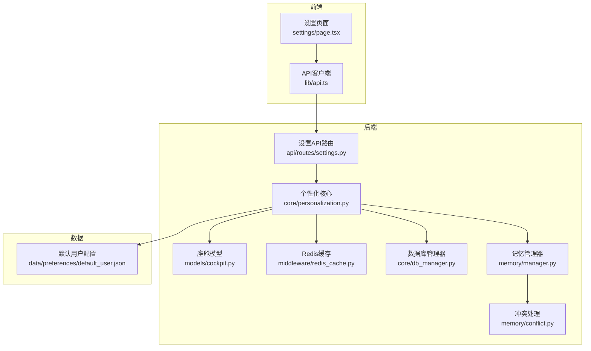
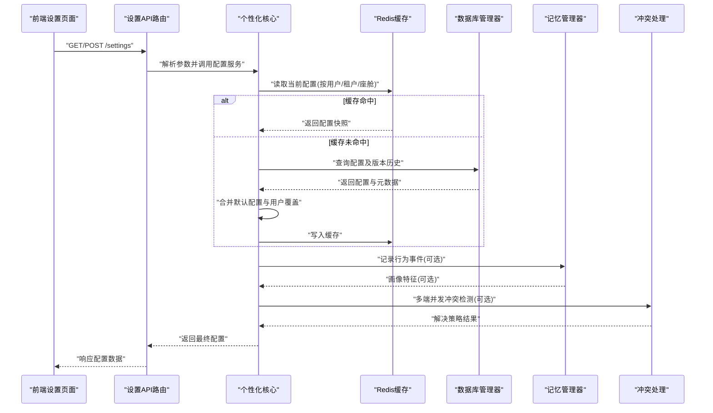
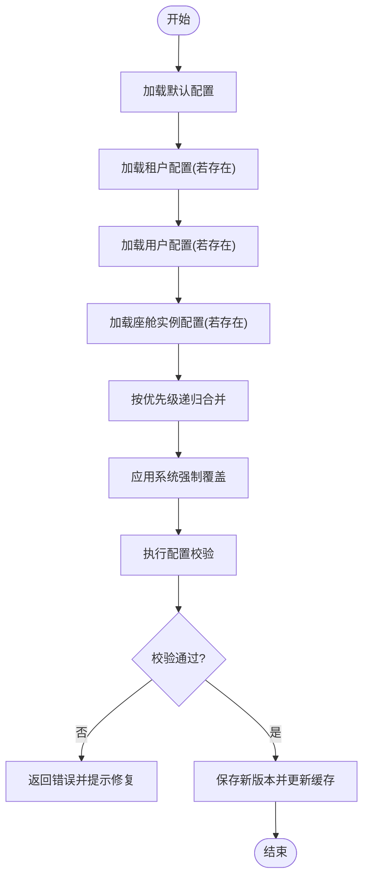
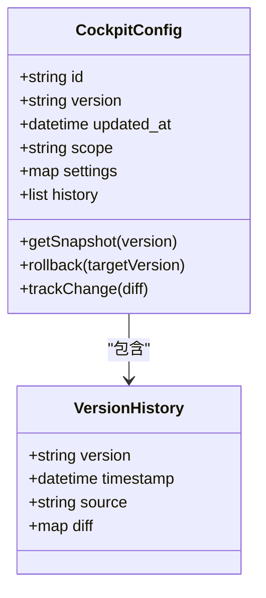
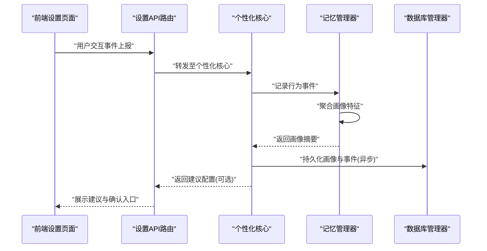
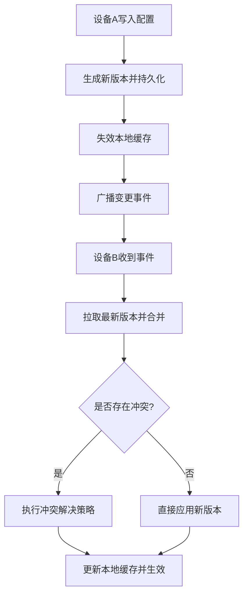
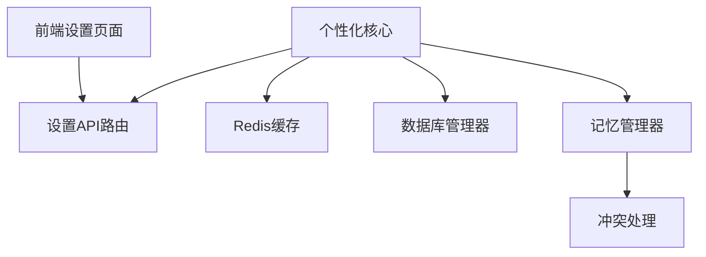

# 个性化设置系统

<cite>
**本文引用的文件**   
- [backend_design/nexus/core/personalization.py](file://backend_design/nexus/core/personalization.py)
- [backend_design/nexus/api/routes/settings.py](file://backend_design/nexus/api/routes/settings.py)
- [backend_design/nexus/models/cockpit.py](file://backend_design/nexus/models/cockpit.py)
- [backend_design/nexus/middleware/redis_cache.py](file://backend_design/nexus/middleware/redis_cache.py)
- [data/preferences/default_user.json](file://data/preferences/default_user.json)
- [backend_design/nexus/config.py](file://backend_design/nexus/config.py)
- [backend_design/nexus/core/db_manager.py](file://backend_design/nexus/core/db_manager.py)
- [backend_design/nexus/memory/manager.py](file://backend_design/nexus/memory/manager.py)
- [backend_design/nexus/memory/conflict.py](file://backend_design/nexus/memory/conflict.py)
- [frontend_design/src/app/settings/page.tsx](file://frontend_design/src/app/settings/page.tsx)
- [frontend_design/src/lib/api.ts](file://frontend_design/src/lib/api.ts)
</cite>

## 目录
1. [引言](#引言)
2. [项目结构](#项目结构)
3. [核心组件](#核心组件)
4. [架构总览](#架构总览)
5. [详细组件分析](#详细组件分析)
6. [依赖关系分析](#依赖关系分析)
7. [性能考虑](#性能考虑)
8. [故障排查指南](#故障排查指南)
9. [结论](#结论)
10. [附录](#附录)

## 引言
本设计文档聚焦于NexusCockpit的“个性化设置系统”，围绕用户偏好配置的数据结构设计、默认配置加载与合并策略、座舱实例配置管理（版本控制、变更追踪、回滚）、用户画像构建、多设备配置同步、配置验证与数据迁移工具，以及性能优化建议进行系统化阐述。目标是帮助开发者与运维人员理解并扩展该子系统，确保在复杂场景下仍能提供稳定、一致且高性能的个性化体验。

## 项目结构
个性化设置系统横跨后端服务、中间件缓存、前端界面与数据资源：
- 后端核心逻辑位于 backend_design/nexus/core/personalization.py，负责配置模型、合并策略、继承与覆盖、变更追踪等。
- API路由位于 backend_design/nexus/api/routes/settings.py，暴露配置读写、同步、版本管理等接口。
- 数据模型定义在 backend_design/nexus/models/cockpit.py，包含座舱实例与配置关联的结构。
- 缓存层使用 backend_design/nexus/middleware/redis_cache.py，提供配置缓存与失效策略。
- 默认用户配置位于 data/preferences/default_user.json，作为全局默认值来源。
- 数据库访问通过 backend_design/nexus/core/db_manager.py 统一管理。
- 记忆与冲突处理由 backend_design/nexus/memory/manager.py 与 backend_design/nexus/memory/conflict.py 协作完成。
- 前端设置页面位于 frontend_design/src/app/settings/page.tsx，并通过 frontend_design/src/lib/api.ts 调用后端API。

图表来源
- [backend_design/nexus/api/routes/settings.py](file://backend_design/nexus/api/routes/settings.py)
- [backend_design/nexus/core/personalization.py](file://backend_design/nexus/core/personalization.py)
- [backend_design/nexus/models/cockpit.py](file://backend_design/nexus/models/cockpit.py)
- [backend_design/nexus/middleware/redis_cache.py](file://backend_design/nexus/middleware/redis_cache.py)
- [backend_design/nexus/core/db_manager.py](file://backend_design/nexus/core/db_manager.py)
- [backend_design/nexus/memory/manager.py](file://backend_design/nexus/memory/manager.py)
- [backend_design/nexus/memory/conflict.py](file://backend_design/nexus/memory/conflict.py)
- [data/preferences/default_user.json](file://data/preferences/default_user.json)
- [frontend_design/src/app/settings/page.tsx](file://frontend_design/src/app/settings/page.tsx)
- [frontend_design/src/lib/api.ts](file://frontend_design/src/lib/api.ts)

章节来源
- [backend_design/nexus/core/personalization.py](file://backend_design/nexus/core/personalization.py)
- [backend_design/nexus/api/routes/settings.py](file://backend_design/nexus/api/routes/settings.py)
- [backend_design/nexus/models/cockpit.py](file://backend_design/nexus/models/cockpit.py)
- [backend_design/nexus/middleware/redis_cache.py](file://backend_design/nexus/middleware/redis_cache.py)
- [data/preferences/default_user.json](file://data/preferences/default_user.json)
- [backend_design/nexus/core/db_manager.py](file://backend_design/nexus/core/db_manager.py)
- [backend_design/nexus/memory/manager.py](file://backend_design/nexus/memory/manager.py)
- [backend_design/nexus/memory/conflict.py](file://backend_design/nexus/memory/conflict.py)
- [frontend_design/src/app/settings/page.tsx](file://frontend_design/src/app/settings/page.tsx)
- [frontend_design/src/lib/api.ts](file://frontend_design/src/lib/api.ts)

## 核心组件
- 个性化核心（personalization）：定义用户偏好配置的数据结构（主题、界面定制、功能开关），实现默认配置加载、合并策略、继承与覆盖机制，维护配置版本与变更日志，并提供校验与迁移钩子。
- 设置API（settings路由）：暴露REST接口用于获取、更新、批量修改、同步与回滚配置；支持按用户、租户、座舱实例维度隔离。
- 座舱模型（cockpit模型）：描述座舱实例与其配置的关系，包括配置版本、生效时间、状态等元数据。
- Redis缓存（redis_cache）：提供配置读路径的高速缓存、写路径的失效与广播通知。
- 数据库管理器（db_manager）：统一持久化配置快照、版本历史与审计日志。
- 记忆与冲突（memory/manager, memory/conflict）：记录用户行为事件、聚合画像特征，并在多端并发时进行冲突检测与解决。
- 默认用户配置（default_user.json）：作为全局默认值源，供新用户或无显式配置的用户使用。
- 前端设置页（settings/page.tsx）与API客户端（lib/api.ts）：提供可视化编辑与调用后端接口。

章节来源
- [backend_design/nexus/core/personalization.py](file://backend_design/nexus/core/personalization.py)
- [backend_design/nexus/api/routes/settings.py](file://backend_design/nexus/api/routes/settings.py)
- [backend_design/nexus/models/cockpit.py](file://backend_design/nexus/models/cockpit.py)
- [backend_design/nexus/middleware/redis_cache.py](file://backend_design/nexus/middleware/redis_cache.py)
- [backend_design/nexus/core/db_manager.py](file://backend_design/nexus/core/db_manager.py)
- [backend_design/nexus/memory/manager.py](file://backend_design/nexus/memory/manager.py)
- [backend_design/nexus/memory/conflict.py](file://backend_design/nexus/memory/conflict.py)
- [data/preferences/default_user.json](file://data/preferences/default_user.json)
- [frontend_design/src/app/settings/page.tsx](file://frontend_design/src/app/settings/page.tsx)
- [frontend_design/src/lib/api.ts](file://frontend_design/src/lib/api.ts)

## 架构总览
个性化设置系统的整体流程如下：
- 前端通过设置页面发起请求，调用API客户端访问后端设置API。
- 设置API路由解析请求参数，委托个性化核心执行配置读取、合并、写入等操作。
- 个性化核心根据用户ID、租户ID与座舱实例ID定位配置范围，从缓存或数据库加载当前版本，结合默认配置进行合并，必要时触发冲突解决。
- 写操作完成后，更新数据库并失效相关缓存，同时向订阅者广播变更事件以驱动多端同步。
- 记忆模块持续收集用户交互与行为事件，生成画像特征供个性化推荐与自动配置建议使用。

图表来源
- [backend_design/nexus/api/routes/settings.py](file://backend_design/nexus/api/routes/settings.py)
- [backend_design/nexus/core/personalization.py](file://backend_design/nexus/core/personalization.py)
- [backend_design/nexus/middleware/redis_cache.py](file://backend_design/nexus/middleware/redis_cache.py)
- [backend_design/nexus/core/db_manager.py](file://backend_design/nexus/core/db_manager.py)
- [backend_design/nexus/memory/manager.py](file://backend_design/nexus/memory/manager.py)
- [backend_design/nexus/memory/conflict.py](file://backend_design/nexus/memory/conflict.py)

## 详细组件分析

### 数据结构与字段设计
- 主题设置：包含颜色方案、字体、布局密度、图标风格等键值对，支持按用户、租户、座舱实例维度覆盖。
- 界面定制：包含侧边栏可见性、仪表盘卡片排序、快捷入口列表、语言与时区等。
- 功能开关：包含实验特性开关、能力启用标志、权限相关开关等布尔或枚举类型。
- 版本与元数据：包含版本号、更新时间、来源（默认/用户/系统）、生效范围（用户/租户/座舱）。

章节来源
- [backend_design/nexus/core/personalization.py](file://backend_design/nexus/core/personalization.py)
- [backend_design/nexus/models/cockpit.py](file://backend_design/nexus/models/cockpit.py)
- [data/preferences/default_user.json](file://data/preferences/default_user.json)

### 默认配置加载与合并策略
- 加载顺序：默认配置（default_user.json）→ 租户级配置 → 用户级配置 → 座舱实例级配置。
- 合并规则：浅合并为主，嵌套对象按层级递归合并；用户显式覆盖优先于默认值；系统级强制开关不可被用户覆盖。
- 继承机制：子范围（如座舱实例）可继承父范围（用户/租户）的配置，未显式设置的字段沿用上级。
- 覆盖策略：同层级的多个来源按优先级合并，后者优先；冲突字段保留最后写入的值。

图表来源
- [backend_design/nexus/core/personalization.py](file://backend_design/nexus/core/personalization.py)
- [data/preferences/default_user.json](file://data/preferences/default_user.json)

章节来源
- [backend_design/nexus/core/personalization.py](file://backend_design/nexus/core/personalization.py)
- [data/preferences/default_user.json](file://data/preferences/default_user.json)

### 座舱实例配置管理（版本控制、变更追踪、回滚）
- 版本控制：每次有效变更生成新配置快照，附带版本号与时间戳；支持查看历史版本列表。
- 变更追踪：记录变更来源（用户/系统）、变更字段差异、操作人标识与上下文信息。
- 回滚机制：选择目标版本进行回滚，生成新的配置快照并标记为回滚来源；支持一键恢复最近稳定版本。
- 一致性保障：写操作采用事务性提交，失败则回退；读操作优先缓存，未命中再落库。

图表来源
- [backend_design/nexus/models/cockpit.py](file://backend_design/nexus/models/cockpit.py)
- [backend_design/nexus/core/personalization.py](file://backend_design/nexus/core/personalization.py)

章节来源
- [backend_design/nexus/models/cockpit.py](file://backend_design/nexus/models/cockpit.py)
- [backend_design/nexus/core/personalization.py](file://backend_design/nexus/core/personalization.py)

### 用户画像构建过程
- 数据采集：记录用户在设置页面的交互（主题切换、功能开关变更）、会话行为（常用功能、停留时长）、设备与环境信息。
- 特征聚合：将原始事件转换为画像特征（偏好强度、活跃时段、功能使用频率）。
- 个性化建议：基于画像生成配置建议（如推荐主题、开启高频功能），经用户确认后生效。
- 隐私与安全：敏感字段脱敏存储，遵循最小必要原则，提供用户可控的画像开关。

图表来源
- [backend_design/nexus/memory/manager.py](file://backend_design/nexus/memory/manager.py)
- [backend_design/nexus/core/personalization.py](file://backend_design/nexus/core/personalization.py)
- [backend_design/nexus/core/db_manager.py](file://backend_design/nexus/core/db_manager.py)

章节来源
- [backend_design/nexus/memory/manager.py](file://backend_design/nexus/memory/manager.py)
- [backend_design/nexus/core/personalization.py](file://backend_design/nexus/core/personalization.py)
- [backend_design/nexus/core/db_manager.py](file://backend_design/nexus/core/db_manager.py)

### 配置同步机制（多设备统一）
- 同步触发：用户主动刷新、设备上线、配置变更事件推送。
- 冲突检测：基于时间戳与版本号比较，识别并发冲突。
- 解决策略：采用“最新写入优先”或“用户显式覆盖优先”的策略，必要时提示用户手动选择。
- 广播通知：通过缓存通道或消息队列向其他设备推送变更，确保实时一致。

图表来源
- [backend_design/nexus/middleware/redis_cache.py](file://backend_design/nexus/middleware/redis_cache.py)
- [backend_design/nexus/memory/conflict.py](file://backend_design/nexus/memory/conflict.py)
- [backend_design/nexus/core/personalization.py](file://backend_design/nexus/core/personalization.py)

章节来源
- [backend_design/nexus/middleware/redis_cache.py](file://backend_design/nexus/middleware/redis_cache.py)
- [backend_design/nexus/memory/conflict.py](file://backend_design/nexus/memory/conflict.py)
- [backend_design/nexus/core/personalization.py](file://backend_design/nexus/core/personalization.py)

### 配置验证与数据迁移工具
- 配置验证：在写入前执行Schema校验，检查必填字段、类型约束、取值范围与依赖关系；失败时返回明确错误信息。
- 数据迁移：提供迁移脚本与钩子，支持跨版本字段重命名、默认值填充、历史数据清洗；迁移过程可回滚。
- 工具使用：通过命令行或管理面板触发迁移任务，查看进度与结果，支持分批执行与断点续跑。

章节来源
- [backend_design/nexus/core/personalization.py](file://backend_design/nexus/core/personalization.py)
- [backend_design/nexus/config.py](file://backend_design/nexus/config.py)

### 前端集成与使用
- 设置页面：提供主题、界面定制、功能开关的可视化编辑与预览。
- API客户端：封装统一的请求方法，处理鉴权、重试与错误提示。
- 实时反馈：变更后即时刷新UI，支持撤销与恢复最近更改。

章节来源
- [frontend_design/src/app/settings/page.tsx](file://frontend_design/src/app/settings/page.tsx)
- [frontend_design/src/lib/api.ts](file://frontend_design/src/lib/api.ts)

## 依赖关系分析
- 耦合度：个性化核心与API路由、缓存、数据库、记忆模块存在强依赖；通过接口抽象降低耦合。
- 外部依赖：Redis用于缓存与事件广播；数据库用于持久化；前端依赖HTTP客户端。
- 循环依赖：避免在核心逻辑中反向引用API路由，保持单向依赖。

图表来源
- [backend_design/nexus/core/personalization.py](file://backend_design/nexus/core/personalization.py)
- [backend_design/nexus/api/routes/settings.py](file://backend_design/nexus/api/routes/settings.py)
- [backend_design/nexus/middleware/redis_cache.py](file://backend_design/nexus/middleware/redis_cache.py)
- [backend_design/nexus/core/db_manager.py](file://backend_design/nexus/core/db_manager.py)
- [backend_design/nexus/memory/manager.py](file://backend_design/nexus/memory/manager.py)
- [backend_design/nexus/memory/conflict.py](file://backend_design/nexus/memory/conflict.py)
- [frontend_design/src/app/settings/page.tsx](file://frontend_design/src/app/settings/page.tsx)

章节来源
- [backend_design/nexus/core/personalization.py](file://backend_design/nexus/core/personalization.py)
- [backend_design/nexus/api/routes/settings.py](file://backend_design/nexus/api/routes/settings.py)
- [backend_design/nexus/middleware/redis_cache.py](file://backend_design/nexus/middleware/redis_cache.py)
- [backend_design/nexus/core/db_manager.py](file://backend_design/nexus/core/db_manager.py)
- [backend_design/nexus/memory/manager.py](file://backend_design/nexus/memory/manager.py)
- [backend_design/nexus/memory/conflict.py](file://backend_design/nexus/memory/conflict.py)
- [frontend_design/src/app/settings/page.tsx](file://frontend_design/src/app/settings/page.tsx)

## 性能考虑
- 配置缓存策略：读路径优先命中Redis缓存，设置合理的TTL与失效键粒度；写路径及时失效相关键。
- 批量更新处理：支持批量合并与原子提交，减少多次往返与锁竞争。
- 懒加载与增量同步：仅拉取变更字段，降低带宽与CPU开销。
- 异步画像计算：将画像聚合与推荐计算放入后台任务，避免阻塞主流程。
- 监控与告警：对缓存命中率、延迟、错误率进行监控，异常时降级到直连数据库。

[本节为通用性能指导，不直接分析具体文件]

## 故障排查指南
- 常见问题：
  - 配置未生效：检查缓存是否失效、版本是否正确、合并优先级是否符合预期。
  - 多端不一致：查看冲突日志与解决策略，确认广播事件是否送达。
  - 迁移失败：核对迁移脚本版本与数据兼容性，查看回滚记录。
- 诊断步骤：
  - 查看配置历史与差异，定位变更来源。
  - 检查Redis键空间与TTL，确认缓存状态。
  - 审查数据库事务与索引，评估写入性能瓶颈。
  - 分析前端网络请求与错误码，确认API响应。

章节来源
- [backend_design/nexus/core/personalization.py](file://backend_design/nexus/core/personalization.py)
- [backend_design/nexus/middleware/redis_cache.py](file://backend_design/nexus/middleware/redis_cache.py)
- [backend_design/nexus/core/db_manager.py](file://backend_design/nexus/core/db_manager.py)
- [backend_design/nexus/memory/conflict.py](file://backend_design/nexus/memory/conflict.py)

## 结论
个性化设置系统通过清晰的数据结构、严格的合并与继承策略、完善的版本管理与冲突解决机制，实现了在多设备、多租户、多座舱场景下的稳定与一致的个性化体验。配合缓存优化、批量更新与异步画像计算，系统在性能与可扩展性方面具备良好基础。未来可进一步引入更细粒度的权限控制、更智能的推荐算法与更强的可观测性，以提升用户体验与运维效率。

[本节为总结性内容，不直接分析具体文件]

## 附录
- 术语表：
  - 配置范围：用户、租户、座舱实例等维度。
  - 合并策略：递归浅合并与优先级覆盖。
  - 冲突解决：时间戳与版本号对比策略。
- 参考文件：
  - 默认用户配置示例：data/preferences/default_user.json
  - 前端设置页面：frontend_design/src/app/settings/page.tsx
  - API客户端：frontend_design/src/lib/api.ts

[本节为补充信息，不直接分析具体文件]