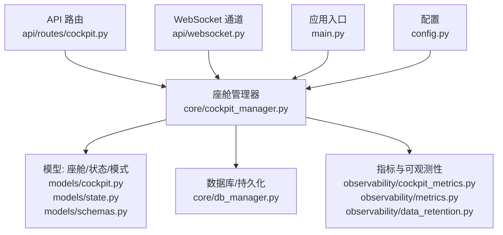
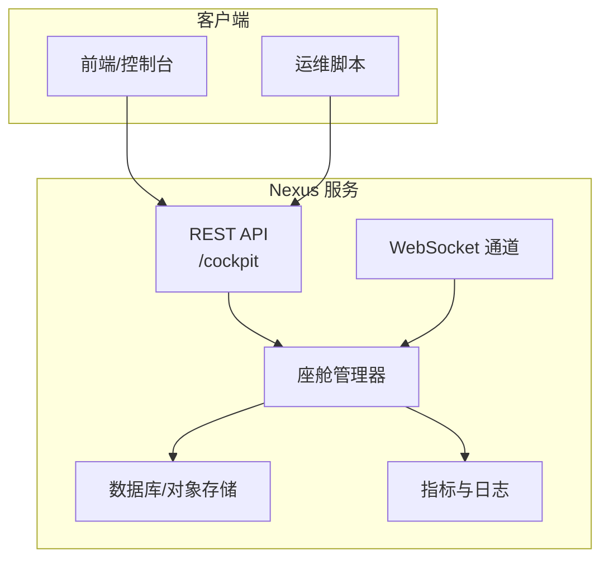
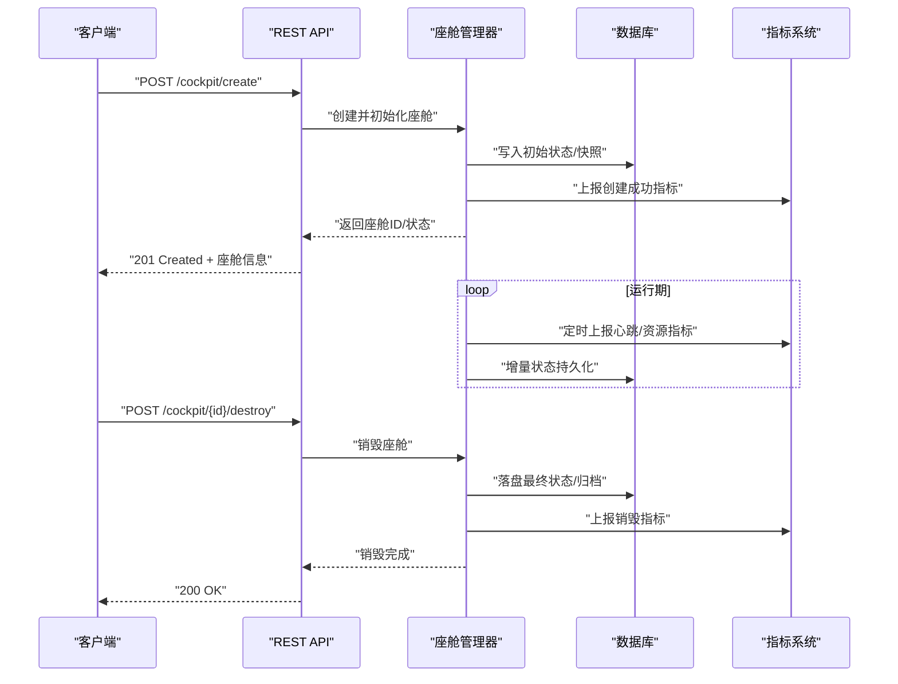
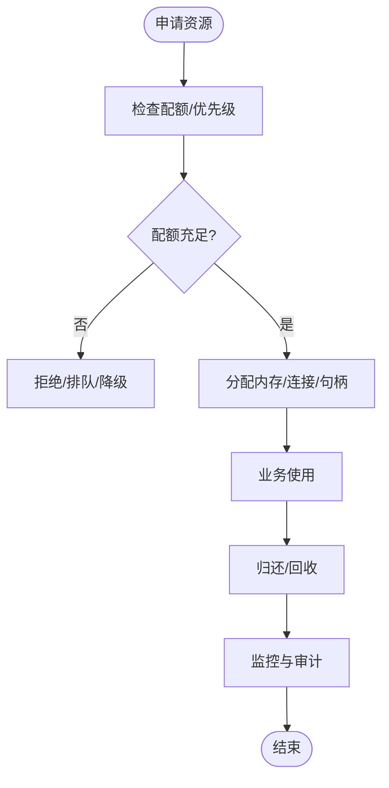
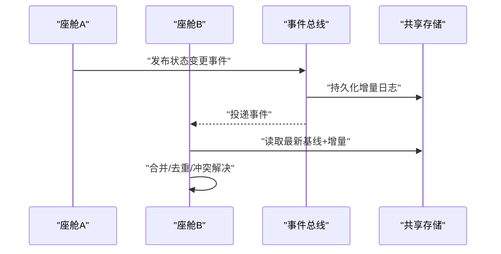
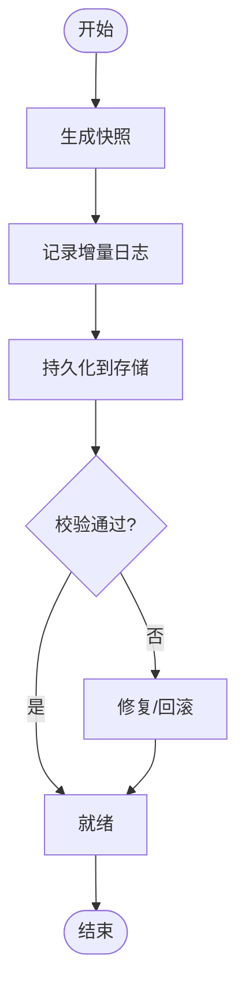
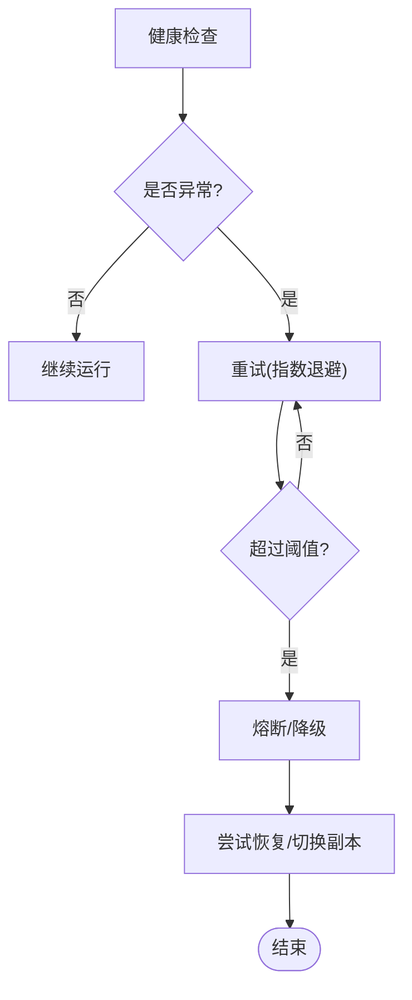
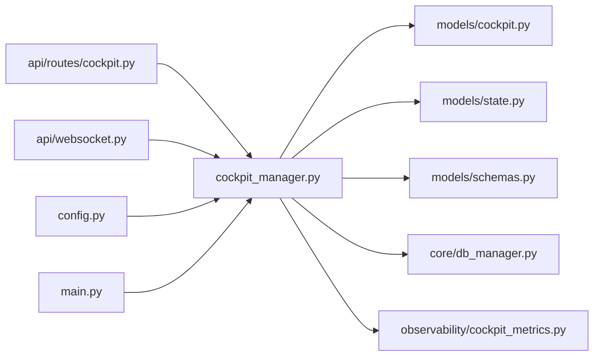

# 座舱管理器

<cite>
**本文引用的文件**   
- [cockpit_manager.py](file://backend_design/nexus/core/cockpit_manager.py)
- [cockpit.py](file://backend_design/nexus/models/cockpit.py)
- [state.py](file://backend_design/nexus/models/state.py)
- [schemas.py](file://backend_design/nexus/models/schemas.py)
- [cockpit.py](file://backend_design/nexus/api/routes/cockpit.py)
- [websocket.py](file://backend_design/nexus/api/websocket.py)
- [db_manager.py](file://backend_design/nexus/core/db_manager.py)
- [cockpit_metrics.py](file://backend_design/nexus/observability/cockpit_metrics.py)
- [metrics.py](file://backend_design/nexus/observability/metrics.py)
- [data_retention.py](file://backend_design/nexus/observability/data_retention.py)
- [config.py](file://backend_design/nexus/config.py)
- [main.py](file://backend_design/nexus/main.py)
</cite>

## 目录
1. [简介](#简介)
2. [项目结构](#项目结构)
3. [核心组件](#核心组件)
4. [架构总览](#架构总览)
5. [详细组件分析](#详细组件分析)
6. [依赖关系分析](#依赖关系分析)
7. [性能考虑](#性能考虑)
8. [故障排查指南](#故障排查指南)
9. [结论](#结论)
10. [附录](#附录)

## 简介
本技术文档聚焦于 NexusCockpit 的“座舱管理器”，围绕以下目标展开：
- 座舱实例生命周期管理（创建、初始化、运行监控、销毁）
- 资源分配与回收（内存、连接池、文件句柄）
- 座舱间通信协议与数据共享，跨座舱状态同步
- 状态持久化策略（快照、增量保存、恢复）
- 隔离与安全边界（防恶意访问、资源竞争）
- 扩展接口设计（第三方插件动态加载/卸载）
- 故障恢复与容错（崩溃检测、自动重启）
- 性能监控指标与调优参数配置

## 项目结构
与座舱管理器直接相关的后端模块主要位于 backend_design/nexus 下，关键路径如下：
- 核心逻辑：core/cockpit_manager.py
- 模型定义：models/cockpit.py, models/state.py, models/schemas.py
- API 路由：api/routes/cockpit.py
- WebSocket 通道：api/websocket.py
- 数据库与持久化：core/db_manager.py
- 可观测性：observability/cockpit_metrics.py, observability/metrics.py, observability/data_retention.py
- 应用入口与配置：main.py, config.py

图表来源
- [cockpit_manager.py](file://backend_design/nexus/core/cockpit_manager.py)
- [cockpit.py](file://backend_design/nexus/models/cockpit.py)
- [state.py](file://backend_design/nexus/models/state.py)
- [schemas.py](file://backend_design/nexus/models/schemas.py)
- [cockpit.py](file://backend_design/nexus/api/routes/cockpit.py)
- [websocket.py](file://backend_design/nexus/api/websocket.py)
- [db_manager.py](file://backend_design/nexus/core/db_manager.py)
- [cockpit_metrics.py](file://backend_design/nexus/observability/cockpit_metrics.py)
- [metrics.py](file://backend_design/nexus/observability/metrics.py)
- [data_retention.py](file://backend_design/nexus/observability/data_retention.py)
- [main.py](file://backend_design/nexus/main.py)
- [config.py](file://backend_design/nexus/config.py)

章节来源
- [cockpit_manager.py](file://backend_design/nexus/core/cockpit_manager.py)
- [cockpit.py](file://backend_design/nexus/models/cockpit.py)
- [state.py](file://backend_design/nexus/models/state.py)
- [schemas.py](file://backend_design/nexus/models/schemas.py)
- [cockpit.py](file://backend_design/nexus/api/routes/cockpit.py)
- [websocket.py](file://backend_design/nexus/api/websocket.py)
- [db_manager.py](file://backend_design/nexus/core/db_manager.py)
- [cockpit_metrics.py](file://backend_design/nexus/observability/cockpit_metrics.py)
- [metrics.py](file://backend_design/nexus/observability/metrics.py)
- [data_retention.py](file://backend_design/nexus/observability/data_retention.py)
- [main.py](file://backend_design/nexus/main.py)
- [config.py](file://backend_design/nexus/config.py)

## 核心组件
- 座舱管理器（CockpitManager）
  - 职责：集中管理座舱实例的生命周期、资源编排、健康检查、事件分发、持久化协调、指标上报。
  - 关键能力：创建/启动/停止/销毁；心跳与健康探测；资源配额与回收；跨座舱消息路由；快照与增量持久化；异常恢复与重启。
- 模型层（Cockpit/State/Schemas）
  - Cockpit：描述座舱元信息、运行时上下文、资源标识、状态机。
  - State：描述会话/用户偏好/技能/记忆等运行时状态的结构与变更语义。
  - Schemas：对外暴露的请求/响应契约，用于 API 与 WS 的数据交换。
- API 路由（/cockpit）
  - 提供 REST 接口以触发座舱生命周期操作、查询状态、提交配置、拉取指标等。
- WebSocket 通道
  - 提供实时双向通道，推送座舱事件、状态变更、遥测数据，支持订阅/发布。
- 数据库与持久化（DB Manager）
  - 负责状态快照、增量日志、索引维护、清理策略与一致性保障。
- 可观测性（Metrics/Data Retention）
  - 采集 CPU/内存/IO/请求时延/错误率等指标，按策略保留与归档。

章节来源
- [cockpit_manager.py](file://backend_design/nexus/core/cockpit_manager.py)
- [cockpit.py](file://backend_design/nexus/models/cockpit.py)
- [state.py](file://backend_design/nexus/models/state.py)
- [schemas.py](file://backend_design/nexus/models/schemas.py)
- [cockpit.py](file://backend_design/nexus/api/routes/cockpit.py)
- [websocket.py](file://backend_design/nexus/api/websocket.py)
- [db_manager.py](file://backend_design/nexus/core/db_manager.py)
- [cockpit_metrics.py](file://backend_design/nexus/observability/cockpit_metrics.py)
- [metrics.py](file://backend_design/nexus/observability/metrics.py)
- [data_retention.py](file://backend_design/nexus/observability/data_retention.py)

## 架构总览
下图展示了座舱管理器在系统中的位置及与外部组件的交互关系。

图表来源
- [cockpit.py](file://backend_design/nexus/api/routes/cockpit.py)
- [websocket.py](file://backend_design/nexus/api/websocket.py)
- [cockpit_manager.py](file://backend_design/nexus/core/cockpit_manager.py)
- [db_manager.py](file://backend_design/nexus/core/db_manager.py)
- [cockpit_metrics.py](file://backend_design/nexus/observability/cockpit_metrics.py)

## 详细组件分析

### 座舱实例生命周期管理
- 创建与初始化
  - 通过 API 发起创建请求，管理器校验参数、分配资源标识、构建上下文、初始化状态与必要子组件。
  - 初始化阶段完成资源池预热、权限绑定、默认配置注入、健康探针注册。
- 运行监控
  - 周期性心跳与健康检查；异常告警；资源使用度量上报；慢调用追踪。
- 销毁流程
  - 优雅关闭：停止接收新请求、等待活跃任务完成、释放外部连接、落盘最终状态、清理临时文件。
- 自动重启
  - 基于健康阈值与重试策略进行自愈；失败次数超限则进入人工干预队列。

图表来源
- [cockpit.py](file://backend_design/nexus/api/routes/cockpit.py)
- [cockpit_manager.py](file://backend_design/nexus/core/cockpit_manager.py)
- [db_manager.py](file://backend_design/nexus/core/db_manager.py)
- [cockpit_metrics.py](file://backend_design/nexus/observability/cockpit_metrics.py)

章节来源
- [cockpit_manager.py](file://backend_design/nexus/core/cockpit_manager.py)
- [cockpit.py](file://backend_design/nexus/api/routes/cockpit.py)
- [db_manager.py](file://backend_design/nexus/core/db_manager.py)
- [cockpit_metrics.py](file://backend_design/nexus/observability/cockpit_metrics.py)

### 资源分配与回收机制
- 内存管理
  - 为每个座舱维护独立内存上下文；限制最大堆/栈使用；定期垃圾回收提示；大对象缓存隔离。
- 连接池管理
  - 数据库/外部服务连接池按座舱维度隔离或共享（可配置）；空闲回收、超时剔除、扩容缩容策略。
- 文件句柄控制
  - 打开文件数上限、临时目录隔离、自动清理过期文件；避免句柄泄漏。
- 资源配额与抢占
  - 基于权重/优先级的配额调度；超限时降级或拒绝新任务；紧急回收非关键资源。

章节来源
- [cockpit_manager.py](file://backend_design/nexus/core/cockpit_manager.py)
- [db_manager.py](file://backend_design/nexus/core/db_manager.py)
- [config.py](file://backend_design/nexus/config.py)

### 座舱间通信与数据共享
- 通信协议
  - 内部采用轻量消息总线/事件总线；对外通过 WebSocket 推送事件；REST 作为控制面。
- 数据共享
  - 共享只读缓存（如 Redis/内存表）；写路径通过幂等命令与版本控制保证一致性。
- 跨座舱状态同步
  - 基于事件溯源与增量合并；冲突检测与解决策略（最后写入胜出/自定义合并器）。

图表来源
- [websocket.py](file://backend_design/nexus/api/websocket.py)
- [cockpit_manager.py](file://backend_design/nexus/core/cockpit_manager.py)
- [db_manager.py](file://backend_design/nexus/core/db_manager.py)

章节来源
- [websocket.py](file://backend_design/nexus/api/websocket.py)
- [cockpit_manager.py](file://backend_design/nexus/core/cockpit_manager.py)
- [db_manager.py](file://backend_design/nexus/core/db_manager.py)

### 状态持久化策略
- 状态快照
  - 全量快照用于快速恢复；压缩与分片存储；版本标记与校验和。
- 增量保存
  - 基于时间窗口或变更阈值的增量落盘；事务性写入与幂等键。
- 恢复机制
  - 启动时选择最近有效快照，回放增量日志至一致点；失败回滚与修复工具。

图表来源
- [db_manager.py](file://backend_design/nexus/core/db_manager.py)
- [data_retention.py](file://backend_design/nexus/observability/data_retention.py)

章节来源
- [db_manager.py](file://backend_design/nexus/core/db_manager.py)
- [data_retention.py](file://backend_design/nexus/observability/data_retention.py)

### 隔离与安全边界
- 进程/线程隔离
  - 按座舱划分执行域；限制并发度与资源配额；沙箱化插件执行环境。
- 访问控制
  - 鉴权与授权（JWT/租户上下文）；最小权限原则；敏感数据加密。
- 资源竞争防护
  - 锁粒度控制；死锁检测与解除；公平调度与优先级反转规避。

章节来源
- [cockpit_manager.py](file://backend_design/nexus/core/cockpit_manager.py)
- [config.py](file://backend_design/nexus/config.py)

### 扩展接口设计（插件动态加载/卸载）
- 插件发现与注册
  - 约定式目录/清单；热插拔扫描与版本兼容检查。
- 生命周期钩子
  - 初始化、运行中、销毁回调；错误隔离与熔断。
- 安全沙箱
  - 白名单 API；资源限额；网络/文件系统访问控制。

章节来源
- [cockpit_manager.py](file://backend_design/nexus/core/cockpit_manager.py)
- [config.py](file://backend_design/nexus/config.py)

### 故障恢复与容错
- 崩溃检测
  - 心跳超时、异常堆栈采样、OOM/死锁信号监听。
- 自动重启
  - 指数退避重试；最大重试次数；熔断保护。
- 数据一致性
  - 幂等处理；补偿事务；断点续跑。

章节来源
- [cockpit_manager.py](file://backend_design/nexus/core/cockpit_manager.py)
- [cockpit_metrics.py](file://backend_design/nexus/observability/cockpit_metrics.py)

### 性能监控指标与调优参数
- 关键指标
  - 创建/销毁耗时、存活时长、QPS、P95/P99 延迟、错误率、GC 停顿、连接池利用率、磁盘 IO、CPU/内存占用。
- 采集与可视化
  - 统一埋点、标签化维度（座舱ID/租户/区域）、Prometheus/Grafana 集成。
- 调优参数
  - 连接池大小、超时、批大小、快照频率、增量合并窗口、并发度、缓存命中率阈值。

章节来源
- [cockpit_metrics.py](file://backend_design/nexus/observability/cockpit_metrics.py)
- [metrics.py](file://backend_design/nexus/observability/metrics.py)
- [config.py](file://backend_design/nexus/config.py)

## 依赖关系分析
座舱管理器对模型、API、持久化与可观测性存在强耦合，需关注循环依赖与单点风险。

图表来源
- [cockpit_manager.py](file://backend_design/nexus/core/cockpit_manager.py)
- [cockpit.py](file://backend_design/nexus/models/cockpit.py)
- [state.py](file://backend_design/nexus/models/state.py)
- [schemas.py](file://backend_design/nexus/models/schemas.py)
- [cockpit.py](file://backend_design/nexus/api/routes/cockpit.py)
- [websocket.py](file://backend_design/nexus/api/websocket.py)
- [db_manager.py](file://backend_design/nexus/core/db_manager.py)
- [cockpit_metrics.py](file://backend_design/nexus/observability/cockpit_metrics.py)
- [config.py](file://backend_design/nexus/config.py)
- [main.py](file://backend_design/nexus/main.py)

章节来源
- [cockpit_manager.py](file://backend_design/nexus/core/cockpit_manager.py)
- [cockpit.py](file://backend_design/nexus/models/cockpit.py)
- [state.py](file://backend_design/nexus/models/state.py)
- [schemas.py](file://backend_design/nexus/models/schemas.py)
- [cockpit.py](file://backend_design/nexus/api/routes/cockpit.py)
- [websocket.py](file://backend_design/nexus/api/websocket.py)
- [db_manager.py](file://backend_design/nexus/core/db_manager.py)
- [cockpit_metrics.py](file://backend_design/nexus/observability/cockpit_metrics.py)
- [config.py](file://backend_design/nexus/config.py)
- [main.py](file://backend_design/nexus/main.py)

## 性能考虑
- 批量与异步
  - 将高频小写合并为批量写入；异步化 I/O 与指标上报，降低主路径阻塞。
- 缓存与预取
  - 热点状态本地缓存；按需预取关联数据；失效策略与一致性权衡。
- 资源水位
  - 连接池/线程池水位监控；自适应扩缩容；背压与限流。
- 存储优化
  - 快照压缩与分片；增量合并窗口调优；冷热分层存储。

[本节为通用指导，不直接分析具体文件]

## 故障排查指南
- 常见问题定位
  - 创建失败：检查参数校验、资源配额、依赖服务可用性。
  - 运行异常：查看心跳/健康探针、错误日志、指标突增。
  - 持久化问题：校验快照完整性、增量日志连续性、存储容量。
  - 性能退化：观察 GC、连接池、磁盘 IO、CPU 使用率。
- 诊断手段
  - 启用更细粒度日志；导出 Prometheus 指标；抓取线程/堆栈快照；回放增量日志。
- 恢复步骤
  - 从最近快照恢复；清理损坏增量；重启受影响的座舱；必要时切换副本。

章节来源
- [cockpit_manager.py](file://backend_design/nexus/core/cockpit_manager.py)
- [db_manager.py](file://backend_design/nexus/core/db_manager.py)
- [cockpit_metrics.py](file://backend_design/nexus/observability/cockpit_metrics.py)

## 结论
座舱管理器通过清晰的生命周期管理、严格的资源隔离、稳健的持久化与可观测性体系，提供了高可用、可扩展的座舱运行环境。建议在生产环境中结合指标与日志持续优化参数，完善自动化巡检与自愈策略，确保稳定性与性能达到预期。

[本节为总结性内容，不直接分析具体文件]

## 附录
- 术语
  - 座舱：一个独立的运行时工作单元，承载特定任务或用户会话。
  - 快照：某一时刻的全量状态备份。
  - 增量：两次快照之间的状态变更序列。
- 参考实现路径
  - 生命周期与编排：[cockpit_manager.py](file://backend_design/nexus/core/cockpit_manager.py)
  - 模型与契约：[cockpit.py](file://backend_design/nexus/models/cockpit.py), [state.py](file://backend_design/nexus/models/state.py), [schemas.py](file://backend_design/nexus/models/schemas.py)
  - API 与 WS：[cockpit.py](file://backend_design/nexus/api/routes/cockpit.py), [websocket.py](file://backend_design/nexus/api/websocket.py)
  - 持久化与保留：[db_manager.py](file://backend_design/nexus/core/db_manager.py), [data_retention.py](file://backend_design/nexus/observability/data_retention.py)
  - 指标与配置：[cockpit_metrics.py](file://backend_design/nexus/observability/cockpit_metrics.py), [metrics.py](file://backend_design/nexus/observability/metrics.py), [config.py](file://backend_design/nexus/config.py), [main.py](file://backend_design/nexus/main.py)