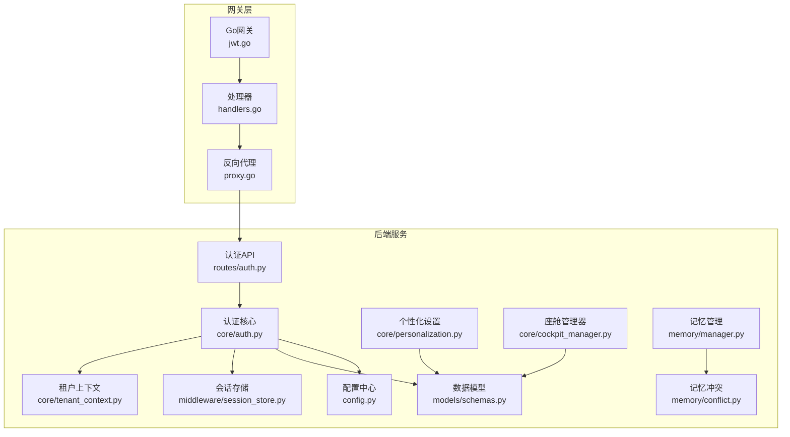
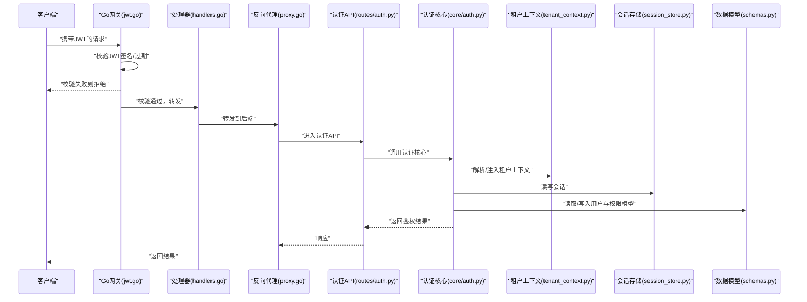
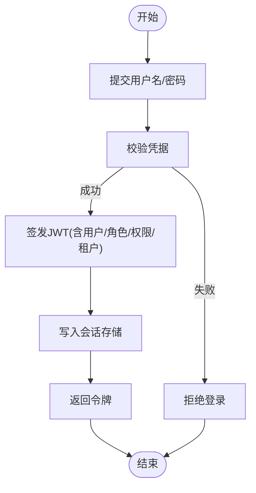
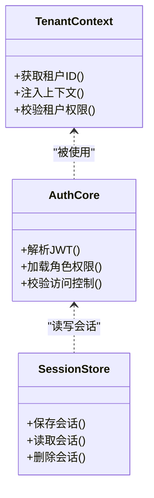
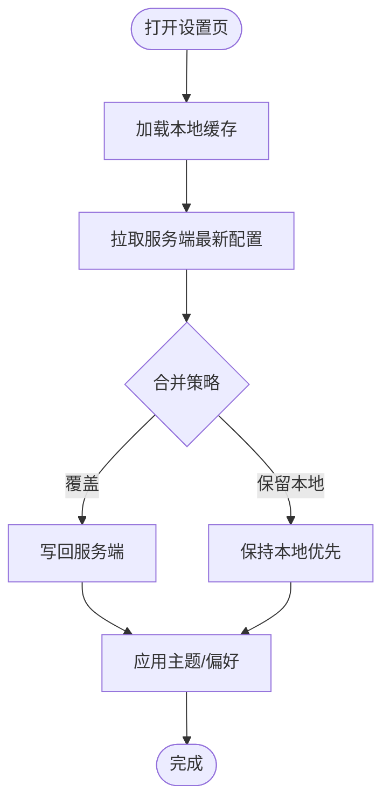
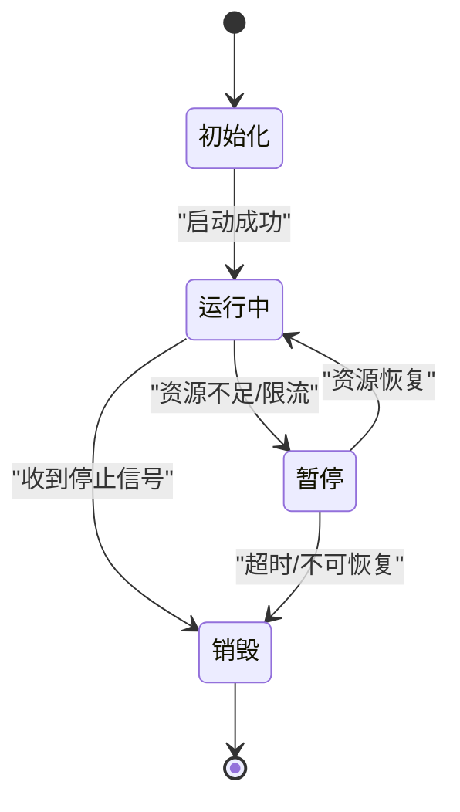
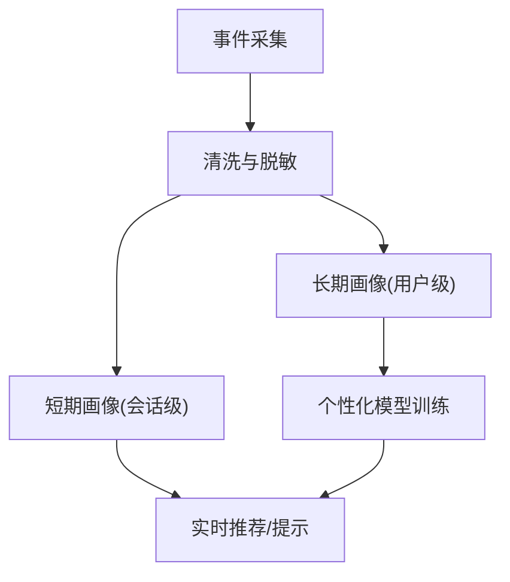
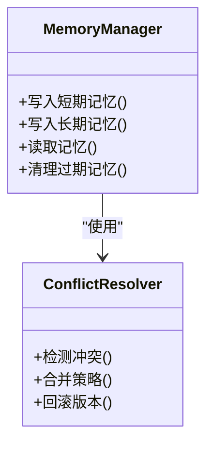
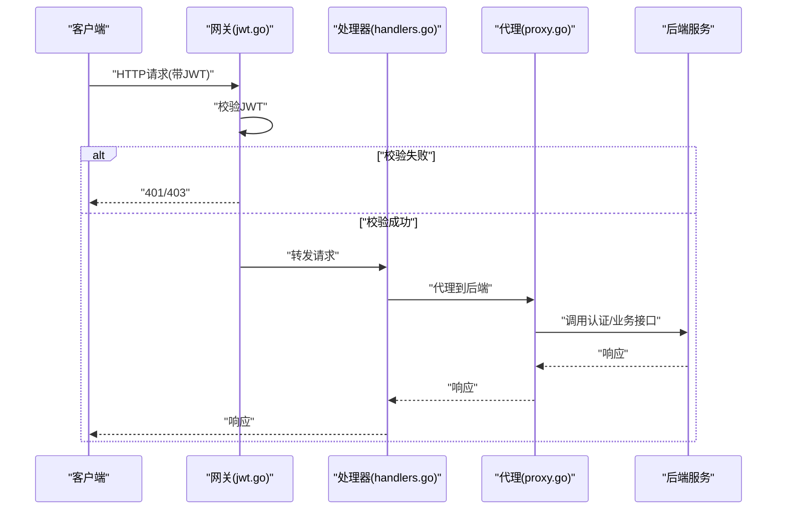
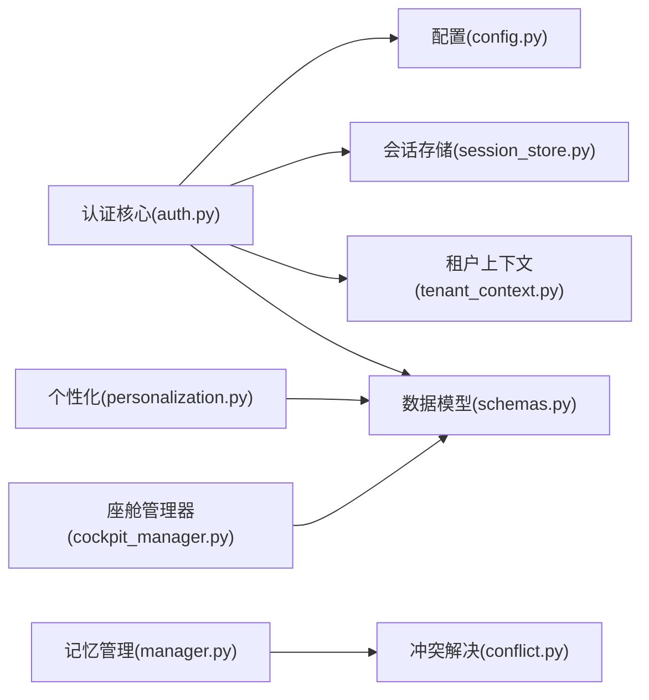

# 用户管理系统

<cite>
**本文引用的文件**   
- [backend_design/nexus/core/auth.py](file://backend_design/nexus/core/auth.py)
- [backend_design/nexus/api/routes/auth.py](file://backend_design/nexus/api/routes/auth.py)
- [backend_design/nexus/core/tenant_context.py](file://backend_design/nexus/core/tenant_context.py)
- [backend_design/nexus/core/personalization.py](file://backend_design/nexus/core/personalization.py)
- [backend_design/nexus/core/cockpit_manager.py](file://backend_design/nexus/core/cockpit_manager.py)
- [backend_design/nexus/memory/manager.py](file://backend_design/nexus/memory/manager.py)
- [backend_design/nexus/memory/conflict.py](file://backend_design/nexus/memory/conflict.py)
- [backend_design/nexus/middleware/session_store.py](file://backend_design/nexus/middleware/session_store.py)
- [backend_design/nexus/models/schemas.py](file://backend_design/nexus/models/schemas.py)
- [backend_design/nexus_gate/internal/auth/jwt.go](file://backend_design/nexus_gate/internal/auth/jwt.go)
- [backend_design/nexus_gate/internal/handlers/handlers.go](file://backend_design/nexus_gate/internal/handlers/handlers.go)
- [backend_design/nexus_gate/internal/proxy/proxy.go](file://backend_design/nexus_gate/internal/proxy/proxy.go)
- [backend_design/nexus/config.py](file://backend_design/nexus/config.py)
</cite>

## 目录
1. [简介](#简介)
2. [项目结构](#项目结构)
3. [核心组件](#核心组件)
4. [架构总览](#架构总览)
5. [详细组件分析](#详细组件分析)
6. [依赖分析](#依赖分析)
7. [性能考虑](#性能考虑)
8. [故障排查指南](#故障排查指南)
9. [结论](#结论)
10. [附录](#附录)

## 简介
本设计文档聚焦于NexusCockpit的用户管理系统，围绕身份认证与授权、JWT令牌管理、权限验证与多租户隔离、个性化设置系统、座舱管理器工作流、用户画像构建、记忆管理系统的数据结构与冲突解决机制，以及隐私保护与安全措施进行系统性阐述。文档同时提供最佳实践与性能优化建议，帮助读者快速理解并落地相关能力。

## 项目结构
用户管理相关代码主要分布在后端Python服务与Go网关两个子系统中：
- Python后端（nexus）：负责业务逻辑、认证鉴权、会话存储、个性化配置、座舱生命周期、记忆管理等。
- Go网关（nexus_gate）：负责入口路由、JWT校验、请求转发与限流等。

图表来源
- [backend_design/nexus_gate/internal/auth/jwt.go](file://backend_design/nexus_gate/internal/auth/jwt.go)
- [backend_design/nexus_gate/internal/handlers/handlers.go](file://backend_design/nexus_gate/internal/handlers/handlers.go)
- [backend_design/nexus_gate/internal/proxy/proxy.go](file://backend_design/nexus_gate/internal/proxy/proxy.go)
- [backend_design/nexus/api/routes/auth.py](file://backend_design/nexus/api/routes/auth.py)
- [backend_design/nexus/core/auth.py](file://backend_design/nexus/core/auth.py)
- [backend_design/nexus/core/tenant_context.py](file://backend_design/nexus/core/tenant_context.py)
- [backend_design/nexus/core/personalization.py](file://backend_design/nexus/core/personalization.py)
- [backend_design/nexus/core/cockpit_manager.py](file://backend_design/nexus/core/cockpit_manager.py)
- [backend_design/nexus/memory/manager.py](file://backend_design/nexus/memory/manager.py)
- [backend_design/nexus/memory/conflict.py](file://backend_design/nexus/memory/conflict.py)
- [backend_design/nexus/middleware/session_store.py](file://backend_design/nexus/middleware/session_store.py)
- [backend_design/nexus/models/schemas.py](file://backend_design/nexus/models/schemas.py)
- [backend_design/nexus/config.py](file://backend_design/nexus/config.py)

章节来源
- [backend_design/nexus/api/routes/auth.py](file://backend_design/nexus/api/routes/auth.py)
- [backend_design/nexus/core/auth.py](file://backend_design/nexus/core/auth.py)
- [backend_design/nexus/core/tenant_context.py](file://backend_design/nexus/core/tenant_context.py)
- [backend_design/nexus/core/personalization.py](file://backend_design/nexus/core/personalization.py)
- [backend_design/nexus/core/cockpit_manager.py](file://backend_design/nexus/core/cockpit_manager.py)
- [backend_design/nexus/memory/manager.py](file://backend_design/nexus/memory/manager.py)
- [backend_design/nexus/memory/conflict.py](file://backend_design/nexus/memory/conflict.py)
- [backend_design/nexus/middleware/session_store.py](file://backend_design/nexus/middleware/session_store.py)
- [backend_design/nexus/models/schemas.py](file://backend_design/nexus/models/schemas.py)
- [backend_design/nexus_gate/internal/auth/jwt.go](file://backend_design/nexus_gate/internal/auth/jwt.go)
- [backend_design/nexus_gate/internal/handlers/handlers.go](file://backend_design/nexus_gate/internal/handlers/handlers.go)
- [backend_design/nexus_gate/internal/proxy/proxy.go](file://backend_design/nexus_gate/internal/proxy/proxy.go)
- [backend_design/nexus/config.py](file://backend_design/nexus/config.py)

## 核心组件
- 认证与授权（Auth）：统一处理登录、登出、令牌签发与校验、权限检查与租户上下文注入。
- JWT网关（Gateway JWT）：在网关层完成JWT签名校验与透传，降低后端压力。
- 多租户上下文（Tenant Context）：基于请求上下文维护租户标识，贯穿鉴权与资源访问。
- 会话存储（Session Store）：持久化或缓存会话状态，支撑无状态网关与有状态后端的协作。
- 个性化设置（Personalization）：管理用户偏好、主题与界面定制，支持按租户与用户维度隔离。
- 座舱管理器（Cockpit Manager）：管理座舱实例的生命周期、资源分配与调度。
- 记忆管理（Memory Manager + Conflict Resolver）：组织短期与长期记忆，定义冲突检测与合并策略。
- 数据模型（Schemas）：定义用户、角色、权限、会话、偏好、记忆等数据结构。
- 配置（Config）：集中管理密钥、过期时间、限流、缓存等运行参数。

章节来源
- [backend_design/nexus/core/auth.py](file://backend_design/nexus/core/auth.py)
- [backend_design/nexus_gate/internal/auth/jwt.go](file://backend_design/nexus_gate/internal/auth/jwt.go)
- [backend_design/nexus/core/tenant_context.py](file://backend_design/nexus/core/tenant_context.py)
- [backend_design/nexus/middleware/session_store.py](file://backend_design/nexus/middleware/session_store.py)
- [backend_design/nexus/core/personalization.py](file://backend_design/nexus/core/personalization.py)
- [backend_design/nexus/core/cockpit_manager.py](file://backend_design/nexus/core/cockpit_manager.py)
- [backend_design/nexus/memory/manager.py](file://backend_design/nexus/memory/manager.py)
- [backend_design/nexus/memory/conflict.py](file://backend_design/nexus/memory/conflict.py)
- [backend_design/nexus/models/schemas.py](file://backend_design/nexus/models/schemas.py)
- [backend_design/nexus/config.py](file://backend_design/nexus/config.py)

## 架构总览
整体采用“网关鉴权 + 后端业务”的分层架构。网关侧使用Go实现高性能JWT校验与请求转发；后端Python服务承载认证流程、权限控制、会话管理、个性化、座舱与记忆等业务。

图表来源
- [backend_design/nexus_gate/internal/auth/jwt.go](file://backend_design/nexus_gate/internal/auth/jwt.go)
- [backend_design/nexus_gate/internal/handlers/handlers.go](file://backend_design/nexus_gate/internal/handlers/handlers.go)
- [backend_design/nexus_gate/internal/proxy/proxy.go](file://backend_design/nexus_gate/internal/proxy/proxy.go)
- [backend_design/nexus/api/routes/auth.py](file://backend_design/nexus/api/routes/auth.py)
- [backend_design/nexus/core/auth.py](file://backend_design/nexus/core/auth.py)
- [backend_design/nexus/core/tenant_context.py](file://backend_design/nexus/core/tenant_context.py)
- [backend_design/nexus/middleware/session_store.py](file://backend_design/nexus/middleware/session_store.py)
- [backend_design/nexus/models/schemas.py](file://backend_design/nexus/models/schemas.py)

## 详细组件分析

### 身份认证与授权（JWT与权限）
- 认证流程
  - 登录成功后由后端生成JWT，包含用户标识、角色、权限集合与租户信息。
  - 网关侧对每次请求执行JWT签名与有效期校验，通过后注入用户上下文并转发至后端。
  - 后端在需要时再次校验JWT，并结合本地会话与权限模型做细粒度授权。
- 权限验证
  - 基于RBAC模型，将角色与资源绑定，结合租户上下文实现跨租户的权限隔离。
  - 敏感操作需二次校验与会话一致性检查。
- 会话管理
  - 会话可落盘或缓存，用于刷新令牌、黑名单撤销与审计追踪。

图表来源
- [backend_design/nexus/api/routes/auth.py](file://backend_design/nexus/api/routes/auth.py)
- [backend_design/nexus/core/auth.py](file://backend_design/nexus/core/auth.py)
- [backend_design/nexus/middleware/session_store.py](file://backend_design/nexus/middleware/session_store.py)
- [backend_design/nexus/models/schemas.py](file://backend_design/nexus/models/schemas.py)

章节来源
- [backend_design/nexus/api/routes/auth.py](file://backend_design/nexus/api/routes/auth.py)
- [backend_design/nexus/core/auth.py](file://backend_design/nexus/core/auth.py)
- [backend_design/nexus/middleware/session_store.py](file://backend_design/nexus/middleware/session_store.py)
- [backend_design/nexus/models/schemas.py](file://backend_design/nexus/models/schemas.py)
- [backend_design/nexus_gate/internal/auth/jwt.go](file://backend_design/nexus_gate/internal/auth/jwt.go)

### 多租户隔离
- 租户上下文
  - 从JWT或请求头提取租户ID，注入到当前请求上下文，贯穿鉴权、数据访问与日志记录。
- 数据隔离
  - 所有数据查询默认附加租户过滤条件，避免越权访问。
- 配置隔离
  - 个性化设置、座舱配置、记忆索引均按租户前缀或命名空间隔离。

图表来源
- [backend_design/nexus/core/tenant_context.py](file://backend_design/nexus/core/tenant_context.py)
- [backend_design/nexus/core/auth.py](file://backend_design/nexus/core/auth.py)
- [backend_design/nexus/middleware/session_store.py](file://backend_design/nexus/middleware/session_store.py)

章节来源
- [backend_design/nexus/core/tenant_context.py](file://backend_design/nexus/core/tenant_context.py)
- [backend_design/nexus/core/auth.py](file://backend_design/nexus/core/auth.py)
- [backend_design/nexus/middleware/session_store.py](file://backend_design/nexus/middleware/session_store.py)

### 个性化设置系统
- 功能范围
  - 用户偏好（语言、时区、显示单位）、主题（配色、布局）、快捷方式与常用技能。
- 存储策略
  - 按“租户+用户”键空间存储，支持版本化与增量更新。
- 同步与回退
  - 前端缓存与后端一致，网络异常时回退到本地缓存；变更事件驱动同步。

图表来源
- [backend_design/nexus/core/personalization.py](file://backend_design/nexus/core/personalization.py)
- [backend_design/nexus/models/schemas.py](file://backend_design/nexus/models/schemas.py)

章节来源
- [backend_design/nexus/core/personalization.py](file://backend_design/nexus/core/personalization.py)
- [backend_design/nexus/models/schemas.py](file://backend_design/nexus/models/schemas.py)

### 座舱管理器（生命周期与资源分配）
- 生命周期
  - 创建：初始化引擎、加载配置、注册技能与工具。
  - 运行：处理消息、调度专家、维护状态。
  - 销毁：释放资源、持久化状态、清理临时文件。
- 资源分配
  - 按租户配额限制并发与内存占用，超限时排队或降级。
- 监控与可观测性
  - 暴露关键指标（启动耗时、消息吞吐、错误率），便于容量规划。

图表来源
- [backend_design/nexus/core/cockpit_manager.py](file://backend_design/nexus/core/cockpit_manager.py)
- [backend_design/nexus/models/schemas.py](file://backend_design/nexus/models/schemas.py)

章节来源
- [backend_design/nexus/core/cockpit_manager.py](file://backend_design/nexus/core/cockpit_manager.py)
- [backend_design/nexus/models/schemas.py](file://backend_design/nexus/models/schemas.py)

### 用户画像构建（行为采集与分析）
- 数据采集
  - 收集交互事件（点击、语音指令、导航选择、车辆控制），附带租户与用户标识。
- 特征工程
  - 聚合为短期画像（会话级）与长期画像（用户级），支持向量检索与规则匹配。
- 应用
  - 推荐技能、预填充表单、智能问答增强。

[此图为概念流程图，不直接映射具体源码文件]

### 记忆管理系统（数据结构与冲突解决）
- 数据结构
  - 短期记忆：会话内高频事实与上下文片段，TTL较短。
  - 长期记忆：跨会话的关键偏好与历史，具备版本与溯源。
- 存储策略
  - 短期：内存/近线缓存；长期：持久化存储，按租户与用户分片。
- 冲突解决
  - 基于时间戳、来源可信度与用户显式修正进行合并与回滚。

图表来源
- [backend_design/nexus/memory/manager.py](file://backend_design/nexus/memory/manager.py)
- [backend_design/nexus/memory/conflict.py](file://backend_design/nexus/memory/conflict.py)

章节来源
- [backend_design/nexus/memory/manager.py](file://backend_design/nexus/memory/manager.py)
- [backend_design/nexus/memory/conflict.py](file://backend_design/nexus/memory/conflict.py)

### 网关JWT校验与转发
- 校验流程
  - 解析Header中的JWT，校验签名、过期时间与必要声明。
  - 校验通过后注入用户上下文并转发至后端。
- 错误处理
  - 非法令牌、过期、缺失声明等场景统一返回401/403。

图表来源
- [backend_design/nexus_gate/internal/auth/jwt.go](file://backend_design/nexus_gate/internal/auth/jwt.go)
- [backend_design/nexus_gate/internal/handlers/handlers.go](file://backend_design/nexus_gate/internal/handlers/handlers.go)
- [backend_design/nexus_gate/internal/proxy/proxy.go](file://backend_design/nexus_gate/internal/proxy/proxy.go)

章节来源
- [backend_design/nexus_gate/internal/auth/jwt.go](file://backend_design/nexus_gate/internal/auth/jwt.go)
- [backend_design/nexus_gate/internal/handlers/handlers.go](file://backend_design/nexus_gate/internal/handlers/handlers.go)
- [backend_design/nexus_gate/internal/proxy/proxy.go](file://backend_design/nexus_gate/internal/proxy/proxy.go)

## 依赖分析
- 组件耦合
  - 认证核心依赖租户上下文与会话存储；个性化与记忆模块依赖数据模型与配置。
  - 网关与后端通过HTTP/gRPC边界解耦，JWT作为信任边界。
- 外部依赖
  - 配置中心提供密钥与运行时参数；会话存储可能对接Redis/数据库。
- 潜在循环依赖
  - 通过分层与接口抽象避免循环引用，确保单一职责。

图表来源
- [backend_design/nexus/core/auth.py](file://backend_design/nexus/core/auth.py)
- [backend_design/nexus/core/tenant_context.py](file://backend_design/nexus/core/tenant_context.py)
- [backend_design/nexus/middleware/session_store.py](file://backend_design/nexus/middleware/session_store.py)
- [backend_design/nexus/models/schemas.py](file://backend_design/nexus/models/schemas.py)
- [backend_design/nexus/config.py](file://backend_design/nexus/config.py)
- [backend_design/nexus/core/personalization.py](file://backend_design/nexus/core/personalization.py)
- [backend_design/nexus/memory/manager.py](file://backend_design/nexus/memory/manager.py)
- [backend_design/nexus/memory/conflict.py](file://backend_design/nexus/memory/conflict.py)
- [backend_design/nexus/core/cockpit_manager.py](file://backend_design/nexus/core/cockpit_manager.py)

章节来源
- [backend_design/nexus/core/auth.py](file://backend_design/nexus/core/auth.py)
- [backend_design/nexus/core/tenant_context.py](file://backend_design/nexus/core/tenant_context.py)
- [backend_design/nexus/middleware/session_store.py](file://backend_design/nexus/middleware/session_store.py)
- [backend_design/nexus/models/schemas.py](file://backend_design/nexus/models/schemas.py)
- [backend_design/nexus/config.py](file://backend_design/nexus/config.py)
- [backend_design/nexus/core/personalization.py](file://backend_design/nexus/core/personalization.py)
- [backend_design/nexus/memory/manager.py](file://backend_design/nexus/memory/manager.py)
- [backend_design/nexus/memory/conflict.py](file://backend_design/nexus/memory/conflict.py)
- [backend_design/nexus/core/cockpit_manager.py](file://backend_design/nexus/core/cockpit_manager.py)

## 性能考虑
- JWT校验前置
  - 在网关层完成签名与过期校验，减少后端CPU开销。
- 会话缓存
  - 热点会话使用内存缓存，降低I/O延迟。
- 记忆读写
  - 短期记忆走缓存，长期记忆批量写入与异步合并。
- 座舱资源
  - 按租户配额限制并发，启用背压与队列缓冲。
- 配置热更新
  - 支持动态调整令牌过期、限流阈值与缓存策略。

[本节为通用性能指导，不直接分析具体文件]

## 故障排查指南
- 常见错误
  - 401未认证：检查JWT签名、过期时间与算法配置。
  - 403无权限：核对角色-资源绑定与租户上下文是否正确注入。
  - 会话不一致：检查会话存储连通性与幂等写入。
- 定位方法
  - 查看网关日志确认JWT校验阶段。
  - 在后端开启调试日志，追踪租户上下文与权限判定路径。
  - 检查会话存储健康状态与容量水位。

章节来源
- [backend_design/nexus_gate/internal/auth/jwt.go](file://backend_design/nexus_gate/internal/auth/jwt.go)
- [backend_design/nexus/core/auth.py](file://backend_design/nexus/core/auth.py)
- [backend_design/nexus/middleware/session_store.py](file://backend_design/nexus/middleware/session_store.py)

## 结论
本设计通过网关与后端的职责分离、严格的JWT校验与RBAC授权、完善的租户隔离与个性化体系，构建了可扩展、安全且高性能的用户管理子系统。配合记忆管理与座舱生命周期管理，系统能够为用户提供稳定、智能且个性化的体验。建议在持续演进中强化可观测性与自动化测试，进一步提升稳定性与可维护性。

## 附录
- 术语
  - JWT：JSON Web Token，用于安全传输身份与权限信息。
  - RBAC：基于角色的访问控制。
  - TTL：生存时间，常用于缓存与短期记忆的过期策略。
- 参考实现路径
  - 认证API：[backend_design/nexus/api/routes/auth.py](file://backend_design/nexus/api/routes/auth.py)
  - 认证核心：[backend_design/nexus/core/auth.py](file://backend_design/nexus/core/auth.py)
  - 租户上下文：[backend_design/nexus/core/tenant_context.py](file://backend_design/nexus/core/tenant_context.py)
  - 会话存储：[backend_design/nexus/middleware/session_store.py](file://backend_design/nexus/middleware/session_store.py)
  - 个性化设置：[backend_design/nexus/core/personalization.py](file://backend_design/nexus/core/personalization.py)
  - 座舱管理器：[backend_design/nexus/core/cockpit_manager.py](file://backend_design/nexus/core/cockpit_manager.py)
  - 记忆管理：[backend_design/nexus/memory/manager.py](file://backend_design/nexus/memory/manager.py)
  - 冲突解决：[backend_design/nexus/memory/conflict.py](file://backend_design/nexus/memory/conflict.py)
  - 数据模型：[backend_design/nexus/models/schemas.py](file://backend_design/nexus/models/schemas.py)
  - 网关JWT：[backend_design/nexus_gate/internal/auth/jwt.go](file://backend_design/nexus_gate/internal/auth/jwt.go)
  - 网关处理器：[backend_design/nexus_gate/internal/handlers/handlers.go](file://backend_design/nexus_gate/internal/handlers/handlers.go)
  - 网关代理：[backend_design/nexus_gate/internal/proxy/proxy.go](file://backend_design/nexus_gate/internal/proxy/proxy.go)
  - 配置中心：[backend_design/nexus/config.py](file://backend_design/nexus/config.py)