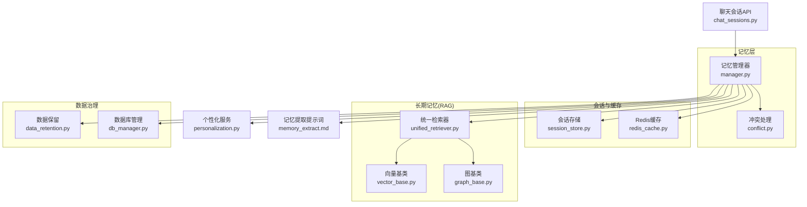
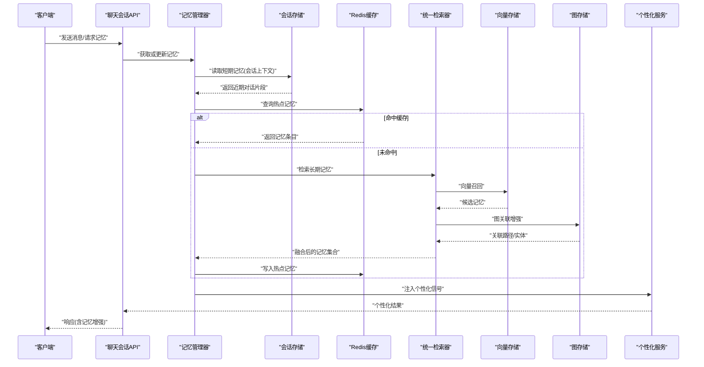
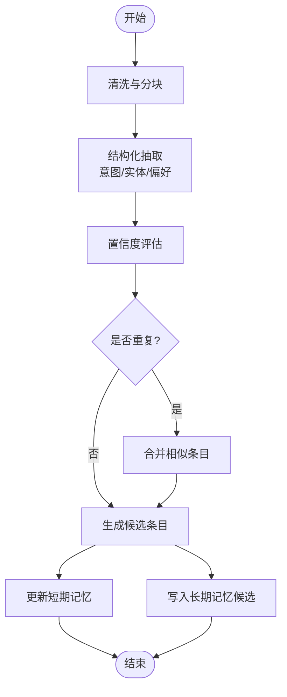
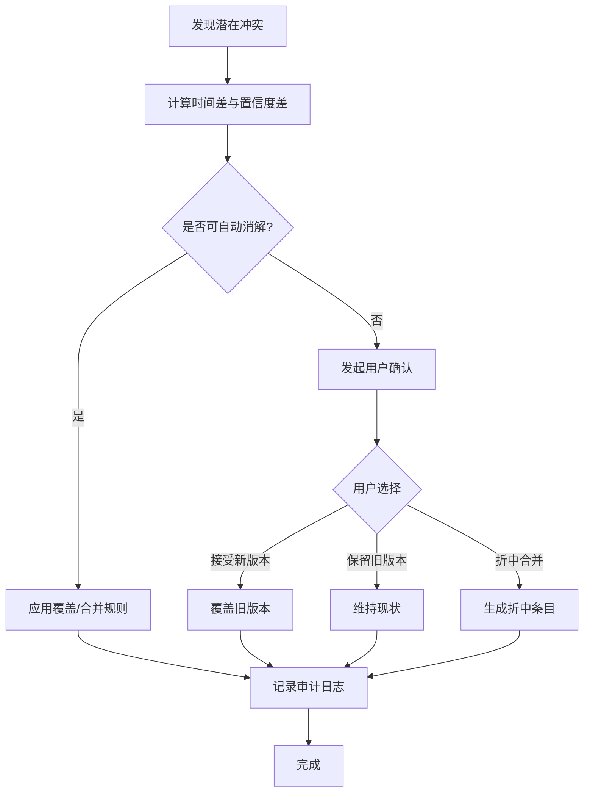
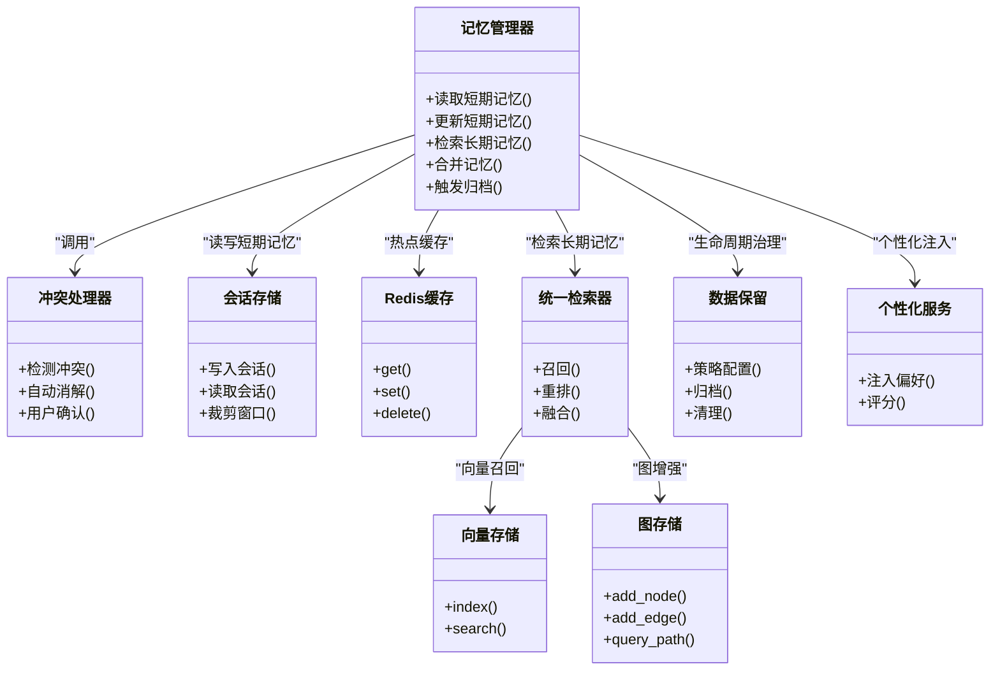

# 记忆管理系统

<cite>
**本文引用的文件**   
- [backend_design/nexus/memory/manager.py](file://backend_design/nexus/memory/manager.py)
- [backend_design/nexus/memory/conflict.py](file://backend_design/nexus/memory/conflict.py)
- [backend_design/nexus/memory/__init__.py](file://backend_design/nexus/memory/__init__.py)
- [backend_design/nexus/core/personalization.py](file://backend_design/nexus/core/personalization.py)
- [backend_design/nexus/models/schemas.py](file://backend_design/nexus/models/schemas.py)
- [backend_design/nexus/prompts/memory_extract.md](file://backend_design/nexus/prompts/memory_extract.md)
- [backend_design/nexus/middleware/session_store.py](file://backend_design/nexus/middleware/session_store.py)
- [backend_design/nexus/middleware/redis_cache.py](file://backend_design/nexus/middleware/redis_cache.py)
- [backend_design/nexus/rag/vector_base.py](file://backend_design/nexus/rag/vector_base.py)
- [backend_design/nexus/rag/graph_base.py](file://backend_design/nexus/rag/graph_base.py)
- [backend_design/nexus/rag/unified_retriever.py](file://backend_design/nexus/rag/unified_retriever.py)
- [backend_design/nexus/observability/data_retention.py](file://backend_design/nexus/observability/data_retention.py)
- [backend_design/nexus/api/routes/chat_sessions.py](file://backend_design/nexus/api/routes/chat_sessions.py)
- [backend_design/nexus/core/db_manager.py](file://backend_design/nexus/core/db_manager.py)
</cite>

## 目录
1. [简介](#简介)
2. [项目结构](#项目结构)
3. [核心组件](#核心组件)
4. [架构总览](#架构总览)
5. [详细组件分析](#详细组件分析)
6. [依赖关系分析](#依赖关系分析)
7. [性能考虑](#性能考虑)
8. [故障排查指南](#故障排查指南)
9. [结论](#结论)
10. [附录](#附录)

## 简介
本设计文档面向NexusCockpit的记忆管理系统，聚焦短期记忆与长期记忆的数据结构设计、索引策略、存储位置选择、提取算法、冲突检测与解决、压缩归档、隐私保护、可视化分析工具、性能优化以及备份恢复与迁移方案。目标是帮助开发者快速理解并扩展记忆系统，确保在对话场景中高效地沉淀用户偏好与关键信息，同时保障数据安全与可观测性。

## 项目结构
记忆管理相关代码主要位于后端模块的memory子系统中，并与RAG检索、会话存储、缓存、数据保留等子系统协作。整体组织方式采用分层与按功能域划分相结合：
- memory：记忆生命周期管理（写入、读取、合并、冲突处理）
- rag：向量与图结构的长期记忆存储与检索
- middleware：会话持久化与缓存层
- observability：数据保留与生命周期治理
- api：对外暴露的记忆查询接口
- core：通用能力（个性化、数据库连接等）

图表来源
- [backend_design/nexus/memory/manager.py](file://backend_design/nexus/memory/manager.py)
- [backend_design/nexus/memory/conflict.py](file://backend_design/nexus/memory/conflict.py)
- [backend_design/nexus/middleware/session_store.py](file://backend_design/nexus/middleware/session_store.py)
- [backend_design/nexus/middleware/redis_cache.py](file://backend_design/nexus/middleware/redis_cache.py)
- [backend_design/nexus/rag/vector_base.py](file://backend_design/nexus/rag/vector_base.py)
- [backend_design/nexus/rag/graph_base.py](file://backend_design/nexus/rag/graph_base.py)
- [backend_design/nexus/rag/unified_retriever.py](file://backend_design/nexus/rag/unified_retriever.py)
- [backend_design/nexus/observability/data_retention.py](file://backend_design/nexus/observability/data_retention.py)
- [backend_design/nexus/core/db_manager.py](file://backend_design/nexus/core/db_manager.py)
- [backend_design/nexus/api/routes/chat_sessions.py](file://backend_design/nexus/api/routes/chat_sessions.py)
- [backend_design/nexus/core/personalization.py](file://backend_design/nexus/core/personalization.py)
- [backend_design/nexus/prompts/memory_extract.md](file://backend_design/nexus/prompts/memory_extract.md)

章节来源
- [backend_design/nexus/memory/manager.py](file://backend_design/nexus/memory/manager.py)
- [backend_design/nexus/memory/conflict.py](file://backend_design/nexus/memory/conflict.py)
- [backend_design/nexus/middleware/session_store.py](file://backend_design/nexus/middleware/session_store.py)
- [backend_design/nexus/middleware/redis_cache.py](file://backend_design/nexus/middleware/redis_cache.py)
- [backend_design/nexus/rag/vector_base.py](file://backend_design/nexus/rag/vector_base.py)
- [backend_design/nexus/rag/graph_base.py](file://backend_design/nexus/rag/graph_base.py)
- [backend_design/nexus/rag/unified_retriever.py](file://backend_design/nexus/rag/unified_retriever.py)
- [backend_design/nexus/observability/data_retention.py](file://backend_design/nexus/observability/data_retention.py)
- [backend_design/nexus/core/db_manager.py](file://backend_design/nexus/core/db_manager.py)
- [backend_design/nexus/api/routes/chat_sessions.py](file://backend_design/nexus/api/routes/chat_sessions.py)
- [backend_design/nexus/core/personalization.py](file://backend_design/nexus/core/personalization.py)
- [backend_design/nexus/prompts/memory_extract.md](file://backend_design/nexus/prompts/memory_extract.md)

## 核心组件
- 记忆管理器：负责短期记忆的读写、长期记忆的索引与检索、记忆条目合并与冲突处理、压缩归档触发点。
- 冲突处理器：基于时间戳、置信度与语义相似度进行冲突检测与消解，支持用户确认流程。
- 会话存储：提供短期记忆的持久化与访问，包括会话上下文窗口管理。
- Redis缓存：热点记忆条目的快速读取与更新，降低底层存储压力。
- RAG检索：向量与图两种长期记忆存储，统一检索器屏蔽差异，提供召回与重排。
- 数据保留：定义记忆数据的生命周期策略（保留期、归档、清理）。
- 个性化服务：将记忆结果融入个性化推荐与行为建模。
- 记忆提取提示词：指导从对话历史中提取结构化记忆的关键信息。

章节来源
- [backend_design/nexus/memory/manager.py](file://backend_design/nexus/memory/manager.py)
- [backend_design/nexus/memory/conflict.py](file://backend_design/nexus/memory/conflict.py)
- [backend_design/nexus/middleware/session_store.py](file://backend_design/nexus/middleware/session_store.py)
- [backend_design/nexus/middleware/redis_cache.py](file://backend_design/nexus/middleware/redis_cache.py)
- [backend_design/nexus/rag/unified_retriever.py](file://backend_design/nexus/rag/unified_retriever.py)
- [backend_design/nexus/observability/data_retention.py](file://backend_design/nexus/observability/data_retention.py)
- [backend_design/nexus/core/personalization.py](file://backend_design/nexus/core/personalization.py)
- [backend_design/nexus/prompts/memory_extract.md](file://backend_design/nexus/prompts/memory_extract.md)

## 架构总览
记忆系统采用“短期记忆+长期记忆”的双层架构。短期记忆以会话为单位，强调低延迟与高吞吐；长期记忆通过向量化与图结构实现跨会话的知识沉淀与推理。统一检索器屏蔽底层存储差异，上层API仅关注业务语义。

图表来源
- [backend_design/nexus/api/routes/chat_sessions.py](file://backend_design/nexus/api/routes/chat_sessions.py)
- [backend_design/nexus/memory/manager.py](file://backend_design/nexus/memory/manager.py)
- [backend_design/nexus/middleware/session_store.py](file://backend_design/nexus/middleware/session_store.py)
- [backend_design/nexus/middleware/redis_cache.py](file://backend_design/nexus/middleware/redis_cache.py)
- [backend_design/nexus/rag/unified_retriever.py](file://backend_design/nexus/rag/unified_retriever.py)
- [backend_design/nexus/rag/vector_base.py](file://backend_design/nexus/rag/vector_base.py)
- [backend_design/nexus/rag/graph_base.py](file://backend_design/nexus/rag/graph_base.py)
- [backend_design/nexus/core/personalization.py](file://backend_design/nexus/core/personalization.py)

## 详细组件分析

### 数据结构设计：短期记忆与长期记忆
- 短期记忆
  - 定位：会话级上下文窗口，包含最近若干轮对话摘要与关键事件。
  - 存储位置：会话存储（持久化）+ Redis缓存（热读）。
  - 索引策略：会话ID + 时间戳排序，支持滑动窗口裁剪。
  - 格式要点：会话标识、时间戳、角色、内容摘要、标签（如意图、实体）、来源（ASR/文本）。
- 长期记忆
  - 定位：跨会话的用户偏好、习惯、知识事实与关系图谱。
  - 存储位置：向量存储（语义召回）+ 图存储（实体关系）。
  - 索引策略：向量索引（近似最近邻）+ 图节点/边索引（实体、关系类型）。
  - 格式要点：记忆条目（主题、内容、置信度、时间戳、来源、标签）、实体映射、关系三元组。

章节来源
- [backend_design/nexus/middleware/session_store.py](file://backend_design/nexus/middleware/session_store.py)
- [backend_design/nexus/middleware/redis_cache.py](file://backend_design/nexus/middleware/redis_cache.py)
- [backend_design/nexus/rag/vector_base.py](file://backend_design/nexus/rag/vector_base.py)
- [backend_design/nexus/rag/graph_base.py](file://backend_design/nexus/rag/graph_base.py)
- [backend_design/nexus/models/schemas.py](file://backend_design/nexus/models/schemas.py)

### 记忆条目格式定义与索引策略
- 记忆条目字段建议
  - id：唯一标识
  - type：短期/长期
  - subject：主题/实体
  - content：结构化内容（键值对或JSON）
  - confidence：置信度（0~1）
  - timestamp：创建/更新时间
  - source：来源（对话、外部系统、用户输入）
  - tags：标签（领域、场景、敏感级别）
  - owner_id：所属用户/租户
- 索引策略
  - 短期：会话ID + 时间戳复合索引，支持范围查询与分页。
  - 长期：向量维度索引（HNSW/IVF等），图节点主键与关系边索引。
  - 过滤条件：owner_id、tags、confidence阈值、时间窗口。

章节来源
- [backend_design/nexus/models/schemas.py](file://backend_design/nexus/models/schemas.py)
- [backend_design/nexus/rag/vector_base.py](file://backend_design/nexus/rag/vector_base.py)
- [backend_design/nexus/rag/graph_base.py](file://backend_design/nexus/rag/graph_base.py)

### 记忆提取算法：从对话历史到关键信息与偏好
- 输入：会话上下文窗口（短期记忆片段）
- 处理步骤
  - 清洗与分块：去除噪声、标准化文本、按语义切块。
  - 抽取：使用提示词驱动的结构化抽取（意图、实体、偏好、规则）。
  - 评估：生成置信度（基于证据强度、一致性、重复度）。
  - 去重与合并：基于主题与语义相似度合并相近条目。
  - 输出：短期记忆更新 + 长期记忆候选条目。
- 提示词工程：参考记忆提取提示词模板，约束输出结构与质量。

图表来源
- [backend_design/nexus/prompts/memory_extract.md](file://backend_design/nexus/prompts/memory_extract.md)
- [backend_design/nexus/memory/manager.py](file://backend_design/nexus/memory/manager.py)

章节来源
- [backend_design/nexus/prompts/memory_extract.md](file://backend_design/nexus/prompts/memory_extract.md)
- [backend_design/nexus/memory/manager.py](file://backend_design/nexus/memory/manager.py)

### 记忆冲突检测与解决机制
- 冲突来源
  - 同一主题在不同会话中出现不一致的事实或偏好。
  - 时间先后导致的覆盖需求（新信息应覆盖旧信息）。
  - 置信度差异导致的不确定性。
- 检测策略
  - 时间戳比较：较新的条目优先。
  - 置信度评估：结合证据强度与来源可信度。
  - 语义相似度：识别潜在冲突（同义不同表述）。
- 解决流程
  - 自动消解：依据时间/置信度规则合并或覆盖。
  - 用户确认：当冲突不可判定或影响较大时，发起用户确认。
  - 审计记录：记录冲突原因、决策依据与最终版本。

图表来源
- [backend_design/nexus/memory/conflict.py](file://backend_design/nexus/memory/conflict.py)
- [backend_design/nexus/memory/manager.py](file://backend_design/nexus/memory/manager.py)

章节来源
- [backend_design/nexus/memory/conflict.py](file://backend_design/nexus/memory/conflict.py)
- [backend_design/nexus/memory/manager.py](file://backend_design/nexus/memory/manager.py)

### 压缩与归档策略
- 压缩
  - 短期记忆：滑动窗口裁剪，仅保留最近N条或关键摘要。
  - 长期记忆：低频条目聚合为摘要，减少冗余。
- 归档
  - 基于数据保留策略，将冷数据迁移至低成本存储。
  - 归档后保留元数据索引，支持按需恢复。
- 触发点
  - 定期任务（定时清理/归档）。
  - 容量阈值（存储空间达到上限）。
  - 生命周期到期（超过保留期）。

章节来源
- [backend_design/nexus/observability/data_retention.py](file://backend_design/nexus/observability/data_retention.py)
- [backend_design/nexus/memory/manager.py](file://backend_design/nexus/memory/manager.py)

### 隐私保护机制
- 敏感信息过滤
  - 识别PII（个人身份信息）并进行脱敏或丢弃。
  - 基于标签与规则引擎控制敏感级别。
- 访问控制
  - 基于owner_id与租户隔离，限制跨用户/租户访问。
  - 最小权限原则，仅允许必要字段可见。
- 数据脱敏
  - 输出前对敏感字段进行掩码或哈希处理。
  - 日志与监控中避免泄露敏感信息。

章节来源
- [backend_design/nexus/models/schemas.py](file://backend_design/nexus/models/schemas.py)
- [backend_design/nexus/core/personalization.py](file://backend_design/nexus/core/personalization.py)

### 可视化分析工具
- 目标
  - 帮助开发者理解记忆使用模式、冲突分布、冷热比例、检索命中率。
- 指标建议
  - 记忆写入量/读取量、冲突次数、用户确认率、缓存命中率、检索延迟。
  - 主题热度、实体出现频率、置信度分布。
- 展示形式
  - 仪表盘（趋势图、热力图、拓扑图）。
  - 导出报表（CSV/JSON）用于离线分析。

[本节为概念性说明，不直接分析具体文件]

### 性能优化建议
- 缓存策略
  - 热点记忆条目入Redis，设置合理TTL与失效策略。
  - 多级缓存（本地内存+分布式缓存）。
- 批量操作
  - 批量写入/更新记忆条目，减少网络往返。
  - 批量检索与重排，提升吞吐。
- 异步处理
  - 记忆提取与合并任务异步执行，避免阻塞主链路。
  - 使用任务队列进行削峰填谷。
- 索引优化
  - 调整向量索引参数（efConstruction、M等）平衡精度与速度。
  - 图查询路径剪枝与预计算常用关系。

章节来源
- [backend_design/nexus/middleware/redis_cache.py](file://backend_design/nexus/middleware/redis_cache.py)
- [backend_design/nexus/rag/vector_base.py](file://backend_design/nexus/rag/vector_base.py)
- [backend_design/nexus/rag/graph_base.py](file://backend_design/nexus/rag/graph_base.py)
- [backend_design/nexus/memory/manager.py](file://backend_design/nexus/memory/manager.py)

### 备份、恢复与迁移方案
- 备份
  - 定期快照（短期记忆与长期记忆元数据）。
  - 增量备份（基于时间戳与变更日志）。
- 恢复
  - 全量恢复与选择性恢复（按用户/租户/主题）。
  - 校验与一致性检查（哈希校验、完整性验证）。
- 迁移
  - 版本化迁移脚本，保证向后兼容。
  - 灰度发布与回滚策略。
  - 数据字典与索引重建。

章节来源
- [backend_design/nexus/observability/data_retention.py](file://backend_design/nexus/observability/data_retention.py)
- [backend_design/nexus/core/db_manager.py](file://backend_design/nexus/core/db_manager.py)

## 依赖关系分析
记忆管理器作为中枢，依赖会话存储、缓存、RAG检索、冲突处理、数据保留与个性化服务。统一检索器屏蔽向量与图存储差异，API层仅关注业务语义。

图表来源
- [backend_design/nexus/memory/manager.py](file://backend_design/nexus/memory/manager.py)
- [backend_design/nexus/memory/conflict.py](file://backend_design/nexus/memory/conflict.py)
- [backend_design/nexus/middleware/session_store.py](file://backend_design/nexus/middleware/session_store.py)
- [backend_design/nexus/middleware/redis_cache.py](file://backend_design/nexus/middleware/redis_cache.py)
- [backend_design/nexus/rag/unified_retriever.py](file://backend_design/nexus/rag/unified_retriever.py)
- [backend_design/nexus/rag/vector_base.py](file://backend_design/nexus/rag/vector_base.py)
- [backend_design/nexus/rag/graph_base.py](file://backend_design/nexus/rag/graph_base.py)
- [backend_design/nexus/observability/data_retention.py](file://backend_design/nexus/observability/data_retention.py)
- [backend_design/nexus/core/personalization.py](file://backend_design/nexus/core/personalization.py)

章节来源
- [backend_design/nexus/memory/manager.py](file://backend_design/nexus/memory/manager.py)
- [backend_design/nexus/memory/conflict.py](file://backend_design/nexus/memory/conflict.py)
- [backend_design/nexus/middleware/session_store.py](file://backend_design/nexus/middleware/session_store.py)
- [backend_design/nexus/middleware/redis_cache.py](file://backend_design/nexus/middleware/redis_cache.py)
- [backend_design/nexus/rag/unified_retriever.py](file://backend_design/nexus/rag/unified_retriever.py)
- [backend_design/nexus/rag/vector_base.py](file://backend_design/nexus/rag/vector_base.py)
- [backend_design/nexus/rag/graph_base.py](file://backend_design/nexus/rag/graph_base.py)
- [backend_design/nexus/observability/data_retention.py](file://backend_design/nexus/observability/data_retention.py)
- [backend_design/nexus/core/personalization.py](file://backend_design/nexus/core/personalization.py)

## 性能考虑
- 缓存命中率优化：合理设置TTL与预热策略，避免缓存穿透与雪崩。
- 批量写入与检索：减少IO次数，提高吞吐。
- 异步任务：将耗时操作（提取、合并、归档）异步化，降低主链路延迟。
- 索引参数调优：根据数据规模与查询模式调整向量与图索引参数。
- 资源隔离：按租户或用户隔离缓存与存储资源，避免相互干扰。

[本节为通用性能建议，不直接分析具体文件]

## 故障排查指南
- 常见问题
  - 缓存未命中率高：检查TTL设置与预热逻辑。
  - 检索延迟高：检查向量索引参数与图查询复杂度。
  - 冲突频繁：审查置信度评估与合并规则。
  - 数据丢失：核对备份与恢复流程的一致性校验。
- 诊断手段
  - 查看审计日志与冲突记录。
  - 监控指标（命中率、延迟、错误率）。
  - 回放会话与记忆提取过程。

章节来源
- [backend_design/nexus/memory/conflict.py](file://backend_design/nexus/memory/conflict.py)
- [backend_design/nexus/observability/data_retention.py](file://backend_design/nexus/observability/data_retention.py)

## 结论
本设计文档系统化阐述了NexusCockpit记忆管理系统的架构与实现要点，涵盖数据结构、索引策略、提取算法、冲突处理、压缩归档、隐私保护、可视化分析与性能优化等方面。通过短期与长期记忆的双层设计与统一的检索抽象，系统在保持低延迟的同时实现了跨会话的知识沉淀与个性化增强。建议在落地过程中持续监控关键指标，迭代优化索引与合并策略，完善隐私与合规措施，确保系统稳定可靠。

## 附录
- 术语表
  - 短期记忆：会话级上下文，强调时效性与低延迟。
  - 长期记忆：跨会话知识沉淀，强调可检索与可推理。
  - 置信度：衡量记忆条目可靠性的数值指标。
  - 冲突：同一主题下的不一致记忆条目。
- 参考文件
  - 记忆管理器与冲突处理：见引用文件列表
  - 会话与缓存：见引用文件列表
  - RAG检索：见引用文件列表
  - 数据保留与数据库管理：见引用文件列表
  - API与个性化：见引用文件列表
  - 提示词模板：见引用文件列表