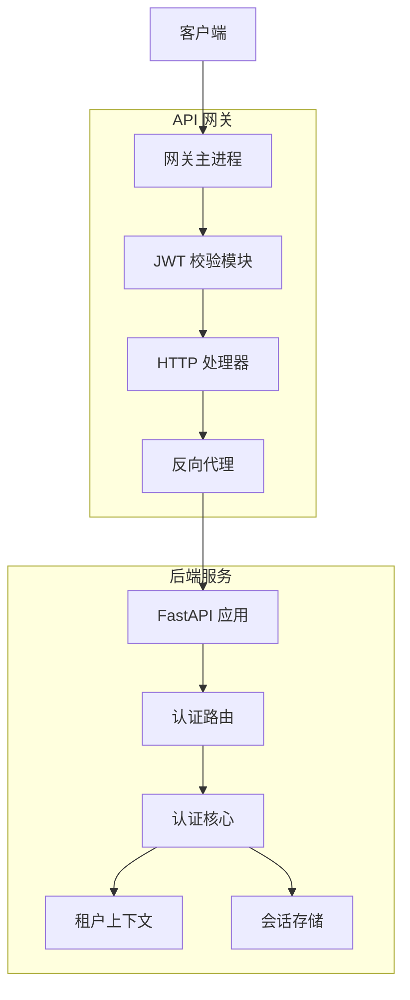
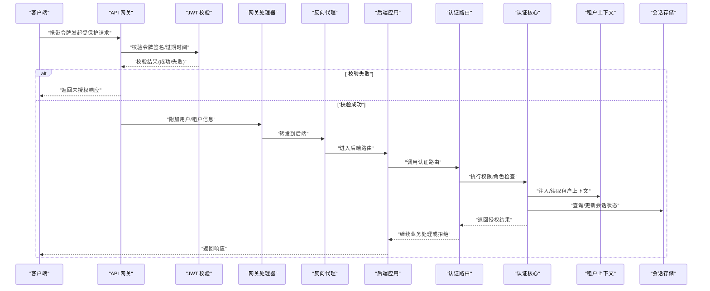
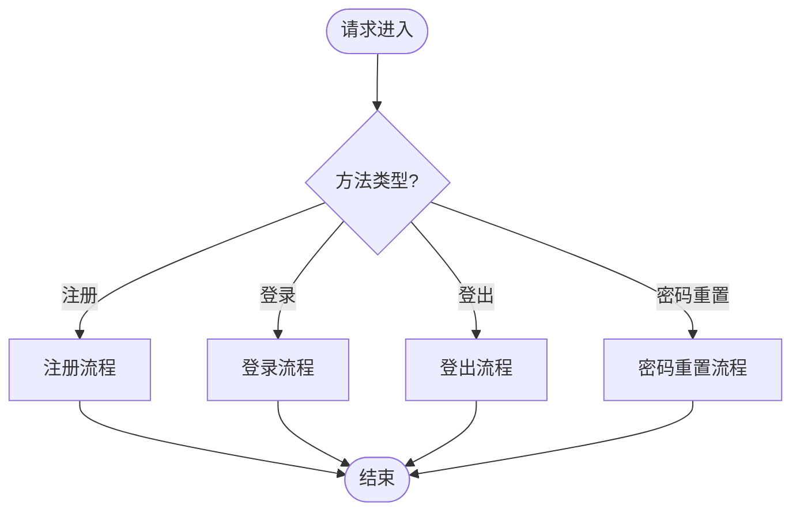
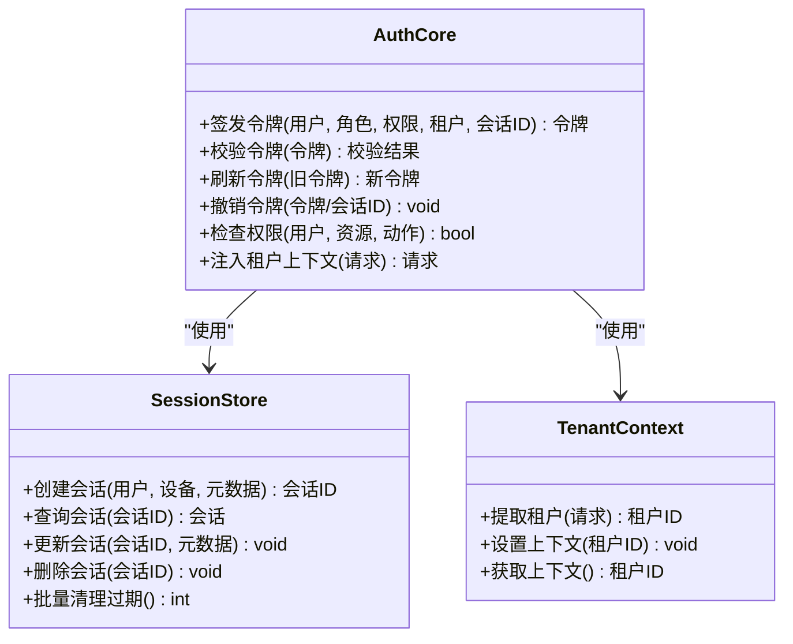
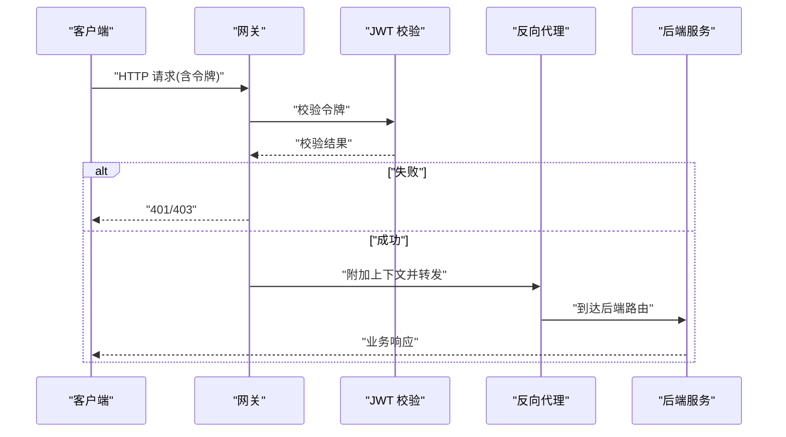
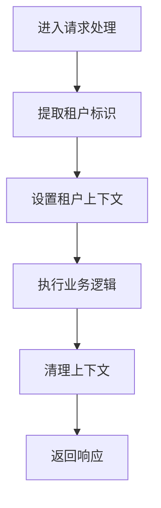
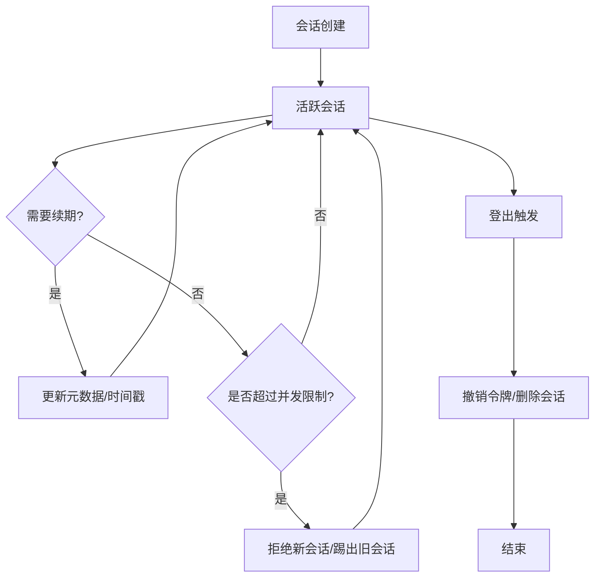
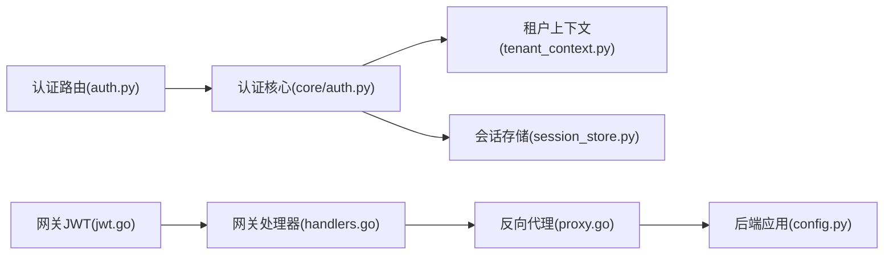

# 身份认证与授权

<cite>
**本文引用的文件**   
- [backend_design/nexus/api/routes/auth.py](file://backend_design/nexus/api/routes/auth.py)
- [backend_design/nexus/core/auth.py](file://backend_design/nexus/core/auth.py)
- [backend_design/nexus/core/tenant_context.py](file://backend_design/nexus/core/tenant_context.py)
- [backend_design/nexus/middleware/session_store.py](file://backend_design/nexus/middleware/session_store.py)
- [backend_design/nexus_gate/internal/auth/jwt.go](file://backend_design/nexus_gate/internal/auth/jwt.go)
- [backend_design/nexus_gate/internal/handlers/handlers.go](file://backend_design/nexus_gate/internal/handlers/handlers.go)
- [backend_design/nexus_gate/internal/proxy/proxy.go](file://backend_design/nexus_gate/internal/proxy/proxy.go)
- [backend_design/nexus/config.py](file://backend_design/nexus/config.py)
</cite>

## 目录
1. [简介](#简介)
2. [项目结构](#项目结构)
3. [核心组件](#核心组件)
4. [架构总览](#架构总览)
5. [详细组件分析](#详细组件分析)
6. [依赖关系分析](#依赖关系分析)
7. [性能考虑](#性能考虑)
8. [故障排查指南](#故障排查指南)
9. [结论](#结论)
10. [附录](#附录)

## 简介
本技术文档聚焦于 NexusCockpit 的身份认证与授权体系，覆盖以下关键主题：
- JWT 令牌的生成、验证与刷新机制，以及令牌生命周期管理与安全存储策略
- 基于角色的访问控制（RBAC）实现，包括权限层级设计与动态权限分配
- 多租户隔离机制，确保不同租户间的数据安全与资源隔离
- API 网关层的认证中间件实现，涵盖请求拦截、令牌验证与权限检查流程
- 用户注册、登录、密码重置等核心认证流程的实现细节
- 会话管理、并发登录控制与登出清理机制
- 安全最佳实践，包括令牌加密、防重放攻击与敏感信息保护

## 项目结构
NexusCockpit 的认证与授权由“后端服务 + API 网关”两部分协同完成：
- 后端服务（Python）负责业务侧的用户认证、会话管理、RBAC 与多租户上下文注入
- API 网关（Go）负责统一入口的鉴权校验、转发与限流等通用能力

图表来源
- [backend_design/nexus_gate/internal/auth/jwt.go](file://backend_design/nexus_gate/internal/auth/jwt.go)
- [backend_design/nexus_gate/internal/handlers/handlers.go](file://backend_design/nexus_gate/internal/handlers/handlers.go)
- [backend_design/nexus_gate/internal/proxy/proxy.go](file://backend_design/nexus_gate/internal/proxy/proxy.go)
- [backend_design/nexus/api/routes/auth.py](file://backend_design/nexus/api/routes/auth.py)
- [backend_design/nexus/core/auth.py](file://backend_design/nexus/core/auth.py)
- [backend_design/nexus/core/tenant_context.py](file://backend_design/nexus/core/tenant_context.py)
- [backend_design/nexus/middleware/session_store.py](file://backend_design/nexus/middleware/session_store.py)

章节来源
- [backend_design/nexus/api/routes/auth.py](file://backend_design/nexus/api/routes/auth.py)
- [backend_design/nexus/core/auth.py](file://backend_design/nexus/core/auth.py)
- [backend_design/nexus/core/tenant_context.py](file://backend_design/nexus/core/tenant_context.py)
- [backend_design/nexus/middleware/session_store.py](file://backend_design/nexus/middleware/session_store.py)
- [backend_design/nexus_gate/internal/auth/jwt.go](file://backend_design/nexus_gate/internal/auth/jwt.go)
- [backend_design/nexus_gate/internal/handlers/handlers.go](file://backend_design/nexus_gate/internal/handlers/handlers.go)
- [backend_design/nexus_gate/internal/proxy/proxy.go](file://backend_design/nexus_gate/internal/proxy/proxy.go)

## 核心组件
- 认证路由层：提供注册、登录、登出、密码重置等 HTTP 接口，协调令牌签发与会话操作
- 认证核心：封装 JWT 签发/校验、密码哈希校验、权限解析与 RBAC 决策
- 租户上下文：在请求处理链路中注入并传播租户标识，驱动数据隔离
- 会话存储：持久化会话状态，支持并发登录控制与登出清理
- 网关 JWT 校验：在网关层对入站请求进行统一的令牌校验与透传

章节来源
- [backend_design/nexus/api/routes/auth.py](file://backend_design/nexus/api/routes/auth.py)
- [backend_design/nexus/core/auth.py](file://backend_design/nexus/core/auth.py)
- [backend_design/nexus/core/tenant_context.py](file://backend_design/nexus/core/tenant_context.py)
- [backend_design/nexus/middleware/session_store.py](file://backend_design/nexus/middleware/session_store.py)
- [backend_design/nexus_gate/internal/auth/jwt.go](file://backend_design/nexus_gate/internal/auth/jwt.go)

## 架构总览
整体认证与授权架构采用“网关前置校验 + 后端精细控制”的分层模式。网关层快速拒绝非法请求，后端层承载复杂业务逻辑与多租户隔离。

图表来源
- [backend_design/nexus_gate/internal/auth/jwt.go](file://backend_design/nexus_gate/internal/auth/jwt.go)
- [backend_design/nexus_gate/internal/handlers/handlers.go](file://backend_design/nexus_gate/internal/handlers/handlers.go)
- [backend_design/nexus_gate/internal/proxy/proxy.go](file://backend_design/nexus_gate/internal/proxy/proxy.go)
- [backend_design/nexus/api/routes/auth.py](file://backend_design/nexus/api/routes/auth.py)
- [backend_design/nexus/core/auth.py](file://backend_design/nexus/core/auth.py)
- [backend_design/nexus/core/tenant_context.py](file://backend_design/nexus/core/tenant_context.py)
- [backend_design/nexus/middleware/session_store.py](file://backend_design/nexus/middleware/session_store.py)

## 详细组件分析

### 认证路由层（注册、登录、登出、密码重置）
- 职责
  - 接收注册、登录、登出、密码重置等请求
  - 调用认证核心完成用户核验、令牌签发/撤销、密码更新
  - 与租户上下文和会话存储交互，维护会话与租户边界
- 关键流程
  - 注册：校验输入 -> 创建用户 -> 初始化默认角色/权限 -> 返回必要信息
  - 登录：校验凭据 -> 签发 JWT -> 写入会话 -> 返回令牌与会话信息
  - 登出：根据会话标识撤销令牌/清理会话 -> 返回成功
  - 密码重置：校验重置凭证 -> 更新密码 -> 失效旧会话（可选）

图表来源
- [backend_design/nexus/api/routes/auth.py](file://backend_design/nexus/api/routes/auth.py)
- [backend_design/nexus/core/auth.py](file://backend_design/nexus/core/auth.py)
- [backend_design/nexus/middleware/session_store.py](file://backend_design/nexus/middleware/session_store.py)

章节来源
- [backend_design/nexus/api/routes/auth.py](file://backend_design/nexus/api/routes/auth.py)
- [backend_design/nexus/core/auth.py](file://backend_design/nexus/core/auth.py)
- [backend_design/nexus/middleware/session_store.py](file://backend_design/nexus/middleware/session_store.py)

### 认证核心（JWT、RBAC、会话）
- 职责
  - JWT 签发与校验：包含签名算法、有效期、载荷字段设计
  - RBAC 决策：基于角色与权限集合进行访问控制
  - 会话管理：会话创建、续期、失效与并发控制
  - 租户上下文：从请求头或令牌载荷中提取租户标识并注入
- 关键要点
  - 令牌载荷建议包含：用户标识、角色列表、权限集合、租户标识、会话标识、签发时间、过期时间
  - RBAC 模型建议采用“用户-角色-权限”三层结构，支持继承与动态分配
  - 会话存储需支持原子操作与过期清理，避免僵尸会话

图表来源
- [backend_design/nexus/core/auth.py](file://backend_design/nexus/core/auth.py)
- [backend_design/nexus/middleware/session_store.py](file://backend_design/nexus/middleware/session_store.py)
- [backend_design/nexus/core/tenant_context.py](file://backend_design/nexus/core/tenant_context.py)

章节来源
- [backend_design/nexus/core/auth.py](file://backend_design/nexus/core/auth.py)
- [backend_design/nexus/middleware/session_store.py](file://backend_design/nexus/middleware/session_store.py)
- [backend_design/nexus/core/tenant_context.py](file://backend_design/nexus/core/tenant_context.py)

### API 网关层（JWT 校验与转发）
- 职责
  - 统一入口拦截请求，校验 JWT 签名与有效期
  - 将用户/租户信息注入下游请求头
  - 转发至后端服务，必要时附加限流与审计标记
- 关键流程
  - 接收请求 -> 提取 Authorization 头 -> 校验 JWT -> 失败则直接拒绝 -> 成功则附加上下文并转发

图表来源
- [backend_design/nexus_gate/internal/auth/jwt.go](file://backend_design/nexus_gate/internal/auth/jwt.go)
- [backend_design/nexus_gate/internal/handlers/handlers.go](file://backend_design/nexus_gate/internal/handlers/handlers.go)
- [backend_design/nexus_gate/internal/proxy/proxy.go](file://backend_design/nexus_gate/internal/proxy/proxy.go)

章节来源
- [backend_design/nexus_gate/internal/auth/jwt.go](file://backend_design/nexus_gate/internal/auth/jwt.go)
- [backend_design/nexus_gate/internal/handlers/handlers.go](file://backend_design/nexus_gate/internal/handlers/handlers.go)
- [backend_design/nexus_gate/internal/proxy/proxy.go](file://backend_design/nexus_gate/internal/proxy/proxy.go)

### 多租户隔离机制
- 设计要点
  - 租户标识来源：可从 JWT 载荷或请求头注入
  - 上下文传播：在请求处理链中始终携带租户标识
  - 数据隔离：所有数据访问需强制带上租户过滤条件
- 典型流程
  - 提取租户 -> 设置上下文 -> 业务处理 -> 清理上下文

图表来源
- [backend_design/nexus/core/tenant_context.py](file://backend_design/nexus/core/tenant_context.py)

章节来源
- [backend_design/nexus/core/tenant_context.py](file://backend_design/nexus/core/tenant_context.py)

### 会话管理、并发登录控制与登出清理
- 会话管理
  - 创建：登录成功后生成会话记录，绑定用户、设备与元数据
  - 续期：根据策略更新最后活跃时间或刷新令牌
  - 失效：登出或异常时主动删除会话
- 并发登录控制
  - 可配置最大并发会话数，超出时拒绝或踢出最早会话
  - 通过会话 ID 与设备指纹识别唯一会话
- 登出清理
  - 服务端主动撤销令牌并删除会话
  - 定期任务清理过期会话，释放资源

图表来源
- [backend_design/nexus/middleware/session_store.py](file://backend_design/nexus/middleware/session_store.py)
- [backend_design/nexus/core/auth.py](file://backend_design/nexus/core/auth.py)

章节来源
- [backend_design/nexus/middleware/session_store.py](file://backend_design/nexus/middleware/session_store.py)
- [backend_design/nexus/core/auth.py](file://backend_design/nexus/core/auth.py)

### 安全最佳实践
- 令牌加密与签名
  - 使用强签名算法与足够长度的密钥
  - 合理设置短期有效期的访问令牌与长期有效的刷新令牌
- 防重放攻击
  - 引入一次性随机数（nonce）、时间戳与签名校验
  - 网关层增加请求去重与速率限制
- 敏感信息保护
  - 不在令牌载荷中存放敏感数据
  - 传输全程使用 HTTPS，前端安全存储令牌（如内存或安全 Cookie）
- 最小权限原则
  - 仅授予必要的角色与权限，定期审计与回收
- 审计与监控
  - 记录认证与授权事件，结合日志与指标进行告警

[本节为通用指导，不直接分析具体文件]

## 依赖关系分析
认证与授权相关模块之间的依赖关系如下：

图表来源
- [backend_design/nexus/api/routes/auth.py](file://backend_design/nexus/api/routes/auth.py)
- [backend_design/nexus/core/auth.py](file://backend_design/nexus/core/auth.py)
- [backend_design/nexus/core/tenant_context.py](file://backend_design/nexus/core/tenant_context.py)
- [backend_design/nexus/middleware/session_store.py](file://backend_design/nexus/middleware/session_store.py)
- [backend_design/nexus_gate/internal/auth/jwt.go](file://backend_design/nexus_gate/internal/auth/jwt.go)
- [backend_design/nexus_gate/internal/handlers/handlers.go](file://backend_design/nexus_gate/internal/handlers/handlers.go)
- [backend_design/nexus_gate/internal/proxy/proxy.go](file://backend_design/nexus_gate/internal/proxy/proxy.go)
- [backend_design/nexus/config.py](file://backend_design/nexus/config.py)

章节来源
- [backend_design/nexus/api/routes/auth.py](file://backend_design/nexus/api/routes/auth.py)
- [backend_design/nexus/core/auth.py](file://backend_design/nexus/core/auth.py)
- [backend_design/nexus/core/tenant_context.py](file://backend_design/nexus/core/tenant_context.py)
- [backend_design/nexus/middleware/session_store.py](file://backend_design/nexus/middleware/session_store.py)
- [backend_design/nexus_gate/internal/auth/jwt.go](file://backend_design/nexus_gate/internal/auth/jwt.go)
- [backend_design/nexus_gate/internal/handlers/handlers.go](file://backend_design/nexus_gate/internal/handlers/handlers.go)
- [backend_design/nexus_gate/internal/proxy/proxy.go](file://backend_design/nexus_gate/internal/proxy/proxy.go)
- [backend_design/nexus/config.py](file://backend_design/nexus/config.py)

## 性能考虑
- 令牌校验尽量在网关层完成，减少后端压力
- 会话存储选择高性能键值存储，启用过期自动清理
- RBAC 决策缓存热点权限映射，降低频繁计算开销
- 合理设置令牌有效期与刷新策略，平衡安全性与用户体验
- 对高频认证接口实施限流与熔断，防止恶意刷取

[本节为通用指导，不直接分析具体文件]

## 故障排查指南
- 常见错误
  - 令牌无效或过期：检查签名算法、密钥一致性与过期时间
  - 权限不足：确认用户角色与权限映射是否正确
  - 会话丢失：检查会话存储可用性与清理策略
  - 租户上下文缺失：确认令牌载荷或请求头是否包含租户标识
- 定位步骤
  - 查看网关日志中的 JWT 校验结果
  - 检查后端认证路由与核心模块的错误码
  - 核对会话存储中是否存在对应会话记录
  - 验证租户上下文是否在请求链中被正确注入

章节来源
- [backend_design/nexus_gate/internal/auth/jwt.go](file://backend_design/nexus_gate/internal/auth/jwt.go)
- [backend_design/nexus/api/routes/auth.py](file://backend_design/nexus/api/routes/auth.py)
- [backend_design/nexus/core/auth.py](file://backend_design/nexus/core/auth.py)
- [backend_design/nexus/middleware/session_store.py](file://backend_design/nexus/middleware/session_store.py)
- [backend_design/nexus/core/tenant_context.py](file://backend_design/nexus/core/tenant_context.py)

## 结论
NexusCockpit 的认证与授权体系通过“网关前置校验 + 后端精细控制”的分层架构，实现了高可用的 JWT 令牌管理、灵活的 RBAC 权限控制与严格的多租户数据隔离。配合完善的会话管理与安全最佳实践，系统能够在保障安全性的同时提供良好的用户体验与扩展性。

[本节为总结性内容，不直接分析具体文件]

## 附录
- 术语说明
  - JWT：JSON Web Token，用于在客户端与服务端之间传递声明
  - RBAC：基于角色的访问控制，通过角色与权限组合实现细粒度控制
  - 多租户：同一实例下为多个租户提供隔离的资源与数据访问
- 参考配置
  - 全局配置项（如密钥、超时、限流等）可在后端配置文件中集中管理

章节来源
- [backend_design/nexus/config.py](file://backend_design/nexus/config.py)