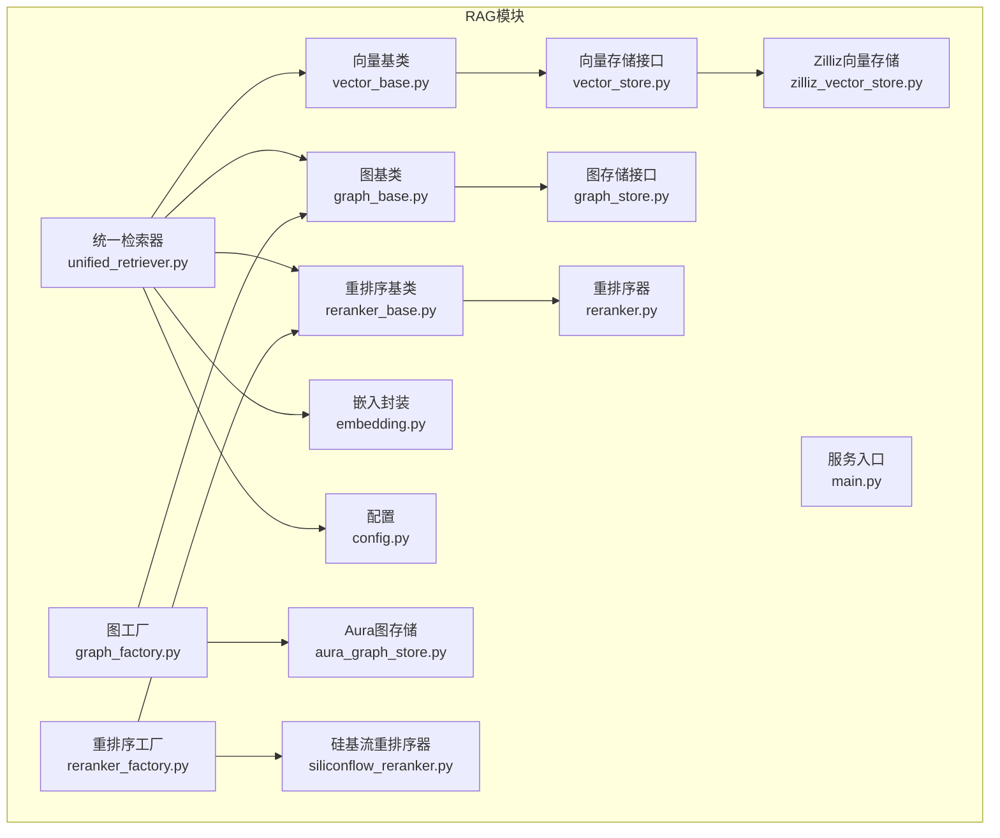
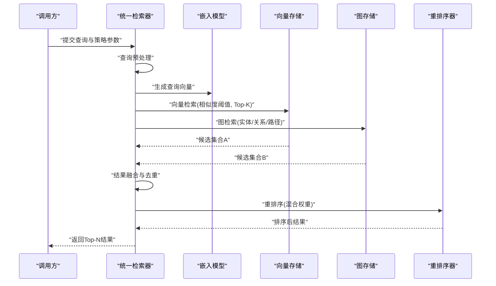
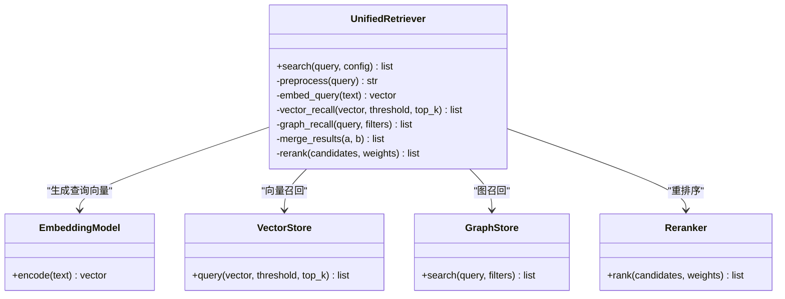
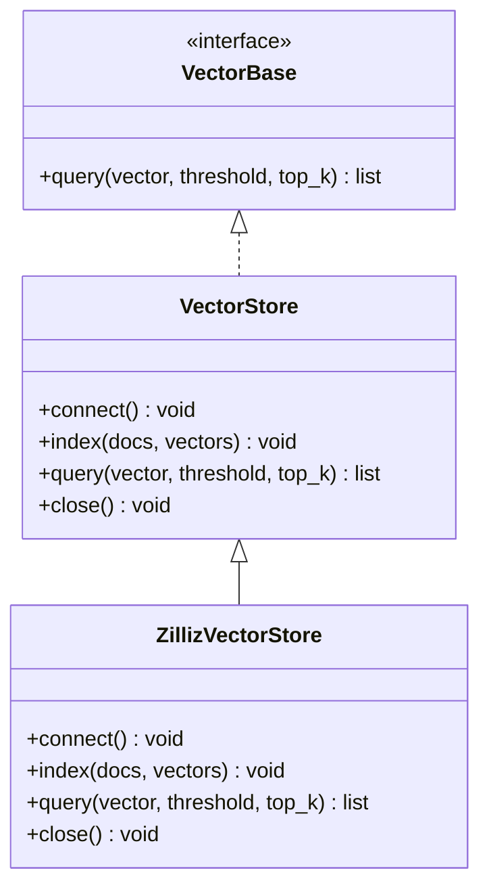
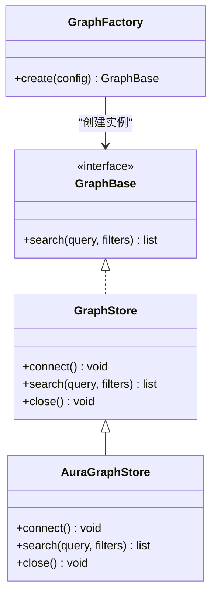
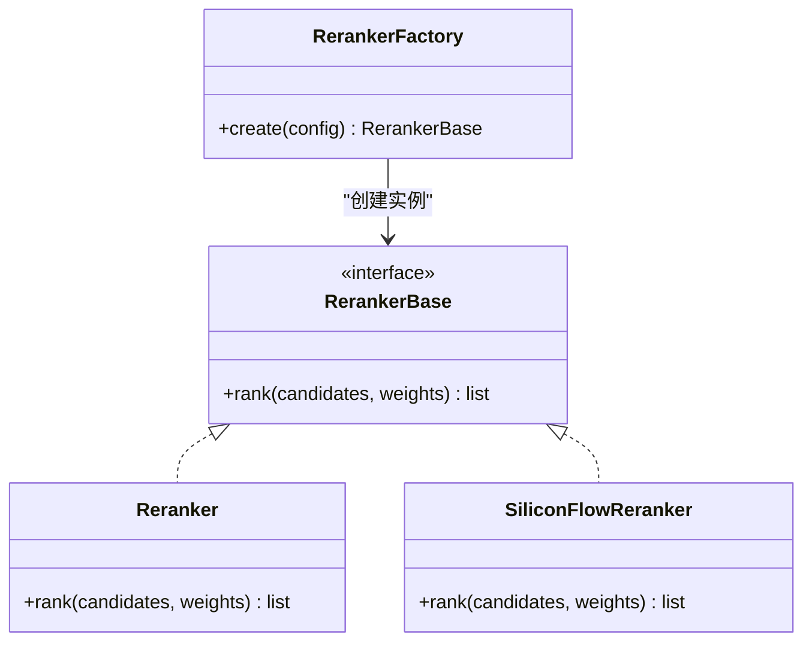
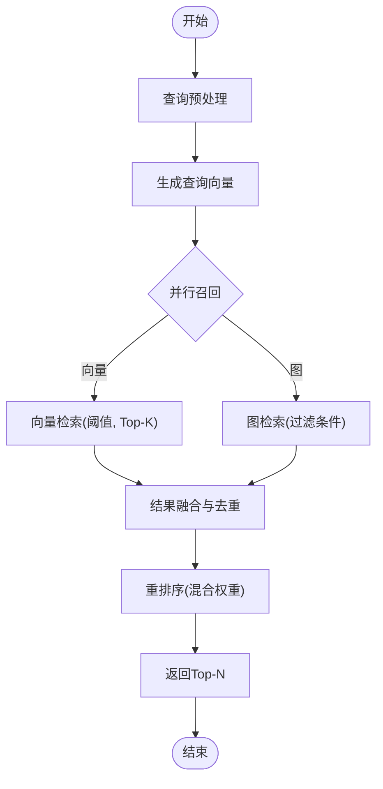
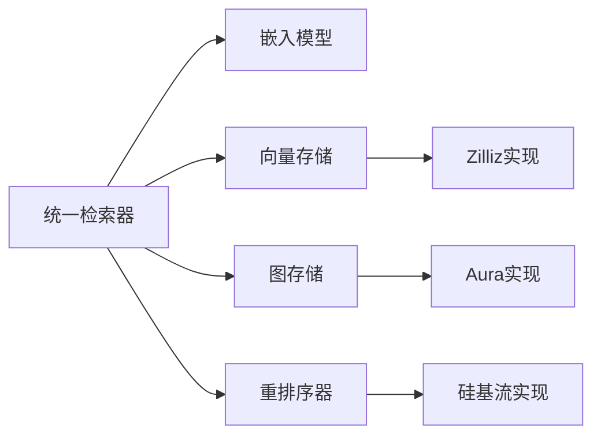

# RAG检索增强生成系统

<cite>
**本文引用的文件**   
- [unified_retriever.py](file://backend_design/nexus/rag/unified_retriever.py)
- [retriever.py](file://backend_design/nexus/rag/retriever.py)
- [vector_base.py](file://backend_design/nexus/rag/vector_base.py)
- [vector_store.py](file://backend_design/nexus/rag/vector_store.py)
- [zilliz_vector_store.py](file://backend_design/nexus/rag/zilliz_vector_store.py)
- [graph_base.py](file://backend_design/nexus/rag/graph_base.py)
- [graph_factory.py](file://backend_design/nexus/rag/graph_factory.py)
- [graph_store.py](file://backend_design/nexus/rag/graph_store.py)
- [aura_graph_store.py](file://backend_design/nexus/rag/aura_graph_store.py)
- [reranker_base.py](file://backend_design/nexus/rag/reranker_base.py)
- [reranker.py](file://backend_design/nexus/rag/reranker.py)
- [reranker_factory.py](file://backend_design/nexus/rag/reranker_factory.py)
- [siliconflow_reranker.py](file://backend_design/nexus/rag/siliconflow_reranker.py)
- [embedding.py](file://backend_design/nexus/rag/embedding.py)
- [config.py](file://backend_design/nexus/config.py)
- [main.py](file://backend_design/nexus/main.py)
</cite>

## 目录
1. [简介](#简介)
2. [项目结构](#项目结构)
3. [核心组件](#核心组件)
4. [架构总览](#架构总览)
5. [详细组件分析](#详细组件分析)
6. [依赖关系分析](#依赖关系分析)
7. [性能考虑](#性能考虑)
8. [故障排查指南](#故障排查指南)
9. [结论](#结论)
10. [附录](#附录)

## 简介
本技术文档面向NexusCockpit的RAG（检索增强生成）子系统，重点阐述统一检索器的架构设计与实现。统一检索器协调“向量检索”和“知识图谱检索”双路召回，提供查询预处理、语义理解、多路召回、结果融合与重排序的完整流程。文档同时给出检索策略配置项说明、性能优化建议以及使用示例路径，帮助开发者快速集成与调优。

## 项目结构
RAG相关代码位于 backend_design/nexus/rag 目录，采用分层与工厂模式组织：
- 抽象接口层：定义向量存储、图存储、重排序等通用接口
- 具体实现层：Zilliz向量库、Aura图存储、多种重排序器
- 编排层：统一检索器负责串联各阶段并输出最终结果
- 工具与配置：嵌入模型封装、全局配置、服务入口

图表来源
- [unified_retriever.py](file://backend_design/nexus/rag/unified_retriever.py)
- [vector_base.py](file://backend_design/nexus/rag/vector_base.py)
- [vector_store.py](file://backend_design/nexus/rag/vector_store.py)
- [zilliz_vector_store.py](file://backend_design/nexus/rag/zilliz_vector_store.py)
- [graph_base.py](file://backend_design/nexus/rag/graph_base.py)
- [graph_factory.py](file://backend_design/nexus/rag/graph_factory.py)
- [graph_store.py](file://backend_design/nexus/rag/graph_store.py)
- [aura_graph_store.py](file://backend_design/nexus/rag/aura_graph_store.py)
- [reranker_base.py](file://backend_design/nexus/rag/reranker_base.py)
- [reranker.py](file://backend_design/nexus/rag/reranker.py)
- [reranker_factory.py](file://backend_design/nexus/rag/reranker_factory.py)
- [siliconflow_reranker.py](file://backend_design/nexus/rag/siliconflow_reranker.py)
- [embedding.py](file://backend_design/nexus/rag/embedding.py)
- [config.py](file://backend_design/nexus/config.py)
- [main.py](file://backend_design/nexus/main.py)

章节来源
- [unified_retriever.py](file://backend_design/nexus/rag/unified_retriever.py)
- [config.py](file://backend_design/nexus/config.py)
- [main.py](file://backend_design/nexus/main.py)

## 核心组件
- 统一检索器：对外暴露统一的检索接口，内部协调向量与图检索，执行结果融合与重排序。
- 向量检索：基于向量相似度进行召回，支持阈值过滤与Top-K限制。
- 知识图谱检索：基于图结构与语义匹配进行实体/关系级召回。
- 重排序：对多路召回结果进行二次打分与排序，提升相关性。
- 嵌入模型：将文本转换为向量表示，供向量检索使用。
- 配置中心：集中管理检索策略参数（阈值、数量、权重等）。

章节来源
- [unified_retriever.py](file://backend_design/nexus/rag/unified_retriever.py)
- [vector_base.py](file://backend_design/nexus/rag/vector_base.py)
- [graph_base.py](file://backend_design/nexus/rag/graph_base.py)
- [reranker_base.py](file://backend_design/nexus/rag/reranker_base.py)
- [embedding.py](file://backend_design/nexus/rag/embedding.py)
- [config.py](file://backend_design/nexus/config.py)

## 架构总览
统一检索器作为中枢，按以下阶段处理查询：
- 查询预处理：清洗、分词、意图识别或关键词提取（可选）
- 语义理解：通过嵌入模型生成查询向量，必要时构造图查询条件
- 多路召回：并行发起向量检索与图检索
- 结果融合：去重、合并、初步评分
- 重排序：调用重排序器进行精细排序，返回最终Top-N

图表来源
- [unified_retriever.py](file://backend_design/nexus/rag/unified_retriever.py)
- [embedding.py](file://backend_design/nexus/rag/embedding.py)
- [vector_store.py](file://backend_design/nexus/rag/vector_store.py)
- [graph_store.py](file://backend_design/nexus/rag/graph_store.py)
- [reranker.py](file://backend_design/nexus/rag/reranker.py)

## 详细组件分析

### 统一检索器
职责与流程
- 接收查询与策略配置（相似度阈值、返回数量、混合权重等）
- 调用嵌入模型生成查询向量
- 并发触发向量与图检索
- 对两路结果进行融合与去重
- 调用重排序器进行最终排序
- 返回Top-N结果

关键设计点
- 可插拔：通过工厂与接口解耦不同后端实现
- 可配置：阈值、Top-K、权重等参数由配置驱动
- 可扩展：新增检索源或重排序器无需修改主流程

图表来源
- [unified_retriever.py](file://backend_design/nexus/rag/unified_retriever.py)
- [embedding.py](file://backend_design/nexus/rag/embedding.py)
- [vector_store.py](file://backend_design/nexus/rag/vector_store.py)
- [graph_store.py](file://backend_design/nexus/rag/graph_store.py)
- [reranker.py](file://backend_design/nexus/rag/reranker.py)

章节来源
- [unified_retriever.py](file://backend_design/nexus/rag/unified_retriever.py)

### 向量检索子系统
- 抽象接口：定义查询方法签名与返回格式
- 具体实现：以Zilliz为例，提供高维向量索引与近似最近邻搜索
- 策略参数：相似度阈值、Top-K、索引类型、距离度量等

图表来源
- [vector_base.py](file://backend_design/nexus/rag/vector_base.py)
- [vector_store.py](file://backend_design/nexus/rag/vector_store.py)
- [zilliz_vector_store.py](file://backend_design/nexus/rag/zilliz_vector_store.py)

章节来源
- [vector_base.py](file://backend_design/nexus/rag/vector_base.py)
- [vector_store.py](file://backend_design/nexus/rag/vector_store.py)
- [zilliz_vector_store.py](file://backend_design/nexus/rag/zilliz_vector_store.py)

### 知识图谱检索子系统
- 抽象接口：定义图查询方法与过滤条件
- 工厂模式：根据配置选择具体图存储实现
- 具体实现：以Aura为例，支持节点/边/路径查询与属性过滤

图表来源
- [graph_base.py](file://backend_design/nexus/rag/graph_base.py)
- [graph_factory.py](file://backend_design/nexus/rag/graph_factory.py)
- [graph_store.py](file://backend_design/nexus/rag/graph_store.py)
- [aura_graph_store.py](file://backend_design/nexus/rag/aura_graph_store.py)

章节来源
- [graph_base.py](file://backend_design/nexus/rag/graph_base.py)
- [graph_factory.py](file://backend_design/nexus/rag/graph_factory.py)
- [graph_store.py](file://backend_design/nexus/rag/graph_store.py)
- [aura_graph_store.py](file://backend_design/nexus/rag/aura_graph_store.py)

### 重排序子系统
- 抽象接口：定义重排序方法签名与输入输出
- 工厂模式：根据配置选择具体重排序器
- 具体实现：内置通用重排序器与外部服务（如硅基流）重排序器

图表来源
- [reranker_base.py](file://backend_design/nexus/rag/reranker_base.py)
- [reranker_factory.py](file://backend_design/nexus/rag/reranker_factory.py)
- [reranker.py](file://backend_design/nexus/rag/reranker.py)
- [siliconflow_reranker.py](file://backend_design/nexus/rag/siliconflow_reranker.py)

章节来源
- [reranker_base.py](file://backend_design/nexus/rag/reranker_base.py)
- [reranker_factory.py](file://backend_design/nexus/rag/reranker_factory.py)
- [reranker.py](file://backend_design/nexus/rag/reranker.py)
- [siliconflow_reranker.py](file://backend_design/nexus/rag/siliconflow_reranker.py)

### 检索流程算法（流程图）

图表来源
- [unified_retriever.py](file://backend_design/nexus/rag/unified_retriever.py)
- [vector_store.py](file://backend_design/nexus/rag/vector_store.py)
- [graph_store.py](file://backend_design/nexus/rag/graph_store.py)
- [reranker.py](file://backend_design/nexus/rag/reranker.py)

## 依赖关系分析
- 统一检索器依赖嵌入模型、向量存储、图存储与重排序器
- 向量与图存储通过工厂按需创建，降低耦合度
- 重排序器可通过工厂切换不同实现，便于扩展
- 配置集中管理，影响检索策略与行为

图表来源
- [unified_retriever.py](file://backend_design/nexus/rag/unified_retriever.py)
- [vector_store.py](file://backend_design/nexus/rag/vector_store.py)
- [zilliz_vector_store.py](file://backend_design/nexus/rag/zilliz_vector_store.py)
- [graph_store.py](file://backend_design/nexus/rag/graph_store.py)
- [aura_graph_store.py](file://backend_design/nexus/rag/aura_graph_store.py)
- [reranker.py](file://backend_design/nexus/rag/reranker.py)
- [siliconflow_reranker.py](file://backend_design/nexus/rag/siliconflow_reranker.py)

章节来源
- [unified_retriever.py](file://backend_design/nexus/rag/unified_retriever.py)
- [vector_store.py](file://backend_design/nexus/rag/vector_store.py)
- [graph_store.py](file://backend_design/nexus/rag/graph_store.py)
- [reranker.py](file://backend_design/nexus/rag/reranker.py)

## 性能考虑
- 索引构建
  - 批量向量化与分批写入，避免单次过大请求
  - 选择合适的距离度量与索引类型，平衡精度与速度
  - 定期重建索引以吸收增量数据
- 缓存策略
  - 对高频查询向量与结果进行短期缓存
  - 图查询结果可按实体/关系维度缓存
  - 注意缓存失效与一致性
- 查询优化
  - 合理设置相似度阈值与Top-K，减少无效候选
  - 并行召回与异步I/O提升吞吐
  - 重排序前进行粗筛与去重，降低计算量
- 资源监控
  - 记录检索耗时、命中率与错误率
  - 对慢查询进行采样与定位

[本节为通用指导，不直接分析具体文件]

## 故障排查指南
- 常见问题
  - 向量检索无结果：检查相似度阈值是否过高、索引是否构建完成
  - 图检索超时：确认连接状态、查询复杂度与过滤条件
  - 重排序失败：验证重排序器配置与外部服务可用性
- 日志与指标
  - 在统一检索器各阶段增加日志输出
  - 暴露关键指标（延迟、成功率、Top-K分布）
- 回退机制
  - 当某路检索不可用时，降级到另一路或默认策略
  - 重排序失败时回退到融合后的原始顺序

章节来源
- [unified_retriever.py](file://backend_design/nexus/rag/unified_retriever.py)
- [config.py](file://backend_design/nexus/config.py)

## 结论
统一检索器通过清晰的阶段划分与可插拔组件，实现了向量与知识图谱的双路召回与融合重排序。借助工厂模式与集中配置，系统具备良好的扩展性与可维护性。结合索引构建、缓存与查询优化策略，可在保证准确率的同时提升整体性能。

[本节为总结性内容，不直接分析具体文件]

## 附录

### 检索策略配置项说明
- 相似度阈值：控制向量检索的最小相似度，过低会引入噪声，过高可能漏检
- 返回数量限制：Top-K决定每路召回的候选数量，影响后续重排序的计算量
- 混合权重调整：用于融合阶段或重排序阶段对向量与图结果的加权
- 其他：索引类型、距离度量、缓存开关、重试次数等

章节来源
- [config.py](file://backend_design/nexus/config.py)

### 使用示例（路径指引）
- 初始化统一检索器：参考统一检索器入口与配置加载位置
- 执行一次检索：传入查询字符串与策略参数，获取Top-N结果
- 处理不同类型查询场景
  - 事实型问答：提高向量权重，适当降低图权重
  - 实体关系查询：提高图权重，设置更严格的过滤条件
  - 模糊查询：放宽相似度阈值，增大Top-K

章节来源
- [unified_retriever.py](file://backend_design/nexus/rag/unified_retriever.py)
- [config.py](file://backend_design/nexus/config.py)