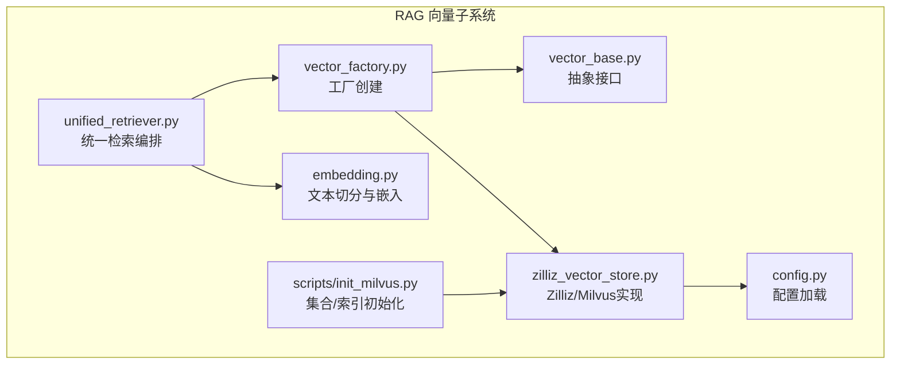
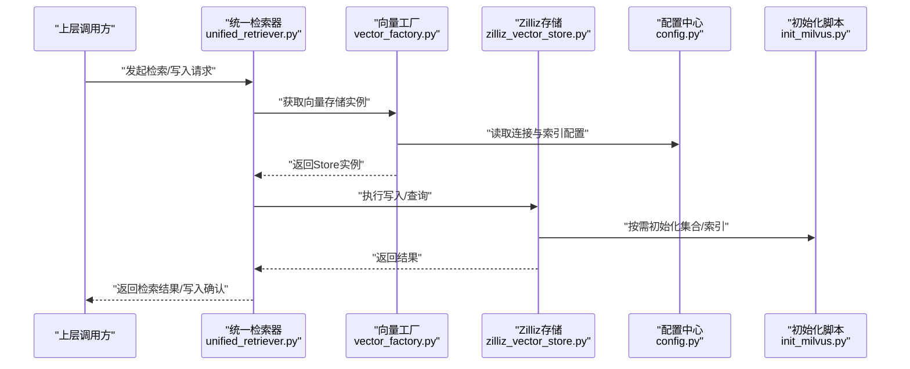
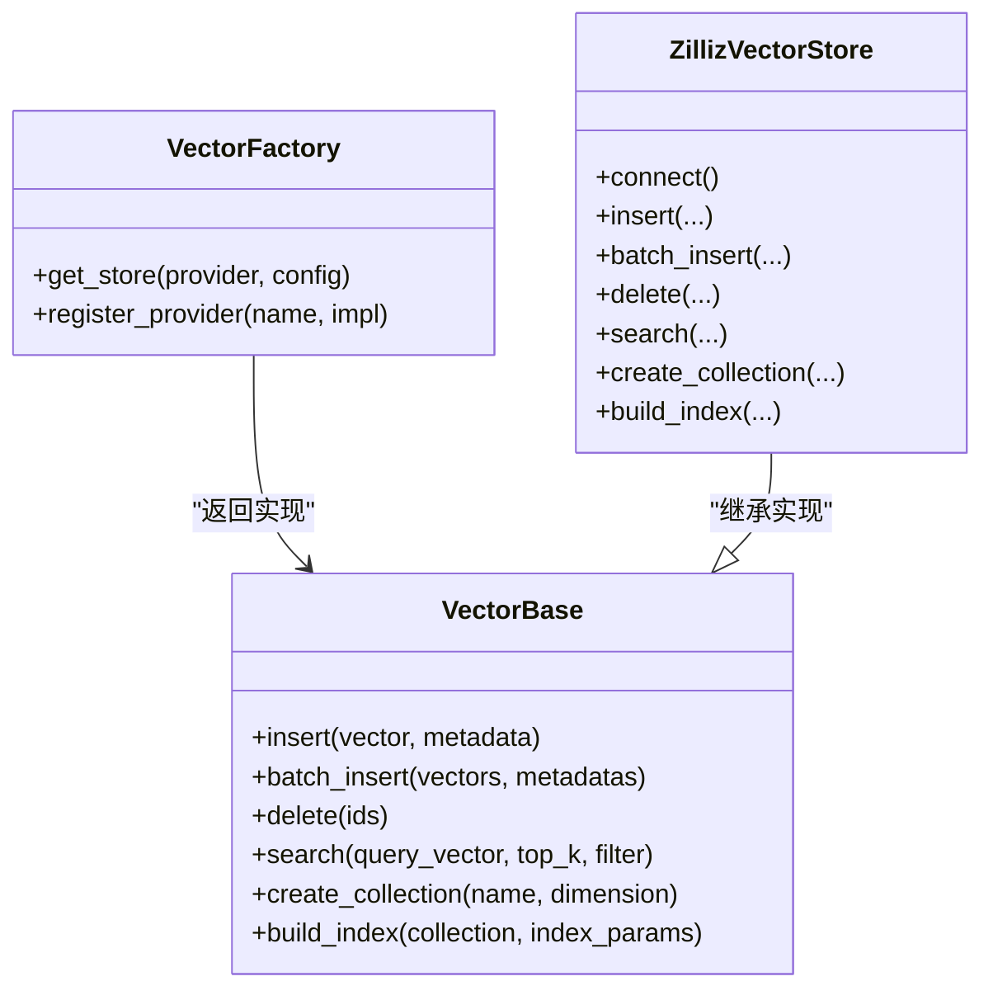
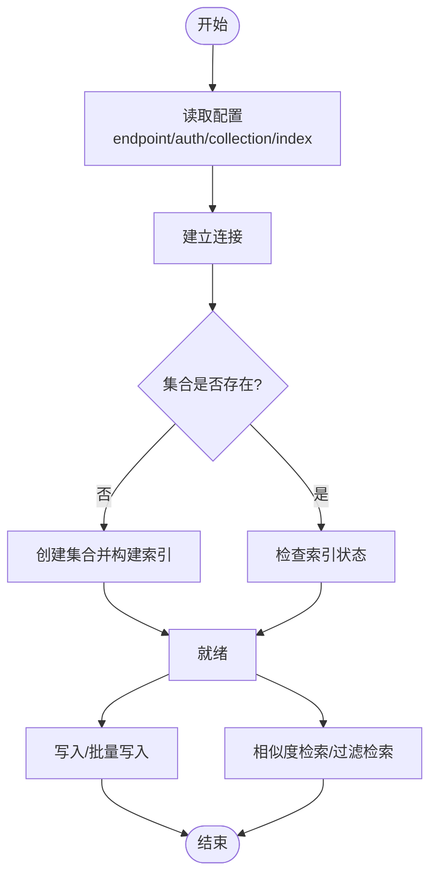
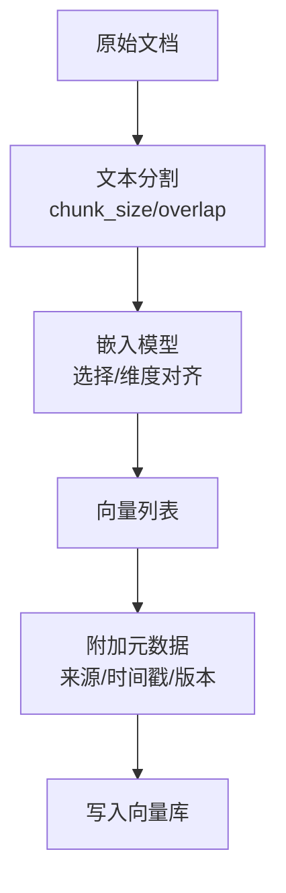
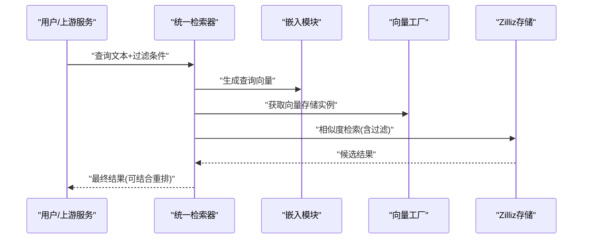
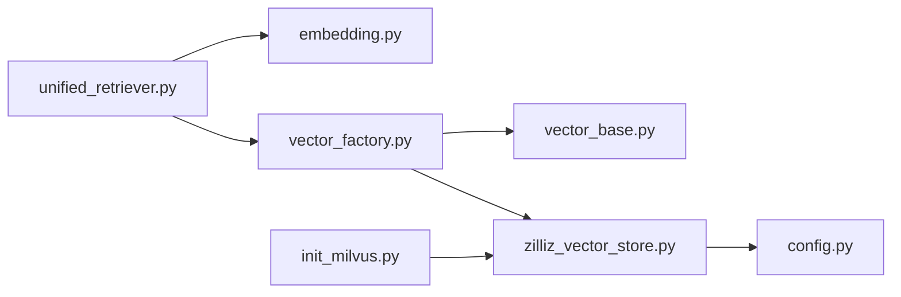

# 向量数据库存储

<cite>
**本文引用的文件**   
- [vector_base.py](file://backend_design/nexus/rag/vector_base.py)
- [vector_factory.py](file://backend_design/nexus/rag/vector_factory.py)
- [zilliz_vector_store.py](file://backend_design/nexus/rag/zilliz_vector_store.py)
- [embedding.py](file://backend_design/nexus/rag/embedding.py)
- [unified_retriever.py](file://backend_design/nexus/rag/unified_retriever.py)
- [config.py](file://backend_design/nexus/config.py)
- [init_milvus.py](file://backend_design/scripts/init_milvus.py)
</cite>

## 目录
1. [简介](#简介)
2. [项目结构](#项目结构)
3. [核心组件](#核心组件)
4. [架构总览](#架构总览)
5. [详细组件分析](#详细组件分析)
6. [依赖关系分析](#依赖关系分析)
7. [性能考量](#性能考量)
8. [故障排查指南](#故障排查指南)
9. [结论](#结论)
10. [附录](#附录)

## 简介
本技术文档聚焦于NexusCockpit的向量数据库存储系统，围绕以下目标展开：
- 抽象层设计：定义统一的向量存储接口与工厂模式，屏蔽底层实现差异。
- Zilliz（Milvus）具体实现：连接配置、数据写入、批量操作与查询优化。
- 向量化流程：文本分割策略、嵌入模型选择与维度管理。
- 索引构建与维护：索引类型选择、参数调优与监控建议。
- 生命周期管理：导入、更新、删除与版本控制策略。
- 配置示例与最佳实践：面向生产环境的落地建议。

## 项目结构
RAG模块中与向量存储相关的核心文件位于 backend_design/nexus/rag 目录下，关键文件包括：
- 抽象与工厂：vector_base.py、vector_factory.py
- 具体实现：zilliz_vector_store.py
- 向量化：embedding.py
- 检索编排：unified_retriever.py
- 配置入口：config.py
- 初始化脚本：scripts/init_milvus.py

图表来源
- [vector_base.py](file://backend_design/nexus/rag/vector_base.py)
- [vector_factory.py](file://backend_design/nexus/rag/vector_factory.py)
- [zilliz_vector_store.py](file://backend_design/nexus/rag/zilliz_vector_store.py)
- [embedding.py](file://backend_design/nexus/rag/embedding.py)
- [unified_retriever.py](file://backend_design/nexus/rag/unified_retriever.py)
- [config.py](file://backend_design/nexus/config.py)
- [init_milvus.py](file://backend_design/scripts/init_milvus.py)

章节来源
- [vector_base.py](file://backend_design/nexus/rag/vector_base.py)
- [vector_factory.py](file://backend_design/nexus/rag/vector_factory.py)
- [zilliz_vector_store.py](file://backend_design/nexus/rag/zilliz_vector_store.py)
- [embedding.py](file://backend_design/nexus/rag/embedding.py)
- [unified_retriever.py](file://backend_design/nexus/rag/unified_retriever.py)
- [config.py](file://backend_design/nexus/config.py)
- [init_milvus.py](file://backend_design/scripts/init_milvus.py)

## 核心组件
本节概述向量存储抽象层与工厂模式的设计要点，以及Zilliz实现的职责边界。

- 抽象接口（向量基类）
  - 定义统一的CRUD与检索方法签名，如插入、批量插入、删除、相似度搜索等。
  - 约定元数据字段规范、过滤表达式格式与返回结果结构，确保上层调用一致性。
  - 提供维度校验与基础错误封装，便于跨实现复用。

- 工厂模式（向量存储工厂）
  - 根据配置或运行时参数动态创建具体向量存储实例（如Zilliz）。
  - 集中管理连接参数、重试策略与资源生命周期。
  - 支持扩展新后端时仅新增实现并注册到工厂，无需改动上层逻辑。

- Zilliz向量存储实现
  - 负责与Zilliz/Milvus服务交互，包括集合创建、索引构建、写入与查询。
  - 处理连接池、超时、重试与幂等写入策略。
  - 暴露批量写入与分页查询能力，适配大规模知识入库场景。

章节来源
- [vector_base.py](file://backend_design/nexus/rag/vector_base.py)
- [vector_factory.py](file://backend_design/nexus/rag/vector_factory.py)
- [zilliz_vector_store.py](file://backend_design/nexus/rag/zilliz_vector_store.py)

## 架构总览
下图展示从检索编排到向量存储的整体调用链与数据流。

图表来源
- [unified_retriever.py](file://backend_design/nexus/rag/unified_retriever.py)
- [vector_factory.py](file://backend_design/nexus/rag/vector_factory.py)
- [zilliz_vector_store.py](file://backend_design/nexus/rag/zilliz_vector_store.py)
- [config.py](file://backend_design/nexus/config.py)
- [init_milvus.py](file://backend_design/scripts/init_milvus.py)

## 详细组件分析

### 抽象层与工厂模式
- 抽象接口设计
  - 方法契约：定义插入、批量插入、删除、按向量相似度检索、按条件过滤检索等。
  - 输入输出：统一向量与元数据格式；返回相似度分数与命中条目。
  - 错误处理：对无效维度、连接失败、权限不足等异常进行规范化封装。

- 工厂模式
  - 通过配置键选择具体实现（例如“zilliz”），在首次使用时懒加载连接。
  - 支持多租户或知识库隔离时的命名空间/集合前缀策略。

图表来源
- [vector_base.py](file://backend_design/nexus/rag/vector_base.py)
- [vector_factory.py](file://backend_design/nexus/rag/vector_factory.py)
- [zilliz_vector_store.py](file://backend_design/nexus/rag/zilliz_vector_store.py)

章节来源
- [vector_base.py](file://backend_design/nexus/rag/vector_base.py)
- [vector_factory.py](file://backend_design/nexus/rag/vector_factory.py)
- [zilliz_vector_store.py](file://backend_design/nexus/rag/zilliz_vector_store.py)

### Zilliz向量存储实现
- 连接与配置
  - 从配置中读取端点、认证信息、集合名、索引类型与参数。
  - 建立连接后缓存句柄，避免重复握手开销。

- 数据写入
  - 单条写入：校验维度、生成唯一ID、落盘并返回状态。
  - 批量写入：分批提交、失败重试与幂等去重策略。

- 查询优化
  - 相似度检索：支持top_k、过滤表达式、距离度量选择。
  - 预取与分页：结合元数据过滤减少扫描范围。

- 索引构建
  - 集合创建：指定维度与主键字段。
  - 索引类型：根据数据规模与延迟要求选择合适索引（如HNSW、IVF_FLAT等）。
  - 重建策略：增量更新与全量重建切换。

图表来源
- [zilliz_vector_store.py](file://backend_design/nexus/rag/zilliz_vector_store.py)
- [config.py](file://backend_design/nexus/config.py)
- [init_milvus.py](file://backend_design/scripts/init_milvus.py)

章节来源
- [zilliz_vector_store.py](file://backend_design/nexus/rag/zilliz_vector_store.py)
- [config.py](file://backend_design/nexus/config.py)
- [init_milvus.py](file://backend_design/scripts/init_milvus.py)

### 向量化过程（文本分割与嵌入）
- 文本分割
  - 基于语义块大小与重叠比例进行分段，保证上下文连贯性。
  - 支持按段落、标题或自定义规则切分，适配不同文档结构。

- 嵌入模型选择
  - 根据任务需求选择中文/多语言模型，关注维度与精度权衡。
  - 支持本地模型与服务化模型两种接入方式。

- 向量维度管理
  - 在集合创建阶段严格匹配模型输出维度，防止写入失败。
  - 提供维度校验与自动提示机制。

图表来源
- [embedding.py](file://backend_design/nexus/rag/embedding.py)
- [zilliz_vector_store.py](file://backend_design/nexus/rag/zilliz_vector_store.py)

章节来源
- [embedding.py](file://backend_design/nexus/rag/embedding.py)
- [zilliz_vector_store.py](file://backend_design/nexus/rag/zilliz_vector_store.py)

### 检索编排（统一检索器）
- 将文本切分、嵌入生成与向量检索串联为端到端流程。
- 支持多种召回策略组合与重排序前置/后置集成。
- 提供过滤条件透传与结果聚合。

图表来源
- [unified_retriever.py](file://backend_design/nexus/rag/unified_retriever.py)
- [embedding.py](file://backend_design/nexus/rag/embedding.py)
- [vector_factory.py](file://backend_design/nexus/rag/vector_factory.py)
- [zilliz_vector_store.py](file://backend_design/nexus/rag/zilliz_vector_store.py)

章节来源
- [unified_retriever.py](file://backend_design/nexus/rag/unified_retriever.py)
- [embedding.py](file://backend_design/nexus/rag/embedding.py)
- [vector_factory.py](file://backend_design/nexus/rag/vector_factory.py)
- [zilliz_vector_store.py](file://backend_design/nexus/rag/zilliz_vector_store.py)

## 依赖关系分析
- 内部依赖
  - unified_retriever 依赖 embedding 与 vector_factory。
  - vector_factory 依赖 vector_base 抽象与 zilliz_vector_store 实现。
  - zilliz_vector_store 依赖 config 提供的连接与索引参数。
  - init_milvus 作为运维工具，驱动 zilliz_vector_store 完成集合与索引初始化。

图表来源
- [unified_retriever.py](file://backend_design/nexus/rag/unified_retriever.py)
- [embedding.py](file://backend_design/nexus/rag/embedding.py)
- [vector_factory.py](file://backend_design/nexus/rag/vector_factory.py)
- [vector_base.py](file://backend_design/nexus/rag/vector_base.py)
- [zilliz_vector_store.py](file://backend_design/nexus/rag/zilliz_vector_store.py)
- [config.py](file://backend_design/nexus/config.py)
- [init_milvus.py](file://backend_design/scripts/init_milvus.py)

章节来源
- [unified_retriever.py](file://backend_design/nexus/rag/unified_retriever.py)
- [embedding.py](file://backend_design/nexus/rag/embedding.py)
- [vector_factory.py](file://backend_design/nexus/rag/vector_factory.py)
- [vector_base.py](file://backend_design/nexus/rag/vector_base.py)
- [zilliz_vector_store.py](file://backend_design/nexus/rag/zilliz_vector_store.py)
- [config.py](file://backend_design/nexus/config.py)
- [init_milvus.py](file://backend_design/scripts/init_milvus.py)

## 性能考量
- 索引类型选择
  - 小规模/低延迟：优先选择近似最近邻的高效索引（如HNSW），调整M与efConstruction以平衡构建时间与查询速度。
  - 超大规模：考虑倒排索引族（如IVF系列），合理设置nlist与nprobe。
- 批量写入
  - 合并小批次为大批次，降低网络往返与锁竞争。
  - 启用幂等写入与去重键，避免重复数据膨胀。
- 查询优化
  - 使用元数据过滤缩小候选集，减少全表扫描。
  - 合理设置top_k与距离阈值，避免过度召回。
- 资源与容量
  - 监控磁盘与内存占用，预留索引构建缓冲。
  - 定期评估数据冷热分层，必要时迁移历史数据。

[本节为通用性能指导，不直接分析具体文件]

## 故障排查指南
- 连接问题
  - 检查配置中的端点、认证信息与网络连通性。
  - 验证集合名称与命名空间是否冲突。
- 维度不匹配
  - 确认嵌入模型输出维度与集合定义一致。
  - 在写入前增加维度校验日志。
- 索引未就绪
  - 初始化脚本完成后等待索引构建完成再写入。
  - 查询前检查索引状态，必要时触发重建。
- 写入失败与重试
  - 记录失败批次与原因，采用指数退避重试。
  - 对幂等键进行去重，避免重复写入。

章节来源
- [config.py](file://backend_design/nexus/config.py)
- [init_milvus.py](file://backend_design/scripts/init_milvus.py)
- [zilliz_vector_store.py](file://backend_design/nexus/rag/zilliz_vector_store.py)

## 结论
通过抽象接口与工厂模式，NexusCockpit实现了可扩展的向量存储体系。Zilliz实现提供了完善的连接、写入、检索与索引管理能力。配合规范的向量化流程与生命周期策略，可在生产环境中稳定支撑大规模知识检索与问答场景。建议在上线前完成索引参数压测与监控指标完善，持续优化召回质量与延迟。

[本节为总结性内容，不直接分析具体文件]

## 附录

### 配置项参考（示例说明）
以下为常见配置项的说明与取值建议（请结合实际部署环境填写）：
- 连接相关
  - endpoint：Zilliz/Milvus服务地址
  - auth_token：鉴权令牌
  - collection_name：集合名称（建议包含租户/知识库前缀）
- 索引相关
  - index_type：索引类型（如HNSW、IVF_FLAT等）
  - metric_type：距离度量（如IP、L2）
  - nlist/nprobe：倒排索引族参数（适用于IVF系列）
  - M/efConstruction/efSearch：HNSW相关参数
- 写入与检索
  - batch_size：批量写入大小
  - top_k：默认召回数量
  - filter_fields：常用过滤字段（如source、timestamp、version）

章节来源
- [config.py](file://backend_design/nexus/config.py)
- [init_milvus.py](file://backend_design/scripts/init_milvus.py)
- [zilliz_vector_store.py](file://backend_design/nexus/rag/zilliz_vector_store.py)

### 最佳实践清单
- 在集合创建时严格校验维度，避免后续写入失败。
- 使用幂等键与版本号控制，保障数据一致性与可追溯。
- 批量写入时合并小批次，降低系统压力。
- 针对热点查询建立合适的索引与缓存策略。
- 定期评估索引参数与数据分布，动态调优。
- 建立监控与告警：写入延迟、查询延迟、索引构建进度、错误率。

[本节为通用实践建议，不直接分析具体文件]