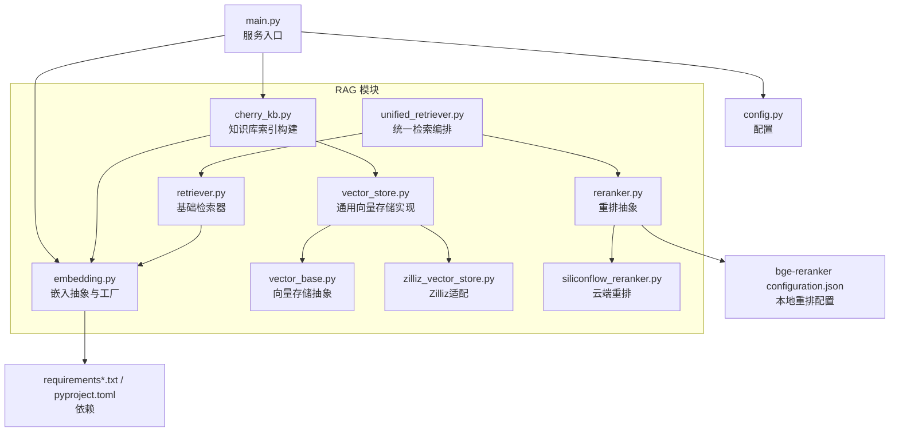
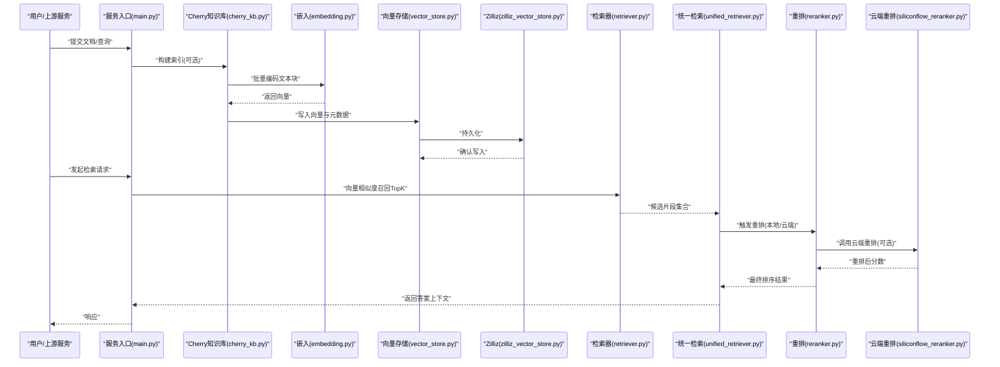
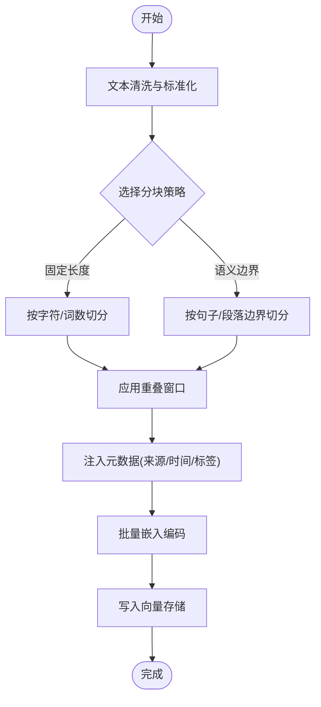
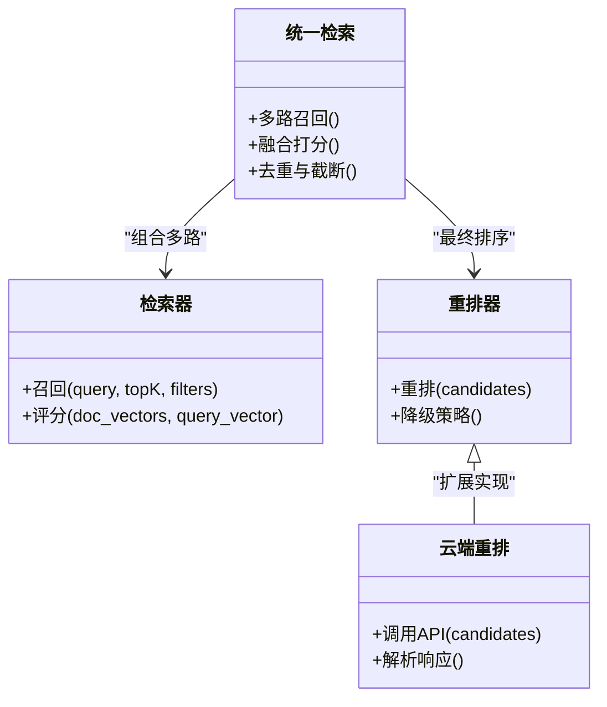
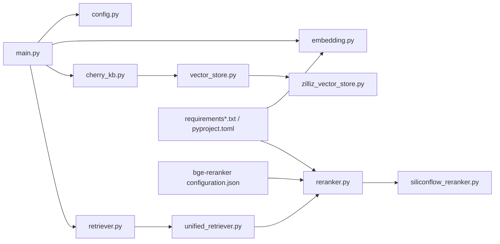

# 文本嵌入模型

<cite>
**本文引用的文件**   
- [backend_design/nexus/rag/embedding.py](file://backend_design/nexus/rag/embedding.py)
- [backend_design/nexus/rag/cherry_kb.py](file://backend_design/nexus/rag/cherry_kb.py)
- [backend_design/nexus/rag/vector_base.py](file://backend_design/nexus/rag/vector_base.py)
- [backend_design/nexus/rag/vector_store.py](file://backend_design/nexus/rag/vector_store.py)
- [backend_design/nexus/rag/zilliz_vector_store.py](file://backend_design/nexus/rag/zilliz_vector_store.py)
- [backend_design/nexus/rag/retriever.py](file://backend_design/nexus/rag/retriever.py)
- [backend_design/nexus/rag/unified_retriever.py](file://backend_design/nexus/rag/unified_retriever.py)
- [backend_design/nexus/rag/reranker.py](file://backend_design/nexus/rag/reranker.py)
- [backend_design/nexus/rag/siliconflow_reranker.py](file://backend_design/nexus/rag/siliconflow_reranker.py)
- [backend_design/nexus/config.py](file://backend_design/nexus/config.py)
- [backend_design/nexus/main.py](file://backend_design/nexus/main.py)
- [backend_design/pyproject.toml](file://backend_design/pyproject.toml)
- [backend_design/requirements.txt](file://backend_design/requirements.txt)
- [backend_design/requirements_no_torch.txt](file://backend_design/requirements_no_torch.txt)
- [models/reranker/bge-reranker-v2-m3/configuration.json](file://models/reranker/bge-reranker-v2-m3/configuration.json)
</cite>

## 目录
1. [简介](#简介)
2. [项目结构](#项目结构)
3. [核心组件](#核心组件)
4. [架构总览](#架构总览)
5. [详细组件分析](#详细组件分析)
6. [依赖关系分析](#依赖关系分析)
7. [性能与资源优化](#性能与资源优化)
8. [故障排查指南](#故障排查指南)
9. [结论](#结论)
10. [附录：部署与配置、评估与选型](#附录部署与配置评估与选型)

## 简介
本技术文档聚焦NexusCockpit的文本嵌入模型系统，围绕“词向量—句向量—段落向量”的转换路径，系统性阐述Cherry知识库的嵌入实现（文本预处理、分块策略、模型选择），对比本地模型与云端API的优缺点，给出向量质量评估方法（相似度计算与检索效果测试），并提供部署配置指南（模型下载、环境依赖、资源优化）以及面向不同应用场景的模型选型建议。

## 项目结构
与文本嵌入相关的代码主要位于后端RAG模块中，关键文件包括：
- embedding.py：嵌入模型抽象与工厂、本地/云端实现入口
- cherry_kb.py：Cherry知识库的索引构建流程（预处理、分块、向量化、入库）
- vector_base.py / vector_store.py：向量存储抽象与通用实现
- zilliz_vector_store.py：Zilliz向量库的具体适配
- retriever.py / unified_retriever.py：检索器与统一检索编排
- reranker.py / siliconflow_reranker.py：重排序器与云端重排服务
- config.py / main.py：配置加载与服务启动
- requirements*.txt / pyproject.toml：依赖声明
- models/reranker/bge-reranker-v2-m3/configuration.json：本地重排模型配置

图表来源
- [backend_design/nexus/rag/embedding.py](file://backend_design/nexus/rag/embedding.py)
- [backend_design/nexus/rag/cherry_kb.py](file://backend_design/nexus/rag/cherry_kb.py)
- [backend_design/nexus/rag/vector_base.py](file://backend_design/nexus/rag/vector_base.py)
- [backend_design/nexus/rag/vector_store.py](file://backend_design/nexus/rag/vector_store.py)
- [backend_design/nexus/rag/zilliz_vector_store.py](file://backend_design/nexus/rag/zilliz_vector_store.py)
- [backend_design/nexus/rag/retriever.py](file://backend_design/nexus/rag/retriever.py)
- [backend_design/nexus/rag/unified_retriever.py](file://backend_design/nexus/rag/unified_retriever.py)
- [backend_design/nexus/rag/reranker.py](file://backend_design/nexus/rag/reranker.py)
- [backend_design/nexus/rag/siliconflow_reranker.py](file://backend_design/nexus/rag/siliconflow_reranker.py)
- [backend_design/nexus/config.py](file://backend_design/nexus/config.py)
- [backend_design/nexus/main.py](file://backend_design/nexus/main.py)
- [backend_design/pyproject.toml](file://backend_design/pyproject.toml)
- [backend_design/requirements.txt](file://backend_design/requirements.txt)
- [backend_design/requirements_no_torch.txt](file://backend_design/requirements_no_torch.txt)
- [models/reranker/bge-reranker-v2-m3/configuration.json](file://models/reranker/bge-reranker-v2-m3/configuration.json)

章节来源
- [backend_design/nexus/rag/embedding.py](file://backend_design/nexus/rag/embedding.py)
- [backend_design/nexus/rag/cherry_kb.py](file://backend_design/nexus/rag/cherry_kb.py)
- [backend_design/nexus/rag/vector_base.py](file://backend_design/nexus/rag/vector_base.py)
- [backend_design/nexus/rag/vector_store.py](file://backend_design/nexus/rag/vector_store.py)
- [backend_design/nexus/rag/zilliz_vector_store.py](file://backend_design/nexus/rag/zilliz_vector_store.py)
- [backend_design/nexus/rag/retriever.py](file://backend_design/nexus/rag/retriever.py)
- [backend_design/nexus/rag/unified_retriever.py](file://backend_design/nexus/rag/unified_retriever.py)
- [backend_design/nexus/rag/reranker.py](file://backend_design/nexus/rag/reranker.py)
- [backend_design/nexus/rag/siliconflow_reranker.py](file://backend_design/nexus/rag/siliconflow_reranker.py)
- [backend_design/nexus/config.py](file://backend_design/nexus/config.py)
- [backend_design/nexus/main.py](file://backend_design/nexus/main.py)
- [backend_design/pyproject.toml](file://backend_design/pyproject.toml)
- [backend_design/requirements.txt](file://backend_design/requirements.txt)
- [backend_design/requirements_no_torch.txt](file://backend_design/requirements_no_torch.txt)
- [models/reranker/bge-reranker-v2-m3/configuration.json](file://models/reranker/bge-reranker-v2-m3/configuration.json)

## 核心组件
- 嵌入抽象与工厂（embedding.py）
  - 定义统一的嵌入接口与工厂方法，支持本地模型与云端API两种模式切换。
  - 提供批量编码、维度一致性校验、错误降级等能力。
- Cherry知识库（cherry_kb.py）
  - 负责文档清洗、分段切分、元数据注入、调用嵌入接口生成向量并写入向量库。
  - 内置多种分块策略（按长度、按语义边界等）与重试/去重机制。
- 向量存储（vector_base.py / vector_store.py / zilliz_vector_store.py）
  - 抽象出插入、查询、删除、更新等通用操作；Zilliz为具体后端实现。
- 检索与重排（retriever.py / unified_retriever.py / reranker.py / siliconflow_reranker.py）
  - 检索器基于向量相似度召回候选片段；统一检索器组合多路召回与重排；重排器支持本地或云端方案。

章节来源
- [backend_design/nexus/rag/embedding.py](file://backend_design/nexus/rag/embedding.py)
- [backend_design/nexus/rag/cherry_kb.py](file://backend_design/nexus/rag/cherry_kb.py)
- [backend_design/nexus/rag/vector_base.py](file://backend_design/nexus/rag/vector_base.py)
- [backend_design/nexus/rag/vector_store.py](file://backend_design/nexus/rag/vector_store.py)
- [backend_design/nexus/rag/zilliz_vector_store.py](file://backend_design/nexus/rag/zilliz_vector_store.py)
- [backend_design/nexus/rag/retriever.py](file://backend_design/nexus/rag/retriever.py)
- [backend_design/nexus/rag/unified_retriever.py](file://backend_design/nexus/rag/unified_retriever.py)
- [backend_design/nexus/rag/reranker.py](file://backend_design/nexus/rag/reranker.py)
- [backend_design/nexus/rag/siliconflow_reranker.py](file://backend_design/nexus/rag/siliconflow_reranker.py)

## 架构总览
下图展示从“文本输入”到“检索结果”的端到端流程，涵盖预处理、分块、嵌入、入库、召回与重排。

图表来源
- [backend_design/nexus/main.py](file://backend_design/nexus/main.py)
- [backend_design/nexus/rag/cherry_kb.py](file://backend_design/nexus/rag/cherry_kb.py)
- [backend_design/nexus/rag/embedding.py](file://backend_design/nexus/rag/embedding.py)
- [backend_design/nexus/rag/vector_store.py](file://backend_design/nexus/rag/vector_store.py)
- [backend_design/nexus/rag/zilliz_vector_store.py](file://backend_design/nexus/rag/zilliz_vector_store.py)
- [backend_design/nexus/rag/retriever.py](file://backend_design/nexus/rag/retriever.py)
- [backend_design/nexus/rag/unified_retriever.py](file://backend_design/nexus/rag/unified_retriever.py)
- [backend_design/nexus/rag/reranker.py](file://backend_design/nexus/rag/reranker.py)
- [backend_design/nexus/rag/siliconflow_reranker.py](file://backend_design/nexus/rag/siliconflow_reranker.py)

## 详细组件分析

### 嵌入抽象与工厂（embedding.py）
- 设计要点
  - 统一接口：定义encode/encode_batch等方法，屏蔽本地/云端差异。
  - 工厂模式：根据配置动态创建本地或云端嵌入实例。
  - 容错与降级：网络异常时回退至缓存或默认策略。
- 复杂度与性能
  - 批量编码降低往返开销；内部可启用并发批处理。
  - 维度校验避免下游不一致导致的检索失败。
- 典型用法
  - 在知识库构建阶段对每个文本块进行批量编码。
  - 在检索阶段对查询语句进行编码以匹配向量库。

章节来源
- [backend_design/nexus/rag/embedding.py](file://backend_design/nexus/rag/embedding.py)

### Cherry知识库（cherry_kb.py）
- 文本预处理
  - 清理HTML/空白/特殊符号，统一编码，去除重复段落。
- 分块策略
  - 固定长度切分与语义边界切分（如句子/段落边界）。
  - 重叠窗口保留上下文连续性，提升召回稳定性。
- 元数据与索引
  - 为每个块附加来源、时间戳、标签等元数据，便于过滤与溯源。
- 入库流程
  - 调用嵌入接口获取向量，批量写入向量存储，记录索引状态。

图表来源
- [backend_design/nexus/rag/cherry_kb.py](file://backend_design/nexus/rag/cherry_kb.py)
- [backend_design/nexus/rag/embedding.py](file://backend_design/nexus/rag/embedding.py)
- [backend_design/nexus/rag/vector_store.py](file://backend_design/nexus/rag/vector_store.py)

章节来源
- [backend_design/nexus/rag/cherry_kb.py](file://backend_design/nexus/rag/cherry_kb.py)

### 向量存储抽象与Zilliz适配（vector_base.py / vector_store.py / zilliz_vector_store.py）
- 抽象层（vector_base.py）
  - 定义插入、查询、删除、更新、批量操作等接口。
- 通用实现（vector_store.py）
  - 封装重试、超时、分页、指标上报等横切逻辑。
- Zilliz适配（zilliz_vector_store.py）
  - 对接Zilliz SDK，管理集合、索引类型、搜索参数。
- 使用建议
  - 生产环境建议开启HNSW/IVF等近似索引以提升检索性能。
  - 合理设置topK与距离阈值，平衡召回率与延迟。

章节来源
- [backend_design/nexus/rag/vector_base.py](file://backend_design/nexus/rag/vector_base.py)
- [backend_design/nexus/rag/vector_store.py](file://backend_design/nexus/rag/vector_store.py)
- [backend_design/nexus/rag/zilliz_vector_store.py](file://backend_design/nexus/rag/zilliz_vector_store.py)

### 检索与重排（retriever.py / unified_retriever.py / reranker.py / siliconflow_reranker.py）
- 检索器（retriever.py）
  - 基于向量相似度召回TopK候选片段，支持过滤条件（元数据）。
- 统一检索（unified_retriever.py）
  - 组合多路召回（关键词+向量）、融合打分、去重与截断。
- 重排器（reranker.py / siliconflow_reranker.py）
  - 本地重排（如BGE-Reranker）与云端重排（SiliconFlow）双通道。
  - 支持权重可调与降级策略（云端不可用时回退本地）。

图表来源
- [backend_design/nexus/rag/retriever.py](file://backend_design/nexus/rag/retriever.py)
- [backend_design/nexus/rag/unified_retriever.py](file://backend_design/nexus/rag/unified_retriever.py)
- [backend_design/nexus/rag/reranker.py](file://backend_design/nexus/rag/reranker.py)
- [backend_design/nexus/rag/siliconflow_reranker.py](file://backend_design/nexus/rag/siliconflow_reranker.py)

章节来源
- [backend_design/nexus/rag/retriever.py](file://backend_design/nexus/rag/retriever.py)
- [backend_design/nexus/rag/unified_retriever.py](file://backend_design/nexus/rag/unified_retriever.py)
- [backend_design/nexus/rag/reranker.py](file://backend_design/nexus/rag/reranker.py)
- [backend_design/nexus/rag/siliconflow_reranker.py](file://backend_design/nexus/rag/siliconflow_reranker.py)

## 依赖关系分析
- 运行时依赖
  - 嵌入与重排相关库由requirements*.txt与pyproject.toml声明。
  - 本地重排模型配置位于models/reranker/bge-reranker-v2-m3/configuration.json。
- 服务装配
  - main.py加载配置并初始化RAG管线（嵌入、存储、检索、重排）。
  - config.py集中管理模型路径、API密钥、超时与并发参数。

图表来源
- [backend_design/nexus/main.py](file://backend_design/nexus/main.py)
- [backend_design/nexus/config.py](file://backend_design/nexus/config.py)
- [backend_design/nexus/rag/embedding.py](file://backend_design/nexus/rag/embedding.py)
- [backend_design/nexus/rag/cherry_kb.py](file://backend_design/nexus/rag/cherry_kb.py)
- [backend_design/nexus/rag/vector_store.py](file://backend_design/nexus/rag/vector_store.py)
- [backend_design/nexus/rag/zilliz_vector_store.py](file://backend_design/nexus/rag/zilliz_vector_store.py)
- [backend_design/nexus/rag/retriever.py](file://backend_design/nexus/rag/retriever.py)
- [backend_design/nexus/rag/unified_retriever.py](file://backend_design/nexus/rag/unified_retriever.py)
- [backend_design/nexus/rag/reranker.py](file://backend_design/nexus/rag/reranker.py)
- [backend_design/nexus/rag/siliconflow_reranker.py](file://backend_design/nexus/rag/siliconflow_reranker.py)
- [backend_design/pyproject.toml](file://backend_design/pyproject.toml)
- [backend_design/requirements.txt](file://backend_design/requirements.txt)
- [backend_design/requirements_no_torch.txt](file://backend_design/requirements_no_torch.txt)
- [models/reranker/bge-reranker-v2-m3/configuration.json](file://models/reranker/bge-reranker-v2-m3/configuration.json)

章节来源
- [backend_design/nexus/main.py](file://backend_design/nexus/main.py)
- [backend_design/nexus/config.py](file://backend_design/nexus/config.py)
- [backend_design/pyproject.toml](file://backend_design/pyproject.toml)
- [backend_design/requirements.txt](file://backend_design/requirements.txt)
- [backend_design/requirements_no_torch.txt](file://backend_design/requirements_no_torch.txt)
- [models/reranker/bge-reranker-v2-m3/configuration.json](file://models/reranker/bge-reranker-v2-m3/configuration.json)

## 性能与资源优化
- 嵌入阶段
  - 优先使用批量编码与并发控制，减少网络往返与GPU/CPU抖动。
  - 对长文本采用分块+重叠策略，避免超出模型最大长度限制。
- 向量存储
  - 选择合适的索引类型（如HNSW）与参数（M、efConstruction、efSearch）以平衡精度与延迟。
  - 定期重建索引与压缩，释放磁盘空间。
- 检索与重排
  - 调整topK与阈值，结合元数据过滤缩小候选集。
  - 本地重排用于低延迟场景，云端重排用于高精度场景，二者可按权重融合。
- 资源监控
  - 关注CPU/GPU利用率、内存峰值、网络吞吐与P99延迟，建立告警阈值。

[本节为通用指导，不直接分析具体文件]

## 故障排查指南
- 常见错误
  - 维度不一致：检查嵌入输出维度与向量库集合定义是否一致。
  - 网络超时/鉴权失败：核对云端API密钥、代理与超时配置。
  - 索引缺失/损坏：重建索引或修复集合元数据。
- 定位步骤
  - 查看日志中的错误堆栈与请求ID。
  - 验证配置文件中的模型路径、API地址与并发参数。
  - 使用最小样本复现问题，逐步隔离是预处理、嵌入、存储还是检索环节。

章节来源
- [backend_design/nexus/config.py](file://backend_design/nexus/config.py)
- [backend_design/nexus/main.py](file://backend_design/nexus/main.py)

## 结论
NexusCockpit的文本嵌入系统通过统一的嵌入抽象、灵活的分块策略、可扩展的向量存储与检索重排链路，实现了从“词向量—句向量—段落向量”的完整流水线。生产环境中建议结合业务需求选择本地或云端模型，并通过质量评估与性能调优确保检索效果与成本之间的平衡。

[本节为总结性内容，不直接分析具体文件]

## 附录：部署与配置、评估与选型

### 部署与配置
- 环境依赖
  - 参考requirements*.txt与pyproject.toml安装依赖；若无需Torch，可使用requirements_no_torch.txt。
- 模型下载与准备
  - 本地重排模型配置位于models/reranker/bge-reranker-v2-m3/configuration.json，按需放置模型权重与tokenizer。
- 服务启动
  - 通过main.py启动服务，确保config.py中嵌入与存储配置正确。
- 资源优化
  - 调整批大小、并发度、索引参数与超时，结合监控指标持续优化。

章节来源
- [backend_design/pyproject.toml](file://backend_design/pyproject.toml)
- [backend_design/requirements.txt](file://backend_design/requirements.txt)
- [backend_design/requirements_no_torch.txt](file://backend_design/requirements_no_torch.txt)
- [models/reranker/bge-reranker-v2-m3/configuration.json](file://models/reranker/bge-reranker-v2-m3/configuration.json)
- [backend_design/nexus/config.py](file://backend_design/nexus/config.py)
- [backend_design/nexus/main.py](file://backend_design/nexus/main.py)

### 评估与选型
- 质量评估
  - 相似度计算：余弦相似度、点积等，结合人工标注集计算命中率与平均倒数排名。
  - 检索效果测试：构造覆盖多领域的查询集，统计TopK准确率、NDCG与延迟分布。
- 模型选型
  - 本地模型：低延迟、可控成本，适合内网与隐私敏感场景；需关注显存与推理速度。
  - 云端API：高可用与强模型能力，适合大规模与波动负载；需考虑网络与费用。
- 实践建议
  - 小团队/私有数据优先本地模型；企业级/跨域知识优先云端API或混合方案。
  - 针对中文场景选择具备良好中文能力的嵌入与重排模型。

[本节为通用指导，不直接分析具体文件]