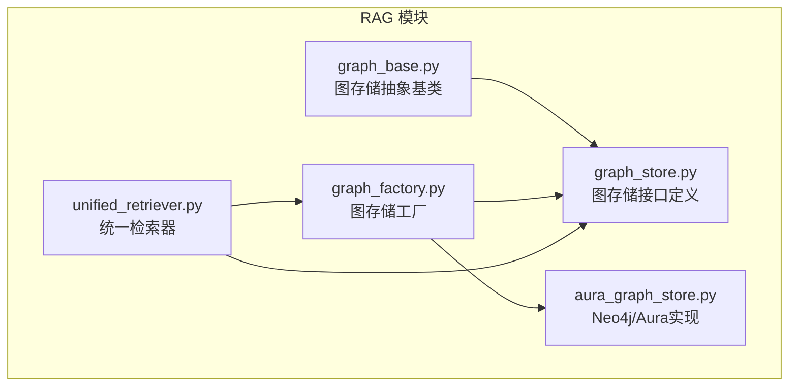
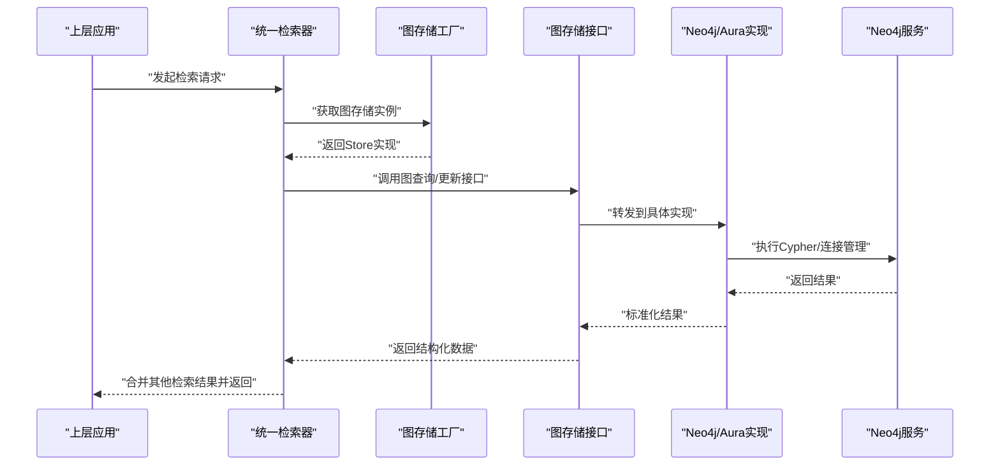
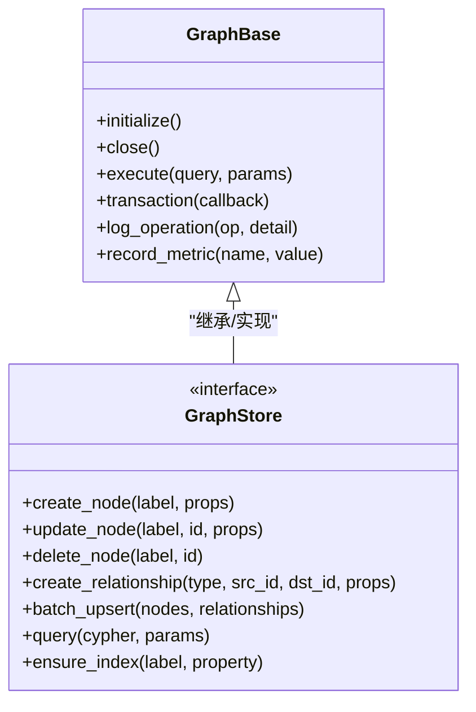
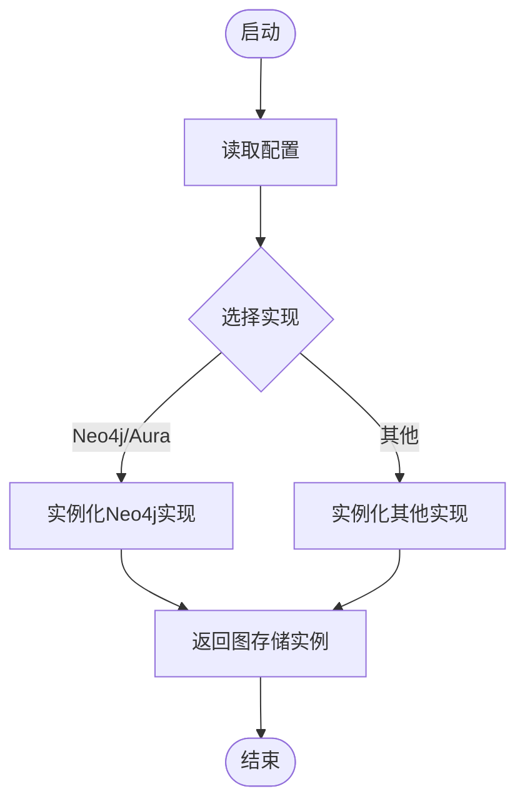
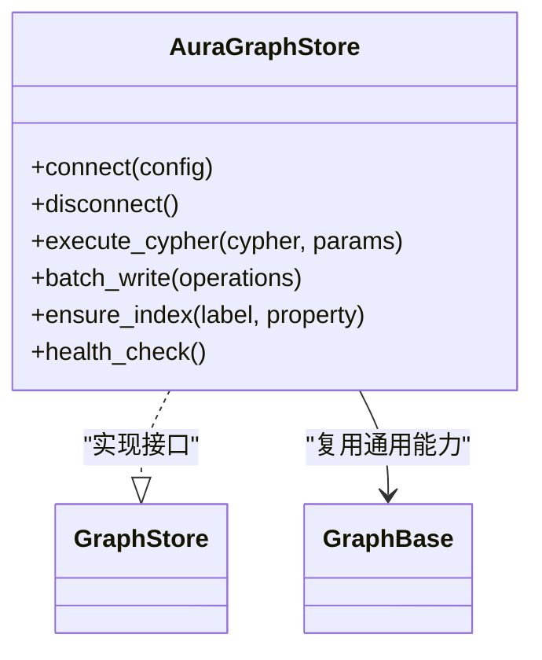
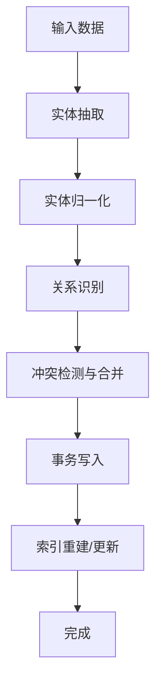
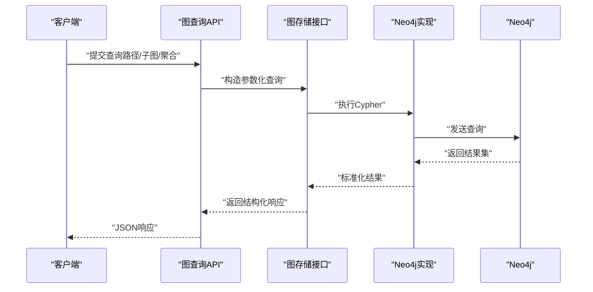
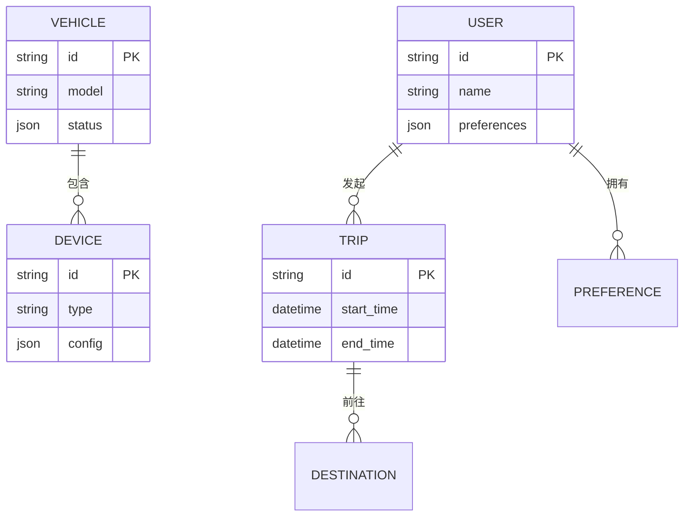
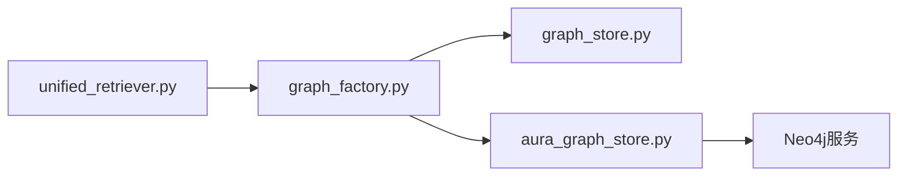

# 知识图谱系统

<cite>
**本文引用的文件**   
- [graph_base.py](file://backend_design/nexus/rag/graph_base.py)
- [graph_store.py](file://backend_design/nexus/rag/graph_store.py)
- [graph_factory.py](file://backend_design/nexus/rag/graph_factory.py)
- [aura_graph_store.py](file://backend_design/nexus/rag/aura_graph_store.py)
- [unified_retriever.py](file://backend_design/nexus/rag/unified_retriever.py)
- [init_neo4j.py](file://backend_design/scripts/init_neo4j.py)
</cite>

## 目录
1. [简介](#简介)
2. [项目结构](#项目结构)
3. [核心组件](#核心组件)
4. [架构总览](#架构总览)
5. [详细组件分析](#详细组件分析)
6. [依赖关系分析](#依赖关系分析)
7. [性能考虑](#性能考虑)
8. [故障排查指南](#故障排查指南)
9. [结论](#结论)
10. [附录](#附录)

## 简介
本技术文档聚焦于NexusCockpit的知识图谱子系统，围绕抽象层设计、图存储基类接口与工厂模式、Aura（Neo4j）实现、构建流程（实体抽取、关系识别、更新策略）、查询语言与API（路径查询、子图匹配、聚合统计），以及性能优化（索引、查询、内存）展开。同时提供智能座舱场景下的建模示例与查询案例，帮助读者快速上手并落地应用。

## 项目结构
知识图谱相关代码位于后端RAG模块中，采用“抽象接口 + 具体实现 + 工厂”的分层组织方式：
- 抽象层：定义统一的图存储接口与基础能力
- 实现层：针对特定图数据库（如Neo4j/Aura）的具体实现
- 工厂层：根据配置动态创建图存储实例
- 检索集成：将图检索与其他检索器统一接入RAG检索管线

图表来源
- [graph_base.py](file://backend_design/nexus/rag/graph_base.py)
- [graph_store.py](file://backend_design/nexus/rag/graph_store.py)
- [graph_factory.py](file://backend_design/nexus/rag/graph_factory.py)
- [aura_graph_store.py](file://backend_design/nexus/rag/aura_graph_store.py)
- [unified_retriever.py](file://backend_design/nexus/rag/unified_retriever.py)

章节来源
- [graph_base.py](file://backend_design/nexus/rag/graph_base.py)
- [graph_store.py](file://backend_design/nexus/rag/graph_store.py)
- [graph_factory.py](file://backend_design/nexus/rag/graph_factory.py)
- [aura_graph_store.py](file://backend_design/nexus/rag/aura_graph_store.py)
- [unified_retriever.py](file://backend_design/nexus/rag/unified_retriever.py)

## 核心组件
- 图存储抽象基类：封装通用能力（连接管理、事务边界、错误处理、日志与指标埋点等），为上层提供一致的调用体验。
- 图存储接口：定义标准方法契约，包括节点/关系的增删改查、批量写入、事务提交/回滚、图遍历与查询入口等。
- 图存储工厂：依据配置选择具体实现（如Neo4j/Aura），屏蔽底层差异，便于扩展新的图数据库。
- Neo4j/Aura实现：负责与Neo4j服务通信，执行Cypher语句，管理连接池、重试与超时，并提供面向业务的高阶API。
- 统一检索器：将图检索与其他检索器（向量、关键词等）融合，形成多路召回与重排的统一入口。

章节来源
- [graph_base.py](file://backend_design/nexus/rag/graph_base.py)
- [graph_store.py](file://backend_design/nexus/rag/graph_store.py)
- [graph_factory.py](file://backend_design/nexus/rag/graph_factory.py)
- [aura_graph_store.py](file://backend_design/nexus/rag/aura_graph_store.py)
- [unified_retriever.py](file://backend_design/nexus/rag/unified_retriever.py)

## 架构总览
下图展示了从上层应用到图存储的调用链路，以及工厂模式在运行时如何注入具体实现。

图表来源
- [unified_retriever.py](file://backend_design/nexus/rag/unified_retriever.py)
- [graph_factory.py](file://backend_design/nexus/rag/graph_factory.py)
- [graph_store.py](file://backend_design/nexus/rag/graph_store.py)
- [aura_graph_store.py](file://backend_design/nexus/rag/aura_graph_store.py)

## 详细组件分析

### 抽象层与接口规范
- 抽象基类职责
  - 提供连接生命周期管理（初始化、健康检查、关闭）
  - 统一异常类型与错误码映射
  - 记录关键操作日志与指标
  - 提供事务辅助方法（开始、提交、回滚）
- 接口契约要点
  - 节点与关系的基本CRUD
  - 批量写入与幂等性保障
  - 图遍历与查询入口（支持参数化）
  - 元数据与索引管理能力

图表来源
- [graph_base.py](file://backend_design/nexus/rag/graph_base.py)
- [graph_store.py](file://backend_design/nexus/rag/graph_store.py)

章节来源
- [graph_base.py](file://backend_design/nexus/rag/graph_base.py)
- [graph_store.py](file://backend_design/nexus/rag/graph_store.py)

### 工厂模式实现
- 目标
  - 通过配置项选择具体图存储实现
  - 集中管理实例创建与依赖注入
  - 支持未来新增实现时零侵入扩展
- 行为
  - 读取配置（如驱动类型、连接参数）
  - 实例化对应实现类
  - 暴露统一接口供上层使用

图表来源
- [graph_factory.py](file://backend_design/nexus/rag/graph_factory.py)

章节来源
- [graph_factory.py](file://backend_design/nexus/rag/graph_factory.py)

### Aura（Neo4j）图存储实现
- 连接配置
  - 支持URI、用户名、密码、数据库名、连接池大小、超时与重试策略
  - 提供健康检查与自动重连机制
- 图数据建模
  - 以标签表示节点类型，属性承载字段值
  - 关系类型表达语义，附带权重或时间戳等上下文
- Cypher查询优化
  - 参数化查询避免注入与重复编译
  - 利用索引与约束减少扫描范围
  - 分页与限制返回规模，避免大结果集
  - 批量写入与事务合并降低网络往返

图表来源
- [aura_graph_store.py](file://backend_design/nexus/rag/aura_graph_store.py)
- [graph_store.py](file://backend_design/nexus/rag/graph_store.py)
- [graph_base.py](file://backend_design/nexus/rag/graph_base.py)

章节来源
- [aura_graph_store.py](file://backend_design/nexus/rag/aura_graph_store.py)
- [graph_store.py](file://backend_design/nexus/rag/graph_store.py)
- [graph_base.py](file://backend_design/nexus/rag/graph_base.py)

### 知识图谱构建流程
- 实体抽取
  - 从文本/语音转写中提取实体（如车辆部件、用户偏好、位置等）
  - 规范化实体标识与属性，去重与合并
- 关系识别
  - 基于规则或模型推断关系类型与方向
  - 为关系附加置信度、时间戳等上下文
- 图谱更新策略
  - 增量更新：仅变更受影响节点/关系
  - 幂等写入：按主键或唯一属性保证一致性
  - 事务边界：确保复杂更新的原子性
  - 版本控制：保留历史快照以便回溯

[此图为概念流程图，不直接映射具体源码文件]

### 查询语言与API
- 路径查询
  - 支持可变长度关系与条件过滤
  - 返回路径序列及沿途节点/关系属性
- 子图匹配
  - 基于模式匹配提取局部子图
  - 支持按标签、属性、关系类型组合筛选
- 聚合统计
  - 对节点/关系进行计数、求和、平均等聚合
  - 结合排序与分页输出

图表来源
- [graph_store.py](file://backend_design/nexus/rag/graph_store.py)
- [aura_graph_store.py](file://backend_design/nexus/rag/aura_graph_store.py)

章节来源
- [graph_store.py](file://backend_design/nexus/rag/graph_store.py)
- [aura_graph_store.py](file://backend_design/nexus/rag/aura_graph_store.py)

### 智能座舱场景建模与查询案例
- 建模示例
  - 实体：车辆、座位、空调、导航目的地、用户、偏好
  - 关系：属于、控制、偏好、前往、关联
- 查询案例
  - 路径查询：查找“用户-偏好-设备-状态”的路径，用于个性化推荐
  - 子图匹配：匹配某次行程涉及的“起点-途经-终点”子图
  - 聚合统计：统计各设备的活跃次数与平均响应时长

[此图为概念ER图，不直接映射具体源码文件]

## 依赖关系分析
- 耦合与内聚
  - 抽象层与实现层解耦良好，通过接口与工厂降低耦合
  - 统一检索器对图存储的依赖通过工厂注入，具备可替换性
- 外部依赖
  - Neo4j驱动与服务端通信
  - 配置中心与环境变量注入连接参数
- 潜在循环依赖
  - 当前分层清晰，未见循环导入迹象

图表来源
- [unified_retriever.py](file://backend_design/nexus/rag/unified_retriever.py)
- [graph_factory.py](file://backend_design/nexus/rag/graph_factory.py)
- [graph_store.py](file://backend_design/nexus/rag/graph_store.py)
- [aura_graph_store.py](file://backend_design/nexus/rag/aura_graph_store.py)

章节来源
- [unified_retriever.py](file://backend_design/nexus/rag/unified_retriever.py)
- [graph_factory.py](file://backend_design/nexus/rag/graph_factory.py)
- [graph_store.py](file://backend_design/nexus/rag/graph_store.py)
- [aura_graph_store.py](file://backend_design/nexus/rag/aura_graph_store.py)

## 性能考虑
- 索引策略
  - 为高频查询的属性建立索引与唯一约束
  - 使用复合索引覆盖常见过滤条件
- 查询优化
  - 参数化与预编译减少解析开销
  - 限制返回规模，按需投影字段
  - 避免全图扫描，优先使用索引与标签过滤
- 内存管理
  - 流式处理大结果集，避免一次性加载
  - 合理设置连接池大小与超时，防止资源耗尽
- 写入优化
  - 批量写入与事务合并，减少网络往返
  - 幂等写入与冲突解决策略，提升吞吐与一致性

[本节为通用指导，不直接分析具体文件]

## 故障排查指南
- 常见问题
  - 连接失败：检查URI、认证信息、防火墙与安全组
  - 查询超时：评估结果集规模、索引命中情况与查询复杂度
  - 写入失败：确认事务边界、幂等键与约束冲突
- 定位手段
  - 启用详细日志与指标采集
  - 使用健康检查接口验证服务可用性
  - 借助脚本初始化与校验图结构与索引

章节来源
- [init_neo4j.py](file://backend_design/scripts/init_neo4j.py)

## 结论
本知识图谱子系统通过清晰的抽象层与工厂模式实现了良好的可扩展性与可维护性；Neo4j/Aura实现提供了稳定高效的图数据存储与查询能力。配合合理的索引与查询优化策略，可在智能座舱场景中支撑复杂的个性化与决策推理需求。建议在生产环境持续监控关键指标，并结合业务特征迭代建模与查询策略。

## 附录
- 术语
  - 图存储：提供图数据的增删改查与遍历能力的抽象
  - 工厂模式：根据配置动态创建具体实现的创建型模式
  - Cypher：Neo4j的声明式图查询语言
- 参考
  - 图存储接口定义与实现文件见“引用文件”列表