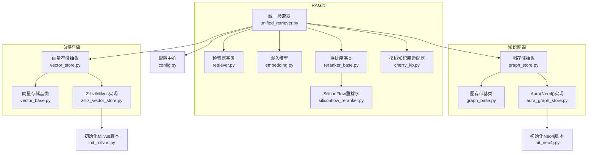
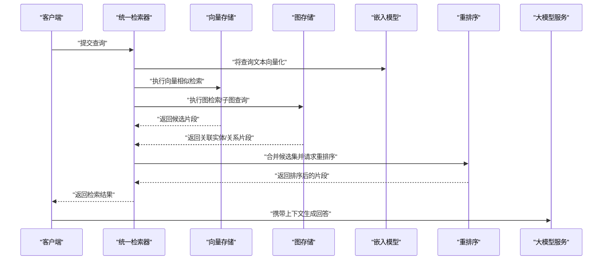
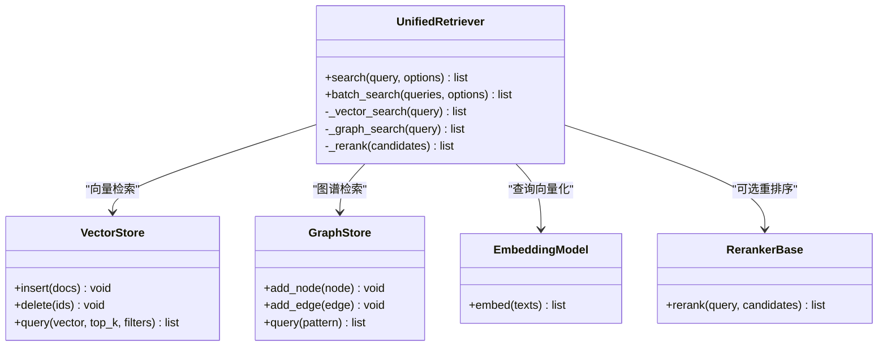
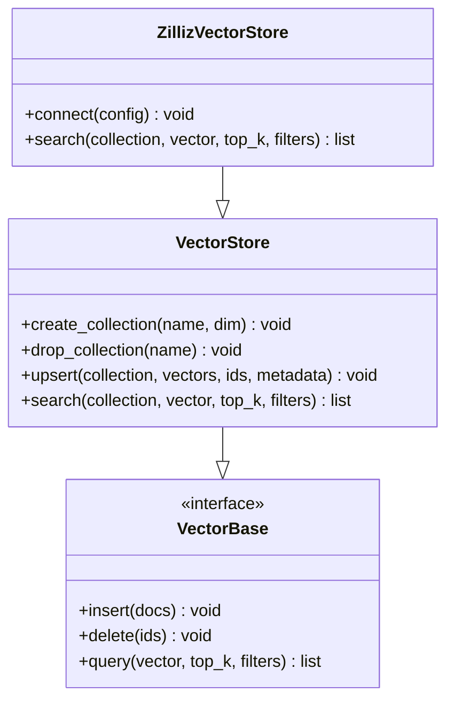
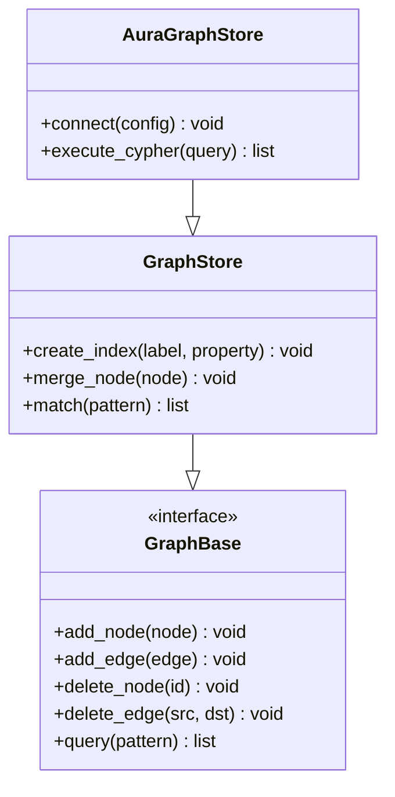
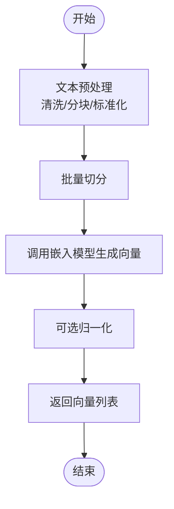
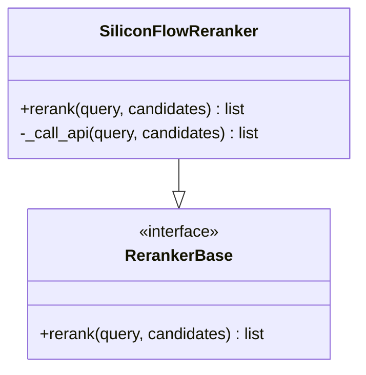
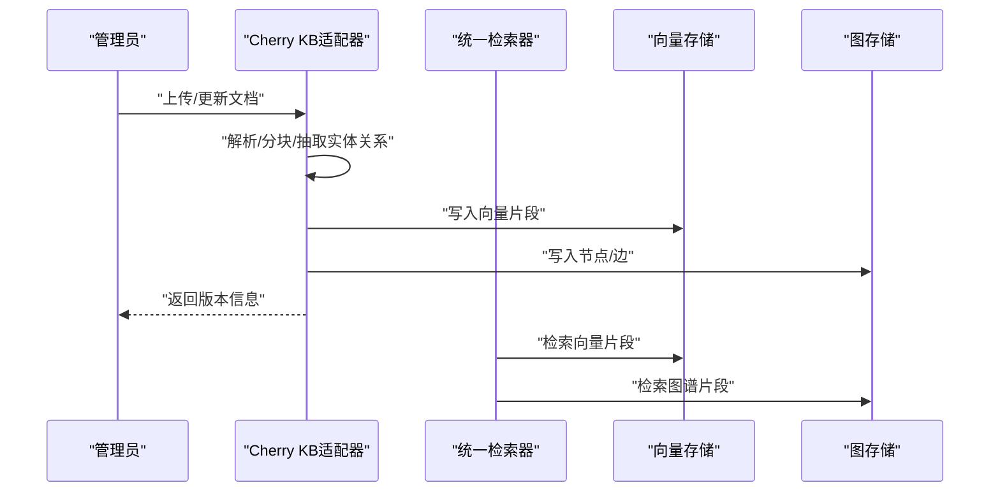
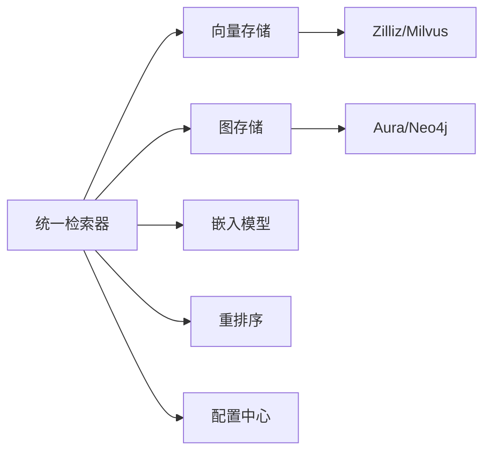

# 知识管理系统

<cite>
**本文引用的文件**   
- [backend_design/nexus/rag/unified_retriever.py](file://backend_design/nexus/rag/unified_retriever.py)
- [backend_design/nexus/rag/retriever.py](file://backend_design/nexus/rag/retriever.py)
- [backend_design/nexus/rag/vector_base.py](file://backend_design/nexus/rag/vector_base.py)
- [backend_design/nexus/rag/vector_store.py](file://backend_design/nexus/rag/vector_store.py)
- [backend_design/nexus/rag/zilliz_vector_store.py](file://backend_design/nexus/rag/zilliz_vector_store.py)
- [backend_design/nexus/rag/graph_base.py](file://backend_design/nexus/rag/graph_base.py)
- [backend_design/nexus/rag/graph_store.py](file://backend_design/nexus/rag/graph_store.py)
- [backend_design/nexus/rag/aura_graph_store.py](file://backend_design/nexus/rag/aura_graph_store.py)
- [backend_design/nexus/rag/embedding.py](file://backend_design/nexus/rag/embedding.py)
- [backend_design/nexus/rag/reranker_base.py](file://backend_design/nexus/rag/reranker_base.py)
- [backend_design/nexus/rag/siliconflow_reranker.py](file://backend_design/nexus/rag/siliconflow_reranker.py)
- [backend_design/nexus/rag/cherry_kb.py](file://backend_design/nexus/rag/cherry_kb.py)
- [backend_design/nexus/config.py](file://backend_design/nexus/config.py)
- [backend_design/scripts/init_milvus.py](file://backend_design/scripts/init_milvus.py)
- [backend_design/scripts/init_neo4j.py](file://backend_design/scripts/init_neo4j.py)
</cite>

## 目录
1. [简介](#简介)
2. [项目结构](#项目结构)
3. [核心组件](#核心组件)
4. [架构总览](#架构总览)
5. [详细组件分析](#详细组件分析)
6. [依赖关系分析](#依赖关系分析)
7. [性能考虑](#性能考虑)
8. [故障排查指南](#故障排查指南)
9. [结论](#结论)
10. [附录](#附录)

## 简介
本技术文档面向NexusCockpit的知识管理系统，聚焦RAG检索增强生成系统的设计与实现。内容涵盖：
- 向量数据库与知识图谱的双路检索机制
- 向量化存储的实现原理（文本嵌入、相似度计算、索引优化）
- 知识图谱的构建与维护（实体关系抽取、查询优化）
- 重排序算法的工作原理与效果提升
- 统一检索器的设计模式与多后端协调
- 知识库导入、更新与版本管理流程
- 检索性能调优与缓存策略配置

## 项目结构
知识管理与RAG相关代码集中在 backend_design/nexus/rag 目录下，围绕“统一检索器”组织，向上提供一致的查询接口，向下对接多种向量库与图数据库后端，并支持可插拔的重排序模块。

图表来源
- [backend_design/nexus/rag/unified_retriever.py](file://backend_design/nexus/rag/unified_retriever.py)
- [backend_design/nexus/rag/retriever.py](file://backend_design/nexus/rag/retriever.py)
- [backend_design/nexus/rag/vector_base.py](file://backend_design/nexus/rag/vector_base.py)
- [backend_design/nexus/rag/vector_store.py](file://backend_design/nexus/rag/vector_store.py)
- [backend_design/nexus/rag/zilliz_vector_store.py](file://backend_design/nexus/rag/zilliz_vector_store.py)
- [backend_design/nexus/rag/graph_base.py](file://backend_design/nexus/rag/graph_base.py)
- [backend_design/nexus/rag/graph_store.py](file://backend_design/nexus/rag/graph_store.py)
- [backend_design/nexus/rag/aura_graph_store.py](file://backend_design/nexus/rag/aura_graph_store.py)
- [backend_design/nexus/rag/embedding.py](file://backend_design/nexus/rag/embedding.py)
- [backend_design/nexus/rag/reranker_base.py](file://backend_design/nexus/rag/reranker_base.py)
- [backend_design/nexus/rag/siliconflow_reranker.py](file://backend_design/nexus/rag/siliconflow_reranker.py)
- [backend_design/nexus/rag/cherry_kb.py](file://backend_design/nexus/rag/cherry_kb.py)
- [backend_design/nexus/config.py](file://backend_design/nexus/config.py)
- [backend_design/scripts/init_milvus.py](file://backend_design/scripts/init_milvus.py)
- [backend_design/scripts/init_neo4j.py](file://backend_design/scripts/init_neo4j.py)

章节来源
- [backend_design/nexus/rag/unified_retriever.py](file://backend_design/nexus/rag/unified_retriever.py)
- [backend_design/nexus/rag/vector_store.py](file://backend_design/nexus/rag/vector_store.py)
- [backend_design/nexus/rag/graph_store.py](file://backend_design/nexus/rag/graph_store.py)
- [backend_design/nexus/config.py](file://backend_design/nexus/config.py)

## 核心组件
- 统一检索器：对外暴露一致查询接口，协调向量检索与图谱检索，并可选地调用重排序模块进行结果精炼。
- 向量存储抽象与实现：定义统一的向量索引、插入、删除与相似性搜索接口；具体实现以Zilliz/Milvus为例。
- 知识图谱存储抽象与实现：定义统一的节点/边增删改查与图查询接口；具体实现以Aura(Neo4j)为例。
- 嵌入模型：负责将文本转换为向量表示，供向量检索使用。
- 重排序模块：对初步检索结果进行相关性再打分，提高最终返回质量。
- 知识库适配器：封装外部知识库（如Cherry KB）的接入逻辑，便于统一导入与同步。

章节来源
- [backend_design/nexus/rag/unified_retriever.py](file://backend_design/nexus/rag/unified_retriever.py)
- [backend_design/nexus/rag/vector_base.py](file://backend_design/nexus/rag/vector_base.py)
- [backend_design/nexus/rag/vector_store.py](file://backend_design/nexus/rag/vector_store.py)
- [backend_design/nexus/rag/zilliz_vector_store.py](file://backend_design/nexus/rag/zilliz_vector_store.py)
- [backend_design/nexus/rag/graph_base.py](file://backend_design/nexus/rag/graph_base.py)
- [backend_design/nexus/rag/graph_store.py](file://backend_design/nexus/rag/graph_store.py)
- [backend_design/nexus/rag/aura_graph_store.py](file://backend_design/nexus/rag/aura_graph_store.py)
- [backend_design/nexus/rag/embedding.py](file://backend_design/nexus/rag/embedding.py)
- [backend_design/nexus/rag/reranker_base.py](file://backend_design/nexus/rag/reranker_base.py)
- [backend_design/nexus/rag/siliconflow_reranker.py](file://backend_design/nexus/rag/siliconflow_reranker.py)
- [backend_design/nexus/rag/cherry_kb.py](file://backend_design/nexus/rag/cherry_kb.py)

## 架构总览
下图展示了从用户查询到最终答案生成的端到端流程，包括双路检索（向量+图谱）、可选重排序以及统一接口的编排。

图表来源
- [backend_design/nexus/rag/unified_retriever.py](file://backend_design/nexus/rag/unified_retriever.py)
- [backend_design/nexus/rag/vector_store.py](file://backend_design/nexus/rag/vector_store.py)
- [backend_design/nexus/rag/graph_store.py](file://backend_design/nexus/rag/graph_store.py)
- [backend_design/nexus/rag/embedding.py](file://backend_design/nexus/rag/embedding.py)
- [backend_design/nexus/rag/reranker_base.py](file://backend_design/nexus/rag/reranker_base.py)
- [backend_design/nexus/rag/siliconflow_reranker.py](file://backend_design/nexus/rag/siliconflow_reranker.py)

## 详细组件分析

### 统一检索器（UnifedRetriever）
职责与行为
- 提供统一的检索入口，屏蔽底层向量与图存储差异。
- 并行或串行调度向量检索与图谱检索，合并候选集。
- 可选调用重排序模块以提升相关性。
- 输出标准化的检索结果格式，供上层问答链路消费。

关键交互
- 与嵌入模型协作完成查询向量化。
- 与向量存储和图存储分别发起检索。
- 与重排序模块协作进行二次打分。

图表来源
- [backend_design/nexus/rag/unified_retriever.py](file://backend_design/nexus/rag/unified_retriever.py)
- [backend_design/nexus/rag/vector_store.py](file://backend_design/nexus/rag/vector_store.py)
- [backend_design/nexus/rag/graph_store.py](file://backend_design/nexus/rag/graph_store.py)
- [backend_design/nexus/rag/embedding.py](file://backend_design/nexus/rag/embedding.py)
- [backend_design/nexus/rag/reranker_base.py](file://backend_design/nexus/rag/reranker_base.py)

章节来源
- [backend_design/nexus/rag/unified_retriever.py](file://backend_design/nexus/rag/unified_retriever.py)

### 向量存储（Vector Store）
职责与行为
- 定义统一的向量索引、插入、删除与相似性搜索接口。
- 具体实现以Zilliz/Milvus为例，提供高性能近似最近邻检索。
- 支持元数据过滤、集合/命名空间隔离等能力。

图表来源
- [backend_design/nexus/rag/vector_base.py](file://backend_design/nexus/rag/vector_base.py)
- [backend_design/nexus/rag/vector_store.py](file://backend_design/nexus/rag/vector_store.py)
- [backend_design/nexus/rag/zilliz_vector_store.py](file://backend_design/nexus/rag/zilliz_vector_store.py)

章节来源
- [backend_design/nexus/rag/vector_base.py](file://backend_design/nexus/rag/vector_base.py)
- [backend_design/nexus/rag/vector_store.py](file://backend_design/nexus/rag/vector_store.py)
- [backend_design/nexus/rag/zilliz_vector_store.py](file://backend_design/nexus/rag/zilliz_vector_store.py)

### 知识图谱存储（Graph Store）
职责与行为
- 定义统一的节点/边增删改查与图查询接口。
- 具体实现以Aura(Neo4j)为例，支持复杂关系路径查询与聚合。
- 为实体关系抽取与图谱维护提供持久化支撑。

图表来源
- [backend_design/nexus/rag/graph_base.py](file://backend_design/nexus/rag/graph_base.py)
- [backend_design/nexus/rag/graph_store.py](file://backend_design/nexus/rag/graph_store.py)
- [backend_design/nexus/rag/aura_graph_store.py](file://backend_design/nexus/rag/aura_graph_store.py)

章节来源
- [backend_design/nexus/rag/graph_base.py](file://backend_design/nexus/rag/graph_base.py)
- [backend_design/nexus/rag/graph_store.py](file://backend_design/nexus/rag/graph_store.py)
- [backend_design/nexus/rag/aura_graph_store.py](file://backend_design/nexus/rag/aura_graph_store.py)

### 嵌入模型（Embedding）
职责与行为
- 将自然语言文本转换为高维向量，用于向量相似度检索。
- 支持批量嵌入与流式处理，兼顾吞吐与延迟。
- 与向量存储解耦，便于替换不同嵌入模型。

图表来源
- [backend_design/nexus/rag/embedding.py](file://backend_design/nexus/rag/embedding.py)

章节来源
- [backend_design/nexus/rag/embedding.py](file://backend_design/nexus/rag/embedding.py)

### 重排序（Reranker）
职责与行为
- 对初步检索结果进行相关性再打分，提升最终返回质量。
- 支持多种重排序后端（示例：SiliconFlow）。
- 可与向量/图谱检索结果融合后统一打分。

图表来源
- [backend_design/nexus/rag/reranker_base.py](file://backend_design/nexus/rag/reranker_base.py)
- [backend_design/nexus/rag/siliconflow_reranker.py](file://backend_design/nexus/rag/siliconflow_reranker.py)

章节来源
- [backend_design/nexus/rag/reranker_base.py](file://backend_design/nexus/rag/reranker_base.py)
- [backend_design/nexus/rag/siliconflow_reranker.py](file://backend_design/nexus/rag/siliconflow_reranker.py)

### 知识库适配器（Cherry KB）
职责与行为
- 封装外部知识库（如Cherry KB）的接入逻辑。
- 提供统一的导入、同步与版本管理能力。
- 与统一检索器集成，作为知识源之一。

图表来源
- [backend_design/nexus/rag/cherry_kb.py](file://backend_design/nexus/rag/cherry_kb.py)
- [backend_design/nexus/rag/unified_retriever.py](file://backend_design/nexus/rag/unified_retriever.py)
- [backend_design/nexus/rag/vector_store.py](file://backend_design/nexus/rag/vector_store.py)
- [backend_design/nexus/rag/graph_store.py](file://backend_design/nexus/rag/graph_store.py)

章节来源
- [backend_design/nexus/rag/cherry_kb.py](file://backend_design/nexus/rag/cherry_kb.py)

## 依赖关系分析
- 统一检索器依赖向量存储、图存储、嵌入模型与重排序模块。
- 向量存储依赖具体后端（Zilliz/Milvus），并通过初始化脚本完成集合创建与索引配置。
- 图存储依赖具体后端（Aura/Neo4j），并通过初始化脚本完成图结构与索引配置。
- 配置中心集中管理各组件连接参数与运行时选项。

图表来源
- [backend_design/nexus/rag/unified_retriever.py](file://backend_design/nexus/rag/unified_retriever.py)
- [backend_design/nexus/rag/vector_store.py](file://backend_design/nexus/rag/vector_store.py)
- [backend_design/nexus/rag/zilliz_vector_store.py](file://backend_design/nexus/rag/zilliz_vector_store.py)
- [backend_design/nexus/rag/graph_store.py](file://backend_design/nexus/rag/graph_store.py)
- [backend_design/nexus/rag/aura_graph_store.py](file://backend_design/nexus/rag/aura_graph_store.py)
- [backend_design/nexus/rag/embedding.py](file://backend_design/nexus/rag/embedding.py)
- [backend_design/nexus/rag/reranker_base.py](file://backend_design/nexus/rag/reranker_base.py)
- [backend_design/nexus/config.py](file://backend_design/nexus/config.py)

章节来源
- [backend_design/nexus/config.py](file://backend_design/nexus/config.py)

## 性能考虑
- 向量检索
  - 选择合适的相似度度量（如余弦相似度）与索引类型（HNSW/IVF等），结合数据规模与QPS需求调整参数。
  - 合理设置top_k与过滤条件，减少不必要的扫描。
  - 批量插入与异步写入提升吞吐。
- 图谱检索
  - 在常用属性上建立索引，避免全表扫描。
  - 限制匹配深度与返回条数，控制查询复杂度。
- 重排序
  - 仅在必要场景启用，避免引入额外延迟。
  - 对候选集大小进行上限控制，平衡准确率与耗时。
- 缓存策略
  - 对高频查询结果进行短期缓存，降低重复计算。
  - 对嵌入向量与重排序结果进行分层缓存，注意失效策略与一致性。
- 资源与并发
  - 根据硬件资源调整并发度与批大小。
  - 监控关键指标（延迟、吞吐、错误率），动态降级与熔断。

[本节为通用性能建议，不直接分析具体文件]

## 故障排查指南
- 向量存储连接失败
  - 检查Zilliz/Milvus连接配置与网络可达性。
  - 确认集合是否存在且维度匹配。
  - 参考初始化脚本验证环境。
- 图存储连接失败
  - 检查Aura/Neo4j连接配置与认证信息。
  - 确认图结构与索引是否按预期创建。
  - 参考初始化脚本验证环境。
- 重排序异常
  - 检查重排序后端API可用性与鉴权。
  - 核对输入格式与候选集大小限制。
- 嵌入模型异常
  - 检查模型加载与内存占用。
  - 确认输入文本长度与编码格式。

章节来源
- [backend_design/scripts/init_milvus.py](file://backend_design/scripts/init_milvus.py)
- [backend_design/scripts/init_neo4j.py](file://backend_design/scripts/init_neo4j.py)

## 结论
本知识管理系统通过统一检索器整合向量检索与图谱检索，辅以重排序与嵌入模型，形成高效、可扩展的RAG基础设施。借助可插拔的后端设计与完善的初始化脚本，系统具备良好的可维护性与弹性扩展能力。后续可在缓存、索引优化与监控方面持续演进，进一步提升检索质量与系统稳定性。

[本节为总结性内容，不直接分析具体文件]

## 附录
- 初始化与环境准备
  - 向量库初始化：参考初始化脚本完成集合与索引配置。
  - 图数据库初始化：参考初始化脚本完成图结构与索引配置。
- 配置项说明
  - 连接参数：向量库与图数据库的连接地址、认证信息等。
  - 检索参数：top_k、相似度阈值、过滤条件等。
  - 重排序参数：是否启用、候选集大小、超时时间等。

章节来源
- [backend_design/scripts/init_milvus.py](file://backend_design/scripts/init_milvus.py)
- [backend_design/scripts/init_neo4j.py](file://backend_design/scripts/init_neo4j.py)
- [backend_design/nexus/config.py](file://backend_design/nexus/config.py)