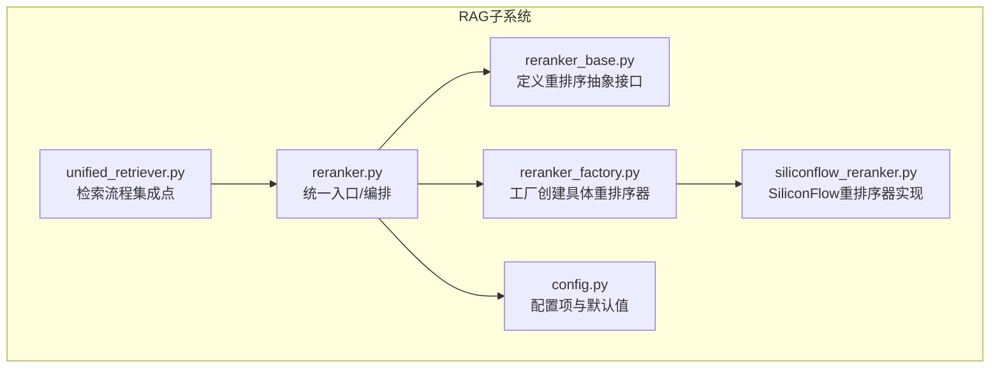
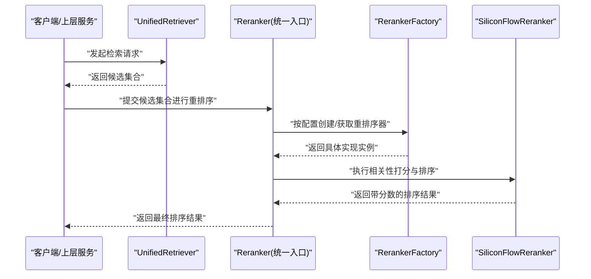
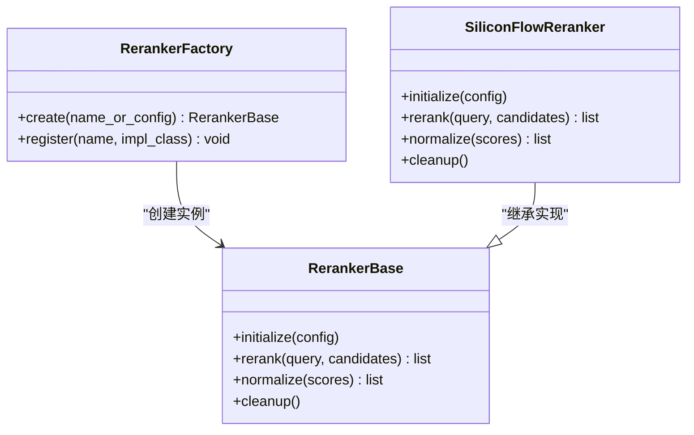
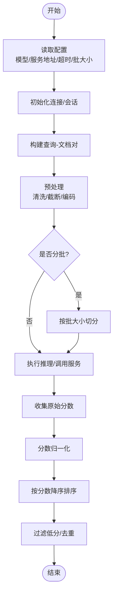
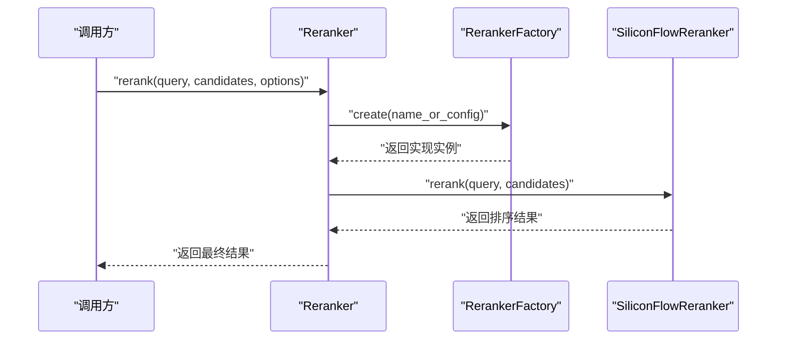
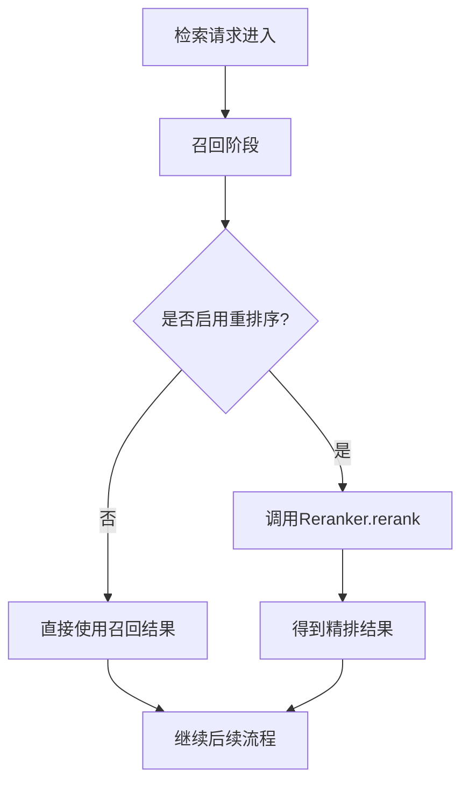
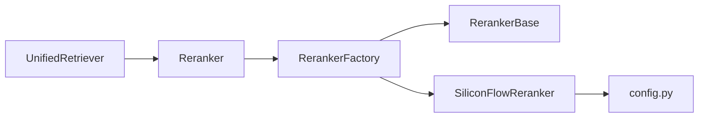

# 重排序算法

<cite>
**本文引用的文件**   
- [reranker_base.py](file://backend_design/nexus/rag/reranker_base.py)
- [reranker_factory.py](file://backend_design/nexus/rag/reranker_factory.py)
- [siliconflow_reranker.py](file://backend_design/nexus/rag/siliconflow_reranker.py)
- [reranker.py](file://backend_design/nexus/rag/reranker.py)
- [unified_retriever.py](file://backend_design/nexus/rag/unified_retriever.py)
- [config.py](file://backend_design/nexus/config.py)
</cite>

## 目录
1. [简介](#简介)
2. [项目结构](#项目结构)
3. [核心组件](#核心组件)
4. [架构总览](#架构总览)
5. [详细组件分析](#详细组件分析)
6. [依赖关系分析](#依赖关系分析)
7. [性能考量](#性能考量)
8. [故障排查指南](#故障排查指南)
9. [结论](#结论)
10. [附录](#附录)

## 简介
本技术文档聚焦于NexusCockpit的重排序（Rerank）算法系统，围绕以下目标展开：
- 抽象层设计：定义统一的重排序接口与工厂模式，屏蔽不同实现差异。
- SiliconFlow重排序器实现：模型加载、推理过程与结果处理。
- 算法原理：相关性评分、排序策略与分数归一化。
- 配置选项：模型选择、参数调优与性能优化。
- 评估方法：准确率指标与人工评估标准。
- 使用示例：在检索流程中集成重排序模块，以及按业务需求定制策略。

## 项目结构
重排序相关代码位于后端RAG子系统中，关键文件如下：
- 抽象基类与工厂：reranker_base.py、reranker_factory.py
- 具体实现：siliconflow_reranker.py
- 统一入口与编排：reranker.py、unified_retriever.py
- 配置：config.py

图表来源
- [reranker_base.py](file://backend_design/nexus/rag/reranker_base.py)
- [reranker_factory.py](file://backend_design/nexus/rag/reranker_factory.py)
- [siliconflow_reranker.py](file://backend_design/nexus/rag/siliconflow_reranker.py)
- [reranker.py](file://backend_design/nexus/rag/reranker.py)
- [unified_retriever.py](file://backend_design/nexus/rag/unified_retriever.py)
- [config.py](file://backend_design/nexus/config.py)

章节来源
- [reranker_base.py](file://backend_design/nexus/rag/reranker_base.py)
- [reranker_factory.py](file://backend_design/nexus/rag/reranker_factory.py)
- [siliconflow_reranker.py](file://backend_design/nexus/rag/siliconflow_reranker.py)
- [reranker.py](file://backend_design/nexus/rag/reranker.py)
- [unified_retriever.py](file://backend_design/nexus/rag/unified_retriever.py)
- [config.py](file://backend_design/nexus/config.py)

## 核心组件
- 抽象基类（RerankerBase）
  - 职责：定义统一的输入输出契约与生命周期钩子（初始化、推理、清理）。
  - 典型能力：批量打分、排序、可选的分数归一化、错误边界处理。
- 工厂（RerankerFactory）
  - 职责：根据配置或运行时参数创建具体重排序器实例，支持多实现切换。
- SiliconFlow重排序器（SiliconFlowReranker）
  - 职责：封装外部服务调用或本地模型推理，完成查询-文档对的相关性打分与排序。
- 统一入口（Reranker）
  - 职责：对外暴露一致的API；负责将上游检索结果送入重排序，并返回最终排序列表。
- 检索集成（UnifiedRetriever）
  - 职责：在检索流水线中按需插入重排序阶段，串联召回与精排。

章节来源
- [reranker_base.py](file://backend_design/nexus/rag/reranker_base.py)
- [reranker_factory.py](file://backend_design/nexus/rag/reranker_factory.py)
- [siliconflow_reranker.py](file://backend_design/nexus/rag/siliconflow_reranker.py)
- [reranker.py](file://backend_design/nexus/rag/reranker.py)
- [unified_retriever.py](file://backend_design/nexus/rag/unified_retriever.py)

## 架构总览
下图展示从检索到重排序的整体数据流与控制流。

图表来源
- [unified_retriever.py](file://backend_design/nexus/rag/unified_retriever.py)
- [reranker.py](file://backend_design/nexus/rag/reranker.py)
- [reranker_factory.py](file://backend_design/nexus/rag/reranker_factory.py)
- [siliconflow_reranker.py](file://backend_design/nexus/rag/siliconflow_reranker.py)

## 详细组件分析

### 抽象层设计与工厂模式
- 抽象接口
  - 输入：查询文本、候选文档集合（含ID、内容等元信息）。
  - 输出：排序后的文档列表，附带相关性分数。
  - 扩展点：可定义预处理、后处理、归一化、缓存等钩子。
- 工厂模式
  - 通过配置键或类型名解析具体实现。
  - 支持热插拔：在不修改调用方的情况下替换重排序实现。
  - 错误处理：当配置缺失或实现不可用时，提供降级策略（如跳过重排序或回退到原始顺序）。

图表来源
- [reranker_base.py](file://backend_design/nexus/rag/reranker_base.py)
- [reranker_factory.py](file://backend_design/nexus/rag/reranker_factory.py)
- [siliconflow_reranker.py](file://backend_design/nexus/rag/siliconflow_reranker.py)

章节来源
- [reranker_base.py](file://backend_design/nexus/rag/reranker_base.py)
- [reranker_factory.py](file://backend_design/nexus/rag/reranker_factory.py)

### SiliconFlow重排序器实现
- 模型/服务加载
  - 依据配置加载远程服务或本地模型资源，建立连接或会话。
  - 支持超时、重试、熔断等健壮性机制。
- 推理过程
  - 构建查询-文档对，批量提交以换取相关性分数。
  - 内部可能包含文本清洗、长度截断、批次切分等预处理。
- 结果处理
  - 将原始分数映射为稳定排序所需的数值。
  - 可选归一化（如Min-Max、Sigmoid），保证跨批次/跨模型的分数可比性。
  - 过滤低分条目、去重、保留必要元信息。

图表来源
- [siliconflow_reranker.py](file://backend_design/nexus/rag/siliconflow_reranker.py)

章节来源
- [siliconflow_reranker.py](file://backend_design/nexus/rag/siliconflow_reranker.py)

### 统一入口与编排（Reranker）
- 职责
  - 接收上游候选集合，委托工厂创建具体重排序器。
  - 协调预处理、推理、归一化、排序与后处理。
  - 提供统一的异常处理与日志记录。
- 编排要点
  - 若未启用重排序或配置缺失，直接返回原顺序。
  - 支持开关控制、阈值过滤、最大返回数量限制。

图表来源
- [reranker.py](file://backend_design/nexus/rag/reranker.py)
- [reranker_factory.py](file://backend_design/nexus/rag/reranker_factory.py)
- [siliconflow_reranker.py](file://backend_design/nexus/rag/siliconflow_reranker.py)

章节来源
- [reranker.py](file://backend_design/nexus/rag/reranker.py)

### 检索流程集成（UnifiedRetriever）
- 集成位置
  - 在召回阶段之后、答案生成之前插入重排序步骤。
- 行为
  - 若配置开启重排序，则调用统一入口；否则跳过。
  - 将重排序结果作为下游模块的输入。

图表来源
- [unified_retriever.py](file://backend_design/nexus/rag/unified_retriever.py)
- [reranker.py](file://backend_design/nexus/rag/reranker.py)

章节来源
- [unified_retriever.py](file://backend_design/nexus/rag/unified_retriever.py)

## 依赖关系分析
- 组件耦合
  - Reranker依赖工厂与具体实现，遵循开闭原则。
  - SiliconFlowReranker依赖配置与服务/模型资源。
- 外部依赖
  - 网络服务或本地推理库（由具体实现决定）。
- 潜在循环依赖
  - 通过工厂解耦，避免直接相互引用。

图表来源
- [unified_retriever.py](file://backend_design/nexus/rag/unified_retriever.py)
- [reranker.py](file://backend_design/nexus/rag/reranker.py)
- [reranker_factory.py](file://backend_design/nexus/rag/reranker_factory.py)
- [siliconflow_reranker.py](file://backend_design/nexus/rag/siliconflow_reranker.py)
- [config.py](file://backend_design/nexus/config.py)

章节来源
- [unified_retriever.py](file://backend_design/nexus/rag/unified_retriever.py)
- [reranker.py](file://backend_design/nexus/rag/reranker.py)
- [reranker_factory.py](file://backend_design/nexus/rag/reranker_factory.py)
- [siliconflow_reranker.py](file://backend_design/nexus/rag/siliconflow_reranker.py)
- [config.py](file://backend_design/nexus/config.py)

## 性能考量
- 批处理与并发
  - 合理设置批大小，平衡吞吐与延迟。
  - 对长文档进行截断或摘要以减少计算量。
- 分数稳定性
  - 归一化策略应确保跨批次/跨模型的一致性。
- 资源管理
  - 连接复用、会话保持、超时与重试策略。
- 降级与容错
  - 服务不可用时的快速失败与回退路径。

[本节为通用指导，不直接分析具体文件]

## 故障排查指南
- 常见问题
  - 配置缺失或无效：检查工厂注册与配置键。
  - 服务不可达：确认网络连通性与认证凭据。
  - 超时/限流：调整超时、重试次数与批大小。
  - 分数异常：检查归一化逻辑与阈值过滤。
- 定位建议
  - 在统一入口与具体实现处增加结构化日志。
  - 对输入输出进行快照保存，便于离线复现。

章节来源
- [reranker.py](file://backend_design/nexus/rag/reranker.py)
- [siliconflow_reranker.py](file://backend_design/nexus/rag/siliconflow_reranker.py)

## 结论
通过抽象基类与工厂模式，NexusCockpit实现了可扩展、可替换的重排序体系。SiliconFlow重排序器提供了端到端的推理与结果处理能力，结合统一入口与检索集成点，可在不侵入上层逻辑的前提下灵活接入。配合合理的配置与评估体系，可有效提升检索质量与用户体验。

[本节为总结性内容，不直接分析具体文件]

## 附录

### 算法工作原理
- 相关性评分
  - 基于查询-文档对的语义匹配度打分。
- 排序策略
  - 按分数降序排列，支持阈值过滤与Top-K限制。
- 分数归一化
  - 采用稳定的映射函数，使分数具备可比性与鲁棒性。

[本节为概念性说明，不直接分析具体文件]

### 配置选项
- 模型/服务选择
  - 指定实现名称或配置对象，由工厂解析。
- 参数调优
  - 批大小、超时、重试次数、阈值、Top-K等。
- 性能优化
  - 连接复用、缓存、异步调用（视实现而定）。

章节来源
- [config.py](file://backend_design/nexus/config.py)
- [reranker_factory.py](file://backend_design/nexus/rag/reranker_factory.py)

### 评估方法
- 自动指标
  - 命中率、MRR、NDCG等排序质量指标。
- 人工评估
  - 相关性等级、可读性、业务契合度。
- 实验设计
  - 离线A/B测试、在线灰度发布与监控。

[本节为通用指导，不直接分析具体文件]

### 使用示例（集成与定制）
- 在检索流程中集成
  - 在召回后调用统一入口进行重排序。
- 定制策略
  - 通过工厂注册新实现，或在现有实现中添加自定义后处理逻辑。
  - 调整阈值与Top-K以满足业务需求。

章节来源
- [unified_retriever.py](file://backend_design/nexus/rag/unified_retriever.py)
- [reranker.py](file://backend_design/nexus/rag/reranker.py)
- [reranker_factory.py](file://backend_design/nexus/rag/reranker_factory.py)