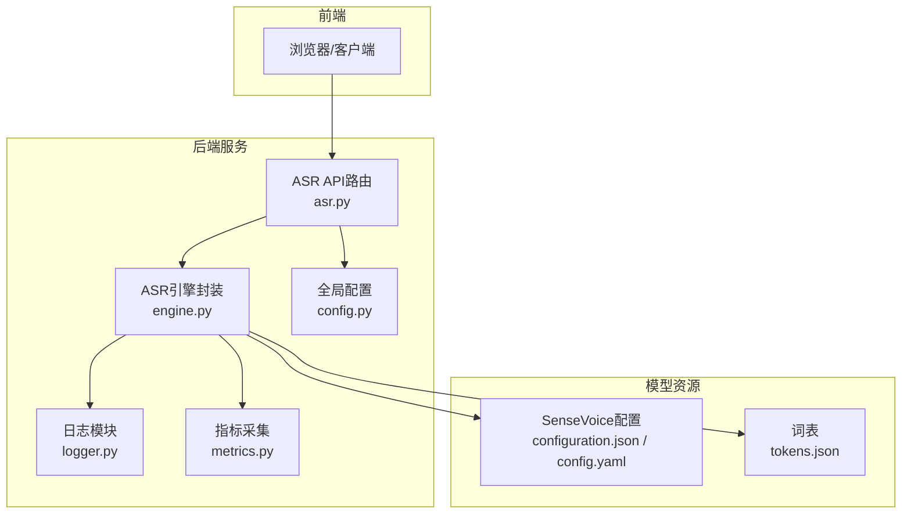
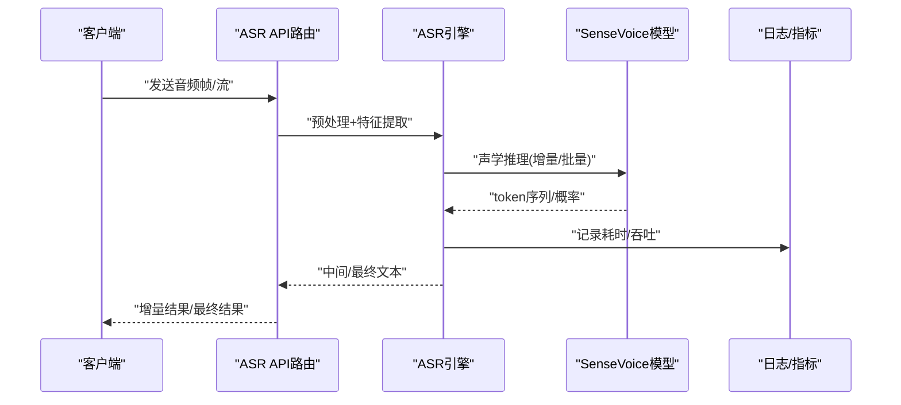
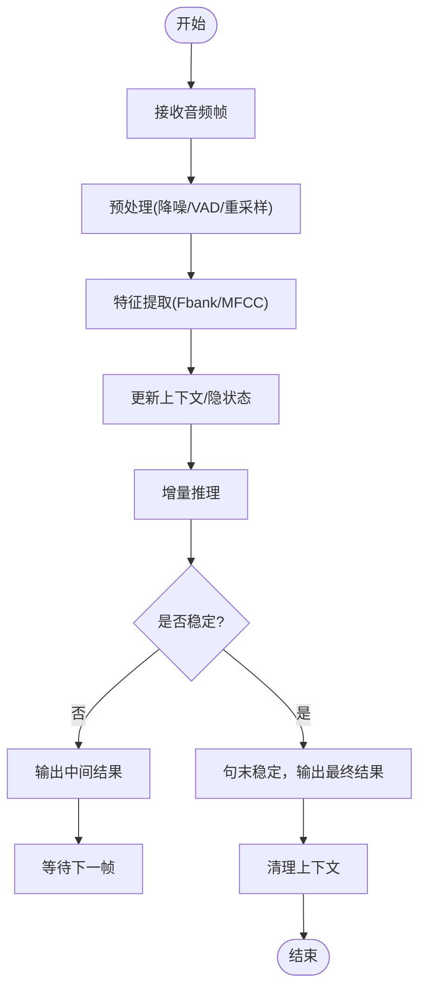
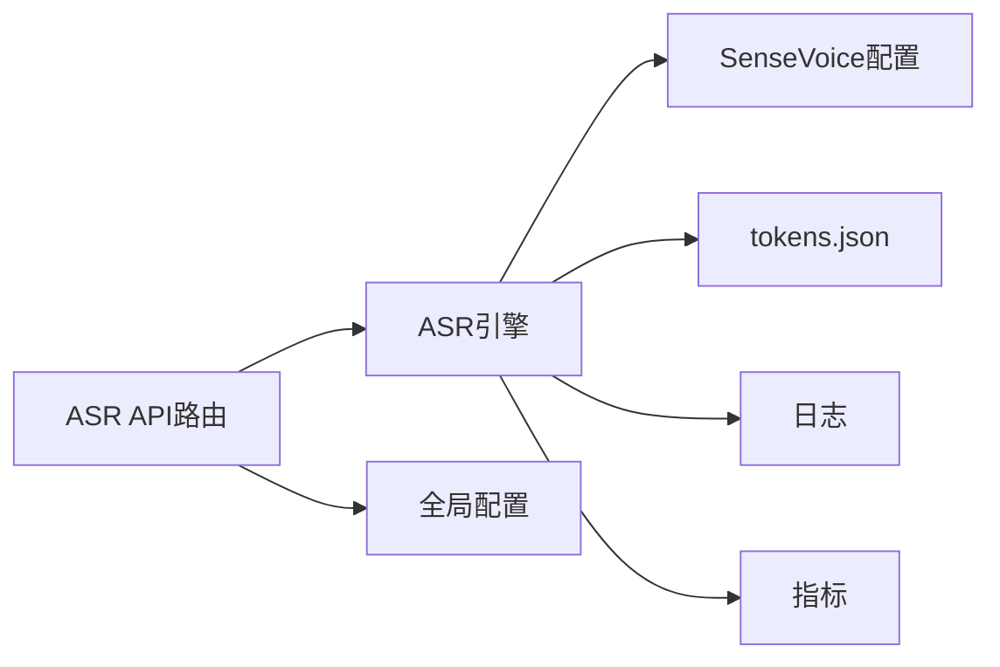

# ASR语音识别引擎

<cite>
**本文引用的文件**   
- [backend_design/nexus/asr/engine.py](file://backend_design/nexus/asr/engine.py)
- [backend_design/nexus/api/routes/asr.py](file://backend_design/nexus/api/routes/asr.py)
- [backend_design/nexus/config.py](file://backend_design/nexus/config.py)
- [models/asr/sensevoice/configuration.json](file://models/asr/sensevoice/configuration.json)
- [models/asr/sensevoice/config.yaml](file://models/asr/sensevoice/config.yaml)
- [models/asr/sensevoice/tokens.json](file://models/asr/sensevoice/tokens.json)
- [docs/voice/asr-guide.md](file://docs/voice/asr-guide.md)
- [docs/voice/audio-pipeline-guide.md](file://docs/voice/audio-pipeline-guide.md)
- [backend_design/nexus/core/logger.py](file://backend_design/nexus/core/logger.py)
- [backend_design/nexus/observability/metrics.py](file://backend_design/nexus/observability/metrics.py)
</cite>

## 目录
1. [简介](#简介)
2. [项目结构](#项目结构)
3. [核心组件](#核心组件)
4. [架构总览](#架构总览)
5. [详细组件分析](#详细组件分析)
6. [依赖关系分析](#依赖关系分析)
7. [性能考量](#性能考量)
8. [故障排查指南](#故障排查指南)
9. [结论](#结论)
10. [附录](#附录)

## 简介
本技术文档面向NexusCockpit的ASR（自动语音识别）子系统，重点围绕SenseVoice模型的集成与配置、音频预处理流程、特征提取方法、声学模型推理过程，以及实时流式识别的实现机制进行系统化说明。同时涵盖语言模型集成、自定义词典配置、音频参数调优建议、多语言与方言支持策略、噪声环境优化、常见错误与解决方案，以及性能监控与调试工具使用方法。

## 项目结构
ASR相关代码主要位于后端Python服务中，包含API路由、ASR引擎封装、配置文件与模型资源；前端通过WebSocket或HTTP接口与后端交互，完成录音、上传与结果回传。

图表来源
- [backend_design/nexus/api/routes/asr.py](file://backend_design/nexus/api/routes/asr.py)
- [backend_design/nexus/asr/engine.py](file://backend_design/nexus/asr/engine.py)
- [backend_design/nexus/config.py](file://backend_design/nexus/config.py)
- [backend_design/nexus/core/logger.py](file://backend_design/nexus/core/logger.py)
- [backend_design/nexus/observability/metrics.py](file://backend_design/nexus/observability/metrics.py)
- [models/asr/sensevoice/configuration.json](file://models/asr/sensevoice/configuration.json)
- [models/asr/sensevoice/config.yaml](file://models/asr/sensevoice/config.yaml)
- [models/asr/sensevoice/tokens.json](file://models/asr/sensevoice/tokens.json)

章节来源
- [backend_design/nexus/asr/engine.py](file://backend_design/nexus/asr/engine.py)
- [backend_design/nexus/api/routes/asr.py](file://backend_design/nexus/api/routes/asr.py)
- [backend_design/nexus/config.py](file://backend_design/nexus/config.py)
- [models/asr/sensevoice/configuration.json](file://models/asr/sensevoice/configuration.json)
- [models/asr/sensevoice/config.yaml](file://models/asr/sensevoice/config.yaml)
- [models/asr/sensevoice/tokens.json](file://models/asr/sensevoice/tokens.json)
- [docs/voice/asr-guide.md](file://docs/voice/asr-guide.md)
- [docs/voice/audio-pipeline-guide.md](file://docs/voice/audio-pipeline-guide.md)

## 核心组件
- ASR引擎封装：负责加载SenseVoice模型、管理会话上下文、执行音频预处理与特征提取、调用推理并返回文本结果。
- ASR API路由：提供HTTP/WebSocket接口，接收音频数据或流式帧，调度引擎处理，并返回增量或最终识别结果。
- 配置与资源：集中管理模型路径、采样率、通道数、端点检测阈值等关键参数；SenseVoice模型配置与词表位于models/asr/sensevoice目录。
- 可观测性：记录关键指标（耗时、吞吐、错误率）与结构化日志，便于定位问题与性能调优。

章节来源
- [backend_design/nexus/asr/engine.py](file://backend_design/nexus/asr/engine.py)
- [backend_design/nexus/api/routes/asr.py](file://backend_design/nexus/api/routes/asr.py)
- [backend_design/nexus/config.py](file://backend_design/nexus/config.py)
- [backend_design/nexus/core/logger.py](file://backend_design/nexus/core/logger.py)
- [backend_design/nexus/observability/metrics.py](file://backend_design/nexus/observability/metrics.py)

## 架构总览
整体流程从前端采集音频开始，经网关或直连进入后端ASR API，再由ASR引擎完成预处理、特征提取、推理与后处理，最后将结果推送给前端。

图表来源
- [backend_design/nexus/api/routes/asr.py](file://backend_design/nexus/api/routes/asr.py)
- [backend_design/nexus/asr/engine.py](file://backend_design/nexus/asr/engine.py)
- [backend_design/nexus/observability/metrics.py](file://backend_design/nexus/observability/metrics.py)

## 详细组件分析

### SenseVoice模型集成与配置
- 模型资源位置：models/asr/sensevoice下包含configuration.json、config.yaml与tokens.json，分别用于模型运行时配置、训练/推理超参与词表定义。
- 配置项要点：
  - 采样率、声道数、帧长与步长等音频参数需与模型期望一致。
  - 特征类型（如Fbank/MFCC）、滤波器数量、归一化方式应与模型配置匹配。
  - 词表tokens.json决定解码输出空间，若启用自定义词典，需合并到tokens或作为外部约束。
- 加载流程：
  - 读取configuration.json与config.yaml，初始化模型实例。
  - 加载tokens.json构建解码器词表。
  - 根据设备与内存情况选择CPU/GPU与批大小。

章节来源
- [models/asr/sensevoice/configuration.json](file://models/asr/sensevoice/configuration.json)
- [models/asr/sensevoice/config.yaml](file://models/asr/sensevoice/config.yaml)
- [models/asr/sensevoice/tokens.json](file://models/asr/sensevoice/tokens.json)

### 音频预处理流程
- 降噪：在输入端对音频进行降噪处理，抑制背景噪声与混响，提升鲁棒性。
- 端点检测（VAD）：检测语音起止边界，减少无效片段，降低计算开销。
- 格式转换：统一采样率、声道数与编码格式（如PCM/WAV），确保与模型输入要求一致。
- 分块策略：为支持流式识别，按固定时长或帧数切分音频块，维护滑动窗口以保留上下文。

章节来源
- [docs/voice/audio-pipeline-guide.md](file://docs/voice/audio-pipeline-guide.md)
- [docs/voice/asr-guide.md](file://docs/voice/asr-guide.md)

### 特征提取方法
- Fbank（Filterbank）：常用声学特征，兼顾计算效率与识别效果，适合实时场景。
- MFCC：传统特征，在某些方言或低资源场景可能更稳健。
- 参数对齐：滤波器组数量、梅尔刻度范围、对数压缩强度等需与模型配置一致。
- 归一化：采用均值方差归一化或说话人自适应归一化，提高跨域稳定性。

章节来源
- [docs/voice/asr-guide.md](file://docs/voice/asr-guide.md)
- [models/asr/sensevoice/config.yaml](file://models/asr/sensevoice/config.yaml)

### 声学模型推理过程
- 输入：预处理后的特征序列（Fbank/MFCC）。
- 推理模式：
  - 批量推理：适用于离线或高吞吐场景。
  - 增量推理：针对流式识别，逐步更新隐状态，实现低延迟输出。
- 解码：结合词表与可选的语言模型权重，生成token序列并映射为文本。
- 后处理：标点恢复、数字规范化、同音词消歧等。

章节来源
- [backend_design/nexus/asr/engine.py](file://backend_design/nexus/asr/engine.py)
- [models/asr/sensevoice/configuration.json](file://models/asr/sensevoice/configuration.json)

### 实时语音识别机制
- 流式处理：客户端持续发送音频帧，服务端维护会话上下文与滑动窗口。
- 增量解码：每收到新帧即触发一次轻量推理，输出中间结果，并在句末稳定后输出最终文本。
- 上下文管理：保存历史隐状态与部分特征，避免重复计算，保证一致性。
- 超时与重置：长时间无语音或会话结束，清理上下文并释放资源。

图表来源
- [backend_design/nexus/asr/engine.py](file://backend_design/nexus/asr/engine.py)
- [backend_design/nexus/api/routes/asr.py](file://backend_design/nexus/api/routes/asr.py)

### 语言模型集成与自定义词典
- 语言模型：可在解码阶段引入LM权重或n-gram约束，提升流畅度与领域适配性。
- 自定义词典：将领域术语、品牌名、人名等加入tokens或外部词典，增强专有名词识别。
- 融合策略：动态调整LM权重与热词强度，平衡通用性与领域准确性。

章节来源
- [models/asr/sensevoice/tokens.json](file://models/asr/sensevoice/tokens.json)
- [docs/voice/asr-guide.md](file://docs/voice/asr-guide.md)

### 音频参数配置指南
- 采样率：建议16kHz或更高，需与模型配置一致。
- 比特率：无损或高质量有损编码，避免过度压缩导致细节丢失。
- 通道数：单声道优先，多声道需降维至单声道。
- 帧长与步长：影响时延与精度，需权衡实时性与稳定性。
- VAD阈值：根据环境噪声调节，避免误切或漏切。

章节来源
- [backend_design/nexus/config.py](file://backend_design/nexus/config.py)
- [models/asr/sensevoice/config.yaml](file://models/asr/sensevoice/config.yaml)

### 多语言支持与方言识别
- 多语言：通过切换语言标签或模型变体实现，确保tokens覆盖目标语言字符集。
- 方言：使用方言专用模型或混合训练数据，必要时增加领域热词。
- 评估：在不同方言与口音数据集上验证WER/CER，针对性优化。

章节来源
- [docs/voice/asr-guide.md](file://docs/voice/asr-guide.md)

### 噪声环境下的性能优化策略
- 前端降噪：麦克风阵列与DSP降噪，减少噪声进入后端。
- 后端增强：谱减法、Wiener滤波、深度学习降噪模型。
- 鲁棒特征：Fbank对噪声相对稳健，配合归一化与说话人自适应。
- 动态VAD：根据信噪比自适应调整阈值，减少误触发。

章节来源
- [docs/voice/audio-pipeline-guide.md](file://docs/voice/audio-pipeline-guide.md)

## 依赖关系分析
ASR子系统依赖API路由、配置中心、模型资源与可观测性模块，形成清晰的层次结构与职责分离。

图表来源
- [backend_design/nexus/api/routes/asr.py](file://backend_design/nexus/api/routes/asr.py)
- [backend_design/nexus/asr/engine.py](file://backend_design/nexus/asr/engine.py)
- [backend_design/nexus/config.py](file://backend_design/nexus/config.py)
- [backend_design/nexus/core/logger.py](file://backend_design/nexus/core/logger.py)
- [backend_design/nexus/observability/metrics.py](file://backend_design/nexus/observability/metrics.py)
- [models/asr/sensevoice/configuration.json](file://models/asr/sensevoice/configuration.json)
- [models/asr/sensevoice/tokens.json](file://models/asr/sensevoice/tokens.json)

章节来源
- [backend_design/nexus/asr/engine.py](file://backend_design/nexus/asr/engine.py)
- [backend_design/nexus/api/routes/asr.py](file://backend_design/nexus/api/routes/asr.py)
- [backend_design/nexus/config.py](file://backend_design/nexus/config.py)
- [backend_design/nexus/core/logger.py](file://backend_design/nexus/core/logger.py)
- [backend_design/nexus/observability/metrics.py](file://backend_design/nexus/observability/metrics.py)

## 性能考量
- 批大小与并发：根据GPU/CPU资源调整批大小与线程池规模，平衡吞吐与时延。
- 内存管理：及时释放中间张量与上下文，避免内存泄漏。
- I/O优化：使用零拷贝或共享内存传输音频帧，减少序列化开销。
- 缓存策略：对短查询或高频短语进行结果缓存，降低重复推理成本。

[本节为通用指导，不直接分析具体文件]

## 故障排查指南
- 常见问题：
  - 识别结果为空或乱码：检查tokens.json与模型配置是否匹配，确认采样率与声道数。
  - 时延过高：降低批大小、缩短帧长、关闭不必要的后处理。
  - 误切频繁：调整VAD阈值，增加前端降噪。
  - 领域词识别差：扩展自定义词典，提高热词权重。
- 诊断工具：
  - 日志：查看ASR引擎与API路由的结构化日志，定位异常堆栈。
  - 指标：关注端到端时延、吞吐、错误率与资源占用。
  - 回放：保存原始音频与中间特征，复现问题并对比不同配置。

章节来源
- [backend_design/nexus/core/logger.py](file://backend_design/nexus/core/logger.py)
- [backend_design/nexus/observability/metrics.py](file://backend_design/nexus/observability/metrics.py)

## 结论
通过SenseVoice模型与完善的音频预处理、特征提取与推理流程，NexusCockpit实现了高效稳定的ASR能力。结合流式处理与上下文管理，系统在实时场景中具备低延迟与高鲁棒性。合理配置语言模型与自定义词典，可进一步提升领域识别准确率。借助日志与指标体系，团队可快速定位问题并进行性能调优。

[本节为总结性内容，不直接分析具体文件]

## 附录
- 参考文档：
  - ASR使用指南：[docs/voice/asr-guide.md](file://docs/voice/asr-guide.md)
  - 音频管线指南：[docs/voice/audio-pipeline-guide.md](file://docs/voice/audio-pipeline-guide.md)
- 模型资源：
  - SenseVoice配置与词表：[models/asr/sensevoice](file://models/asr/sensevoice)