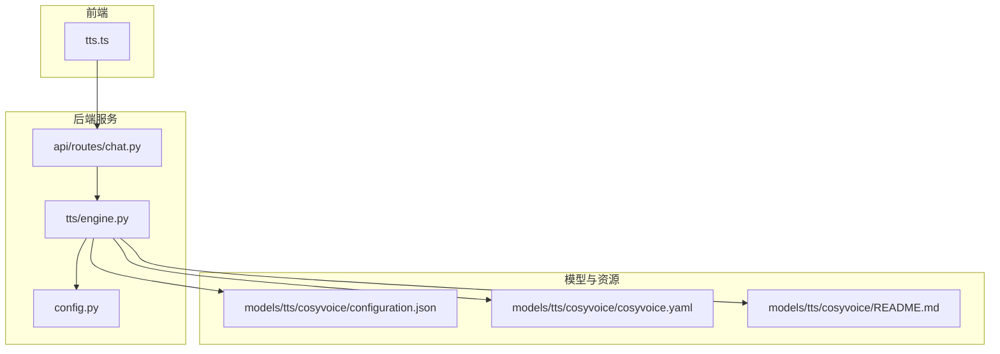
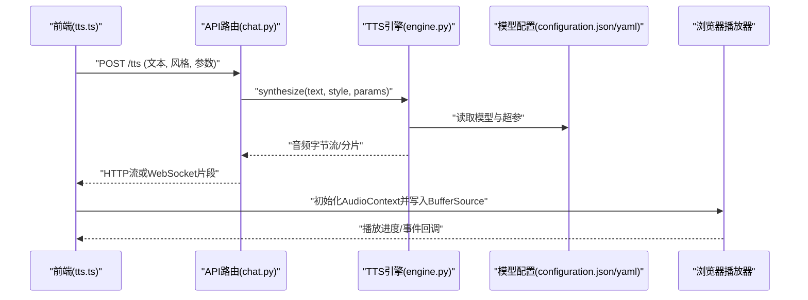
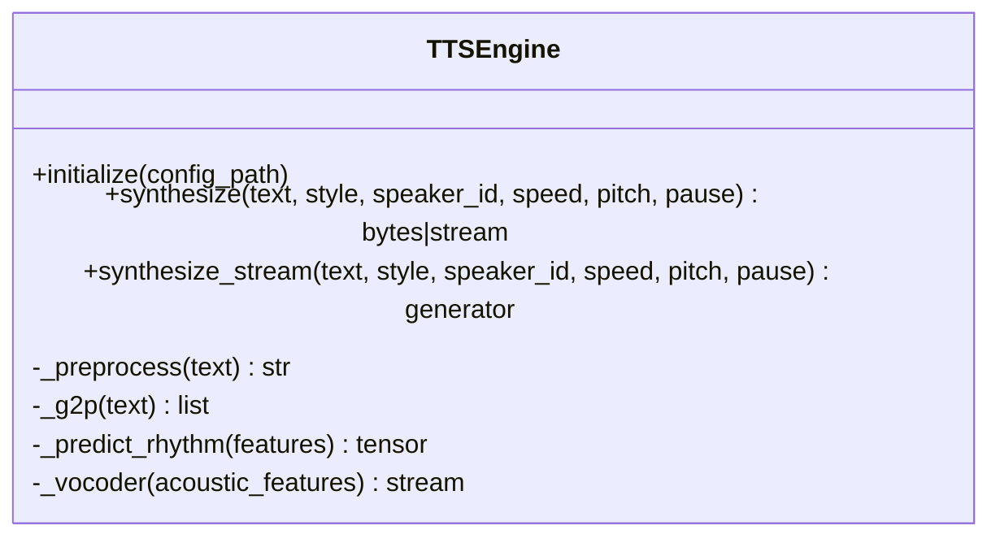
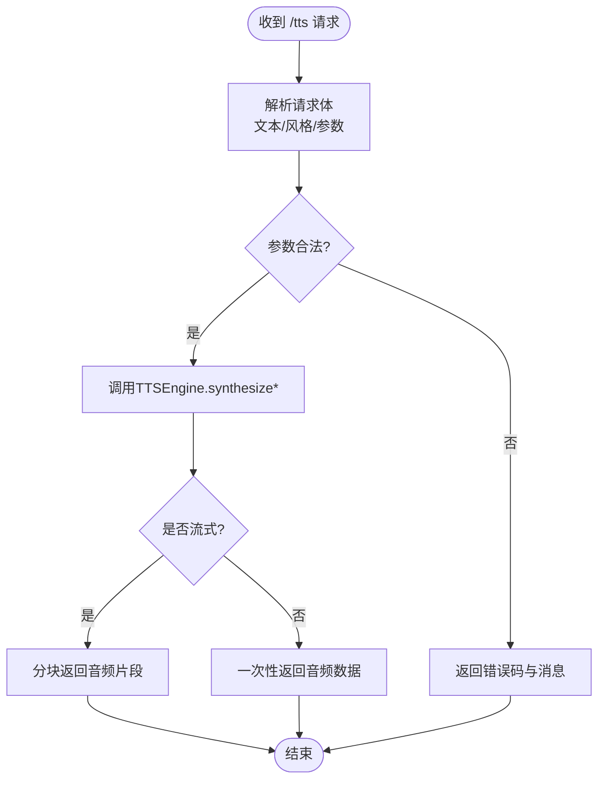
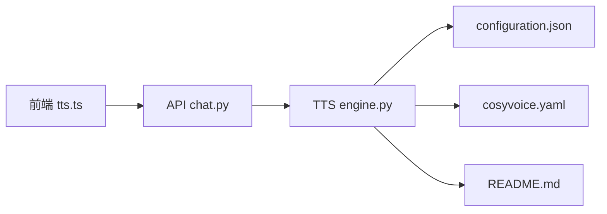

# TTS语音合成系统

<cite>
**本文引用的文件**   
- [backend_design/nexus/tts/engine.py](file://backend_design/nexus/tts/engine.py)
- [backend_design/nexus/tts/__init__.py](file://backend_design/nexus/tts/__init__.py)
- [models/tts/cosyvoice/configuration.json](file://models/tts/cosyvoice/configuration.json)
- [models/tts/cosyvoice/cosyvoice.yaml](file://models/tts/cosyvoice/cosyvoice.yaml)
- [models/tts/cosyvoice/README.md](file://models/tts/cosyvoice/README.md)
- [docs/voice/tts-guide.md](file://docs/voice/tts-guide.md)
- [frontend_design/src/lib/tts.ts](file://frontend_design/src/lib/tts.ts)
- [backend_design/nexus/api/routes/chat.py](file://backend_design/nexus/api/routes/chat.py)
- [backend_design/nexus/config.py](file://backend_design/nexus/config.py)
</cite>

## 目录
1. [简介](#简介)
2. [项目结构](#项目结构)
3. [核心组件](#核心组件)
4. [架构总览](#架构总览)
5. [详细组件分析](#详细组件分析)
6. [依赖关系分析](#依赖关系分析)
7. [性能与实时性](#性能与实时性)
8. [配置与参数](#配置与参数)
9. [多语言与词典](#多语言与词典)
10. [音质评估与调优](#音质评估与调优)
11. [故障排查指南](#故障排查指南)
12. [结论](#结论)
13. [附录](#附录)

## 简介
本技术文档面向NexusCockpit的TTS语音合成子系统，聚焦于CosyVoice模型的集成与使用。内容覆盖文本分析、音素转换、韵律预测、声码器合成的完整链路；说明支持的语音风格、情感表达与个性化声音克隆能力；给出音频生成参数（语速、音调、停顿等）的配置方法；提供多语言合成与自定义发音词典的接入方式；解释流式实时合成的实现机制与延迟优化策略；并包含质量评估指标、调优技巧与常见问题排查方案。

## 项目结构
TTS相关代码与资源主要分布在以下位置：
- 后端引擎与API集成：backend_design/nexus/tts 与 backend_design/nexus/api/routes
- CosyVoice模型配置与说明：models/tts/cosyvoice
- 前端播放与交互：frontend_design/src/lib/tts.ts
- 用户文档与指南：docs/voice/tts-guide.md

图表来源
- [backend_design/nexus/api/routes/chat.py](file://backend_design/nexus/api/routes/chat.py)
- [backend_design/nexus/tts/engine.py](file://backend_design/nexus/tts/engine.py)
- [models/tts/cosyvoice/configuration.json](file://models/tts/cosyvoice/configuration.json)
- [models/tts/cosyvoice/cosyvoice.yaml](file://models/tts/cosyvoice/cosyvoice.yaml)
- [models/tts/cosyvoice/README.md](file://models/tts/cosyvoice/README.md)
- [frontend_design/src/lib/tts.ts](file://frontend_design/src/lib/tts.ts)
- [backend_design/nexus/config.py](file://backend_design/nexus/config.py)

章节来源
- [backend_design/nexus/tts/engine.py](file://backend_design/nexus/tts/engine.py)
- [backend_design/nexus/tts/__init__.py](file://backend_design/nexus/tts/__init__.py)
- [models/tts/cosyvoice/configuration.json](file://models/tts/cosyvoice/configuration.json)
- [models/tts/cosyvoice/cosyvoice.yaml](file://models/tts/cosyvoice/cosyvoice.yaml)
- [models/tts/cosyvoice/README.md](file://models/tts/cosyvoice/README.md)
- [docs/voice/tts-guide.md](file://docs/voice/tts-guide.md)
- [frontend_design/src/lib/tts.ts](file://frontend_design/src/lib/tts.ts)
- [backend_design/nexus/api/routes/chat.py](file://backend_design/nexus/api/routes/chat.py)
- [backend_design/nexus/config.py](file://backend_design/nexus/config.py)

## 核心组件
- TTS引擎封装：负责加载CosyVoice模型与配置，统一对外暴露“文本到音频”的接口，支持同步与流式两种调用模式。
- API路由层：将前端的TTS请求转发至TTS引擎，处理参数校验、会话上下文与错误返回。
- 模型配置：CosyVoice的运行时配置与超参定义，包括采样率、模型权重路径、推理设备、可选的韵律与说话人控制开关等。
- 前端播放器：基于Web Audio API进行流式播放与缓冲管理，降低首帧延迟。

章节来源
- [backend_design/nexus/tts/engine.py](file://backend_design/nexus/tts/engine.py)
- [backend_design/nexus/api/routes/chat.py](file://backend_design/nexus/api/routes/chat.py)
- [models/tts/cosyvoice/configuration.json](file://models/tts/cosyvoice/configuration.json)
- [models/tts/cosyvoice/cosyvoice.yaml](file://models/tts/cosyvoice/cosyvoice.yaml)
- [frontend_design/src/lib/tts.ts](file://frontend_design/src/lib/tts.ts)

## 架构总览
下图展示了从前端发起TTS请求到后端完成音频生成的端到端流程，以及流式播放的关键路径。

图表来源
- [frontend_design/src/lib/tts.ts](file://frontend_design/src/lib/tts.ts)
- [backend_design/nexus/api/routes/chat.py](file://backend_design/nexus/api/routes/chat.py)
- [backend_design/nexus/tts/engine.py](file://backend_design/nexus/tts/engine.py)
- [models/tts/cosyvoice/configuration.json](file://models/tts/cosyvoice/configuration.json)
- [models/tts/cosyvoice/cosyvoice.yaml](file://models/tts/cosyvoice/cosyvoice.yaml)

## 详细组件分析

### TTS引擎（engine.py）
职责与要点：
- 模型加载与初始化：根据配置选择设备、加载权重、构建推理管线。
- 文本预处理：清洗、分词、规范化（数字、单位、标点），为后续音素化做准备。
- 音素与韵律：调用CosyVoice内部模块完成G2P/音素序列与韵律特征预测。
- 声码器合成：将声学特征转换为波形，输出PCM或压缩格式。
- 流式输出：按固定时长切片生成，减少首包等待时间。
- 参数映射：将上层传入的语速、音调、停顿、风格、说话人ID等映射到模型可接受参数。

图表来源
- [backend_design/nexus/tts/engine.py](file://backend_design/nexus/tts/engine.py)

章节来源
- [backend_design/nexus/tts/engine.py](file://backend_design/nexus/tts/engine.py)

### API路由（chat.py）
职责与要点：
- 接收前端TTS请求，解析文本、风格、说话人与参数。
- 调用TTS引擎进行同步或流式合成。
- 设置合适的响应头（MIME类型、分块传输），处理异常与降级。
- 记录关键指标（耗时、长度、错误码）用于观测。

图表来源
- [backend_design/nexus/api/routes/chat.py](file://backend_design/nexus/api/routes/chat.py)
- [backend_design/nexus/tts/engine.py](file://backend_design/nexus/tts/engine.py)

章节来源
- [backend_design/nexus/api/routes/chat.py](file://backend_design/nexus/api/routes/chat.py)

### 模型配置（configuration.json / cosyvoice.yaml）
- configuration.json：存放运行时关键配置，如采样率、模型路径、设备、日志级别、默认风格与说话人等。
- cosyvoice.yaml：存放模型结构与训练/推理超参，如网络层数、注意力头数、声码器类型、最大序列长度等。
- README.md：提供模型说明、版本信息、已知限制与注意事项。

章节来源
- [models/tts/cosyvoice/configuration.json](file://models/tts/cosyvoice/configuration.json)
- [models/tts/cosyvoice/cosyvoice.yaml](file://models/tts/cosyvoice/cosyvoice.yaml)
- [models/tts/cosyvoice/README.md](file://models/tts/cosyvoice/README.md)

### 前端播放器（tts.ts）
职责与要点：
- 建立AudioContext，创建MediaSource或BufferSource以支持流式播放。
- 维护播放队列与缓冲区，避免卡顿与爆音。
- 监听播放事件，处理暂停、恢复、错误重试。
- 与后端协商流式协议（HTTP分块或WebSocket）。

章节来源
- [frontend_design/src/lib/tts.ts](file://frontend_design/src/lib/tts.ts)

## 依赖关系分析
- 组件耦合：
  - API路由仅依赖TTS引擎的公开接口，保持低耦合。
  - TTS引擎依赖模型配置文件与可选的外部库（如PyTorch、CUDA驱动）。
  - 前端依赖浏览器Web Audio API与网络栈。
- 外部依赖：
  - CosyVoice模型权重与配置文件位于models/tts/cosyvoice。
  - 运行时可能依赖GPU加速与特定CUDA版本。

图表来源
- [frontend_design/src/lib/tts.ts](file://frontend_design/src/lib/tts.ts)
- [backend_design/nexus/api/routes/chat.py](file://backend_design/nexus/api/routes/chat.py)
- [backend_design/nexus/tts/engine.py](file://backend_design/nexus/tts/engine.py)
- [models/tts/cosyvoice/configuration.json](file://models/tts/cosyvoice/configuration.json)
- [models/tts/cosyvoice/cosyvoice.yaml](file://models/tts/cosyvoice/cosyvoice.yaml)
- [models/tts/cosyvoice/README.md](file://models/tts/cosyvoice/README.md)

章节来源
- [backend_design/nexus/tts/engine.py](file://backend_design/nexus/tts/engine.py)
- [backend_design/nexus/api/routes/chat.py](file://backend_design/nexus/api/routes/chat.py)
- [models/tts/cosyvoice/configuration.json](file://models/tts/cosyvoice/configuration.json)
- [models/tts/cosyvoice/cosyvoice.yaml](file://models/tts/cosyvoice/cosyvoice.yaml)
- [models/tts/cosyvoice/README.md](file://models/tts/cosyvoice/README.md)
- [frontend_design/src/lib/tts.ts](file://frontend_design/src/lib/tts.ts)

## 性能与实时性
- 流式生成：
  - 采用分块合成与边生成边发送的策略，显著降低首包延迟。
  - 建议合理设置分块时长（例如200–500ms），平衡延迟与稳定性。
- 并发与批处理：
  - 在GPU可用时启用批处理以提升吞吐；CPU场景下限制并发度避免抖动。
- 缓存与复用：
  - 对短文本或常用短语可做结果缓存，命中直接返回。
- 前端缓冲：
  - 预缓冲一定时长后再开始播放，减少网络抖动影响。
- 资源隔离：
  - 将TTS进程与主服务解耦，避免互相抢占CPU/GPU资源。

[本节为通用指导，不直接分析具体文件]

## 配置与参数
- 全局配置（示例键名，实际以配置文件为准）：
  - sample_rate：采样率（如16k/24k/48k）
  - device：推理设备（cpu/cuda）
  - model_dir：模型权重目录
  - default_speaker：默认说话人ID
  - default_style：默认风格
  - max_seq_len：最大序列长度
- 合成参数（通过API传入）：
  - text：待合成文本
  - style：风格（如新闻、对话、故事等）
  - speaker_id：说话人标识（支持克隆音色）
  - speed：语速系数（>1加快，<1减慢）
  - pitch：音调调节（>0升高，<0降低）
  - pause：停顿强度（控制句间/词间停顿）
  - format：输出格式（pcm/wav/mp3等）
- 流式参数：
  - chunk_duration_ms：分块时长
  - buffer_size：前端缓冲大小
  - protocol：http-chunked或websocket

章节来源
- [models/tts/cosyvoice/configuration.json](file://models/tts/cosyvoice/configuration.json)
- [models/tts/cosyvoice/cosyvoice.yaml](file://models/tts/cosyvoice/cosyvoice.yaml)
- [backend_design/nexus/tts/engine.py](file://backend_design/nexus/tts/engine.py)
- [backend_design/nexus/api/routes/chat.py](file://backend_design/nexus/api/routes/chat.py)
- [frontend_design/src/lib/tts.ts](file://frontend_design/src/lib/tts.ts)

## 多语言与词典
- 多语言支持：
  - 通过配置指定默认语言与回退策略；不同语言可使用不同的G2P规则与词典。
  - 对于混合语言文本，建议在预处理阶段进行语言检测与分段。
- 自定义发音词典：
  - 新增或覆盖专有名词、缩写、外文的发音映射。
  - 词典更新后需重启TTS服务或动态重载词典缓存。
- 验证与回归：
  - 针对新词条进行听感测试与自动化评测（如WER/SNR）。

章节来源
- [models/tts/cosyvoice/README.md](file://models/tts/cosyvoice/README.md)
- [docs/voice/tts-guide.md](file://docs/voice/tts-guide.md)
- [backend_design/nexus/tts/engine.py](file://backend_design/nexus/tts/engine.py)

## 音质评估与调优
- 客观指标：
  - PESQ/MOS-LQO：主观感知质量近似
  - SNR/DR：信噪比与动态范围
  - RTF：实时因子（合成耗时/音频时长）
  - WER：字错率（结合ASR转写对比）
- 主观评测：
  - 自然度、清晰度、情感一致性、口音偏好。
- 调优技巧：
  - 调整speed/pitch/pause以获得更自然的节奏与重音。
  - 选择合适的style与speaker_id匹配场景。
  - 对长文本进行语义断句，提升韵律连贯性。
  - 在噪声环境下适当提高响度与中高频能量。

章节来源
- [docs/voice/tts-guide.md](file://docs/voice/tts-guide.md)
- [models/tts/cosyvoice/README.md](file://models/tts/cosyvoice/README.md)

## 故障排查指南
- 常见现象与定位：
  - 无声音/静音：检查采样率与输出格式是否与播放器一致；确认音频未损坏。
  - 卡顿/爆音：增大前端缓冲；降低并发；检查网络抖动。
  - 首包延迟高：减小chunk_duration_ms；启用GPU；预热模型。
  - 风格/情感不生效：核对style/speaker_id是否在配置中有效；确认模型支持该特性。
  - 多语言读错：检查G2P与词典覆盖；必要时手动修正专有名词。
- 日志与观测：
  - 记录每次合成的耗时、长度、错误码与参数快照。
  - 监控GPU利用率与显存占用，避免OOM。
- 快速恢复：
  - 失败重试与降级策略（切换说话人或风格）。
  - 本地缓存热点文本结果。

章节来源
- [backend_design/nexus/api/routes/chat.py](file://backend_design/nexus/api/routes/chat.py)
- [backend_design/nexus/tts/engine.py](file://backend_design/nexus/tts/engine.py)
- [docs/voice/tts-guide.md](file://docs/voice/tts-guide.md)

## 结论
本TTS子系统以CosyVoice为核心，提供从文本到高质量语音的端到端能力，并通过流式合成与前端缓冲优化实现低延迟体验。合理的参数配置、词典管理与质量评估体系是保障稳定与高品质的关键。建议在生产环境持续监控RTF与MOS/PESQ指标，结合业务场景迭代风格与说话人策略。

[本节为总结性内容，不直接分析具体文件]

## 附录
- 参考文档：
  - TTS使用指南：docs/voice/tts-guide.md
  - CosyVoice模型说明：models/tts/cosyvoice/README.md
- 相关文件清单：
  - 后端引擎：backend_design/nexus/tts/engine.py
  - API路由：backend_design/nexus/api/routes/chat.py
  - 前端播放器：frontend_design/src/lib/tts.ts
  - 模型配置：models/tts/cosyvoice/configuration.json、models/tts/cosyvoice/cosyvoice.yaml

章节来源
- [docs/voice/tts-guide.md](file://docs/voice/tts-guide.md)
- [models/tts/cosyvoice/README.md](file://models/tts/cosyvoice/README.md)
- [backend_design/nexus/tts/engine.py](file://backend_design/nexus/tts/engine.py)
- [backend_design/nexus/api/routes/chat.py](file://backend_design/nexus/api/routes/chat.py)
- [frontend_design/src/lib/tts.ts](file://frontend_design/src/lib/tts.ts)
- [models/tts/cosyvoice/configuration.json](file://models/tts/cosyvoice/configuration.json)
- [models/tts/cosyvoice/cosyvoice.yaml](file://models/tts/cosyvoice/cosyvoice.yaml)