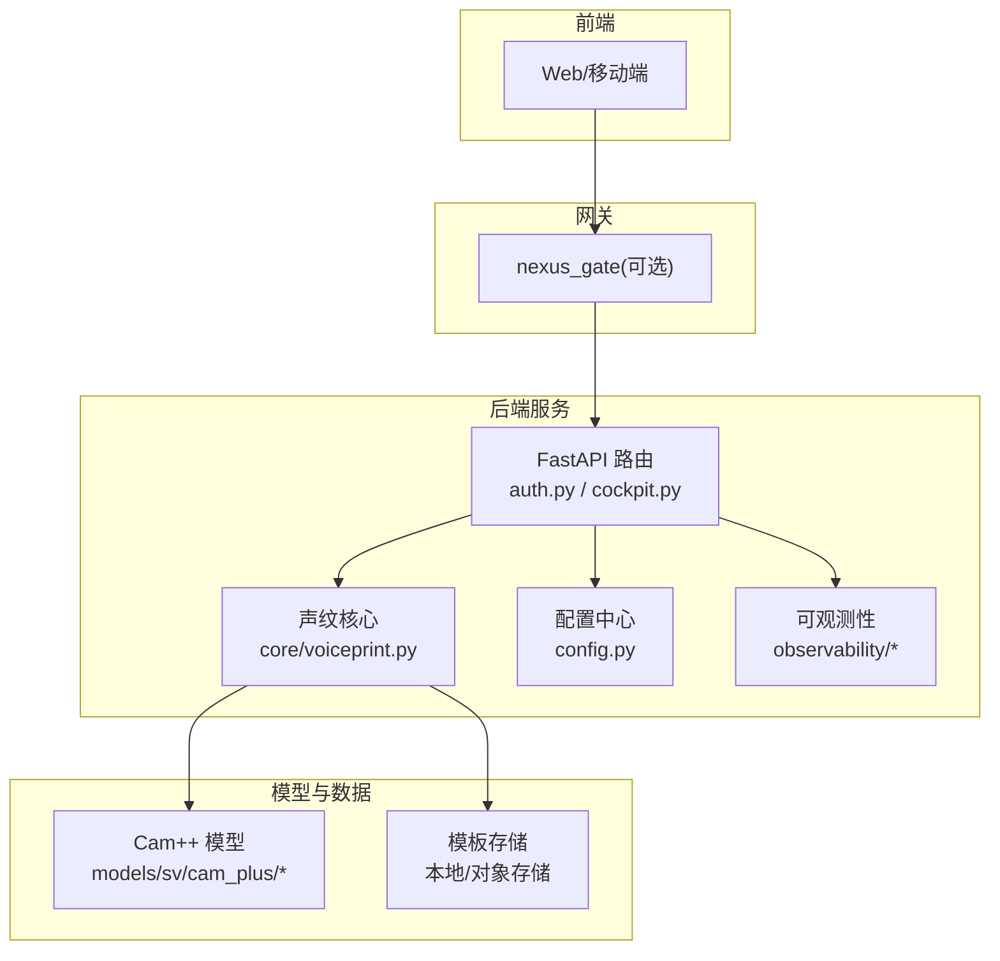
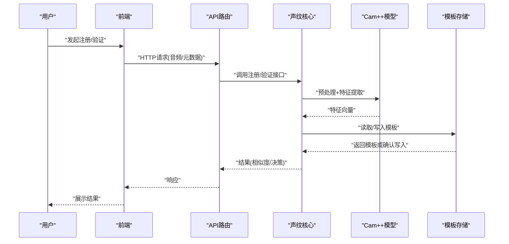
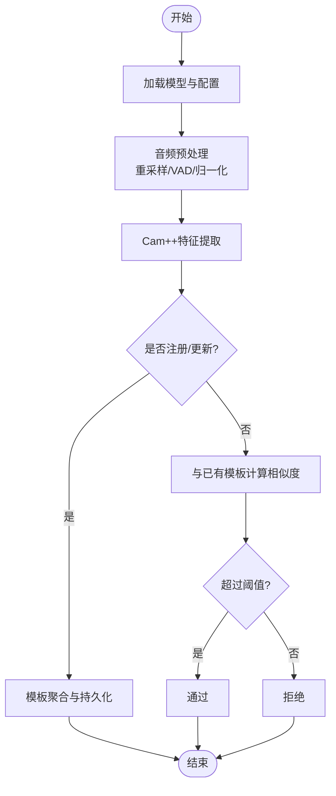
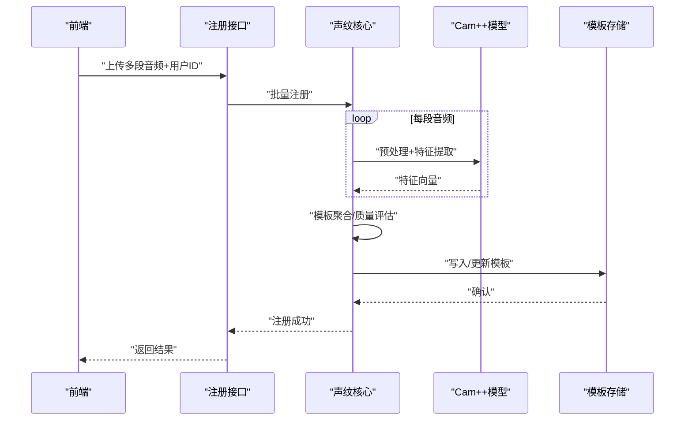
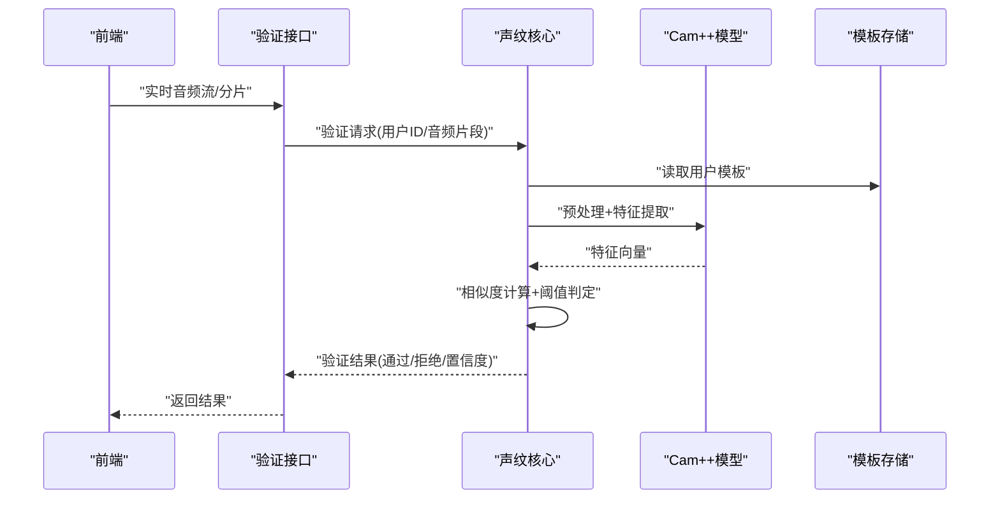
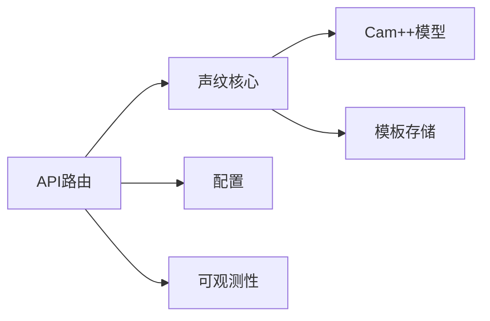

# 声纹识别系统

<cite>
**本文引用的文件**   
- [voiceprint-guide.md](file://docs/voice/voiceprint-guide.md)
- [voiceprint.py](file://backend_design/nexus/core/voiceprint.py)
- [auth.py](file://backend_design/nexus/api/routes/auth.py)
- [cockpit.py](file://backend_design/nexus/api/routes/cockpit.py)
- [schemas.py](file://backend_design/nexus/models/schemas.py)
- [config.py](file://backend_design/nexus/config.py)
- [README.md](file://models/sv/cam_plus/README.md)
- [configuration.json](file://models/sv/cam_plus/configuration.json)
- [audio-pipeline-guide.md](file://docs/voice/audio-pipeline-guide.md)
- [asr-guide.md](file://docs/voice/asr-guide.md)
- [tts-guide.md](file://docs/voice/tts-guide.md)
- [L7-observability.md](file://docs/architecture/L7-observability.md)
- [cockpit_metrics.py](file://backend_design/nexus/observability/cockpit_metrics.py)
- [metrics.py](file://backend_design/nexus/observability/metrics.py)
- [SETUP.md](file://docs/deployment/SETUP.md)
- [docker-compose.yml](file://docker-compose.yml)
</cite>

## 目录
1. [简介](#简介)
2. [项目结构](#项目结构)
3. [核心组件](#核心组件)
4. [架构总览](#架构总览)
5. [详细组件分析](#详细组件分析)
6. [依赖关系分析](#依赖关系分析)
7. [性能与评估](#性能与评估)
8. [部署与运维](#部署与运维)
9. [故障排查指南](#故障排查指南)
10. [结论](#结论)

## 简介
本技术文档面向NexusCockpit的声纹识别子系统，围绕Cam++算法在系统中的落地实现进行系统化说明。内容覆盖用户注册（音频采集、特征提取、模板建立）、实时验证（流式处理、特征匹配、相似度计算）、模板存储与安全策略、用户管理API、性能指标与评测方法、噪声与多人对话优化、隐私保护机制以及部署监控与故障恢复方案。文档力求兼顾工程实践与可维护性，帮助读者快速理解并正确使用该系统。

## 项目结构
声纹识别相关代码与配置主要分布在以下位置：
- 后端核心逻辑：backend_design/nexus/core/voiceprint.py
- API路由与模型定义：backend_design/nexus/api/routes/{auth, cockpit}.py、backend_design/nexus/models/schemas.py
- 配置与环境：backend_design/nexus/config.py、docker-compose.yml
- 模型与示例：models/sv/cam_plus/README.md、models/sv/cam_plus/configuration.json
- 语音管线与使用指南：docs/voice/{voiceprint,audio-pipeline,asr,tts}-guide.md
- 可观测性与监控：backend_design/nexus/observability/{cockpit_metrics,metrics}.py、docs/architecture/L7-observability.md
- 部署说明：docs/deployment/SETUP.md

图表来源
- [voiceprint.py](file://backend_design/nexus/core/voiceprint.py)
- [auth.py](file://backend_design/nexus/api/routes/auth.py)
- [cockpit.py](file://backend_design/nexus/api/routes/cockpit.py)
- [config.py](file://backend_design/nexus/config.py)
- [README.md](file://models/sv/cam_plus/README.md)
- [configuration.json](file://models/sv/cam_plus/configuration.json)

章节来源
- [voiceprint-guide.md](file://docs/voice/voiceprint-guide.md)
- [audio-pipeline-guide.md](file://docs/voice/audio-pipeline-guide.md)
- [asr-guide.md](file://docs/voice/asr-guide.md)
- [tts-guide.md](file://docs/voice/tts-guide.md)

## 核心组件
- 声纹核心模块（core/voiceprint.py）
  - 负责加载Cam++模型、预处理输入音频、提取固定维度特征向量、模板聚合与更新、相似度计算与阈值判定。
  - 提供注册/更新/验证等关键能力，并与存储层交互完成模板持久化。
- API路由层（api/routes/auth.py、api/routes/cockpit.py）
  - 暴露用户注册、模板更新、删除、验证等HTTP接口；校验请求参数、鉴权、限流与审计日志。
- 模型与配置（models/sv/cam_plus/*、config.py）
  - Cam++模型权重与推理配置；全局开关、阈值、采样率、通道数、设备选择等。
- 可观测性（observability/*）
  - 埋点指标（注册/验证耗时、成功率、错误码分布）、日志与告警对接。

章节来源
- [voiceprint.py](file://backend_design/nexus/core/voiceprint.py)
- [auth.py](file://backend_design/nexus/api/routes/auth.py)
- [cockpit.py](file://backend_design/nexus/api/routes/cockpit.py)
- [config.py](file://backend_design/nexus/config.py)
- [README.md](file://models/sv/cam_plus/README.md)
- [configuration.json](file://models/sv/cam_plus/configuration.json)

## 架构总览
整体采用“前端/网关 → 后端API → 声纹核心 → 模型与存储”的分层架构。API层负责协议与业务编排，核心层封装算法与I/O，模型层提供Cam++推理能力，存储层负责模板安全持久化。可观测性贯穿全链路，便于定位问题与容量规划。

图表来源
- [auth.py](file://backend_design/nexus/api/routes/auth.py)
- [cockpit.py](file://backend_design/nexus/api/routes/cockpit.py)
- [voiceprint.py](file://backend_design/nexus/core/voiceprint.py)
- [README.md](file://models/sv/cam_plus/README.md)

## 详细组件分析

### Cam++ 声纹识别算法与流程
- 模型与配置
  - 模型路径、输入采样率、声道数、归一化方式、输出维度等由配置文件集中管理，便于多环境切换与灰度发布。
- 预处理
  - 重采样至目标采样率、静音检测与VAD裁剪、分帧加窗、能量/频谱归一化，提升鲁棒性。
- 特征提取
  - 通过Cam++编码器将音频片段映射为固定维度的说话人嵌入（embedding），支持短时片段与长时聚合。
- 模板建立与更新
  - 注册阶段：对多段音频分别提取特征，按时间窗口或质量评分进行融合（如指数移动平均/加权平均），形成稳健模板。
  - 更新策略：基于新样本的质量与置信度动态调整模板权重，避免退化。
- 相似度计算与判定
  - 常用余弦相似度或内积度量；结合动态阈值（按环境噪声、说话时长自适应）做接受/拒绝决策。

图表来源
- [voiceprint.py](file://backend_design/nexus/core/voiceprint.py)
- [README.md](file://models/sv/cam_plus/README.md)
- [configuration.json](file://models/sv/cam_plus/configuration.json)

章节来源
- [voiceprint-guide.md](file://docs/voice/voiceprint-guide.md)
- [voiceprint.py](file://backend_design/nexus/core/voiceprint.py)
- [README.md](file://models/sv/cam_plus/README.md)
- [configuration.json](file://models/sv/cam_plus/configuration.json)

### 用户注册流程（音频采集→特征提取→模板建立）
- 前端采集
  - 建议录制多段高质量语音（不同语句、不同情绪），控制录音时长与信噪比，减少背景干扰。
- 服务端处理
  - 接收音频与用户标识，执行预处理与特征提取；若首次注册则初始化模板，否则合并新特征到现有模板。
- 模板持久化
  - 模板以二进制或序列化格式落盘，附带版本、创建/更新时间戳、质量统计与哈希校验值，确保完整性与可追溯。

图表来源
- [auth.py](file://backend_design/nexus/api/routes/auth.py)
- [cockpit.py](file://backend_design/nexus/api/routes/cockpit.py)
- [voiceprint.py](file://backend_design/nexus/core/voiceprint.py)

章节来源
- [voiceprint-guide.md](file://docs/voice/voiceprint-guide.md)
- [auth.py](file://backend_design/nexus/api/routes/auth.py)
- [cockpit.py](file://backend_design/nexus/api/routes/cockpit.py)
- [voiceprint.py](file://backend_design/nexus/core/voiceprint.py)

### 声纹验证工作机制（实时处理→特征匹配→相似度计算）
- 实时音频处理
  - 支持流式或分段接收；逐段预处理、短窗特征提取，滑动窗口聚合以提升稳定性。
- 特征匹配
  - 将当前会话特征与用户模板进行相似度计算；根据阈值与上下文（历史多次结果）做最终决策。
- 阈值策略
  - 静态阈值为基础，结合环境噪声估计、说话时长、信噪比等动态调整，降低误识/拒识。

图表来源
- [auth.py](file://backend_design/nexus/api/routes/auth.py)
- [cockpit.py](file://backend_design/nexus/api/routes/cockpit.py)
- [voiceprint.py](file://backend_design/nexus/core/voiceprint.py)

章节来源
- [voiceprint-guide.md](file://docs/voice/voiceprint-guide.md)
- [auth.py](file://backend_design/nexus/api/routes/auth.py)
- [cockpit.py](file://backend_design/nexus/api/routes/cockpit.py)
- [voiceprint.py](file://backend_design/nexus/core/voiceprint.py)

### 模板存储格式、更新策略与安全保护
- 存储格式
  - 包含：版本号、创建/更新时间、特征模板、质量统计（均值/方差/样本数）、来源音频摘要、完整性校验（哈希）。
- 更新策略
  - 增量融合：对新样本按质量评分加权融合；低质量样本降权或丢弃；定期回滚到稳定版本。
- 安全保护
  - 传输加密（TLS）、存储加密（磁盘/对象存储KMS）、访问控制（最小权限）、审计日志与脱敏。

章节来源
- [voiceprint.py](file://backend_design/nexus/core/voiceprint.py)
- [config.py](file://backend_design/nexus/config.py)

### 用户管理API接口说明
- 新用户注册
  - 功能：上传多段音频，建立初始模板。
  - 输入：用户标识、音频片段列表、可选元数据（语言、性别、年龄等）。
  - 输出：注册结果、模板版本、质量评分。
- 声纹模板更新
  - 功能：增量更新模板，提升鲁棒性。
  - 输入：用户标识、新增音频片段、更新策略参数。
  - 输出：更新结果、新版本号、质量变化。
- 用户删除
  - 功能：删除用户模板及相关元数据。
  - 输入：用户标识、操作者身份与授权。
  - 输出：删除结果、审计记录。

章节来源
- [auth.py](file://backend_design/nexus/api/routes/auth.py)
- [cockpit.py](file://backend_design/nexus/api/routes/cockpit.py)
- [schemas.py](file://backend_design/nexus/models/schemas.py)

### 性能指标与评估方法
- 指标定义
  - 准确率（Accuracy）、误识率（FAR）、拒识率（FRR）、等错误率（EER）、AUC-ROC。
- 评估流程
  - 构建测试集（跨场景、跨噪声、跨设备）；设定阈值网格；计算混淆矩阵与曲线；选取最优阈值。
- 线上监控
  - 埋点注册/验证耗时、成功率、错误码分布；异常阈值告警；回归测试对比。

章节来源
- [voiceprint-guide.md](file://docs/voice/voiceprint-guide.md)
- [cockpit_metrics.py](file://backend_design/nexus/observability/cockpit_metrics.py)
- [metrics.py](file://backend_design/nexus/observability/metrics.py)
- [L7-observability.md](file://docs/architecture/L7-observability.md)

### 噪声环境与多人对话优化
- 噪声优化
  - VAD与降噪前置；频域滤波；多麦克风阵列波束成形；在线噪声估计与自适应阈值。
- 多人对话
  - 说话人分离（Diarization）；注意力聚焦目标说话人；短时片段级验证与投票融合。
- 鲁棒性增强
  - 数据增强（加噪、混响、速度扰动）；对抗训练；多条件模板融合。

章节来源
- [audio-pipeline-guide.md](file://docs/voice/audio-pipeline-guide.md)
- [voiceprint-guide.md](file://docs/voice/voiceprint-guide.md)

### 隐私保护机制
- 数据最小化：仅保留必要元数据与模板，不保存原始音频（或短期缓存后自动清理）。
- 加密与隔离：传输TLS、存储加密、租户/用户级隔离。
- 合规与审计：访问审计、数据留存策略、用户同意与撤回机制。

章节来源
- [voiceprint.py](file://backend_design/nexus/core/voiceprint.py)
- [config.py](file://backend_design/nexus/config.py)

## 依赖关系分析
- 模块耦合
  - API路由依赖声纹核心；声纹核心依赖模型与存储；可观测性独立插桩。
- 外部依赖
  - Cam++模型库、音频编解码库、存储SDK、监控/日志组件。
- 潜在风险
  - 模型加载阻塞、大音频内存占用、模板并发写冲突。

图表来源
- [auth.py](file://backend_design/nexus/api/routes/auth.py)
- [cockpit.py](file://backend_design/nexus/api/routes/cockpit.py)
- [voiceprint.py](file://backend_design/nexus/core/voiceprint.py)
- [config.py](file://backend_design/nexus/config.py)
- [cockpit_metrics.py](file://backend_design/nexus/observability/cockpit_metrics.py)

章节来源
- [auth.py](file://backend_design/nexus/api/routes/auth.py)
- [cockpit.py](file://backend_design/nexus/api/routes/cockpit.py)
- [voiceprint.py](file://backend_design/nexus/core/voiceprint.py)
- [config.py](file://backend_design/nexus/config.py)

## 性能与评估
- 吞吐与延迟
  - 批处理与流式并行；GPU/CPU设备选择；预取与缓存策略。
- 资源利用
  - 内存峰值控制、模型量化/剪枝（按需）、线程池与连接池调优。
- 评估基准
  - 离线评测集与在线A/B实验；指标看板与回归门禁。

[本节为通用指导，无需特定文件引用]

## 部署与运维
- 部署配置
  - 环境变量与配置文件：模型路径、阈值、采样率、设备、存储端点、监控接入。
  - 容器编排：docker-compose.yml中声明服务、端口、卷挂载与依赖。
- 监控告警
  - 指标上报Prometheus/Grafana；关键错误与超时告警；健康检查探针。
- 故障恢复
  - 模型热更新与回滚；模板备份与快照；幂等接口与重试策略；降级模式（关闭声纹、仅凭其他认证）。

章节来源
- [SETUP.md](file://docs/deployment/SETUP.md)
- [docker-compose.yml](file://docker-compose.yml)
- [config.py](file://backend_design/nexus/config.py)
- [L7-observability.md](file://docs/architecture/L7-observability.md)

## 故障排查指南
- 常见问题
  - 模型加载失败：检查路径、权限、依赖版本。
  - 音频格式不支持：确认采样率、声道数、编码格式。
  - 阈值不当导致高拒识/误识：调整阈值与质量门限。
  - 模板损坏：校验哈希、从备份恢复。
- 诊断步骤
  - 查看日志与指标；复现最小用例；对比正常/异常样本；逐步禁用组件定位。

章节来源
- [voiceprint-guide.md](file://docs/voice/voiceprint-guide.md)
- [cockpit_metrics.py](file://backend_design/nexus/observability/cockpit_metrics.py)
- [metrics.py](file://backend_design/nexus/observability/metrics.py)

## 结论
本系统以Cam++为核心，结合稳健的预处理、模板管理与可观测性体系，实现了端到端的声纹识别能力。通过合理的阈值策略、噪声与多人对话优化、严格的隐私保护与完善的部署运维方案，可在复杂环境中提供高可用、可扩展的个性化体验。后续可引入更多鲁棒性技术与自动化评测流水线，持续提升准确率与稳定性。