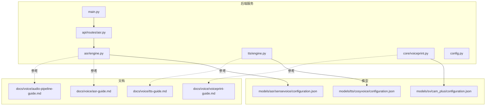
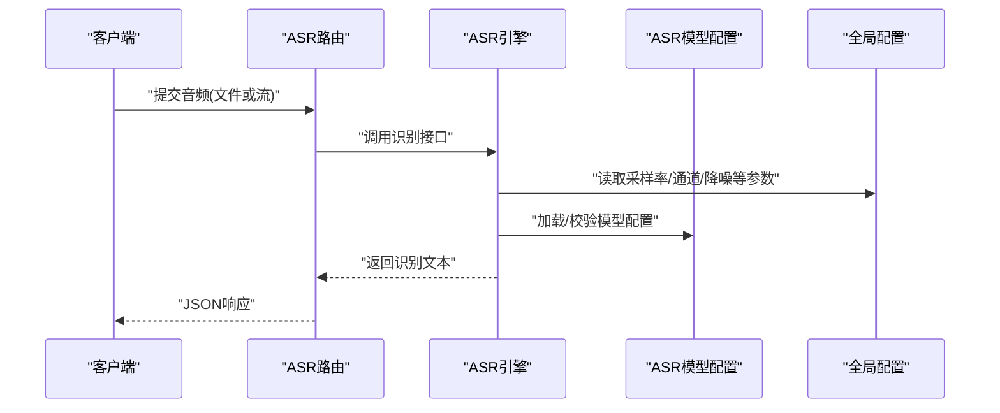
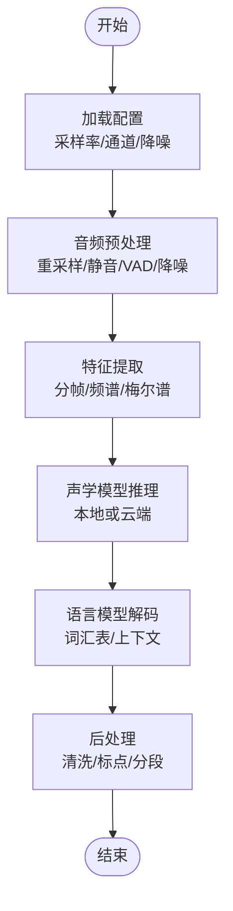
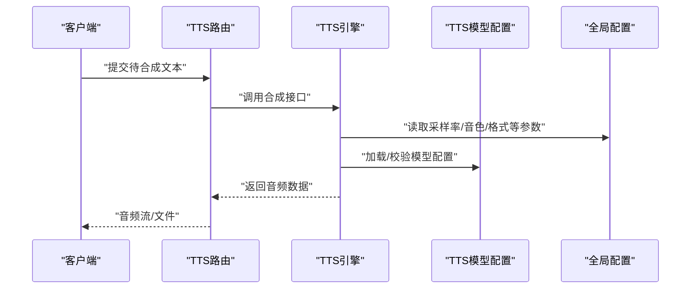
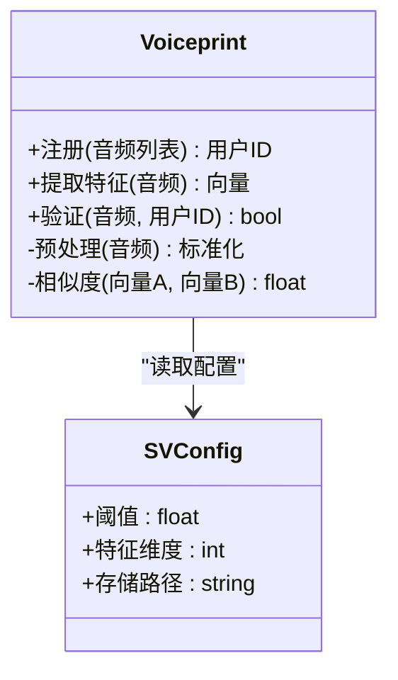
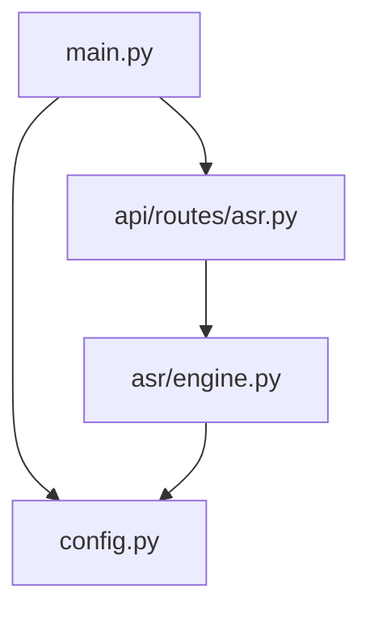
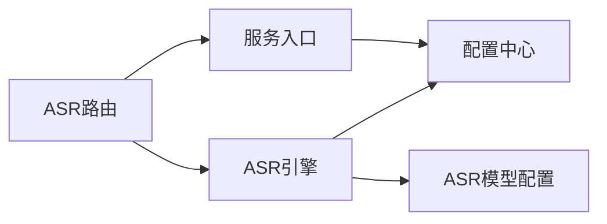

# 语音处理系统

<cite>
**本文引用的文件**   
- [backend_design/nexus/asr/engine.py](file://backend_design/nexus/asr/engine.py)
- [backend_design/nexus/tts/engine.py](file://backend_design/nexus/tts/engine.py)
- [backend_design/nexus/core/voiceprint.py](file://backend_design/nexus/core/voiceprint.py)
- [backend_design/nexus/api/routes/asr.py](file://backend_design/nexus/api/routes/asr.py)
- [backend_design/nexus/config.py](file://backend_design/nexus/config.py)
- [backend_design/nexus/main.py](file://backend_design/nexus/main.py)
- [models/asr/sensevoice/configuration.json](file://models/asr/sensevoice/configuration.json)
- [models/tts/cosyvoice/configuration.json](file://models/tts/cosyvoice/configuration.json)
- [models/sv/cam_plus/configuration.json](file://models/sv/cam_plus/configuration.json)
- [docs/voice/asr-guide.md](file://docs/voice/asr-guide.md)
- [docs/voice/tts-guide.md](file://docs/voice/tts-guide.md)
- [docs/voice/voiceprint-guide.md](file://docs/voice/voiceprint-guide.md)
- [docs/voice/audio-pipeline-guide.md](file://docs/voice/audio-pipeline-guide.md)
</cite>

## 目录
1. [简介](#简介)
2. [项目结构](#项目结构)
3. [核心组件](#核心组件)
4. [架构总览](#架构总览)
5. [详细组件分析](#详细组件分析)
6. [依赖关系分析](#依赖关系分析)
7. [性能考虑](#性能考虑)
8. [故障排查指南](#故障排查指南)
9. [结论](#结论)
10. [附录](#附录)

## 简介
本技术文档面向NexusCockpit的语音处理子系统，覆盖以下关键能力：
- ASR（自动语音识别）引擎：音频预处理、特征提取、声学模型推理与语言模型解码的完整流水线。
- TTS（文本转语音）系统：从文本分析到语音生成的端到端流程。
- 声纹识别（SV）：用户注册、特征提取与身份验证过程。
- 音频格式支持、采样率配置、噪声抑制等关键技术参数。
- 语音模型的部署与配置：本地模型加载与云端API调用的切换机制。
- 性能优化技巧与常见问题排查方法。

## 项目结构
与语音处理相关的后端代码主要位于 backend_design/nexus 目录下，包含ASR、TTS、声纹识别以及对应的API路由与配置；模型文件位于 models 目录；使用指南位于 docs/voice 目录。

图表来源
- [backend_design/nexus/asr/engine.py](file://backend_design/nexus/asr/engine.py)
- [backend_design/nexus/tts/engine.py](file://backend_design/nexus/tts/engine.py)
- [backend_design/nexus/core/voiceprint.py](file://backend_design/nexus/core/voiceprint.py)
- [backend_design/nexus/api/routes/asr.py](file://backend_design/nexus/api/routes/asr.py)
- [backend_design/nexus/config.py](file://backend_design/nexus/config.py)
- [backend_design/nexus/main.py](file://backend_design/nexus/main.py)
- [models/asr/sensevoice/configuration.json](file://models/asr/sensevoice/configuration.json)
- [models/tts/cosyvoice/configuration.json](file://models/tts/cosyvoice/configuration.json)
- [models/sv/cam_plus/configuration.json](file://models/sv/cam_plus/configuration.json)
- [docs/voice/asr-guide.md](file://docs/voice/asr-guide.md)
- [docs/voice/tts-guide.md](file://docs/voice/tts-guide.md)
- [docs/voice/voiceprint-guide.md](file://docs/voice/voiceprint-guide.md)
- [docs/voice/audio-pipeline-guide.md](file://docs/voice/audio-pipeline-guide.md)

章节来源
- [backend_design/nexus/asr/engine.py](file://backend_design/nexus/asr/engine.py)
- [backend_design/nexus/tts/engine.py](file://backend_design/nexus/tts/engine.py)
- [backend_design/nexus/core/voiceprint.py](file://backend_design/nexus/core/voiceprint.py)
- [backend_design/nexus/api/routes/asr.py](file://backend_design/nexus/api/routes/asr.py)
- [backend_design/nexus/config.py](file://backend_design/nexus/config.py)
- [backend_design/nexus/main.py](file://backend_design/nexus/main.py)
- [models/asr/sensevoice/configuration.json](file://models/asr/sensevoice/configuration.json)
- [models/tts/cosyvoice/configuration.json](file://models/tts/cosyvoice/configuration.json)
- [models/sv/cam_plus/configuration.json](file://models/sv/cam_plus/configuration.json)
- [docs/voice/asr-guide.md](file://docs/voice/asr-guide.md)
- [docs/voice/tts-guide.md](file://docs/voice/tts-guide.md)
- [docs/voice/voiceprint-guide.md](file://docs/voice/voiceprint-guide.md)
- [docs/voice/audio-pipeline-guide.md](file://docs/voice/audio-pipeline-guide.md)

## 核心组件
- ASR引擎：负责接收音频流或文件，执行降噪、重采样、分帧、特征提取、声学模型推理与解码，输出文本结果。
- TTS引擎：接收文本输入，进行文本规范化、韵律预测、声学建模与声码器合成，输出可播放音频。
- 声纹识别：提供用户注册（采集并存储声纹特征）、在线识别（比对当前说话人特征与已注册模板）。
- API层：暴露REST/WebSocket接口，统一接入前端与外部系统。
- 配置中心：集中管理模型路径、采样率、通道数、降噪开关、云端/本地模式切换等参数。

章节来源
- [backend_design/nexus/asr/engine.py](file://backend_design/nexus/asr/engine.py)
- [backend_design/nexus/tts/engine.py](file://backend_design/nexus/tts/engine.py)
- [backend_design/nexus/core/voiceprint.py](file://backend_design/nexus/core/voiceprint.py)
- [backend_design/nexus/api/routes/asr.py](file://backend_design/nexus/api/routes/asr.py)
- [backend_design/nexus/config.py](file://backend_design/nexus/config.py)

## 架构总览
整体采用“API网关 + 业务模块 + 模型/配置”的分层架构。请求进入后由路由分发至对应引擎，引擎根据配置选择本地模型或云端API，完成处理后返回结构化结果。

图表来源
- [backend_design/nexus/api/routes/asr.py](file://backend_design/nexus/api/routes/asr.py)
- [backend_design/nexus/asr/engine.py](file://backend_design/nexus/asr/engine.py)
- [backend_design/nexus/config.py](file://backend_design/nexus/config.py)
- [models/asr/sensevoice/configuration.json](file://models/asr/sensevoice/configuration.json)

## 详细组件分析

### ASR语音识别引擎
- 功能要点
  - 音频预处理：格式校验、重采样、静音检测、VAD（可选）、降噪增强。
  - 特征提取：将波形转换为适合声学模型的表示（如频谱/梅尔谱），按帧切分。
  - 声学模型推理：基于SenseVoice等本地模型或云端API进行音素/子词概率计算。
  - 语言模型解码：结合词汇表与上下文约束生成最终文本。
- 关键流程
  - 输入校验与参数解析
  - 预处理与特征提取
  - 模型推理与解码
  - 结果后处理与格式化
- 配置项
  - 采样率、声道数、帧长、窗口步长、降噪强度、是否启用云端回退等。

图表来源
- [backend_design/nexus/asr/engine.py](file://backend_design/nexus/asr/engine.py)
- [models/asr/sensevoice/configuration.json](file://models/asr/sensevoice/configuration.json)
- [docs/voice/asr-guide.md](file://docs/voice/asr-guide.md)
- [docs/voice/audio-pipeline-guide.md](file://docs/voice/audio-pipeline-guide.md)

章节来源
- [backend_design/nexus/asr/engine.py](file://backend_design/nexus/asr/engine.py)
- [models/asr/sensevoice/configuration.json](file://models/asr/sensevoice/configuration.json)
- [docs/voice/asr-guide.md](file://docs/voice/asr-guide.md)
- [docs/voice/audio-pipeline-guide.md](file://docs/voice/audio-pipeline-guide.md)

### TTS语音合成系统
- 功能要点
  - 文本分析：分词、拼音/音素转换、韵律与停顿预测。
  - 声学建模：根据文本生成中间声学表征。
  - 声码器合成：将声学表征转换为波形。
- 关键流程
  - 文本规范化与标注
  - 声学特征生成
  - 波形合成与后处理
- 配置项
  - 音色、语速、音量、采样率、输出格式、是否启用云端回退等。

图表来源
- [backend_design/nexus/tts/engine.py](file://backend_design/nexus/tts/engine.py)
- [models/tts/cosyvoice/configuration.json](file://models/tts/cosyvoice/configuration.json)
- [docs/voice/tts-guide.md](file://docs/voice/tts-guide.md)

章节来源
- [backend_design/nexus/tts/engine.py](file://backend_design/nexus/tts/engine.py)
- [models/tts/cosyvoice/configuration.json](file://models/tts/cosyvoice/configuration.json)
- [docs/voice/tts-guide.md](file://docs/voice/tts-guide.md)

### 声纹识别（SV）
- 功能要点
  - 用户注册：采集多段语音，提取稳定特征并持久化。
  - 特征提取：对输入语音进行归一化与特征编码。
  - 身份验证：计算相似度阈值判定是否为同一用户。
- 关键流程
  - 注册：采集→预处理→特征提取→存储
  - 验证：采集→预处理→特征提取→比对→决策
- 配置项
  - 阈值、特征维度、匹配策略、存储位置等。

图表来源
- [backend_design/nexus/core/voiceprint.py](file://backend_design/nexus/core/voiceprint.py)
- [models/sv/cam_plus/configuration.json](file://models/sv/cam_plus/configuration.json)
- [docs/voice/voiceprint-guide.md](file://docs/voice/voiceprint-guide.md)

章节来源
- [backend_design/nexus/core/voiceprint.py](file://backend_design/nexus/core/voiceprint.py)
- [models/sv/cam_plus/configuration.json](file://models/sv/cam_plus/configuration.json)
- [docs/voice/voiceprint-guide.md](file://docs/voice/voiceprint-guide.md)

### API与集成点
- ASR路由：提供音频上传与识别结果的HTTP接口，支持流式与批量场景。
- 主入口：服务启动、路由挂载、中间件初始化、健康检查等。
- 配置中心：集中管理ASR/TTS/SV相关参数，支持本地/云端模式切换。

图表来源
- [backend_design/nexus/main.py](file://backend_design/nexus/main.py)
- [backend_design/nexus/api/routes/asr.py](file://backend_design/nexus/api/routes/asr.py)
- [backend_design/nexus/asr/engine.py](file://backend_design/nexus/asr/engine.py)
- [backend_design/nexus/config.py](file://backend_design/nexus/config.py)

章节来源
- [backend_design/nexus/main.py](file://backend_design/nexus/main.py)
- [backend_design/nexus/api/routes/asr.py](file://backend_design/nexus/api/routes/asr.py)
- [backend_design/nexus/asr/engine.py](file://backend_design/nexus/asr/engine.py)
- [backend_design/nexus/config.py](file://backend_design/nexus/config.py)

## 依赖关系分析
- 模块耦合
  - API层仅依赖引擎接口，不直接操作模型，降低耦合度。
  - 引擎通过配置中心获取参数，避免硬编码。
  - 模型配置文件独立存放，便于替换与升级。
- 外部依赖
  - 本地模型：SenseVoice（ASR）、CosyVoice（TTS）、Cam++（SV）。
  - 云端API：可按配置切换，实现降级与弹性扩展。

图表来源
- [backend_design/nexus/api/routes/asr.py](file://backend_design/nexus/api/routes/asr.py)
- [backend_design/nexus/asr/engine.py](file://backend_design/nexus/asr/engine.py)
- [backend_design/nexus/config.py](file://backend_design/nexus/config.py)
- [models/asr/sensevoice/configuration.json](file://models/asr/sensevoice/configuration.json)

章节来源
- [backend_design/nexus/api/routes/asr.py](file://backend_design/nexus/api/routes/asr.py)
- [backend_design/nexus/asr/engine.py](file://backend_design/nexus/asr/engine.py)
- [backend_design/nexus/config.py](file://backend_design/nexus/config.py)
- [models/asr/sensevoice/configuration.json](file://models/asr/sensevoice/configuration.json)

## 性能考虑
- 音频预处理
  - 合理设置采样率与通道数以平衡质量与算力。
  - 使用VAD与静音裁剪减少无效片段。
  - 轻量级降噪在低延迟场景下需谨慎权衡。
- 模型推理
  - 优先本地模型以降低网络开销；高并发时开启批处理与缓存。
  - 针对云端API实现熔断与回退，保障稳定性。
- 资源管理
  - 控制内存占用，及时释放临时缓冲区。
  - 使用异步I/O提升吞吐。
- 监控与度量
  - 记录端到端耗时、错误率与资源利用率，定位瓶颈。

[本节为通用指导，无需特定文件引用]

## 故障排查指南
- 常见症状
  - 识别失败：检查音频格式、采样率、通道数是否符合要求。
  - 延迟过高：评估是否启用云端回退、是否存在阻塞I/O。
  - 音质问题：调整降噪强度与重采样参数。
- 排查步骤
  - 确认配置中心参数是否正确加载。
  - 查看日志中模型加载与推理阶段报错。
  - 使用最小样本复现问题，逐步缩小范围。
- 恢复策略
  - 切换到备用模型或云端API。
  - 重启服务以清理异常状态。
  - 更新模型配置与依赖版本。

章节来源
- [backend_design/nexus/asr/engine.py](file://backend_design/nexus/asr/engine.py)
- [backend_design/nexus/config.py](file://backend_design/nexus/config.py)
- [docs/voice/asr-guide.md](file://docs/voice/asr-guide.md)

## 结论
NexusCockpit的语音处理系统通过清晰的模块化设计与灵活的配置机制，实现了ASR、TTS与声纹识别的端到端能力。借助本地模型与云端API的切换策略，系统在性能与可用性之间取得良好平衡。建议在生产环境完善监控告警与压测体系，持续优化关键路径的性能与稳定性。

[本节为总结性内容，无需特定文件引用]

## 附录
- 音频格式与参数建议
  - 采样率：根据需求选择8k/16k/44.1k等。
  - 声道：单声道更利于识别与传输。
  - 编码：优先无损或高质量有损格式。
- 模型部署
  - 本地模型：确保模型路径与配置文件一致。
  - 云端API：配置鉴权与超时，实现重试与回退。
- 参考文档
  - ASR指南、TTS指南、声纹指南与音频流水线说明。

章节来源
- [docs/voice/asr-guide.md](file://docs/voice/asr-guide.md)
- [docs/voice/tts-guide.md](file://docs/voice/tts-guide.md)
- [docs/voice/voiceprint-guide.md](file://docs/voice/voiceprint-guide.md)
- [docs/voice/audio-pipeline-guide.md](file://docs/voice/audio-pipeline-guide.md)