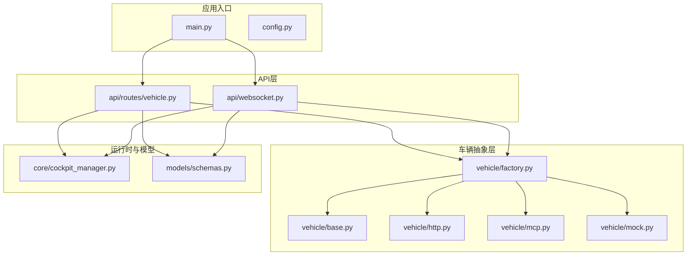
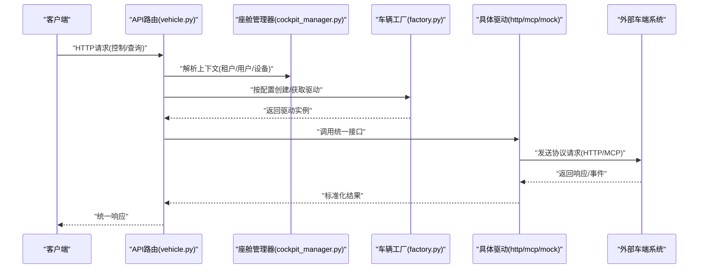
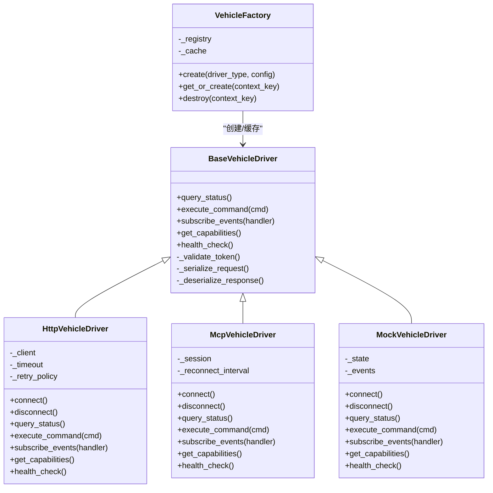
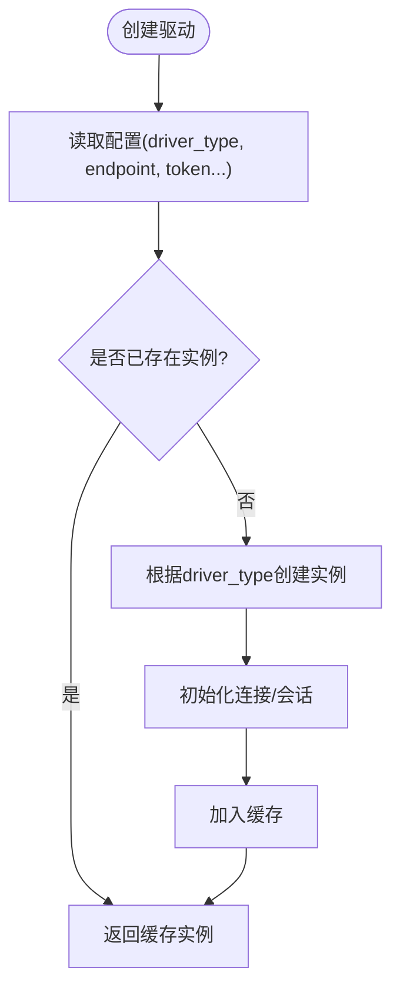
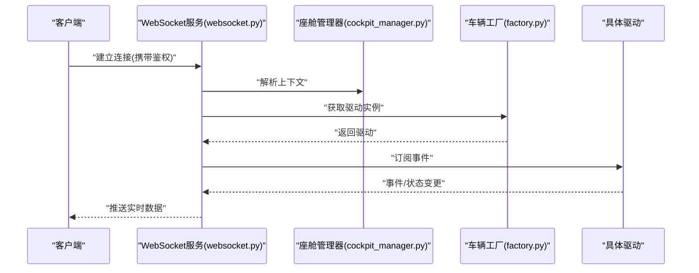
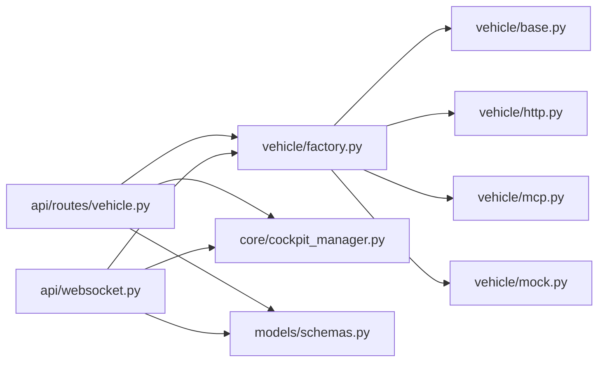

# 车辆控制系统

<cite>
**本文引用的文件**   
- [backend_design/nexus/vehicle/base.py](file://backend_design/nexus/vehicle/base.py)
- [backend_design/nexus/vehicle/factory.py](file://backend_design/nexus/vehicle/factory.py)
- [backend_design/nexus/vehicle/http.py](file://backend_design/nexus/vehicle/http.py)
- [backend_design/nexus/vehicle/mcp.py](file://backend_design/nexus/vehicle/mcp.py)
- [backend_design/nexus/vehicle/mock.py](file://backend_design/nexus/vehicle/mock.py)
- [backend_design/nexus/api/routes/vehicle.py](file://backend_design/nexus/api/routes/vehicle.py)
- [backend_design/nexus/api/websocket.py](file://backend_design/nexus/api/websocket.py)
- [backend_design/nexus/core/cockpit_manager.py](file://backend_design/nexus/core/cockpit_manager.py)
- [backend_design/nexus/models/schemas.py](file://backend_design/nexus/models/schemas.py)
- [backend_design/nexus/config.py](file://backend_design/nexus/config.py)
- [backend_design/nexus/main.py](file://backend_design/nexus/main.py)
</cite>

## 目录
1. [简介](#简介)
2. [项目结构](#项目结构)
3. [核心组件](#核心组件)
4. [架构总览](#架构总览)
5. [详细组件分析](#详细组件分析)
6. [依赖关系分析](#依赖关系分析)
7. [性能考虑](#性能考虑)
8. [故障诊断指南](#故障诊断指南)
9. [结论](#结论)
10. [附录](#附录)

## 简介
本设计文档面向NexusCockpit的车辆控制系统，聚焦于“车辆控制抽象层”的设计与实现。目标包括：
- 通过统一接口封装不同车辆制造商的API差异（HTTP、MCP等）
- 基于工厂模式根据配置动态选择具体驱动
- 提供Mock驱动用于开发与测试
- 建立实时状态同步机制（WebSocket）
- 明确安全验证与权限控制策略
- 给出常见车辆接口的适配示例与故障诊断方法

## 项目结构
与车辆控制相关的核心代码位于后端Python服务中，主要模块如下：
- 抽象层与驱动实现：base、http、mcp、mock、factory
- API路由：vehicle（REST）、websocket（WS）
- 运行时管理：cockpit_manager（会话/上下文）
- 数据模型：schemas（请求/响应结构）
- 配置与入口：config、main

图表来源
- [backend_design/nexus/main.py](file://backend_design/nexus/main.py)
- [backend_design/nexus/config.py](file://backend_design/nexus/config.py)
- [backend_design/nexus/api/routes/vehicle.py](file://backend_design/nexus/api/routes/vehicle.py)
- [backend_design/nexus/api/websocket.py](file://backend_design/nexus/api/websocket.py)
- [backend_design/nexus/vehicle/base.py](file://backend_design/nexus/vehicle/base.py)
- [backend_design/nexus/vehicle/factory.py](file://backend_design/nexus/vehicle/factory.py)
- [backend_design/nexus/vehicle/http.py](file://backend_design/nexus/vehicle/http.py)
- [backend_design/nexus/vehicle/mcp.py](file://backend_design/nexus/vehicle/mcp.py)
- [backend_design/nexus/vehicle/mock.py](file://backend_design/nexus/vehicle/mock.py)
- [backend_design/nexus/core/cockpit_manager.py](file://backend_design/nexus/core/cockpit_manager.py)
- [backend_design/nexus/models/schemas.py](file://backend_design/nexus/models/schemas.py)

章节来源
- [backend_design/nexus/main.py](file://backend_design/nexus/main.py)
- [backend_design/nexus/config.py](file://backend_design/nexus/config.py)
- [backend_design/nexus/api/routes/vehicle.py](file://backend_design/nexus/api/routes/vehicle.py)
- [backend_design/nexus/api/websocket.py](file://backend_design/nexus/api/websocket.py)
- [backend_design/nexus/vehicle/base.py](file://backend_design/nexus/vehicle/base.py)
- [backend_design/nexus/vehicle/factory.py](file://backend_design/nexus/vehicle/factory.py)
- [backend_design/nexus/vehicle/http.py](file://backend_design/nexus/vehicle/http.py)
- [backend_design/nexus/vehicle/mcp.py](file://backend_design/nexus/vehicle/mcp.py)
- [backend_design/nexus/vehicle/mock.py](file://backend_design/nexus/vehicle/mock.py)
- [backend_design/nexus/core/cockpit_manager.py](file://backend_design/nexus/core/cockpit_manager.py)
- [backend_design/nexus/models/schemas.py](file://backend_design/nexus/models/schemas.py)

## 核心组件
- 抽象基类（BaseVehicleDriver）
  - 定义统一的车辆能力接口：查询状态、执行控制指令、订阅事件等
  - 约定错误码、超时、重试、幂等性、鉴权头注入等通用行为
- 工厂（VehicleFactory）
  - 依据配置项（如driver_type、endpoint、token等）创建并缓存具体驱动实例
  - 支持热切换与多租户隔离（结合cockpit_manager上下文）
- HTTP驱动（HttpVehicleDriver）
  - 将统一接口映射为HTTP请求，处理连接池、鉴权、重试、熔断、序列化/反序列化
- MCP驱动（McpVehicleDriver）
  - 通过MCP协议与车端或网关通信，封装消息编解码、会话保持、断线重连
- Mock驱动（MockVehicleDriver）
  - 模拟真实车辆行为，便于联调、回归与混沌测试
- API路由（vehicle.py）
  - 暴露REST接口：获取状态、下发控制、查询能力清单等
- WebSocket（websocket.py）
  - 推送实时状态变更、事件流；维护客户端连接与会话绑定
- 运行时管理（cockpit_manager.py）
  - 管理当前座舱上下文（租户、用户、设备），驱动生命周期与资源清理
- 数据模型（schemas.py）
  - 统一定义请求/响应结构、枚举值、校验规则

章节来源
- [backend_design/nexus/vehicle/base.py](file://backend_design/nexus/vehicle/base.py)
- [backend_design/nexus/vehicle/factory.py](file://backend_design/nexus/vehicle/factory.py)
- [backend_design/nexus/vehicle/http.py](file://backend_design/nexus/vehicle/http.py)
- [backend_design/nexus/vehicle/mcp.py](file://backend_design/nexus/vehicle/mcp.py)
- [backend_design/nexus/vehicle/mock.py](file://backend_design/nexus/vehicle/mock.py)
- [backend_design/nexus/api/routes/vehicle.py](file://backend_design/nexus/api/routes/vehicle.py)
- [backend_design/nexus/api/websocket.py](file://backend_design/nexus/api/websocket.py)
- [backend_design/nexus/core/cockpit_manager.py](file://backend_design/nexus/core/cockpit_manager.py)
- [backend_design/nexus/models/schemas.py](file://backend_design/nexus/models/schemas.py)

## 架构总览
整体采用“API层 + 抽象层 + 多驱动实现”的分层架构，配合工厂模式与上下文管理，实现可插拔、可扩展、可观测的车辆控制体系。

图表来源
- [backend_design/nexus/api/routes/vehicle.py](file://backend_design/nexus/api/routes/vehicle.py)
- [backend_design/nexus/core/cockpit_manager.py](file://backend_design/nexus/core/cockpit_manager.py)
- [backend_design/nexus/vehicle/factory.py](file://backend_design/nexus/vehicle/factory.py)
- [backend_design/nexus/vehicle/http.py](file://backend_design/nexus/vehicle/http.py)
- [backend_design/nexus/vehicle/mcp.py](file://backend_design/nexus/vehicle/mcp.py)
- [backend_design/nexus/vehicle/mock.py](file://backend_design/nexus/vehicle/mock.py)

## 详细组件分析

### 抽象层与驱动类图

图表来源
- [backend_design/nexus/vehicle/base.py](file://backend_design/nexus/vehicle/base.py)
- [backend_design/nexus/vehicle/http.py](file://backend_design/nexus/vehicle/http.py)
- [backend_design/nexus/vehicle/mcp.py](file://backend_design/nexus/vehicle/mcp.py)
- [backend_design/nexus/vehicle/mock.py](file://backend_design/nexus/vehicle/mock.py)
- [backend_design/nexus/vehicle/factory.py](file://backend_design/nexus/vehicle/factory.py)

章节来源
- [backend_design/nexus/vehicle/base.py](file://backend_design/nexus/vehicle/base.py)
- [backend_design/nexus/vehicle/factory.py](file://backend_design/nexus/vehicle/factory.py)
- [backend_design/nexus/vehicle/http.py](file://backend_design/nexus/vehicle/http.py)
- [backend_design/nexus/vehicle/mcp.py](file://backend_design/nexus/vehicle/mcp.py)
- [backend_design/nexus/vehicle/mock.py](file://backend_design/nexus/vehicle/mock.py)

### HTTP协议实现要点
- 连接管理
  - 使用连接池与Keep-Alive，避免频繁握手开销
  - 支持TLS与证书校验，统一注入鉴权头（如Bearer Token）
- 请求封装
  - 统一序列化/反序列化，自动附加租户/用户上下文
  - 重试与退避策略，区分可重试与不可重试错误
- 响应解析
  - 对多厂商差异字段进行归一化映射
  - 错误码到内部异常的统一转换
- 容错与可观测
  - 熔断器与降级策略（参考核心熔断模块）
  - 指标上报（耗时、成功率、错误分类）

章节来源
- [backend_design/nexus/vehicle/http.py](file://backend_design/nexus/vehicle/http.py)
- [backend_design/nexus/core/circuit_breaker.py](file://backend_design/nexus/core/circuit_breaker.py)

### MCP协议实现要点
- 连接管理
  - 长连接与会话保持，心跳保活
  - 断线自动重连与指数退避
- 请求封装
  - 消息类型与版本协商
  - 幂等键生成与去抖
- 响应解析
  - 事件流订阅与分发
  - 状态增量更新合并策略

章节来源
- [backend_design/nexus/vehicle/mcp.py](file://backend_design/nexus/vehicle/mcp.py)

### 工厂模式与动态驱动选择
- 注册表
  - 以driver_type为键注册具体驱动类
- 缓存
  - 按上下文键（租户/用户/设备）缓存驱动实例，避免重复创建
- 生命周期
  - 启动时初始化，关闭时释放资源
  - 支持热切换（在安全边界内）

图表来源
- [backend_design/nexus/vehicle/factory.py](file://backend_design/nexus/vehicle/factory.py)

章节来源
- [backend_design/nexus/vehicle/factory.py](file://backend_design/nexus/vehicle/factory.py)

### Mock车辆的开发用途与测试场景
- 开发用途
  - 无需真实车端即可联调前后端与控制流程
  - 快速验证业务逻辑与UI交互
- 测试场景
  - 功能回归：覆盖常用控制指令与状态查询
  - 异常注入：网络抖动、超时、非法响应、鉴权失败
  - 混沌测试：随机断开、延迟、丢包，验证恢复与降级

章节来源
- [backend_design/nexus/vehicle/mock.py](file://backend_design/nexus/vehicle/mock.py)

### 实时车辆状态同步机制（WebSocket）
- 连接管理
  - 客户端建立WS连接后，服务端绑定到当前座舱上下文
  - 心跳检测与断线重连
- 数据更新策略
  - 服务端监听驱动事件，推送到所有订阅者
  - 客户端侧做增量合并与防抖，避免UI闪烁
- 安全与权限
  - 连接前鉴权，按角色/资源限制订阅范围

图表来源
- [backend_design/nexus/api/websocket.py](file://backend_design/nexus/api/websocket.py)
- [backend_design/nexus/core/cockpit_manager.py](file://backend_design/nexus/core/cockpit_manager.py)
- [backend_design/nexus/vehicle/factory.py](file://backend_design/nexus/vehicle/factory.py)

章节来源
- [backend_design/nexus/api/websocket.py](file://backend_design/nexus/api/websocket.py)
- [backend_design/nexus/core/cockpit_manager.py](file://backend_design/nexus/core/cockpit_manager.py)
- [backend_design/nexus/vehicle/factory.py](file://backend_design/nexus/vehicle/factory.py)

### 安全验证与权限控制
- 鉴权
  - REST：请求头携带Token，服务端校验签名/有效期
  - WebSocket：握手阶段完成鉴权，拒绝非法连接
- 授权
  - 基于角色/资源的访问控制，限制可执行的指令集
  - 敏感操作二次确认与审计日志
- 传输安全
  - 强制HTTPS/WSS，启用证书校验
  - 敏感参数脱敏与最小化传输

章节来源
- [backend_design/nexus/api/routes/vehicle.py](file://backend_design/nexus/api/routes/vehicle.py)
- [backend_design/nexus/api/websocket.py](file://backend_design/nexus/api/websocket.py)

### 常见车辆接口适配示例
以下为典型接口与统一模型的映射思路（不展示具体代码，仅说明路径与要点）：
- 查询车辆状态
  - 输入：空或分页/过滤条件
  - 输出：标准化状态对象（电量、车门、空调、媒体等）
  - 适配点：字段名差异、单位换算、缺失字段默认值
- 执行控制指令
  - 输入：指令类型+参数（如开关窗、调节温度）
  - 输出：执行结果与任务ID（异步）
  - 适配点：幂等键、重试策略、超时与回滚
- 订阅事件
  - 输入：事件类型列表
  - 输出：增量事件流
  - 适配点：事件去重、乱序处理、背压控制

章节来源
- [backend_design/nexus/vehicle/base.py](file://backend_design/nexus/vehicle/base.py)
- [backend_design/nexus/models/schemas.py](file://backend_design/nexus/models/schemas.py)

## 依赖关系分析
- 低耦合高内聚
  - API层仅依赖抽象接口与工厂，不感知具体协议细节
  - 驱动之间相互独立，新增驱动只需实现基类并注册
- 关键依赖链
  - vehicle.factory -> base.* (http/mcp/mock)
  - api.vehicle -> factory + cockpit_manager + schemas
  - api.websocket -> factory + cockpit_manager
- 潜在循环依赖
  - 确保API层不反向导入驱动实现，避免循环引用

图表来源
- [backend_design/nexus/api/routes/vehicle.py](file://backend_design/nexus/api/routes/vehicle.py)
- [backend_design/nexus/api/websocket.py](file://backend_design/nexus/api/websocket.py)
- [backend_design/nexus/vehicle/factory.py](file://backend_design/nexus/vehicle/factory.py)
- [backend_design/nexus/vehicle/base.py](file://backend_design/nexus/vehicle/base.py)
- [backend_design/nexus/vehicle/http.py](file://backend_design/nexus/vehicle/http.py)
- [backend_design/nexus/vehicle/mcp.py](file://backend_design/nexus/vehicle/mcp.py)
- [backend_design/nexus/vehicle/mock.py](file://backend_design/nexus/vehicle/mock.py)
- [backend_design/nexus/core/cockpit_manager.py](file://backend_design/nexus/core/cockpit_manager.py)
- [backend_design/nexus/models/schemas.py](file://backend_design/nexus/models/schemas.py)

章节来源
- [backend_design/nexus/api/routes/vehicle.py](file://backend_design/nexus/api/routes/vehicle.py)
- [backend_design/nexus/api/websocket.py](file://backend_design/nexus/api/websocket.py)
- [backend_design/nexus/vehicle/factory.py](file://backend_design/nexus/vehicle/factory.py)
- [backend_design/nexus/vehicle/base.py](file://backend_design/nexus/vehicle/base.py)
- [backend_design/nexus/vehicle/http.py](file://backend_design/nexus/vehicle/http.py)
- [backend_design/nexus/vehicle/mcp.py](file://backend_design/nexus/vehicle/mcp.py)
- [backend_design/nexus/vehicle/mock.py](file://backend_design/nexus/vehicle/mock.py)
- [backend_design/nexus/core/cockpit_manager.py](file://backend_design/nexus/core/cockpit_manager.py)
- [backend_design/nexus/models/schemas.py](file://backend_design/nexus/models/schemas.py)

## 性能考虑
- 连接复用与并发
  - HTTP连接池、MCP长连接复用，减少握手与序列化解耦成本
- 批处理与合并
  - 批量状态查询、事件合并与节流，降低带宽与CPU占用
- 缓存与本地状态
  - 热点状态短期缓存，WS推送前对比增量，避免冗余广播
- 超时与重试
  - 合理设置超时与最大重试次数，避免雪崩
- 可观测性
  - 指标采集（QPS、P99延迟、错误率）、链路追踪与告警

[本节为通用指导，不涉及具体文件分析]

## 故障诊断指南
- 常见问题定位
  - 连接失败：检查endpoint、证书、防火墙与代理
  - 鉴权失败：核对Token有效期、签名算法、租户/用户上下文
  - 指令无响应：查看重试与熔断状态、下游健康检查
  - 状态不同步：检查WS连接状态、事件订阅列表、客户端去抖策略
- 诊断步骤
  - 开启调试日志，记录请求/响应摘要与错误堆栈
  - 使用Mock驱动复现问题，隔离外部依赖
  - 通过指标面板观察异常峰值与关联变化
- 恢复策略
  - 自动重连与指数退避
  - 熔断降级与只读模式
  - 灰度发布与快速回滚

章节来源
- [backend_design/nexus/vehicle/http.py](file://backend_design/nexus/vehicle/http.py)
- [backend_design/nexus/vehicle/mcp.py](file://backend_design/nexus/vehicle/mcp.py)
- [backend_design/nexus/vehicle/mock.py](file://backend_design/nexus/vehicle/mock.py)
- [backend_design/nexus/api/websocket.py](file://backend_design/nexus/api/websocket.py)

## 结论
本设计通过抽象层与工厂模式，将多厂商车辆API差异收敛至统一接口，显著降低了集成与维护成本。HTTP与MCP双协议支撑了多样化的部署环境，Mock驱动提升了研发效率与测试覆盖率。结合WebSocket的实时状态同步与安全鉴权机制，系统在可用性、安全性与扩展性方面达到工程级要求。后续可在可观测性与自动化运维方面持续增强。

[本节为总结性内容，不涉及具体文件分析]

## 附录
- 配置项建议
  - driver_type：驱动类型（http/mcp/mock）
  - endpoint：目标地址
  - timeout/retry/backoff：超时与重试策略
  - tls_verify：是否校验证书
  - context_keys：租户/用户/设备标识
- 扩展新驱动的步骤
  - 继承基类并实现必要方法
  - 在工厂注册表中注册driver_type
  - 编写单元测试与集成测试用例
  - 接入指标与日志埋点

[本节为补充信息，不涉及具体文件分析]