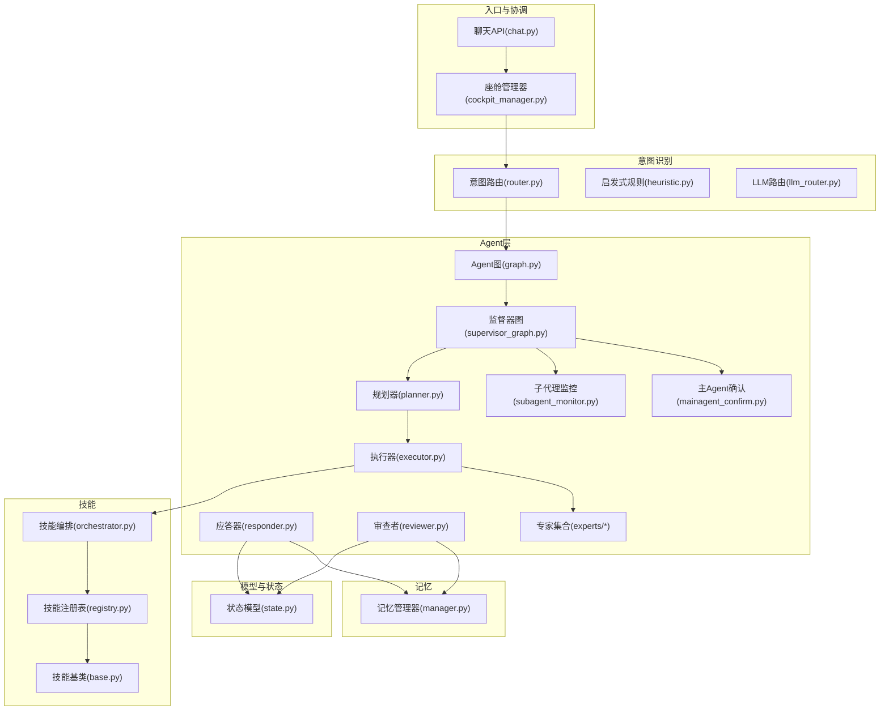
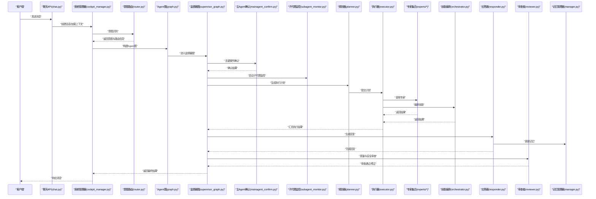
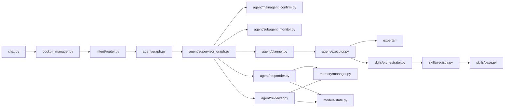

# Agent核心架构

<cite>
**本文引用的文件**   
- [backend_design/nexus/agent/graph.py](file://backend_design/nexus/agent/graph.py)
- [backend_design/nexus/agent/mainagent_confirm.py](file://backend_design/nexus/agent/mainagent_confirm.py)
- [backend_design/nexus/agent/subagent_monitor.py](file://backend_design/nexus/agent/subagent_monitor.py)
- [backend_design/nexus/agent/supervisor_graph.py](file://backend_design/nexus/agent/supervisor_graph.py)
- [backend_design/nexus/agent/planner.py](file://backend_design/nexus/agent/planner.py)
- [backend_design/nexus/agent/responder.py](file://backend_design/nexus/agent/responder.py)
- [backend_design/nexus/agent/reviewer.py](file://backend_design/nexus/agent/reviewer.py)
- [backend_design/nexus/agent/executor.py](file://backend_design/nexus/agent/executor.py)
- [backend_design/nexus/agent/experts/chat_expert.py](file://backend_design/nexus/agent/experts/chat_expert.py)
- [backend_design/nexus/agent/experts/nav_expert.py](file://backend_design/nexus/agent/experts/nav_expert.py)
- [backend_design/nexus/agent/experts/health_expert.py](file://backend_design/nexus/agent/experts/health_expert.py)
- [backend_design/nexus/agent/experts/lifestyle_expert.py](file://backend_design/nexus/agent/experts/lifestyle_expert.py)
- [backend_design/nexus/agent/experts/vehicle_expert.py](file://backend_design/nexus/agent/experts/vehicle_expert.py)
- [backend_design/nexus/intent/router.py](file://backend_design/nexus/intent/router.py)
- [backend_design/nexus/intent/heuristic.py](file://backend_design/nexus/intent/heuristic.py)
- [backend_design/nexus/intent/llm_router.py](file://backend_design/nexus/intent/llm_router.py)
- [backend_design/nexus/memory/manager.py](file://backend_design/nexus/memory/manager.py)
- [backend_design/nexus/skills/orchestrator.py](file://backend_design/nexus/skills/orchestrator.py)
- [backend_design/nexus/skills/registry.py](file://backend_design/nexus/skills/registry.py)
- [backend_design/nexus/skills/base.py](file://backend_design/nexus/skills/base.py)
- [backend_design/nexus/models/state.py](file://backend_design/nexus/models/state.py)
- [backend_design/nexus/core/cockpit_manager.py](file://backend_design/nexus/core/cockpit_manager.py)
- [backend_design/nexus/api/routes/chat.py](file://backend_design/nexus/api/routes/chat.py)
</cite>

## 目录
1. [简介](#简介)
2. [项目结构](#项目结构)
3. [核心组件](#核心组件)
4. [架构总览](#架构总览)
5. [详细组件分析](#详细组件分析)
6. [依赖关系分析](#依赖关系分析)
7. [性能考虑](#性能考虑)
8. [故障排查指南](#故障排查指南)
9. [结论](#结论)
10. [附录](#附录)

## 简介
本技术文档聚焦于NexusCockpit的Agent核心架构，围绕以下目标展开：
- 深入解释Agent图构建机制、监督器图和主Agent确认流程的实现细节
- 记录Agent状态管理、任务调度与执行流程
- 提供来自实际代码库的具体示例路径，展示如何构建和配置Agent图
- 解释与其他系统的集成方式，包括意图识别、记忆管理和技能执行
- 给出性能优化建议与故障排查指南

## 项目结构
Agent相关能力集中在 backend_design/nexus/agent 目录下，配合意图识别（intent）、记忆（memory）、技能（skills）以及API路由（api/routes）等模块共同构成完整的Agent工作流。

图表来源
- [backend_design/nexus/agent/graph.py](file://backend_design/nexus/agent/graph.py)
- [backend_design/nexus/agent/supervisor_graph.py](file://backend_design/nexus/agent/supervisor_graph.py)
- [backend_design/nexus/agent/mainagent_confirm.py](file://backend_design/nexus/agent/mainagent_confirm.py)
- [backend_design/nexus/agent/subagent_monitor.py](file://backend_design/nexus/agent/subagent_monitor.py)
- [backend_design/nexus/agent/planner.py](file://backend_design/nexus/agent/planner.py)
- [backend_design/nexus/agent/responder.py](file://backend_design/nexus/agent/responder.py)
- [backend_design/nexus/agent/reviewer.py](file://backend_design/nexus/agent/reviewer.py)
- [backend_design/nexus/agent/executor.py](file://backend_design/nexus/agent/executor.py)
- [backend_design/nexus/intent/router.py](file://backend_design/nexus/intent/router.py)
- [backend_design/nexus/intent/heuristic.py](file://backend_design/nexus/intent/heuristic.py)
- [backend_design/nexus/intent/llm_router.py](file://backend_design/nexus/intent/llm_router.py)
- [backend_design/nexus/memory/manager.py](file://backend_design/nexus/memory/manager.py)
- [backend_design/nexus/skills/orchestrator.py](file://backend_design/nexus/skills/orchestrator.py)
- [backend_design/nexus/skills/registry.py](file://backend_design/nexus/skills/registry.py)
- [backend_design/nexus/skills/base.py](file://backend_design/nexus/skills/base.py)
- [backend_design/nexus/models/state.py](file://backend_design/nexus/models/state.py)
- [backend_design/nexus/core/cockpit_manager.py](file://backend_design/nexus/core/cockpit_manager.py)
- [backend_design/nexus/api/routes/chat.py](file://backend_design/nexus/api/routes/chat.py)

章节来源
- [backend_design/nexus/agent/graph.py](file://backend_design/nexus/agent/graph.py)
- [backend_design/nexus/agent/supervisor_graph.py](file://backend_design/nexus/agent/supervisor_graph.py)
- [backend_design/nexus/agent/mainagent_confirm.py](file://backend_design/nexus/agent/mainagent_confirm.py)
- [backend_design/nexus/agent/subagent_monitor.py](file://backend_design/nexus/agent/subagent_monitor.py)
- [backend_design/nexus/agent/planner.py](file://backend_design/nexus/agent/planner.py)
- [backend_design/nexus/agent/responder.py](file://backend_design/nexus/agent/responder.py)
- [backend_design/nexus/agent/reviewer.py](file://backend_design/nexus/agent/reviewer.py)
- [backend_design/nexus/agent/executor.py](file://backend_design/nexus/agent/executor.py)
- [backend_design/nexus/intent/router.py](file://backend_design/nexus/intent/router.py)
- [backend_design/nexus/intent/heuristic.py](file://backend_design/nexus/intent/heuristic.py)
- [backend_design/nexus/intent/llm_router.py](file://backend_design/nexus/intent/llm_router.py)
- [backend_design/nexus/memory/manager.py](file://backend_design/nexus/memory/manager.py)
- [backend_design/nexus/skills/orchestrator.py](file://backend_design/nexus/skills/orchestrator.py)
- [backend_design/nexus/skills/registry.py](file://backend_design/nexus/skills/registry.py)
- [backend_design/nexus/skills/base.py](file://backend_design/nexus/skills/base.py)
- [backend_design/nexus/models/state.py](file://backend_design/nexus/models/state.py)
- [backend_design/nexus/core/cockpit_manager.py](file://backend_design/nexus/core/cockpit_manager.py)
- [backend_design/nexus/api/routes/chat.py](file://backend_design/nexus/api/routes/chat.py)

## 核心组件
- Agent图（graph.py）：定义节点、边与条件跳转，负责将用户输入转化为可执行的有向图，并驱动运行。
- 监督器图（supervisor_graph.py）：在Agent图之上增加监督与控制逻辑，用于协调子代理、触发确认与监控。
- 主Agent确认（mainagent_confirm.py）：对关键操作进行二次确认，确保高风险动作的安全执行。
- 子代理监控（subagent_monitor.py）：跟踪子代理生命周期、资源使用与异常恢复。
- 规划器（planner.py）：根据当前状态与意图生成执行计划，决定调用哪些专家或技能。
- 执行器（executor.py）：统一调度专家与技能，处理参数绑定、错误重试与结果聚合。
- 应答器（responder.py）：基于执行结果生成自然语言回复，并与记忆系统交互以更新上下文。
- 审查者（reviewer.py）：对输出进行质量与安全审查，必要时回退或修正。
- 专家集合（experts/*）：领域专家实现，如聊天、导航、健康、生活方式、车辆控制等。
- 意图识别（intent/*）：结合启发式规则与LLM路由进行意图分类与路由。
- 记忆管理（memory/manager.py）：会话记忆、长期记忆与冲突合并。
- 技能编排（skills/orchestrator.py）与注册表（skills/registry.py）：技能发现、编排与执行。
- 状态模型（models/state.py）：Agent全局状态与持久化结构。
- 座舱管理器（core/cockpit_manager.py）与聊天API（api/routes/chat.py）：对外暴露接口与协调上层流程。

章节来源
- [backend_design/nexus/agent/graph.py](file://backend_design/nexus/agent/graph.py)
- [backend_design/nexus/agent/supervisor_graph.py](file://backend_design/nexus/agent/supervisor_graph.py)
- [backend_design/nexus/agent/mainagent_confirm.py](file://backend_design/nexus/agent/mainagent_confirm.py)
- [backend_design/nexus/agent/subagent_monitor.py](file://backend_design/nexus/agent/subagent_monitor.py)
- [backend_design/nexus/agent/planner.py](file://backend_design/nexus/agent/planner.py)
- [backend_design/nexus/agent/executor.py](file://backend_design/nexus/agent/executor.py)
- [backend_design/nexus/agent/responder.py](file://backend_design/nexus/agent/responder.py)
- [backend_design/nexus/agent/reviewer.py](file://backend_design/nexus/agent/reviewer.py)
- [backend_design/nexus/agent/experts/chat_expert.py](file://backend_design/nexus/agent/experts/chat_expert.py)
- [backend_design/nexus/agent/experts/nav_expert.py](file://backend_design/nexus/agent/experts/nav_expert.py)
- [backend_design/nexus/agent/experts/health_expert.py](file://backend_design/nexus/agent/experts/health_expert.py)
- [backend_design/nexus/agent/experts/lifestyle_expert.py](file://backend_design/nexus/agent/experts/lifestyle_expert.py)
- [backend_design/nexus/agent/experts/vehicle_expert.py](file://backend_design/nexus/agent/experts/vehicle_expert.py)
- [backend_design/nexus/intent/router.py](file://backend_design/nexus/intent/router.py)
- [backend_design/nexus/intent/heuristic.py](file://backend_design/nexus/intent/heuristic.py)
- [backend_design/nexus/intent/llm_router.py](file://backend_design/nexus/intent/llm_router.py)
- [backend_design/nexus/memory/manager.py](file://backend_design/nexus/memory/manager.py)
- [backend_design/nexus/skills/orchestrator.py](file://backend_design/nexus/skills/orchestrator.py)
- [backend_design/nexus/skills/registry.py](file://backend_design/nexus/skills/registry.py)
- [backend_design/nexus/skills/base.py](file://backend_design/nexus/skills/base.py)
- [backend_design/nexus/models/state.py](file://backend_design/nexus/models/state.py)
- [backend_design/nexus/core/cockpit_manager.py](file://backend_design/nexus/core/cockpit_manager.py)
- [backend_design/nexus/api/routes/chat.py](file://backend_design/nexus/api/routes/chat.py)

## 架构总览
下图展示了从用户请求到最终响应的端到端流程，涵盖意图识别、Agent图构建、监督器控制、主Agent确认、执行与审查等环节。

图表来源
- [backend_design/nexus/api/routes/chat.py](file://backend_design/nexus/api/routes/chat.py)
- [backend_design/nexus/core/cockpit_manager.py](file://backend_design/nexus/core/cockpit_manager.py)
- [backend_design/nexus/intent/router.py](file://backend_design/nexus/intent/router.py)
- [backend_design/nexus/agent/graph.py](file://backend_design/nexus/agent/graph.py)
- [backend_design/nexus/agent/supervisor_graph.py](file://backend_design/nexus/agent/supervisor_graph.py)
- [backend_design/nexus/agent/mainagent_confirm.py](file://backend_design/nexus/agent/mainagent_confirm.py)
- [backend_design/nexus/agent/subagent_monitor.py](file://backend_design/nexus/agent/subagent_monitor.py)
- [backend_design/nexus/agent/planner.py](file://backend_design/nexus/agent/planner.py)
- [backend_design/nexus/agent/executor.py](file://backend_design/nexus/agent/executor.py)
- [backend_design/nexus/agent/experts/chat_expert.py](file://backend_design/nexus/agent/experts/chat_expert.py)
- [backend_design/nexus/agent/experts/nav_expert.py](file://backend_design/nexus/agent/experts/nav_expert.py)
- [backend_design/nexus/agent/experts/health_expert.py](file://backend_design/nexus/agent/experts/health_expert.py)
- [backend_design/nexus/agent/experts/lifestyle_expert.py](file://backend_design/nexus/agent/experts/lifestyle_expert.py)
- [backend_design/nexus/agent/experts/vehicle_expert.py](file://backend_design/nexus/agent/experts/vehicle_expert.py)
- [backend_design/nexus/skills/orchestrator.py](file://backend_design/nexus/skills/orchestrator.py)
- [backend_design/nexus/agent/responder.py](file://backend_design/nexus/agent/responder.py)
- [backend_design/nexus/agent/reviewer.py](file://backend_design/nexus/agent/reviewer.py)
- [backend_design/nexus/memory/manager.py](file://backend_design/nexus/memory/manager.py)

## 详细组件分析

### Agent图构建机制（graph.py）
- 职责：定义节点类型、边条件与跳转策略；支持动态扩展专家与技能节点；维护运行时上下文。
- 关键点：
  - 节点注册与拓扑校验，避免环路与孤立节点
  - 条件边解析，依据意图与状态选择分支
  - 运行时状态注入与回溯点设置
- 典型用法：
  - 在入口处根据意图实例化图并传入上下文
  - 通过配置或插件机制添加新节点
  - 在监督器图中作为子图被调用

章节来源
- [backend_design/nexus/agent/graph.py](file://backend_design/nexus/agent/graph.py)

### 监督器图（supervisor_graph.py）
- 职责：在Agent图之上提供控制平面，负责子代理生命周期、并发度限制、超时与熔断。
- 关键点：
  - 子代理启动与终止信号
  - 监控指标采集与告警
  - 与主Agent确认流程协作，确保关键步骤安全
- 典型用法：
  - 包裹Agent图作为顶层执行环境
  - 为每个子代理分配独立上下文与资源配额

章节来源
- [backend_design/nexus/agent/supervisor_graph.py](file://backend_design/nexus/agent/supervisor_graph.py)

### 主Agent确认流程（mainagent_confirm.py）
- 职责：对高风险操作进行二次确认，防止误触或恶意调用。
- 关键点：
  - 风险等级评估与策略匹配
  - 交互式确认或自动审批策略
  - 审计日志与回滚预案
- 典型用法：
  - 在执行器提交前插入确认节点
  - 根据用户偏好与历史行为调整确认阈值

章节来源
- [backend_design/nexus/agent/mainagent_confirm.py](file://backend_design/nexus/agent/mainagent_confirm.py)

### 子代理监控（subagent_monitor.py）
- 职责：跟踪子代理运行状态、资源消耗与异常事件。
- 关键点：
  - 心跳检测与超时处理
  - 内存与CPU使用率采样
  - 失败重试与降级策略
- 典型用法：
  - 在监督器图中注册监控钩子
  - 与可观测性系统集成上报指标

章节来源
- [backend_design/nexus/agent/subagent_monitor.py](file://backend_design/nexus/agent/subagent_monitor.py)

### 规划器（planner.py）
- 职责：基于当前状态与意图生成执行计划，决定调用顺序与并行度。
- 关键点：
  - 依赖分析与拓扑排序
  - 资源约束与优先级调度
  - 计划缓存与增量更新
- 典型用法：
  - 在监督器图中接收意图与上下文后产出计划
  - 将计划提交给执行器

章节来源
- [backend_design/nexus/agent/planner.py](file://backend_design/nexus/agent/planner.py)

### 执行器（executor.py）
- 职责：统一调度专家与技能，处理参数绑定、错误重试与结果聚合。
- 关键点：
  - 专家与技能的动态发现与注册
  - 幂等性与事务边界
  - 结果标准化与错误码映射
- 典型用法：
  - 按计划逐项执行，收集中间结果
  - 在失败时触发回退或补偿逻辑

章节来源
- [backend_design/nexus/agent/executor.py](file://backend_design/nexus/agent/executor.py)

### 专家集合（experts/*）
- 职责：封装领域知识，提供具体业务能力。
- 关键点：
  - 统一的专家接口与参数契约
  - 可扩展的提示词与模板
  - 与外部系统（如车辆服务）的适配层
- 典型用法：
  - 在Agent图中注册为节点
  - 由执行器按需调用

章节来源
- [backend_design/nexus/agent/experts/chat_expert.py](file://backend_design/nexus/agent/experts/chat_expert.py)
- [backend_design/nexus/agent/experts/nav_expert.py](file://backend_design/nexus/agent/experts/nav_expert.py)
- [backend_design/nexus/agent/experts/health_expert.py](file://backend_design/nexus/agent/experts/health_expert.py)
- [backend_design/nexus/agent/experts/lifestyle_expert.py](file://backend_design/nexus/agent/experts/lifestyle_expert.py)
- [backend_design/nexus/agent/experts/vehicle_expert.py](file://backend_design/nexus/agent/experts/vehicle_expert.py)

### 意图识别（intent/*）
- 职责：对用户输入进行意图分类与路由，决定后续处理路径。
- 关键点：
  - 启发式规则快速过滤
  - LLM路由提升复杂场景准确率
  - 置信度阈值与回退策略
- 典型用法：
  - 在入口阶段调用，返回意图标签与实体
  - 为Agent图构建提供决策依据

章节来源
- [backend_design/nexus/intent/router.py](file://backend_design/nexus/intent/router.py)
- [backend_design/nexus/intent/heuristic.py](file://backend_design/nexus/intent/heuristic.py)
- [backend_design/nexus/intent/llm_router.py](file://backend_design/nexus/intent/llm_router.py)

### 记忆管理（memory/manager.py）
- 职责：维护会话记忆与长期记忆，支持压缩、检索与冲突合并。
- 关键点：
  - 分层存储（短期/长期）
  - 语义检索与相似度匹配
  - 冲突检测与一致性保证
- 典型用法：
  - 在应答器与审查者中读写记忆
  - 定期压缩与归档

章节来源
- [backend_design/nexus/memory/manager.py](file://backend_design/nexus/memory/manager.py)

### 技能编排（skills/orchestrator.py）与注册表（skills/registry.py）
- 职责：发现、编排与执行技能，提供统一接口。
- 关键点：
  - 技能元数据与版本管理
  - 编排DSL与可视化配置
  - 权限与沙箱隔离
- 典型用法：
  - 在Agent图中注册技能节点
  - 由执行器调用编排引擎

章节来源
- [backend_design/nexus/skills/orchestrator.py](file://backend_design/nexus/skills/orchestrator.py)
- [backend_design/nexus/skills/registry.py](file://backend_design/nexus/skills/registry.py)
- [backend_design/nexus/skills/base.py](file://backend_design/nexus/skills/base.py)

### 状态模型（models/state.py）
- 职责：定义Agent全局状态结构与持久化格式。
- 关键点：
  - 状态快照与增量更新
  - 版本兼容与迁移策略
  - 并发访问保护
- 典型用法：
  - 在图运行期间读写状态
  - 在监督器图中保存检查点

章节来源
- [backend_design/nexus/models/state.py](file://backend_design/nexus/models/state.py)

### 座舱管理器（core/cockpit_manager.py）与聊天API（api/routes/chat.py）
- 职责：对外暴露接口，协调会话生命周期与Agent流程。
- 关键点：
  - 会话初始化与清理
  - 鉴权与限流
  - 与前端WebSocket或HTTP交互
- 典型用法：
  - 在聊天API中创建会话并调用座舱管理器
  - 将用户输入传递给意图识别与Agent图

章节来源
- [backend_design/nexus/core/cockpit_manager.py](file://backend_design/nexus/core/cockpit_manager.py)
- [backend_design/nexus/api/routes/chat.py](file://backend_design/nexus/api/routes/chat.py)

## 依赖关系分析
下图展示了核心模块之间的依赖关系，便于理解耦合与内聚程度。

图表来源
- [backend_design/nexus/api/routes/chat.py](file://backend_design/nexus/api/routes/chat.py)
- [backend_design/nexus/core/cockpit_manager.py](file://backend_design/nexus/core/cockpit_manager.py)
- [backend_design/nexus/intent/router.py](file://backend_design/nexus/intent/router.py)
- [backend_design/nexus/agent/graph.py](file://backend_design/nexus/agent/graph.py)
- [backend_design/nexus/agent/supervisor_graph.py](file://backend_design/nexus/agent/supervisor_graph.py)
- [backend_design/nexus/agent/mainagent_confirm.py](file://backend_design/nexus/agent/mainagent_confirm.py)
- [backend_design/nexus/agent/subagent_monitor.py](file://backend_design/nexus/agent/subagent_monitor.py)
- [backend_design/nexus/agent/planner.py](file://backend_design/nexus/agent/planner.py)
- [backend_design/nexus/agent/executor.py](file://backend_design/nexus/agent/executor.py)
- [backend_design/nexus/agent/experts/chat_expert.py](file://backend_design/nexus/agent/experts/chat_expert.py)
- [backend_design/nexus/agent/experts/nav_expert.py](file://backend_design/nexus/agent/experts/nav_expert.py)
- [backend_design/nexus/agent/experts/health_expert.py](file://backend_design/nexus/agent/experts/health_expert.py)
- [backend_design/nexus/agent/experts/lifestyle_expert.py](file://backend_design/nexus/agent/experts/lifestyle_expert.py)
- [backend_design/nexus/agent/experts/vehicle_expert.py](file://backend_design/nexus/agent/experts/vehicle_expert.py)
- [backend_design/nexus/skills/orchestrator.py](file://backend_design/nexus/skills/orchestrator.py)
- [backend_design/nexus/skills/registry.py](file://backend_design/nexus/skills/registry.py)
- [backend_design/nexus/skills/base.py](file://backend_design/nexus/skills/base.py)
- [backend_design/nexus/agent/responder.py](file://backend_design/nexus/agent/responder.py)
- [backend_design/nexus/agent/reviewer.py](file://backend_design/nexus/agent/reviewer.py)
- [backend_design/nexus/memory/manager.py](file://backend_design/nexus/memory/manager.py)
- [backend_design/nexus/models/state.py](file://backend_design/nexus/models/state.py)

章节来源
- [backend_design/nexus/api/routes/chat.py](file://backend_design/nexus/api/routes/chat.py)
- [backend_design/nexus/core/cockpit_manager.py](file://backend_design/nexus/core/cockpit_manager.py)
- [backend_design/nexus/intent/router.py](file://backend_design/nexus/intent/router.py)
- [backend_design/nexus/agent/graph.py](file://backend_design/nexus/agent/graph.py)
- [backend_design/nexus/agent/supervisor_graph.py](file://backend_design/nexus/agent/supervisor_graph.py)
- [backend_design/nexus/agent/mainagent_confirm.py](file://backend_design/nexus/agent/mainagent_confirm.py)
- [backend_design/nexus/agent/subagent_monitor.py](file://backend_design/nexus/agent/subagent_monitor.py)
- [backend_design/nexus/agent/planner.py](file://backend_design/nexus/agent/planner.py)
- [backend_design/nexus/agent/executor.py](file://backend_design/nexus/agent/executor.py)
- [backend_design/nexus/agent/experts/chat_expert.py](file://backend_design/nexus/agent/experts/chat_expert.py)
- [backend_design/nexus/agent/experts/nav_expert.py](file://backend_design/nexus/agent/experts/nav_expert.py)
- [backend_design/nexus/agent/experts/health_expert.py](file://backend_design/nexus/agent/experts/health_expert.py)
- [backend_design/nexus/agent/experts/lifestyle_expert.py](file://backend_design/nexus/agent/experts/lifestyle_expert.py)
- [backend_design/nexus/agent/experts/vehicle_expert.py](file://backend_design/nexus/agent/experts/vehicle_expert.py)
- [backend_design/nexus/skills/orchestrator.py](file://backend_design/nexus/skills/orchestrator.py)
- [backend_design/nexus/skills/registry.py](file://backend_design/nexus/skills/registry.py)
- [backend_design/nexus/skills/base.py](file://backend_design/nexus/skills/base.py)
- [backend_design/nexus/agent/responder.py](file://backend_design/nexus/agent/responder.py)
- [backend_design/nexus/agent/reviewer.py](file://backend_design/nexus/agent/reviewer.py)
- [backend_design/nexus/memory/manager.py](file://backend_design/nexus/memory/manager.py)
- [backend_design/nexus/models/state.py](file://backend_design/nexus/models/state.py)

## 性能考虑
- 意图识别优化：
  - 优先使用启发式规则进行快速分流，降低LLM调用频率
  - 对高频意图建立缓存与预取机制
- Agent图执行优化：
  - 合理划分并行度，避免过度并发导致资源争用
  - 使用计划缓存减少重复计算
- 执行器与专家：
  - 对专家调用实施超时与熔断，防止雪崩
  - 批量聚合外部系统调用，减少网络往返
- 记忆管理：
  - 定期压缩短期记忆，保持检索效率
  - 使用向量索引与近似最近邻搜索提升召回速度
- 可观测性：
  - 采集关键路径延迟与错误率，建立告警阈值
  - 对热点节点进行慢查询定位与优化

[本节为通用指导，不直接分析具体文件]

## 故障排查指南
- 常见问题定位：
  - 意图识别失败：检查启发式规则与LLM路由的置信度阈值与回退策略
  - 图构建异常：验证节点注册与边条件，排查环路或孤立节点
  - 监督器超时：查看子代理监控的心跳与资源指标，调整并发与超时参数
  - 主Agent确认阻塞：核对风险策略与用户偏好，必要时放宽或收紧确认阈值
  - 执行器错误：检查专家与技能接口的参数契约与错误码映射
  - 记忆写入失败：确认存储后端可用性与一致性策略
- 诊断工具与日志：
  - 启用详细日志与追踪ID，关联一次请求的全链路
  - 导出关键指标（延迟、错误率、资源使用）至监控系统
  - 使用审查者的审查报告定位输出质量问题

章节来源
- [backend_design/nexus/agent/subagent_monitor.py](file://backend_design/nexus/agent/subagent_monitor.py)
- [backend_design/nexus/agent/mainagent_confirm.py](file://backend_design/nexus/agent/mainagent_confirm.py)
- [backend_design/nexus/agent/executor.py](file://backend_design/nexus/agent/executor.py)
- [backend_design/nexus/agent/reviewer.py](file://backend_design/nexus/agent/reviewer.py)
- [backend_design/nexus/memory/manager.py](file://backend_design/nexus/memory/manager.py)

## 结论
NexusCockpit的Agent核心架构通过“意图识别—图构建—监督控制—执行与审查”的分层设计，实现了高内聚、低耦合的可扩展智能体系统。借助监督器图与主Agent确认机制，系统在灵活性与安全性之间取得平衡；通过记忆管理与技能编排，Agent能够持续学习与复用能力。建议在部署中强化可观测性与性能调优，并结合业务需求定制专家与技能，以获得更佳的体验与稳定性。

[本节为总结性内容，不直接分析具体文件]

## 附录
- 构建与配置Agent图的实践要点：
  - 在入口阶段完成意图识别与上下文加载
  - 使用监督器图包裹Agent图，开启监控与确认流程
  - 在规划器中明确依赖与并行度，提交给执行器
  - 在应答器与审查者中读写记忆与状态，确保一致性与质量
- 与其他系统的集成方式：
  - 意图识别：结合启发式规则与LLM路由，提高准确率与鲁棒性
  - 记忆管理：分层存储与语义检索，支持长期上下文与个性化
  - 技能执行：通过注册表与编排引擎，实现动态发现与组合

[本节为概念性内容，不直接分析具体文件]