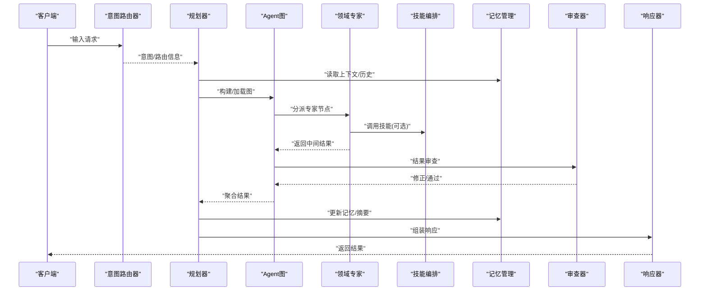
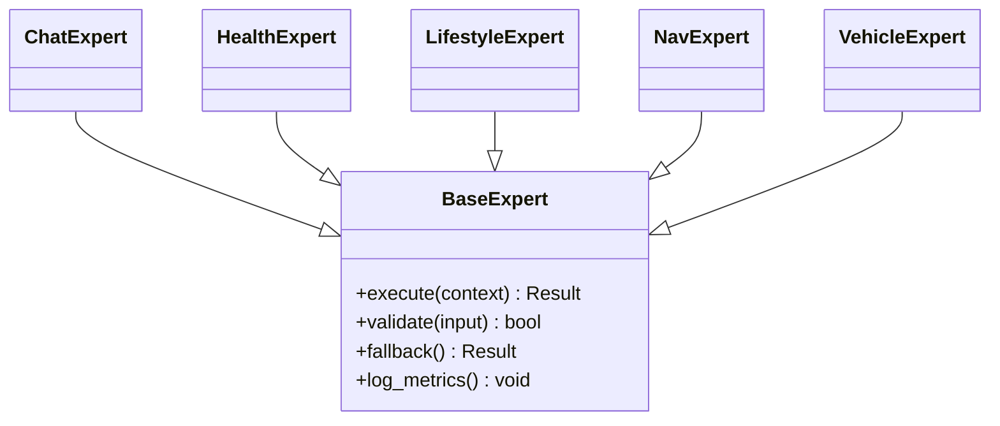
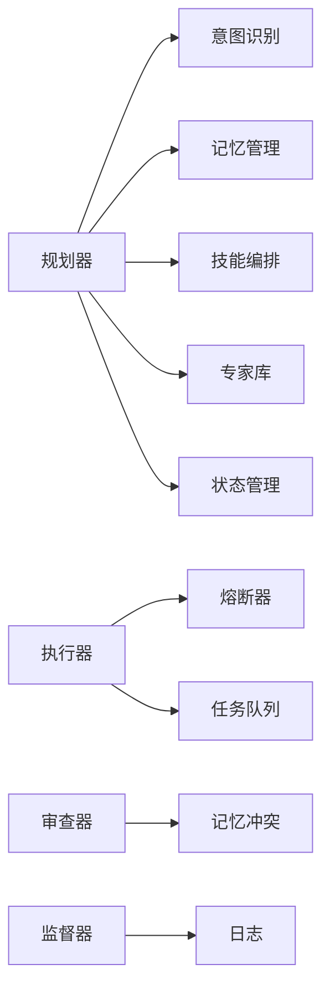

# Agent系统

<cite>
**本文引用的文件**
- [Agent.md](file://Agent.md)
- [backend_design/nexus/agent/__init__.py](file://backend_design/nexus/agent/__init__.py)
- [backend_design/nexus/agent/planner.py](file://backend_design/nexus/agent/planner.py)
- [backend_design/nexus/agent/executor.py](file://backend_design/nexus/agent/executor.py)
- [backend_design/nexus/agent/responder.py](file://backend_design/nexus/agent/responder.py)
- [backend_design/nexus/agent/reviewer.py](file://backend_design/nexus/agent/reviewer.py)
- [backend_design/nexus/agent/subagent_monitor.py](file://backend_design/nexus/agent/subagent_monitor.py)
- [backend_design/nexus/agent/graph.py](file://backend_design/nexus/agent/graph.py)
- [backend_design/nexus/agent/supervisor_graph.py](file://backend_design/nexus/agent/supervisor_graph.py)
- [backend_design/nexus/agent/mainagent_confirm.py](file://backend_design/nexus/agent/mainagent_confirm.py)
- [backend_design/nexus/agent/experts/base.py](file://backend_design/nexus/agent/experts/base.py)
- [backend_design/nexus/agent/experts/chat_expert.py](file://backend_design/nexus/agent/experts/chat_expert.py)
- [backend_design/nexus/agent/experts/health_expert.py](file://backend_design/nexus/agent/experts/health_expert.py)
- [backend_design/nexus/agent/experts/lifestyle_expert.py](file://backend_design/nexus/agent/experts/lifestyle_expert.py)
- [backend_design/nexus/agent/experts/nav_expert.py](file://backend_design/nexus/agent/experts/nav_expert.py)
- [backend_design/nexus/agent/experts/vehicle_expert.py](file://backend_design/nexus/agent/experts/vehicle_expert.py)
- [backend_design/nexus/intent/router.py](file://backend_design/nexus/intent/router.py)
- [backend_design/nexus/intent/heuristic.py](file://backend_design/nexus/intent/heuristic.py)
- [backend_design/nexus/intent/llm_router.py](file://backend_design/nexus/intent/llm_router.py)
- [backend_design/nexus/memory/manager.py](file://backend_design/nexus/memory/manager.py)
- [backend_design/nexus/memory/compressor.py](file://backend_design/nexus/memory/compressor.py)
- [backend_design/nexus/memory/conflict.py](file://backend_design/nexus/memory/conflict.py)
- [backend_design/nexus/skills/orchestrator.py](file://backend_design/nexus/skills/orchestrator.py)
- [backend_design/nexus/skills/registry.py](file://backend_design/nexus/skills/registry.py)
- [backend_design/nexus/skills/base.py](file://backend_design/nexus/skills/base.py)
- [backend_design/nexus/models/state.py](file://backend_design/nexus/models/state.py)
- [backend_design/nexus/core/logger.py](file://backend_design/nexus/core/logger.py)
- [backend_design/nexus/core/circuit_breaker.py](file://backend_design/nexus/core/circuit熔断器.py)
- [backend_design/nexus/middleware/task_queue.py](file://backend_design/nexus/middleware/task_queue.py)
</cite>

## 目录
1. [简介](#简介)
2. [项目结构](#项目结构)
3. [核心组件](#核心组件)
4. [架构总览](#架构总览)
5. [详细组件分析](#详细组件分析)
6. [依赖关系分析](#依赖关系分析)
7. [性能考虑](#性能考虑)
8. [故障排查指南](#故障排查指南)
9. [结论](#结论)
10. [附录](#附录)

## 简介
本文件面向NexusCockpit的Agent系统，聚焦多专家协作架构与关键实现：规划器、执行器、监督器与审查器；并覆盖Agent图构建机制、任务调度策略与状态管理。文档同时给出与其他系统的集成方式（意图识别、记忆管理与技能执行），并提供性能优化建议与故障排查指南。内容基于仓库中实际代码结构与模块组织进行梳理，帮助读者快速理解与扩展Agent能力。

## 项目结构
Agent系统位于后端设计目录下的nexus子包内，围绕“专家”概念组织，通过图编排与监督/审查机制完成复杂任务的分解、路由、执行与质量保障。

```mermaid
graph TB
subgraph "Agent核心"
A_init["agent/__init__.py"]
A_planner["agent/planner.py"]
A_executor["agent/executor.py"]
A_responder["agent/responder.py"]
A_reviewer["agent/reviewer.py"]
A_submon["agent/subagent_monitor.py"]
A_graph["agent/graph.py"]
A_supervisor["agent/supervisor_graph.py"]
A_mainconfirm["agent/mainagent_confirm.py"]
end
subgraph "专家库"
E_base["experts/base.py"]
E_chat["experts/chat_expert.py"]
E_health["experts/health_expert.py"]
E_lifestyle["experts/lifestyle_expert.py"]
E_nav["experts/nav_expert.py"]
E_vehicle["experts/vehicle_expert.py"]
end
subgraph "外部集成"
I_intent["intent/*"]
I_memory["memory/*"]
I_skills["skills/*"]
I_state["models/state.py"]
I_logger["core/logger.py"]
I_circuit["core/circuit_breaker.py"]
I_taskq["middleware/task_queue.py"]
end
A_init --> A_planner
A_planner --> A_graph
A_planner --> A_supervisor
A_planner --> A_executor
A_planner --> A_responder
A_planner --> A_reviewer
A_planner --> A_submon
A_planner --> A_mainconfirm
A_planner --> E_base
E_chat --> E_base
E_health --> E_base
E_lifestyle --> E_base
E_nav --> E_base
E_vehicle --> E_base
A_planner --> I_intent
A_planner --> I_memory
A_planner --> I_skills
A_planner --> I_state
A_planner --> I_logger
A_planner --> I_circuit
A_planner --> I_taskq
```

图表来源
- [backend_design/nexus/agent/__init__.py](file://backend_design/nexus/agent/__init__.py)
- [backend_design/nexus/agent/planner.py](file://backend_design/nexus/agent/planner.py)
- [backend_design/nexus/agent/executor.py](file://backend_design/nexus/agent/executor.py)
- [backend_design/nexus/agent/responder.py](file://backend_design/nexus/agent/responder.py)
- [backend_design/nexus/agent/reviewer.py](file://backend_design/nexus/agent/reviewer.py)
- [backend_design/nexus/agent/subagent_monitor.py](file://backend_design/nexus/agent/subagent_monitor.py)
- [backend_design/nexus/agent/graph.py](file://backend_design/nexus/agent/graph.py)
- [backend_design/nexus/agent/supervisor_graph.py](file://backend_design/nexus/agent/supervisor_graph.py)
- [backend_design/nexus/agent/mainagent_confirm.py](file://backend_design/nexus/agent/mainagent_confirm.py)
- [backend_design/nexus/agent/experts/base.py](file://backend_design/nexus/agent/experts/base.py)
- [backend_design/nexus/agent/experts/chat_expert.py](file://backend_design/nexus/agent/experts/chat_expert.py)
- [backend_design/nexus/agent/experts/health_expert.py](file://backend_design/nexus/agent/experts/health_expert.py)
- [backend_design/nexus/agent/experts/lifestyle_expert.py](file://backend_design/nexus/agent/experts/lifestyle_expert.py)
- [backend_design/nexus/agent/experts/nav_expert.py](file://backend_design/nexus/agent/experts/nav_expert.py)
- [backend_design/nexus/agent/experts/vehicle_expert.py](file://backend_design/nexus/agent/experts/vehicle_expert.py)
- [backend_design/nexus/intent/router.py](file://backend_design/nexus/intent/router.py)
- [backend_design/nexus/intent/heuristic.py](file://backend_design/nexus/intent/heuristic.py)
- [backend_design/nexus/intent/llm_router.py](file://backend_design/nexus/intent/llm_router.py)
- [backend_design/nexus/memory/manager.py](file://backend_design/nexus/memory/manager.py)
- [backend_design/nexus/memory/compressor.py](file://backend_design/nexus/memory/compressor.py)
- [backend_design/nexus/memory/conflict.py](file://backend_design/nexus/memory/conflict.py)
- [backend_design/nexus/skills/orchestrator.py](file://backend_design/nexus/skills/orchestrator.py)
- [backend_design/nexus/skills/registry.py](file://backend_design/nexus/skills/registry.py)
- [backend_design/nexus/skills/base.py](file://backend_design/nexus/skills/base.py)
- [backend_design/nexus/models/state.py](file://backend_design/nexus/models/state.py)
- [backend_design/nexus/core/logger.py](file://backend_design/nexus/core/logger.py)
- [backend_design/nexus/core/circuit_breaker.py](file://backend_design/nexus/core/circuit_breaker.py)
- [backend_design/nexus/middleware/task_queue.py](file://backend_design/nexus/middleware/task_queue.py)

章节来源
- [Agent.md](file://Agent.md)
- [backend_design/nexus/agent/__init__.py](file://backend_design/nexus/agent/__init__.py)

## 核心组件
- 规划器（Planner）：负责将用户请求解析为可执行的Agent图或计划，协调专家选择、任务拆分与调度。
- 执行器（Executor）：负责具体节点或子任务的执行，包括调用专家、技能与外部服务。
- 响应器（Responder）：负责将执行结果组装为对外响应，处理流式输出与错误包装。
- 审查器（Reviewer）：对执行结果进行质量校验、合规检查与二次修正。
- 监督器（Subagent Monitor）：监控子任务执行状态、超时与失败重试，提供可观测性。
- 主Agent确认（MainAgent Confirm）：在需要时触发人工或规则确认流程，确保高风险操作安全。
- 专家基类与领域专家：定义统一接口与通用行为，chat/health/lifestyle/nav/vehicle等专家分别覆盖不同业务域。
- 图与监督图（Graph/Supervisor Graph）：描述任务拓扑、边条件与流转控制。

章节来源
- [backend_design/nexus/agent/planner.py](file://backend_design/nexus/agent/planner.py)
- [backend_design/nexus/agent/executor.py](file://backend_design/nexus/agent/executor.py)
- [backend_design/nexus/agent/responder.py](file://backend_design/nexus/agent/responder.py)
- [backend_design/nexus/agent/reviewer.py](file://backend_design/nexus/agent/reviewer.py)
- [backend_design/nexus/agent/subagent_monitor.py](file://backend_design/nexus/agent/subagent_monitor.py)
- [backend_design/nexus/agent/mainagent_confirm.py](file://backend_design/nexus/agent/mainagent_confirm.py)
- [backend_design/nexus/agent/graph.py](file://backend_design/nexus/agent/graph.py)
- [backend_design/nexus/agent/supervisor_graph.py](file://backend_design/nexus/agent/supervisor_graph.py)
- [backend_design/nexus/agent/experts/base.py](file://backend_design/nexus/agent/experts/base.py)
- [backend_design/nexus/agent/experts/chat_expert.py](file://backend_design/nexus/agent/experts/chat_expert.py)
- [backend_design/nexus/agent/experts/health_expert.py](file://backend_design/nexus/agent/experts/health_expert.py)
- [backend_design/nexus/agent/experts/lifestyle_expert.py](file://backend_design/nexus/agent/experts/lifestyle_expert.py)
- [backend_design/nexus/agent/experts/nav_expert.py](file://backend_design/nexus/agent/experts/nav_expert.py)
- [backend_design/nexus/agent/experts/vehicle_expert.py](file://backend_design/nexus/agent/experts/vehicle_expert.py)

## 架构总览
下图展示了从请求进入、意图识别、记忆读取、专家路由、图执行、监督与审查到最终响应的端到端流程。

图表来源
- [backend_design/nexus/intent/router.py](file://backend_design/nexus/intent/router.py)
- [backend_design/nexus/agent/planner.py](file://backend_design/nexus/agent/planner.py)
- [backend_design/nexus/agent/graph.py](file://backend_design/nexus/agent/graph.py)
- [backend_design/nexus/agent/experts/base.py](file://backend_design/nexus/agent/experts/base.py)
- [backend_design/nexus/skills/orchestrator.py](file://backend_design/nexus/skills/orchestrator.py)
- [backend_design/nexus/memory/manager.py](file://backend_design/nexus/memory/manager.py)
- [backend_design/nexus/agent/reviewer.py](file://backend_design/nexus/agent/reviewer.py)
- [backend_design/nexus/agent/responder.py](file://backend_design/nexus/agent/responder.py)

## 详细组件分析

### 规划器（Planner）
- 职责
  - 接收意图与上下文，生成或选择Agent图。
  - 决定专家路由、任务拆分与并行度。
  - 与记忆、技能、监督器、审查器协作，驱动整体执行。
- 关键交互
  - 意图识别：根据启发式或LLM路由策略确定目标专家集合。
  - 图构建：依据领域约束与资源可用性构造有向无环图。
  - 调度策略：支持顺序、分支、汇聚与重试；结合任务队列进行异步执行。
  - 状态管理：维护全局状态与节点状态，供监督器与审查器使用。
- 配置要点
  - 专家注册表与权重。
  - 图模板与动态参数。
  - 超时、重试与熔断策略。
  - 日志与指标上报开关。

章节来源
- [backend_design/nexus/agent/planner.py](file://backend_design/nexus/agent/planner.py)
- [backend_design/nexus/agent/graph.py](file://backend_design/nexus/agent/graph.py)
- [backend_design/nexus/agent/supervisor_graph.py](file://backend_design/nexus/agent/supervisor_graph.py)
- [backend_design/nexus/intent/router.py](file://backend_design/nexus/intent/router.py)
- [backend_design/nexus/intent/heuristic.py](file://backend_design/nexus/intent/heuristic.py)
- [backend_design/nexus/intent/llm_router.py](file://backend_design/nexus/intent/llm_router.py)
- [backend_design/nexus/middleware/task_queue.py](file://backend_design/nexus/middleware/task_queue.py)
- [backend_design/nexus/models/state.py](file://backend_design/nexus/models/state.py)

### 执行器（Executor）
- 职责
  - 执行图节点对应的专家或技能。
  - 管理并发、超时、重试与回退。
  - 收集执行指标与异常信息。
- 关键模式
  - 专家调用封装：统一入参/出参与错误码。
  - 技能编排：组合多个原子技能形成复合动作。
  - 熔断保护：对不稳定下游进行快速失败与降级。
- 配置要点
  - 并发度上限与背压策略。
  - 超时阈值与重试次数。
  - 熔断阈值与恢复窗口。

章节来源
- [backend_design/nexus/agent/executor.py](file://backend_design/nexus/agent/executor.py)
- [backend_design/nexus/skills/orchestrator.py](file://backend_design/nexus/skills/orchestrator.py)
- [backend_design/nexus/core/circuit_breaker.py](file://backend_design/nexus/core/circuit_breaker.py)

### 监督器（Subagent Monitor）
- 职责
  - 跟踪子任务生命周期（创建、运行、完成、失败）。
  - 检测超时、死锁与资源泄漏。
  - 触发告警与自动修复（如重启、切换备用路径）。
- 关键能力
  - 心跳与进度上报。
  - 快照与检查点持久化。
  - 与日志/指标系统集成。

章节来源
- [backend_design/nexus/agent/subagent_monitor.py](file://backend_design/nexus/agent/subagent_monitor.py)
- [backend_design/nexus/core/logger.py](file://backend_design/nexus/core/logger.py)

### 审查器（Reviewer）
- 职责
  - 对执行结果进行一致性、完整性与安全性检查。
  - 自动修正轻微偏差，必要时退回上游重算。
- 关键能力
  - 规则引擎与启发式校验。
  - 与记忆冲突解决联动。
  - 审计日志与版本回溯。

章节来源
- [backend_design/nexus/agent/reviewer.py](file://backend_design/nexus/agent/reviewer.py)
- [backend_design/nexus/memory/conflict.py](file://backend_design/nexus/memory/conflict.py)

### 响应器（Responder）
- 职责
  - 将多源结果合并、格式化与流式推送。
  - 统一错误码与诊断信息。
- 关键能力
  - 增量输出与断线续传。
  - 敏感信息脱敏。

章节来源
- [backend_design/nexus/agent/responder.py](file://backend_design/nexus/agent/responder.py)

### 主Agent确认（MainAgent Confirm）
- 职责
  - 在高风险操作前触发确认流程（人机协同或规则审批）。
  - 记录决策轨迹与审计信息。
- 适用场景
  - 车辆控制、健康干预、重要数据写入等。

章节来源
- [backend_design/nexus/agent/mainagent_confirm.py](file://backend_design/nexus/agent/mainagent_confirm.py)

### 专家体系（Experts）
- 基类（Base Expert）
  - 定义统一的执行接口、上下文注入与错误模型。
  - 提供默认日志、度量与重试策略。
- 领域专家
  - 聊天专家：对话与澄清、上下文抽取。
  - 健康专家：健康指标解读与建议。
  - 生活方式专家：习惯、日程与提醒。
  - 导航专家：路线规划与实时路况。
  - 车辆专家：车辆状态与控制指令。
- 扩展方式
  - 继承基类，实现领域逻辑与技能编排。
  - 注册到专家路由表，配合规划器动态选择。

图表来源
- [backend_design/nexus/agent/experts/base.py](file://backend_design/nexus/agent/experts/base.py)
- [backend_design/nexus/agent/experts/chat_expert.py](file://backend_design/nexus/agent/experts/chat_expert.py)
- [backend_design/nexus/agent/experts/health_expert.py](file://backend_design/nexus/agent/experts/health_expert.py)
- [backend_design/nexus/agent/experts/lifestyle_expert.py](file://backend_design/nexus/agent/experts/lifestyle_expert.py)
- [backend_design/nexus/agent/experts/nav_expert.py](file://backend_design/nexus/agent/experts/nav_expert.py)
- [backend_design/nexus/agent/experts/vehicle_expert.py](file://backend_design/nexus/agent/experts/vehicle_expert.py)

章节来源
- [backend_design/nexus/agent/experts/base.py](file://backend_design/nexus/agent/experts/base.py)
- [backend_design/nexus/agent/experts/chat_expert.py](file://backend_design/nexus/agent/experts/chat_expert.py)
- [backend_design/nexus/agent/experts/health_expert.py](file://backend_design/nexus/agent/experts/health_expert.py)
- [backend_design/nexus/agent/experts/lifestyle_expert.py](file://backend_design/nexus/agent/experts/lifestyle_expert.py)
- [backend_design/nexus/agent/experts/nav_expert.py](file://backend_design/nexus/agent/experts/nav_expert.py)
- [backend_design/nexus/agent/experts/vehicle_expert.py](file://backend_design/nexus/agent/experts/vehicle_expert.py)

### 图与监督图（Graph & Supervisor Graph）
- Agent图
  - 节点：专家、技能、记忆读写、确认节点等。
  - 边：条件跳转、并行汇聚、重试与回退。
  - 运行时：状态机驱动，支持检查点与恢复。
- 监督图
  - 独立于业务图的监控视图，用于追踪关键路径与风险节点。
  - 与监督器联动，提供可视化与告警。

章节来源
- [backend_design/nexus/agent/graph.py](file://backend_design/nexus/agent/graph.py)
- [backend_design/nexus/agent/supervisor_graph.py](file://backend_design/nexus/agent/supervisor_graph.py)

### 意图识别（Intent）
- 路由策略
  - 启发式规则：关键词、正则、白名单/黑名单。
  - LLM路由：语义相似度与分类模型。
- 集成方式
  - 为每个专家注册意图标签与优先级。
  - 支持多候选排序与置信度阈值。

章节来源
- [backend_design/nexus/intent/router.py](file://backend_design/nexus/intent/router.py)
- [backend_design/nexus/intent/heuristic.py](file://backend_design/nexus/intent/heuristic.py)
- [backend_design/nexus/intent/llm_router.py](file://backend_design/nexus/intent/llm_router.py)

### 记忆管理（Memory）
- 功能
  - 会话级与用户级记忆存取。
  - 压缩与摘要，降低上下文成本。
  - 冲突检测与合并策略。
- 集成方式
  - 规划器在构建图前读取相关记忆。
  - 执行后由审查器或规划器更新记忆。

章节来源
- [backend_design/nexus/memory/manager.py](file://backend_design/nexus/memory/manager.py)
- [backend_design/nexus/memory/compressor.py](file://backend_design/nexus/memory/compressor.py)
- [backend_design/nexus/memory/conflict.py](file://backend_design/nexus/memory/conflict.py)

### 技能执行（Skills）
- 编排器
  - 将原子技能组合为工作流，支持条件分支与循环。
- 注册表
  - 集中注册技能元信息与权限控制。
- 基类
  - 定义技能接口、参数校验与错误模型。

章节来源
- [backend_design/nexus/skills/orchestrator.py](file://backend_design/nexus/skills/orchestrator.py)
- [backend_design/nexus/skills/registry.py](file://backend_design/nexus/skills/registry.py)
- [backend_design/nexus/skills/base.py](file://backend_design/nexus/skills/base.py)

### 状态管理（State）
- 全局状态
  - 会话ID、租户上下文、用户画像、设备信息。
- 节点状态
  - 待执行、运行中、成功、失败、取消、重试。
- 持久化
  - 检查点存储与恢复。

章节来源
- [backend_design/nexus/models/state.py](file://backend_design/nexus/models/state.py)

## 依赖关系分析
- 低耦合高内聚
  - 规划器仅依赖抽象接口（专家、技能、记忆、意图），便于替换实现。
  - 专家与技能解耦，通过注册表发现与路由。
- 外部依赖
  - 意图识别：启发式与LLM路由可插拔。
  - 记忆：可对接多种存储后端。
  - 技能：可跨进程/微服务调用。
- 潜在环路
  - 图应保证DAG性质；若存在循环需显式标注最大迭代次数与收敛条件。

图表来源
- [backend_design/nexus/agent/planner.py](file://backend_design/nexus/agent/planner.py)
- [backend_design/nexus/intent/router.py](file://backend_design/nexus/intent/router.py)
- [backend_design/nexus/memory/manager.py](file://backend_design/nexus/memory/manager.py)
- [backend_design/nexus/skills/orchestrator.py](file://backend_design/nexus/skills/orchestrator.py)
- [backend_design/nexus/agent/executor.py](file://backend_design/nexus/agent/executor.py)
- [backend_design/nexus/core/circuit_breaker.py](file://backend_design/nexus/core/circuit_breaker.py)
- [backend_design/nexus/middleware/task_queue.py](file://backend_design/nexus/middleware/task_queue.py)
- [backend_design/nexus/agent/reviewer.py](file://backend_design/nexus/agent/reviewer.py)
- [backend_design/nexus/memory/conflict.py](file://backend_design/nexus/memory/conflict.py)
- [backend_design/nexus/agent/subagent_monitor.py](file://backend_design/nexus/agent/subagent_monitor.py)
- [backend_design/nexus/core/logger.py](file://backend_design/nexus/core/logger.py)

## 性能考虑
- 图与调度
  - 合理设置并行度，避免热点专家过载。
  - 使用任务队列削峰填谷，限制长尾任务占用。
- 记忆与上下文
  - 启用记忆压缩与摘要，减少大模型输入长度。
  - 分层缓存：热键常驻内存，冷键落盘。
- 专家与技能
  - 为不稳定下游配置熔断与快速失败，缩短错误传播链。
  - 复用连接池与批量接口，减少网络往返。
- 可观测性
  - 关键路径埋点：耗时、成功率、重试率、熔断触发次数。
  - 结构化日志与Trace ID贯穿全链路。

[本节为通用指导，不直接分析具体文件]

## 故障排查指南
- 常见问题定位
  - 意图误判：检查启发式规则与LLM路由阈值，查看候选排序与置信度。
  - 图卡住：核对DAG条件边与收敛条件，查看监督器心跳与检查点。
  - 专家超时：调整超时阈值与重试策略，观察熔断器状态。
  - 记忆冲突：查看冲突检测日志与合并策略，必要时回滚到上一检查点。
- 工具与手段
  - 启用调试日志与Trace ID，关联上下游调用。
  - 使用监督图可视化关键路径，定位瓶颈节点。
  - 回放最近一次检查点，复现问题并验证修复。

章节来源
- [backend_design/nexus/agent/subagent_monitor.py](file://backend_design/nexus/agent/subagent_monitor.py)
- [backend_design/nexus/core/logger.py](file://backend_design/nexus/core/logger.py)
- [backend_design/nexus/core/circuit_breaker.py](file://backend_design/nexus/core/circuit_breaker.py)
- [backend_design/nexus/memory/conflict.py](file://backend_design/nexus/memory/conflict.py)

## 结论
NexusCockpit的Agent系统以“专家+图编排+监督/审查”为核心，实现了灵活的多专家协作与高质量执行。通过意图识别、记忆管理与技能编排的松耦合集成，系统具备良好的可扩展性与稳定性。建议在上线前完善可观测性、熔断与检查点策略，并结合业务特征调优并行度与超时阈值，以获得更佳的吞吐与延迟表现。

## 附录
- 配置清单（示例字段说明）
  - 规划器
    - 专家权重、图模板、超时、重试次数、熔断阈值、日志级别。
  - 执行器
    - 并发度、背压阈值、超时、重试、熔断开关。
  - 监督器
    - 心跳间隔、检查点周期、告警阈值。
  - 审查器
    - 规则集、冲突合并策略、审计开关。
  - 意图识别
    - 启发式规则、LLM路由模型、置信度阈值。
  - 记忆
    - 压缩策略、保留时长、冲突检测开关。
  - 技能
    - 注册表、权限控制、批量接口开关。
- 最佳实践
  - 为新专家提供最小可用实现与单元测试。
  - 为高风险操作强制开启主Agent确认。
  - 持续监控关键指标，定期复盘失败案例。

[本节为通用指导，不直接分析具体文件]