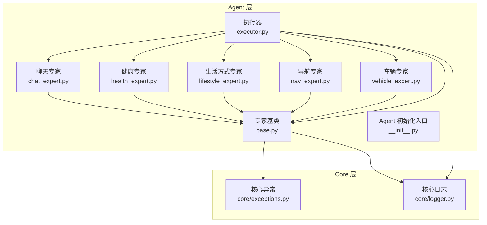
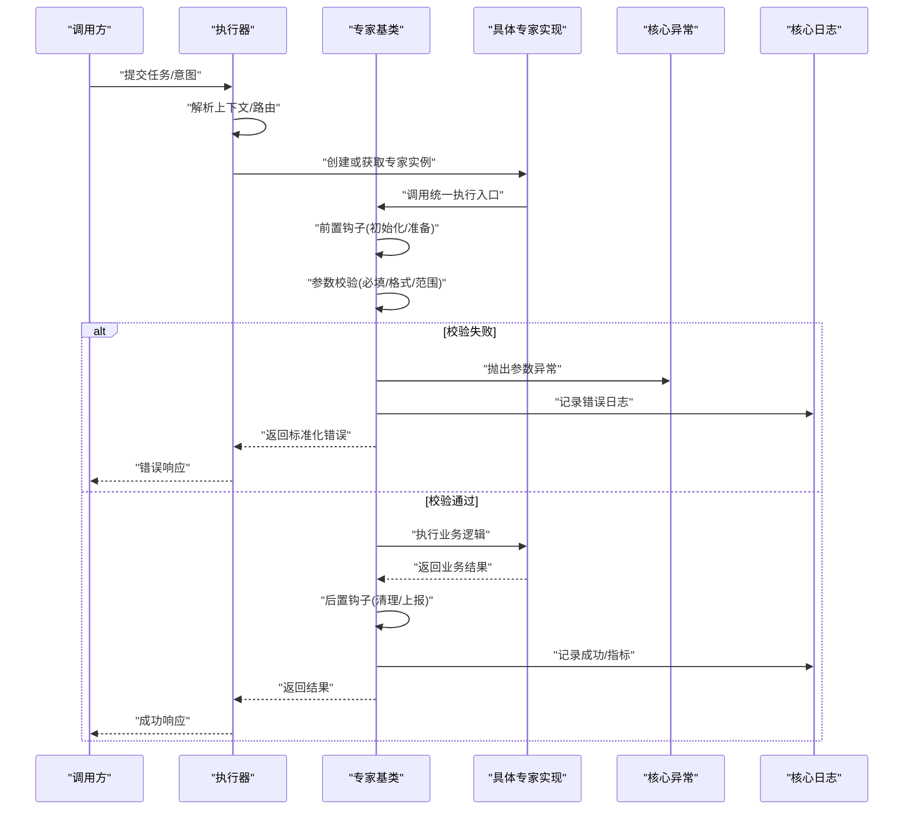
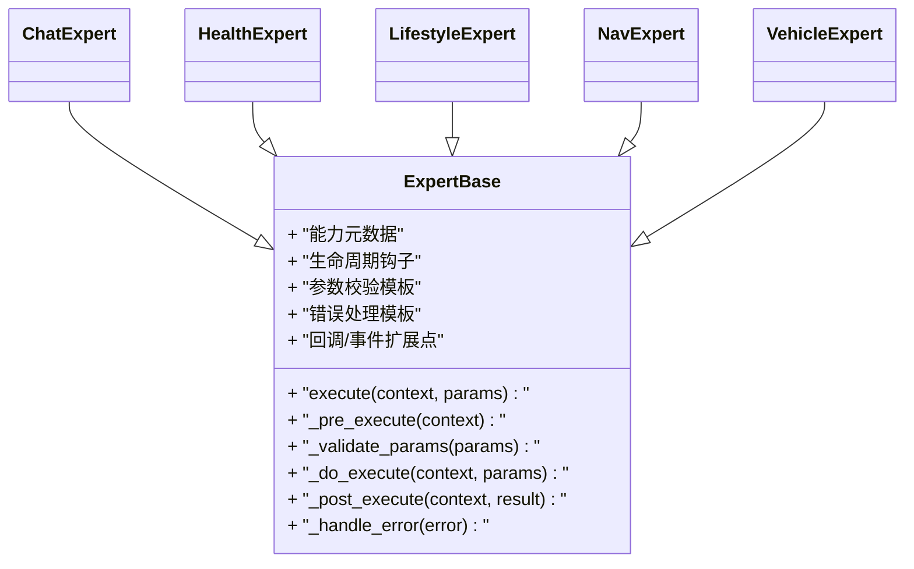
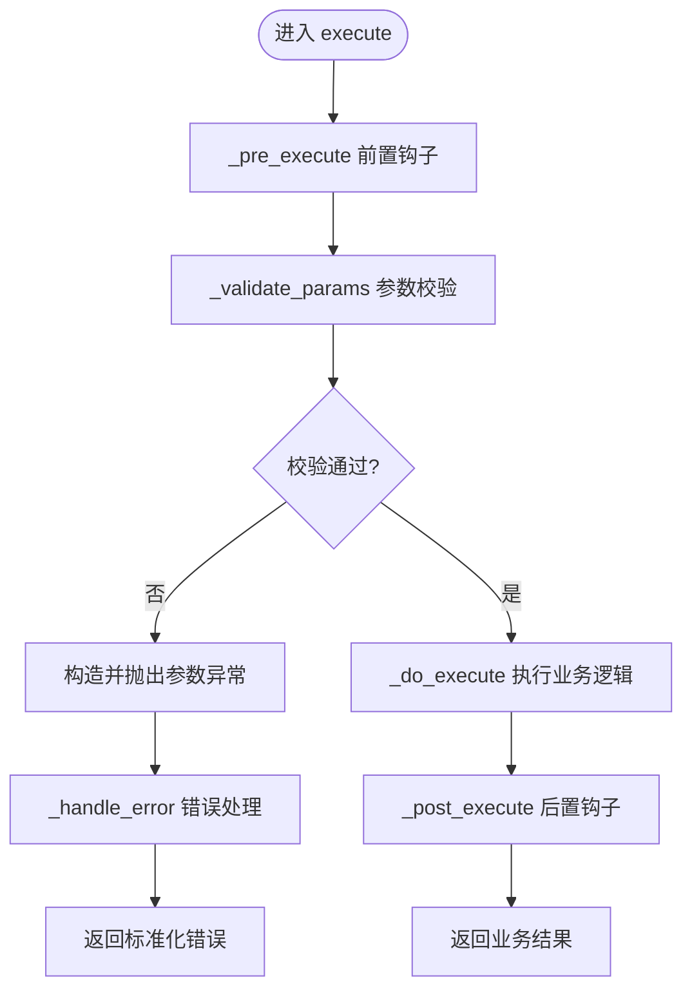
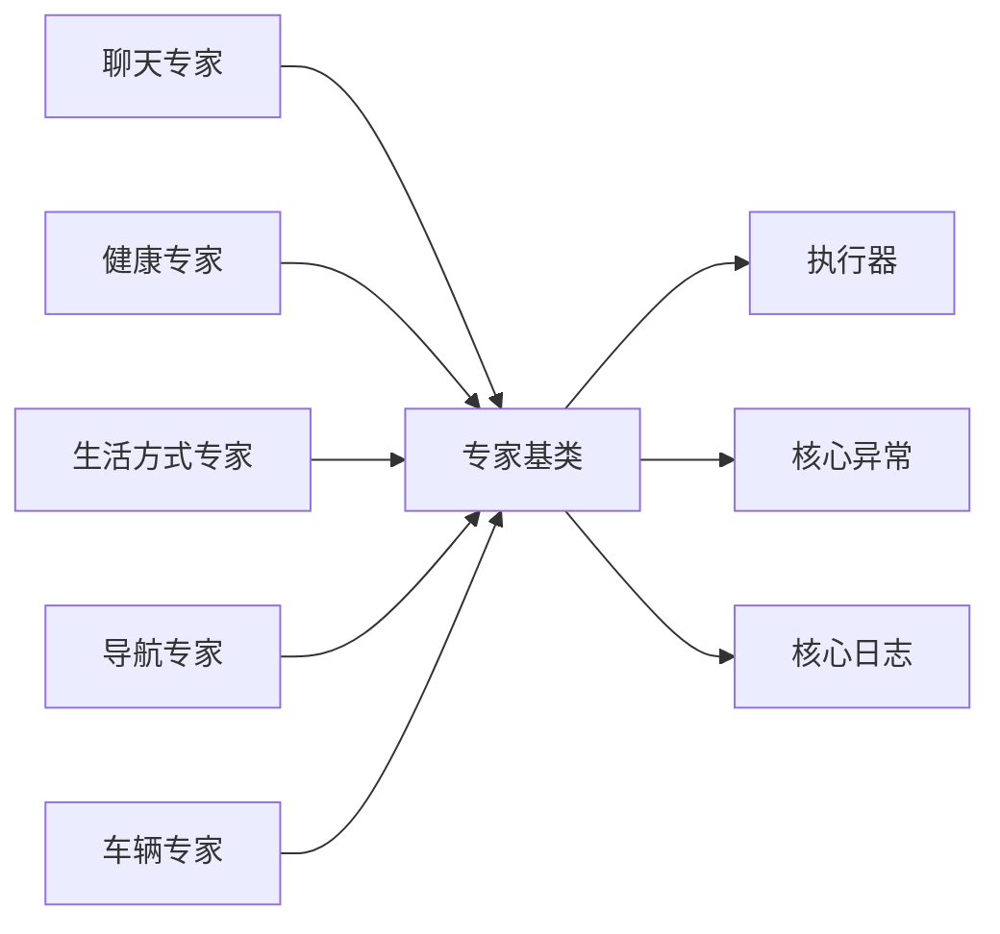

# 专家基类设计

<cite>
**本文引用的文件**   
- [backend_design/nexus/agent/experts/base.py](file://backend_design/nexus/agent/experts/base.py)
- [backend_design/nexus/agent/experts/chat_expert.py](file://backend_design/nexus/agent/experts/chat_expert.py)
- [backend_design/nexus/agent/experts/health_expert.py](file://backend_design/nexus/agent/experts/health_expert.py)
- [backend_design/nexus/agent/experts/lifestyle_expert.py](file://backend_design/nexus/agent/experts/lifestyle_expert.py)
- [backend_design/nexus/agent/experts/nav_expert.py](file://backend_design/nexus/agent/experts/nav_expert.py)
- [backend_design/nexus/agent/experts/vehicle_expert.py](file://backend_design/nexus/agent/experts/vehicle_expert.py)
- [backend_design/nexus/agent/__init__.py](file://backend_design/nexus/agent/__init__.py)
- [backend_design/nexus/agent/executor.py](file://backend_design/nexus/agent/executor.py)
- [backend_design/nexus/core/exceptions.py](file://backend_design/nexus/core/exceptions.py)
- [backend_design/nexus/core/logger.py](file://backend_design/nexus/core/logger.py)
</cite>

## 目录
1. [简介](#简介)
2. [项目结构](#项目结构)
3. [核心组件](#核心组件)
4. [架构总览](#架构总览)
5. [详细组件分析](#详细组件分析)
6. [依赖关系分析](#依赖关系分析)
7. [性能考量](#性能考量)
8. [故障排查指南](#故障排查指南)
9. [结论](#结论)
10. [附录](#附录)

## 简介
本文件聚焦于 NexusCockpit 中“专家”体系的核心抽象与实现，围绕 ExpertBase 抽象类展开，系统阐述其设计模式、生命周期管理、能力声明机制、参数校验与错误处理策略；记录专家接口规范、回调与事件处理机制；并给出继承基类实现自定义专家的实践路径。同时覆盖专家注册流程、依赖注入与配置管理的最佳实践与常见陷阱。

## 项目结构
专家相关代码位于后端 agent 模块的 experts 子包下，包含通用基类与多个领域专家的具体实现；执行器负责调度与编排专家调用；核心异常与日志为专家运行提供基础设施支撑。

图表来源
- [backend_design/nexus/agent/experts/base.py](file://backend_design/nexus/agent/experts/base.py)
- [backend_design/nexus/agent/experts/chat_expert.py](file://backend_design/nexus/agent/experts/chat_expert.py)
- [backend_design/nexus/agent/experts/health_expert.py](file://backend_design/nexus/agent/experts/health_expert.py)
- [backend_design/nexus/agent/experts/lifestyle_expert.py](file://backend_design/nexus/agent/experts/lifestyle_expert.py)
- [backend_design/nexus/agent/experts/nav_expert.py](file://backend_design/nexus/agent/experts/nav_expert.py)
- [backend_design/nexus/agent/experts/vehicle_expert.py](file://backend_design/nexus/agent/experts/vehicle_expert.py)
- [backend_design/nexus/agent/executor.py](file://backend_design/nexus/agent/executor.py)
- [backend_design/nexus/core/exceptions.py](file://backend_design/nexus/core/exceptions.py)
- [backend_design/nexus/core/logger.py](file://backend_design/nexus/core/logger.py)

章节来源
- [backend_design/nexus/agent/experts/base.py](file://backend_design/nexus/agent/experts/base.py)
- [backend_design/nexus/agent/executor.py](file://backend_design/nexus/agent/executor.py)
- [backend_design/nexus/core/exceptions.py](file://backend_design/nexus/core/exceptions.py)
- [backend_design/nexus/core/logger.py](file://backend_design/nexus/core/logger.py)

## 核心组件
- 专家基类（ExpertBase）：定义专家的统一抽象、生命周期钩子、能力元数据、参数校验与错误处理模板方法，以及可选的回调/事件扩展点。
- 具体专家：在各自领域内实现业务逻辑，复用基类的生命周期与校验框架。
- 执行器：负责加载、注册、选择与调度专家实例，协调上下文与结果聚合。
- 核心异常与日志：为专家提供统一的错误类型与可观测性支持。

章节来源
- [backend_design/nexus/agent/experts/base.py](file://backend_design/nexus/agent/experts/base.py)
- [backend_design/nexus/agent/executor.py](file://backend_design/nexus/agent/executor.py)
- [backend_design/nexus/core/exceptions.py](file://backend_design/nexus/core/exceptions.py)
- [backend_design/nexus/core/logger.py](file://backend_design/nexus/core/logger.py)

## 架构总览
下图展示了从请求进入执行器到专家执行的典型时序，包括生命周期钩子、参数校验、错误处理与回调/事件扩展点。

图表来源
- [backend_design/nexus/agent/executor.py](file://backend_design/nexus/agent/executor.py)
- [backend_design/nexus/agent/experts/base.py](file://backend_design/nexus/agent/experts/base.py)
- [backend_design/nexus/core/exceptions.py](file://backend_design/nexus/core/exceptions.py)
- [backend_design/nexus/core/logger.py](file://backend_design/nexus/core/logger.py)

## 详细组件分析

### 专家基类（ExpertBase）设计
- 设计模式
  - 模板方法：定义执行骨架（前置钩子→参数校验→业务执行→后置钩子），子类仅实现业务逻辑。
  - 工厂/注册：结合执行器完成专家发现与实例化，避免硬编码耦合。
  - 策略：不同专家以相同接口暴露，便于动态替换与组合。
- 生命周期管理
  - 启动期：注册能力元数据、预加载资源、建立连接等。
  - 运行期：参数校验、业务执行、结果封装。
  - 销毁期：释放资源、清理状态、上报指标。
- 能力声明机制
  - 通过元数据描述专家名称、版本、能力标签、输入输出契约、依赖项等，供路由与文档生成使用。
- 参数验证
  - 基于声明式约束进行必填检查、类型转换、范围/枚举校验，失败时抛出统一异常并附带结构化信息。
- 错误处理
  - 捕获领域异常并转换为标准错误模型；记录上下文与追踪ID；保证幂等与可恢复性提示。
- 回调与事件
  - 提供可选的回调接口（如 on_before_execute、on_after_execute、on_error），用于埋点、审计、告警等横切关注点。

图表来源
- [backend_design/nexus/agent/experts/base.py](file://backend_design/nexus/agent/experts/base.py)
- [backend_design/nexus/agent/experts/chat_expert.py](file://backend_design/nexus/agent/experts/chat_expert.py)
- [backend_design/nexus/agent/experts/health_expert.py](file://backend_design/nexus/agent/experts/health_expert.py)
- [backend_design/nexus/agent/experts/lifestyle_expert.py](file://backend_design/nexus/agent/experts/lifestyle_expert.py)
- [backend_design/nexus/agent/experts/nav_expert.py](file://backend_design/nexus/agent/experts/nav_expert.py)
- [backend_design/nexus/agent/experts/vehicle_expert.py](file://backend_design/nexus/agent/experts/vehicle_expert.py)

章节来源
- [backend_design/nexus/agent/experts/base.py](file://backend_design/nexus/agent/experts/base.py)

### 参数校验与错误处理流程

图表来源
- [backend_design/nexus/agent/experts/base.py](file://backend_design/nexus/agent/experts/base.py)
- [backend_design/nexus/core/exceptions.py](file://backend_design/nexus/core/exceptions.py)

章节来源
- [backend_design/nexus/agent/experts/base.py](file://backend_design/nexus/agent/experts/base.py)
- [backend_design/nexus/core/exceptions.py](file://backend_design/nexus/core/exceptions.py)

### 专家接口规范与回调/事件
- 接口规范
  - 统一执行入口：接收上下文与参数，返回标准化结果或错误。
  - 能力元数据：包含名称、版本、标签、输入输出契约、依赖项等。
  - 生命周期钩子：允许在前后置阶段插入横切逻辑。
- 回调/事件
  - 建议采用观察者模式或轻量事件总线，将埋点、审计、告警与业务解耦。
  - 回调应幂等、快速且不可阻塞主流程。

章节来源
- [backend_design/nexus/agent/experts/base.py](file://backend_design/nexus/agent/experts/base.py)

### 继承基类实现自定义专家示例（步骤指引）
- 步骤
  1) 新建专家类并继承专家基类。
  2) 声明能力元数据（名称、版本、标签、输入输出契约）。
  3) 实现 _do_execute 业务逻辑。
  4) 按需重写 _pre_execute/_post_execute 完成资源准备与清理。
  5) 在 _validate_params 中补充字段校验规则。
  6) 在 _handle_error 中规范化错误信息与日志。
  7) 通过执行器注册该专家，确保路由能发现。
- 参考路径
  - [backend_design/nexus/agent/experts/chat_expert.py](file://backend_design/nexus/agent/experts/chat_expert.py)
  - [backend_design/nexus/agent/experts/health_expert.py](file://backend_design/nexus/agent/experts/health_expert.py)
  - [backend_design/nexus/agent/experts/lifestyle_expert.py](file://backend_design/nexus/agent/experts/lifestyle_expert.py)
  - [backend_design/nexus/agent/experts/nav_expert.py](file://backend_design/nexus/agent/experts/nav_expert.py)
  - [backend_design/nexus/agent/experts/vehicle_expert.py](file://backend_design/nexus/agent/experts/vehicle_expert.py)

章节来源
- [backend_design/nexus/agent/experts/chat_expert.py](file://backend_design/nexus/agent/experts/chat_expert.py)
- [backend_design/nexus/agent/experts/health_expert.py](file://backend_design/nexus/agent/experts/health_expert.py)
- [backend_design/nexus/agent/experts/lifestyle_expert.py](file://backend_design/nexus/agent/experts/lifestyle_expert.py)
- [backend_design/nexus/agent/experts/nav_expert.py](file://backend_design/nexus/agent/experts/nav_expert.py)
- [backend_design/nexus/agent/experts/vehicle_expert.py](file://backend_design/nexus/agent/experts/vehicle_expert.py)

### 专家注册流程、依赖注入与配置管理
- 注册流程
  - 执行器在启动时扫描已实现的专家类，读取能力元数据并完成注册。
  - 可通过显式注册 API 或约定式发现（按包/命名空间）两种方式。
- 依赖注入
  - 通过构造函数注入外部服务（如数据库、缓存、LLM、工具集），避免全局单例。
  - 建议在 _pre_execute 中做依赖可用性检查与重试。
- 配置管理
  - 专家级配置与全局配置分离，优先读取专家配置，再回退到全局默认值。
  - 敏感配置通过环境变量或密钥管理服务注入。

章节来源
- [backend_design/nexus/agent/executor.py](file://backend_design/nexus/agent/executor.py)
- [backend_design/nexus/agent/__init__.py](file://backend_design/nexus/agent/__init__.py)

## 依赖关系分析
- 组件耦合
  - 具体专家强依赖基类提供的生命周期与校验模板；弱依赖执行器的注册与调度。
  - 基类依赖核心异常与日志，保持低耦合与高内聚。
- 外部依赖
  - 各专家可能依赖领域服务（如车辆控制、健康数据、导航服务等），通过依赖注入接入。
- 潜在循环依赖
  - 避免专家之间直接相互调用，必要时通过执行器编排或消息总线解耦。

图表来源
- [backend_design/nexus/agent/experts/base.py](file://backend_design/nexus/agent/experts/base.py)
- [backend_design/nexus/agent/executor.py](file://backend_design/nexus/agent/executor.py)
- [backend_design/nexus/core/exceptions.py](file://backend_design/nexus/core/exceptions.py)
- [backend_design/nexus/core/logger.py](file://backend_design/nexus/core/logger.py)

章节来源
- [backend_design/nexus/agent/experts/base.py](file://backend_design/nexus/agent/experts/base.py)
- [backend_design/nexus/agent/executor.py](file://backend_design/nexus/agent/executor.py)
- [backend_design/nexus/core/exceptions.py](file://backend_design/nexus/core/exceptions.py)
- [backend_design/nexus/core/logger.py](file://backend_design/nexus/core/logger.py)

## 性能考量
- 参数校验应在最外层尽早失败，减少无效计算。
- 长耗时操作异步化，避免阻塞执行器主线程。
- 对第三方依赖增加超时与熔断保护，防止雪崩。
- 合理使用缓存与批处理，降低重复计算与网络开销。
- 在 _post_execute 中上报关键指标，便于容量规划与瓶颈定位。

## 故障排查指南
- 常见问题
  - 参数缺失或类型不匹配：检查 _validate_params 的约束定义与上游传参。
  - 依赖不可用：确认 _pre_execute 中的依赖检查与重试策略。
  - 错误未标准化：核对 _handle_error 的错误映射与日志上下文。
- 诊断手段
  - 开启调试日志，查看执行链路的关键节点。
  - 利用核心异常携带的追踪ID，跨组件关联日志。
  - 针对热点专家添加专项指标（QPS、延迟、错误率）。

章节来源
- [backend_design/nexus/core/exceptions.py](file://backend_design/nexus/core/exceptions.py)
- [backend_design/nexus/core/logger.py](file://backend_design/nexus/core/logger.py)

## 结论
专家基类通过模板方法与生命周期钩子，为领域专家提供了稳定可扩展的执行骨架；配合能力声明、参数校验与统一错误处理，显著提升了可维护性与可观测性。借助执行器的注册与调度机制，专家可实现松耦合的动态编排。遵循本文的最佳实践与避坑指南，可高效构建高质量、可演进的专家生态。

## 附录
- 术语
  - 专家：具备特定领域能力的可执行单元。
  - 能力元数据：描述专家身份、契约与依赖的结构化信息。
  - 生命周期钩子：在专家执行前后触发的扩展点。
- 参考实现路径
  - [backend_design/nexus/agent/experts/base.py](file://backend_design/nexus/agent/experts/base.py)
  - [backend_design/nexus/agent/executor.py](file://backend_design/nexus/agent/executor.py)
  - [backend_design/nexus/core/exceptions.py](file://backend_design/nexus/core/exceptions.py)
  - [backend_design/nexus/core/logger.py](file://backend_design/nexus/core/logger.py)