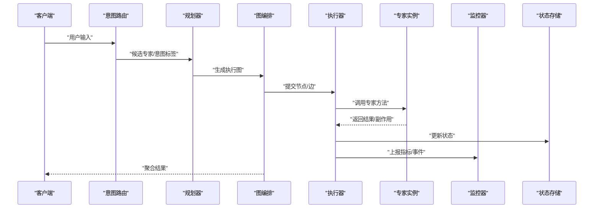
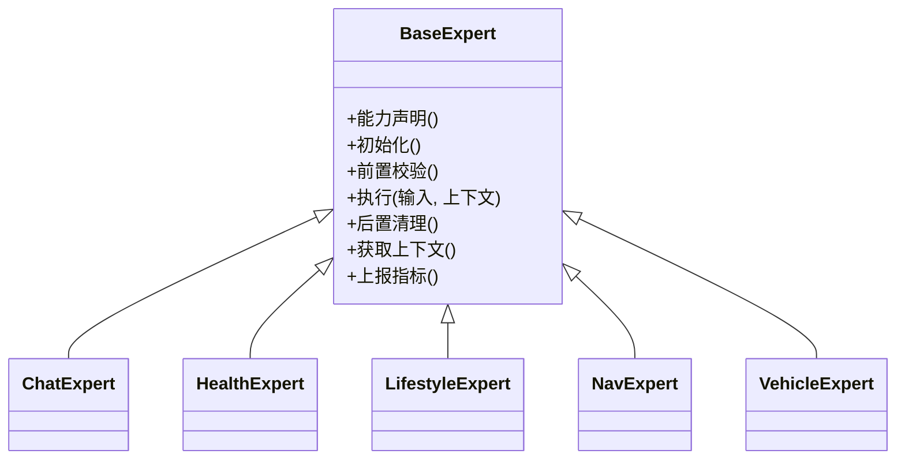
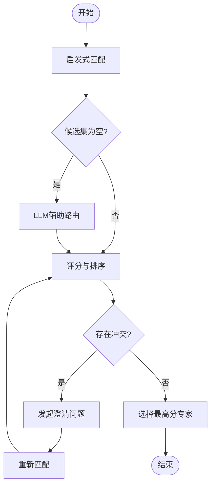
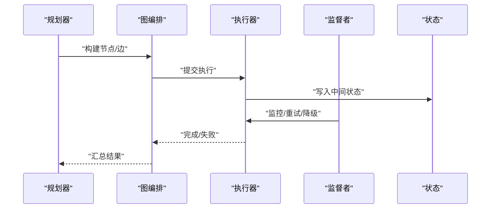
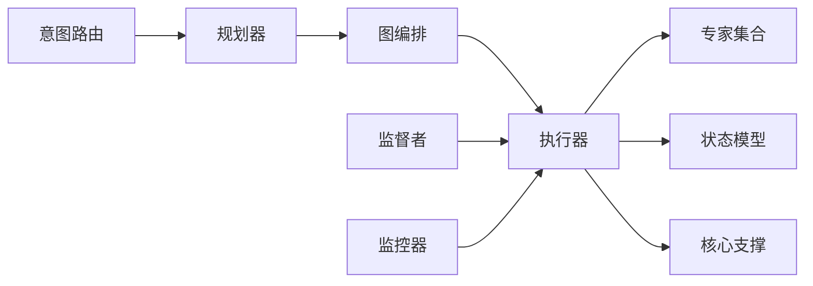

# 专家系统

<cite>
**本文引用的文件**   
- [backend_design/nexus/agent/experts/base.py](file://backend_design/nexus/agent/experts/base.py)
- [backend_design/nexus/agent/experts/chat_expert.py](file://backend_design/nexus/agent/experts/chat_expert.py)
- [backend_design/nexus/agent/experts/health_expert.py](file://backend_design/nexus/agent/experts/health_expert.py)
- [backend_design/nexus/agent/experts/lifestyle_expert.py](file://backend_design/nexus/agent/experts/lifestyle_expert.py)
- [backend_design/nexus/agent/experts/nav_expert.py](file://backend_design/nexus/agent/experts/nav_expert.py)
- [backend_design/nexus/agent/experts/vehicle_expert.py](file://backend_design/nexus/agent/experts/vehicle_expert.py)
- [backend_design/nexus/agent/__init__.py](file://backend_design/nexus/agent/__init__.py)
- [backend_design/nexus/agent/executor.py](file://backend_design/nexus/agent/executor.py)
- [backend_design/nexus/agent/graph.py](file://backend_design/nexus/agent/graph.py)
- [backend_design/nexus/agent/planner.py](file://backend_design/nexus/agent/planner.py)
- [backend_design/nexus/agent/responder.py](file://backend_design/nexus/agent/responder.py)
- [backend_design/nexus/agent/reviewer.py](file://backend_design/nexus/agent/reviewer.py)
- [backend_design/nexus/agent/subagent_monitor.py](file://backend_design/nexus/agent/subagent_monitor.py)
- [backend_design/nexus/agent/supervisor_graph.py](file://backend_design/nexus/agent/supervisor_graph.py)
- [backend_design/nexus/intent/router.py](file://backend_design/nexus/intent/router.py)
- [backend_design/nexus/intent/heuristic.py](file://backend_design/nexus/intent/heuristic.py)
- [backend_design/nexus/intent/llm_router.py](file://backend_design/nexus/intent/llm_router.py)
- [backend_design/nexus/models/state.py](file://backend_design/nexus/models/state.py)
- [backend_design/nexus/models/schemas.py](file://backend_design/nexus/models/schemas.py)
- [backend_design/nexus/core/logger.py](file://backend_design/nexus/core/logger.py)
- [backend_design/nexus/core/exceptions.py](file://backend_design/nexus/core/exceptions.py)
</cite>

## 目录
1. [简介](#简介)
2. [项目结构](#项目结构)
3. [核心组件](#核心组件)
4. [架构总览](#架构总览)
5. [详细组件分析](#详细组件分析)
6. [依赖关系分析](#依赖关系分析)
7. [性能考虑](#性能考虑)
8. [故障排查指南](#故障排查指南)
9. [结论](#结论)
10. [附录](#附录)

## 简介
本技术文档聚焦于NexusCockpit的“专家系统”，围绕专家基类设计与各专用专家（聊天、健康、生活方式、导航、车辆）的实现细节展开，系统性说明专家注册机制、能力声明与协作模式，并给出扩展开发指南与最佳实践。文档同时覆盖专家选择策略与冲突解决机制，帮助读者理解从意图路由到专家执行、再到结果整合的全链路流程。

## 项目结构
专家系统位于后端设计目录下的 agent 模块中，采用分层与模块化组织：
- 专家定义与实现：backend_design/nexus/agent/experts
- 编排与调度：backend_design/nexus/agent（planner、graph、executor、supervisor等）
- 意图路由：backend_design/nexus/intent
- 状态与模型：backend_design/nexus/models
- 通用支撑：backend_design/nexus/core（日志、异常等）

```mermaid
graph TB
subgraph "专家层"
base["专家基类<br/>base.py"]
chat["聊天专家<br/>chat_expert.py"]
health["健康专家<br/>health_expert.py"]
lifestyle["生活方式专家<br/>lifestyle_expert.py"]
nav["导航专家<br/>nav_expert.py"]
vehicle["车辆专家<br/>vehicle_expert.py"]
end
subgraph "编排层"
planner["规划器<br/>planner.py"]
graph["图编排<br/>graph.py"]
executor["执行器<br/>executor.py"]
supervisor["监督者图<br/>supervisor_graph.py"]
monitor["子代理监控<br/>subagent_monitor.py"]
end
subgraph "意图层"
router["意图路由<br/>router.py"]
heuristic["启发式路由<br/>heuristic.py"]
llm_router["LLM路由<br/>llm_router.py"]
end
subgraph "模型与核心"
state["状态模型<br/>state.py"]
schemas["数据模式<br/>schemas.py"]
logger["日志<br/>logger.py"]
exceptions["异常<br/>exceptions.py"]
end
base --> chat
base --> health
base --> lifestyle
base --> nav
base --> vehicle
router --> planner
planner --> graph
graph --> executor
executor --> base
supervisor --> planner
monitor --> executor
router --> heuristic
router --> llm_router
planner --> state
executor --> state
executor --> schemas
executor --> logger
executor --> exceptions
```

图表来源
- [backend_design/nexus/agent/experts/base.py](file://backend_design/nexus/agent/experts/base.py)
- [backend_design/nexus/agent/experts/chat_expert.py](file://backend_design/nexus/agent/experts/chat_expert.py)
- [backend_design/nexus/agent/experts/health_expert.py](file://backend_design/nexus/agent/experts/health_expert.py)
- [backend_design/nexus/agent/experts/lifestyle_expert.py](file://backend_design/nexus/agent/experts/lifestyle_expert.py)
- [backend_design/nexus/agent/experts/nav_expert.py](file://backend_design/nexus/agent/experts/nav_expert.py)
- [backend_design/nexus/agent/experts/vehicle_expert.py](file://backend_design/nexus/agent/experts/vehicle_expert.py)
- [backend_design/nexus/agent/planner.py](file://backend_design/nexus/agent/planner.py)
- [backend_design/nexus/agent/graph.py](file://backend_design/nexus/agent/graph.py)
- [backend_design/nexus/agent/executor.py](file://backend_design/nexus/agent/executor.py)
- [backend_design/nexus/agent/supervisor_graph.py](file://backend_design/nexus/agent/supervisor_graph.py)
- [backend_design/nexus/agent/subagent_monitor.py](file://backend_design/nexus/agent/subagent_monitor.py)
- [backend_design/nexus/intent/router.py](file://backend_design/nexus/intent/router.py)
- [backend_design/nexus/intent/heuristic.py](file://backend_design/nexus/intent/heuristic.py)
- [backend_design/nexus/intent/llm_router.py](file://backend_design/nexus/intent/llm_router.py)
- [backend_design/nexus/models/state.py](file://backend_design/nexus/models/state.py)
- [backend_design/nexus/models/schemas.py](file://backend_design/nexus/models/schemas.py)
- [backend_design/nexus/core/logger.py](file://backend_design/nexus/core/logger.py)
- [backend_design/nexus/core/exceptions.py](file://backend_design/nexus/core/exceptions.py)

章节来源
- [backend_design/nexus/agent/experts/base.py](file://backend_design/nexus/agent/experts/base.py)
- [backend_design/nexus/agent/planner.py](file://backend_design/nexus/agent/planner.py)
- [backend_design/nexus/agent/graph.py](file://backend_design/nexus/agent/graph.py)
- [backend_design/nexus/agent/executor.py](file://backend_design/nexus/agent/executor.py)
- [backend_design/nexus/intent/router.py](file://backend_design/nexus/intent/router.py)
- [backend_design/nexus/models/state.py](file://backend_design/nexus/models/state.py)
- [backend_design/nexus/models/schemas.py](file://backend_design/nexus/models/schemas.py)
- [backend_design/nexus/core/logger.py](file://backend_design/nexus/core/logger.py)
- [backend_design/nexus/core/exceptions.py](file://backend_design/nexus/core/exceptions.py)

## 核心组件
- 专家基类：定义专家的统一接口、能力声明、生命周期钩子、上下文访问与错误处理约定，为所有专用专家提供一致的行为契约。
- 专用专家：聊天、健康、生活方式、导航、车辆等，各自实现领域特定的处理逻辑，并通过统一接口参与编排。
- 意图路由：根据用户输入进行意图识别与专家选择，支持启发式规则与LLM辅助决策。
- 编排与执行：规划器生成执行计划，图编排管理节点与边，执行器负责实例化与调用专家，监督者与监控器保障稳定性与可观测性。
- 状态与模型：统一的会话/任务状态结构与数据模式，确保跨组件的数据一致性。
- 核心支撑：日志记录与异常类型，贯穿专家执行全链路。

章节来源
- [backend_design/nexus/agent/experts/base.py](file://backend_design/nexus/agent/experts/base.py)
- [backend_design/nexus/agent/experts/chat_expert.py](file://backend_design/nexus/agent/experts/chat_expert.py)
- [backend_design/nexus/agent/experts/health_expert.py](file://backend_design/nexus/agent/experts/health_expert.py)
- [backend_design/nexus/agent/experts/lifestyle_expert.py](file://backend_design/nexus/agent/experts/lifestyle_expert.py)
- [backend_design/nexus/agent/experts/nav_expert.py](file://backend_design/nexus/agent/experts/nav_expert.py)
- [backend_design/nexus/agent/experts/vehicle_expert.py](file://backend_design/nexus/agent/experts/vehicle_expert.py)
- [backend_design/nexus/intent/router.py](file://backend_design/nexus/intent/router.py)
- [backend_design/nexus/intent/heuristic.py](file://backend_design/nexus/intent/heuristic.py)
- [backend_design/nexus/intent/llm_router.py](file://backend_design/nexus/intent/llm_router.py)
- [backend_design/nexus/agent/planner.py](file://backend_design/nexus/agent/planner.py)
- [backend_design/nexus/agent/graph.py](file://backend_design/nexus/agent/graph.py)
- [backend_design/nexus/agent/executor.py](file://backend_design/nexus/agent/executor.py)
- [backend_design/nexus/agent/supervisor_graph.py](file://backend_design/nexus/agent/supervisor_graph.py)
- [backend_design/nexus/agent/subagent_monitor.py](file://backend_design/nexus/agent/subagent_monitor.py)
- [backend_design/nexus/models/state.py](file://backend_design/nexus/models/state.py)
- [backend_design/nexus/models/schemas.py](file://backend_design/nexus/models/schemas.py)
- [backend_design/nexus/core/logger.py](file://backend_design/nexus/core/logger.py)
- [backend_design/nexus/core/exceptions.py](file://backend_design/nexus/core/exceptions.py)

## 架构总览
专家系统遵循“意图识别→专家选择→计划编排→执行与监控→结果整合”的分层架构。意图路由将自然语言或结构化输入映射到候选专家集合；规划器基于当前状态与约束生成执行图；执行器按图调度专家实例，并在必要时通过监督者进行重试、降级或回滚；监控器采集指标与事件，供可观测性与诊断使用。



图表来源
- [backend_design/nexus/intent/router.py](file://backend_design/nexus/intent/router.py)
- [backend_design/nexus/agent/planner.py](file://backend_design/nexus/agent/planner.py)
- [backend_design/nexus/agent/graph.py](file://backend_design/nexus/agent/graph.py)
- [backend_design/nexus/agent/executor.py](file://backend_design/nexus/agent/executor.py)
- [backend_design/nexus/agent/subagent_monitor.py](file://backend_design/nexus/agent/subagent_monitor.py)
- [backend_design/nexus/models/state.py](file://backend_design/nexus/models/state.py)

## 详细组件分析

### 专家基类与能力声明
专家基类定义了专家的统一契约，包括：
- 能力声明：描述专家能处理的意图域、所需上下文、资源依赖等元信息。
- 生命周期钩子：初始化、前置校验、执行、后置清理等阶段。
- 上下文访问：读取会话、用户、设备、车辆等上下文信息。
- 错误处理：标准化异常类型与恢复策略。
- 注册机制：通过注册表暴露能力，供路由与编排发现。



图表来源
- [backend_design/nexus/agent/experts/base.py](file://backend_design/nexus/agent/experts/base.py)
- [backend_design/nexus/agent/experts/chat_expert.py](file://backend_design/nexus/agent/experts/chat_expert.py)
- [backend_design/nexus/agent/experts/health_expert.py](file://backend_design/nexus/agent/experts/health_expert.py)
- [backend_design/nexus/agent/experts/lifestyle_expert.py](file://backend_design/nexus/agent/experts/lifestyle_expert.py)
- [backend_design/nexus/agent/experts/nav_expert.py](file://backend_design/nexus/agent/experts/nav_expert.py)
- [backend_design/nexus/agent/experts/vehicle_expert.py](file://backend_design/nexus/agent/experts/vehicle_expert.py)

章节来源
- [backend_design/nexus/agent/experts/base.py](file://backend_design/nexus/agent/experts/base.py)

### 聊天专家
职责与特性：
- 处理闲聊、问答、多轮对话引导与澄清。
- 维护对话历史与短期记忆，结合上下文进行连贯回复。
- 与其他专家协作时，作为对话协调者，转发复杂请求至对应专家。

关键实现要点：
- 对话状态管理与澄清策略。
- 安全过滤与敏感内容处理。
- 输出格式化与TTS适配。

章节来源
- [backend_design/nexus/agent/experts/chat_expert.py](file://backend_design/nexus/agent/experts/chat_expert.py)

### 健康专家
职责与特性：
- 健康数据采集与分析建议（如心率、睡眠、运动）。
- 个性化健康提醒与目标追踪。
- 与生活方式专家协同，形成综合健康画像。

关键实现要点：
- 数据源接入与校验。
- 阈值与规则引擎。
- 隐私保护与最小化数据原则。

章节来源
- [backend_design/nexus/agent/experts/health_expert.py](file://backend_design/nexus/agent/experts/health_expert.py)

### 生活方式专家
职责与特性：
- 习惯养成、日程安排、饮食与作息建议。
- 与健康专家联动，提供跨维度建议。
- 支持用户偏好学习与反馈闭环。

关键实现要点：
- 偏好建模与推荐策略。
- 与外部服务（日历、提醒）集成。
- 行为变更的可解释性。

章节来源
- [backend_design/nexus/agent/experts/lifestyle_expert.py](file://backend_design/nexus/agent/experts/lifestyle_expert.py)

### 导航专家
职责与特性：
- 目的地解析、路径规划与实时路况。
- 与车辆专家协作控制车载导航与显示。
- 支持多模态输入（语音、地图点击）。

关键实现要点：
- 地理编码与POI检索。
- 动态重规划与ETA估算。
- 与车机系统的低延迟交互。

章节来源
- [backend_design/nexus/agent/experts/nav_expert.py](file://backend_design/nexus/agent/experts/nav_expert.py)

### 车辆专家
职责与特性：
- 车辆状态查询与控制（空调、车窗、座椅、媒体等）。
- 与导航专家协作完成端到端出行体验。
- 安全边界与权限控制。

关键实现要点：
- 设备抽象与命令封装。
- 幂等性与失败重试。
- 操作审计与回滚。

章节来源
- [backend_design/nexus/agent/experts/vehicle_expert.py](file://backend_design/nexus/agent/experts/vehicle_expert.py)

### 专家注册机制与发现
- 注册入口：在专家模块初始化时，将专家能力写入全局注册表。
- 能力索引：以意图标签、领域关键词、依赖条件等为键，建立快速查找。
- 版本兼容：支持能力演进与向后兼容。

章节来源
- [backend_design/nexus/agent/experts/__init__.py](file://backend_design/nexus/agent/experts/__init__.py)
- [backend_design/nexus/agent/__init__.py](file://backend_design/nexus/agent/__init__.py)

### 专家间通信与协作模式
- 直接调用：通过共享上下文或消息总线进行同步/异步通信。
- 编排驱动：由图编排决定调用顺序与分支，避免紧耦合。
- 事件驱动：专家发布事件，其他专家订阅响应，解耦业务。

章节来源
- [backend_design/nexus/agent/graph.py](file://backend_design/nexus/agent/graph.py)
- [backend_design/nexus/agent/executor.py](file://backend_design/nexus/agent/executor.py)
- [backend_design/nexus/agent/supervisor_graph.py](file://backend_design/nexus/agent/supervisor_graph.py)

### 专家选择策略与冲突解决
- 启发式路由：基于关键词、规则与优先级快速匹配候选专家。
- LLM辅助：对模糊意图进行语义理解与打分排序。
- 冲突解决：当多个专家匹配时，依据能力权重、上下文完备度与成功率历史进行选择；必要时引入澄清问题。



图表来源
- [backend_design/nexus/intent/heuristic.py](file://backend_design/nexus/intent/heuristic.py)
- [backend_design/nexus/intent/llm_router.py](file://backend_design/nexus/intent/llm_router.py)
- [backend_design/nexus/intent/router.py](file://backend_design/nexus/intent/router.py)

章节来源
- [backend_design/nexus/intent/router.py](file://backend_design/nexus/intent/router.py)
- [backend_design/nexus/intent/heuristic.py](file://backend_design/nexus/intent/heuristic.py)
- [backend_design/nexus/intent/llm_router.py](file://backend_design/nexus/intent/llm_router.py)

### 执行流程与状态流转
- 规划器根据意图与上下文生成执行图。
- 执行器按图调度专家，更新状态并上报指标。
- 监督者在异常或超时情况下进行重试、降级或终止。



图表来源
- [backend_design/nexus/agent/planner.py](file://backend_design/nexus/agent/planner.py)
- [backend_design/nexus/agent/graph.py](file://backend_design/nexus/agent/graph.py)
- [backend_design/nexus/agent/executor.py](file://backend_design/nexus/agent/executor.py)
- [backend_design/nexus/agent/supervisor_graph.py](file://backend_design/nexus/agent/supervisor_graph.py)
- [backend_design/nexus/models/state.py](file://backend_design/nexus/models/state.py)

章节来源
- [backend_design/nexus/agent/planner.py](file://backend_design/nexus/agent/planner.py)
- [backend_design/nexus/agent/graph.py](file://backend_design/nexus/agent/graph.py)
- [backend_design/nexus/agent/executor.py](file://backend_design/nexus/agent/executor.py)
- [backend_design/nexus/agent/supervisor_graph.py](file://backend_design/nexus/agent/supervisor_graph.py)
- [backend_design/nexus/models/state.py](file://backend_design/nexus/models/state.py)

### 自定义专家开发与示例
创建自定义专家的步骤：
- 继承专家基类，实现能力声明与执行方法。
- 在模块初始化中完成注册，使路由与编排可发现。
- 编写单元测试，覆盖正常路径与异常路径。
- 在编排图中添加节点，配置边与条件分支。

参考路径（不包含代码内容）：
- 基类与能力声明：[backend_design/nexus/agent/experts/base.py](file://backend_design/nexus/agent/experts/base.py)
- 注册入口：[backend_design/nexus/agent/experts/__init__.py](file://backend_design/nexus/agent/experts/__init__.py)
- 执行与状态：[backend_design/nexus/agent/executor.py](file://backend_design/nexus/agent/executor.py), [backend_design/nexus/models/state.py](file://backend_design/nexus/models/state.py)
- 编排与监督：[backend_design/nexus/agent/graph.py](file://backend_design/nexus/agent/graph.py), [backend_design/nexus/agent/supervisor_graph.py](file://backend_design/nexus/agent/supervisor_graph.py)

章节来源
- [backend_design/nexus/agent/experts/base.py](file://backend_design/nexus/agent/experts/base.py)
- [backend_design/nexus/agent/experts/__init__.py](file://backend_design/nexus/agent/experts/__init__.py)
- [backend_design/nexus/agent/executor.py](file://backend_design/nexus/agent/executor.py)
- [backend_design/nexus/agent/graph.py](file://backend_design/nexus/agent/graph.py)
- [backend_design/nexus/agent/supervisor_graph.py](file://backend_design/nexus/agent/supervisor_graph.py)
- [backend_design/nexus/models/state.py](file://backend_design/nexus/models/state.py)

## 依赖关系分析
专家系统与意图路由、编排执行、状态模型之间存在清晰的依赖边界：
- 意图路由依赖启发式与LLM路由，输出候选专家集合。
- 规划器与图编排依赖状态模型，保证执行过程可追踪。
- 执行器依赖专家基类与核心支撑（日志、异常），确保健壮性。
- 监督者与监控器独立于具体专家，关注横切关注点。



图表来源
- [backend_design/nexus/intent/router.py](file://backend_design/nexus/intent/router.py)
- [backend_design/nexus/agent/planner.py](file://backend_design/nexus/agent/planner.py)
- [backend_design/nexus/agent/graph.py](file://backend_design/nexus/agent/graph.py)
- [backend_design/nexus/agent/executor.py](file://backend_design/nexus/agent/executor.py)
- [backend_design/nexus/models/state.py](file://backend_design/nexus/models/state.py)
- [backend_design/nexus/core/logger.py](file://backend_design/nexus/core/logger.py)
- [backend_design/nexus/core/exceptions.py](file://backend_design/nexus/core/exceptions.py)

章节来源
- [backend_design/nexus/intent/router.py](file://backend_design/nexus/intent/router.py)
- [backend_design/nexus/agent/planner.py](file://backend_design/nexus/agent/planner.py)
- [backend_design/nexus/agent/graph.py](file://backend_design/nexus/agent/graph.py)
- [backend_design/nexus/agent/executor.py](file://backend_design/nexus/agent/executor.py)
- [backend_design/nexus/models/state.py](file://backend_design/nexus/models/state.py)
- [backend_design/nexus/core/logger.py](file://backend_design/nexus/core/logger.py)
- [backend_design/nexus/core/exceptions.py](file://backend_design/nexus/core/exceptions.py)

## 性能考虑
- 专家执行应尽可能无状态或轻量状态，减少锁竞争与序列化开销。
- 对外部服务的调用需具备超时、熔断与重试策略，避免雪崩。
- 图编排应避免过深链路与循环依赖，保持执行路径短且可并行。
- 指标上报与日志采样需平衡可观测性与性能影响。

## 故障排查指南
- 常见异常类型：参数校验失败、外部服务不可用、权限不足、超时等。
- 定位步骤：
  - 查看执行器日志与状态快照，确认失败节点与输入上下文。
  - 检查意图路由的候选集与评分，验证选择是否合理。
  - 审查专家前置校验与后置清理，确认副作用是否被正确回滚。
  - 使用监控器的事件流与指标，定位热点与瓶颈。
- 恢复策略：
  - 针对可重试错误进行指数退避重试。
  - 对不可恢复错误进行降级与提示用户。
  - 对部分失败进行补偿事务或人工介入。

章节来源
- [backend_design/nexus/core/exceptions.py](file://backend_design/nexus/core/exceptions.py)
- [backend_design/nexus/core/logger.py](file://backend_design/nexus/core/logger.py)
- [backend_design/nexus/agent/executor.py](file://backend_design/nexus/agent/executor.py)
- [backend_design/nexus/agent/subagent_monitor.py](file://backend_design/nexus/agent/subagent_monitor.py)

## 结论
专家系统通过统一的基类契约、清晰的注册与发现机制、灵活的编排与监督，实现了高内聚、低耦合的领域能力组合。意图路由与冲突解决保障了选择的准确性与鲁棒性，状态与模型确保了可追踪与可恢复。在此基础上，开发者可以快速扩展新专家，并以最小代价融入现有流程。

## 附录
- 最佳实践：
  - 明确能力边界与依赖，避免专家间紧耦合。
  - 使用标准化的输入输出模式，便于测试与复用。
  - 在专家内部实现幂等与可回滚的副作用。
  - 完善日志与指标，覆盖关键路径与异常分支。
  - 持续优化路由策略，结合A/B测试评估效果。