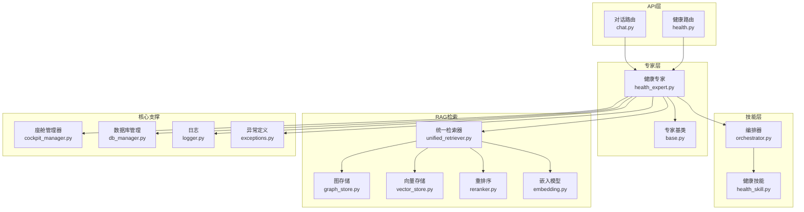
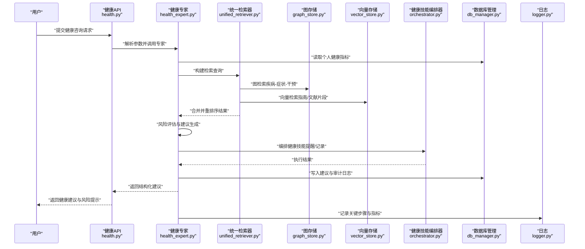
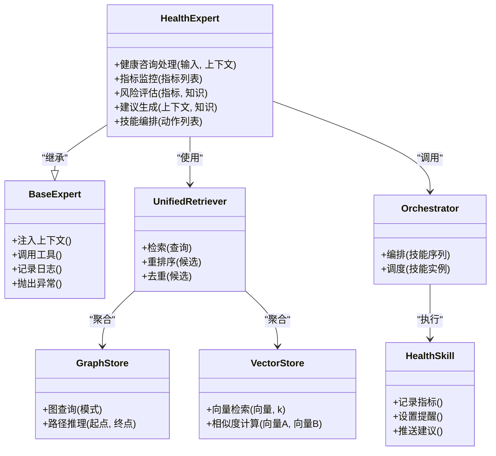
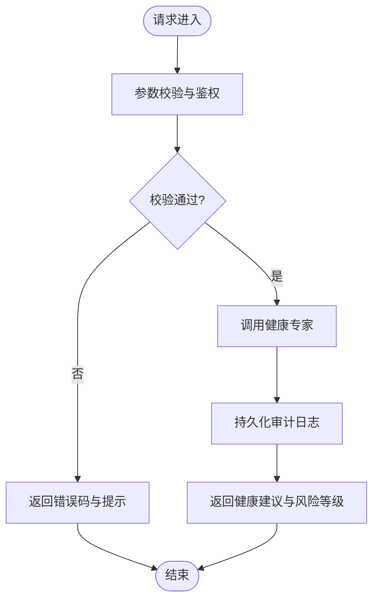
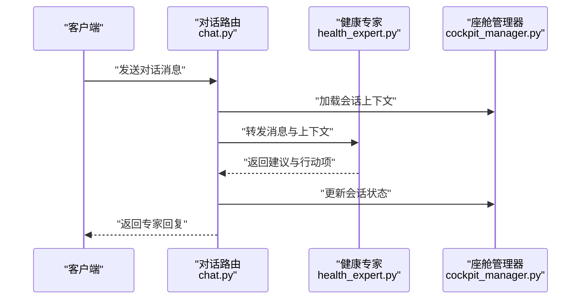
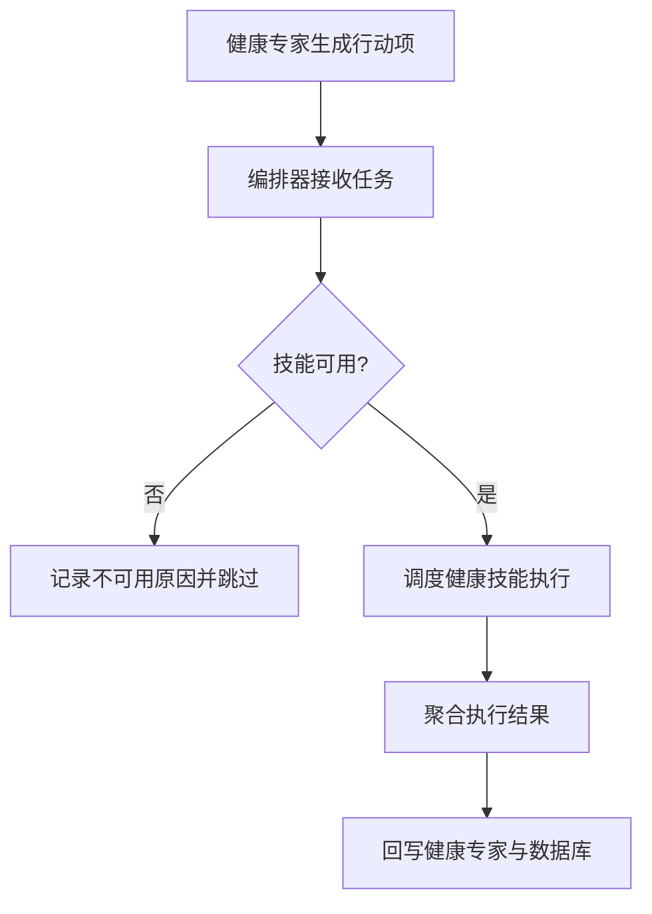
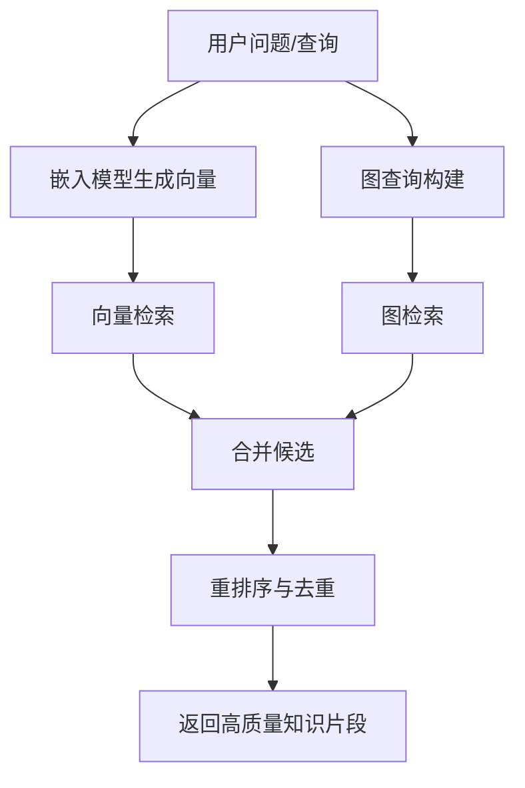
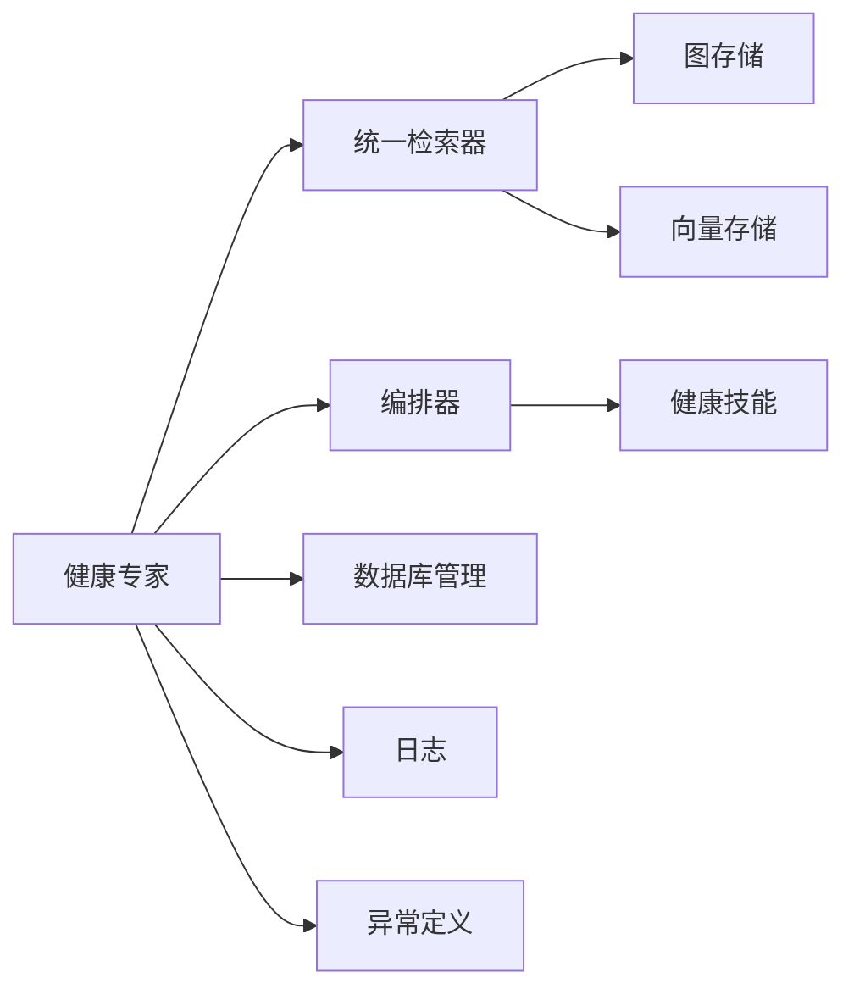

# 健康专家

<cite>
**本文引用的文件**   
- [health_expert.py](file://backend_design/nexus/agent/experts/health_expert.py)
- [base.py](file://backend_design/nexus/agent/experts/base.py)
- [chat.py](file://backend_design/nexus/api/routes/chat.py)
- [health.py](file://backend_design/nexus/api/routes/health.py)
- [orchestrator.py](file://backend_design/nexus/skills/orchestrator.py)
- [health_skill.py](file://backend_design/nexus/skills/health.py)
- [unified_retriever.py](file://backend_design/nexus/rag/unified_retriever.py)
- [graph_store.py](file://backend_design/nexus/rag/graph_store.py)
- [vector_store.py](file://backend_design/nexus/rag/vector_store.py)
- [reranker.py](file://backend_design/nexus/rag/reranker.py)
- [embedding.py](file://backend_design/nexus/rag/embedding.py)
- [cockpit_manager.py](file://backend_design/nexus/core/cockpit_manager.py)
- [db_manager.py](file://backend_design/nexus/core/db_manager.py)
- [logger.py](file://backend_design/nexus/core/logger.py)
- [exceptions.py](file://backend_design/nexus/core/exceptions.py)
</cite>

## 目录
1. [简介](#简介)
2. [项目结构](#项目结构)
3. [核心组件](#核心组件)
4. [架构总览](#架构总览)
5. [详细组件分析](#详细组件分析)
6. [依赖关系分析](#依赖关系分析)
7. [性能考虑](#性能考虑)
8. [故障排查指南](#故障排查指南)
9. [结论](#结论)
10. [附录](#附录)

## 简介
本技术文档聚焦于NexusCockpit中的“健康专家”能力，系统阐述其健康咨询逻辑、知识图谱与医学知识库集成方式、健康指标监控机制，以及与技能系统的协作和数据同步策略。文档同时覆盖健康数据安全处理与隐私保护最佳实践，并提供面向开发与运维的排障指引。

## 项目结构
与健康专家相关的代码主要分布在以下模块：
- 专家层：健康专家实现与专家基类
- API路由：健康查询入口与对话路由
- 技能编排：健康技能与编排器
- RAG检索：统一检索器、图存储、向量存储、重排序与嵌入
- 核心支撑：会话/状态管理、数据库访问、日志与异常

图表来源
- [chat.py](file://backend_design/nexus/api/routes/chat.py)
- [health.py](file://backend_design/nexus/api/routes/health.py)
- [health_expert.py](file://backend_design/nexus/agent/experts/health_expert.py)
- [base.py](file://backend_design/nexus/agent/experts/base.py)
- [orchestrator.py](file://backend_design/nexus/skills/orchestrator.py)
- [health_skill.py](file://backend_design/nexus/skills/health.py)
- [unified_retriever.py](file://backend_design/nexus/rag/unified_retriever.py)
- [graph_store.py](file://backend_design/nexus/rag/graph_store.py)
- [vector_store.py](file://backend_design/nexus/rag/vector_store.py)
- [reranker.py](file://backend_design/nexus/rag/reranker.py)
- [embedding.py](file://backend_design/nexus/rag/embedding.py)
- [cockpit_manager.py](file://backend_design/nexus/core/cockpit_manager.py)
- [db_manager.py](file://backend_design/nexus/core/db_manager.py)
- [logger.py](file://backend_design/nexus/core/logger.py)
- [exceptions.py](file://backend_design/nexus/core/exceptions.py)

章节来源
- [health_expert.py](file://backend_design/nexus/agent/experts/health_expert.py)
- [base.py](file://backend_design/nexus/agent/experts/base.py)
- [chat.py](file://backend_design/nexus/api/routes/chat.py)
- [health.py](file://backend_design/nexus/api/routes/health.py)
- [orchestrator.py](file://backend_design/nexus/skills/orchestrator.py)
- [health_skill.py](file://backend_design/nexus/skills/health.py)
- [unified_retriever.py](file://backend_design/nexus/rag/unified_retriever.py)
- [graph_store.py](file://backend_design/nexus/rag/graph_store.py)
- [vector_store.py](file://backend_design/nexus/rag/vector_store.py)
- [reranker.py](file://backend_design/nexus/rag/reranker.py)
- [embedding.py](file://backend_design/nexus/rag/embedding.py)
- [cockpit_manager.py](file://backend_design/nexus/core/cockpit_manager.py)
- [db_manager.py](file://backend_design/nexus/core/db_manager.py)
- [logger.py](file://backend_design/nexus/core/logger.py)
- [exceptions.py](file://backend_design/nexus/core/exceptions.py)

## 核心组件
- 健康专家（HealthExpert）
  - 职责：接收用户健康相关问题，结合个人健康数据、医学知识库与上下文信息，生成个性化建议与风险评估，并协调技能执行具体动作（如提醒、记录等）。
  - 关键流程：意图识别与参数抽取 → 健康数据读取 → 知识检索（RAG）→ 风险判定与建议生成 → 结果回写与通知。
- 专家基类（Base Expert）
  - 职责：提供专家通用能力（上下文注入、工具调用、日志与异常封装、权限校验等），健康专家继承该基类以复用共性逻辑。
- 健康路由（Health API）
  - 职责：暴露健康相关REST接口，负责请求校验、鉴权、限流、参数标准化与响应序列化。
- 对话路由（Chat API）
  - 职责：将自然语言对话分发至健康专家或其他专家，维护会话上下文与多轮交互。
- 健康技能与编排器
  - 职责：健康技能封装可执行的健康操作（如记录指标、设置提醒、获取设备数据等），编排器负责按策略调度与组合多个技能。
- RAG检索子系统
  - 职责：统一检索器聚合图数据库与向量数据库的检索结果，并进行重排序与去重；嵌入模型用于文本向量化；图存储承载健康领域知识图谱；向量存储承载医学文献与指南片段。
- 核心支撑
  - 座舱管理器：维护用户会话、上下文与状态。
  - 数据库管理：持久化健康指标、建议历史与审计日志。
  - 日志与异常：统一日志输出与异常类型定义。

章节来源
- [health_expert.py](file://backend_design/nexus/agent/experts/health_expert.py)
- [base.py](file://backend_design/nexus/agent/experts/base.py)
- [health.py](file://backend_design/nexus/api/routes/health.py)
- [chat.py](file://backend_design/nexus/api/routes/chat.py)
- [orchestrator.py](file://backend_design/nexus/skills/orchestrator.py)
- [health_skill.py](file://backend_design/nexus/skills/health.py)
- [unified_retriever.py](file://backend_design/nexus/rag/unified_retriever.py)
- [graph_store.py](file://backend_design/nexus/rag/graph_store.py)
- [vector_store.py](file://backend_design/nexus/rag/vector_store.py)
- [reranker.py](file://backend_design/nexus/rag/reranker.py)
- [embedding.py](file://backend_design/nexus/rag/embedding.py)
- [cockpit_manager.py](file://backend_design/nexus/core/cockpit_manager.py)
- [db_manager.py](file://backend_design/nexus/core/db_manager.py)
- [logger.py](file://backend_design/nexus/core/logger.py)
- [exceptions.py](file://backend_design/nexus/core/exceptions.py)

## 架构总览
健康专家采用“专家+技能+RAG”的分层架构：
- 接入层：API路由负责鉴权、限流与协议适配。
- 专家层：健康专家作为决策中枢，整合上下文、知识与数据，输出建议与行动项。
- 技能层：通过编排器按需调用健康技能完成具体任务。
- 知识层：RAG统一检索图与向量库，保证建议的科学性与时效性。
- 数据层：持久化健康指标、建议历史与审计日志，支持趋势分析与回溯。

图表来源
- [health.py](file://backend_design/nexus/api/routes/health.py)
- [health_expert.py](file://backend_design/nexus/agent/experts/health_expert.py)
- [unified_retriever.py](file://backend_design/nexus/rag/unified_retriever.py)
- [graph_store.py](file://backend_design/nexus/rag/graph_store.py)
- [vector_store.py](file://backend_design/nexus/rag/vector_store.py)
- [orchestrator.py](file://backend_design/nexus/skills/orchestrator.py)
- [db_manager.py](file://backend_design/nexus/core/db_manager.py)
- [logger.py](file://backend_design/nexus/core/logger.py)

## 详细组件分析

### 健康专家（HealthExpert）
- 设计要点
  - 继承专家基类，复用上下文注入、工具调用与异常封装。
  - 健康数据解读：从数据库或外部设备拉取指标（如心率、血压、血糖、睡眠时长等），进行阈值与趋势判断。
  - 个性化建议生成：结合用户画像、历史行为与当前指标，调用RAG检索医学知识，生成可执行建议。
  - 健康风险评估：基于规则与知识图谱路径推理，输出风险等级与预警级别。
  - 技能协作：通过编排器触发健康技能（如记录指标、设置用药提醒、推送运动建议）。
- 关键方法（概念说明）
  - 健康咨询处理：解析输入、加载上下文、检索知识、生成建议与风险报告。
  - 指标监控：周期性或事件驱动地检查指标是否越界，触发告警与干预。
  - 建议回写：将建议与执行结果持久化，便于后续追踪与评估。

图表来源
- [health_expert.py](file://backend_design/nexus/agent/experts/health_expert.py)
- [base.py](file://backend_design/nexus/agent/experts/base.py)
- [unified_retriever.py](file://backend_design/nexus/rag/unified_retriever.py)
- [graph_store.py](file://backend_design/nexus/rag/graph_store.py)
- [vector_store.py](file://backend_design/nexus/rag/vector_store.py)
- [orchestrator.py](file://backend_design/nexus/skills/orchestrator.py)
- [health_skill.py](file://backend_design/nexus/skills/health.py)

章节来源
- [health_expert.py](file://backend_design/nexus/agent/experts/health_expert.py)
- [base.py](file://backend_design/nexus/agent/experts/base.py)
- [unified_retriever.py](file://backend_design/nexus/rag/unified_retriever.py)
- [graph_store.py](file://backend_design/nexus/rag/graph_store.py)
- [vector_store.py](file://backend_design/nexus/rag/vector_store.py)
- [orchestrator.py](file://backend_design/nexus/skills/orchestrator.py)
- [health_skill.py](file://backend_design/nexus/skills/health.py)

### 健康API路由（health.py）
- 职责
  - 提供健康咨询与指标上报接口。
  - 负责请求校验、鉴权、限流、参数标准化与错误码映射。
- 典型流程
  - 接收请求 → 校验与鉴权 → 调用健康专家 → 持久化审计日志 → 返回结构化响应。

图表来源
- [health.py](file://backend_design/nexus/api/routes/health.py)
- [health_expert.py](file://backend_design/nexus/agent/experts/health_expert.py)
- [db_manager.py](file://backend_design/nexus/core/db_manager.py)
- [logger.py](file://backend_design/nexus/core/logger.py)

章节来源
- [health.py](file://backend_design/nexus/api/routes/health.py)
- [db_manager.py](file://backend_design/nexus/core/db_manager.py)
- [logger.py](file://backend_design/nexus/core/logger.py)

### 对话路由（chat.py）
- 职责
  - 将自然语言对话分发到健康专家或其他专家。
  - 维护会话上下文，支持多轮交互与澄清。
- 协作模式
  - 对话路由根据意图识别结果选择健康专家，传递上下文与历史消息，接收专家回复后更新会话状态。

图表来源
- [chat.py](file://backend_design/nexus/api/routes/chat.py)
- [health_expert.py](file://backend_design/nexus/agent/experts/health_expert.py)
- [cockpit_manager.py](file://backend_design/nexus/core/cockpit_manager.py)

章节来源
- [chat.py](file://backend_design/nexus/api/routes/chat.py)
- [health_expert.py](file://backend_design/nexus/agent/experts/health_expert.py)
- [cockpit_manager.py](file://backend_design/nexus/core/cockpit_manager.py)

### 健康技能与编排器（skills/health.py, skills/orchestrator.py）
- 健康技能
  - 封装可执行的健康操作：记录指标、设置提醒、推送建议、联动设备等。
- 编排器
  - 负责技能序列编排、并发控制、失败重试与结果聚合。
- 协作模式
  - 健康专家在生成建议时，将需要执行的行动项交给编排器，编排器调度相应技能并回写执行结果。

图表来源
- [health_skill.py](file://backend_design/nexus/skills/health.py)
- [orchestrator.py](file://backend_design/nexus/skills/orchestrator.py)
- [health_expert.py](file://backend_design/nexus/agent/experts/health_expert.py)
- [db_manager.py](file://backend_design/nexus/core/db_manager.py)

章节来源
- [health_skill.py](file://backend_design/nexus/skills/health.py)
- [orchestrator.py](file://backend_design/nexus/skills/orchestrator.py)
- [health_expert.py](file://backend_design/nexus/agent/experts/health_expert.py)
- [db_manager.py](file://backend_design/nexus/core/db_manager.py)

### RAG检索子系统（unified_retriever.py, graph_store.py, vector_store.py, reranker.py, embedding.py）
- 统一检索器
  - 聚合图与向量检索结果，进行重排序与去重，提升相关性。
- 图存储
  - 承载健康领域知识图谱（疾病-症状-干预-药物-生活方式等），支持路径推理与模式匹配。
- 向量存储
  - 存储医学指南、文献片段与临床共识，支持语义检索。
- 重排序与嵌入
  - 重排序优化候选质量；嵌入模型将文本转换为向量以便相似性检索。

图表来源
- [unified_retriever.py](file://backend_design/nexus/rag/unified_retriever.py)
- [graph_store.py](file://backend_design/nexus/rag/graph_store.py)
- [vector_store.py](file://backend_design/nexus/rag/vector_store.py)
- [reranker.py](file://backend_design/nexus/rag/reranker.py)
- [embedding.py](file://backend_design/nexus/rag/embedding.py)

章节来源
- [unified_retriever.py](file://backend_design/nexus/rag/unified_retriever.py)
- [graph_store.py](file://backend_design/nexus/rag/graph_store.py)
- [vector_store.py](file://backend_design/nexus/rag/vector_store.py)
- [reranker.py](file://backend_design/nexus/rag/reranker.py)
- [embedding.py](file://backend_design/nexus/rag/embedding.py)

## 依赖关系分析
- 耦合与内聚
  - 健康专家对RAG与技能编排存在较强依赖，但通过接口抽象保持良好内聚。
  - 路由层仅负责协议与校验，业务逻辑集中在专家层，降低耦合。
- 外部依赖
  - 图数据库与向量数据库为外部服务，需关注连接池、超时与重试策略。
  - 嵌入与重排序模型可能为本地或远程服务，需考虑延迟与降级。
- 潜在循环依赖
  - 专家与编排器之间通过明确接口调用，避免循环依赖。
  - 若出现间接循环，应引入事件总线或异步队列解耦。

图表来源
- [health_expert.py](file://backend_design/nexus/agent/experts/health_expert.py)
- [unified_retriever.py](file://backend_design/nexus/rag/unified_retriever.py)
- [graph_store.py](file://backend_design/nexus/rag/graph_store.py)
- [vector_store.py](file://backend_design/nexus/rag/vector_store.py)
- [orchestrator.py](file://backend_design/nexus/skills/orchestrator.py)
- [health_skill.py](file://backend_design/nexus/skills/health.py)
- [db_manager.py](file://backend_design/nexus/core/db_manager.py)
- [logger.py](file://backend_design/nexus/core/logger.py)
- [exceptions.py](file://backend_design/nexus/core/exceptions.py)

章节来源
- [health_expert.py](file://backend_design/nexus/agent/experts/health_expert.py)
- [unified_retriever.py](file://backend_design/nexus/rag/unified_retriever.py)
- [graph_store.py](file://backend_design/nexus/rag/graph_store.py)
- [vector_store.py](file://backend_design/nexus/rag/vector_store.py)
- [orchestrator.py](file://backend_design/nexus/skills/orchestrator.py)
- [health_skill.py](file://backend_design/nexus/skills/health.py)
- [db_manager.py](file://backend_design/nexus/core/db_manager.py)
- [logger.py](file://backend_design/nexus/core/logger.py)
- [exceptions.py](file://backend_design/nexus/core/exceptions.py)

## 性能考虑
- 检索优化
  - 缓存高频查询结果，减少图与向量库压力。
  - 合理设置k值与重排序阈值，平衡召回率与延迟。
- 并发与限流
  - 对健康API实施限流与熔断，防止雪崩。
  - 编排器对技能执行进行并发控制与超时管理。
- 数据持久化
  - 批量写入健康指标与建议历史，减少IO次数。
  - 审计日志异步落盘，避免阻塞主流程。
- 模型与服务
  - 嵌入与重排序模型采用批处理与连接池，降低延迟。
  - 对远端模型服务增加重试与降级策略。

[本节为通用性能指导，不直接分析具体文件]

## 故障排查指南
- 常见问题定位
  - 健康API返回错误码：检查鉴权、限流与参数校验逻辑。
  - 健康专家无建议输出：确认RAG检索是否返回有效结果，检查图与向量库连通性。
  - 技能执行失败：查看编排器日志与技能可用性，确认外部设备或服务状态。
  - 指标未更新：核对数据库写入与定时任务是否正常。
- 日志与异常
  - 使用统一日志记录关键步骤与指标，便于回溯。
  - 使用异常定义区分业务异常与系统异常，便于上层捕获与恢复。

章节来源
- [logger.py](file://backend_design/nexus/core/logger.py)
- [exceptions.py](file://backend_design/nexus/core/exceptions.py)
- [health.py](file://backend_design/nexus/api/routes/health.py)
- [health_expert.py](file://backend_design/nexus/agent/experts/health_expert.py)
- [orchestrator.py](file://backend_design/nexus/skills/orchestrator.py)
- [db_manager.py](file://backend_design/nexus/core/db_manager.py)

## 结论
健康专家通过“专家+技能+RAG”的分层架构，实现了健康数据解读、个性化建议生成与健康风险评估的闭环。借助知识图谱与医学知识库，系统能够提供科学、可解释且可执行的健康建议。配合完善的日志与异常处理、性能优化与隐私保护措施，健康专家可在复杂场景下稳定运行并持续演进。

[本节为总结性内容，不直接分析具体文件]

## 附录

### 健康领域知识图谱建模建议
- 实体与关系
  - 疾病、症状、体征、干预措施、药物、生活方式、设备指标。
  - 关系包括“导致”、“缓解”、“禁忌”、“推荐”、“监测”等。
- 推理与查询
  - 基于路径推理进行风险传播与干预推荐。
  - 结合阈值与趋势进行动态风险评估。

[本节为概念性内容，不直接分析具体文件]

### 健康数据安全与隐私保护最佳实践
- 数据最小化
  - 仅采集必要的健康指标，避免过度收集。
- 传输安全
  - 使用HTTPS与TLS加密传输，确保端到端安全。
- 存储安全
  - 敏感字段加密存储，访问控制与审计日志完备。
- 访问控制
  - 基于角色的权限控制，细粒度授权与最小权限原则。
- 合规与脱敏
  - 遵循医疗数据合规要求，对外展示与共享时进行脱敏处理。
- 生命周期管理
  - 设定数据保留期限与自动清理策略，定期审计与备份。

[本节为通用安全指导，不直接分析具体文件]