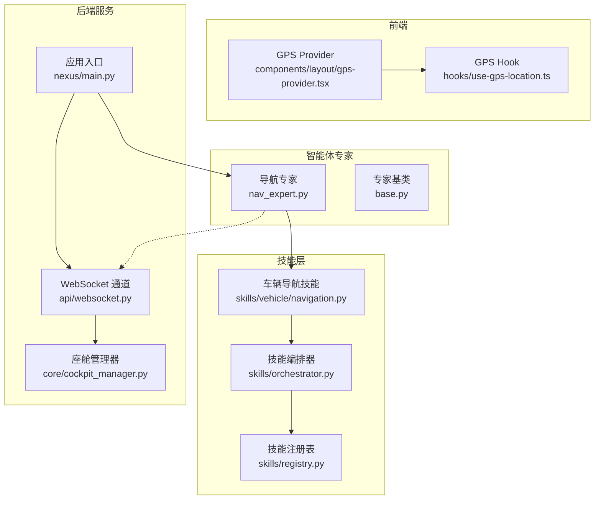
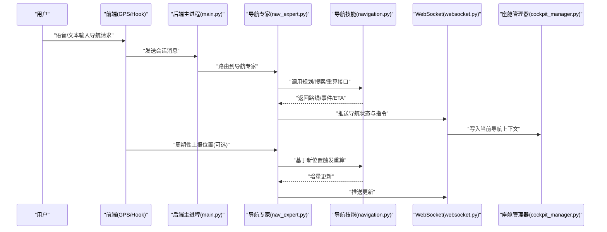
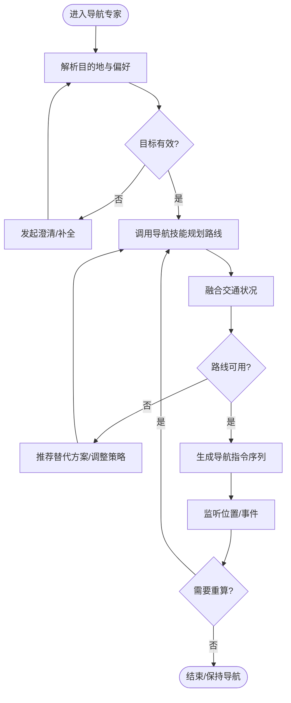
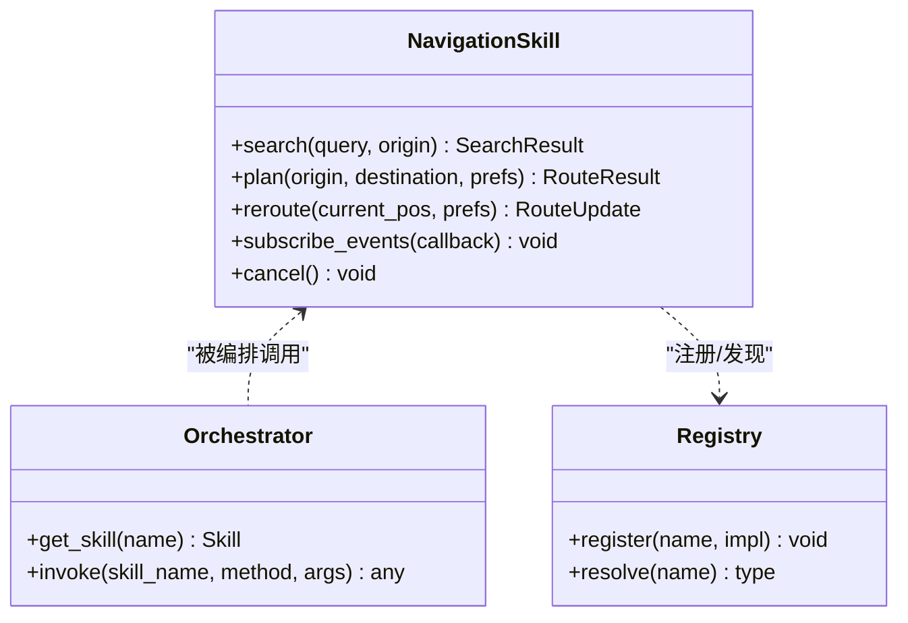
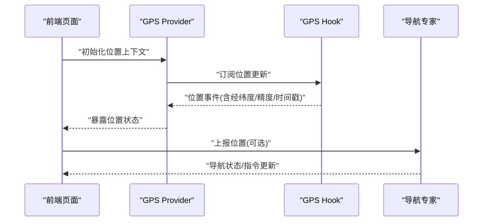
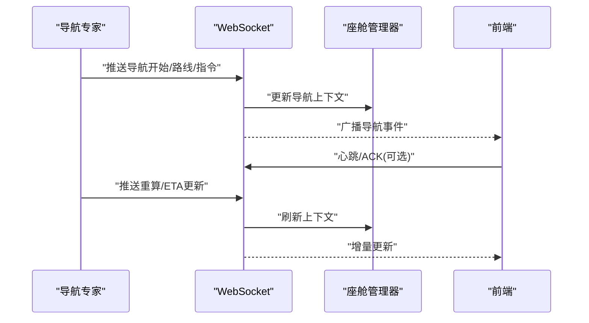
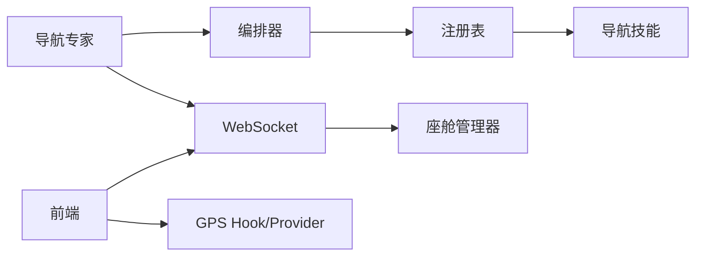

# 导航专家

<cite>
**本文引用的文件**   
- [nav_expert.py](file://backend_design/nexus/agent/experts/nav_expert.py)
- [base.py](file://backend_design/nexus/agent/experts/base.py)
- [navigation.py](file://backend_design/nexus/skills/vehicle/navigation.py)
- [orchestrator.py](file://backend_design/nexus/skills/orchestrator.py)
- [registry.py](file://backend_design/nexus/skills/registry.py)
- [main.py](file://backend_design/nexus/main.py)
- [cockpit_manager.py](file://backend_design/nexus/core/cockpit_manager.py)
- [websocket.py](file://backend_design/nexus/api/websocket.py)
- [use-gps-location.ts](file://frontend_design/src/hooks/use-gps-location.ts)
- [gps-provider.tsx](file://frontend_design/src/components/layout/gps-provider.tsx)
</cite>

## 目录
1. [简介](#简介)
2. [项目结构](#项目结构)
3. [核心组件](#核心组件)
4. [架构总览](#架构总览)
5. [详细组件分析](#详细组件分析)
6. [依赖关系分析](#依赖关系分析)
7. [性能考量](#性能考量)
8. [故障排查指南](#故障排查指南)
9. [结论](#结论)
10. [附录](#附录)

## 简介
本文件面向NexusCockpit的“导航专家”（NavExpert），系统性阐述其导航处理逻辑与协作模式，覆盖目的地解析、路线规划、交通状况分析与实时导航指导；记录地图API集成、位置服务管理与导航状态同步机制；并提供导航指令处理与路径优化算法的实现要点、与车辆导航技能的协作方式、以及精度优化与用户体验改进建议。

## 项目结构
围绕导航能力的相关代码分布在以下模块：
- 智能体专家层：负责意图识别后的导航任务编排与决策
- 技能层：封装对车辆导航能力的调用与结果回传
- 前端：提供GPS定位数据源与导航展示交互
- 网关与WebSocket：承载前后端实时通信与状态推送

图表来源
- [nav_expert.py:1-200](file://backend_design/nexus/agent/experts/nav_expert.py#L1-L200)
- [base.py:1-120](file://backend_design/nexus/agent/experts/base.py#L1-L120)
- [navigation.py:1-200](file://backend_design/nexus/skills/vehicle/navigation.py#L1-L200)
- [orchestrator.py:1-120](file://backend_design/nexus/skills/orchestrator.py#L1-L120)
- [registry.py:1-120](file://backend_design/nexus/skills/registry.py#L1-L120)
- [main.py:1-120](file://backend_design/nexus/main.py#L1-L120)
- [websocket.py:1-120](file://backend_design/nexus/api/websocket.py#L1-L120)
- [use-gps-location.ts:1-120](file://frontend_design/src/hooks/use-gps-location.ts#L1-L120)
- [gps-provider.tsx:1-120](file://frontend_design/src/components/layout/gps-provider.tsx#L1-L120)

章节来源
- [nav_expert.py:1-200](file://backend_design/nexus/agent/experts/nav_expert.py#L1-L200)
- [base.py:1-120](file://backend_design/nexus/agent/experts/base.py#L1-L120)
- [navigation.py:1-200](file://backend_design/nexus/skills/vehicle/navigation.py#L1-L200)
- [orchestrator.py:1-120](file://backend_design/nexus/skills/orchestrator.py#L1-L120)
- [registry.py:1-120](file://backend_design/nexus/skills/registry.py#L1-L120)
- [main.py:1-120](file://backend_design/nexus/main.py#L1-L120)
- [websocket.py:1-120](file://backend_design/nexus/api/websocket.py#L1-L120)
- [use-gps-location.ts:1-120](file://frontend_design/src/hooks/use-gps-location.ts#L1-L120)
- [gps-provider.tsx:1-120](file://frontend_design/src/components/layout/gps-provider.tsx#L1-L120)

## 核心组件
- 导航专家（NavExpert）
  - 职责：接收用户导航意图，完成目的地解析、路线规划、交通状况评估与导航指导生成；协调车辆导航技能执行具体动作；通过WebSocket将关键状态推送到前端。
  - 关键流程：意图确认→目的地标准化→路线计算→交通融合→指令序列生成→执行与跟踪→异常恢复。
- 车辆导航技能（Navigation Skill）
  - 职责：封装对底层地图/导航服务的调用（如POI搜索、路径规划、重算、转向提示等），返回结构化导航结果与事件流。
- 技能编排器（Orchestrator）与注册表（Registry）
  - 职责：统一发现与调度技能实例，管理生命周期与参数注入，确保导航技能可被专家正确调用。
- 前端GPS提供者与Hook
  - 职责：采集设备位置并向上游暴露稳定接口，供导航专家或可视化组件订阅使用。
- WebSocket与座舱管理器
  - 职责：建立长连接通道，推送导航状态、指令变更、ETA更新与错误信息，保障多端一致性。

章节来源
- [nav_expert.py:1-200](file://backend_design/nexus/agent/experts/nav_expert.py#L1-L200)
- [navigation.py:1-200](file://backend_design/nexus/skills/vehicle/navigation.py#L1-L200)
- [orchestrator.py:1-120](file://backend_design/nexus/skills/orchestrator.py#L1-L120)
- [registry.py:1-120](file://backend_design/nexus/skills/registry.py#L1-L120)
- [use-gps-location.ts:1-120](file://frontend_design/src/hooks/use-gps-location.ts#L1-L120)
- [websocket.py:1-120](file://backend_design/nexus/api/websocket.py#L1-L120)

## 架构总览
导航专家作为智能体子专家之一，在应用启动时由主进程加载，并通过技能编排器访问车辆导航技能。前端通过GPS提供者持续上报位置，专家结合该位置进行动态重算与指导更新，最终经WebSocket推送至前端界面。

图表来源
- [main.py:1-120](file://backend_design/nexus/main.py#L1-L120)
- [nav_expert.py:1-200](file://backend_design/nexus/agent/experts/nav_expert.py#L1-L200)
- [navigation.py:1-200](file://backend_design/nexus/skills/vehicle/navigation.py#L1-L200)
- [websocket.py:1-120](file://backend_design/nexus/api/websocket.py#L1-L120)
- [cockpit_manager.py:1-120](file://backend_design/nexus/core/cockpit_manager.py#L1-L120)

## 详细组件分析

### 导航专家（NavExpert）
- 设计要点
  - 继承自专家基类，复用通用能力（上下文、记忆、工具调用等）。
  - 维护导航会话状态（起点、终点、偏好、当前路段、剩余距离/时间、是否正在导航）。
  - 对外暴露方法：创建导航、更新目的地、开始导航、暂停/继续、结束导航、获取导航详情。
- 关键处理流程
  - 目的地解析：从自然语言中抽取地点实体，必要时发起二次澄清；支持历史常用地与收藏点。
  - 路线规划：调用导航技能的路径规划接口，传入偏好（最快/最短/避开拥堵/收费策略等）。
  - 交通状况分析：融合实时路况权重，选择更优路径或提示绕行。
  - 导航指导：生成按路段/路口切分的指令序列，包含转向、车道、限速、预计到达时间等。
  - 实时跟踪：根据前端上报的位置或车辆遥测数据，驱动重算与指令滚动播放。
- 错误与边界
  - 地址模糊/不可达：触发澄清或备选方案推荐。
  - 网络或服务异常：降级为离线缓存或提示重试。
  - 权限缺失：引导用户授权位置服务。

图表来源
- [nav_expert.py:1-200](file://backend_design/nexus/agent/experts/nav_expert.py#L1-L200)
- [navigation.py:1-200](file://backend_design/nexus/skills/vehicle/navigation.py#L1-L200)

章节来源
- [nav_expert.py:1-200](file://backend_design/nexus/agent/experts/nav_expert.py#L1-L200)
- [base.py:1-120](file://backend_design/nexus/agent/experts/base.py#L1-L120)

### 车辆导航技能（Navigation Skill）
- 职责边界
  - 屏蔽底层地图/导航差异，提供统一接口：搜索、规划、重算、事件订阅、取消。
  - 输出标准化数据结构：路段、转向、距离/时长、交通标签、ETA、误差范围。
- 集成点
  - 通过编排器注册与发现，被导航专家按需调用。
  - 内部可能聚合多个地图供应商，具备负载均衡与熔断降级能力。

图表来源
- [navigation.py:1-200](file://backend_design/nexus/skills/vehicle/navigation.py#L1-L200)
- [orchestrator.py:1-120](file://backend_design/nexus/skills/orchestrator.py#L1-L120)
- [registry.py:1-120](file://backend_design/nexus/skills/registry.py#L1-L120)

章节来源
- [navigation.py:1-200](file://backend_design/nexus/skills/vehicle/navigation.py#L1-L200)
- [orchestrator.py:1-120](file://backend_design/nexus/skills/orchestrator.py#L1-L120)
- [registry.py:1-120](file://backend_design/nexus/skills/registry.py#L1-L120)

### 前端位置服务（GPS Hook 与 Provider）
- 功能说明
  - GPS Hook：封装浏览器/系统定位API，提供稳定的位置订阅接口与错误处理。
  - GPS Provider：在应用层级共享位置上下文，避免重复初始化与权限弹窗。
- 与导航专家的协作
  - 前端可周期性上报最新位置，用于导航专家触发重算与指令滚动。
  - 若未开启位置服务，导航专家应给出明确提示与降级策略。

图表来源
- [use-gps-location.ts:1-120](file://frontend_design/src/hooks/use-gps-location.ts#L1-L120)
- [gps-provider.tsx:1-120](file://frontend_design/src/components/layout/gps-provider.tsx#L1-L120)
- [nav_expert.py:1-200](file://backend_design/nexus/agent/experts/nav_expert.py#L1-L200)

章节来源
- [use-gps-location.ts:1-120](file://frontend_design/src/hooks/use-gps-location.ts#L1-L120)
- [gps-provider.tsx:1-120](file://frontend_design/src/components/layout/gps-provider.tsx#L1-L120)

### WebSocket 与座舱管理器（状态同步）
- 角色分工
  - WebSocket：维护客户端连接，转发导航相关事件（开始、转向、ETA、重算、结束、错误）。
  - 座舱管理器：集中管理当前会话的导航上下文，便于其他模块读取与展示。
- 典型时序
  - 专家生成导航结果后，立即通过WebSocket推送；前端收到后渲染地图与语音播报。
  - 当发生重算或用户干预，再次推送增量更新，保证多端一致。

图表来源
- [websocket.py:1-120](file://backend_design/nexus/api/websocket.py#L1-L120)
- [cockpit_manager.py:1-120](file://backend_design/nexus/core/cockpit_manager.py#L1-L120)
- [nav_expert.py:1-200](file://backend_design/nexus/agent/experts/nav_expert.py#L1-L200)

章节来源
- [websocket.py:1-120](file://backend_design/nexus/api/websocket.py#L1-L120)
- [cockpit_manager.py:1-120](file://backend_design/nexus/core/cockpit_manager.py#L1-L120)

## 依赖关系分析
- 耦合与内聚
  - 导航专家与导航技能松耦合，通过编排器与注册表解耦实现细节。
  - 前端与后端通过WebSocket解耦，位置数据以事件形式传递。
- 外部依赖
  - 地图/导航服务：由导航技能抽象，支持多供应商切换与降级。
  - 位置服务：前端依赖浏览器/系统定位API，需处理权限与失败场景。
- 潜在循环依赖
  - 专家不直接依赖WebSocket实现，而是通过上层服务或事件总线间接通信，降低循环风险。

图表来源
- [nav_expert.py:1-200](file://backend_design/nexus/agent/experts/nav_expert.py#L1-L200)
- [orchestrator.py:1-120](file://backend_design/nexus/skills/orchestrator.py#L1-L120)
- [registry.py:1-120](file://backend_design/nexus/skills/registry.py#L1-L120)
- [navigation.py:1-200](file://backend_design/nexus/skills/vehicle/navigation.py#L1-L200)
- [websocket.py:1-120](file://backend_design/nexus/api/websocket.py#L1-L120)
- [cockpit_manager.py:1-120](file://backend_design/nexus/core/cockpit_manager.py#L1-L120)
- [use-gps-location.ts:1-120](file://frontend_design/src/hooks/use-gps-location.ts#L1-L120)
- [gps-provider.tsx:1-120](file://frontend_design/src/components/layout/gps-provider.tsx#L1-L120)

章节来源
- [nav_expert.py:1-200](file://backend_design/nexus/agent/experts/nav_expert.py#L1-L200)
- [navigation.py:1-200](file://backend_design/nexus/skills/vehicle/navigation.py#L1-L200)
- [websocket.py:1-120](file://backend_design/nexus/api/websocket.py#L1-L120)

## 性能考量
- 路线规划与重算
  - 采用增量重算与分段更新，减少全量计算开销。
  - 对热点区域启用局部路网缓存，缩短首帧渲染时间。
- 交通融合
  - 合并多次查询结果，使用滑动窗口平均拥堵指数，降低抖动。
- 网络与并发
  - 对导航技能调用设置超时与重试上限，配合熔断器避免雪崩。
- 前端渲染
  - 指令列表虚拟化渲染，避免大量DOM操作导致的卡顿。
  - 位置上报节流，平衡精度与带宽消耗。

[本节为通用性能建议，不直接分析具体文件]

## 故障排查指南
- 常见问题
  - 无法定位：检查前端位置权限与GPS可用性，确认Hook与Provider初始化顺序。
  - 导航无响应：查看WebSocket连接状态与心跳，确认座舱管理器上下文是否更新。
  - 路线异常：核对目的地标准化结果与偏好参数，尝试切换导航技能供应商。
- 诊断步骤
  - 在前端打开调试日志，捕获位置事件与导航事件。
  - 在后端查看导航专家日志与技能调用耗时，定位瓶颈。
  - 通过座舱管理器快照对比前后状态差异，定位不一致原因。

章节来源
- [websocket.py:1-120](file://backend_design/nexus/api/websocket.py#L1-L120)
- [cockpit_manager.py:1-120](file://backend_design/nexus/core/cockpit_manager.py#L1-L120)
- [use-gps-location.ts:1-120](file://frontend_design/src/hooks/use-gps-location.ts#L1-L120)
- [gps-provider.tsx:1-120](file://frontend_design/src/components/layout/gps-provider.tsx#L1-L120)

## 结论
导航专家在NexusCockpit中承担导航意图到执行的关键桥梁作用，通过与车辆导航技能的协作、前端位置数据的接入以及WebSocket的状态同步，实现了端到端的导航体验。建议在后续迭代中持续优化重算策略、提升容错与降级能力，并完善观测指标与可观测性，以提升稳定性与用户体验。

[本节为总结性内容，不直接分析具体文件]

## 附录
- 术语
  - ETA：预计到达时间
  - POI：兴趣点
  - 重算：基于当前位置或路况变化重新规划路径
- 参考实现路径
  - 导航专家入口与主要方法定义：[nav_expert.py:1-200](file://backend_design/nexus/agent/experts/nav_expert.py#L1-L200)
  - 导航技能接口与事件模型：[navigation.py:1-200](file://backend_design/nexus/skills/vehicle/navigation.py#L1-L200)
  - 技能编排与注册：[orchestrator.py:1-120](file://backend_design/nexus/skills/orchestrator.py#L1-L120), [registry.py:1-120](file://backend_design/nexus/skills/registry.py#L1-L120)
  - 前端位置服务：[use-gps-location.ts:1-120](file://frontend_design/src/hooks/use-gps-location.ts#L1-L120), [gps-provider.tsx:1-120](file://frontend_design/src/components/layout/gps-provider.tsx#L1-L120)
  - 状态同步通道：[websocket.py:1-120](file://backend_design/nexus/api/websocket.py#L1-L120), [cockpit_manager.py:1-120](file://backend_design/nexus/core/cockpit_manager.py#L1-L120)