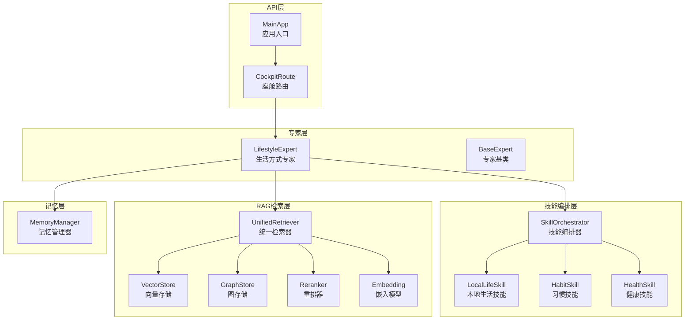
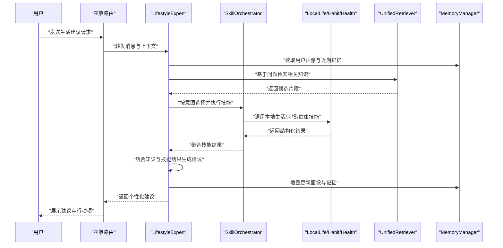
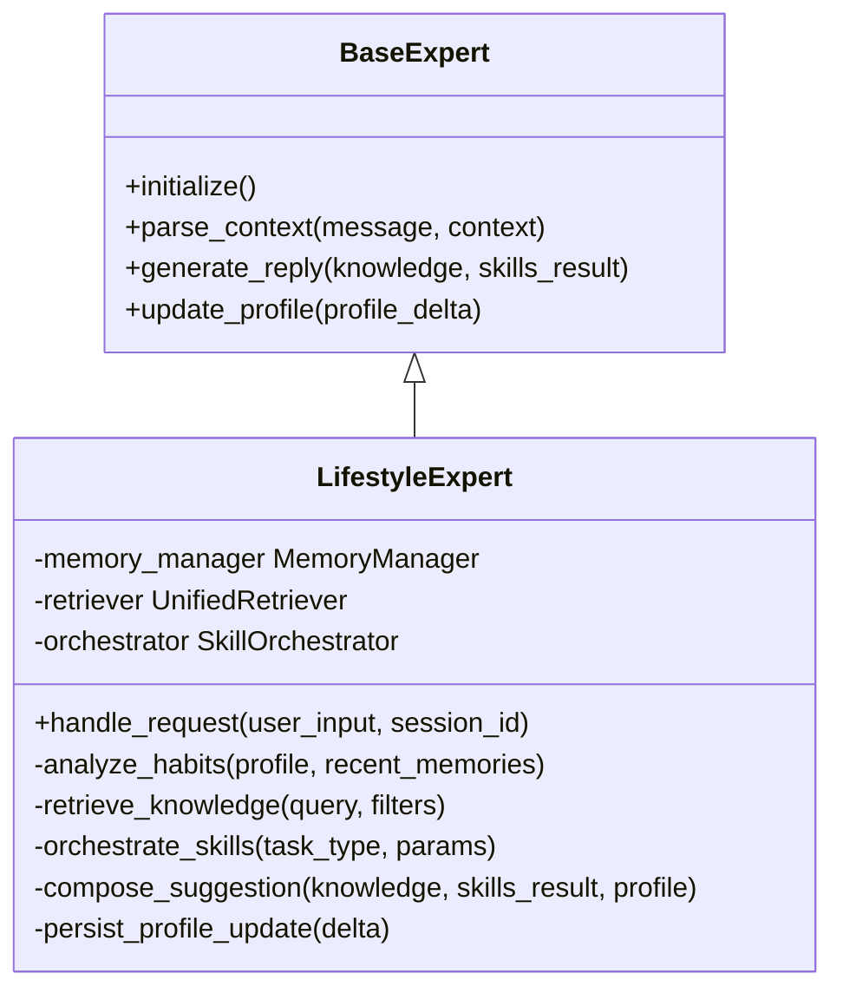
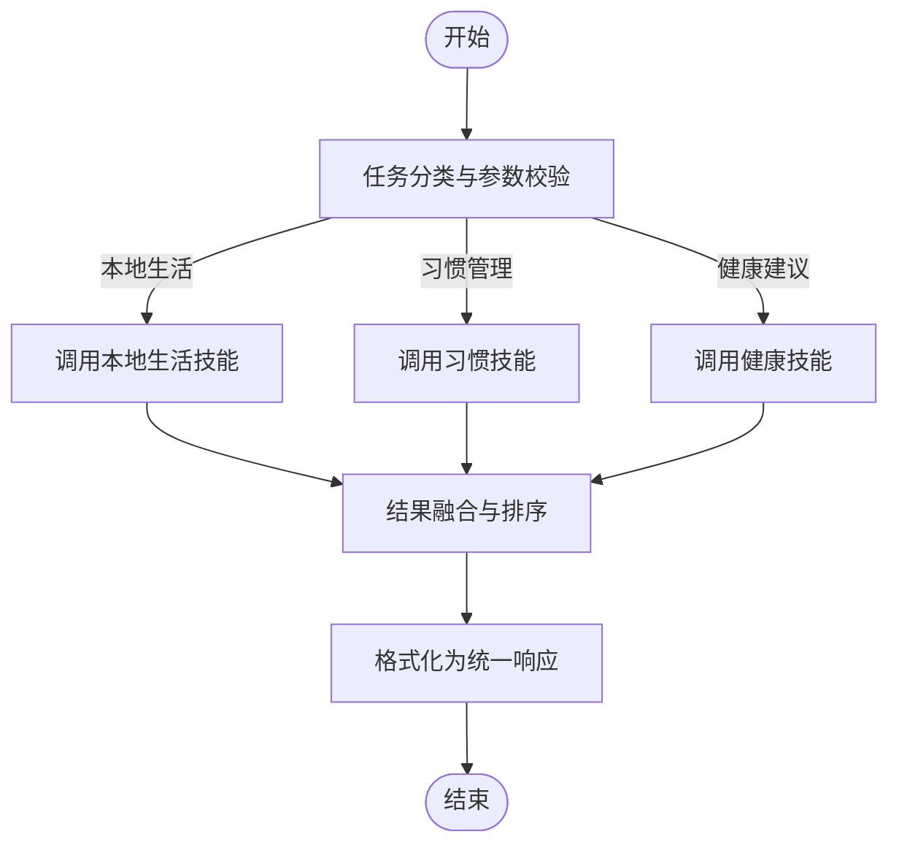
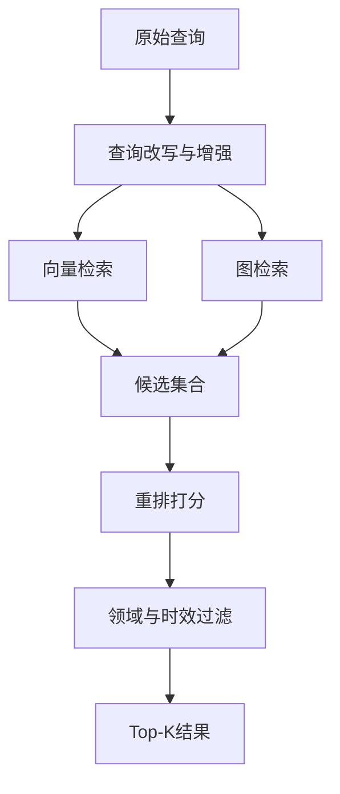
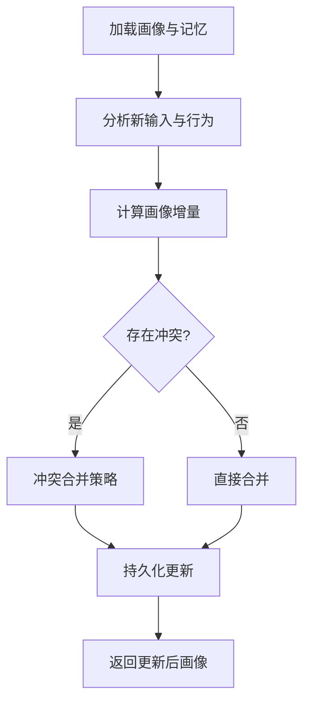
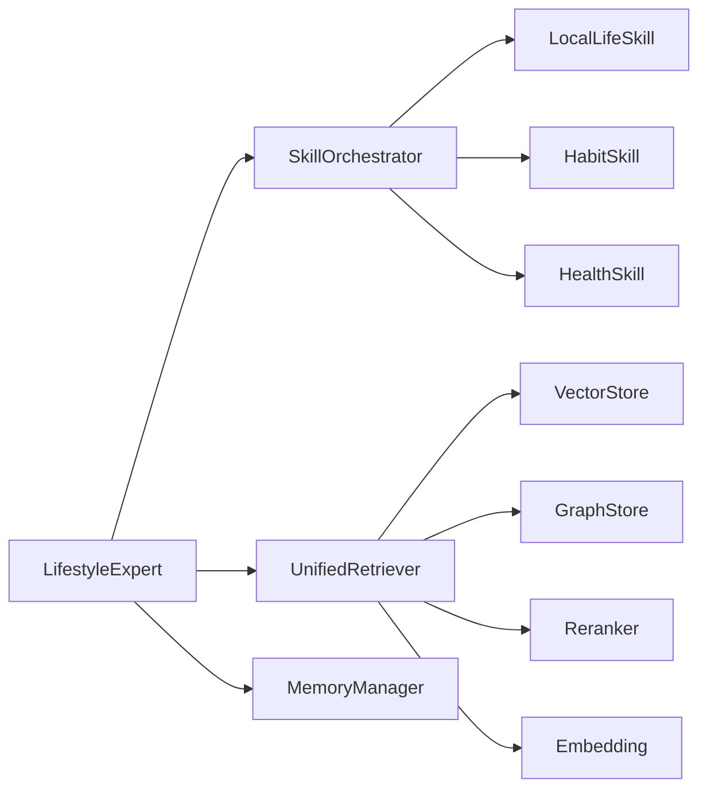

# 生活方式专家

<cite>
**本文引用的文件**   
- [lifestyle_expert.py](file://backend_design/nexus/agent/experts/lifestyle_expert.py)
- [base.py](file://backend_design/nexus/agent/experts/base.py)
- [orchestrator.py](file://backend_design/nexus/skills/orchestrator.py)
- [local_life.py](file://backend_design/nexus/skills/local_life.py)
- [habit.py](file://backend_design/nexus/skills/habit.py)
- [health.py](file://backend_design/nexus/skills/health.py)
- [unified_retriever.py](file://backend_design/nexus/rag/unified_retriever.py)
- [graph_store.py](file://backend_design/nexus/rag/graph_store.py)
- [vector_store.py](file://backend_design/nexus/rag/vector_store.py)
- [reranker.py](file://backend_design/nexus/rag/reranker.py)
- [embedding.py](file://backend_design/nexus/rag/embedding.py)
- [memory_manager.py](file://backend_design/nexus/memory/manager.py)
- [chat.md](file://backend_design/nexus/prompts/chat.md)
- [main.py](file://backend_design/nexus/main.py)
- [cockpit.py](file://backend_design/nexus/api/routes/cockpit.py)
</cite>

## 目录
1. [简介](#简介)
2. [项目结构](#项目结构)
3. [核心组件](#核心组件)
4. [架构总览](#架构总览)
5. [详细组件分析](#详细组件分析)
6. [依赖分析](#依赖分析)
7. [性能考虑](#性能考虑)
8. [故障排查指南](#故障排查指南)
9. [结论](#结论)
10. [附录](#附录)

## 简介
本技术文档面向NexusCockpit的“生活方式专家”（LifestyleExpert），系统性阐述其生活建议算法、用户习惯分析、个性化推荐与内容生成机制，并记录知识库、兴趣偏好建模与生活场景适配。文档同时给出与本地生活服务技能的集成方式与数据交互模式，并提供优化策略以提升推荐质量与用户参与度。

## 项目结构
围绕生活方式专家的关键代码位于后端设计目录中：
- 专家层：负责意图识别后的专业领域处理与回复生成
- 技能编排层：统一调度各类技能（如本地生活、健康、习惯等）
- RAG检索层：提供向量与图检索、重排与嵌入能力
- 记忆层：维护长期与短期记忆，支撑画像更新
- API路由：暴露对话与座舱相关接口

图表来源
- [lifestyle_expert.py:1-200](file://backend_design/nexus/agent/experts/lifestyle_expert.py#L1-L200)
- [orchestrator.py:1-200](file://backend_design/nexus/skills/orchestrator.py#L1-L200)
- [local_life.py:1-200](file://backend_design/nexus/skills/local_life.py#L1-L200)
- [habit.py:1-200](file://backend_design/nexus/skills/habit.py#L1-L200)
- [health.py:1-200](file://backend_design/nexus/skills/health.py#L1-L200)
- [unified_retriever.py:1-200](file://backend_design/nexus/rag/unified_retriever.py#L1-L200)
- [graph_store.py:1-200](file://backend_design/nexus/rag/graph_store.py#L1-L200)
- [vector_store.py:1-200](file://backend_design/nexus/rag/vector_store.py#L1-L200)
- [reranker.py:1-200](file://backend_design/nexus/rag/reranker.py#L1-L200)
- [embedding.py:1-200](file://backend_design/nexus/rag/embedding.py#L1-L200)
- [memory_manager.py:1-200](file://backend_design/nexus/memory/manager.py#L1-L200)
- [cockpit.py:1-200](file://backend_design/nexus/api/routes/cockpit.py#L1-L200)
- [main.py:1-200](file://backend_design/nexus/main.py#L1-L200)

章节来源
- [lifestyle_expert.py:1-200](file://backend_design/nexus/agent/experts/lifestyle_expert.py#L1-L200)
- [orchestrator.py:1-200](file://backend_design/nexus/skills/orchestrator.py#L1-L200)
- [unified_retriever.py:1-200](file://backend_design/nexus/rag/unified_retriever.py#L1-L200)
- [memory_manager.py:1-200](file://backend_design/nexus/memory/manager.py#L1-L200)
- [cockpit.py:1-200](file://backend_design/nexus/api/routes/cockpit.py#L1-L200)
- [main.py:1-200](file://backend_design/nexus/main.py#L1-L200)

## 核心组件
- 生活方式专家（LifestyleExpert）
  - 职责：接收用户输入，结合上下文与记忆，调用技能编排器与RAG检索，生成个性化生活建议
  - 关键流程：解析意图→拉取记忆→检索知识→编排技能→生成回复→更新画像
- 技能编排器（SkillOrchestrator）
  - 职责：根据任务类型选择并执行具体技能（本地生活、习惯、健康等），聚合结果
- 本地生活技能（LocalLifeSkill）
  - 职责：对接本地服务（餐饮、出行、娱乐等），返回结构化推荐项
- 习惯技能（HabitSkill）
  - 职责：读取与更新用户习惯标签、行为频率、目标进度
- 健康技能（HealthSkill）
  - 职责：与健康数据联动，为生活建议提供约束与提示
- 统一检索器（UnifiedRetriever）
  - 职责：融合向量与图检索，进行召回与重排，输出高相关度知识片段
- 记忆管理器（MemoryManager）
  - 职责：维护长期/短期记忆，支持画像增量更新与冲突合并

章节来源
- [lifestyle_expert.py:1-200](file://backend_design/nexus/agent/experts/lifestyle_expert.py#L1-L200)
- [orchestrator.py:1-200](file://backend_design/nexus/skills/orchestrator.py#L1-L200)
- [local_life.py:1-200](file://backend_design/nexus/skills/local_life.py#L1-L200)
- [habit.py:1-200](file://backend_design/nexus/skills/habit.py#L1-L200)
- [health.py:1-200](file://backend_design/nexus/skills/health.py#L1-L200)
- [unified_retriever.py:1-200](file://backend_design/nexus/rag/unified_retriever.py#L1-L200)
- [memory_manager.py:1-200](file://backend_design/nexus/memory/manager.py#L1-L200)

## 架构总览
生活方式专家采用“专家-编排-RAG-记忆”的分层架构：
- 专家层专注领域推理与对话生成
- 编排层解耦具体技能实现，便于扩展
- RAG层提供可插拔的知识检索与重排
- 记忆层保障个性化与连续性

图表来源
- [cockpit.py:1-200](file://backend_design/nexus/api/routes/cockpit.py#L1-L200)
- [lifestyle_expert.py:1-200](file://backend_design/nexus/agent/experts/lifestyle_expert.py#L1-L200)
- [orchestrator.py:1-200](file://backend_design/nexus/skills/orchestrator.py#L1-L200)
- [local_life.py:1-200](file://backend_design/nexus/skills/local_life.py#L1-L200)
- [habit.py:1-200](file://backend_design/nexus/skills/habit.py#L1-L200)
- [health.py:1-200](file://backend_design/nexus/skills/health.py#L1-L200)
- [unified_retriever.py:1-200](file://backend_design/nexus/rag/unified_retriever.py#L1-L200)
- [memory_manager.py:1-200](file://backend_design/nexus/memory/manager.py#L1-L200)

## 详细组件分析

### 生活方式专家（LifestyleExpert）
- 角色定位：将用户自然语言转化为可执行的生活建议，协调多源信息与技能
- 关键方法
  - 意图解析与上下文构建
  - 记忆拉取与画像加载
  - 知识检索与重排
  - 技能编排与结果聚合
  - 内容生成与风格化
  - 画像更新与记忆持久化
- 算法要点
  - 用户习惯分析：从习惯技能与记忆中提取行为频次、时间偏好、目标状态
  - 个性化推荐：结合RAG检索到的知识片段与画像权重，对候选方案打分排序
  - 内容生成：依据提示模板与领域约束，生成口语化、可执行的建议

图表来源
- [base.py:1-200](file://backend_design/nexus/agent/experts/base.py#L1-L200)
- [lifestyle_expert.py:1-200](file://backend_design/nexus/agent/experts/lifestyle_expert.py#L1-L200)

章节来源
- [lifestyle_expert.py:1-200](file://backend_design/nexus/agent/experts/lifestyle_expert.py#L1-L200)
- [base.py:1-200](file://backend_design/nexus/agent/experts/base.py#L1-L200)

### 技能编排器（SkillOrchestrator）
- 职责：根据任务类型与参数，动态选择并执行相应技能，聚合返回结果
- 关键流程
  - 任务分类：识别本地生活、习惯管理、健康建议等
  - 参数校验：确保必要字段完整与安全
  - 技能执行：调用对应技能并收集结果
  - 结果融合：去重、排序、格式化

图表来源
- [orchestrator.py:1-200](file://backend_design/nexus/skills/orchestrator.py#L1-L200)
- [local_life.py:1-200](file://backend_design/nexus/skills/local_life.py#L1-L200)
- [habit.py:1-200](file://backend_design/nexus/skills/habit.py#L1-L200)
- [health.py:1-200](file://backend_design/nexus/skills/health.py#L1-L200)

章节来源
- [orchestrator.py:1-200](file://backend_design/nexus/skills/orchestrator.py#L1-L200)
- [local_life.py:1-200](file://backend_design/nexus/skills/local_life.py#L1-L200)
- [habit.py:1-200](file://backend_design/nexus/skills/habit.py#L1-L200)
- [health.py:1-200](file://backend_design/nexus/skills/health.py#L1-L200)

### 统一检索器（UnifiedRetriever）
- 职责：融合向量与图检索，提升召回质量并进行重排
- 关键步骤
  - 查询改写：结合上下文与画像增强查询
  - 向量召回：通过向量存储获取相似片段
  - 图检索：通过图存储获取关系型知识
  - 重排：使用重排器对候选进行相关性打分
  - 过滤与截断：按领域与时效性筛选

图表来源
- [unified_retriever.py:1-200](file://backend_design/nexus/rag/unified_retriever.py#L1-L200)
- [vector_store.py:1-200](file://backend_design/nexus/rag/vector_store.py#L1-L200)
- [graph_store.py:1-200](file://backend_design/nexus/rag/graph_store.py#L1-L200)
- [reranker.py:1-200](file://backend_design/nexus/rag/reranker.py#L1-L200)
- [embedding.py:1-200](file://backend_design/nexus/rag/embedding.py#L1-L200)

章节来源
- [unified_retriever.py:1-200](file://backend_design/nexus/rag/unified_retriever.py#L1-L200)
- [vector_store.py:1-200](file://backend_design/nexus/rag/vector_store.py#L1-L200)
- [graph_store.py:1-200](file://backend_design/nexus/rag/graph_store.py#L1-L200)
- [reranker.py:1-200](file://backend_design/nexus/rag/reranker.py#L1-L200)
- [embedding.py:1-200](file://backend_design/nexus/rag/embedding.py#L1-L200)

### 记忆管理器（MemoryManager）
- 职责：维护用户画像与记忆，支持增量更新与冲突合并
- 关键操作
  - 读取画像：按会话ID或用户ID加载长期与短期记忆
  - 增量更新：合并新行为、偏好与目标变化
  - 冲突解决：基于置信度与时效性策略合并矛盾信息
  - 持久化：落盘或写入远程存储

图表来源
- [memory_manager.py:1-200](file://backend_design/nexus/memory/manager.py#L1-L200)

章节来源
- [memory_manager.py:1-200](file://backend_design/nexus/memory/manager.py#L1-L200)

### 本地生活技能（LocalLifeSkill）
- 职责：对接本地生活服务，返回结构化推荐项（如餐厅、活动、路线等）
- 数据交互模式
  - 输入：位置、预算、偏好、时间窗口
  - 输出：候选列表（名称、评分、距离、价格区间、标签）
  - 错误处理：超时、无结果、权限不足等

章节来源
- [local_life.py:1-200](file://backend_design/nexus/skills/local_life.py#L1-L200)

### 习惯技能（HabitSkill）
- 职责：读取与更新用户习惯标签、行为频率、目标进度
- 画像更新示例路径
  - 新增习惯标签：[habit.py:1-200](file://backend_design/nexus/skills/habit.py#L1-L200)
  - 更新行为频次：[habit.py:1-200](file://backend_design/nexus/skills/habit.py#L1-L200)
  - 目标进度推进：[habit.py:1-200](file://backend_design/nexus/skills/habit.py#L1-L200)

章节来源
- [habit.py:1-200](file://backend_design/nexus/skills/habit.py#L1-L200)

### 健康技能（HealthSkill）
- 职责：与健康数据联动，为生活建议提供约束与提示（如运动量、睡眠、饮食）
- 建议约束示例路径
  - 运动建议上限：[health.py:1-200](file://backend_design/nexus/skills/health.py#L1-L200)
  - 饮食禁忌提示：[health.py:1-200](file://backend_design/nexus/skills/health.py#L1-L200)

章节来源
- [health.py:1-200](file://backend_design/nexus/skills/health.py#L1-L200)

### 提示工程与内容生成
- 提示模板：对话与澄清提示用于引导生成更贴近用户语境的回复
- 生成流程：结合RAG知识与技能结果，遵循提示模板生成建议

章节来源
- [chat.md:1-200](file://backend_design/nexus/prompts/chat.md#L1-L200)

## 依赖分析
- 组件耦合
  - LifestyleExpert依赖SkillOrchestrator、UnifiedRetriever与MemoryManager
  - SkillOrchestrator依赖LocalLife、Habit、Health等具体技能
  - UnifiedRetriever依赖VectorStore、GraphStore、Reranker与Embedding
- 外部集成点
  - 本地生活服务接口（由LocalLifeSkill封装）
  - 健康数据接口（由HealthSkill封装）
  - 向量与图数据库（由VectorStore与GraphStore封装）

图表来源
- [lifestyle_expert.py:1-200](file://backend_design/nexus/agent/experts/lifestyle_expert.py#L1-L200)
- [orchestrator.py:1-200](file://backend_design/nexus/skills/orchestrator.py#L1-L200)
- [unified_retriever.py:1-200](file://backend_design/nexus/rag/unified_retriever.py#L1-L200)
- [vector_store.py:1-200](file://backend_design/nexus/rag/vector_store.py#L1-L200)
- [graph_store.py:1-200](file://backend_design/nexus/rag/graph_store.py#L1-L200)
- [reranker.py:1-200](file://backend_design/nexus/rag/reranker.py#L1-L200)
- [embedding.py:1-200](file://backend_design/nexus/rag/embedding.py#L1-L200)

章节来源
- [lifestyle_expert.py:1-200](file://backend_design/nexus/agent/experts/lifestyle_expert.py#L1-L200)
- [orchestrator.py:1-200](file://backend_design/nexus/skills/orchestrator.py#L1-L200)
- [unified_retriever.py:1-200](file://backend_design/nexus/rag/unified_retriever.py#L1-L200)

## 性能考虑
- 检索优化
  - 缓存热点查询结果，减少重复向量计算
  - 分层召回：先粗筛再精排，降低重排开销
  - 图检索索引优化，避免全图遍历
- 生成优化
  - 控制提示长度与上下文窗口，减少LLM负载
  - 异步并行调用多个技能，缩短端到端延迟
- 记忆更新
  - 增量更新与批处理合并，降低写放大
  - 冲突合并策略引入时效性与置信度阈值，减少频繁覆盖

## 故障排查指南
- 常见问题
  - 检索结果为空：检查向量与图索引是否初始化；确认查询改写是否合理
  - 技能调用失败：查看本地生活或服务接口的超时与鉴权配置
  - 画像更新异常：核对增量合并逻辑与冲突策略
- 日志与观测
  - 在专家与编排层增加关键节点日志
  - 监控检索耗时、重排得分分布与技能成功率

章节来源
- [lifestyle_expert.py:1-200](file://backend_design/nexus/agent/experts/lifestyle_expert.py#L1-L200)
- [orchestrator.py:1-200](file://backend_design/nexus/skills/orchestrator.py#L1-L200)
- [unified_retriever.py:1-200](file://backend_design/nexus/rag/unified_retriever.py#L1-L200)

## 结论
生活方式专家通过“专家-编排-RAG-记忆”的分层架构，实现了高质量、个性化的生活建议生成。借助统一检索与技能编排，系统能够灵活接入本地生活服务与健康数据，持续优化推荐效果与用户体验。建议在后续迭代中强化检索缓存、异步编排与画像冲突合并策略，进一步提升性能与稳定性。

## 附录
- 代码示例路径（不含具体代码内容）
  - 生活建议生成主流程：[lifestyle_expert.py:1-200](file://backend_design/nexus/agent/experts/lifestyle_expert.py#L1-L200)
  - 技能编排与聚合：[orchestrator.py:1-200](file://backend_design/nexus/skills/orchestrator.py#L1-L200)
  - 统一检索与重排：[unified_retriever.py:1-200](file://backend_design/nexus/rag/unified_retriever.py#L1-L200)
  - 画像增量更新：[memory_manager.py:1-200](file://backend_design/nexus/memory/manager.py#L1-L200)
  - 本地生活技能接口：[local_life.py:1-200](file://backend_design/nexus/skills/local_life.py#L1-L200)
  - 习惯技能更新：[habit.py:1-200](file://backend_design/nexus/skills/habit.py#L1-L200)
  - 健康建议约束：[health.py:1-200](file://backend_design/nexus/skills/health.py#L1-L200)
  - 提示模板参考：[chat.md:1-200](file://backend_design/nexus/prompts/chat.md#L1-L200)
  - API入口与路由：[cockpit.py:1-200](file://backend_design/nexus/api/routes/cockpit.py#L1-L200), [main.py:1-200](file://backend_design/nexus/main.py#L1-L200)