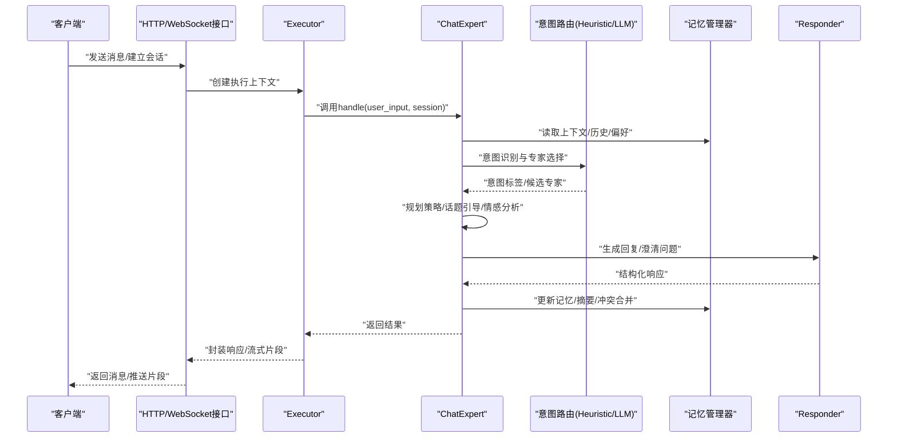
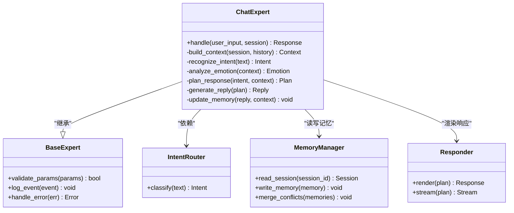
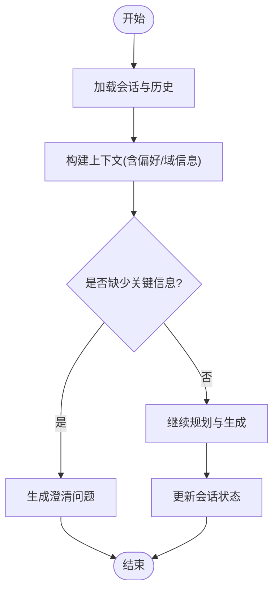
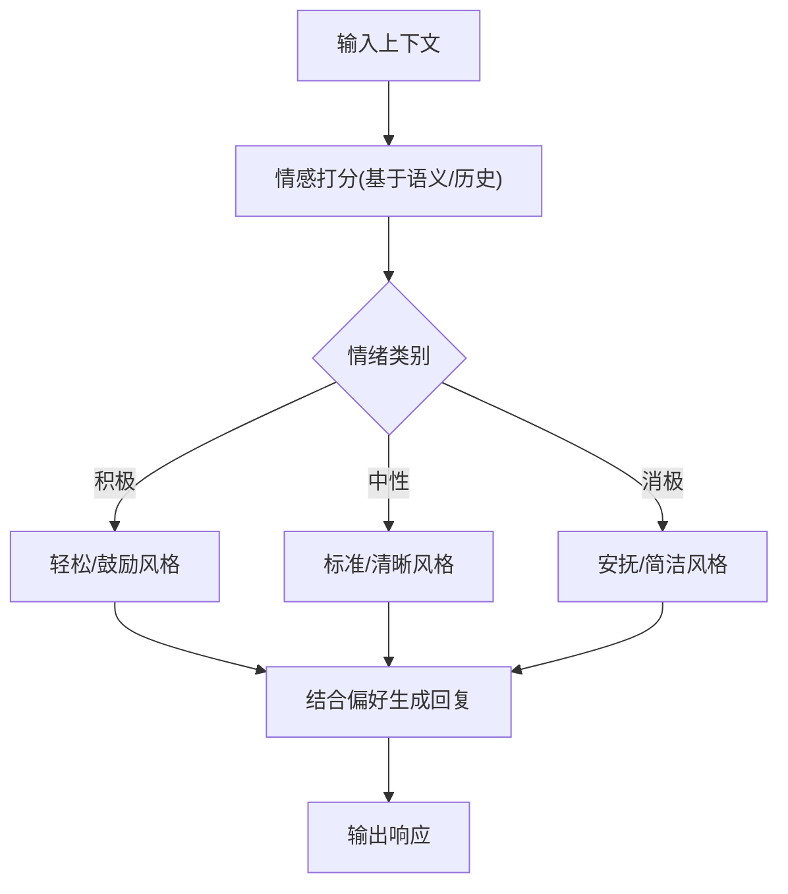
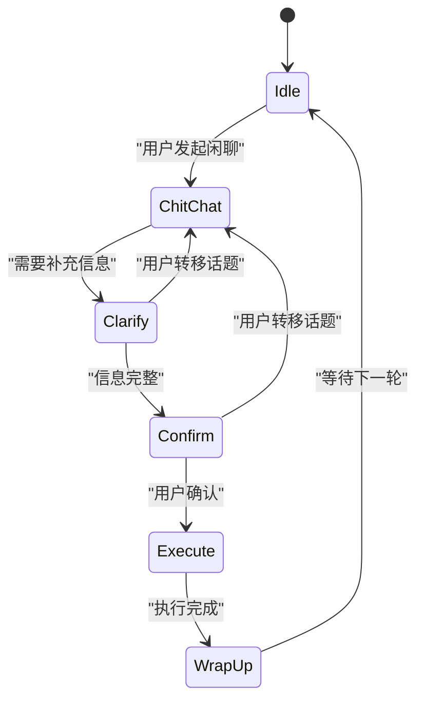
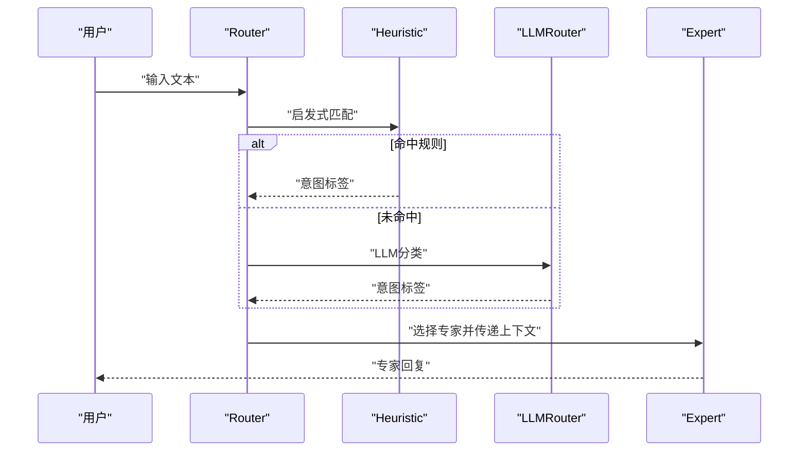
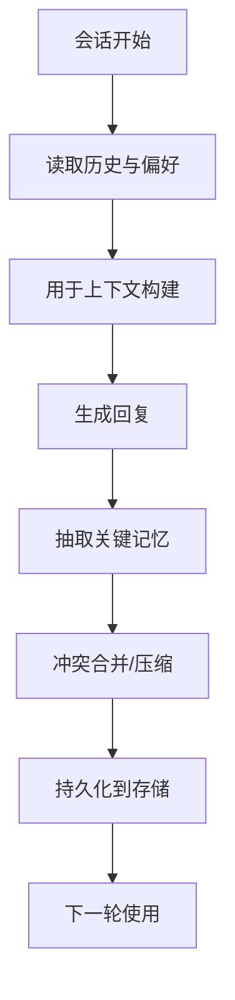
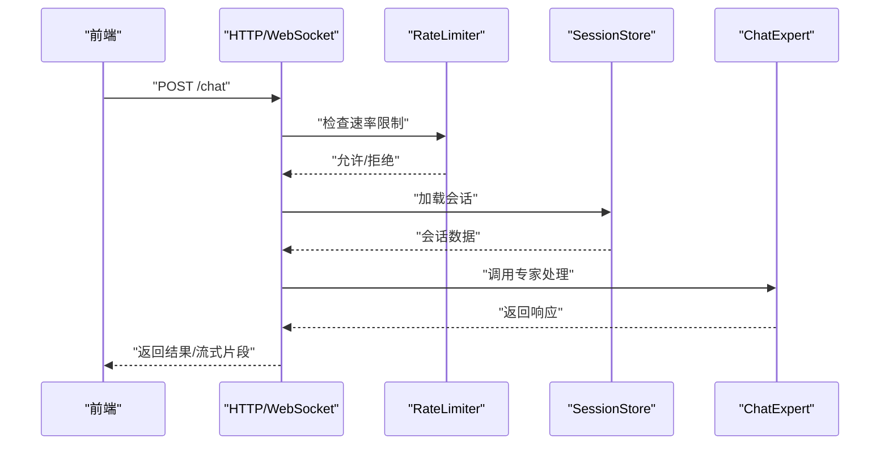
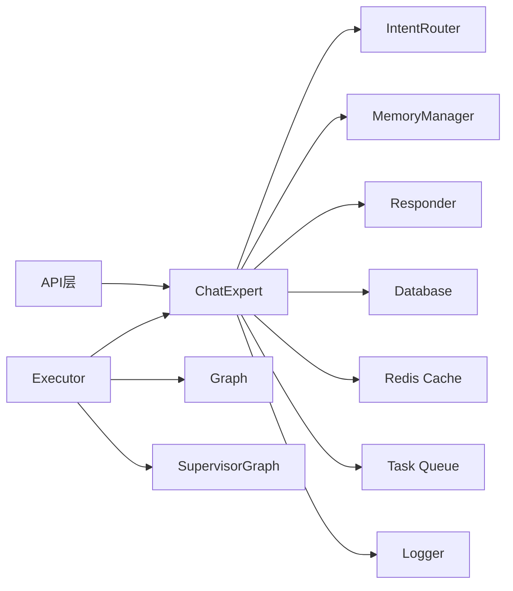

# 聊天专家

<cite>
**本文引用的文件**   
- [chat_expert.py](file://backend_design/nexus/agent/experts/chat_expert.py)
- [base.py](file://backend_design/nexus/agent/experts/base.py)
- [executor.py](file://backend_design/nexus/agent/executor.py)
- [responder.py](file://backend_design/nexus/agent/responder.py)
- [planner.py](file://backend_design/nexus/agent/planner.py)
- [graph.py](file://backend_design/nexus/agent/graph.py)
- [supervisor_graph.py](file://backend_design/nexus/agent/supervisor_graph.py)
- [manager.py](file://backend_design/nexus/memory/manager.py)
- [compressor.py](file://backend_design/nexus/memory/compressor.py)
- [conflict.py](file://backend_design/nexus/memory/conflict.py)
- [schemas.py](file://backend_design/nexus/models/schemas.py)
- [state.py](file://backend_design/nexus/models/state.py)
- [cockpit.py](file://backend_design/nexus/models/cockpit.py)
- [chat.md](file://backend_design/nexus/prompts/chat.md)
- [clarification.md](file://backend_design/nexus/prompts/clarification.md)
- [memory_extract.md](file://backend_design/nexus/prompts/memory_extract.md)
- [llm_router.py](file://backend_design/nexus/intent/llm_router.py)
- [heuristic.py](file://backend_design/nexus/intent/heuristic.py)
- [router.py](file://backend_design/nexus/intent/router.py)
- [chat.py](file://backend_design/nexus/api/routes/chat.py)
- [chat_sessions.py](file://backend_design/nexus/api/routes/chat_sessions.py)
- [websocket.py](file://backend_design/nexus/api/websocket.py)
- [session_store.py](file://backend_design/nexus/middleware/session_store.py)
- [redis_cache.py](file://backend_design/nexus/middleware/redis_cache.py)
- [task_queue.py](file://backend_design/nexus/middleware/task_queue.py)
- [rate_limiter.py](file://backend_design/nexus/middleware/rate_limiter.py)
- [db_manager.py](file://backend_design/nexus/core/db_manager.py)
- [logger.py](file://backend_design/nexus/core/logger.py)
- [exceptions.py](file://backend_design/nexus/core/exceptions.py)
- [config.py](file://backend_design/nexus/config.py)
</cite>

## 目录
1. [简介](#简介)
2. [项目结构](#项目结构)
3. [核心组件](#核心组件)
4. [架构总览](#架构总览)
5. [详细组件分析](#详细组件分析)
6. [依赖关系分析](#依赖关系分析)
7. [性能考量](#性能考量)
8. [故障排查指南](#故障排查指南)
9. [结论](#结论)
10. [附录](#附录)

## 简介
本文件面向NexusCockpit的“聊天专家”模块，系统性阐述ChatExpert的实现逻辑与工程化设计。内容覆盖对话上下文管理、情感分析、多轮对话处理、个性化响应生成、聊天策略与话题引导、用户意图理解机制，以及与记忆系统的集成和对话历史管理。文档同时提供配置与行为定制要点、质量优化与用户体验改进建议，帮助开发者快速定位问题并持续优化系统表现。

## 项目结构
围绕聊天专家的相关代码主要分布在以下子系统中：
- Agent层：专家定义与执行编排（ChatExpert、BaseExpert、Executor、Planner、Responder、Graph/SuperVisor）
- Intent层：意图识别与路由（LLM路由、启发式规则、统一路由）
- Memory层：记忆管理与压缩、冲突解决
- Models层：状态与数据模型（会话、消息、状态机）
- Prompts层：提示词模板（聊天、澄清、记忆抽取）
- API层：HTTP/WebSocket接口（聊天、会话管理、WebSocket流式）
- Middleware层：会话存储、缓存、任务队列、限流
- Core层：数据库、日志、异常、配置

```mermaid
graph TB
subgraph "Agent"
CE["ChatExpert"]
BE["BaseExpert"]
EX["Executor"]
PL["Planner"]
RS["Responder"]
GR["Graph"]
SV["SupervisorGraph"]
end
subgraph "Intent"
LLMR["LLMRouter"]
HEU["Heuristic"]
RT["Router"]
end
subgraph "Memory"
MM["Manager"]
CMP["Compressor"]
CF["Conflict"]
end
subgraph "Models"
SCH["Schemas"]
ST["State"]
CP["Cockpit"]
end
subgraph "Prompts"
P_CHAT["chat.md"]
P_CLAR["clarification.md"]
P_MEM["memory_extract.md"]
end
subgraph "API"
API_CHAT["routes/chat.py"]
API_SESS["routes/chat_sessions.py"]
WS["websocket.py"]
end
subgraph "Middleware"
SESS["session_store.py"]
REDIS["redis_cache.py"]
TQ["task_queue.py"]
RL["rate_limiter.py"]
end
subgraph "Core"
DB["db_manager.py"]
LOG["logger.py"]
EXC["exceptions.py"]
CFG["config.py"]
end
CE --> BE
CE --> PL
CE --> RS
CE --> MM
CE --> LLMR
CE --> HEU
CE --> RT
CE --> P_CHAT
CE --> P_CLAR
CE --> P_MEM
CE --> SCH
CE --> ST
CE --> CP
EX --> CE
EX --> GR
EX --> SV
API_CHAT --> CE
API_SESS --> CE
WS --> CE
CE --> SESS
CE --> REDIS
CE --> TQ
CE --> RL
CE --> DB
CE --> LOG
CE --> EXC
CE --> CFG
```

图表来源
- [chat_expert.py:1-200](file://backend_design/nexus/agent/experts/chat_expert.py#L1-L200)
- [base.py:1-120](file://backend_design/nexus/agent/experts/base.py#L1-L120)
- [executor.py:1-150](file://backend_design/nexus/agent/executor.py#L1-L150)
- [planner.py:1-120](file://backend_design/nexus/agent/planner.py#L1-L120)
- [responder.py:1-120](file://backend_design/nexus/agent/responder.py#L1-L120)
- [graph.py:1-120](file://backend_design/nexus/agent/graph.py#L1-L120)
- [supervisor_graph.py:1-120](file://backend_design/nexus/agent/supervisor_graph.py#L1-L120)
- [manager.py:1-120](file://backend_design/nexus/memory/manager.py#L1-L120)
- [compressor.py:1-120](file://backend_design/nexus/memory/compressor.py#L1-L120)
- [conflict.py:1-120](file://backend_design/nexus/memory/conflict.py#L1-L120)
- [schemas.py:1-120](file://backend_design/nexus/models/schemas.py#L1-L120)
- [state.py:1-120](file://backend_design/nexus/models/state.py#L1-L120)
- [cockpit.py:1-120](file://backend_design/nexus/models/cockpit.py#L1-L120)
- [chat.md:1-200](file://backend_design/nexus/prompts/chat.md#L1-L200)
- [clarification.md:1-200](file://backend_design/nexus/prompts/clarification.md#L1-L200)
- [memory_extract.md:1-200](file://backend_design/nexus/prompts/memory_extract.md#L1-L200)
- [llm_router.py:1-120](file://backend_design/nexus/intent/llm_router.py#L1-L120)
- [heuristic.py:1-120](file://backend_design/nexus/intent/heuristic.py#L1-L120)
- [router.py:1-120](file://backend_design/nexus/intent/router.py#L1-L120)
- [chat.py:1-200](file://backend_design/nexus/api/routes/chat.py#L1-L200)
- [chat_sessions.py:1-200](file://backend_design/nexus/api/routes/chat_sessions.py#L1-L200)
- [websocket.py:1-200](file://backend_design/nexus/api/websocket.py#L1-L200)
- [session_store.py:1-120](file://backend_design/nexus/middleware/session_store.py#L1-L120)
- [redis_cache.py:1-120](file://backend_design/nexus/middleware/redis_cache.py#L1-L120)
- [task_queue.py:1-120](file://backend_design/nexus/middleware/task_queue.py#L1-L120)
- [rate_limiter.py:1-120](file://backend_design/nexus/middleware/rate_limiter.py#L1-L120)
- [db_manager.py:1-120](file://backend_design/nexus/core/db_manager.py#L1-L120)
- [logger.py:1-120](file://backend_design/nexus/core/logger.py#L1-L120)
- [exceptions.py:1-120](file://backend_design/nexus/core/exceptions.py#L1-L120)
- [config.py:1-120](file://backend_design/nexus/config.py#L1-L120)

章节来源
- [chat_expert.py:1-200](file://backend_design/nexus/agent/experts/chat_expert.py#L1-L200)
- [executor.py:1-150](file://backend_design/nexus/agent/executor.py#L1-L150)
- [planner.py:1-120](file://backend_design/nexus/agent/planner.py#L1-L120)
- [responder.py:1-120](file://backend_design/nexus/agent/responder.py#L1-L120)
- [manager.py:1-120](file://backend_design/nexus/memory/manager.py#L1-L120)
- [schemas.py:1-120](file://backend_design/nexus/models/schemas.py#L1-L120)
- [state.py:1-120](file://backend_design/nexus/models/state.py#L1-L120)
- [chat.md:1-200](file://backend_design/nexus/prompts/chat.md#L1-L200)
- [clarification.md:1-200](file://backend_design/nexus/prompts/clarification.md#L1-L200)
- [memory_extract.md:1-200](file://backend_design/nexus/prompts/memory_extract.md#L1-L200)
- [llm_router.py:1-120](file://backend_design/nexus/intent/llm_router.py#L1-L120)
- [heuristic.py:1-120](file://backend_design/nexus/intent/heuristic.py#L1-L120)
- [router.py:1-120](file://backend_design/nexus/intent/router.py#L1-L120)
- [chat.py:1-200](file://backend_design/nexus/api/routes/chat.py#L1-L200)
- [chat_sessions.py:1-200](file://backend_design/nexus/api/routes/chat_sessions.py#L1-L200)
- [websocket.py:1-200](file://backend_design/nexus/api/websocket.py#L1-L200)
- [session_store.py:1-120](file://backend_design/nexus/middleware/session_store.py#L1-L120)
- [redis_cache.py:1-120](file://backend_design/nexus/middleware/redis_cache.py#L1-L120)
- [task_queue.py:1-120](file://backend_design/nexus/middleware/task_queue.py#L1-L120)
- [rate_limiter.py:1-120](file://backend_design/nexus/middleware/rate_limiter.py#L1-L120)
- [db_manager.py:1-120](file://backend_design/nexus/core/db_manager.py#L1-L120)
- [logger.py:1-120](file://backend_design/nexus/core/logger.py#L1-L120)
- [exceptions.py:1-120](file://backend_design/nexus/core/exceptions.py#L1-L120)
- [config.py:1-120](file://backend_design/nexus/config.py#L1-L120)

## 核心组件
- ChatExpert：聊天专家主类，负责接收用户输入、构建上下文、调用意图识别、规划回复、生成个性化响应、更新记忆与状态，并返回结构化结果。
- BaseExpert：专家基类，提供通用能力如参数校验、日志记录、错误处理、工具方法等。
- Executor：专家执行器，负责调度多个专家节点、编排流程、超时与重试控制。
- Planner：规划器，根据当前上下文与目标生成下一步动作或回复策略。
- Responder：应答器，将规划结果渲染为最终文本/结构化输出，支持流式输出。
- Memory Manager：记忆管理器，维护长期/短期记忆、压缩与冲突合并。
- Intent Router：意图路由，结合LLM与启发式规则进行意图分类与专家选择。
- Models & State：会话、消息、状态机等数据结构定义。
- Prompts：聊天、澄清、记忆抽取等提示词模板。
- API层：HTTP与WebSocket接口，承载请求接入、鉴权、限流、会话持久化。
- Middleware：会话存储、Redis缓存、任务队列、速率限制等横切能力。
- Core：数据库连接、日志、异常、配置等基础设施。

章节来源
- [chat_expert.py:1-200](file://backend_design/nexus/agent/experts/chat_expert.py#L1-L200)
- [base.py:1-120](file://backend_design/nexus/agent/experts/base.py#L1-L120)
- [executor.py:1-150](file://backend_design/nexus/agent/executor.py#L1-L150)
- [planner.py:1-120](file://backend_design/nexus/agent/planner.py#L1-L120)
- [responder.py:1-120](file://backend_design/nexus/agent/responder.py#L1-L120)
- [manager.py:1-120](file://backend_design/nexus/memory/manager.py#L1-L120)
- [llm_router.py:1-120](file://backend_design/nexus/intent/llm_router.py#L1-L120)
- [heuristic.py:1-120](file://backend_design/nexus/intent/heuristic.py#L1-L120)
- [router.py:1-120](file://backend_design/nexus/intent/router.py#L1-L120)
- [schemas.py:1-120](file://backend_design/nexus/models/schemas.py#L1-L120)
- [state.py:1-120](file://backend_design/nexus/models/state.py#L1-L120)
- [chat.md:1-200](file://backend_design/nexus/prompts/chat.md#L1-L200)
- [clarification.md:1-200](file://backend_design/nexus/prompts/clarification.md#L1-L200)
- [memory_extract.md:1-200](file://backend_design/nexus/prompts/memory_extract.md#L1-L200)

## 架构总览
聊天专家在整体架构中处于“智能体编排层”，向上承接API层请求，向下驱动意图识别、记忆系统与外部服务，并通过Executor与Graph/SuperVisor完成复杂流程编排。

图表来源
- [chat.py:1-200](file://backend_design/nexus/api/routes/chat.py#L1-L200)
- [websocket.py:1-200](file://backend_design/nexus/api/websocket.py#L1-L200)
- [executor.py:1-150](file://backend_design/nexus/agent/executor.py#L1-L150)
- [chat_expert.py:1-200](file://backend_design/nexus/agent/experts/chat_expert.py#L1-L200)
- [llm_router.py:1-120](file://backend_design/nexus/intent/llm_router.py#L1-L120)
- [heuristic.py:1-120](file://backend_design/nexus/intent/heuristic.py#L1-L120)
- [manager.py:1-120](file://backend_design/nexus/memory/manager.py#L1-L120)
- [responder.py:1-120](file://backend_design/nexus/agent/responder.py#L1-L120)

## 详细组件分析

### ChatExpert 实现逻辑
- 输入解析与会话加载：从请求中提取用户ID、会话ID、消息内容与元数据；通过会话存储加载历史与偏好。
- 上下文构建：整合近期对话、用户画像、车辆/健康/生活等域信息，形成Prompt上下文。
- 意图识别：优先使用启发式规则快速匹配，必要时调用LLM路由提升准确率。
- 情感分析：基于上下文与历史推断用户情绪，用于调整语气与策略。
- 多轮对话处理：依据会话状态机推进阶段（闲聊/澄清/确认/执行），避免重复提问与信息缺失。
- 个性化响应：结合用户偏好、历史交互风格与领域知识生成自然语言回复。
- 记忆更新：抽取关键事实、偏好与事件，写入长期记忆；对冲突信息进行合并与消解。
- 输出与流式：支持一次性返回或分片流式返回，便于前端实时展示。

图表来源
- [chat_expert.py:1-200](file://backend_design/nexus/agent/experts/chat_expert.py#L1-L200)
- [base.py:1-120](file://backend_design/nexus/agent/experts/base.py#L1-L120)
- [llm_router.py:1-120](file://backend_design/nexus/intent/llm_router.py#L1-L120)
- [heuristic.py:1-120](file://backend_design/nexus/intent/heuristic.py#L1-L120)
- [manager.py:1-120](file://backend_design/nexus/memory/manager.py#L1-L120)
- [responder.py:1-120](file://backend_design/nexus/agent/responder.py#L1-L120)

章节来源
- [chat_expert.py:1-200](file://backend_design/nexus/agent/experts/chat_expert.py#L1-L200)
- [base.py:1-120](file://backend_design/nexus/agent/experts/base.py#L1-L120)
- [llm_router.py:1-120](file://backend_design/nexus/intent/llm_router.py#L1-L120)
- [heuristic.py:1-120](file://backend_design/nexus/intent/heuristic.py#L1-L120)
- [manager.py:1-120](file://backend_design/nexus/memory/manager.py#L1-L120)
- [responder.py:1-120](file://backend_design/nexus/agent/responder.py#L1-L120)

### 对话上下文管理
- 会话加载：通过会话存储读取最近N条消息、用户画像与偏好设置。
- 上下文裁剪：按时间窗口与重要性评分保留关键片段，降低Prompt长度与成本。
- 状态推进：依据状态机决定是否需要澄清、确认或进入执行阶段。
- 跨域融合：整合车辆、健康、生活等域信息，形成统一上下文视图。

图表来源
- [chat_expert.py:1-200](file://backend_design/nexus/agent/experts/chat_expert.py#L1-L200)
- [state.py:1-120](file://backend_design/nexus/models/state.py#L1-L120)
- [schemas.py:1-120](file://backend_design/nexus/models/schemas.py#L1-L120)
- [session_store.py:1-120](file://backend_design/nexus/middleware/session_store.py#L1-L120)

章节来源
- [chat_expert.py:1-200](file://backend_design/nexus/agent/experts/chat_expert.py#L1-L200)
- [state.py:1-120](file://backend_design/nexus/models/state.py#L1-L120)
- [schemas.py:1-120](file://backend_design/nexus/models/schemas.py#L1-L120)
- [session_store.py:1-120](file://backend_design/nexus/middleware/session_store.py#L1-L120)

### 情感分析与个性化响应
- 情感分析：基于上下文语义与历史情绪趋势判断用户情绪（积极/中性/消极）。
- 策略调整：根据情绪调整语气、长度与引导方式（例如安抚、鼓励、简洁）。
- 个性化：结合用户偏好（称呼、风格、兴趣）生成更贴合的回复。

图表来源
- [chat_expert.py:1-200](file://backend_design/nexus/agent/experts/chat_expert.py#L1-L200)
- [schemas.py:1-120](file://backend_design/nexus/models/schemas.py#L1-L120)

章节来源
- [chat_expert.py:1-200](file://backend_design/nexus/agent/experts/chat_expert.py#L1-L200)
- [schemas.py:1-120](file://backend_design/nexus/models/schemas.py#L1-L120)

### 多轮对话处理与话题引导
- 阶段管理：闲聊→澄清→确认→执行→收尾，确保每轮推进有效。
- 话题引导：当用户偏离主题时，温和拉回主线并提供相关选项。
- 去重与连贯：避免重复提问，保持上下文一致性与连贯性。

图表来源
- [state.py:1-120](file://backend_design/nexus/models/state.py#L1-L120)
- [chat_expert.py:1-200](file://backend_design/nexus/agent/experts/chat_expert.py#L1-L200)

章节来源
- [state.py:1-120](file://backend_design/nexus/models/state.py#L1-L120)
- [chat_expert.py:1-200](file://backend_design/nexus/agent/experts/chat_expert.py#L1-L200)

### 聊天策略与用户意图理解
- 意图识别：启发式规则快速匹配关键词/模式；复杂场景交由LLM路由提升精度。
- 专家选择：根据意图标签选择对应专家（导航、健康、生活方式等）。
- 策略库：定义不同意图下的回复模板、追问策略与降级方案。

图表来源
- [router.py:1-120](file://backend_design/nexus/intent/router.py#L1-L120)
- [heuristic.py:1-120](file://backend_design/nexus/intent/heuristic.py#L1-L120)
- [llm_router.py:1-120](file://backend_design/nexus/intent/llm_router.py#L1-L120)
- [chat_expert.py:1-200](file://backend_design/nexus/agent/experts/chat_expert.py#L1-L200)

章节来源
- [router.py:1-120](file://backend_design/nexus/intent/router.py#L1-L120)
- [heuristic.py:1-120](file://backend_design/nexus/intent/heuristic.py#L1-L120)
- [llm_router.py:1-120](file://backend_design/nexus/intent/llm_router.py#L1-L120)
- [chat_expert.py:1-200](file://backend_design/nexus/agent/experts/chat_expert.py#L1-L200)

### 与记忆系统的集成与对话历史管理
- 记忆读写：读取用户偏好、历史事件与领域知识；写入新事实与摘要。
- 压缩与合并：对长历史进行压缩，减少上下文长度；合并冲突信息，保证一致性。
- 持久化：会话与记忆落盘，支持跨会话恢复与回溯。

图表来源
- [manager.py:1-120](file://backend_design/nexus/memory/manager.py#L1-L120)
- [compressor.py:1-120](file://backend_design/nexus/memory/compressor.py#L1-L120)
- [conflict.py:1-120](file://backend_design/nexus/memory/conflict.py#L1-L120)
- [session_store.py:1-120](file://backend_design/nexus/middleware/session_store.py#L1-L120)

章节来源
- [manager.py:1-120](file://backend_design/nexus/memory/manager.py#L1-L120)
- [compressor.py:1-120](file://backend_design/nexus/memory/compressor.py#L1-L120)
- [conflict.py:1-120](file://backend_design/nexus/memory/conflict.py#L1-L120)
- [session_store.py:1-120](file://backend_design/nexus/middleware/session_store.py#L1-L120)

### 提示词与模板
- chat.md：定义聊天风格、角色设定、安全边界与输出格式。
- clarification.md：澄清问题的模板与追问策略。
- memory_extract.md：记忆抽取的规则与字段定义。

章节来源
- [chat.md:1-200](file://backend_design/nexus/prompts/chat.md#L1-L200)
- [clarification.md:1-200](file://backend_design/nexus/prompts/clarification.md#L1-L200)
- [memory_extract.md:1-200](file://backend_design/nexus/prompts/memory_extract.md#L1-L200)

### API与流式交互
- HTTP接口：提供聊天与会话管理的REST端点，支持参数校验、鉴权与限流。
- WebSocket：支持流式推送，提升用户体验与实时性。
- 中间件：会话存储、Redis缓存、任务队列与速率限制保障稳定性与扩展性。

图表来源
- [chat.py:1-200](file://backend_design/nexus/api/routes/chat.py#L1-L200)
- [chat_sessions.py:1-200](file://backend_design/nexus/api/routes/chat_sessions.py#L1-L200)
- [websocket.py:1-200](file://backend_design/nexus/api/websocket.py#L1-L200)
- [rate_limiter.py:1-120](file://backend_design/nexus/middleware/rate_limiter.py#L1-L120)
- [session_store.py:1-120](file://backend_design/nexus/middleware/session_store.py#L1-L120)
- [chat_expert.py:1-200](file://backend_design/nexus/agent/experts/chat_expert.py#L1-L200)

章节来源
- [chat.py:1-200](file://backend_design/nexus/api/routes/chat.py#L1-L200)
- [chat_sessions.py:1-200](file://backend_design/nexus/api/routes/chat_sessions.py#L1-L200)
- [websocket.py:1-200](file://backend_design/nexus/api/websocket.py#L1-L200)
- [rate_limiter.py:1-120](file://backend_design/nexus/middleware/rate_limiter.py#L1-L120)
- [session_store.py:1-120](file://backend_design/nexus/middleware/session_store.py#L1-L120)
- [chat_expert.py:1-200](file://backend_design/nexus/agent/experts/chat_expert.py#L1-L200)

### 配置与行为定制示例（路径指引）
- 聊天风格与角色：参见提示词模板文件，调整语气、长度与安全边界。
- 意图识别阈值与规则：修改启发式规则与LLM路由参数，平衡速度与精度。
- 记忆压缩策略：调整压缩比例与冲突合并策略，控制上下文长度与一致性。
- 会话生命周期：配置会话过期、清理策略与持久化频率。
- 限流与缓存：设置速率限制阈值与缓存TTL，保障高并发稳定性。

章节来源
- [chat.md:1-200](file://backend_design/nexus/prompts/chat.md#L1-L200)
- [heuristic.py:1-120](file://backend_design/nexus/intent/heuristic.py#L1-L120)
- [llm_router.py:1-120](file://backend_design/nexus/intent/llm_router.py#L1-L120)
- [compressor.py:1-120](file://backend_design/nexus/memory/compressor.py#L1-L120)
- [conflict.py:1-120](file://backend_design/nexus/memory/conflict.py#L1-L120)
- [session_store.py:1-120](file://backend_design/nexus/middleware/session_store.py#L1-L120)
- [redis_cache.py:1-120](file://backend_design/nexus/middleware/redis_cache.py#L1-L120)
- [rate_limiter.py:1-120](file://backend_design/nexus/middleware/rate_limiter.py#L1-L120)
- [config.py:1-120](file://backend_design/nexus/config.py#L1-L120)

## 依赖关系分析
- 松耦合设计：ChatExpert通过接口依赖IntentRouter、MemoryManager与Responder，便于替换实现与单元测试。
- 横向扩展：Executor与Graph/SuperVisor支持多专家并行与条件分支，适合复杂业务流程。
- 外部依赖：数据库、Redis、任务队列与日志系统作为基础设施支撑。

图表来源
- [chat_expert.py:1-200](file://backend_design/nexus/agent/experts/chat_expert.py#L1-L200)
- [executor.py:1-150](file://backend_design/nexus/agent/executor.py#L1-L150)
- [graph.py:1-120](file://backend_design/nexus/agent/graph.py#L1-L120)
- [supervisor_graph.py:1-120](file://backend_design/nexus/agent/supervisor_graph.py#L1-L120)
- [llm_router.py:1-120](file://backend_design/nexus/intent/llm_router.py#L1-L120)
- [manager.py:1-120](file://backend_design/nexus/memory/manager.py#L1-L120)
- [responder.py:1-120](file://backend_design/nexus/agent/responder.py#L1-L120)
- [db_manager.py:1-120](file://backend_design/nexus/core/db_manager.py#L1-L120)
- [redis_cache.py:1-120](file://backend_design/nexus/middleware/redis_cache.py#L1-L120)
- [task_queue.py:1-120](file://backend_design/nexus/middleware/task_queue.py#L1-L120)
- [logger.py:1-120](file://backend_design/nexus/core/logger.py#L1-L120)

章节来源
- [chat_expert.py:1-200](file://backend_design/nexus/agent/experts/chat_expert.py#L1-L200)
- [executor.py:1-150](file://backend_design/nexus/agent/executor.py#L1-L150)
- [graph.py:1-120](file://backend_design/nexus/agent/graph.py#L1-L120)
- [supervisor_graph.py:1-120](file://backend_design/nexus/agent/supervisor_graph.py#L1-L120)
- [llm_router.py:1-120](file://backend_design/nexus/intent/llm_router.py#L1-L120)
- [manager.py:1-120](file://backend_design/nexus/memory/manager.py#L1-L120)
- [responder.py:1-120](file://backend_design/nexus/agent/responder.py#L1-L120)
- [db_manager.py:1-120](file://backend_design/nexus/core/db_manager.py#L1-L120)
- [redis_cache.py:1-120](file://backend_design/nexus/middleware/redis_cache.py#L1-L120)
- [task_queue.py:1-120](file://backend_design/nexus/middleware/task_queue.py#L1-L120)
- [logger.py:1-120](file://backend_design/nexus/core/logger.py#L1-L120)

## 性能考量
- 上下文裁剪：合理设置历史窗口与重要性评分，降低Token消耗与延迟。
- 意图识别优先级：启发式规则优先，LLM路由兜底，兼顾速度与精度。
- 流式输出：采用WebSocket分片推送，提升首字时间与交互体验。
- 缓存策略：热点会话与常用回复片段缓存至Redis，减少重复计算。
- 异步任务：耗时操作（记忆压缩、冲突合并）放入任务队列，避免阻塞主流程。
- 限流保护：对高频接口实施速率限制，防止雪崩效应。

[本节为通用指导，不直接分析具体文件]

## 故障排查指南
- 常见错误类型：参数校验失败、会话不存在、记忆读写异常、LLM调用超时、限流触发。
- 日志定位：查看核心日志输出，关注异常堆栈与上下文快照。
- 异常处理：统一异常捕获与降级策略，返回友好错误码与提示信息。
- 调试建议：开启详细日志、打印意图识别结果与上下文摘要，逐步缩小问题范围。

章节来源
- [exceptions.py:1-120](file://backend_design/nexus/core/exceptions.py#L1-L120)
- [logger.py:1-120](file://backend_design/nexus/core/logger.py#L1-L120)
- [chat_expert.py:1-200](file://backend_design/nexus/agent/experts/chat_expert.py#L1-L200)
- [manager.py:1-120](file://backend_design/nexus/memory/manager.py#L1-L120)
- [llm_router.py:1-120](file://backend_design/nexus/intent/llm_router.py#L1-L120)
- [rate_limiter.py:1-120](file://backend_design/nexus/middleware/rate_limiter.py#L1-L120)

## 结论
聊天专家以模块化与可扩展的设计为核心，结合意图识别、记忆系统与流式交互，实现了高质量的多轮对话与个性化响应。通过合理的上下文管理、情感分析与策略引导，系统在用户体验与性能之间取得良好平衡。建议在生产环境中持续监控指标、优化提示词与规则，并结合用户反馈迭代升级。

[本节为总结性内容，不直接分析具体文件]

## 附录
- 术语表：
  - 会话：一次用户与系统的交互上下文，包含历史消息与状态。
  - 意图：用户对系统期望达成的目标或需求分类。
  - 记忆：长期保存的用户偏好、事件与领域知识。
  - 流式：分片推送响应，提升实时性。
- 参考路径：
  - 聊天专家实现：[chat_expert.py](file://backend_design/nexus/agent/experts/chat_expert.py)
  - 意图路由：[llm_router.py](file://backend_design/nexus/intent/llm_router.py)、[heuristic.py](file://backend_design/nexus/intent/heuristic.py)、[router.py](file://backend_design/nexus/intent/router.py)
  - 记忆管理：[manager.py](file://backend_design/nexus/memory/manager.py)、[compressor.py](file://backend_design/nexus/memory/compressor.py)、[conflict.py](file://backend_design/nexus/memory/conflict.py)
  - 提示词模板：[chat.md](file://backend_design/nexus/prompts/chat.md)、[clarification.md](file://backend_design/nexus/prompts/clarification.md)、[memory_extract.md](file://backend_design/nexus/prompts/memory_extract.md)
  - API与中间件：[chat.py](file://backend_design/nexus/api/routes/chat.py)、[chat_sessions.py](file://backend_design/nexus/api/routes/chat_sessions.py)、[websocket.py](file://backend_design/nexus/api/websocket.py)、[session_store.py](file://backend_design/nexus/middleware/session_store.py)、[redis_cache.py](file://backend_design/nexus/middleware/redis_cache.py)、[task_queue.py](file://backend_design/nexus/middleware/task_queue.py)、[rate_limiter.py](file://backend_design/nexus/middleware/rate_limiter.py)
  - 核心设施：[db_manager.py](file://backend_design/nexus/core/db_manager.py)、[logger.py](file://backend_design/nexus/core/logger.py)、[exceptions.py](file://backend_design/nexus/core/exceptions.py)、[config.py](file://backend_design/nexus/config.py)