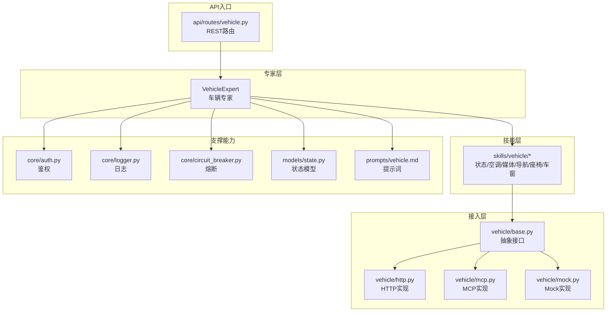
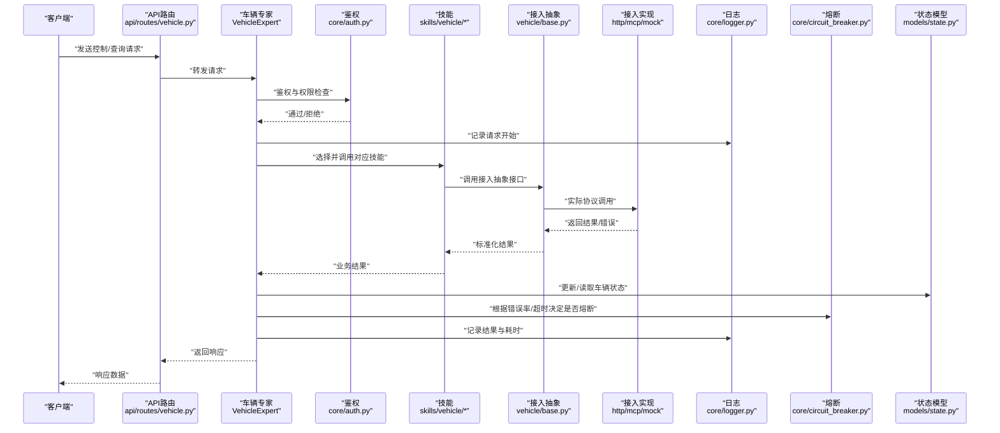
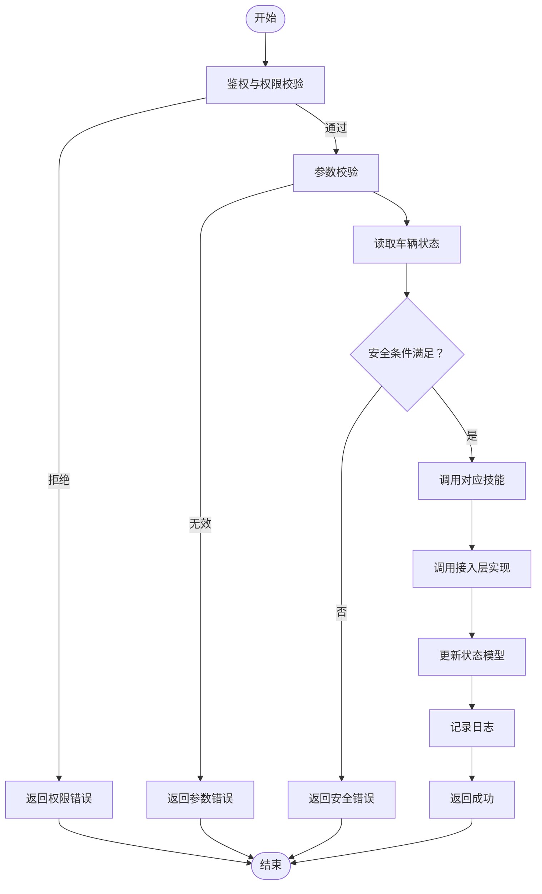
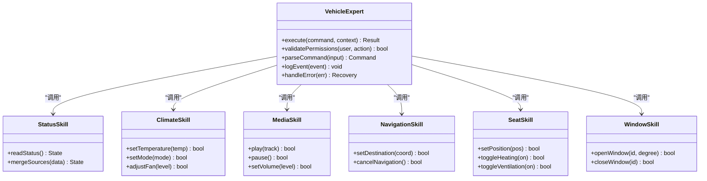
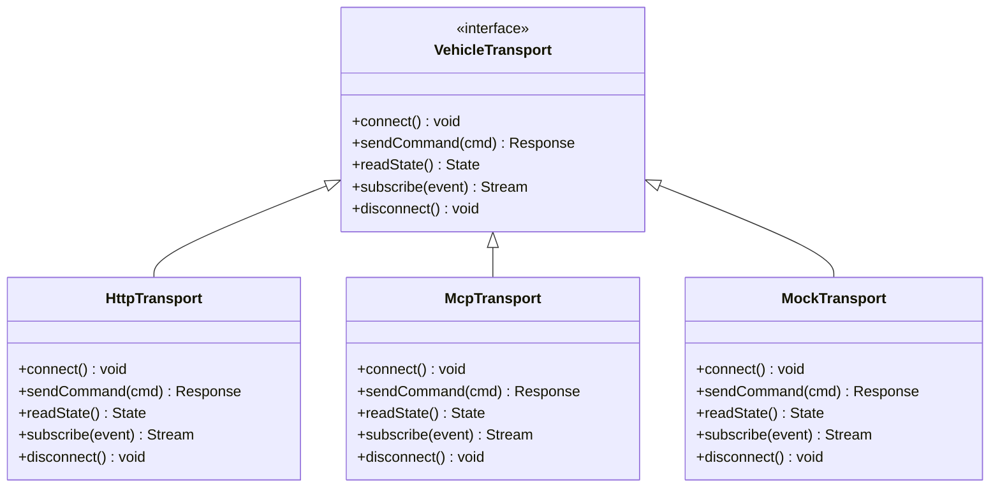
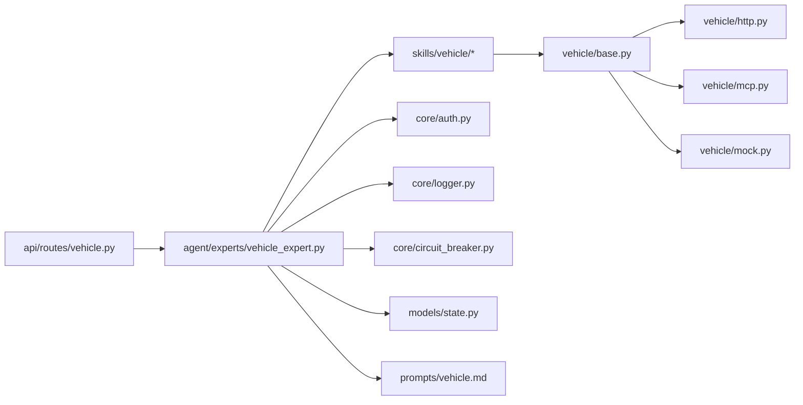

# 车辆专家

<cite>
**本文引用的文件**   
- [backend_design/nexus/agent/experts/vehicle_expert.py](file://backend_design/nexus/agent/experts/vehicle_expert.py)
- [backend_design/nexus/skills/vehicle/__init__.py](file://backend_design/nexus/skills/vehicle/__init__.py)
- [backend_design/nexus/skills/vehicle/status.py](file://backend_design/nexus/skills/vehicle/status.py)
- [backend_design/nexus/skills/vehicle/climate.py](file://backend_design/nexus/skills/vehicle/climate.py)
- [backend_design/nexus/skills/vehicle/media.py](file://backend_design/nexus/skills/vehicle/media.py)
- [backend_design/nexus/skills/vehicle/navigation.py](file://backend_design/nexus/skills/vehicle/navigation.py)
- [backend_design/nexus/skills/vehicle/seat.py](file://backend_design/nexus/skills/vehicle/seat.py)
- [backend_design/nexus/skills/vehicle/window.py](file://backend_design/nexus/skills/vehicle/window.py)
- [backend_design/nexus/vehicle/base.py](file://backend_design/nexus/vehicle/base.py)
- [backend_design/nexus/vehicle/factory.py](file://backend_design/nexus/vehicle/factory.py)
- [backend_design/nexus/vehicle/http.py](file://backend_design/nexus/vehicle/http.py)
- [backend_design/nexus/vehicle/mcp.py](file://backend_design/nexus/vehicle/mcp.py)
- [backend_design/nexus/vehicle/mock.py](file://backend_design/nexus/vehicle/mock.py)
- [backend_design/nexus/api/routes/vehicle.py](file://backend_design/nexus/api/routes/vehicle.py)
- [backend_design/nexus/core/auth.py](file://backend_design/nexus/core/auth.py)
- [backend_design/nexus/core/logger.py](file://backend_design/nexus/core/logger.py)
- [backend_design/nexus/core/circuit_breaker.py](file://backend_design/nexus/core/circuit_breaker.py)
- [backend_design/nexus/models/state.py](file://backend_design/nexus/models/state.py)
- [backend_design/nexus/prompts/vehicle.md](file://backend_design/nexus/prompts/vehicle.md)
</cite>

## 目录
1. [简介](#简介)
2. [项目结构](#项目结构)
3. [核心组件](#核心组件)
4. [架构总览](#架构总览)
5. [详细组件分析](#详细组件分析)
6. [依赖关系分析](#依赖关系分析)
7. [性能考虑](#性能考虑)
8. [故障排查指南](#故障排查指南)
9. [结论](#结论)
10. [附录](#附录)

## 简介
本技术文档面向NexusCockpit的“车辆专家”（VehicleExpert）模块，聚焦以下目标：
- 深入解释车辆控制逻辑：状态监控、控制命令解析与安全验证机制
- 记录与车辆API的集成方式、权限控制与操作日志管理
- 提供具体代码示例路径，展示控制指令处理与状态反馈机制
- 解释与车辆技能系统的协调工作以及错误恢复策略
- 给出安全控制最佳实践与故障诊断方法

## 项目结构
围绕“车辆专家”的关键目录与职责如下：
- agent/experts/vehicle_expert.py：车辆专家主控制器，负责意图识别后的执行编排、权限校验、日志记录、异常处理与结果返回
- skills/vehicle/*：按功能域划分的车辆技能实现（状态、空调、媒体、导航、座椅、车窗等），对外暴露统一接口
- vehicle/*：底层车辆接入层抽象与实现（HTTP/MCP/Mock），屏蔽不同车端协议差异
- api/routes/vehicle.py：REST API路由，将外部请求转发至专家或技能
- core/auth.py：鉴权与权限控制
- core/logger.py：结构化日志
- core/circuit_breaker.py：熔断器，用于保护下游服务
- models/state.py：车辆状态模型定义
- prompts/vehicle.md：与LLM交互时的提示词模板（用于生成控制指令或澄清问题）

图表来源
- [backend_design/nexus/agent/experts/vehicle_expert.py](file://backend_design/nexus/agent/experts/vehicle_expert.py)
- [backend_design/nexus/skills/vehicle/__init__.py](file://backend_design/nexus/skills/vehicle/__init__.py)
- [backend_design/nexus/vehicle/base.py](file://backend_design/nexus/vehicle/base.py)
- [backend_design/nexus/vehicle/http.py](file://backend_design/nexus/vehicle/http.py)
- [backend_design/nexus/vehicle/mcp.py](file://backend_design/nexus/vehicle/mcp.py)
- [backend_design/nexus/vehicle/mock.py](file://backend_design/nexus/vehicle/mock.py)
- [backend_design/nexus/api/routes/vehicle.py](file://backend_design/nexus/api/routes/vehicle.py)
- [backend_design/nexus/core/auth.py](file://backend_design/nexus/core/auth.py)
- [backend_design/nexus/core/logger.py](file://backend_design/nexus/core/logger.py)
- [backend_design/nexus/core/circuit_breaker.py](file://backend_design/nexus/core/circuit_breaker.py)
- [backend_design/nexus/models/state.py](file://backend_design/nexus/models/state.py)
- [backend_design/nexus/prompts/vehicle.md](file://backend_design/nexus/prompts/vehicle.md)

章节来源
- [backend_design/nexus/agent/experts/vehicle_expert.py](file://backend_design/nexus/agent/experts/vehicle_expert.py)
- [backend_design/nexus/skills/vehicle/__init__.py](file://backend_design/nexus/skills/vehicle/__init__.py)
- [backend_design/nexus/vehicle/base.py](file://backend_design/nexus/vehicle/base.py)
- [backend_design/nexus/api/routes/vehicle.py](file://backend_design/nexus/api/routes/vehicle.py)
- [backend_design/nexus/core/auth.py](file://backend_design/nexus/core/auth.py)
- [backend_design/nexus/core/logger.py](file://backend_design/nexus/core/logger.py)
- [backend_design/nexus/core/circuit_breaker.py](file://backend_design/nexus/core/circuit_breaker.py)
- [backend_design/nexus/models/state.py](file://backend_design/nexus/models/state.py)
- [backend_design/nexus/prompts/vehicle.md](file://backend_design/nexus/prompts/vehicle.md)

## 核心组件
- 车辆专家（VehicleExpert）
  - 职责：接收上层意图或API请求，进行权限校验、参数校验、调用对应技能、聚合结果、记录日志并返回。对异常进行捕获与降级处理，必要时触发熔断。
  - 关键流程：鉴权 -> 参数校验 -> 选择技能 -> 调用接入层 -> 状态更新 -> 日志记录 -> 响应返回
- 车辆技能（skills/vehicle/*）
  - 职责：按功能域封装业务逻辑，如读取车辆状态、调节空调、控制媒体、设置导航、调整座椅、控制车窗等。每个技能内部可组合多个接入层调用。
- 接入层（vehicle/*）
  - 职责：抽象统一的车辆通信接口，提供HTTP/MCP/Mock等多种实现，屏蔽协议差异，支持扩展新协议。
- 支撑能力
  - 鉴权（core/auth.py）：基于令牌/角色的访问控制，确保只有授权用户可执行敏感操作
  - 日志（core/logger.py）：结构化记录关键事件、输入输出、耗时与错误码
  - 熔断（core/circuit_breaker.py）：在下游不稳定时快速失败，避免雪崩
  - 状态模型（models/state.py）：定义车辆状态字段与约束
  - 提示词（prompts/vehicle.md）：指导LLM生成符合规范的指令或澄清问题

章节来源
- [backend_design/nexus/agent/experts/vehicle_expert.py](file://backend_design/nexus/agent/experts/vehicle_expert.py)
- [backend_design/nexus/skills/vehicle/status.py](file://backend_design/nexus/skills/vehicle/status.py)
- [backend_design/nexus/skills/vehicle/climate.py](file://backend_design/nexus/skills/vehicle/climate.py)
- [backend_design/nexus/skills/vehicle/media.py](file://backend_design/nexus/skills/vehicle/media.py)
- [backend_design/nexus/skills/vehicle/navigation.py](file://backend_design/nexus/skills/vehicle/navigation.py)
- [backend_design/nexus/skills/vehicle/seat.py](file://backend_design/nexus/skills/vehicle/seat.py)
- [backend_design/nexus/skills/vehicle/window.py](file://backend_design/nexus/skills/vehicle/window.py)
- [backend_design/nexus/vehicle/base.py](file://backend_design/nexus/vehicle/base.py)
- [backend_design/nexus/vehicle/http.py](file://backend_design/nexus/vehicle/http.py)
- [backend_design/nexus/vehicle/mcp.py](file://backend_design/nexus/vehicle/mcp.py)
- [backend_design/nexus/vehicle/mock.py](file://backend_design/nexus/vehicle/mock.py)
- [backend_design/nexus/core/auth.py](file://backend_design/nexus/core/auth.py)
- [backend_design/nexus/core/logger.py](file://backend_design/nexus/core/logger.py)
- [backend_design/nexus/core/circuit_breaker.py](file://backend_design/nexus/core/circuit_breaker.py)
- [backend_design/nexus/models/state.py](file://backend_design/nexus/models/state.py)
- [backend_design/nexus/prompts/vehicle.md](file://backend_design/nexus/prompts/vehicle.md)

## 架构总览
下图展示了从API到专家、技能、接入层的完整调用链，以及鉴权、日志、熔断与状态模型的参与点。

图表来源
- [backend_design/nexus/api/routes/vehicle.py](file://backend_design/nexus/api/routes/vehicle.py)
- [backend_design/nexus/agent/experts/vehicle_expert.py](file://backend_design/nexus/agent/experts/vehicle_expert.py)
- [backend_design/nexus/core/auth.py](file://backend_design/nexus/core/auth.py)
- [backend_design/nexus/core/logger.py](file://backend_design/nexus/core/logger.py)
- [backend_design/nexus/core/circuit_breaker.py](file://backend_design/nexus/core/circuit_breaker.py)
- [backend_design/nexus/models/state.py](file://backend_design/nexus/models/state.py)
- [backend_design/nexus/vehicle/base.py](file://backend_design/nexus/vehicle/base.py)
- [backend_design/nexus/vehicle/http.py](file://backend_design/nexus/vehicle/http.py)
- [backend_design/nexus/vehicle/mcp.py](file://backend_design/nexus/vehicle/mcp.py)
- [backend_design/nexus/vehicle/mock.py](file://backend_design/nexus/vehicle/mock.py)

## 详细组件分析

### 车辆专家（VehicleExpert）
- 控制逻辑要点
  - 权限控制：在执行任何写操作前进行鉴权与角色/资源权限校验
  - 参数校验：对输入参数进行类型、范围、依赖关系校验，防止非法指令进入系统
  - 命令解析：结合提示词模板与上下文，将自然语言或结构化输入转换为标准控制指令
  - 安全验证：对高风险操作（如解锁、启动、关闭门窗）进行二次确认或条件检查（例如车速、挡位）
  - 状态监控：在操作前后读取并对比车辆状态，确保操作生效且无冲突
  - 日志与审计：记录关键事件、输入输出摘要、耗时与错误码，便于追踪与合规
  - 错误恢复：对瞬时错误重试、对持续错误触发熔断；必要时回滚或降级
- 典型流程（以“打开车窗”为例）
  - 鉴权通过 -> 参数校验（窗口ID、开度）-> 读取当前状态（是否已开启/车速限制）-> 调用车窗技能 -> 调用接入层 -> 更新状态 -> 记录日志 -> 返回结果
- 代码片段路径
  - 专家主流程与权限校验：[backend_design/nexus/agent/experts/vehicle_expert.py](file://backend_design/nexus/agent/experts/vehicle_expert.py)
  - 提示词模板（用于指令生成/澄清）：[backend_design/nexus/prompts/vehicle.md](file://backend_design/nexus/prompts/vehicle.md)

图表来源
- [backend_design/nexus/agent/experts/vehicle_expert.py](file://backend_design/nexus/agent/experts/vehicle_expert.py)
- [backend_design/nexus/core/auth.py](file://backend_design/nexus/core/auth.py)
- [backend_design/nexus/models/state.py](file://backend_design/nexus/models/state.py)
- [backend_design/nexus/core/logger.py](file://backend_design/nexus/core/logger.py)

章节来源
- [backend_design/nexus/agent/experts/vehicle_expert.py](file://backend_design/nexus/agent/experts/vehicle_expert.py)
- [backend_design/nexus/prompts/vehicle.md](file://backend_design/nexus/prompts/vehicle.md)
- [backend_design/nexus/core/auth.py](file://backend_design/nexus/core/auth.py)
- [backend_design/nexus/models/state.py](file://backend_design/nexus/models/state.py)
- [backend_design/nexus/core/logger.py](file://backend_design/nexus/core/logger.py)

### 车辆技能（skills/vehicle/*）
- 状态技能（status.py）
  - 职责：聚合读取车辆各子系统状态，返回统一的结构化状态对象
  - 关键点：缓存最近一次状态、合并多源数据、处理缺失字段
- 空调技能（climate.py）
  - 职责：温度、风量、模式、分区控制
  - 关键点：温度范围校验、模式互斥、能耗提示
- 媒体技能（media.py）
  - 职责：播放、暂停、切歌、音量、列表管理
  - 关键点：设备绑定、音源切换、播放状态同步
- 导航技能（navigation.py）
  - 职责：设置目的地、路线偏好、取消导航
  - 关键点：坐标有效性、路线计算、实时位置上报
- 座椅技能（seat.py）
  - 职责：位置、加热、通风、记忆位
  - 关键点：位置边界、加热/通风互斥、安全锁止
- 车窗技能（window.py）
  - 职责：开窗/关窗、开度控制、防夹检测
  - 关键点：车速限制、防夹状态、联动天窗

图表来源
- [backend_design/nexus/agent/experts/vehicle_expert.py](file://backend_design/nexus/agent/experts/vehicle_expert.py)
- [backend_design/nexus/skills/vehicle/status.py](file://backend_design/nexus/skills/vehicle/status.py)
- [backend_design/nexus/skills/vehicle/climate.py](file://backend_design/nexus/skills/vehicle/climate.py)
- [backend_design/nexus/skills/vehicle/media.py](file://backend_design/nexus/skills/vehicle/media.py)
- [backend_design/nexus/skills/vehicle/navigation.py](file://backend_design/nexus/skills/vehicle/navigation.py)
- [backend_design/nexus/skills/vehicle/seat.py](file://backend_design/nexus/skills/vehicle/seat.py)
- [backend_design/nexus/skills/vehicle/window.py](file://backend_design/nexus/skills/vehicle/window.py)

章节来源
- [backend_design/nexus/skills/vehicle/status.py](file://backend_design/nexus/skills/vehicle/status.py)
- [backend_design/nexus/skills/vehicle/climate.py](file://backend_design/nexus/skills/vehicle/climate.py)
- [backend_design/nexus/skills/vehicle/media.py](file://backend_design/nexus/skills/vehicle/media.py)
- [backend_design/nexus/skills/vehicle/navigation.py](file://backend_design/nexus/skills/vehicle/navigation.py)
- [backend_design/nexus/skills/vehicle/seat.py](file://backend_design/nexus/skills/vehicle/seat.py)
- [backend_design/nexus/skills/vehicle/window.py](file://backend_design/nexus/skills/vehicle/window.py)

### 接入层（vehicle/*）
- 抽象接口（base.py）
  - 职责：定义统一的连接、发送命令、读取状态、订阅事件等接口
- HTTP实现（http.py）
  - 职责：通过HTTP REST/gRPC调用车端服务，处理认证头、重试、超时
- MCP实现（mcp.py）
  - 职责：通过消息通道协议与车端交互，支持异步事件推送
- Mock实现（mock.py）
  - 职责：开发测试环境模拟车端行为，便于联调与回归

图表来源
- [backend_design/nexus/vehicle/base.py](file://backend_design/nexus/vehicle/base.py)
- [backend_design/nexus/vehicle/http.py](file://backend_design/nexus/vehicle/http.py)
- [backend_design/nexus/vehicle/mcp.py](file://backend_design/nexus/vehicle/mcp.py)
- [backend_design/nexus/vehicle/mock.py](file://backend_design/nexus/vehicle/mock.py)

章节来源
- [backend_design/nexus/vehicle/base.py](file://backend_design/nexus/vehicle/base.py)
- [backend_design/nexus/vehicle/http.py](file://backend_design/nexus/vehicle/http.py)
- [backend_design/nexus/vehicle/mcp.py](file://backend_design/nexus/vehicle/mcp.py)
- [backend_design/nexus/vehicle/mock.py](file://backend_design/nexus/vehicle/mock.py)

### API路由（api/routes/vehicle.py）
- 职责：暴露REST接口，接收前端或第三方系统请求，委派给车辆专家或相应技能
- 关键点：请求体校验、分页/过滤、限流、跨域、响应格式统一

章节来源
- [backend_design/nexus/api/routes/vehicle.py](file://backend_design/nexus/api/routes/vehicle.py)

### 鉴权与权限控制（core/auth.py）
- 职责：基于令牌/会话/角色的访问控制，支持细粒度资源权限（如仅允许驾驶座用户执行某些操作）
- 关键点：JWT校验、角色映射、资源白名单、敏感操作二次确认

章节来源
- [backend_design/nexus/core/auth.py](file://backend_design/nexus/core/auth.py)

### 操作日志管理（core/logger.py）
- 职责：结构化记录关键事件，包括请求ID、用户、动作、参数摘要、耗时、错误码
- 关键点：脱敏处理、采样策略、分级输出、与可观测性平台对接

章节来源
- [backend_design/nexus/core/logger.py](file://backend_design/nexus/core/logger.py)

### 熔断与错误恢复（core/circuit_breaker.py）
- 职责：在下游服务不稳定时快速失败，避免级联故障；支持半开探测与自动恢复
- 关键点：阈值配置、滑动窗口统计、退避重试、降级策略

章节来源
- [backend_design/nexus/core/circuit_breaker.py](file://backend_design/nexus/core/circuit_breaker.py)

### 车辆状态模型（models/state.py）
- 职责：定义车辆状态字段、取值范围、必填项与关联关系
- 关键点：版本兼容、增量更新、一致性校验

章节来源
- [backend_design/nexus/models/state.py](file://backend_design/nexus/models/state.py)

### 提示词模板（prompts/vehicle.md）
- 职责：为LLM提供结构化指令生成与澄清问题的引导，确保输出符合系统规范
- 关键点：字段约束、枚举值、错误提示、安全规则

章节来源
- [backend_design/nexus/prompts/vehicle.md](file://backend_design/nexus/prompts/vehicle.md)

## 依赖关系分析
- 耦合与内聚
  - 专家层与技能层松耦合：通过明确定义的接口与数据结构交互
  - 技能层与接入层解耦：技能只依赖抽象接口，具体实现可替换
  - 支撑能力横向贯穿：鉴权、日志、熔断在各层复用
- 外部依赖
  - 车端服务（HTTP/MCP）、存储（状态快照）、可观测性平台（日志/指标）
- 潜在循环依赖
  - 通过分层与接口隔离避免循环引用

图表来源
- [backend_design/nexus/api/routes/vehicle.py](file://backend_design/nexus/api/routes/vehicle.py)
- [backend_design/nexus/agent/experts/vehicle_expert.py](file://backend_design/nexus/agent/experts/vehicle_expert.py)
- [backend_design/nexus/skills/vehicle/__init__.py](file://backend_design/nexus/skills/vehicle/__init__.py)
- [backend_design/nexus/vehicle/base.py](file://backend_design/nexus/vehicle/base.py)
- [backend_design/nexus/vehicle/http.py](file://backend_design/nexus/vehicle/http.py)
- [backend_design/nexus/vehicle/mcp.py](file://backend_design/nexus/vehicle/mcp.py)
- [backend_design/nexus/vehicle/mock.py](file://backend_design/nexus/vehicle/mock.py)
- [backend_design/nexus/core/auth.py](file://backend_design/nexus/core/auth.py)
- [backend_design/nexus/core/logger.py](file://backend_design/nexus/core/logger.py)
- [backend_design/nexus/core/circuit_breaker.py](file://backend_design/nexus/core/circuit_breaker.py)
- [backend_design/nexus/models/state.py](file://backend_design/nexus/models/state.py)
- [backend_design/nexus/prompts/vehicle.md](file://backend_design/nexus/prompts/vehicle.md)

章节来源
- [backend_design/nexus/agent/experts/vehicle_expert.py](file://backend_design/nexus/agent/experts/vehicle_expert.py)
- [backend_design/nexus/skills/vehicle/__init__.py](file://backend_design/nexus/skills/vehicle/__init__.py)
- [backend_design/nexus/vehicle/base.py](file://backend_design/nexus/vehicle/base.py)
- [backend_design/nexus/api/routes/vehicle.py](file://backend_design/nexus/api/routes/vehicle.py)
- [backend_design/nexus/core/auth.py](file://backend_design/nexus/core/auth.py)
- [backend_design/nexus/core/logger.py](file://backend_design/nexus/core/logger.py)
- [backend_design/nexus/core/circuit_breaker.py](file://backend_design/nexus/core/circuit_breaker.py)
- [backend_design/nexus/models/state.py](file://backend_design/nexus/models/state.py)
- [backend_design/nexus/prompts/vehicle.md](file://backend_design/nexus/prompts/vehicle.md)

## 性能考虑
- 并发与吞吐
  - 使用连接池与异步I/O提升HTTP/MCP调用效率
  - 对读多写少的状态查询引入本地缓存与失效策略
- 超时与重试
  - 合理设置超时时间，采用指数退避与最大重试次数
  - 区分瞬时错误与持久错误，避免无效重试
- 熔断与降级
  - 动态调整熔断阈值，结合业务SLA
  - 在熔断期间返回友好降级信息或默认值
- 日志采样
  - 对高频日志进行采样，降低IO压力
  - 关键错误全量记录，便于排障

## 故障排查指南
- 常见问题定位
  - 鉴权失败：检查令牌有效期、角色与资源权限映射
  - 参数错误：核对输入字段类型、取值范围与依赖关系
  - 安全拦截：查看车速、挡位、门锁等前置条件是否满足
  - 下游不可用：观察熔断器状态、错误率与延迟分布
- 日志与指标
  - 使用请求ID串联上下游日志
  - 关注错误码、耗时分位数、重试次数
- 恢复策略
  - 临时降级：关闭非关键功能，保留核心控制
  - 回滚：对变更的配置或数据进行回滚
  - 自愈：等待熔断半开后自动探测恢复

章节来源
- [backend_design/nexus/core/auth.py](file://backend_design/nexus/core/auth.py)
- [backend_design/nexus/core/logger.py](file://backend_design/nexus/core/logger.py)
- [backend_design/nexus/core/circuit_breaker.py](file://backend_design/nexus/core/circuit_breaker.py)

## 结论
车辆专家模块通过清晰的层次划分与严格的权限、安全与日志机制，实现了稳定可靠的车辆控制能力。借助统一的接入抽象与多种实现，系统具备良好的可扩展性与容错性。建议在生产环境中持续优化熔断与重试策略，完善可观测性，并定期演练故障恢复流程，以提升整体可靠性与用户体验。

## 附录
- 代码示例路径（不直接展示代码内容）
  - 专家主流程与权限校验：[backend_design/nexus/agent/experts/vehicle_expert.py](file://backend_design/nexus/agent/experts/vehicle_expert.py)
  - 状态读取与合并：[backend_design/nexus/skills/vehicle/status.py](file://backend_design/nexus/skills/vehicle/status.py)
  - 空调控制：[backend_design/nexus/skills/vehicle/climate.py](file://backend_design/nexus/skills/vehicle/climate.py)
  - 媒体控制：[backend_design/nexus/skills/vehicle/media.py](file://backend_design/nexus/skills/vehicle/media.py)
  - 导航设置：[backend_design/nexus/skills/vehicle/navigation.py](file://backend_design/nexus/skills/vehicle/navigation.py)
  - 座椅控制：[backend_design/nexus/skills/vehicle/seat.py](file://backend_design/nexus/skills/vehicle/seat.py)
  - 车窗控制：[backend_design/nexus/skills/vehicle/window.py](file://backend_design/nexus/skills/vehicle/window.py)
  - 接入抽象与实现：[backend_design/nexus/vehicle/base.py](file://backend_design/nexus/vehicle/base.py)、[backend_design/nexus/vehicle/http.py](file://backend_design/nexus/vehicle/http.py)、[backend_design/nexus/vehicle/mcp.py](file://backend_design/nexus/vehicle/mcp.py)、[backend_design/nexus/vehicle/mock.py](file://backend_design/nexus/vehicle/mock.py)
  - API路由：[backend_design/nexus/api/routes/vehicle.py](file://backend_design/nexus/api/routes/vehicle.py)
  - 鉴权与日志：[backend_design/nexus/core/auth.py](file://backend_design/nexus/core/auth.py)、[backend_design/nexus/core/logger.py](file://backend_design/nexus/core/logger.py)
  - 熔断与状态模型：[backend_design/nexus/core/circuit_breaker.py](file://backend_design/nexus/core/circuit_breaker.py)、[backend_design/nexus/models/state.py](file://backend_design/nexus/models/state.py)
  - 提示词模板：[backend_design/nexus/prompts/vehicle.md](file://backend_design/nexus/prompts/vehicle.md)