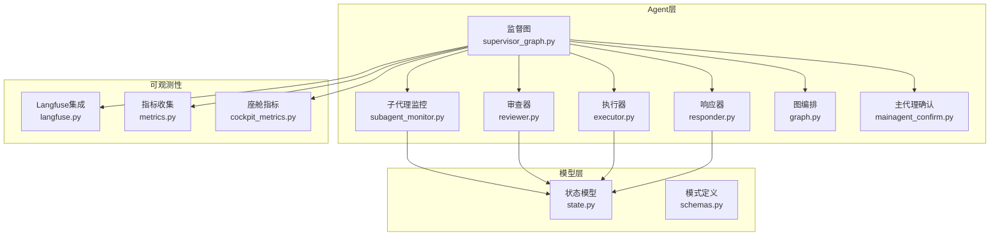
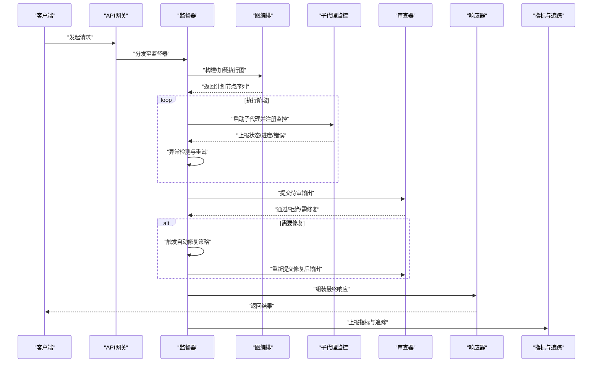
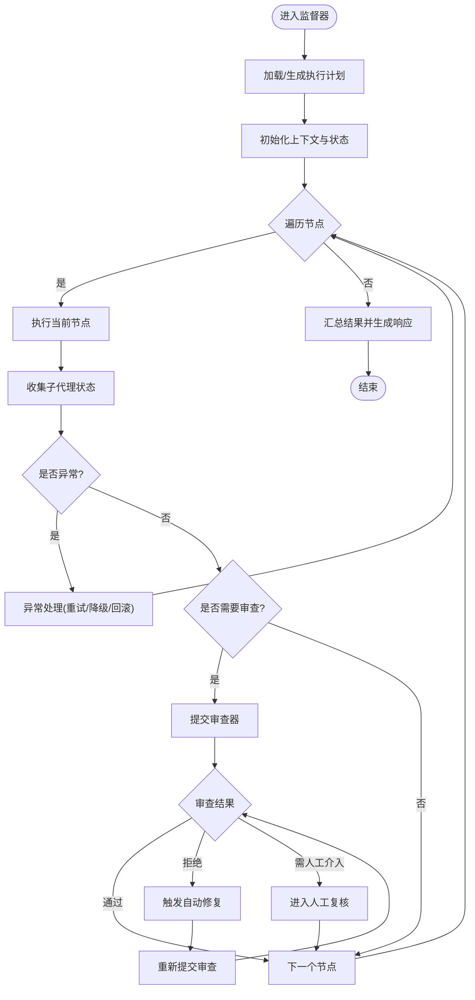
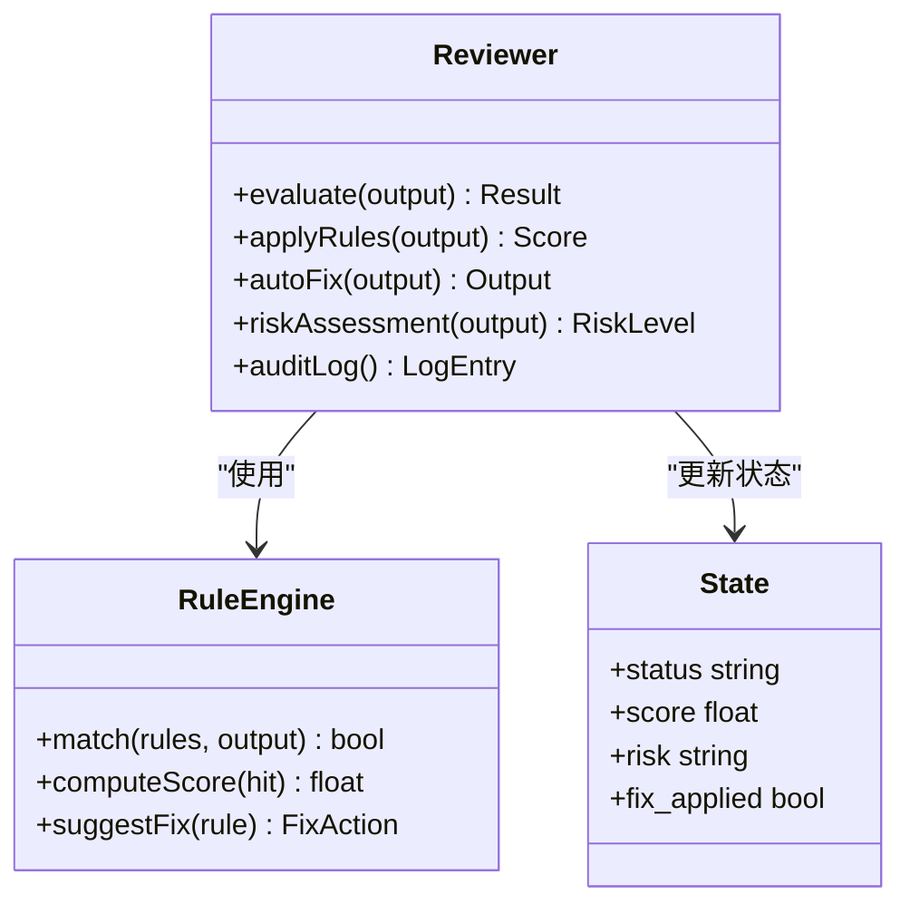
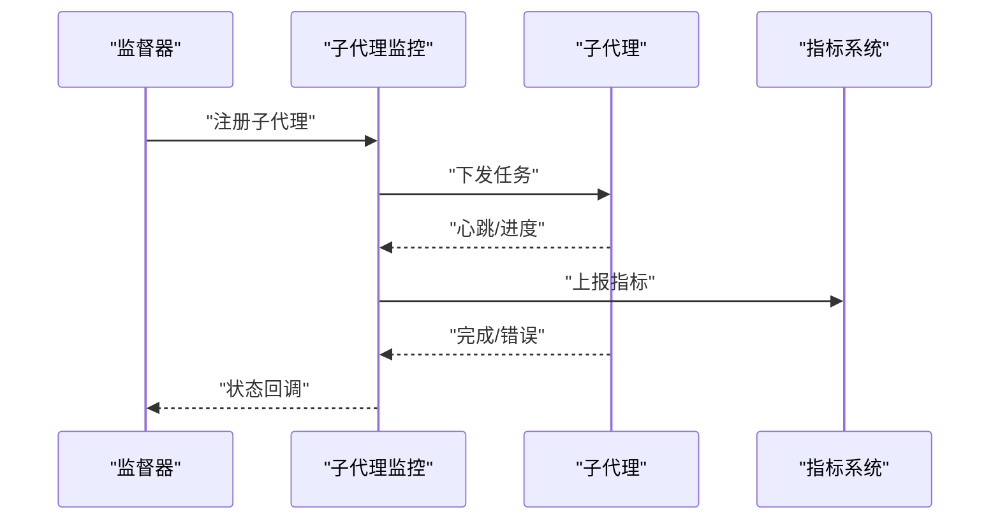
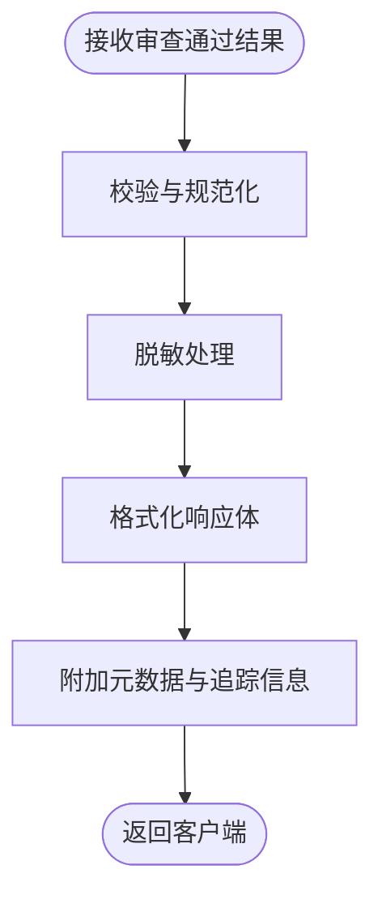
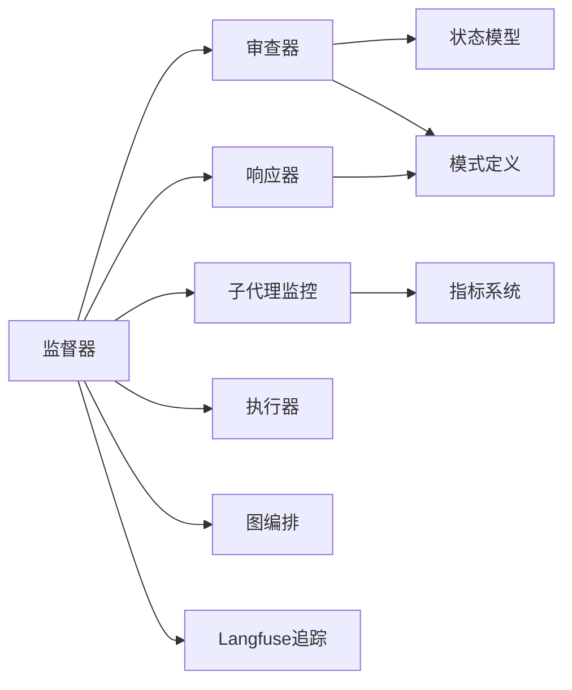

# 监督器和审查器

<cite>
**本文引用的文件**   
- [supervisor_graph.py](file://backend_design/nexus/agent/supervisor_graph.py)
- [reviewer.py](file://backend_design/nexus/agent/reviewer.py)
- [subagent_monitor.py](file://backend_design/nexus/agent/subagent_monitor.py)
- [responder.py](file://backend_design/nexus/agent/responder.py)
- [executor.py](file://backend_design/nexus/agent/executor.py)
- [graph.py](file://backend_design/nexus/agent/graph.py)
- [mainagent_confirm.py](file://backend_design/nexus/agent/mainagent_confirm.py)
- [state.py](file://backend_design/nexus/models/state.py)
- [schemas.py](file://backend_design/nexus/models/schemas.py)
- [cockpit_manager.py](file://backend_design/nexus/core/cockpit_manager.py)
- [langfuse.py](file://backend_design/nexus/observability/langfuse.py)
- [metrics.py](file://backend_design/nexus/observability/metrics.py)
- [cockpit_metrics.py](file://backend_design/nexus/observability/cockpit_metrics.py)
</cite>

## 目录
1. [简介](#简介)
2. [项目结构](#项目结构)
3. [核心组件](#核心组件)
4. [架构总览](#架构总览)
5. [详细组件分析](#详细组件分析)
6. [依赖关系分析](#依赖关系分析)
7. [性能与可扩展性](#性能与可扩展性)
8. [故障排查指南](#故障排查指南)
9. [结论](#结论)
10. [附录](#附录)

## 简介
本技术文档聚焦于NexusCockpit中“监督器”和“审查器”两大关键子系统，围绕以下目标展开：
- 解释响应生成机制：从用户请求到最终响应的端到端流程。
- 阐述质量审查流程与反馈循环：如何对Agent输出进行安全与质量评估，并驱动修正或回退。
- 记录监督器如何监控Agent执行状态、进度与异常。
- 说明审查器如何评估输出质量、安全性，以及触发自动修复策略。
- 提供来自代码库的具体示例路径，展示响应格式化与审查规则配置方式。
- 覆盖异常检测、自动修复和用户反馈处理。
- 给出质量控制策略与调试工具使用建议。

## 项目结构
与监督器和审查器相关的核心代码位于后端设计目录的agent与models、observability等模块中。整体组织遵循分层与职责分离原则：
- agent层：负责编排、监督、审查、执行与响应生成。
- models层：定义状态与数据模型（如会话、任务、结果）。
- observability层：提供可观测性指标、追踪与日志集成。

图表来源
- [supervisor_graph.py](file://backend_design/nexus/agent/supervisor_graph.py)
- [subagent_monitor.py](file://backend_design/nexus/agent/subagent_monitor.py)
- [reviewer.py](file://backend_design/nexus/agent/reviewer.py)
- [executor.py](file://backend_design/nexus/agent/executor.py)
- [responder.py](file://backend_design/nexus/agent/responder.py)
- [graph.py](file://backend_design/nexus/agent/graph.py)
- [mainagent_confirm.py](file://backend_design/nexus/agent/mainagent_confirm.py)
- [state.py](file://backend_design/nexus/models/state.py)
- [schemas.py](file://backend_design/nexus/models/schemas.py)
- [langfuse.py](file://backend_design/nexus/observability/langfuse.py)
- [metrics.py](file://backend_design/nexus/observability/metrics.py)
- [cockpit_metrics.py](file://backend_design/nexus/observability/cockpit_metrics.py)

章节来源
- [supervisor_graph.py](file://backend_design/nexus/agent/supervisor_graph.py)
- [reviewer.py](file://backend_design/nexus/agent/reviewer.py)
- [subagent_monitor.py](file://backend_design/nexus/agent/subagent_monitor.py)
- [responder.py](file://backend_design/nexus/agent/responder.py)
- [executor.py](file://backend_design/nexus/agent/executor.py)
- [graph.py](file://backend_design/nexus/agent/graph.py)
- [mainagent_confirm.py](file://backend_design/nexus/agent/mainagent_confirm.py)
- [state.py](file://backend_design/nexus/models/state.py)
- [schemas.py](file://backend_design/nexus/models/schemas.py)
- [langfuse.py](file://backend_design/nexus/observability/langfuse.py)
- [metrics.py](file://backend_design/nexus/observability/metrics.py)
- [cockpit_metrics.py](file://backend_design/nexus/observability/cockpit_metrics.py)

## 核心组件
- 监督器（Supervisor）
  - 职责：统一编排Agent工作流，协调子代理执行、进度跟踪、异常捕获与重试；在必要时触发审查与修复。
  - 关键能力：基于图的调度、状态机推进、事件广播、指标上报。
- 审查器（Reviewer）
  - 职责：对Agent输出进行质量与安全审查，包括内容合规、格式校验、敏感信息过滤、风险评分与决策分支。
  - 关键能力：规则引擎、阈值判定、自动修复建议、人工复核入口。
- 子代理监控（Subagent Monitor）
  - 职责：采集各子代理的执行状态、耗时、错误码与资源占用，形成统一视图。
- 响应器（Responder）
  - 职责：将审查通过的中间结果转换为对外一致的响应格式，支持流式与批量两种模式。
- 执行器（Executor）
  - 职责：调用具体技能或外部服务，封装重试、熔断与降级逻辑。
- 图编排（Graph）
  - 职责：定义节点与边，管理有向无环图（DAG）的执行顺序与条件跳转。
- 主代理确认（Main Agent Confirm）
  - 职责：在高风险操作前引入二次确认或人类审批环节。

章节来源
- [supervisor_graph.py](file://backend_design/nexus/agent/supervisor_graph.py)
- [reviewer.py](file://backend_design/nexus/agent/reviewer.py)
- [subagent_monitor.py](file://backend_design/nexus/agent/subagent_monitor.py)
- [responder.py](file://backend_design/nexus/agent/responder.py)
- [executor.py](file://backend_design/nexus/agent/executor.py)
- [graph.py](file://backend_design/nexus/agent/graph.py)
- [mainagent_confirm.py](file://backend_design/nexus/agent/mainagent_confirm.py)

## 架构总览
下图展示了从用户请求到最终响应的端到端流程，突出监督器与审查器的协作关系。

图表来源
- [supervisor_graph.py](file://backend_design/nexus/agent/supervisor_graph.py)
- [graph.py](file://backend_design/nexus/agent/graph.py)
- [subagent_monitor.py](file://backend_design/nexus/agent/subagent_monitor.py)
- [reviewer.py](file://backend_design/nexus/agent/reviewer.py)
- [responder.py](file://backend_design/nexus/agent/responder.py)
- [metrics.py](file://backend_design/nexus/observability/metrics.py)
- [langfuse.py](file://backend_design/nexus/observability/langfuse.py)

## 详细组件分析

### 监督器（Supervisor）
- 角色定位
  - 作为控制面，监督器维护全局上下文与状态，驱动图执行，协调子代理生命周期，并在异常时进行恢复。
- 关键行为
  - 图加载与规划：根据输入选择合适模板或动态生成节点序列。
  - 状态推进：依据子代理上报的状态更新全局状态机。
  - 异常检测：识别超时、错误码、资源不足等异常信号，触发重试或降级。
  - 审查触发：在关键节点后插入审查点，确保输出符合质量与安全要求。
  - 指标上报：将关键路径耗时、成功率、失败原因等指标写入可观测系统。
- 与审查器的交互
  - 监督器将中间产物提交给审查器，并根据审查结果决定继续、修复或终止。
- 与监控的交互
  - 通过子代理监控获取细粒度执行信息，用于可视化与告警。

图表来源
- [supervisor_graph.py](file://backend_design/nexus/agent/supervisor_graph.py)
- [graph.py](file://backend_design/nexus/agent/graph.py)
- [subagent_monitor.py](file://backend_design/nexus/agent/subagent_monitor.py)
- [reviewer.py](file://backend_design/nexus/agent/reviewer.py)

章节来源
- [supervisor_graph.py](file://backend_design/nexus/agent/supervisor_graph.py)
- [graph.py](file://backend_design/nexus/agent/graph.py)
- [subagent_monitor.py](file://backend_design/nexus/agent/subagent_monitor.py)

### 审查器（Reviewer）
- 角色定位
  - 作为质量与安全闸门，审查器对Agent输出进行多维度评估，包括内容完整性、格式正确性、敏感信息、合规性与风险等级。
- 关键行为
  - 规则匹配：基于配置的规则集进行命中判断。
  - 评分与阈值：计算综合得分并与阈值比较，决定通过、拒绝或需修复。
  - 自动修复：对常见问题进行自动修正（如格式补全、敏感词替换、字段补齐）。
  - 人工复核：对高风险或不确定场景转交人工处理。
  - 审计与追踪：记录审查过程、规则命中详情与决策依据。
- 与监督器的协作
  - 接收待审对象，返回结构化审查结果；监督器据此推进流程或触发修复。

图表来源
- [reviewer.py](file://backend_design/nexus/agent/reviewer.py)
- [state.py](file://backend_design/nexus/models/state.py)

章节来源
- [reviewer.py](file://backend_design/nexus/agent/reviewer.py)
- [state.py](file://backend_design/nexus/models/state.py)

### 子代理监控（Subagent Monitor）
- 职责
  - 注册与跟踪子代理实例，采集运行态指标（开始/结束时间、错误码、资源使用），聚合为统一视图。
- 关键能力
  - 心跳与超时检测：及时发现停滞或挂起任务。
  - 错误分类：区分网络、业务、权限等错误类型，便于后续处理。
  - 可视化与告警：为前端与运维提供实时状态与告警信号。

图表来源
- [subagent_monitor.py](file://backend_design/nexus/agent/subagent_monitor.py)
- [metrics.py](file://backend_design/nexus/observability/metrics.py)

章节来源
- [subagent_monitor.py](file://backend_design/nexus/agent/subagent_monitor.py)
- [metrics.py](file://backend_design/nexus/observability/metrics.py)

### 响应器（Responder）
- 职责
  - 将审查通过的中间结果转换为统一的响应格式，支持流式与批量输出，附加元数据与追踪ID。
- 关键行为
  - 格式标准化：确保字段一致、类型正确、可选字段默认值合理。
  - 安全脱敏：在输出前再次检查敏感信息。
  - 压缩与分页：对大数据量结果进行分页或压缩。
  - 可观测性：附带trace_id、span_id等追踪信息。

图表来源
- [responder.py](file://backend_design/nexus/agent/responder.py)
- [schemas.py](file://backend_design/nexus/models/schemas.py)

章节来源
- [responder.py](file://backend_design/nexus/agent/responder.py)
- [schemas.py](file://backend_design/nexus/models/schemas.py)

### 执行器（Executor）
- 职责
  - 封装具体技能的调用逻辑，提供重试、熔断、超时与降级策略。
- 关键行为
  - 幂等性保障：对可重复操作提供幂等键。
  - 资源隔离：限制并发与资源配额。
  - 错误传播：向上抛出结构化错误以便监督器处理。

章节来源
- [executor.py](file://backend_design/nexus/agent/executor.py)

### 图编排（Graph）
- 职责
  - 定义节点类型、边条件与执行顺序，支持动态扩展与条件分支。
- 关键行为
  - 拓扑校验：确保无环与可达性。
  - 并行与串行：按依赖关系调度。
  - 回滚与补偿：在失败时执行补偿动作。

章节来源
- [graph.py](file://backend_design/nexus/agent/graph.py)

### 主代理确认（Main Agent Confirm）
- 职责
  - 在高风险操作前引入二次确认或人类审批，降低误操作风险。
- 关键行为
  - 风险分级：结合审查器评分与业务规则确定是否需要确认。
  - 人机协同：提供确认界面与快速通道。

章节来源
- [mainagent_confirm.py](file://backend_design/nexus/agent/mainagent_confirm.py)

## 依赖关系分析
监督器与审查器之间的耦合主要体现在数据契约与流程控制上：
- 数据契约：由schemas与state定义，确保双方对输入输出结构达成一致。
- 流程控制：监督器在关键节点插入审查点，审查器返回决策结果驱动下一步。
- 可观测性：两者均向指标与追踪系统上报数据，便于问题定位与性能优化。

图表来源
- [supervisor_graph.py](file://backend_design/nexus/agent/supervisor_graph.py)
- [reviewer.py](file://backend_design/nexus/agent/reviewer.py)
- [subagent_monitor.py](file://backend_design/nexus/agent/subagent_monitor.py)
- [responder.py](file://backend_design/nexus/agent/responder.py)
- [executor.py](file://backend_design/nexus/agent/executor.py)
- [graph.py](file://backend_design/nexus/agent/graph.py)
- [state.py](file://backend_design/nexus/models/state.py)
- [schemas.py](file://backend_design/nexus/models/schemas.py)
- [metrics.py](file://backend_design/nexus/observability/metrics.py)
- [langfuse.py](file://backend_design/nexus/observability/langfuse.py)

章节来源
- [supervisor_graph.py](file://backend_design/nexus/agent/supervisor_graph.py)
- [reviewer.py](file://backend_design/nexus/agent/reviewer.py)
- [subagent_monitor.py](file://backend_design/nexus/agent/subagent_monitor.py)
- [responder.py](file://backend_design/nexus/agent/responder.py)
- [executor.py](file://backend_design/nexus/agent/executor.py)
- [graph.py](file://backend_design/nexus/agent/graph.py)
- [state.py](file://backend_design/nexus/models/state.py)
- [schemas.py](file://backend_design/nexus/models/schemas.py)
- [metrics.py](file://backend_design/nexus/observability/metrics.py)
- [langfuse.py](file://backend_design/nexus/observability/langfuse.py)

## 性能与可扩展性
- 批处理与流式
  - 对于大批量输出，优先采用批处理减少序列化与传输开销；对交互式场景使用流式提升用户体验。
- 并发与限流
  - 利用执行器的并发控制与限流策略，避免下游服务过载。
- 缓存与去重
  - 对可复用的中间结果进行缓存，结合幂等键避免重复计算。
- 指标与追踪
  - 通过指标系统与Langfuse追踪，建立端到端链路，辅助容量规划与瓶颈定位。

[本节为通用指导，不直接分析具体文件]

## 故障排查指南
- 常见问题定位
  - 子代理超时或挂起：查看子代理监控的心跳与错误分类，结合指标系统定位瓶颈。
  - 审查失败：检查审查规则命中详情与风险评分，确认是否需要调整阈值或增加自动修复规则。
  - 响应格式错误：对照模式定义校验字段类型与必填项，关注响应器的脱敏与格式化步骤。
- 调试工具与建议
  - 启用详细日志与追踪ID，关联上下游调用链。
  - 使用指标看板观察关键路径耗时与错误率趋势。
  - 对高风险操作开启主代理确认，降低误操作影响范围。

章节来源
- [subagent_monitor.py](file://backend_design/nexus/agent/subagent_monitor.py)
- [reviewer.py](file://backend_design/nexus/agent/reviewer.py)
- [responder.py](file://backend_design/nexus/agent/responder.py)
- [schemas.py](file://backend_design/nexus/models/schemas.py)
- [metrics.py](file://backend_design/nexus/observability/metrics.py)
- [langfuse.py](file://backend_design/nexus/observability/langfuse.py)
- [mainagent_confirm.py](file://backend_design/nexus/agent/mainagent_confirm.py)

## 结论
监督器与审查器共同构成了NexusCockpit的质量与安全防线。监督器以图编排为核心，协调子代理执行与异常恢复；审查器以规则与评分为基础，确保输出符合预期。通过完善的监控、指标与追踪体系，系统具备较强的可观测性与可维护性。建议在持续迭代中完善自动修复规则、优化阈值策略，并结合用户反馈闭环不断提升质量。

[本节为总结性内容，不直接分析具体文件]

## 附录
- 响应格式参考
  - 参见模式定义文件中的响应结构描述，确保字段一致性。
- 审查规则配置
  - 参见审查器实现中的规则加载与评分逻辑，按需扩展规则集。
- 指标与追踪
  - 参见指标与Langfuse集成文件，了解上报字段与链路追踪方法。

章节来源
- [schemas.py](file://backend_design/nexus/models/schemas.py)
- [reviewer.py](file://backend_design/nexus/agent/reviewer.py)
- [metrics.py](file://backend_design/nexus/observability/metrics.py)
- [langfuse.py](file://backend_design/nexus/observability/langfuse.py)