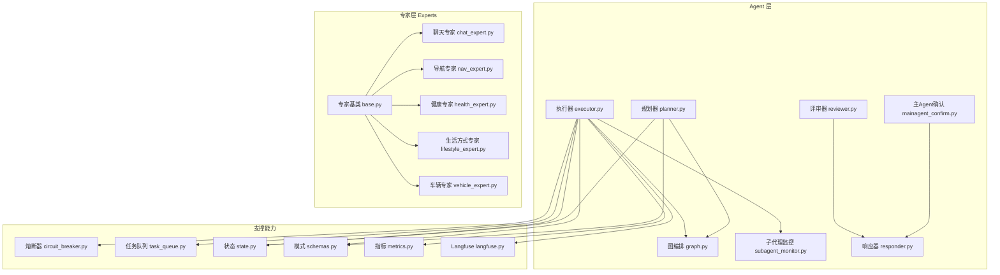
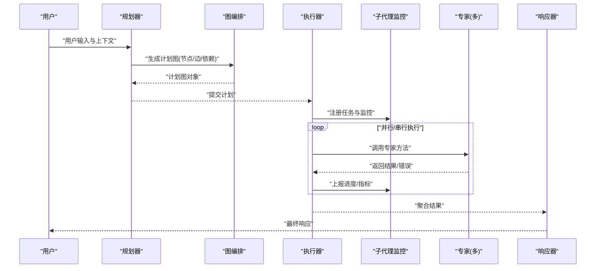
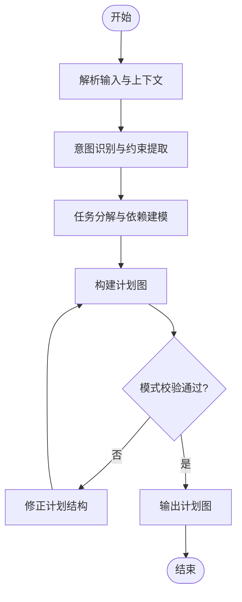
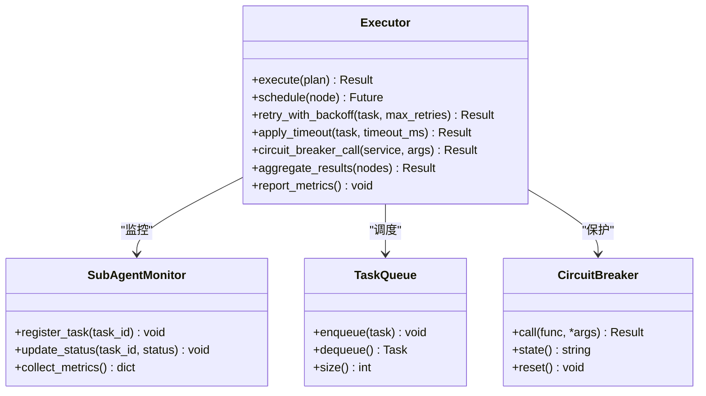
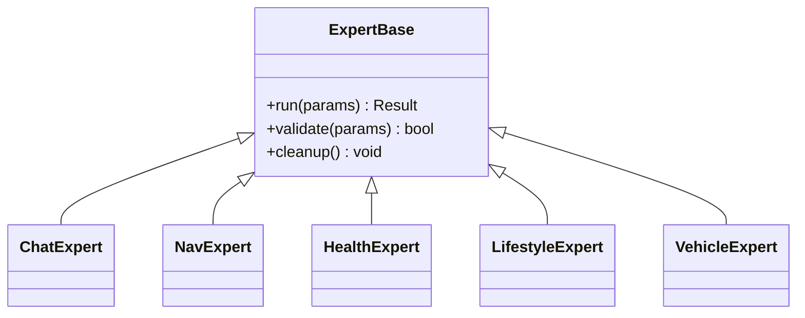
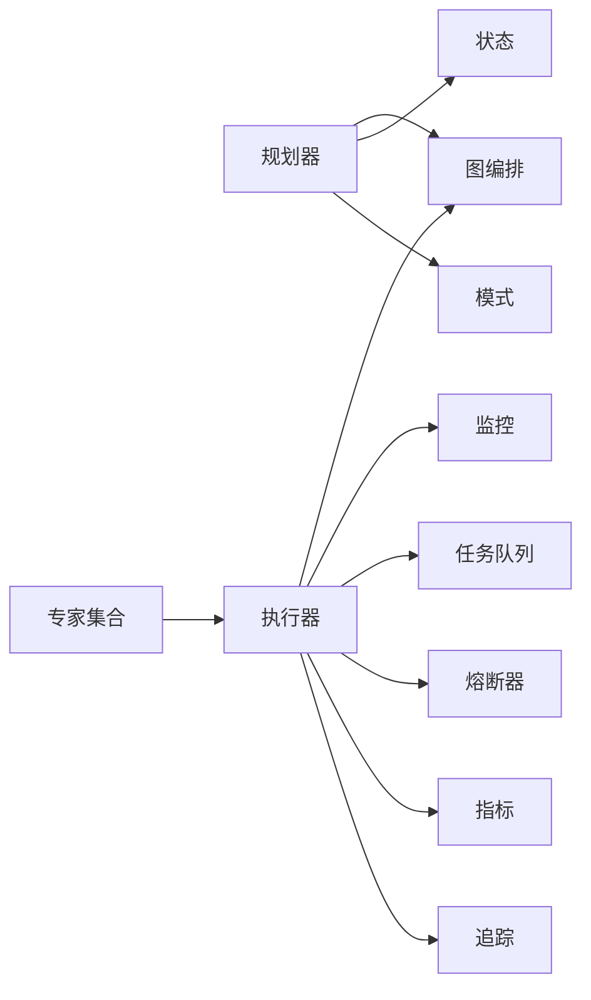

# 规划器和执行器

<cite>
**本文引用的文件**   
- [backend_design/nexus/agent/planner.py](file://backend_design/nexus/agent/planner.py)
- [backend_design/nexus/agent/executor.py](file://backend_design/nexus/agent/executor.py)
- [backend_design/nexus/agent/graph.py](file://backend_design/nexus/agent/graph.py)
- [backend_design/nexus/agent/subagent_monitor.py](file://backend_design/nexus/agent/subagent_monitor.py)
- [backend_design/nexus/agent/mainagent_confirm.py](file://backend_design/nexus/agent/mainagent_confirm.py)
- [backend_design/nexus/agent/responder.py](file://backend_design/nexus/agent/responder.py)
- [backend_design/nexus/agent/reviewer.py](file://backend_design/nexus/agent/reviewer.py)
- [backend_design/nexus/agent/experts/base.py](file://backend_design/nexus/agent/experts/base.py)
- [backend_design/nexus/agent/experts/chat_expert.py](file://backend_design/nexus/agent/experts/chat_expert.py)
- [backend_design/nexus/agent/experts/nav_expert.py](file://backend_design/nexus/agent/experts/nav_expert.py)
- [backend_design/nexus/agent/experts/health_expert.py](file://backend_design/nexus/agent/experts/health_expert.py)
- [backend_design/nexus/agent/experts/lifestyle_expert.py](file://backend_design/nexus/agent/experts/lifestyle_expert.py)
- [backend_design/nexus/agent/experts/vehicle_expert.py](file://backend_design/nexus/agent/experts/vehicle_expert.py)
- [backend_design/nexus/core/circuit_breaker.py](file://backend_design/nexus/core/circuit_breaker.py)
- [backend_design/nexus/middleware/task_queue.py](file://backend_design/nexus/middleware/task_queue.py)
- [backend_design/nexus/models/state.py](file://backend_design/nexus/models/state.py)
- [backend_design/nexus/models/schemas.py](file://backend_design/nexus/models/schemas.py)
- [backend_design/nexus/observability/metrics.py](file://backend_design/nexus/observability/metrics.py)
- [backend_design/nexus/observability/langfuse.py](file://backend_design/nexus/observability/langfuse.py)
</cite>

## 目录
1. [简介](#简介)
2. [项目结构](#项目结构)
3. [核心组件](#核心组件)
4. [架构总览](#架构总览)
5. [详细组件分析](#详细组件分析)
6. [依赖关系分析](#依赖关系分析)
7. [性能考量](#性能考量)
8. [故障排查指南](#故障排查指南)
9. [结论](#结论)
10. [附录](#附录)

## 简介
本技术文档聚焦于 NexusCockpit 的“规划器”与“执行器”，系统性阐述任务规划算法、执行策略与错误处理机制。重点说明：
- 规划器如何将复杂用户意图分解为可执行的子任务，并生成结构化计划；
- 执行器如何协调专家（Expert）完成具体操作，包括异步执行、重试与超时控制；
- 监控、指标与可观测性在规划与执行链路中的落地；
- 性能调优与故障恢复策略，帮助在生产环境中稳定运行。

## 项目结构
与规划器和执行器相关的核心代码位于 backend_design/nexus/agent 及其相关模块中。整体组织遵循“按功能分层 + 按领域划分”的方式：
- agent：包含规划器、执行器、图编排、主Agent确认、响应器、评审器等；
- experts：各领域的专家实现（聊天、导航、健康、生活方式、车辆等），提供统一接口；
- core：通用能力（熔断器、日志、异常等）；
- middleware：中间件（任务队列、缓存、限流等）；
- models：数据模型与状态定义；
- observability：指标与追踪埋点。

图表来源
- [planner.py](file://backend_design/nexus/agent/planner.py)
- [executor.py](file://backend_design/nexus/agent/executor.py)
- [graph.py](file://backend_design/nexus/agent/graph.py)
- [subagent_monitor.py](file://backend_design/nexus/agent/subagent_monitor.py)
- [mainagent_confirm.py](file://backend_design/nexus/agent/mainagent_confirm.py)
- [responder.py](file://backend_design/nexus/agent/responder.py)
- [reviewer.py](file://backend_design/nexus/agent/reviewer.py)
- [base.py](file://backend_design/nexus/agent/experts/base.py)
- [chat_expert.py](file://backend_design/nexus/agent/experts/chat_expert.py)
- [nav_expert.py](file://backend_design/nexus/agent/experts/nav_expert.py)
- [health_expert.py](file://backend_design/nexus/agent/experts/health_expert.py)
- [lifestyle_expert.py](file://backend_design/nexus/agent/experts/lifestyle_expert.py)
- [vehicle_expert.py](file://backend_design/nexus/agent/experts/vehicle_expert.py)
- [circuit_breaker.py](file://backend_design/nexus/core/circuit_breaker.py)
- [task_queue.py](file://backend_design/nexus/middleware/task_queue.py)
- [state.py](file://backend_design/nexus/models/state.py)
- [schemas.py](file://backend_design/nexus/models/schemas.py)
- [metrics.py](file://backend_design/nexus/observability/metrics.py)
- [langfuse.py](file://backend_design/nexus/observability/langfuse.py)

章节来源
- [planner.py](file://backend_design/nexus/agent/planner.py)
- [executor.py](file://backend_design/nexus/agent/executor.py)
- [graph.py](file://backend_design/nexus/agent/graph.py)
- [subagent_monitor.py](file://backend_design/nexus/agent/subagent_monitor.py)
- [mainagent_confirm.py](file://backend_design/nexus/agent/mainagent_confirm.py)
- [responder.py](file://backend_design/nexus/agent/responder.py)
- [reviewer.py](file://backend_design/nexus/agent/reviewer.py)
- [base.py](file://backend_design/nexus/agent/experts/base.py)
- [chat_expert.py](file://backend_design/nexus/agent/experts/chat_expert.py)
- [nav_expert.py](file://backend_design/nexus/agent/experts/nav_expert.py)
- [health_expert.py](file://backend_design/nexus/agent/experts/health_expert.py)
- [lifestyle_expert.py](file://backend_design/nexus/agent/experts/lifestyle_expert.py)
- [vehicle_expert.py](file://backend_design/nexus/agent/experts/vehicle_expert.py)
- [circuit_breaker.py](file://backend_design/nexus/core/circuit_breaker.py)
- [task_queue.py](file://backend_design/nexus/middleware/task_queue.py)
- [state.py](file://backend_design/nexus/models/state.py)
- [schemas.py](file://backend_design/nexus/models/schemas.py)
- [metrics.py](file://backend_design/nexus/observability/metrics.py)
- [langfuse.py](file://backend_design/nexus/observability/langfuse.py)

## 核心组件
- 规划器（Planner）
  - 职责：解析用户输入，结合上下文与历史，产出结构化计划（节点、边、依赖、参数）。
  - 关键输入：用户消息、会话上下文、领域知识、约束条件。
  - 关键输出：计划图（Graph）、子任务列表、执行顺序与依赖关系。
  - 参考路径：[planner.py](file://backend_design/nexus/agent/planner.py)、[graph.py](file://backend_design/nexus/agent/graph.py)、[state.py](file://backend_design/nexus/models/state.py)、[schemas.py](file://backend_design/nexus/models/schemas.py)。

- 执行器（Executor）
  - 职责：根据计划图调度专家执行，管理并发、重试、超时、熔断与结果聚合。
  - 关键能力：异步执行、任务队列、监控上报、错误分类与恢复。
  - 参考路径：[executor.py](file://backend_design/nexus/agent/executor.py)、[subagent_monitor.py](file://backend_design/nexus/agent/subagent_monitor.py)、[task_queue.py](file://backend_design/nexus/middleware/task_queue.py)、[circuit_breaker.py](file://backend_design/nexus/core/circuit_breaker.py)。

- 专家（Experts）
  - 职责：封装具体领域能力（聊天、导航、健康、生活方式、车辆等），对外暴露统一接口。
  - 设计要点：继承基类，实现标准化方法，支持参数校验、错误返回与可观测性埋点。
  - 参考路径：[base.py](file://backend_design/nexus/agent/experts/base.py)、[chat_expert.py](file://backend_design/nexus/agent/experts/chat_expert.py)、[nav_expert.py](file://backend_design/nexus/agent/experts/nav_expert.py)、[health_expert.py](file://backend_design/nexus/agent/experts/health_expert.py)、[lifestyle_expert.py](file://backend_design/nexus/agent/experts/lifestyle_expert.py)、[vehicle_expert.py](file://backend_design/nexus/agent/experts/vehicle_expert.py)。

- 辅助组件
  - 主Agent确认（MainAgentConfirm）：对高风险或需要用户确认的操作进行二次确认。
  - 评审器（Reviewer）：对计划或结果进行质量检查与修正建议。
  - 响应器（Responder）：将最终结果组装为用户可读的响应。
  - 参考路径：[mainagent_confirm.py](file://backend_design/nexus/agent/mainagent_confirm.py)、[reviewer.py](file://backend_design/nexus/agent/reviewer.py)、[responder.py](file://backend_design/nexus/agent/responder.py)。

章节来源
- [planner.py](file://backend_design/nexus/agent/planner.py)
- [executor.py](file://backend_design/nexus/agent/executor.py)
- [graph.py](file://backend_design/nexus/agent/graph.py)
- [subagent_monitor.py](file://backend_design/nexus/agent/subagent_monitor.py)
- [mainagent_confirm.py](file://backend_design/nexus/agent/mainagent_confirm.py)
- [reviewer.py](file://backend_design/nexus/agent/reviewer.py)
- [responder.py](file://backend_design/nexus/agent/responder.py)
- [base.py](file://backend_design/nexus/agent/experts/base.py)
- [chat_expert.py](file://backend_design/nexus/agent/experts/chat_expert.py)
- [nav_expert.py](file://backend_design/nexus/agent/experts/nav_expert.py)
- [health_expert.py](file://backend_design/nexus/agent/experts/health_expert.py)
- [lifestyle_expert.py](file://backend_design/nexus/agent/experts/lifestyle_expert.py)
- [vehicle_expert.py](file://backend_design/nexus/agent/experts/vehicle_expert.py)

## 架构总览
下图展示了从用户请求到最终响应的端到端流程，涵盖规划、执行、监控与反馈闭环。

图表来源
- [planner.py](file://backend_design/nexus/agent/planner.py)
- [graph.py](file://backend_design/nexus/agent/graph.py)
- [executor.py](file://backend_design/nexus/agent/executor.py)
- [subagent_monitor.py](file://backend_design/nexus/agent/subagent_monitor.py)
- [responder.py](file://backend_design/nexus/agent/responder.py)
- [base.py](file://backend_design/nexus/agent/experts/base.py)

## 详细组件分析

### 规划器（Planner）分析
- 规划算法要点
  - 意图识别与上下文融合：结合会话历史、领域知识与当前状态，确定目标与约束。
  - 任务分解：将复杂目标拆分为原子子任务，建立依赖关系与执行顺序。
  - 计划图构建：以节点表示子任务，边表示依赖，附带参数与元数据。
  - 可验证性：通过模式校验（Schemas）确保计划结构正确。
- 关键数据结构
  - 计划图（Graph）：节点、边、权重、属性。
  - 状态（State）：会话状态、上下文快照、计划版本。
  - 模式（Schemas）：计划与结果的类型约束。
- 优化机会
  - 增量更新：基于历史计划进行局部调整，减少重复计算。
  - 缓存命中：对常见意图复用已有计划片段。
  - 并行化：识别无依赖的子任务，提升吞吐。

图表来源
- [planner.py](file://backend_design/nexus/agent/planner.py)
- [graph.py](file://backend_design/nexus/agent/graph.py)
- [state.py](file://backend_design/nexus/models/state.py)
- [schemas.py](file://backend_design/nexus/models/schemas.py)

章节来源
- [planner.py](file://backend_design/nexus/agent/planner.py)
- [graph.py](file://backend_design/nexus/agent/graph.py)
- [state.py](file://backend_design/nexus/models/state.py)
- [schemas.py](file://backend_design/nexus/models/schemas.py)

### 执行器（Executor）分析
- 执行策略
  - 拓扑排序：依据依赖关系决定执行顺序。
  - 并发控制：无依赖节点并行执行，限制最大并发度。
  - 重试与退避：对瞬时失败进行指数退避重试。
  - 超时控制：为每个节点设置超时阈值，避免长尾阻塞。
  - 熔断保护：对不稳定外部依赖启用熔断，快速失败与降级。
- 监控与可观测性
  - 指标上报：成功率、延迟、重试次数、熔断状态。
  - 追踪埋点：跨节点追踪ID，便于问题定位。
- 错误处理
  - 分类处理：区分业务错误、系统错误、超时、熔断。
  - 回滚与补偿：对副作用操作进行补偿或回滚。
  - 降级策略：当部分节点失败时，尝试替代方案或返回部分结果。

图表来源
- [executor.py](file://backend_design/nexus/agent/executor.py)
- [subagent_monitor.py](file://backend_design/nexus/agent/subagent_monitor.py)
- [task_queue.py](file://backend_design/nexus/middleware/task_queue.py)
- [circuit_breaker.py](file://backend_design/nexus/core/circuit_breaker.py)

章节来源
- [executor.py](file://backend_design/nexus/agent/executor.py)
- [subagent_monitor.py](file://backend_design/nexus/agent/subagent_monitor.py)
- [task_queue.py](file://backend_design/nexus/middleware/task_queue.py)
- [circuit_breaker.py](file://backend_design/nexus/core/circuit_breaker.py)

### 专家（Experts）分析
- 统一接口
  - 所有专家继承基类，实现标准方法（如 run、validate、cleanup）。
  - 输入输出遵循模式定义，保证一致性。
- 领域专家示例
  - 聊天专家：对话管理与上下文维护。
  - 导航专家：路线规划与实时路况。
  - 健康专家：健康数据采集与分析。
  - 生活方式专家：习惯推荐与提醒。
  - 车辆专家：车辆状态与控制指令。
- 错误与可观测性
  - 规范化错误码与消息。
  - 埋点记录耗时与资源使用。

图表来源
- [base.py](file://backend_design/nexus/agent/experts/base.py)
- [chat_expert.py](file://backend_design/nexus/agent/experts/chat_expert.py)
- [nav_expert.py](file://backend_design/nexus/agent/experts/nav_expert.py)
- [health_expert.py](file://backend_design/nexus/agent/experts/health_expert.py)
- [lifestyle_expert.py](file://backend_design/nexus/agent/experts/lifestyle_expert.py)
- [vehicle_expert.py](file://backend_design/nexus/agent/experts/vehicle_expert.py)

章节来源
- [base.py](file://backend_design/nexus/agent/experts/base.py)
- [chat_expert.py](file://backend_design/nexus/agent/experts/chat_expert.py)
- [nav_expert.py](file://backend_design/nexus/agent/experts/nav_expert.py)
- [health_expert.py](file://backend_design/nexus/agent/experts/health_expert.py)
- [lifestyle_expert.py](file://backend_design/nexus/agent/experts/lifestyle_expert.py)
- [vehicle_expert.py](file://backend_design/nexus/agent/experts/vehicle_expert.py)

### 辅助组件分析
- 主Agent确认（MainAgentConfirm）
  - 用于高风险操作的二次确认，防止误操作。
  - 参考路径：[mainagent_confirm.py](file://backend_design/nexus/agent/mainagent_confirm.py)
- 评审器（Reviewer）
  - 对计划或结果进行质量检查，提出修正建议。
  - 参考路径：[reviewer.py](file://backend_design/nexus/agent/reviewer.py)
- 响应器（Responder）
  - 将执行结果组装为用户可读的响应，支持多种格式。
  - 参考路径：[responder.py](file://backend_design/nexus/agent/responder.py)

章节来源
- [mainagent_confirm.py](file://backend_design/nexus/agent/mainagent_confirm.py)
- [reviewer.py](file://backend_design/nexus/agent/reviewer.py)
- [responder.py](file://backend_design/nexus/agent/responder.py)

## 依赖关系分析
- 组件耦合
  - 规划器依赖图编排与状态/模式定义，低耦合高内聚。
  - 执行器依赖任务队列、熔断器与监控，具备弹性与可观测性。
  - 专家通过基类解耦，易于扩展新领域。
- 外部依赖
  - 任务队列可能对接消息中间件（如 Redis/RabbitMQ）。
  - 熔断器依赖配置中心或本地配置。
  - 指标与追踪依赖监控系统（Prometheus/Langfuse）。

图表来源
- [planner.py](file://backend_design/nexus/agent/planner.py)
- [graph.py](file://backend_design/nexus/agent/graph.py)
- [state.py](file://backend_design/nexus/models/state.py)
- [schemas.py](file://backend_design/nexus/models/schemas.py)
- [executor.py](file://backend_design/nexus/agent/executor.py)
- [subagent_monitor.py](file://backend_design/nexus/agent/subagent_monitor.py)
- [task_queue.py](file://backend_design/nexus/middleware/task_queue.py)
- [circuit_breaker.py](file://backend_design/nexus/core/circuit_breaker.py)
- [metrics.py](file://backend_design/nexus/observability/metrics.py)
- [langfuse.py](file://backend_design/nexus/observability/langfuse.py)

章节来源
- [planner.py](file://backend_design/nexus/agent/planner.py)
- [executor.py](file://backend_design/nexus/agent/executor.py)
- [graph.py](file://backend_design/nexus/agent/graph.py)
- [subagent_monitor.py](file://backend_design/nexus/agent/subagent_monitor.py)
- [task_queue.py](file://backend_design/nexus/middleware/task_queue.py)
- [circuit_breaker.py](file://backend_design/nexus/core/circuit_breaker.py)
- [metrics.py](file://backend_design/nexus/observability/metrics.py)
- [langfuse.py](file://backend_design/nexus/observability/langfuse.py)

## 性能考量
- 规划阶段
  - 增量计划：复用历史计划片段，降低计算开销。
  - 并行化：识别独立子任务，提高吞吐。
  - 缓存：对常见意图与参数组合缓存计划。
- 执行阶段
  - 并发控制：合理设置最大并发度，避免资源争用。
  - 重试与退避：指数退避减少雪崩风险。
  - 超时与熔断：快速失败，保护系统稳定性。
  - 批处理：合并小任务，减少调度开销。
- 可观测性
  - 指标：成功率、延迟分布、重试率、熔断触发次数。
  - 追踪：跨节点追踪ID，便于定位瓶颈。

## 故障排查指南
- 常见问题
  - 计划无效：检查模式校验与依赖关系是否正确。
  - 执行超时：评估专家耗时与超时阈值是否合理。
  - 频繁重试：关注外部依赖稳定性与熔断状态。
  - 资源耗尽：检查并发度与队列积压情况。
- 定位步骤
  - 查看指标与追踪：定位慢节点与失败原因。
  - 检查熔断器状态：判断是否进入半开/关闭状态。
  - 审查任务队列：确认是否有积压或死锁。
  - 复盘计划图：验证依赖与参数是否正确。
- 恢复策略
  - 降级：跳过非关键节点，返回部分结果。
  - 补偿：对已执行副作用进行补偿。
  - 扩容：临时增加实例或线程池大小。

章节来源
- [executor.py](file://backend_design/nexus/agent/executor.py)
- [subagent_monitor.py](file://backend_design/nexus/agent/subagent_monitor.py)
- [circuit_breaker.py](file://backend_design/nexus/core/circuit_breaker.py)
- [metrics.py](file://backend_design/nexus/observability/metrics.py)
- [langfuse.py](file://backend_design/nexus/observability/langfuse.py)

## 结论
NexusCockpit 的规划器与执行器通过结构化计划图与弹性执行策略，实现了复杂任务的可靠分解与高效执行。借助监控、指标与追踪，系统在稳定性与可观测性方面具备良好基础。生产环境应重点关注并发控制、重试退避、超时与熔断的配置，并结合业务特性进行持续优化。

## 附录
- 术语表
  - 计划图：由节点与边构成的有向图，描述任务依赖与执行顺序。
  - 熔断器：一种保护机制，当外部依赖不稳定时快速失败，避免级联故障。
  - 指数退避：重试间隔随失败次数呈指数增长，降低重试风暴风险。
- 最佳实践
  - 明确超时与重试策略，避免无限等待。
  - 对高风险操作引入二次确认与评审。
  - 完善指标与追踪，确保问题可定位。
  - 定期演练故障场景，验证恢复策略有效性。