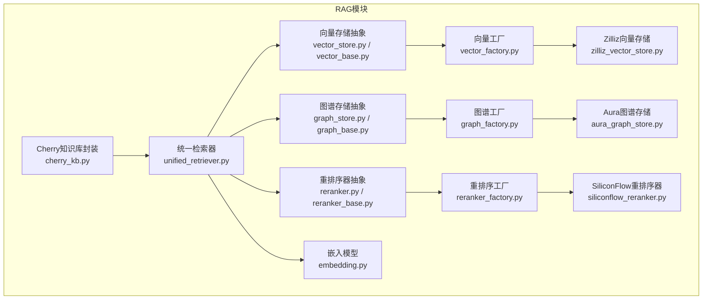
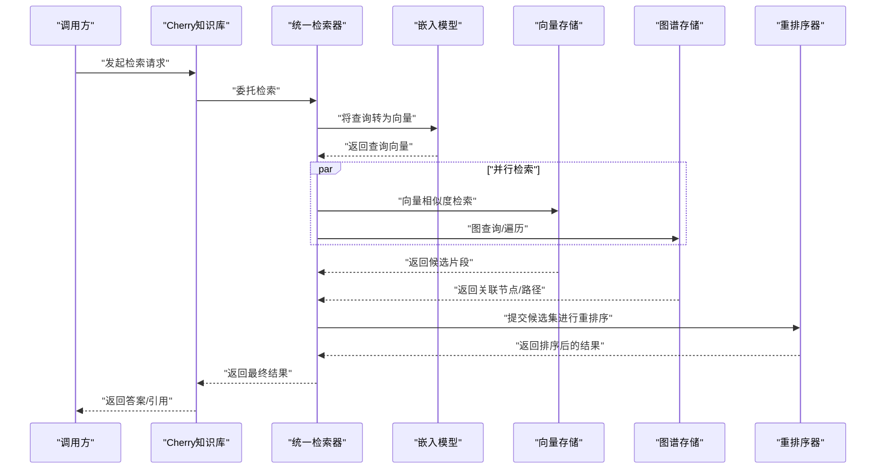
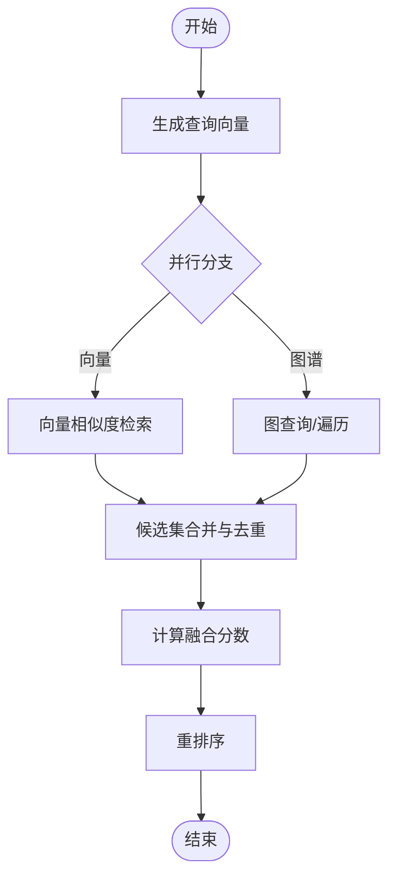
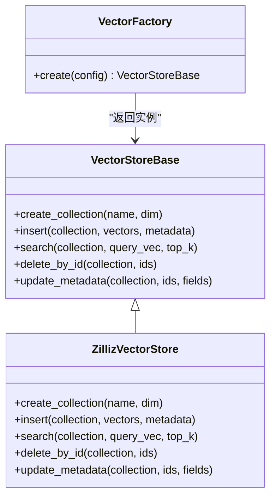
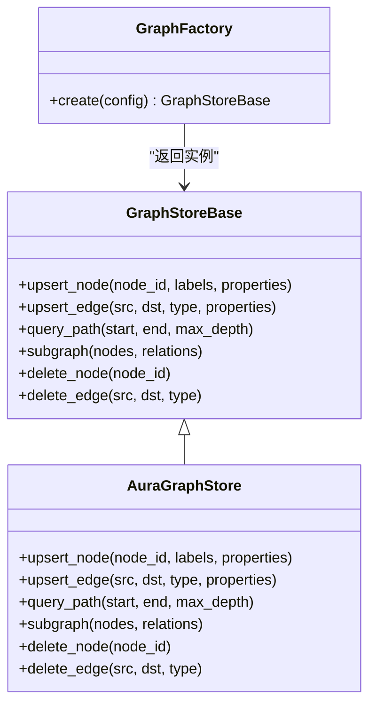
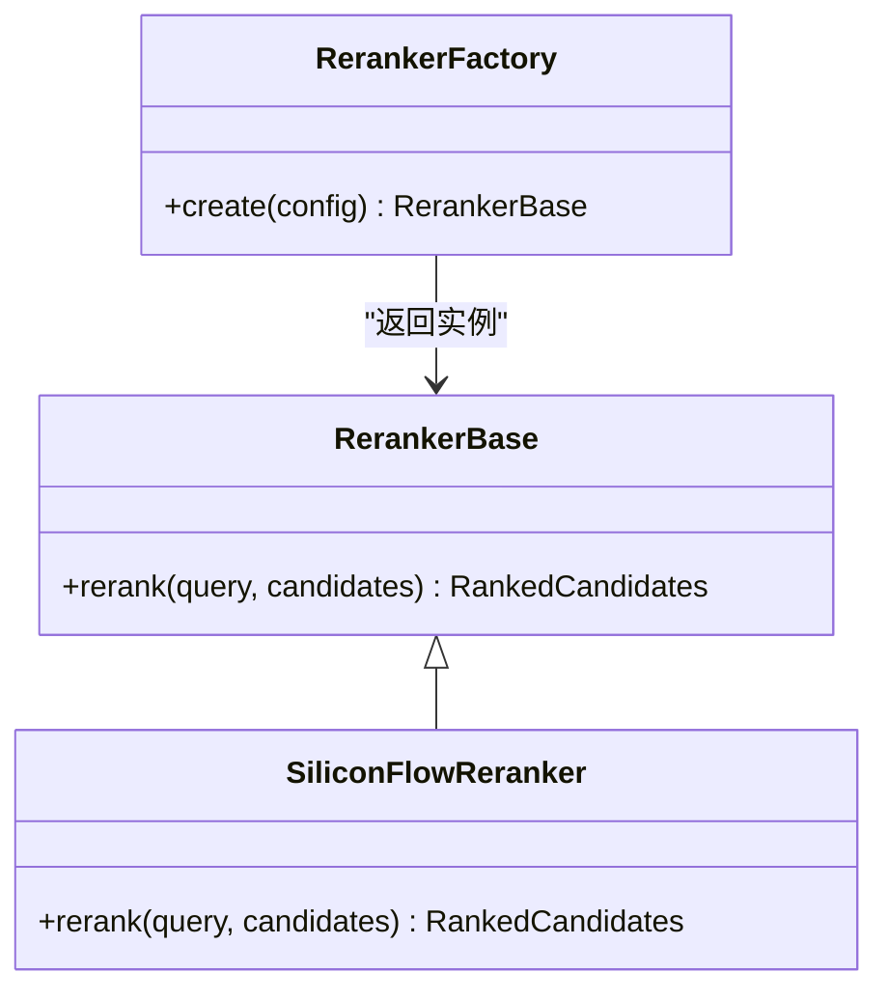
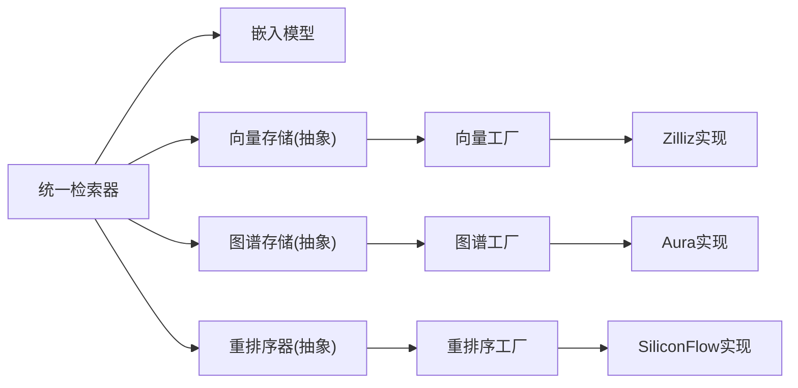

# RAG检索系统

<cite>
**本文引用的文件**   
- [backend_design/nexus/rag/unified_retriever.py](file://backend_design/nexus/rag/unified_retriever.py)
- [backend_design/nexus/rag/vector_store.py](file://backend_design/nexus/rag/vector_store.py)
- [backend_design/nexus/rag/vector_base.py](file://backend_design/nexus/rag/vector_base.py)
- [backend_design/nexus/rag/vector_factory.py](file://backend_design/nexus/rag/vector_factory.py)
- [backend_design/nexus/rag/zilliz_vector_store.py](file://backend_design/nexus/rag/zilliz_vector_store.py)
- [backend_design/nexus/rag/graph_store.py](file://backend_design/nexus/rag/graph_store.py)
- [backend_design/nexus/rag/graph_base.py](file://backend_design/nexus/rag/graph_base.py)
- [backend_design/nexus/rag/graph_factory.py](file://backend_design/nexus/rag/graph_factory.py)
- [backend_design/nexus/rag/aura_graph_store.py](file://backend_design/nexus/rag/aura_graph_store.py)
- [backend_design/nexus/rag/reranker.py](file://backend_design/nexus/rag/reranker.py)
- [backend_design/nexus/rag/reranker_base.py](file://backend_design/nexus/rag/reranker_base.py)
- [backend_design/nexus/rag/reranker_factory.py](file://backend_design/nexus/rag/reranker_factory.py)
- [backend_design/nexus/rag/siliconflow_reranker.py](file://backend_design/nexus/rag/siliconflow_reranker.py)
- [backend_design/nexus/rag/embedding.py](file://backend_design/nexus/rag/embedding.py)
- [backend_design/nexus/rag/cherry_kb.py](file://backend_design/nexus/rag/cherry_kb.py)
- [scripts/init_milvus.py](file://scripts/init_milvus.py)
- [scripts/init_neo4j.py](file://scripts/init_neo4j.py)
</cite>

## 目录
1. [简介](#简介)
2. [项目结构](#项目结构)
3. [核心组件](#核心组件)
4. [架构总览](#架构总览)
5. [详细组件分析](#详细组件分析)
6. [依赖关系分析](#依赖关系分析)
7. [性能考虑](#性能考虑)
8. [故障排查指南](#故障排查指南)
9. [结论](#结论)
10. [附录](#附录)

## 简介
本技术文档面向NexusCockpit的RAG（检索增强生成）检索子系统，聚焦统一检索器、向量数据库、图数据库与重排序器的实现原理与集成方式。文档涵盖：
- 嵌入模型集成与向量化流程
- 检索策略与结果融合算法
- 后端存储配置示例（Milvus、Neo4j等）
- 知识图谱构建流程与向量索引管理
- 数据导入导出工具与检索效果评估方法

## 项目结构
RAG相关代码位于 backend_design/nexus/rag 目录下，采用“接口抽象 + 工厂模式 + 多后端实现”的分层设计：
- 统一检索器：协调向量检索与图谱检索，并执行结果融合与重排序
- 向量存储抽象与工厂：支持多种向量数据库（如Zilliz/Milvus）
- 图谱存储抽象与工厂：支持多种图数据库（如Aura/Neo4j）
- 重排序器抽象与工厂：支持本地或远程重排序服务
- 嵌入模型：提供统一的文本到向量转换能力
- Cherry KB：高层知识库封装，串联上述组件完成端到端检索

图表来源
- [backend_design/nexus/rag/unified_retriever.py](file://backend_design/nexus/rag/unified_retriever.py)
- [backend_design/nexus/rag/vector_store.py](file://backend_design/nexus/rag/vector_store.py)
- [backend_design/nexus/rag/vector_base.py](file://backend_design/nexus/rag/vector_base.py)
- [backend_design/nexus/rag/vector_factory.py](file://backend_design/nexus/rag/vector_factory.py)
- [backend_design/nexus/rag/zilliz_vector_store.py](file://backend_design/nexus/rag/zilliz_vector_store.py)
- [backend_design/nexus/rag/graph_store.py](file://backend_design/nexus/rag/graph_store.py)
- [backend_design/nexus/rag/graph_base.py](file://backend_design/nexus/rag/graph_base.py)
- [backend_design/nexus/rag/graph_factory.py](file://backend_design/nexus/rag/graph_factory.py)
- [backend_design/nexus/rag/aura_graph_store.py](file://backend_design/nexus/rag/aura_graph_store.py)
- [backend_design/nexus/rag/reranker.py](file://backend_design/nexus/rag/reranker.py)
- [backend_design/nexus/rag/reranker_base.py](file://backend_design/nexus/rag/reranker_base.py)
- [backend_design/nexus/rag/reranker_factory.py](file://backend_design/nexus/rag/reranker_factory.py)
- [backend_design/nexus/rag/siliconflow_reranker.py](file://backend_design/nexus/rag/siliconflow_reranker.py)
- [backend_design/nexus/rag/embedding.py](file://backend_design/nexus/rag/embedding.py)
- [backend_design/nexus/rag/cherry_kb.py](file://backend_design/nexus/rag/cherry_kb.py)

章节来源
- [backend_design/nexus/rag/unified_retriever.py](file://backend_design/nexus/rag/unified_retriever.py)
- [backend_design/nexus/rag/vector_store.py](file://backend_design/nexus/rag/vector_store.py)
- [backend_design/nexus/rag/vector_base.py](file://backend_design/nexus/rag/vector_base.py)
- [backend_design/nexus/rag/vector_factory.py](file://backend_design/nexus/rag/vector_factory.py)
- [backend_design/nexus/rag/zilliz_vector_store.py](file://backend_design/nexus/rag/zilliz_vector_store.py)
- [backend_design/nexus/rag/graph_store.py](file://backend_design/nexus/rag/graph_store.py)
- [backend_design/nexus/rag/graph_base.py](file://backend_design/nexus/rag/graph_base.py)
- [backend_design/nexus/rag/graph_factory.py](file://backend_design/nexus/rag/graph_factory.py)
- [backend_design/nexus/rag/aura_graph_store.py](file://backend_design/nexus/rag/aura_graph_store.py)
- [backend_design/nexus/rag/reranker.py](file://backend_design/nexus/rag/reranker.py)
- [backend_design/nexus/rag/reranker_base.py](file://backend_design/nexus/rag/reranker_base.py)
- [backend_design/nexus/rag/reranker_factory.py](file://backend_design/nexus/rag/reranker_factory.py)
- [backend_design/nexus/rag/siliconflow_reranker.py](file://backend_design/nexus/rag/siliconflow_reranker.py)
- [backend_design/nexus/rag/embedding.py](file://backend_design/nexus/rag/embedding.py)
- [backend_design/nexus/rag/cherry_kb.py](file://backend_design/nexus/rag/cherry_kb.py)

## 核心组件
- 统一检索器：负责将用户查询转换为向量，并行调用向量检索与图谱检索，合并候选集，应用重排序，返回最终结果。
- 向量存储抽象与工厂：定义统一的向量CRUD与相似度检索接口；通过工厂按配置创建具体后端（如Zilliz）。
- 图谱存储抽象与工厂：定义统一的图遍历与查询接口；通过工厂创建具体后端（如Aura/Neo4j）。
- 重排序器抽象与工厂：定义统一的打分接口；通过工厂选择本地或远程重排序服务。
- 嵌入模型：提供文本到向量的一致化转换，屏蔽不同Embedding后端差异。
- Cherry KB：高层封装，聚合上述能力，提供知识库级别的检索入口。

章节来源
- [backend_design/nexus/rag/unified_retriever.py](file://backend_design/nexus/rag/unified_retriever.py)
- [backend_design/nexus/rag/vector_store.py](file://backend_design/nexus/rag/vector_store.py)
- [backend_design/nexus/rag/vector_base.py](file://backend_design/nexus/rag/vector_base.py)
- [backend_design/nexus/rag/vector_factory.py](file://backend_design/nexus/rag/vector_factory.py)
- [backend_design/nexus/rag/zilliz_vector_store.py](file://backend_design/nexus/rag/zilliz_vector_store.py)
- [backend_design/nexus/rag/graph_store.py](file://backend_design/nexus/rag/graph_store.py)
- [backend_design/nexus/rag/graph_base.py](file://backend_design/nexus/rag/graph_base.py)
- [backend_design/nexus/rag/graph_factory.py](file://backend_design/nexus/rag/graph_factory.py)
- [backend_design/nexus/rag/aura_graph_store.py](file://backend_design/nexus/rag/aura_graph_store.py)
- [backend_design/nexus/rag/reranker.py](file://backend_design/nexus/rag/reranker.py)
- [backend_design/nexus/rag/reranker_base.py](file://backend_design/nexus/rag/reranker_base.py)
- [backend_design/nexus/rag/reranker_factory.py](file://backend_design/nexus/rag/reranker_factory.py)
- [backend_design/nexus/rag/siliconflow_reranker.py](file://backend_design/nexus/rag/siliconflow_reranker.py)
- [backend_design/nexus/rag/embedding.py](file://backend_design/nexus/rag/embedding.py)
- [backend_design/nexus/rag/cherry_kb.py](file://backend_design/nexus/rag/cherry_kb.py)

## 架构总览
下图展示从用户查询到最终结果的完整流程，包括嵌入、向量检索、图谱检索、结果融合与重排序。

图表来源
- [backend_design/nexus/rag/unified_retriever.py](file://backend_design/nexus/rag/unified_retriever.py)
- [backend_design/nexus/rag/embedding.py](file://backend_design/nexus/rag/embedding.py)
- [backend_design/nexus/rag/vector_store.py](file://backend_design/nexus/rag/vector_store.py)
- [backend_design/nexus/rag/graph_store.py](file://backend_design/nexus/rag/graph_store.py)
- [backend_design/nexus/rag/reranker.py](file://backend_design/nexus/rag/reranker.py)

## 详细组件分析

### 统一检索器
职责与流程
- 接收查询，调用嵌入模型得到查询向量
- 并行触发向量检索与图谱检索
- 对两类结果进行去重、融合与评分
- 调用重排序器输出最终排序结果

关键要点
- 并行性：向量与图谱检索可并发执行，降低整体延迟
- 融合策略：基于来源类型、相关性分数与业务权重进行加权融合
- 可扩展性：新增检索源只需实现对应接口并通过工厂注册

图表来源
- [backend_design/nexus/rag/unified_retriever.py](file://backend_design/nexus/rag/unified_retriever.py)

章节来源
- [backend_design/nexus/rag/unified_retriever.py](file://backend_design/nexus/rag/unified_retriever.py)

### 向量存储抽象与工厂
- 抽象接口：定义集合/命名空间管理、插入、删除、更新、相似度检索等通用方法
- 工厂：根据配置动态创建具体后端实例（如Zilliz）
- 典型后端：Zilliz（兼容Milvus协议），提供高性能向量检索能力

图表来源
- [backend_design/nexus/rag/vector_base.py](file://backend_design/nexus/rag/vector_base.py)
- [backend_design/nexus/rag/vector_store.py](file://backend_design/nexus/rag/vector_store.py)
- [backend_design/nexus/rag/vector_factory.py](file://backend_design/nexus/rag/vector_factory.py)
- [backend_design/nexus/rag/zilliz_vector_store.py](file://backend_design/nexus/rag/zilliz_vector_store.py)

章节来源
- [backend_design/nexus/rag/vector_base.py](file://backend_design/nexus/rag/vector_base.py)
- [backend_design/nexus/rag/vector_store.py](file://backend_design/nexus/rag/vector_store.py)
- [backend_design/nexus/rag/vector_factory.py](file://backend_design/nexus/rag/vector_factory.py)
- [backend_design/nexus/rag/zilliz_vector_store.py](file://backend_design/nexus/rag/zilliz_vector_store.py)

### 图谱存储抽象与工厂
- 抽象接口：定义节点/边操作、路径查询、子图检索等通用方法
- 工厂：根据配置创建具体后端实例（如Aura/Neo4j）
- 典型后端：Aura（托管Neo4j），提供图遍历与复杂关系推理能力

图表来源
- [backend_design/nexus/rag/graph_base.py](file://backend_design/nexus/rag/graph_base.py)
- [backend_design/nexus/rag/graph_store.py](file://backend_design/nexus/rag/graph_store.py)
- [backend_design/nexus/rag/graph_factory.py](file://backend_design/nexus/rag/graph_factory.py)
- [backend_design/nexus/rag/aura_graph_store.py](file://backend_design/nexus/rag/aura_graph_store.py)

章节来源
- [backend_design/nexus/rag/graph_base.py](file://backend_design/nexus/rag/graph_base.py)
- [backend_design/nexus/rag/graph_store.py](file://backend_design/nexus/rag/graph_store.py)
- [backend_design/nexus/rag/graph_factory.py](file://backend_design/nexus/rag/graph_factory.py)
- [backend_design/nexus/rag/aura_graph_store.py](file://backend_design/nexus/rag/aura_graph_store.py)

### 重排序器抽象与工厂
- 抽象接口：定义对候选集进行打分与排序的统一方法
- 工厂：根据配置选择本地或远程重排序服务
- 典型后端：SiliconFlow重排序器，提供在线高质量重排序能力

图表来源
- [backend_design/nexus/rag/reranker_base.py](file://backend_design/nexus/rag/reranker_base.py)
- [backend_design/nexus/rag/reranker.py](file://backend_design/nexus/rag/reranker.py)
- [backend_design/nexus/rag/reranker_factory.py](file://backend_design/nexus/rag/reranker_factory.py)
- [backend_design/nexus/rag/siliconflow_reranker.py](file://backend_design/nexus/rag/siliconflow_reranker.py)

章节来源
- [backend_design/nexus/rag/reranker_base.py](file://backend_design/nexus/rag/reranker_base.py)
- [backend_design/nexus/rag/reranker.py](file://backend_design/nexus/rag/reranker.py)
- [backend_design/nexus/rag/reranker_factory.py](file://backend_design/nexus/rag/reranker_factory.py)
- [backend_design/nexus/rag/siliconflow_reranker.py](file://backend_design/nexus/rag/siliconflow_reranker.py)

### 嵌入模型
- 职责：将自然语言文本转换为固定维度的向量，供向量检索使用
- 特点：屏蔽底层Embedding服务差异，提供一致的接口与错误处理
- 使用场景：查询向量化、文档入库前向量化

章节来源
- [backend_design/nexus/rag/embedding.py](file://backend_design/nexus/rag/embedding.py)

### Cherry知识库封装
- 职责：对外暴露知识库级别API，内部组合嵌入、向量、图谱与重排序能力
- 价值：简化上层调用，隐藏RAG管线细节，便于扩展新的检索源与策略

章节来源
- [backend_design/nexus/rag/cherry_kb.py](file://backend_design/nexus/rag/cherry_kb.py)

## 依赖关系分析
- 统一检索器依赖嵌入模型、向量存储、图谱存储与重排序器
- 向量与图谱均通过工厂按需创建，降低耦合度
- 重排序器可选择本地或远程实现，便于A/B测试与灰度发布

图表来源
- [backend_design/nexus/rag/unified_retriever.py](file://backend_design/nexus/rag/unified_retriever.py)
- [backend_design/nexus/rag/vector_factory.py](file://backend_design/nexus/rag/vector_factory.py)
- [backend_design/nexus/rag/graph_factory.py](file://backend_design/nexus/rag/graph_factory.py)
- [backend_design/nexus/rag/reranker_factory.py](file://backend_design/nexus/rag/reranker_factory.py)
- [backend_design/nexus/rag/zilliz_vector_store.py](file://backend_design/nexus/rag/zilliz_vector_store.py)
- [backend_design/nexus/rag/aura_graph_store.py](file://backend_design/nexus/rag/aura_graph_store.py)
- [backend_design/nexus/rag/siliconflow_reranker.py](file://backend_design/nexus/rag/siliconflow_reranker.py)

章节来源
- [backend_design/nexus/rag/unified_retriever.py](file://backend_design/nexus/rag/unified_retriever.py)
- [backend_design/nexus/rag/vector_factory.py](file://backend_design/nexus/rag/vector_factory.py)
- [backend_design/nexus/rag/graph_factory.py](file://backend_design/nexus/rag/graph_factory.py)
- [backend_design/nexus/rag/reranker_factory.py](file://backend_design/nexus/rag/reranker_factory.py)

## 性能考虑
- 并行检索：向量与图谱检索并发执行，减少端到端延迟
- 批量写入：文档入库时尽量批量插入向量与图节点/边，降低网络往返
- 索引优化：合理设置向量维度、索引类型与top_k，平衡召回与速度
- 缓存策略：对高频查询结果进行短期缓存，降低重复计算
- 重排序批处理：对候选集分批重排序，避免单次请求过大导致超时
- 资源隔离：为不同后端（向量/图谱/重排序）配置连接池与超时参数，防止雪崩

[本节为通用性能建议，不直接分析具体文件]

## 故障排查指南
常见问题与定位思路
- 向量检索失败：检查向量库连接、集合是否存在、维度是否匹配
- 图谱查询异常：确认节点/边存在性、路径深度限制、权限与认证
- 重排序超时：检查远程服务可用性、候选集大小与重试策略
- 嵌入模型异常：验证模型加载、输入文本长度与编码格式

建议日志与指标
- 记录各阶段耗时（嵌入、向量检索、图谱检索、重排序）
- 统计召回率、命中率与平均响应时间
- 监控后端健康状态与错误码分布

章节来源
- [backend_design/nexus/rag/unified_retriever.py](file://backend_design/nexus/rag/unified_retriever.py)
- [backend_design/nexus/rag/vector_store.py](file://backend_design/nexus/rag/vector_store.py)
- [backend_design/nexus/rag/graph_store.py](file://backend_design/nexus/rag/graph_store.py)
- [backend_design/nexus/rag/reranker.py](file://backend_design/nexus/rag/reranker.py)

## 结论
本RAG检索系统通过统一检索器整合向量与图谱双路检索，结合重排序器提升结果质量。借助工厂模式与抽象接口，系统具备良好的可扩展性与可维护性。配合合理的索引管理与性能调优，可在大规模知识场景下稳定高效地提供服务。

[本节为总结性内容，不直接分析具体文件]

## 附录

### 后端存储配置示例
- Milvus/Zilliz（向量）
  - 通过向量工厂按配置创建Zilliz后端
  - 初始化脚本用于创建集合与索引
  - 参考文件：
    - [backend_design/nexus/rag/vector_factory.py](file://backend_design/nexus/rag/vector_factory.py)
    - [backend_design/nexus/rag/zilliz_vector_store.py](file://backend_design/nexus/rag/zilliz_vector_store.py)
    - [scripts/init_milvus.py](file://scripts/init_milvus.py)

- Neo4j/Aura（图谱）
  - 通过图谱工厂按配置创建Aura后端
  - 初始化脚本用于创建约束与索引
  - 参考文件：
    - [backend_design/nexus/rag/graph_factory.py](file://backend_design/nexus/rag/graph_factory.py)
    - [backend_design/nexus/rag/aura_graph_store.py](file://backend_design/nexus/rag/aura_graph_store.py)
    - [scripts/init_neo4j.py](file://scripts/init_neo4j.py)

章节来源
- [backend_design/nexus/rag/vector_factory.py](file://backend_design/nexus/rag/vector_factory.py)
- [backend_design/nexus/rag/zilliz_vector_store.py](file://backend_design/nexus/rag/zilliz_vector_store.py)
- [scripts/init_milvus.py](file://scripts/init_milvus.py)
- [backend_design/nexus/rag/graph_factory.py](file://backend_design/nexus/rag/graph_factory.py)
- [backend_design/nexus/rag/aura_graph_store.py](file://backend_design/nexus/rag/aura_graph_store.py)
- [scripts/init_neo4j.py](file://scripts/init_neo4j.py)

### 知识图谱构建流程
- 实体抽取：从文本中识别关键实体与属性
- 关系抽取：识别实体间关系与权重
- 图写入：批量上载节点与边至图数据库
- 索引与约束：建立唯一性约束与查询索引以提升检索效率

章节来源
- [backend_design/nexus/rag/graph_store.py](file://backend_design/nexus/rag/graph_store.py)
- [backend_design/nexus/rag/aura_graph_store.py](file://backend_design/nexus/rag/aura_graph_store.py)
- [scripts/init_neo4j.py](file://scripts/init_neo4j.py)

### 向量索引管理
- 集合创建：指定维度与度量方式（如余弦相似度）
- 索引类型：根据数据规模与查询延迟要求选择合适的索引
- 增量更新：支持按ID更新元数据或删除旧版本
- 容量规划：预留扩容空间，避免频繁重建索引

章节来源
- [backend_design/nexus/rag/vector_store.py](file://backend_design/nexus/rag/vector_store.py)
- [backend_design/nexus/rag/zilliz_vector_store.py](file://backend_design/nexus/rag/zilliz_vector_store.py)
- [scripts/init_milvus.py](file://scripts/init_milvus.py)

### 数据导入导出工具
- 导入：批量读取文档，分块后向量化并写入向量库；同时抽取实体关系写入图数据库
- 导出：按条件筛选结果，导出为结构化数据以便离线分析
- 幂等性：导入过程支持去重与断点续传

章节来源
- [backend_design/nexus/rag/vector_store.py](file://backend_design/nexus/rag/vector_store.py)
- [backend_design/nexus/rag/graph_store.py](file://backend_design/nexus/rag/graph_store.py)

### 检索效果评估方法
- 离线评估：构造评测集，计算准确率、召回率、F1与MRR等指标
- 在线评估：通过A/B测试对比不同策略的效果
- 回归监控：持续跟踪关键指标变化，发现退化及时回滚

章节来源
- [backend_design/nexus/rag/unified_retriever.py](file://backend_design/nexus/rag/unified_retriever.py)
- [backend_design/nexus/rag/reranker.py](file://backend_design/nexus/rag/reranker.py)