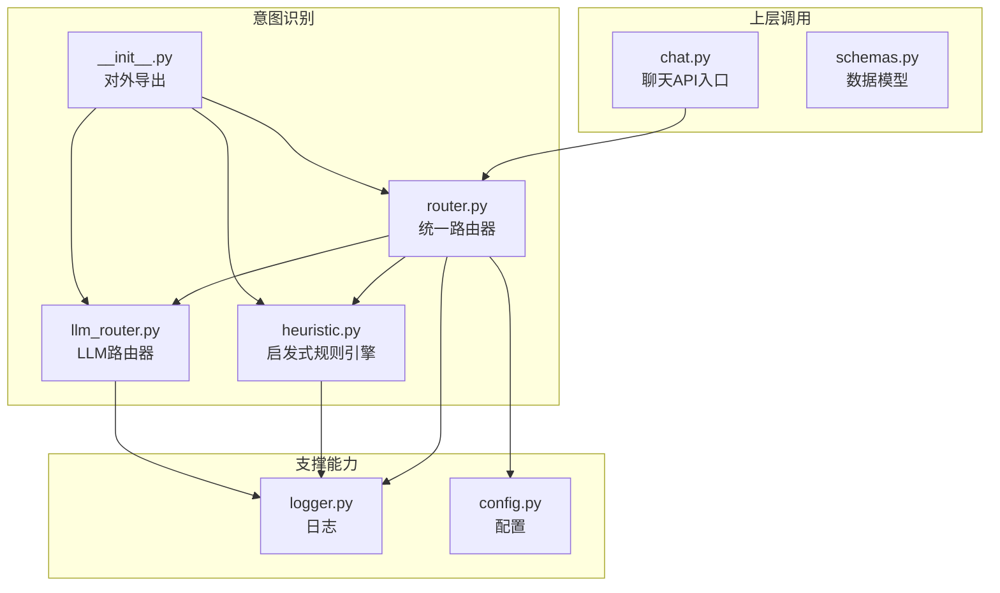
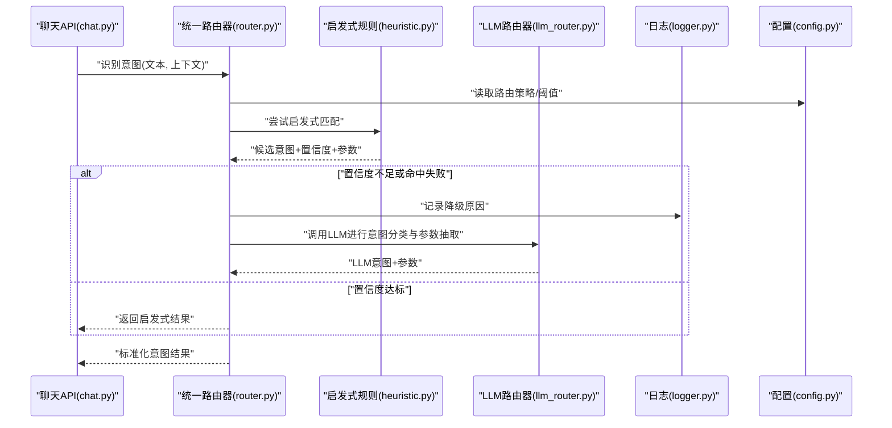
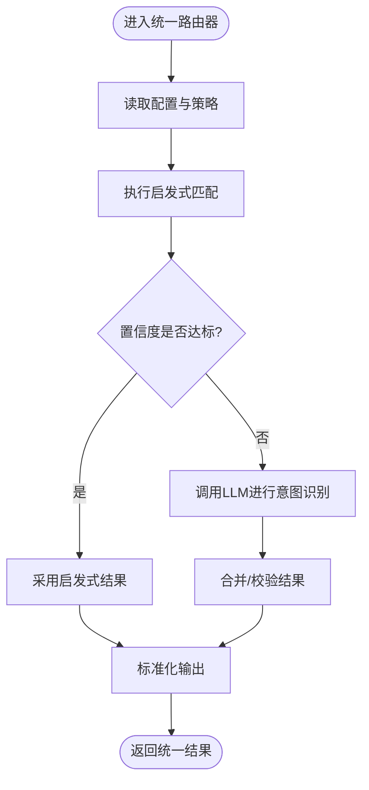
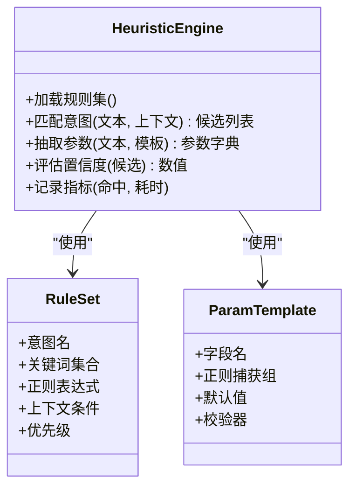
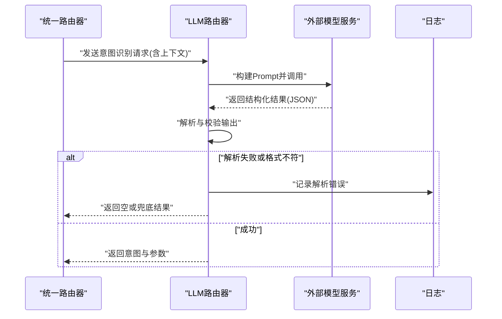
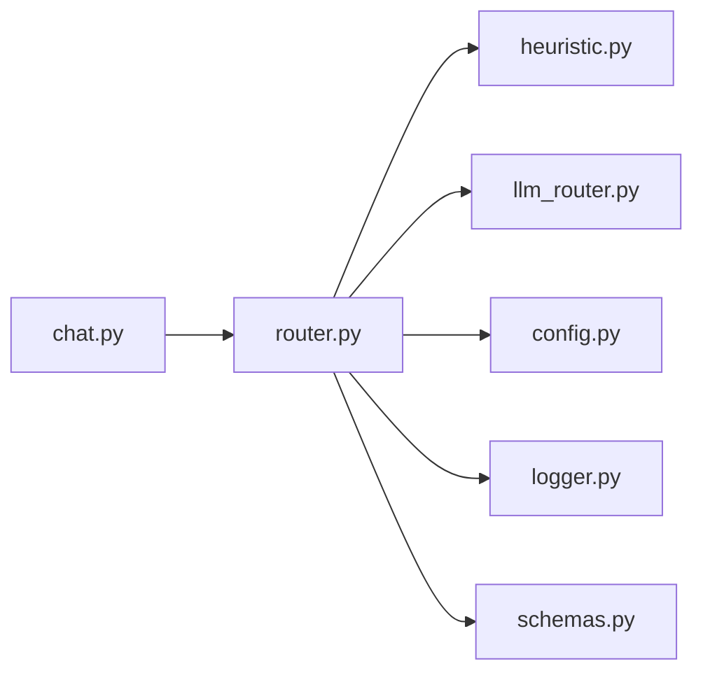

# 意图识别系统

<cite>
**本文引用的文件**   
- [backend_design/nexus/intent/heuristic.py](file://backend_design/nexus/intent/heuristic.py)
- [backend_design/nexus/intent/llm_router.py](file://backend_design/nexus/intent/llm_router.py)
- [backend_design/nexus/intent/router.py](file://backend_design/nexus/intent/router.py)
- [backend_design/nexus/intent/__init__.py](file://backend_design/nexus/intent/__init__.py)
- [backend_design/nexus/api/routes/chat.py](file://backend_design/nexus/api/routes/chat.py)
- [backend_design/nexus/models/schemas.py](file://backend_design/nexus/models/schemas.py)
- [backend_design/nexus/core/logger.py](file://backend_design/nexus/core/logger.py)
- [backend_design/nexus/config.py](file://backend_design/nexus/config.py)
</cite>

## 目录
1. [简介](#简介)
2. [项目结构](#项目结构)
3. [核心组件](#核心组件)
4. [架构总览](#架构总览)
5. [详细组件分析](#详细组件分析)
6. [依赖关系分析](#依赖关系分析)
7. [性能考虑](#性能考虑)
8. [故障排查指南](#故障排查指南)
9. [结论](#结论)
10. [附录](#附录)

## 简介
本技术文档聚焦于NexusCockpit的意图识别子系统，系统性阐述启发式规则引擎、LLM路由器与统一路由器的实现原理与协作方式。文档覆盖意图分类算法、参数提取机制、路由决策逻辑，并提供扩展新意图类型与处理复杂对话场景的实践指引。同时说明与Agent系统的集成方式、性能优化策略以及调试工具与常见问题解决方案。

## 项目结构
意图识别相关代码位于 backend_design/nexus/intent 目录下，包含三类核心模块：
- 启发式规则引擎：基于关键词、正则与上下文规则的快速意图判定与参数抽取
- LLM路由器：调用大语言模型进行语义级意图分类与结构化参数抽取
- 统一路由器：协调上述两种路径，提供统一的意图识别接口与降级策略

图示来源
- [backend_design/nexus/intent/router.py](file://backend_design/nexus/intent/router.py)
- [backend_design/nexus/intent/heuristic.py](file://backend_design/nexus/intent/heuristic.py)
- [backend_design/nexus/intent/llm_router.py](file://backend_design/nexus/intent/llm_router.py)
- [backend_design/nexus/intent/__init__.py](file://backend_design/nexus/intent/__init__.py)
- [backend_design/nexus/api/routes/chat.py](file://backend_design/nexus/api/routes/chat.py)
- [backend_design/nexus/models/schemas.py](file://backend_design/nexus/models/schemas.py)
- [backend_design/nexus/core/logger.py](file://backend_design/nexus/core/logger.py)
- [backend_design/nexus/config.py](file://backend_design/nexus/config.py)

章节来源
- [backend_design/nexus/intent/router.py](file://backend_design/nexus/intent/router.py)
- [backend_design/nexus/intent/heuristic.py](file://backend_design/nexus/intent/heuristic.py)
- [backend_design/nexus/intent/llm_router.py](file://backend_design/nexus/intent/llm_router.py)
- [backend_design/nexus/intent/__init__.py](file://backend_design/nexus/intent/__init__.py)
- [backend_design/nexus/api/routes/chat.py](file://backend_design/nexus/api/routes/chat.py)
- [backend_design/nexus/models/schemas.py](file://backend_design/nexus/models/schemas.py)
- [backend_design/nexus/core/logger.py](file://backend_design/nexus/core/logger.py)
- [backend_design/nexus/config.py](file://backend_design/nexus/config.py)

## 核心组件
- 启发式规则引擎
  - 职责：通过预定义关键词、正则表达式与上下文规则进行快速意图判定与参数抽取；适用于高频、确定性强的意图（如导航、车辆控制等）。
  - 特点：低延迟、可解释性强、易于本地化部署与热更新。
- LLM路由器
  - 职责：调用大语言模型进行语义理解、意图分类与结构化参数抽取；适用于长尾、模糊或复杂表达。
  - 特点：泛化能力强、支持多轮上下文与动态Prompt；需要外部服务与网络开销。
- 统一路由器
  - 职责：封装统一接口，按策略选择启发式或LLM路径，并负责降级、超时与结果合并。
  - 特点：对上层透明，提供一致的数据结构与错误语义。

章节来源
- [backend_design/nexus/intent/heuristic.py](file://backend_design/nexus/intent/heuristic.py)
- [backend_design/nexus/intent/llm_router.py](file://backend_design/nexus/intent/llm_router.py)
- [backend_design/nexus/intent/router.py](file://backend_design/nexus/intent/router.py)

## 架构总览
统一路由器作为意图识别的入口，根据输入文本与上下文决定采用启发式规则还是LLM进行意图识别与参数抽取。其典型流程如下：

图示来源
- [backend_design/nexus/api/routes/chat.py](file://backend_design/nexus/api/routes/chat.py)
- [backend_design/nexus/intent/router.py](file://backend_design/nexus/intent/router.py)
- [backend_design/nexus/intent/heuristic.py](file://backend_design/nexus/intent/heuristic.py)
- [backend_design/nexus/intent/llm_router.py](file://backend_design/nexus/intent/llm_router.py)
- [backend_design/nexus/core/logger.py](file://backend_design/nexus/core/logger.py)
- [backend_design/nexus/config.py](file://backend_design/nexus/config.py)

## 详细组件分析

### 统一路由器（router.py）
- 设计要点
  - 统一入口：对外暴露单一方法用于意图识别，屏蔽内部实现差异。
  - 策略选择：依据配置中的阈值、权重与开关，决定优先使用启发式或LLM。
  - 降级与容错：当启发式置信度不足或LLM调用失败时，自动回退到另一路径或返回兜底意图。
  - 结果标准化：将不同路径的输出归一化为统一数据结构，便于上层消费。
- 关键流程
  - 解析输入与上下文
  - 读取配置与缓存（如有）
  - 执行启发式匹配
  - 条件触发LLM调用
  - 合并与校验结果
  - 记录指标与日志
- 扩展点
  - 新增路由策略：在策略选择处插入新的分支（例如基于领域词典或轻量模型）。
  - 自定义降级逻辑：针对不同错误码或异常类型定制回退行为。

图示来源
- [backend_design/nexus/intent/router.py](file://backend_design/nexus/intent/router.py)
- [backend_design/nexus/config.py](file://backend_design/nexus/config.py)

章节来源
- [backend_design/nexus/intent/router.py](file://backend_design/nexus/intent/router.py)
- [backend_design/nexus/config.py](file://backend_design/nexus/config.py)

### 启发式规则引擎（heuristic.py）
- 设计要点
  - 规则集管理：集中维护关键词、正则与上下文条件，支持按意图分组与优先级排序。
  - 匹配算法：顺序扫描与加权评分结合，输出候选意图列表及置信度。
  - 参数抽取：基于正则捕获组与模板映射，从用户输入中提取结构化参数。
  - 可观测性：记录命中规则、耗时与误判样本，便于持续优化。
- 扩展新意图类型
  - 在规则集中新增意图条目，定义关键词、正则与参数模板。
  - 为复杂场景增加上下文条件（如会话状态、历史意图）。
  - 调整优先级与阈值，避免与其他意图冲突。
- 示例路径（不含具体代码内容）
  - 新增意图规则定义位置：[backend_design/nexus/intent/heuristic.py](file://backend_design/nexus/intent/heuristic.py)
  - 参数抽取模板与正则定义位置：[backend_design/nexus/intent/heuristic.py](file://backend_design/nexus/intent/heuristic.py)

图示来源
- [backend_design/nexus/intent/heuristic.py](file://backend_design/nexus/intent/heuristic.py)

章节来源
- [backend_design/nexus/intent/heuristic.py](file://backend_design/nexus/intent/heuristic.py)

### LLM路由器（llm_router.py）
- 设计要点
  - 模型调用封装：统一请求构造、重试与超时控制。
  - Prompt工程：根据意图类别与上下文动态生成提示词，提升分类与参数抽取准确率。
  - 结构化输出：强制模型返回标准JSON格式，便于后续解析与校验。
  - 错误处理：区分网络异常、模型限流与解析失败，提供相应降级策略。
- 复杂对话场景处理
  - 引入多轮上下文摘要与最近N轮对话片段，增强语义连贯性。
  - 针对歧义表达，采用澄清问题或二次确认流程。
- 示例路径（不含具体代码内容）
  - LLM调用与重试逻辑位置：[backend_design/nexus/intent/llm_router.py](file://backend_design/nexus/intent/llm_router.py)
  - Prompt模板与输出解析位置：[backend_design/nexus/intent/llm_router.py](file://backend_design/nexus/intent/llm_router.py)

图示来源
- [backend_design/nexus/intent/llm_router.py](file://backend_design/nexus/intent/llm_router.py)
- [backend_design/nexus/core/logger.py](file://backend_design/nexus/core/logger.py)

章节来源
- [backend_design/nexus/intent/llm_router.py](file://backend_design/nexus/intent/llm_router.py)
- [backend_design/nexus/core/logger.py](file://backend_design/nexus/core/logger.py)

### 数据模型与接口契约（schemas.py）
- 作用：定义意图识别的统一输入输出结构，确保各模块间数据一致性。
- 关键字段
  - 输入：用户文本、会话ID、上下文摘要、可选的历史意图列表。
  - 输出：意图名称、置信度、参数字典、附加信息（如来源路径、耗时）。
- 校验与约束：在统一路由器中对输出进行必要校验，防止下游消费异常。

章节来源
- [backend_design/nexus/models/schemas.py](file://backend_design/nexus/models/schemas.py)

### 与聊天API的集成（chat.py）
- 角色：作为HTTP/WebSocket接口的控制器，接收用户消息并委托给统一路由器进行意图识别。
- 流程：
  - 解析请求体与会话上下文
  - 调用统一路由器获取意图与参数
  - 将结果转发至Agent编排层或技能执行器
  - 记录请求指标与响应时间

章节来源
- [backend_design/nexus/api/routes/chat.py](file://backend_design/nexus/api/routes/chat.py)

## 依赖关系分析
- 模块内聚与耦合
  - 统一路由器高内聚：聚合策略选择、降级与标准化逻辑，降低上层复杂度。
  - 启发式与LLM解耦：两者仅通过统一数据模型交互，便于替换与测试。
- 外部依赖
  - 配置中心：路由阈值、开关与模型端点由配置驱动。
  - 日志系统：全链路埋点，支持问题定位与效果评估。
- 潜在循环依赖
  - 当前设计避免循环导入，统一路由器不直接依赖具体实现细节。

图示来源
- [backend_design/nexus/api/routes/chat.py](file://backend_design/nexus/api/routes/chat.py)
- [backend_design/nexus/intent/router.py](file://backend_design/nexus/intent/router.py)
- [backend_design/nexus/intent/heuristic.py](file://backend_design/nexus/intent/heuristic.py)
- [backend_design/nexus/intent/llm_router.py](file://backend_design/nexus/intent/llm_router.py)
- [backend_design/nexus/config.py](file://backend_design/nexus/config.py)
- [backend_design/nexus/core/logger.py](file://backend_design/nexus/core/logger.py)
- [backend_design/nexus/models/schemas.py](file://backend_design/nexus/models/schemas.py)

章节来源
- [backend_design/nexus/api/routes/chat.py](file://backend_design/nexus/api/routes/chat.py)
- [backend_design/nexus/intent/router.py](file://backend_design/nexus/intent/router.py)
- [backend_design/nexus/intent/heuristic.py](file://backend_design/nexus/intent/heuristic.py)
- [backend_design/nexus/intent/llm_router.py](file://backend_design/nexus/intent/llm_router.py)
- [backend_design/nexus/config.py](file://backend_design/nexus/config.py)
- [backend_design/nexus/core/logger.py](file://backend_design/nexus/core/logger.py)
- [backend_design/nexus/models/schemas.py](file://backend_design/nexus/models/schemas.py)

## 性能考虑
- 启发式优先：对高频意图启用启发式快速路径，减少LLM调用成本与延迟。
- 阈值与开关：通过配置动态调整置信度阈值与降级策略，平衡准确率与性能。
- 缓存与去重：对相似输入进行指纹缓存，避免重复计算。
- 并发与超时：为LLM调用设置合理超时与重试上限，防止雪崩。
- 监控与采样：记录命中率、平均耗时与错误率，定期评估与调优。

## 故障排查指南
- 常见问题
  - 启发式误判：检查关键词与正则覆盖范围，补充边界用例。
  - LLM解析失败：核对输出JSON结构，增加严格校验与兜底逻辑。
  - 路由抖动：观察配置阈值变化与流量波动，稳定策略参数。
- 调试工具
  - 日志追踪：在统一路由器与LLM路由器中记录关键步骤与中间结果。
  - 指标采集：统计意图分布、置信度直方图与降级次数。
  - 回放与复现：保存典型输入与上下文，用于离线验证与回归测试。
- 建议操作
  - 逐步放宽阈值，定位误判区间。
  - 对长尾意图增加示例与Prompt优化。
  - 对热点意图固化规则，减少LLM依赖。

章节来源
- [backend_design/nexus/core/logger.py](file://backend_design/nexus/core/logger.py)
- [backend_design/nexus/intent/router.py](file://backend_design/nexus/intent/router.py)
- [backend_design/nexus/intent/llm_router.py](file://backend_design/nexus/intent/llm_router.py)

## 结论
本意图识别系统通过“启发式优先、LLM兜底”的统一路由策略，兼顾了低延迟与强泛化能力。借助清晰的模块划分与标准化数据契约，系统在可扩展性与可维护性方面具备良好基础。未来可在规则自动化发现、Prompt自适应与在线学习等方面持续演进，进一步提升整体效果与稳定性。

## 附录
- 扩展新意图类型的步骤
  - 在启发式规则集中添加意图条目与参数模板
  - 在统一路由器的策略配置中设定优先级与阈值
  - 在聊天API中验证端到端流程
  - 收集线上反馈并迭代优化
- 处理复杂对话场景的建议
  - 引入上下文摘要与最近N轮对话片段
  - 对歧义表达增加澄清与确认环节
  - 结合领域知识图谱或检索增强，提高准确性